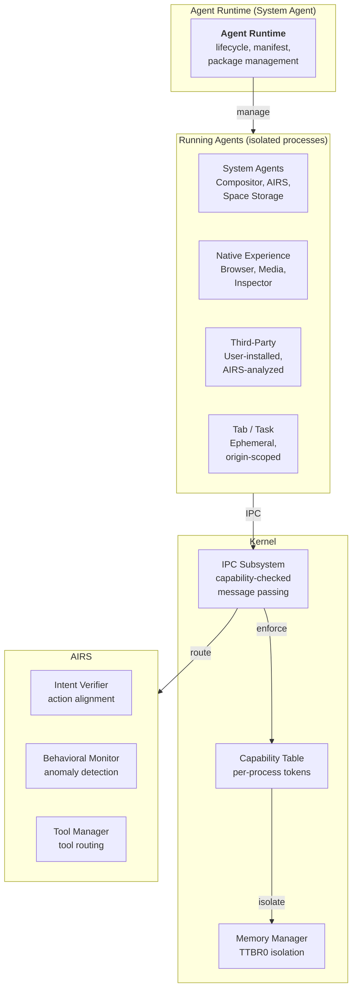
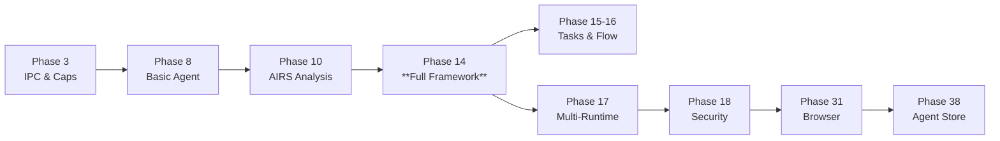

# AIOS Agent Framework

## Deep Technical Architecture

**Parent document:** [architecture.md](../project/architecture.md)
**Kit overview:** [App Kit](../kits/application/app.md) — Agent lifecycle, sandbox, SDK, Scriptable Protocol
**Related:** [ipc.md](../kernel/ipc.md) — IPC and syscall interface, [spaces.md](../storage/spaces.md) — Space storage, [tool-manager.md](../intelligence/tool-manager.md) — Tool registration and routing, [model.md](../security/model.md) — Security model, [airs.md](../intelligence/airs.md) — AI Runtime Service, [language-ecosystem.md](../project/language-ecosystem.md) — Multi-Runtime Architecture

-----

## 1. Core Insight

Agents are to AIOS what processes are to Unix — but with identity, declared capabilities, semantic context, and managed lifecycle. Every user-facing program on AIOS is an agent. The browser tabs are agents. The media player is an agent. Third-party developers write agents. The compositor is an agent. AIRS is an agent.

An agent is an isolated OS process paired with a manifest that declares what the agent is, what it needs, who wrote it, and what it has been verified to do. The kernel enforces the manifest. The Agent Runtime manages the lifecycle. The user approves the capabilities. Spaces belong to the user, never to the agent.

**What makes this different from traditional application models:**

- **Process-level isolation by default.** Each agent runs in its own address space (TTBR0). A compromised agent cannot corrupt the kernel or other agents. This is not a convention — it is enforced by hardware.

- **Capability-gated everything.** The manifest declares what an agent needs. The user approves. The kernel enforces via unforgeable capability tokens. No ambient authority. No runtime escalation.

- **Universal introspection via Scriptable Protocol.** Every agent implements the `Scriptable` trait — a standard set of verbs (GET, SET, CREATE, DELETE, COUNT, EXECUTE, SUBSCRIBE, DESCRIBE) that enables any agent to query and manipulate any other agent's properties through typed IPC. Inspired by BeOS's BMessage/BHandler scripting protocol and refined for an AI-first OS where agents need to understand each other's state without shared memory.

- **Content-addressed package model.** Agent packages are sealed, content-addressed archives (inspired by Haiku's hpkg format) with writable overlays and instant rollback. Installing an agent never modifies system state irreversibly.

- **Runtime-agnostic security.** A Python agent has the same isolation and capability model as a native Rust agent. The runtime is a performance choice, not a security choice. Rust, Python, TypeScript, and WASM agents are equivalent at the security boundary.

- **AI-native lifecycle.** AIRS analyzes agents before installation, monitors behavior at runtime, detects anomalies across the agent population, and can recommend capability adjustments. The OS understands what agents *do*, not just what they *are*.



-----

## Document Map

| Document | Sections | Content |
|---|---|---|
| **This file** | §1, §15, §16 | Core insight, implementation order, design principles |
| [anatomy.md](./agents/anatomy.md) | §2, §3 | What is an agent, categories, AgentProcess, AgentManifest, Agent Card |
| [lifecycle.md](./agents/lifecycle.md) | §4, §5 | Installation, package model, startup, states, shutdown, recovery, updates |
| [sandbox.md](./agents/sandbox.md) | §6, §7 | Isolation mechanisms, syscalls, security layer integration, causal trace DAGs |
| [sdk.md](./agents/sdk.md) | §8, §9 | SDK architecture, AgentContext, tools, macros, Scriptable Protocol, language runtimes |
| [communication.md](./agents/communication.md) | §10, §11 | IPC patterns, reactive queries, service discovery, content type registry, URL schemes |
| [distribution.md](./agents/distribution.md) | §12, §13 | Agent Store, package format, review pipeline, testing, development tools |
| [resources.md](./agents/resources.md) | §14 | Memory, CPU, network, inference budgets, resource accounting |
| [intelligence.md](./agents/intelligence.md) | §17, §18, §19 | Kernel-internal ML, AIRS-dependent intelligence, future directions |

-----

## 15. Implementation Order

Agent support is built incrementally across multiple development phases. Each phase delivers independently testable functionality.

```text
Phase 1-3: Foundation
  ├── Phase 2:  Process manager — create isolated address spaces (TTBR0)
  ├── Phase 3a: IPC — synchronous message passing between processes
  ├── Phase 3b: Capability system — kernel-managed, unforgeable tokens
  └── Phase 3c: Shared memory — zero-copy data transfer

Phase 8: Basic Agent Model
  ├── AgentProcess struct, basic lifecycle (start/stop)
  ├── Agent Runtime service (manages running agents)
  ├── Manifest parsing (minimal: name, code, capabilities)
  ├── Capability grant/revoke at agent level
  └── Lazy/eager activation modes in manifest

Phase 10: AIRS Integration
  ├── AIRS security analysis of agent code
  ├── Intent verification (Layer 1) — basic behavioral comparison
  └── SecurityAnalysis attached to manifests

Phase 14: Full Agent Framework
  ├── Complete AgentManifest (all fields, Agent Card for runtime discovery)
  ├── Agent states (Active, Paused, Suspended, Background, InputRequired, etc.)
  ├── Agent SDK — AgentContext trait, #[agent] macro
  ├── Scriptable Protocol — Scriptable trait, standard verbs, derive macro
  ├── Tool system — register, discover, call (via Tool Manager)
  ├── Rust runtime (native agents)
  ├── Event model — AgentEvent enum, event loop
  ├── Agent-to-agent IPC mediation (handoff pattern, orchestrator-as-agent)
  ├── Content type registry — handler resolution chain
  ├── Reactive queries on Spaces — predicate-based subscriptions
  └── Resource accounting (ResourceStats)

Phase 15-16: Tasks, Flow & Attention
  ├── Task agents — ephemeral agents for user intents (A2A task lifecycle)
  ├── Flow integration — FlowPush/FlowPull syscalls
  └── Attention posting from agents

Phase 17: Developer Experience & SDK
  ├── aios agent dev — development mode with hot-reload
  ├── aios agent test — hermetic testing with mock capabilities
  ├── aios agent audit — static analysis and AIRS review
  ├── aios agent publish — packaging and signing
  ├── Python runtime (RustPython + PyO3 bindings)
  ├── TypeScript runtime (QuickJS-ng + bridge)
  ├── WASM runtime (wasmtime, wasi-aios-* worlds)
  └── SLSA provenance for agent packages

Phase 18: Security Hardening
  ├── Graduated isolation (type-system → process → microVM by trust level)
  ├── Behavioral baseline and anomaly detection (Layer 3)
  ├── Multi-agent collusion detection (temporal correlation, capability union)
  ├── Adversarial defense for agent inference (Layer 5)
  ├── Blast radius containment (Layer 8)
  ├── Causal trace DAGs for incident reconstruction
  └── Full 8-layer security integration

Phase 31: Browser (Tab Agents)
  ├── Tab agents — per-origin browser tab isolation
  ├── Service worker agents — persistent background web agents
  └── Web API capability mapping

Phase 38: Agent Store
  ├── Content-addressed .aios-agent package format
  ├── Store submission and review pipeline
  ├── Automated AIRS analysis at scale
  ├── Enterprise private stores
  └── Discovery and recommendation engine
```



**Critical dependencies:**

- Agents require IPC (Phase 3) — agents cannot do anything without IPC.
- Agent SDK requires Space Storage (Phase 4) — `ctx.spaces()` needs a backend.
- Scriptable Protocol requires Tool Manager (Phase 14c) — verb dispatch routes through IPC.
- Agent analysis requires AIRS (Phase 10) — `SecurityAnalysis` needs inference.
- Tab agents require browser shell (Phase 31) — tab agent lifecycle is browser-managed.
- Agent Store requires network (Phase 24) — distribution needs connectivity.
- WASM agents require WASI integration (Phase 17) — `wasi-aios-*` worlds define the sandbox.

-----

## 16. Design Principles

1. **Agents are processes, not plugins.** Full address space isolation, not in-process sandboxing. A compromised agent cannot corrupt the kernel or other agents.

2. **Capabilities are the security boundary.** The manifest declares what an agent needs. The user approves. The kernel enforces. No runtime escalation. No ambient authority.

3. **Spaces belong to users, not agents.** An agent writes data to the user's spaces. Removing the agent does not remove the data. The user can revoke space access at any time.

4. **All runtimes are security-equivalent.** A Python agent has the same isolation and capability model as a native Rust agent. The runtime is a performance choice, not a security choice.

5. **Transparency over trust.** Every agent action is auditable. The Inspector shows exactly what every agent is doing. Resource usage, IPC traffic, space access, network requests — all visible.

6. **The SDK is generous, the sandbox is strict.** The SDK gives developers easy access to spaces, inference, tools, flow, attention, and preferences. The sandbox ensures they cannot abuse that access.

7. **Developer experience is a feature.** `aios agent dev` with hot-reload, mock services, and live logging. `aios agent test` with hermetic testing and mock capabilities. `aios agent audit` with AIRS code review. Developers should enjoy building for AIOS.

8. **Progressive trust.** System agents are fully trusted. First-party agents are pre-approved. Third-party agents are AIRS-analyzed and user-approved. Tab agents are untrusted and maximally constrained. The trust level matches the provenance.

9. **Scriptable by default.** Every agent exposes its properties and actions through the Scriptable Protocol. This enables universal introspection — any agent can query any other agent's state through typed IPC, without shared memory or custom integration code. Inspired by BeOS's BMessage scripting that made every application automatable.

10. **Packages are immutable, state is not.** Agent packages are sealed, content-addressed archives. Writable state lives in an overlay backed by Spaces. Rollback is instant because it only reverts the package, never user data. Inspired by Haiku's hpkg model.

11. **Content-typed cooperation.** Agents register as handlers for content types, not file extensions. The Content Type Registry resolves the best handler through a chain: exact match, wildcard, AIRS recommendation. Agents cooperate through content, not APIs.

12. **Orchestrators are agents.** There is no special orchestration layer. An agent that coordinates other agents is itself an agent with delegation capabilities. The IPC system provides handoff semantics — one agent transfers control to another without framework plumbing.

-----

## Cross-Reference Index

External docs reference Agent Framework sections by number. This index maps each §N.N to its sub-document:

| Section | Title | Location |
|---|---|---|
| §1 | Core Insight | This file |
| §2, §2.1–§2.3 | Agent Anatomy & Categories | [anatomy.md](./agents/anatomy.md) |
| §3, §3.1–§3.4 | AgentProcess, AgentManifest, Agent Card | [anatomy.md](./agents/anatomy.md) |
| §4, §4.1–§4.4 | Installation & Package Model | [lifecycle.md](./agents/lifecycle.md) |
| §5, §5.1–§5.6 | Startup, States, Shutdown, Recovery, Updates | [lifecycle.md](./agents/lifecycle.md) |
| §6, §6.1–§6.4 | Isolation Mechanisms & Syscalls | [sandbox.md](./agents/sandbox.md) |
| §7, §7.1–§7.4 | Security Layer Integration | [sandbox.md](./agents/sandbox.md) |
| §8, §8.1–§8.4 | SDK Architecture & AgentContext | [sdk.md](./agents/sdk.md) |
| §9, §9.1–§9.5 | Scriptable Protocol & Language Runtimes | [sdk.md](./agents/sdk.md) |
| §10, §10.1–§10.5 | IPC Patterns & Reactive Queries | [communication.md](./agents/communication.md) |
| §11, §11.1–§11.5 | Service Discovery, Content Types, URL Schemes | [communication.md](./agents/communication.md) |
| §12, §12.1–§12.4 | Agent Store & Package Format | [distribution.md](./agents/distribution.md) |
| §13, §13.1–§13.4 | Testing & Development Tools | [distribution.md](./agents/distribution.md) |
| §14, §14.1–§14.5 | Resource Budgets & Accounting | [resources.md](./agents/resources.md) |
| §15 | Implementation Order | This file |
| §16 | Design Principles | This file |
| §17, §17.1–§17.5 | Kernel-Internal ML | [intelligence.md](./agents/intelligence.md) |
| §18, §18.1–§18.4 | AIRS-Dependent Intelligence | [intelligence.md](./agents/intelligence.md) |
| §19, §19.1–§19.5 | Future Directions | [intelligence.md](./agents/intelligence.md) |
