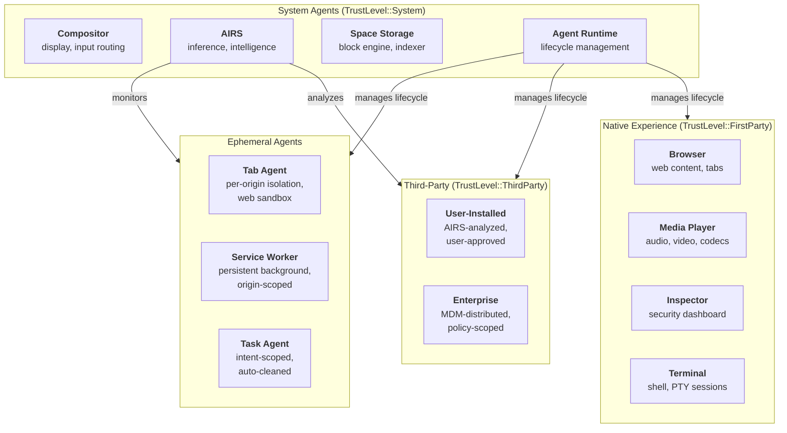

# AIOS Agent Anatomy

Part of: [agents.md](../agents.md) — Agent Framework
**Related:** [lifecycle.md](./lifecycle.md) — Agent Lifecycle, [sandbox.md](./sandbox.md) — Isolation & Security, [sdk.md](./sdk.md) — SDK & Scriptable Protocol

-----

## 2. Agent Anatomy

### 2.1 What Is an Agent

An agent is AIOS's fundamental unit of user-facing computation. Where Unix has processes and macOS has application bundles, AIOS has agents — isolated OS processes paired with a manifest that declares identity, capabilities, runtime requirements, and behavioral contract.

Every program that a user interacts with is an agent. The browser is an agent. Each browser tab is an agent. The media player is an agent. Third-party applications downloaded from the Agent Store are agents. System services like the Compositor, AIRS, and Space Storage are agents. There is no second-class category — everything is an agent, and every agent runs under the same isolation and capability model.

An agent is defined by three things:

1. **A manifest** (`AgentManifest`) — a signed, immutable declaration of what the agent is, what it needs, who wrote it, and what Scriptable suites it implements. The manifest is evaluated at installation time (by AIRS) and enforced at runtime (by the kernel).

2. **A process** (`AgentProcess`) — an isolated address space (TTBR0) with capability-gated access to system resources. The kernel enforces memory isolation, capability boundaries, and resource limits.

3. **An identity** — a content-addressed package hash that uniquely identifies the agent version. Combined with the developer's cryptographic signature, this provides a tamper-evident chain of trust from the Agent Store to the running process.

### 2.2 Agent Categories

Agents are organized into categories that determine their default trust level, resource limits, and lifecycle behavior. The category is declared in the manifest and validated by the Agent Runtime at installation.



| Category | Trust Level | Activation | Lifetime | Resource Limits | Examples |
|---|---|---|---|---|---|
| System | `System` | Boot (eager) | Permanent | Generous, kernel-level | Compositor, AIRS, Space Storage, Agent Runtime |
| Native Experience | `FirstParty` | On-demand or eager | User session | Standard | Browser, Media Player, Inspector, Terminal |
| Third-Party | `ThirdParty` | On-demand (lazy) | User session | Restricted, AIRS-monitored | User-installed apps from Agent Store |
| Tab | `Untrusted` | Navigation | Page lifetime | Minimal, origin-scoped | Browser tabs, web content |
| Service Worker | `Untrusted` | Event-driven | Persistent | Minimal, origin-scoped | Background web workers |
| Task | `ThirdParty` or `Untrusted` | Intent | Task completion | Time-boxed | AIRS-spawned ephemeral agents for user intents |

**Trust level determines capability ceiling.** A `System` agent can hold any capability. A `ThirdParty` agent can only hold capabilities declared in its manifest and approved by the user. An `Untrusted` agent receives a minimal, non-expandable capability set. See [sandbox.md](./sandbox.md) §6 for the full trust level hierarchy and [model.md](../../security/model.md) §3 for capability system internals.

-----

## 3. Core Data Structures

### 3.1 AgentProcess

`AgentProcess` is the kernel's runtime representation of a running agent. It extends the base `ProcessControl` (see `kernel/src/task/process.rs`) with agent-specific metadata, resource tracking, and behavioral monitoring state.

```rust
/// A running agent — the kernel's view of an agent process.
pub struct AgentProcess {
    /// Kernel process identifier (unique, recycled after exit).
    pub pid: ProcessId,

    /// Stable agent identifier (content hash of the signed package).
    /// Persists across restarts, updates, and device migrations.
    pub agent_id: AgentId,

    /// Capability tokens granted to this agent.
    /// Subset of what the manifest declares, filtered by user approval.
    pub capabilities: CapabilityTable,

    /// Maximum resident memory (bytes). Enforced by the kernel OOM killer.
    /// Derived from manifest.resources.memory_limit and trust level.
    pub memory_limit: usize,

    /// CPU time quota (microseconds per scheduling window).
    /// Enforced by the scheduler. Zero means unlimited (System agents only).
    pub cpu_quota: u64,

    /// IPC channels owned by this agent.
    /// Includes service channels, inter-agent channels, and system channels.
    pub ipc_channels: Vec<ChannelId>,

    /// Spaces this agent has been granted access to.
    /// Each entry specifies the Space and the access mode (read/write/admin).
    pub space_access: Vec<SpaceGrant>,

    /// The parsed, validated manifest. Immutable after installation.
    pub manifest: AgentManifest,

    /// Current lifecycle state.
    pub state: AgentState,

    /// Resource consumption statistics, updated by the kernel at tick granularity.
    pub resource_stats: ResourceStats,

    /// Behavioral baseline computed by the Behavioral Monitor (Layer 3).
    /// Used for anomaly detection — deviation from baseline triggers alerts.
    pub behavioral_baseline: Option<BehavioralBaseline>,

    /// Parent agent (if spawned by another agent, e.g., browser spawns tab agents).
    pub parent: Option<AgentId>,

    /// Child agents spawned by this agent.
    pub children: Vec<AgentId>,

    /// Monotonic timestamp (ticks) when the agent was started.
    pub started_at: u64,

    /// Associated task, if this agent was spawned to fulfill a user intent.
    /// Links to the Task Manager for lifecycle coordination.
    pub task: Option<TaskId>,
}
```

**Key invariants:**

- `capabilities` is always a subset of `manifest.capabilities`. The kernel rejects any attempt to acquire a capability not declared in the manifest.
- `memory_limit` and `cpu_quota` are set at startup from the manifest and trust level. They can be adjusted downward by the Behavioral Monitor but never upward without user approval.
- `space_access` is capability-gated. An agent can only access Spaces for which it holds a valid `SpaceAccess` capability token.
- `behavioral_baseline` is `None` during the learning period (first N sessions). Once established, deviations trigger escalation through the Behavioral Monitor (see [behavioral-monitor.md](../../intelligence/behavioral-monitor.md) §5).

```rust
/// Resource consumption snapshot, updated every scheduler tick.
pub struct ResourceStats {
    /// CPU time consumed (microseconds).
    pub cpu_time_us: u64,
    /// Peak resident memory (bytes).
    pub memory_peak: usize,
    /// Current resident memory (bytes).
    pub memory_current: usize,
    /// IPC messages sent since startup.
    pub ipc_messages_sent: u64,
    /// IPC messages received since startup.
    pub ipc_messages_received: u64,
    /// Inference tokens consumed (for agents using AIRS).
    pub inference_tokens: u64,
    /// Network bytes transferred (sent + received).
    pub network_bytes: u64,
    /// Storage bytes written to Spaces.
    pub storage_bytes_written: u64,
}
```

### 3.2 AgentManifest

The `AgentManifest` is a signed, immutable declaration that travels with the agent package. It is evaluated by AIRS at installation time, validated by the Agent Runtime at startup, and enforced by the kernel throughout the agent's lifetime.

```rust
/// Signed agent manifest — the contract between agent, user, and kernel.
pub struct AgentManifest {
    // ── Identity ──────────────────────────────────────────────────
    /// Reverse-DNS identifier (e.g., "com.example.notes").
    pub id: String,
    /// Human-readable display name.
    pub name: String,
    /// Semantic version (semver).
    pub version: Version,
    /// Developer or organization identity (verified via code signing).
    pub author: DeveloperIdentity,
    /// Content hash of the signed package (SHA-256).
    pub package_hash: ContentHash,

    // ── Runtime ───────────────────────────────────────────────────
    /// Language runtime required to execute this agent.
    pub runtime: RuntimeType,
    /// Entry point within the package (e.g., "src/main.rs", "main.py").
    pub entry_point: String,
    /// Minimum AIOS version required.
    pub min_os_version: Version,
    /// Activation mode: eager (start at boot/login) or lazy (start on demand).
    pub activation: ActivationMode,

    // ── Capabilities ──────────────────────────────────────────────
    /// Capabilities this agent requests. Each entry includes a human-readable
    /// justification displayed to the user during the approval prompt.
    pub capabilities: Vec<CapabilityRequest>,

    // ── Resources ─────────────────────────────────────────────────
    /// Resource limits declared by the developer.
    pub resources: ResourceLimits,

    // ── Content Handling ──────────────────────────────────────────
    /// Content types this agent can open (e.g., "text/markdown", "image/png").
    pub content_types: Vec<ContentTypeHandler>,
    /// URL schemes this agent handles (e.g., "https", "aios-notes").
    pub url_schemes: Vec<String>,

    // ── Scriptable Protocol ───────────────────────────────────────
    /// Scriptable suites this agent implements.
    /// Every agent gets a default suite (Name, State, Version, Capabilities)
    /// automatically. This field declares additional domain-specific suites.
    /// See [sdk.md](./sdk.md) §9 for the Scriptable trait and verb semantics.
    pub scriptable: ScriptableDeclaration,

    // ── Inter-Agent ───────────────────────────────────────────────
    /// Services this agent provides (registered with Service Manager).
    pub services: Vec<ServiceDeclaration>,
    /// Services this agent depends on (must be available at startup).
    pub dependencies: Vec<ServiceDependency>,

    // ── Security ──────────────────────────────────────────────────
    /// AIRS security analysis result, attached at installation time.
    /// None for pre-analyzed system agents.
    pub security_analysis: Option<SecurityAnalysis>,
    /// Privacy manifest — declares what data the agent accesses and why.
    /// See [privacy.md](../../security/privacy.md) §3 for the privacy manifest model.
    pub privacy: PrivacyManifest,

    // ── Agent Card Generation ─────────────────────────────────────
    /// Hints for generating the runtime Agent Card (§3.4).
    /// These are static declarations that the Agent Runtime merges with
    /// runtime state to produce the full Agent Card.
    pub card_hints: AgentCardHints,

    // ── Scheduling ────────────────────────────────────────────────
    /// Preferred scheduler class. The kernel may override based on
    /// actual behavior and trust level.
    pub schedule: AgentSchedule,
}
```

**Supporting types:**

```rust
/// Activation mode determines when the Agent Runtime starts this agent.
pub enum ActivationMode {
    /// Start at boot (system agents) or user login (experience agents).
    /// The agent remains running until explicitly stopped or the session ends.
    Eager,
    /// Start on first use — when the user opens a content type this agent
    /// handles, when another agent sends it a message, or when AIRS
    /// determines the agent is needed for a task.
    Lazy,
}

/// Scriptable suites declared in the manifest.
pub struct ScriptableDeclaration {
    /// Additional suites beyond the default agent suite.
    /// Each suite is a named collection of properties and supported verbs.
    /// Example: a text editor might declare suites for "Document", "Selection",
    /// "Font", and "View" — each with GET/SET/SUBSCRIBE support.
    pub suites: Vec<SuiteName>,

    /// Whether this agent supports the SUBSCRIBE verb for reactive queries.
    /// Agents that declare subscribe_support = true must implement the
    /// subscription protocol (see [communication.md](./communication.md) §10).
    pub subscribe_support: bool,

    /// Whether this agent supports the DESCRIBE verb for full introspection.
    /// Always true for agents that declare any custom suites.
    /// Allows AIRS and other agents to discover the property schema at runtime.
    pub describe_support: bool,
}

/// Resource limits declared by the developer.
pub struct ResourceLimits {
    /// Maximum resident memory (bytes). Default: 256 MiB.
    pub memory_limit: usize,
    /// CPU quota (microseconds per 100ms window). Default: 50_000 (50%).
    pub cpu_quota: u64,
    /// Maximum IPC messages per second. Default: 1000.
    pub ipc_rate_limit: u32,
    /// Maximum inference tokens per session. Default: 0 (no inference).
    pub inference_budget: u64,
    /// Maximum network bandwidth (bytes/sec). Default: 0 (no network).
    pub network_bandwidth: u64,
    /// Maximum storage write rate (bytes/sec). Default: 1 MiB/sec.
    pub storage_write_rate: u64,
}

/// Hints for Agent Card generation.
pub struct AgentCardHints {
    /// Short description of what this agent does (one sentence).
    pub description: String,
    /// Skills this agent provides, in natural language.
    /// Example: ["Edit Markdown documents", "Export to PDF"].
    pub skills: Vec<String>,
    /// Icon path within the package.
    pub icon: Option<String>,
    /// Supported input content types for agent-to-agent delegation.
    pub input_content_types: Vec<String>,
    /// Output content types this agent can produce.
    pub output_content_types: Vec<String>,
}
```

### 3.3 RuntimeType and AgentSchedule

Agents can be written in any supported runtime. The `RuntimeType` determines which language runtime the Agent Runtime loads, what isolation boundaries apply, and how the entry point is invoked. All runtimes share the same security model — the runtime is a performance choice, not a security choice. See [language-ecosystem.md](../../project/language-ecosystem.md) for the full multi-runtime architecture.

```rust
/// Language runtime for agent execution.
pub enum RuntimeType {
    /// Native Rust agent — compiled to aarch64, loaded as an ELF binary.
    /// Fastest startup, lowest overhead, direct syscall access.
    Native,

    /// Python agent — executed via RustPython with PyO3 bindings.
    /// Access to the AIOS SDK through the `aios` Python package.
    Python,

    /// TypeScript/JavaScript agent — executed via QuickJS-ng.
    /// Access to the AIOS SDK through the `@aios/sdk` package.
    TypeScript,

    /// WebAssembly agent — executed via wasmtime with wasi-aios-* worlds.
    /// Portable across AIOS versions. Strongest isolation (WASM sandbox
    /// inside process sandbox).
    Wasm,
}
```

```rust
/// Scheduling preferences declared by the agent.
pub enum AgentSchedule {
    /// Real-time class (4ms quantum). For audio processing, input handling,
    /// and other latency-sensitive agents. Requires RT capability.
    RealTime,

    /// Interactive class (10ms quantum). Default for user-facing agents.
    /// Prioritized when the agent has compositor focus.
    Interactive,

    /// Normal class (50ms quantum). For background processing,
    /// indexing, and batch operations.
    Normal,

    /// Idle class (50ms quantum, lowest priority). For maintenance tasks
    /// that should only run when the system is otherwise idle.
    Idle,
}
```

The kernel treats the manifest's `schedule` field as a *preference*, not a directive. An agent declaring `RealTime` without the `SchedulerRealTime` capability is silently downgraded to `Interactive`. An agent whose behavioral baseline shows CPU-bound batch patterns may be downgraded from `Interactive` to `Normal` by the Runtime Advisor (see [runtime-advisor.md](../../intelligence/runtime-advisor.md) §3).

### 3.4 Agent Card (Runtime Discovery)

The Agent Card is a runtime-discoverable metadata descriptor that extends the static manifest with live state. Where the manifest is sealed at package time, the Agent Card reflects the agent's current capabilities, availability, and operational state. Other agents and AIRS query Agent Cards through the Scriptable Protocol's `DESCRIBE` verb to understand what a running agent can do right now.

This is inspired by [Google's A2A Protocol](https://google.github.io/A2A/) Agent Card concept — a JSON-like descriptor that enables runtime discovery and capability negotiation between agents.

```rust
/// Runtime-discoverable agent metadata.
/// Generated by the Agent Runtime from the manifest + live state.
/// Queryable via the Scriptable Protocol: DESCRIBE Agent.
pub struct AgentCard {
    // ── Identity (from manifest) ──────────────────────────────────
    /// Agent identifier.
    pub id: AgentId,
    /// Display name.
    pub name: String,
    /// Version.
    pub version: Version,
    /// Short description.
    pub description: String,

    // ── Runtime State ─────────────────────────────────────────────
    /// Current lifecycle state.
    pub state: AgentState,
    /// Whether the agent is accepting new IPC connections.
    pub accepting_connections: bool,
    /// Current resource pressure (0.0 = idle, 1.0 = at limit).
    pub resource_pressure: f32,

    // ── Capabilities (live) ───────────────────────────────────────
    /// Skills this agent can perform right now.
    /// Filtered by current state — a paused agent reports no skills.
    pub active_skills: Vec<SkillDescriptor>,
    /// Content types this agent can currently handle.
    pub supported_content_types: Vec<String>,
    /// Scriptable suites currently available.
    /// Includes the default suite plus any domain-specific suites.
    pub scriptable_suites: Vec<SuiteDescriptor>,

    // ── Discovery ─────────────────────────────────────────────────
    /// IPC channel for sending Scriptable Protocol messages.
    /// Other agents use this channel to send GET/SET/EXECUTE/SUBSCRIBE
    /// verbs. Capability-gated — the caller must hold ChannelAccess.
    pub scriptable_channel: ChannelId,
    /// Protocol version for Scriptable messages.
    pub protocol_version: u32,

    // ── Delegation ────────────────────────────────────────────────
    /// Content types this agent accepts as input from other agents.
    pub input_content_types: Vec<String>,
    /// Content types this agent can produce as output.
    pub output_content_types: Vec<String>,
    /// Whether this agent supports the A2A-style task lifecycle
    /// (submitted → working → input-required → completed → failed).
    pub supports_task_lifecycle: bool,
}
```

```rust
/// A skill that an agent can perform, described for discovery.
pub struct SkillDescriptor {
    /// Machine-readable skill identifier.
    pub id: String,
    /// Human-readable description.
    pub description: String,
    /// Input schema (content types accepted).
    pub input_types: Vec<String>,
    /// Output schema (content types produced).
    pub output_types: Vec<String>,
    /// Required capabilities to invoke this skill.
    pub required_capabilities: Vec<Capability>,
}

/// A Scriptable suite descriptor for runtime discovery.
pub struct SuiteDescriptor {
    /// Suite name (e.g., "Document", "Selection", "Playback").
    pub name: String,
    /// Properties exposed by this suite.
    pub properties: Vec<PropertyDescriptor>,
    /// Verbs supported (subset of GET, SET, CREATE, DELETE, COUNT,
    /// EXECUTE, SUBSCRIBE, DESCRIBE).
    pub supported_verbs: Vec<ScriptableVerb>,
}

/// A single property in a Scriptable suite.
pub struct PropertyDescriptor {
    /// Property name (e.g., "Title", "FontSize", "Volume").
    pub name: String,
    /// Value type (String, Integer, Float, Bool, Bytes, List, Object).
    pub value_type: PropertyType,
    /// Whether this property is read-only.
    pub read_only: bool,
    /// Whether this property supports SUBSCRIBE for change notifications.
    pub subscribable: bool,
    /// Capability required to access this property, if any.
    pub capability: Option<Capability>,
}
```

**Agent Card lifecycle:**

1. **Generation.** The Agent Runtime constructs the Agent Card when the agent starts, merging manifest `card_hints` with runtime state.
2. **Registration.** The card is registered with the Service Manager, making it discoverable via service lookup.
3. **Updates.** The Agent Runtime updates the card when agent state changes (e.g., paused, resource pressure changes, new suites registered dynamically).
4. **Query.** Other agents query the card via `DESCRIBE Agent` on the agent's scriptable channel. AIRS queries cards to build its capability map for tool selection and multi-agent orchestration.
5. **Expiry.** The card is deregistered when the agent exits. Stale cards are garbage-collected by the Agent Runtime.

**Relationship to Tool Manager:** The Tool Manager (see [tool-manager.md](../../intelligence/tool-manager.md)) builds its `ToolRegistry` from Agent Cards. Each skill in an Agent Card becomes a registered tool with the Tool Manager's additional metadata (safety level, timeout, the 7-stage execution pipeline). The Agent Card is the discovery mechanism; the Tool Manager is the safe execution layer.

**Relationship to MCP:** Agent Cards serve a similar role to MCP tool definitions for native AIOS agents. The Tool Manager bridges both — external MCP tools and native Agent Card skills appear in a unified tool registry. See [tool-manager/interop.md](../../intelligence/tool-manager/interop.md) §10 for MCP bridge details.

-----

## Cross-References

| Topic | Document | Sections |
|---|---|---|
| Agent lifecycle and states | [lifecycle.md](./lifecycle.md) | §4, §5 |
| Process isolation and syscalls | [sandbox.md](./sandbox.md) | §6, §7 |
| Scriptable Protocol implementation | [sdk.md](./sdk.md) | §9 |
| Capability system internals | [model.md](../../security/model.md) | §3 |
| Behavioral Monitor baselines | [behavioral-monitor.md](../../intelligence/behavioral-monitor.md) | §5 |
| Tool Manager and discovery | [tool-manager.md](../../intelligence/tool-manager.md) | §3, §4 |
| Multi-runtime architecture | [language-ecosystem.md](../../project/language-ecosystem.md) | §2-§5 |
| Privacy manifests | [privacy.md](../../security/privacy.md) | §3 |
| IPC patterns and delegation | [communication.md](./communication.md) | §10, §11 |
| Resource budgets | [resources.md](./resources.md) | §14 |
