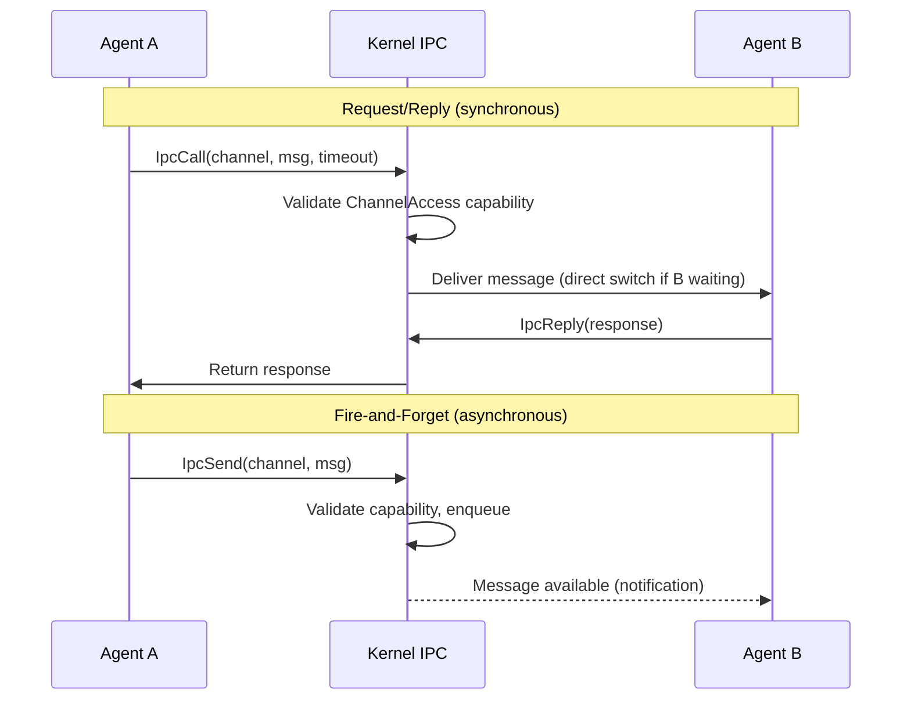
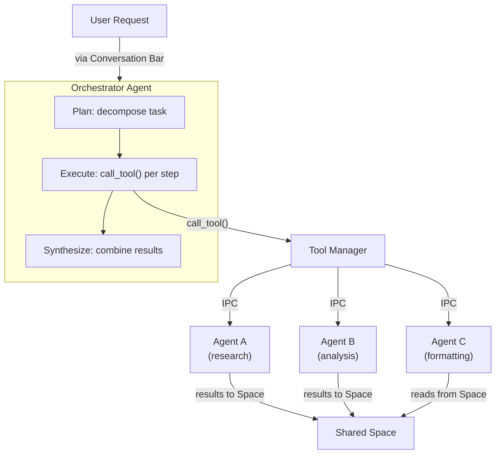
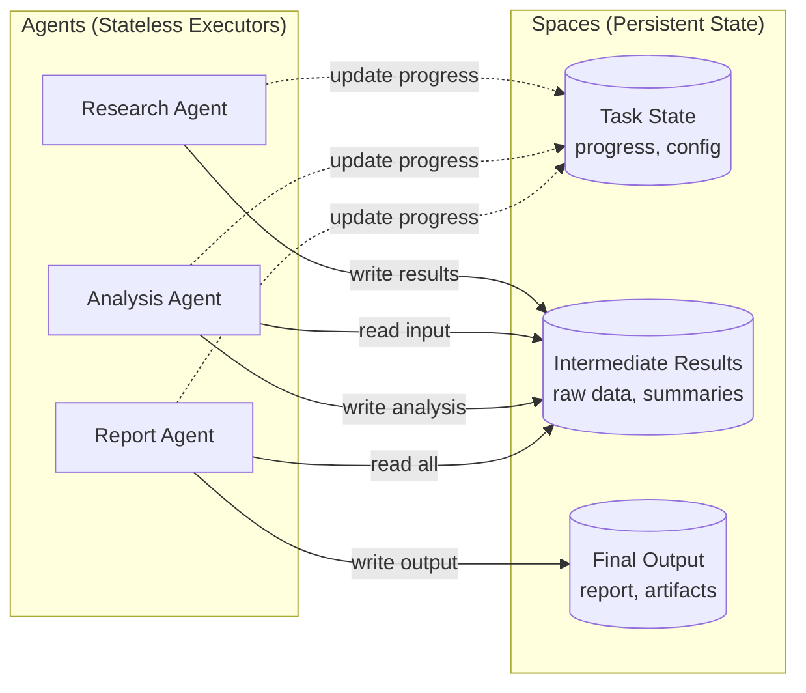
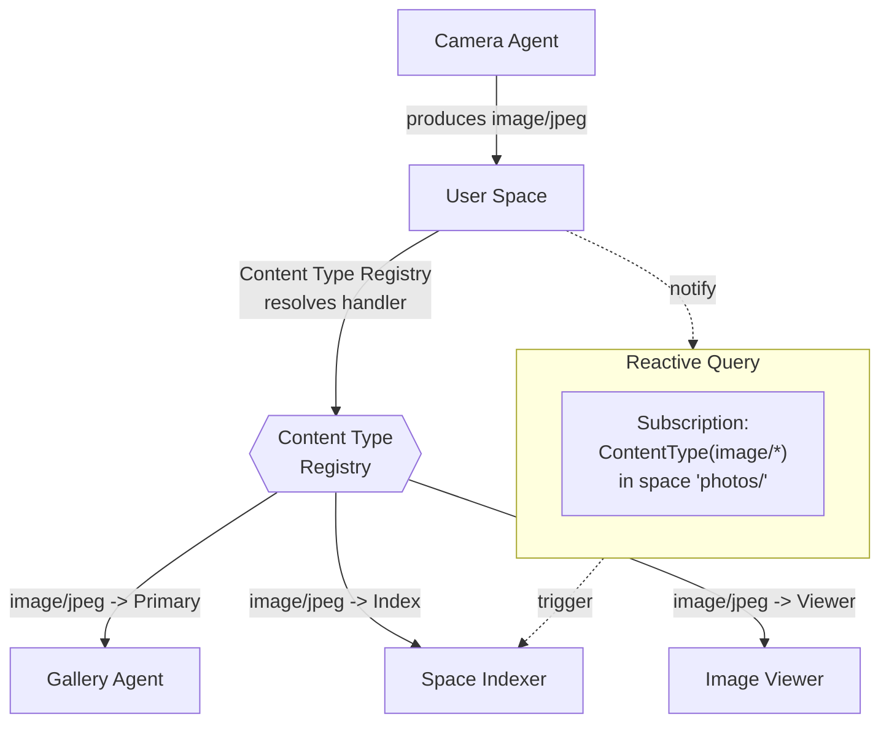

# AIOS Agent Communication

Part of: [agents.md](../agents.md) — Agent Framework
**Related:** [sdk.md](./sdk.md) — SDK & Scriptable Protocol, [sandbox.md](./sandbox.md) — Isolation, [anatomy.md](./anatomy.md) — Agent anatomy

-----

## 10. IPC Patterns & Reactive Queries

Agent communication in AIOS is built on the kernel's IPC subsystem — typed, capability-checked message passing across process boundaries. Agents never share memory directly. Every inter-agent interaction flows through kernel channels, giving the system complete visibility into communication patterns for security auditing, behavioral monitoring, and causal trace reconstruction.

This section covers the communication patterns that agents use to coordinate work, and the reactive query system that lets agents respond to changes in Spaces without polling.

### 10.1 Agent-to-Agent IPC

All agent-to-agent communication uses kernel IPC channels. Messages are typed by convention (the SDK provides typed wrappers), serialized into the 256-byte inline payload of `RawMessage`, and validated against capability tokens at every crossing.



**Message typing.** The kernel treats messages as opaque byte arrays (up to `MAX_MESSAGE_SIZE` = 256 bytes). The Agent SDK adds typed serialization on top — each message carries a type tag in its first 4 bytes that the receiver uses for dispatch. Messages that exceed the inline payload size use shared memory regions for zero-copy transfer, with the `RawMessage` carrying a `SharedMemoryId` reference instead of inline data.

**Capability enforcement at every hop.** The kernel checks `ChannelAccess(channel_id)` on every `ipc_call`, `ipc_send`, and `ipc_recv`. An agent cannot send a message to a channel it does not hold a capability for. Capability delegation enables controlled communication graphs — Agent A can grant Agent B access to a specific channel without granting access to all of Agent A's channels. See [model/capabilities.md](../../security/model/capabilities.md) §3.3 for attenuation rules.

**No direct memory sharing.** Agents occupy separate TTBR0 address spaces. The only data path between agents is through IPC messages or explicitly created shared memory regions (which require `SharedMemoryCreate` / `SharedMemoryAccess` capabilities and enforce W^X at the page level). This isolation is hardware-enforced — there is no API to bypass it.

**Direct switch optimization.** When Agent A calls Agent B through `IpcCall` and Agent B is already blocked in `IpcRecv` on that channel, the kernel performs a direct context switch — saving A's registers and restoring B's without going through the scheduler. This reduces round-trip latency to sub-5 microseconds.

For the full IPC subsystem internals (channel lifecycle, message rings, direct switch, priority inheritance, timeouts), see [ipc.md](../../kernel/ipc.md).

### 10.2 Handoff Pattern

The handoff pattern enables one agent to transfer control of a task to another agent. Inspired by the OpenAI Agents SDK concept of agent handoffs, AIOS implements this as a clean IPC semantic: an agent produces a `HandoffRequest` and the Agent Runtime routes it to the target. No special orchestration layer is needed.

```rust
/// An agent requests handoff by sending this to the Agent Runtime.
pub struct HandoffRequest {
    /// The agent to transfer control to.
    pub target: AgentId,

    /// Serialized context for the target agent.
    /// Stored as a Space object so it survives agent restarts.
    pub context: Value,

    /// Capabilities to delegate to the target (attenuated from source's set).
    pub delegated_capabilities: Vec<Capability>,

    /// What happens to the source agent after handoff.
    pub source_disposition: HandoffDisposition,
}

#[derive(Clone, Copy)]
pub enum HandoffDisposition {
    /// Source pauses and resumes when target completes.
    PauseUntilComplete,
    /// Source continues running in parallel.
    ContinueParallel,
    /// Source terminates (one-way handoff).
    Terminate,
}
```

**How handoff works at the IPC level:**

1. Agent A sends a `HandoffRequest` to the Agent Runtime via its management channel.
2. The Agent Runtime validates that Agent A holds capabilities it wants to delegate.
3. The Agent Runtime attenuates the capabilities (delegation can only narrow, never widen).
4. The runtime stores `context` as a Space object in `ephemeral/handoffs/{handoff_id}`.
5. The runtime starts or activates Agent B, grants the delegated capabilities, and delivers a `HandoffAccept` message containing the `handoff_id`.
6. Agent B reads the context from the Space, performs its work, and sends a `HandoffComplete` message.
7. The Agent Runtime cleans up: revokes delegated capabilities, removes the context object, and notifies Agent A (if it was paused).

**Why handoff is not just "call another agent."** A regular `ipc_call` keeps the caller blocked until the callee replies. Handoff transfers ownership of a task — the source agent can pause, continue, or terminate. The context lives in a Space (not in a message buffer), so it survives agent crashes. And the delegated capabilities are scoped to the handoff, automatically revoked when the handoff completes.

### 10.3 Orchestrator-as-Agent Pattern

An orchestrator in AIOS is just another agent — one that coordinates other agents by invoking their tools through the standard Tool Manager. There is no framework-level orchestration layer, no special process type, no privileged coordination bus. This design is informed by CrewAI's approach where a "manager" agent delegates to specialists, but AIOS goes further: state lives in Spaces rather than in the orchestrator's memory.



**Key properties:**

- **State lives in Spaces, not in the orchestrator.** Intermediate results, task progress, and coordination metadata are written to a shared Space. If the orchestrator crashes, another instance resumes from the persisted state.

- **Delegation through `call_tool()`.** The orchestrator invokes other agents' tools through the Tool Manager (see [tool-manager.md](../../intelligence/tool-manager.md)), which handles capability checking, timeout enforcement, and audit logging.

- **No privilege escalation.** The orchestrator has its own manifest, trust level, and capability set. It cannot grant capabilities it does not hold. Attenuated delegation is the only path.

- **AIRS can serve as orchestrator.** For user-initiated complex tasks, AIRS acts as the orchestrator — decomposing user intent into tool calls, dispatching them to appropriate agents, and synthesizing results. It uses the same `call_tool()` and Space persistence that any orchestrator agent would use.

### 10.4 Session-Scoped Interactions

Multi-turn interactions between agents require context isolation. Inspired by Google A2A's task model, each task in AIOS gets a session ID that isolates its context from concurrent tasks. Session state is stored in Spaces, enabling parallel tasks without context bleeding.

```rust
/// A session scopes a multi-agent interaction.
pub struct AgentSession {
    /// Unique session identifier, generated by the Agent Runtime.
    pub session_id: SessionId,
    /// The agent that initiated the session.
    pub initiator: AgentId,
    /// Agents currently participating in this session.
    pub participants: Vec<AgentId>,
    /// Space path where session state is stored.
    pub state_space: SpacePath,
    /// Session-scoped capabilities (revoked when session ends).
    pub session_capabilities: Vec<CapabilityHandle>,
    /// Current session status.
    pub status: SessionStatus,
}

#[derive(Clone, Copy)]
pub enum SessionStatus {
    /// Session is active and accepting messages.
    Active,
    /// Session is waiting for a participant's response.
    Waiting,
    /// Session completed successfully.
    Completed,
    /// Session failed or was cancelled.
    Failed,
}
```

**Context isolation per task.** Each session creates a Space path under `ephemeral/sessions/{session_id}/`. All intermediate state — context, partial results, coordination metadata — lives there. When the session completes, the Agent Runtime cleans up the entire subtree. Concurrent sessions from the same user operate on independent Space paths, preventing one task's context from leaking into another.

**Session-scoped capabilities.** The Agent Runtime creates temporary capability tokens tied to the session's lifetime. When a session includes Agent B (which normally has no access to Agent A's data), the runtime grants a session-scoped `SpaceRead` capability limited to the session's Space path. This capability is automatically revoked when the session ends — no cleanup logic in the agents themselves.

**Lifecycle integration.** Sessions participate in the agent lifecycle state machine. If an agent pauses (transitions to `Background`), its active sessions are suspended. If an agent crashes, the Agent Runtime notifies all session participants via `SessionEvent::ParticipantLeft`, allowing graceful degradation. The session state in Spaces survives the crash, enabling recovery by a restarted agent instance.

### 10.5 Reactive Queries on Spaces

Agents subscribe to Space changes matching predicates, receiving notifications when objects are created, modified, or deleted. This eliminates polling and enables declarative, event-driven agent architectures. The concept derives from BeOS's BFS live queries — queries that remain open and push `B_QUERY_UPDATE` messages as results change — but builds on the Space Indexer rather than the filesystem, enabling semantic queries (not just attribute filters) to be reactive.

```rust
/// A subscription to Space changes matching a predicate.
pub struct QuerySubscription {
    /// Unique subscription identifier.
    pub id: SubscriptionId,
    /// The Space being watched.
    pub space_id: SpaceId,
    /// The predicate that filters matching changes.
    pub predicate: QueryPredicate,
    /// How updates are delivered.
    pub mode: SubscriptionMode,
    /// The callback channel for delivering updates.
    pub callback: ChannelId,
}

/// Controls update delivery timing.
#[derive(Clone)]
pub enum SubscriptionMode {
    /// Deliver each matching change immediately as it occurs.
    Immediate,
    /// Batch changes and deliver after a quiet period.
    Debounced(Duration),
    /// Aggregate changes into periodic digest summaries.
    Digest(Duration),
}
```

**Predicate-based subscriptions.** Agents subscribe with a `QueryPredicate` that specifies which Space changes are interesting. The Space Indexer evaluates predicates against incoming changes and delivers only matching updates.

```rust
/// Predicates for filtering Space changes.
pub enum QueryPredicate {
    /// Match objects with a specific content type.
    ContentType(ContentType),
    /// Match objects whose name matches a glob pattern.
    NamePattern(GlobPattern),
    /// Match objects with specific metadata key-value pairs.
    MetadataMatch { key: String, value: Value },
    /// Match all changes under a path prefix.
    PathPrefix(SpacePath),
    /// Combine predicates with boolean logic.
    And(Vec<QueryPredicate>),
    Or(Vec<QueryPredicate>),
    Not(Box<QueryPredicate>),
}
```

**Update delivery.** When a matching change occurs, the Space Indexer constructs a `QueryUpdate` and delivers it to the subscriber's callback channel:

```rust
/// Notification of a Space change matching a subscription.
pub struct QueryUpdate {
    /// The object that changed.
    pub object_id: ObjectId,
    /// What kind of change occurred.
    pub change_type: ChangeType,
    /// A snapshot of the object at the time of the change.
    pub snapshot: CompactObject,
    /// The subscription that matched this change.
    pub subscription_id: SubscriptionId,
}

#[derive(Clone, Copy)]
pub enum ChangeType {
    /// A new object was created in the Space.
    Created,
    /// An existing object was modified.
    Modified,
    /// An object was deleted from the Space.
    Deleted,
}
```

**System limits.** Reactive queries consume kernel and indexer resources. The system enforces hard limits:

| Resource | Limit |
| --- | --- |
| Subscriptions per agent | 32 |
| Subscriptions system-wide | 1024 |
| Predicate nesting depth | 8 levels |
| Digest minimum interval | 1 second |
| Debounce minimum quiet period | 100 ms |

**Predicate indexing.** The Space Indexer indexes active subscriptions by predicate type for efficient matching. When an object changes, the indexer looks up subscriptions by `content_type`, `name_pattern`, or `path_prefix` — it does not evaluate every subscription against every change. This keeps the cost of reactive queries proportional to the number of matching subscriptions, not the total subscription count.

**Capability scoping.** A reactive query only receives notifications for objects the subscriber has capability to access. The Space Indexer evaluates capabilities at notification delivery time, not at subscription time — so if an agent's capability is revoked, it silently stops receiving updates for objects it can no longer access.

**Lifetime.** Subscriptions die with the subscribing agent. When an agent terminates (cleanly or by crash), all its subscriptions are removed. Persistent subscriptions (for system-level feeds like "notify AIRS when any document changes") are stored as Space metadata and re-registered by the subscribing system agent at boot.

For the Space Indexer internals that power reactive queries, see [space-indexer/search-integration.md](../../intelligence/space-indexer/search-integration.md) §8.

-----

## 11. Service Discovery, Content Type Registry & URL Schemes

Agents need to find each other, discover what content types are handled, and address system resources uniformly. This section covers the service discovery mechanism, the content type registry that routes content to handler agents, and the URL scheme model that gives every AIOS resource a canonical address.

### 11.1 Service Discovery

The Service Manager provides a name-based registry where agents register services and other agents look them up. This is the mechanism by which an agent discovers the IPC channel for Space Storage, AIRS, the Compositor, or any other system service.

```rust
/// Register a named service with the Service Manager.
/// The service_name is a UTF-8 string (up to 64 bytes).
/// The channel_id is the IPC channel that serves requests.
pub fn service_register(
    service_name: &ServiceName,
    pid: ProcessId,
    channel_id: ChannelId,
) -> Result<(), ServiceError>;

/// Look up a service by name. Returns the channel ID for IPC.
pub fn service_lookup(
    service_name: &ServiceName,
) -> Option<ChannelId>;

/// Register for notification when a service process exits.
/// Enables cleanup when a dependency crashes.
pub fn service_on_death(
    service_name: &ServiceName,
    notify_channel: ChannelId,
) -> Result<(), ServiceError>;
```

**Death notifications for cleanup.** When a service crashes, the Service Manager sends a death notification to all agents that registered interest via `service_on_death`. This enables dependent agents to reconnect, fall back to degraded mode, or clean up resources associated with the dead service. The Agent Runtime uses death notifications to trigger restart policies for system services.

**Discovery at agent startup.** The Agent SDK's `AgentContext::init()` automatically looks up well-known services (Space Storage, AIRS, Compositor, Flow) and caches the channel IDs. Third-party agents discover custom services via `ctx.service_lookup("my-service")`, which returns `None` if the service is not registered — enabling graceful degradation when optional services are unavailable.

For the Service Manager implementation details (registry capacity, echo service, audit ring), see `kernel/src/service/mod.rs`.

### 11.2 Content Type Registry

The Content Type Registry maps content types to handler agents. When a user opens a document, the system resolves which agent should handle it through a resolution chain: exact match, wildcard match, then AIRS recommendation. This design is rooted in BeOS's Registrar and MIME database, which maintained a system-wide type-to-handler mapping with `BRoster::Launch()` for opening files with the preferred handler.

```rust
/// System-wide registry mapping content types to handler agents.
pub struct ContentTypeRegistry {
    /// Exact MIME type to handler mappings.
    handlers: BTreeMap<MimeType, Vec<HandlerEntry>>,
    /// Wildcard supertype to handler mappings (e.g., "text/*").
    wildcard_handlers: BTreeMap<MimeType, Vec<HandlerEntry>>,
    /// Content sniffing rules for type detection from byte patterns.
    sniff_rules: Vec<SniffRule>,
}

/// A registered handler for a content type.
pub struct HandlerEntry {
    /// The agent that handles this content type.
    pub agent_id: AgentId,
    /// The handler's role (determines resolution priority).
    pub role: HandlerRole,
    /// Priority within the same role (higher wins).
    pub priority: u16,
}

#[derive(Clone, Copy, PartialEq, Eq, PartialOrd, Ord)]
pub enum HandlerRole {
    /// The primary handler — opens this type by default.
    Primary,
    /// Can view but not edit this type.
    Viewer,
    /// Can edit this type.
    Editor,
    /// Can convert this type to other types.
    Converter,
}
```

**Resolution chain.** When the system needs a handler for a content type:

```text
1. Exact type match (e.g., "text/markdown")
   -> Return highest-priority Primary handler

2. Wildcard supertype match (e.g., "text/*")
   -> Return highest-priority handler for the supertype

3. AIRS recommendation
   -> AIRS analyzes content and suggests a handler
   -> Only used when no static handler is registered

4. User override (always wins)
   -> User can choose a different handler via "open with" UI
   -> Choice is persisted in the Preference service
```

**Content type declaration in manifests.** Agents declare what content types they handle in their `AgentManifest`. The Agent Runtime registers these declarations with the Content Type Registry at agent activation.

```rust
/// Declared in the AgentManifest.
pub struct ContentTypeDeclaration {
    /// The MIME type this agent handles.
    pub content_type: MimeType,
    /// What the agent can do with this type.
    pub verbs: Vec<ContentVerb>,
    /// Optional icon for this content type association.
    pub icon: Option<IconRef>,
}

/// Actions an agent can perform on a content type.
#[derive(Clone, Copy)]
pub enum ContentVerb {
    Open,
    Edit,
    View,
    Convert,
    Print,
    Share,
    /// Index for search (used by Space Indexer).
    Index,
}
```

**Dynamic registration at runtime.** Beyond manifest declarations, agents can dynamically register and unregister content type handlers at runtime. This supports agents that discover new capabilities after installation (e.g., a codec agent that downloads additional format support). Dynamic registration requires the `ContentTypeRegister` capability and is audited.

**Content sniffing.** When an object lacks content type metadata, the registry falls back to byte-pattern detection:

```rust
/// A rule for detecting content type from file contents.
pub struct SniffRule {
    /// Byte offset from the start of the content.
    pub offset: usize,
    /// Byte pattern to match.
    pub pattern: Vec<u8>,
    /// Optional mask (AND with content bytes before comparison).
    pub mask: Option<Vec<u8>>,
    /// The content type this pattern indicates.
    pub detected_type: MimeType,
    /// Priority (higher priority rules checked first).
    pub priority: u16,
}
```

The sniff rule set is populated from agent manifests (agents can declare sniff rules for their content types) and from a built-in set of common patterns (PNG magic bytes, PDF header, ZIP local file header, etc.).

### 11.3 URL Scheme Resource Model

AIOS uses URL schemes to give every system resource a canonical, capability-gated address. The `space:` scheme is the primary addressing mechanism for user data, with additional schemes for other resource types. This concept draws from Redox OS, which models every system resource as a URL scheme (`file:`, `tcp:`, `display:`), but integrates with AIOS's capability system for access control.

```text
space://workspace/documents/report.pdf    -> Space Storage service
agent://pdf-viewer/current-document       -> Agent Scriptable interface
flow://clipboard/current                  -> Flow service
device://display/hdmi-1                   -> Device subsystem
```

The `SchemeRegistry` lives in the Service Manager and maps URL scheme prefixes to handler services:

```rust
/// Maps URL schemes to the services that handle them.
pub struct SchemeRegistry {
    /// scheme_name -> handler service channel.
    schemes: BTreeMap<SchemeName, SchemeHandler>,
}

pub struct SchemeHandler {
    /// The service channel that handles this scheme.
    pub channel_id: ChannelId,
    /// The capability required to access this scheme.
    pub required_capability: Capability,
    /// Human-readable description (for Inspector display).
    pub description: &'static str,
}
```

**Capability-gated routing.** Accessing a URL requires the capability for that scheme's handler. Opening `space://private/secrets/key` fails without the appropriate `SpaceRead("private/secrets/")` capability. The scheme registry performs the capability check before forwarding the request to the handler service.

**Built-in schemes:**

| Scheme | Handler | Purpose |
| --- | --- | --- |
| `space:` | Space Storage | User data, agent data, system state |
| `agent:` | Agent Runtime | Agent Scriptable interface (IPC to agent properties) |
| `flow:` | Flow Service | Clipboard, transfer, notification channels |
| `device:` | Device Manager | Hardware resources (display, audio, sensors) |
| `airs:` | AIRS | Inference sessions, model queries |
| `version:` | Version Store | Version history of Space objects |

**Bare paths default to `space:`.** When an agent or POSIX program opens a path without a scheme prefix, the system interprets it as a `space:` URL. This means `workspace/documents/report.pdf` is equivalent to `space://workspace/documents/report.pdf`, providing natural POSIX compatibility without requiring scheme-aware code in every agent.

### 11.4 State-in-Spaces Principle

A fundamental architectural principle of AIOS agent communication: shared workflow state belongs in Spaces, never in agent memory. Agents are stateless executors; Spaces are the persistent substrate.



**Why this matters for multi-agent systems:**

- **Crash resilience.** If the Analysis Agent crashes mid-task, its intermediate results are already in the Space. A new instance resumes from the persisted state without re-doing earlier work.

- **Agent removability.** Removing an agent does not remove user data. Spaces belong to the user, not the agent. This is enforced by the architecture — agents write to user Spaces through capability-gated IPC, and the Space Storage service owns the data.

- **Coordination without coupling.** Agents coordinate by reading and writing typed objects in a shared Space. They do not need direct IPC channels to each other. The Research Agent does not need to know that the Analysis Agent exists — it writes research results to the Space, and any agent with the right capabilities can consume them.

- **Temporal decoupling.** Agents do not need to be running simultaneously. The Research Agent can complete its work, terminate, and the Analysis Agent can start hours later and find the results waiting in the Space.

This is AIOS's natural advantage over framework-level orchestration systems (LangGraph, CrewAI, etc.) that store coordination state in the orchestrator's process memory. When the orchestrator crashes, the state is lost. In AIOS, the state survives in Spaces by construction.

### 11.5 Agent Cooperation Through Content

Agents cooperate by producing and consuming typed content in Spaces. The Content Type Registry routes content to the right handler. No direct API integration is needed between cooperating agents — they are connected through content, not code.



**How content-typed cooperation works in practice:**

1. The Camera Agent captures a photo and writes it as an `image/jpeg` object to `space://photos/IMG_0042.jpg`.
2. The Space Indexer receives a reactive query notification (it subscribes to all new objects for indexing).
3. The Content Type Registry has `image/jpeg` mapped to the Gallery Agent (Primary), the Image Viewer (Viewer), and the Space Indexer (Index).
4. When the user taps the notification, the system consults the Content Type Registry and launches the Gallery Agent.
5. If the user long-presses and selects "Edit," the registry resolves the Editor role and launches the Photo Editor agent instead.

**Content-typed cooperation replaces API-coupled architectures.** In traditional systems, the camera app calls the gallery app's API, or both integrate through a shared framework. In AIOS, they share nothing — the camera produces typed content, the gallery consumes typed content, and the Content Type Registry connects them. Adding a new image editor requires only registering it as a handler for `image/*` types. No existing agents need to change.

**Reactive queries close the loop.** The combination of Content Type Registry (which handler) and reactive queries (when to act) creates a fully declarative automation system. An agent can express "whenever a new PDF appears in workspace/documents/, convert it to text and index it" as a reactive query subscription plus a content type handler registration — no polling, no orchestration code, no scheduled tasks.

-----

## Cross-Reference Summary

| Topic | Document |
| --- | --- |
| IPC subsystem internals (channels, messages, direct switch) | [ipc.md](../../kernel/ipc.md) |
| Deadlock prevention (timeouts, priority inheritance) | [deadlock-prevention.md](../../kernel/deadlock-prevention.md) |
| Tool Manager (tool registration, routing, execution) | [tool-manager.md](../../intelligence/tool-manager.md) |
| Space Storage data model | [spaces/data-structures.md](../../storage/spaces/data-structures.md) §3 |
| Space Indexer search integration | [space-indexer/search-integration.md](../../intelligence/space-indexer/search-integration.md) §8 |
| Query Engine dispatch | [spaces/query-engine.md](../../storage/spaces/query-engine.md) §7 |
| Capability system (tokens, attenuation, delegation) | [model/capabilities.md](../../security/model/capabilities.md) §3 |
| Agent SDK and AgentContext | [sdk.md](./sdk.md) §8 |
| Scriptable Protocol (verbs, suites) | [sdk.md](./sdk.md) §9 |
| Flow data model and typed content | [flow/data-model.md](../../storage/flow/data-model.md) §3 |
| Preference service (user handler choices) | [preferences.md](../../intelligence/preferences.md) |
| POSIX compatibility and path mapping | [spaces/posix.md](../../storage/spaces/posix.md) §9 |
| Service Manager implementation | `kernel/src/service/mod.rs` |
| Conversation Manager (session integration) | [conversation-manager.md](../../intelligence/conversation-manager.md) |
