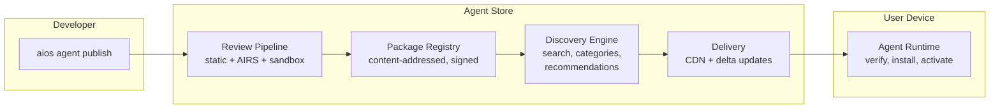
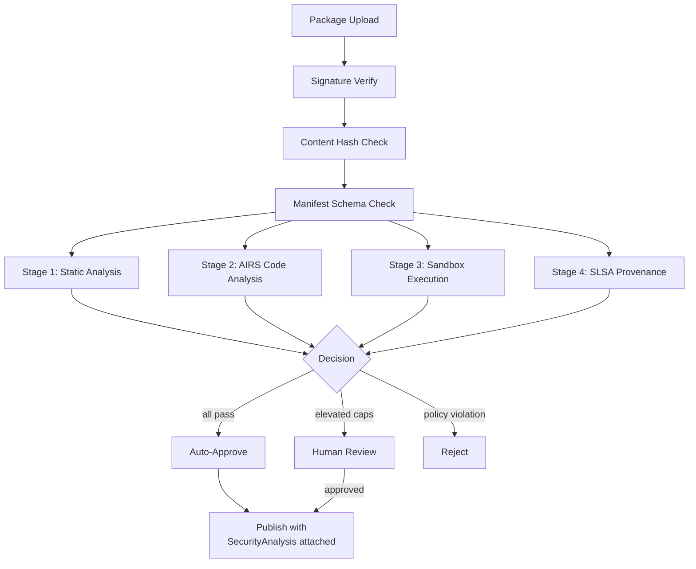

# AIOS Agent Distribution

Part of: [agents.md](../agents.md) — Agent Framework
**Related:** [lifecycle.md](./lifecycle.md) — Lifecycle & packages, [sandbox.md](./sandbox.md) — Isolation, [intelligence.md](./intelligence.md) — AI intelligence

-----

## 12. Agent Store & Package Format

Agent distribution in AIOS is built on two principles: packages are immutable content-addressed archives, and every published agent passes through an automated analysis pipeline before it reaches users. The Agent Store is the distribution platform. The `.aios-agent` format is the package format. Together they create a supply chain where provenance is cryptographically verifiable and behavioral analysis happens before installation, not after.

### 12.1 Agent Store Architecture

The Agent Store is the centralized distribution platform for discovering, evaluating, and installing agents. The pipeline follows a strict progression: submission, automated review, publication. Agents that fail automated review never reach users.



**Central Store capabilities:**

- **Discovery.** Browse by category (Productivity, Media, Development, Communication, Accessibility), search by name or keyword, filter by content type handled, capability requirements, or developer identity.

- **Ratings and reviews.** User-submitted ratings (1-5 stars) and text reviews. Review integrity: reviews are signed by the reviewer's Identity and linked to verified installation (the user must have actually installed the agent to review it).

- **Usage statistics.** Install count, active user count, resource usage distribution (median memory, median CPU). Privacy-preserving: statistics are aggregated, never per-user.

- **Version history.** Every published version is retained. Users can pin a specific version, roll back to a previous version, or opt into automatic updates. The Store tracks which versions are currently active across the user population.

- **Developer dashboard.** Publishers see install trends, crash reports (anonymized), capability usage patterns, and review summaries. AIRS provides automated feedback on common issues detected across the agent population.

**Enterprise private stores:**

Organizations deploy private stores for internal agents. A private store uses the same package format and review pipeline but with organization-scoped signing keys and MDM-controlled distribution policies (see [multi-device/mdm.md](../../platform/multi-device/mdm.md) section 5 for enrollment profiles).

```rust
/// Store configuration for agent discovery and installation.
pub enum StoreSource {
    /// The public AIOS Agent Store.
    Central,

    /// An organization-managed private store.
    Enterprise {
        /// Store endpoint URL.
        url: String,
        /// Organization signing key for package verification.
        org_key: PublicKey,
        /// Whether agents from this store require additional user approval.
        require_user_approval: bool,
    },

    /// A locally side-loaded package (no store, no review pipeline).
    /// Side-loaded agents receive the lowest trust level and maximum
    /// sandbox restrictions unless the user explicitly escalates.
    SideLoaded,
}
```

**AIRS-powered recommendation engine:**

AIRS observes the user's activity patterns (locally, never transmitted) and identifies opportunities for agent recommendations. When a user opens content that no installed agent handles, AIRS queries the Store for agents that declare that content type, ranks them by relevance (user context, ratings, install count, security posture), and presents a recommendation through the Attention system (see [attention.md](../../intelligence/attention.md)). The user always has the option to search manually, dismiss, or disable suggestions for a specific content type.

### 12.2 Package Format

The `.aios-agent` format is a content-addressed archive whose SHA-256 hash serves as its unique identity. Two packages with the same hash are the same package --- there is no separate version database, no mutable metadata that can be tampered with after signing. The format is inspired by Haiku's hpkg package model: a sealed, filesystem-like structure mounted read-only, with a writable overlay for runtime state. State lives in Spaces, never in the package.

**Archive structure:**

```text
my-agent-1.2.0.aios-agent
├── manifest.toml            # AgentManifest (see anatomy.md §3.2)
├── code/                    # Compiled agent binary or source bundle
│   └── agent.wasm           # (or native ELF, Python bundle, JS bundle)
├── assets/                  # Static resources
│   ├── icons/
│   │   ├── icon-32.png
│   │   └── icon-256.png
│   └── locales/
│       ├── en.toml
│       └── ja.toml
└── signatures/
    ├── developer.sig        # Ed25519 over manifest + content hash
    └── provenance.json      # SLSA attestation (§12.4)
```

**Package properties:**

- **Sealed and immutable.** Once built and signed, the archive contents cannot change. The content hash covers every byte. Any modification invalidates the signature.

- **Content-addressed identity.** The package hash (`ContentHash`, SHA-256) is the canonical identifier. The Agent Runtime uses this hash for deduplication, cache lookup, and rollback targeting.

- **Signed by publisher key.** The developer signs the package with their Identity subsystem key (see [identity/agents.md](../../experience/identity/agents.md) section 10 for manifest signing and supply chain). The signature covers both the manifest and the content hash, binding the developer's identity to the exact package contents.

- **Writable overlay for state.** The package itself is mounted read-only. Agent state (configuration changes, local data, caches) lives in a writable overlay backed by Spaces. Removing an agent never deletes user data. Rollback to a previous version only reverts the package --- state persists across the overlay. See [lifecycle.md](./lifecycle.md) section 4 for the package-as-filesystem model.

```rust
/// A verified, ready-to-install agent package.
pub struct AgentPackage {
    /// Content hash of the entire archive (SHA-256).
    /// This is the package identity --- used for dedup, lookup, and rollback.
    pub content_hash: ContentHash,

    /// Parsed and validated manifest.
    pub manifest: AgentManifest,

    /// Cryptographic signature over manifest + content hash.
    pub signature: PackageSignature,

    /// SLSA provenance attestation (optional for side-loaded agents).
    pub provenance: Option<SlsaProvenance>,

    /// Total archive size in bytes.
    pub archive_size: u64,
}

/// Signature binding a developer identity to a package.
pub struct PackageSignature {
    /// Developer's public key (from Identity subsystem).
    pub signer: PublicKey,

    /// Ed25519 signature over SHA-256(manifest_bytes || content_hash).
    pub signature: [u8; 64],

    /// Timestamp of signing (for expiration and revocation checks).
    pub signed_at: Timestamp,
}
```

**Install-time behavior:**

1. The Agent Runtime verifies the signature against the developer's public key.
2. The content hash is recomputed and compared to the declared hash.
3. The manifest is parsed and validated against the AgentManifest schema.
4. AIRS security analysis runs (or a cached analysis is retrieved if the hash matches a previously analyzed package).
5. The package is mounted read-only at a content-addressed path. A writable overlay is created in the user's Spaces for agent state.

### 12.3 Review Pipeline

Every agent submitted to the Store passes through a multi-stage automated review pipeline before publication. Human review is available as an escalation path for agents requesting elevated capabilities but is not required for agents that pass automated checks cleanly.

**Stage 1 --- Static analysis (manifest validation, capability audit):**

AIRS analyzes the agent's code without executing it. For compiled agents (Rust, WASM), this operates on the binary. For interpreted agents (Python, TypeScript), this operates on the source. The analysis checks for known vulnerability patterns, obfuscated code, embedded credentials, network endpoints contacted, and use of deprecated APIs. The capability audit compares declared capabilities against actual code usage --- agents that request capabilities they never use receive a warning; agents that use undeclared capabilities are rejected.

**Stage 2 --- AIRS code analysis:**

AIRS performs deep behavioral analysis of the agent's code, producing a `SecurityAnalysis` that is attached to the manifest at installation time. See [airs.md](../../intelligence/airs.md) for the AIRS inference engine and intelligence services that power this analysis.

```rust
/// Result of AIRS security analysis, attached to the manifest
/// at installation time.
pub struct SecurityAnalysis {
    /// Overall risk assessment.
    pub risk_level: RiskLevel,

    /// Static analysis findings (code patterns, vulnerabilities).
    pub static_findings: Vec<AnalysisFinding>,

    /// Capability audit: requested vs. actually used.
    pub capability_audit: CapabilityAuditResult,

    /// Behavioral simulation summary (IPC patterns, resource usage).
    pub behavioral_summary: BehavioralSummary,

    /// SLSA provenance verification result.
    pub provenance_check: ProvenanceResult,

    /// Timestamp of analysis (for cache invalidation).
    pub analyzed_at: Timestamp,

    /// AIRS model version used for analysis (for reproducibility).
    pub analyzer_version: String,
}

pub enum RiskLevel {
    /// All checks pass. Auto-approved for publication.
    Low,
    /// Minor concerns. Published with informational warnings.
    Medium,
    /// Significant concerns. Escalated to human review.
    High,
    /// Policy violation. Rejected automatically.
    Critical,
}
```

**Stage 3 --- Automated testing (sandboxed execution):**

AIRS runs the agent in an instrumented sandbox with mock services, observing IPC message patterns, resource consumption curves, Space access patterns, and anomalous behavior (capability probing, timing attacks, excessive service enumeration). The simulation results feed into the `BehavioralSummary`.

**Stage 4 --- Human review (for elevated capabilities):**

Agents that request elevated capabilities (system-level access, unrestricted network, raw device I/O) or that receive a `RiskLevel::High` assessment are escalated to human reviewers. Human review is also available on appeal for agents rejected by automated analysis.



### 12.4 SLSA Provenance

Agents published through the Store carry SLSA (Supply-chain Levels for Software Artifacts) provenance attestations. Provenance provides a cryptographically verifiable answer to three questions: who built this agent, from what source code, and with what build system.

```rust
/// SLSA provenance attestation for supply chain verification.
pub struct SlsaProvenance {
    /// Build provenance: who built it and with what tools.
    pub builder: BuildProvenance,

    /// Source provenance: where the source code lives.
    pub source: SourceProvenance,

    /// Signature over the provenance attestation.
    pub attestation_signature: [u8; 64],
}

pub struct BuildProvenance {
    /// Identity of the build system (e.g., "aios-agent-ci/v1.2").
    pub builder_id: String,
    /// Build configuration hash (reproducible builds).
    pub build_config_hash: ContentHash,
    /// Timestamp of the build.
    pub built_at: Timestamp,
}

pub struct SourceProvenance {
    /// Git repository URL.
    pub repository: String,
    /// Git commit hash at the time of build.
    pub commit_hash: String,
    /// Whether the repository uses signed commits.
    pub signed_commits: bool,
}
```

**Verification at install time:**

1. Verify the attestation signature against the builder's known public key.
2. Confirm the source commit hash matches the declared repository.
3. Check that the build configuration hash produces the same content hash when rebuilt (reproducibility check, optional but recommended).

**SLSA Level 3 target for first-party agents:**

First-party agents (shipped with AIOS) target SLSA Level 3 --- builds are performed on a hardened, isolated build service with tamper-evident logging. Third-party agents are encouraged to adopt SLSA but may publish without provenance. Agents without SLSA provenance receive a lower trust level and a visual indicator in the Store UI warning that supply chain verification is unavailable.

-----

## 13. Testing & Development Tools

Building agents for AIOS should be productive and enjoyable. The development toolchain provides hot-reload during development, hermetic testing with mock services, automated security analysis, and a streamlined publishing workflow. Every tool is a subcommand of `aios agent`.

### 13.1 Development Mode

`aios agent dev` launches an agent in development mode --- a fast iteration environment with file watching, mock capabilities, and live logging. Development agents run in a sandboxed environment with relaxed trust: capabilities declared in the manifest are granted automatically without user approval prompts, but process isolation is still enforced.

**Hot-reload:**

A file system watcher monitors the agent's source directory. When a file changes, the toolchain rebuilds the agent (incremental compilation for Rust, rebundling for Python/TypeScript), terminates the running instance, and restarts it with the same state overlay. The restart preserves the agent's Space data and configuration, so the developer sees the effect of code changes without losing context.

```text
$ aios agent dev ./my-agent/
  Watching: ./my-agent/src/**
  Building: my-agent v0.3.0 (rust, debug)
  Starting: my-agent [pid 1247, dev mode]
  Mock services: SpaceStorage, AIRS, ToolManager, FlowService
  Log level: debug

  [13:42:01] src/main.rs changed -> rebuild (0.8s) -> restart
  [13:42:15] src/handlers.rs changed -> rebuild (0.3s) -> restart
```

**Mock services:**

Development mode provides mock implementations of core AIOS services. These mocks implement the same IPC interfaces as the real services but run in-process with the development toolchain, avoiding the need for a full AIOS kernel.

```text
+----------------------------------------------+
|              Development Host                 |
|                                               |
|  +----------+    IPC     +------------------+ |
|  |  Agent   |<---------->|  Mock Services   | |
|  |  (debug) |            |                  | |
|  +----------+            |  SpaceStorage    | |
|                          |  AIRS (stub)     | |
|                          |  ToolManager     | |
|                          |  FlowService     | |
|                          |  Compositor      | |
|                          +------------------+ |
|                                               |
|  +------------------------------------------+|
|  |  File Watcher -> Rebuild -> Restart Loop  ||
|  +------------------------------------------+|
+----------------------------------------------+
```

**Live logging:**

Development mode enables verbose structured logging with subsystem filtering. The developer sees every IPC message, capability check, Space access, and resource allocation as it happens.

```text
$ aios agent dev --log-filter=ipc,space ./my-agent/
  [13:42:01 IPC]   -> channel_create(service="space-storage") = ch:3
  [13:42:01 SPACE] -> object_create(space="user/home", name="draft.md") = obj:a7f2
  [13:42:01 IPC]   <- recv(ch:3) data_len=128 (42ms)
  [13:42:02 SPACE] -> object_read(obj:a7f2) = 2048 bytes
```

### 13.2 Hermetic Testing

`aios agent test` runs the agent's test suite in isolated test environments. Each test gets a fresh realm --- a self-contained environment with the agent under test, mock services, and test-provided capabilities. No state leaks between tests. No dependency on external services. The model is inspired by Fuchsia's RealmBuilder pattern: each test constructs a miniature system topology containing exactly the components needed for that test.

**Test realm construction:**

```rust
/// A test realm is an isolated environment for a single test case.
pub struct TestRealm {
    /// The agent binary under test.
    agent: AgentPackage,

    /// Mock services available to the agent.
    mocks: Vec<MockService>,

    /// Capabilities granted to the agent in this realm.
    /// Tests can grant, deny, or attenuate specific capabilities
    /// to verify the agent handles permission scenarios correctly.
    capabilities: Vec<CapabilityGrant>,

    /// IPC interceptor for inspecting messages between
    /// the agent and its mock services.
    interceptor: IpcInterceptor,

    /// Fresh state overlay --- no data from previous tests.
    state: InMemoryOverlay,
}
```

**Test structure:**

```rust
#[aios_test]
async fn test_document_save() {
    // Build a test realm with Space storage mock
    let realm = TestRealm::builder()
        .with_agent("my-editor")
        .with_mock(SpaceStorageMock::new()
            .on_object_create(|name| Ok(ObjectId::new(42))))
        .with_capability(Capability::SpaceWrite {
            space: SpaceId::new(1),
        })
        .build()
        .await;

    // Send a message to the agent
    realm.send_ipc(EditCommand::Save {
        content: b"new content".into(),
    }).await;

    // Assert the agent wrote to Space storage
    let writes = realm.mock::<SpaceStorageMock>().writes();
    assert_eq!(writes.len(), 1);
    assert_eq!(writes[0].content, b"new content");
}
```

**Key testing properties:**

- **Fresh state per test.** Each realm creates a new in-memory state overlay. Tests never see artifacts from previous test runs.

- **Capability injection.** Tests explicitly grant or deny capabilities to verify permission-denied code paths, degraded-mode behavior, and capability escalation attempts.

- **IPC interception.** The `IpcInterceptor` sits between the agent and its mock services. Tests can inspect every message, modify messages in transit (for fault injection), or delay messages (for timeout testing).

- **Deterministic execution.** Mock services return configured responses, not live data. Time can be controlled (mock clock) so that timeout and scheduling tests produce repeatable results.

- **Parallel test execution.** Each realm is fully isolated, so tests run in parallel without contention across available cores.

### 13.3 Audit Tool

`aios agent audit` runs the same analysis pipeline that the Agent Store uses during submission (section 12.3), but locally and interactively. Developers use this command to catch issues before publishing, reducing Store rejection cycles. The output covers four categories: capability usage analysis, security findings, performance hints, and Scriptable Protocol compliance.

```text
$ aios agent audit ./my-agent/
  [1/4] Static analysis...
        No known vulnerability patterns
        No obfuscated code detected
        Warning: Hardcoded URL at src/api.rs:42 (consider config)

  [2/4] Capability audit...
        All declared capabilities are used
        Warning: "NetworkAccess" used but not declared in manifest

  [3/4] Security scan...
        No data exfiltration patterns
        No excessive service enumeration
        Privacy manifest covers all data access points

  [4/4] Scriptable Protocol compliance...
        Scriptable trait implemented
        DESCRIBE verb returns valid schema
        GET/SET verbs cover 8/8 declared properties

  Summary: 0 errors, 2 warnings
  Ready for publish: YES (with warnings)
```

**Analysis categories:**

- **Static analysis** examines the agent's code for vulnerability patterns, unsafe constructs, and anti-analysis techniques. For Rust agents, this includes checking for unsound `unsafe` blocks and FFI boundary issues. For Python and TypeScript agents, this includes dependency vulnerability scanning against known CVE databases.

- **Capability audit** compares the manifest's declared capabilities against actual code usage. It catches over-requesting (capabilities declared but never used) and under-declaring (capabilities used but not declared).

- **Security scan** looks for behavioral patterns associated with malicious agents: data exfiltration, privilege probing, and resource abuse.

- **Scriptable Protocol compliance** verifies that the agent implements the `Scriptable` trait correctly and that all declared properties are accessible through standard verbs (see [sdk.md](./sdk.md) section 9 for the Scriptable Protocol).

### 13.4 Publishing

`aios agent publish` packages, signs, and submits an agent to the Agent Store. The command creates a content-addressed `.aios-agent` archive, signs it with the developer's Identity subsystem key (see [identity/agents.md](../../experience/identity/agents.md) section 10), and uploads it for review.

```text
$ aios agent publish ./my-agent/ --store central
  [1/5] Running tests...
        42 tests passed, 0 failed

  [2/5] Running audit...
        0 errors, 0 warnings

  [3/5] Building release package...
        Binary: 2.1 MiB (Rust, aarch64, release)
        Resources: 340 KiB (icons, locales)
        Total package: 2.4 MiB

  [4/5] Signing package...
        Signer: developer@example.com (key: ed25519:a7f2...)
        Content hash: sha256:3b8c...
        SLSA provenance: attached (builder: aios-agent-ci/v1.2)

  [5/5] Uploading to Agent Store...
        Uploaded: my-agent v1.2.0
        Review status: PENDING (automated analysis in progress)
        Track at: https://store.aios.dev/agent/my-agent/v1.2.0
```

**Pre-publish enforcement:**

The `publish` command refuses to proceed if any of the following conditions are not met:

- All tests pass (`aios agent test` returns zero failures)
- Audit is clean (`aios agent audit` returns zero errors --- warnings are permitted)
- Manifest is complete (all required fields present, package hash matches)
- Signing key is available (developer must authenticate with their Identity)
- Version is higher than the latest published version for this agent ID

**Version management:**

Agents use semantic versioning (SemVer). The Store enforces version ordering. Version-specific update policies:

- **Patch versions** (1.2.0 to 1.2.1): automatic update for opted-in users. No new capabilities allowed.
- **Minor versions** (1.2.0 to 1.3.0): automatic update allowed. New capabilities trigger a re-approval prompt.
- **Major versions** (1.2.0 to 2.0.0): requires explicit user action to update. Treated as a significant behavioral change.

-----

## Cross-Reference Index

| Section | Title | Cross-References |
| --- | --- | --- |
| 12.1 | Agent Store Architecture | [multi-device/mdm.md](../../platform/multi-device/mdm.md) section 5 (enterprise enrollment), [attention.md](../../intelligence/attention.md) (recommendation notifications) |
| 12.2 | Package Format | [anatomy.md](./anatomy.md) section 3.3 (AgentManifest), [lifecycle.md](./lifecycle.md) section 4 (package-as-FS model), [identity/agents.md](../../experience/identity/agents.md) section 10 (manifest signing) |
| 12.3 | Review Pipeline | [adversarial-defense.md](../../security/adversarial-defense.md) section 5 (input screening), [airs.md](../../intelligence/airs.md) section 5.9 (capability intelligence) |
| 12.4 | SLSA Provenance | [secure-boot/updates.md](../../security/secure-boot/updates.md) section 8 (update channels), [identity/agents.md](../../experience/identity/agents.md) section 10 (supply chain) |
| 13.1 | Development Mode | [sdk.md](./sdk.md) section 8 (AgentContext), [resources.md](./resources.md) section 14 (resource budgets) |
| 13.2 | Hermetic Testing | [sandbox.md](./sandbox.md) section 6 (isolation mechanisms), [ipc.md](../../kernel/ipc.md) (IPC channels) |
| 13.3 | Audit Tool | [intelligence.md](./intelligence.md) section 18 (AIRS-dependent analysis), [privacy.md](../../security/privacy.md) section 3 (privacy manifests) |
| 13.4 | Publishing | [secure-boot/updates.md](../../security/secure-boot/updates.md) section 8 (agent update channel), [identity/agents.md](../../experience/identity/agents.md) section 10 (supply chain) |
