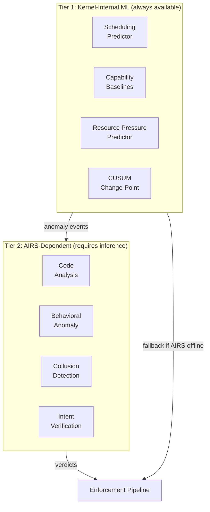
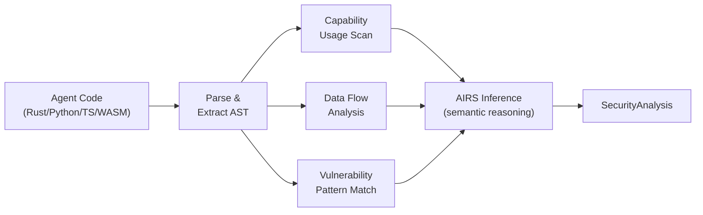
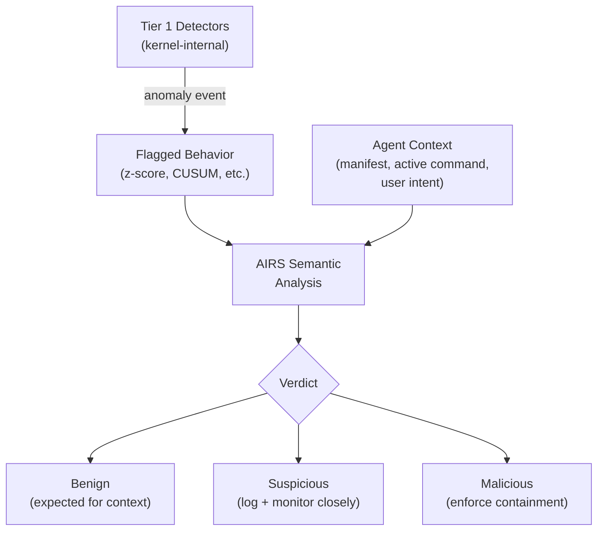
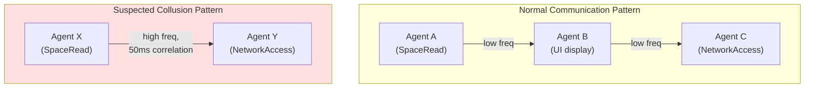
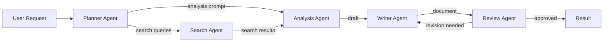

# AIOS Agent Intelligence

Part of: [agents.md](../agents.md) — Agent Framework
**Related:** [sandbox.md](./sandbox.md) — Isolation & security layers, [lifecycle.md](./lifecycle.md) — Agent lifecycle, [communication.md](./communication.md) — IPC patterns

-----

Agent intelligence operates at two tiers. **Tier 1** (section 17) uses kernel-internal statistical models that run without AIRS dependency — fixed-size state, O(1) per observation, always available. **Tier 2** (section 18) uses AIRS-dependent semantic analysis — LLM inference, code analysis, and cross-agent behavioral correlation. Section 19 describes future directions informed by research in dynamic agent collections, graph-based orchestration, hardware-backed isolation, and behavioral constitutions.



-----

## 17. Kernel-Internal ML

These models are compiled into the kernel as fixed-size statistical algorithms. They require no LLM inference, no model loading, and no AIRS availability. If AIRS crashes or is not yet booted, Tier 1 continues operating unchanged.

### 17.1 Agent Scheduling Prediction

A frozen decision tree predicts each agent's CPU and memory requirements based on historical behavior, enabling the scheduler to select the appropriate scheduling class before the agent's time slice begins.

```rust
pub struct AgentSchedulingPredictor {
    /// Per-agent behavioral summaries (recent 5-minute windows)
    agents: [Option<AgentBehaviorSummary>; 64],
}

pub struct AgentBehaviorSummary {
    agent_id: AgentId,
    avg_cpu_us: f64,         // EWMA of CPU time per activation (microseconds)
    avg_memory_peak: u64,    // EWMA of peak memory (bytes)
    activation_rate: f64,    // EWMA of activations per minute
    ipc_rate: f64,           // EWMA of IPC messages per second
    predicted_class: SchedulerClass,
}
```

**Decision tree rules** (integer thresholds, no floating-point at inference time):

- `avg_cpu_us > 4000 && activation_rate > 10/min` --> RT
- `ipc_rate > 50/s || activation_rate > 5/min` --> Interactive
- Otherwise --> Normal

**Integration with scheduler:** The predicted class feeds `SchedEntity::class` at agent activation time (see [scheduler.md](../../kernel/scheduler.md)). The prediction is advisory — the kernel applies it only if the agent's manifest does not declare a fixed scheduling class. Agents with `scheduling_hint: realtime` in their manifest always receive `RT` regardless of prediction.

**State overhead:** ~64 bytes per agent. For 64 agents: ~4 KB.

### 17.2 Per-Capability Behavioral Baselines

Traditional behavioral detection builds one baseline per agent. This misses capability-specific anomalies: an agent that reads spaces at a normal rate but accesses the network at an unusual rate would not trigger a single aggregate baseline.

Per-capability baselines maintain independent statistical profiles for each capability an agent holds. Each capability (`SpaceRead`, `SpaceWrite`, `NetworkAccess`, `InferenceCall`, `CameraCapture`, etc.) has its own Welford mean/variance tracker:

```rust
pub struct CapabilityBaseline {
    /// Capability being tracked
    capability: Capability,
    /// Running statistics (Welford's algorithm)
    mean: f64,
    m2: f64,
    count: u64,
    /// Current EWMA for fast detection (alpha=0.3)
    ewma: f64,
}

pub struct AgentCapabilityProfile {
    /// One baseline per granted capability (max 16 per agent)
    baselines: [Option<CapabilityBaseline>; 16],
    /// Number of active baselines
    active: u8,
}
```

**Why per-capability rather than per-agent:** An agent with `SpaceRead` + `NetworkAccess` capabilities has two independent attack surfaces. A data exfiltration attack reads spaces at an elevated rate *and* sends network data at an elevated rate, but the aggregate rate might remain normal if the agent was already active. Two independent baselines detect the correlated anomaly that a single baseline misses.

**Anomaly escalation:** When a per-capability z-score exceeds 3.0, the kernel emits an anomaly event to the Behavioral Monitor (see [behavioral-monitor.md](../../intelligence/behavioral-monitor.md)). If two or more capabilities flag simultaneously on the same agent, the event is tagged as `CorrelatedAnomaly` and escalated to Tier 2 (AIRS) for semantic analysis.

**State overhead:** ~80 bytes per baseline. For 64 agents with 8 average capabilities: ~40 KB.

### 17.3 Resource Pressure Prediction

An EWMA-based predictor estimates each agent's near-future resource consumption, enabling proactive throttling before hard limits are reached. The predictor operates on three resource dimensions: memory, CPU, and IPC message rate.

```rust
pub struct ResourcePressurePredictor {
    /// Per-agent resource trend tracking
    agents: [Option<AgentResourceTrend>; 64],
}

pub struct AgentResourceTrend {
    agent_id: AgentId,
    /// EWMA of memory growth rate (bytes per second)
    memory_growth_rate: f64,
    /// EWMA of CPU utilization (0.0-1.0)
    cpu_utilization: f64,
    /// EWMA of IPC message rate (messages per second)
    ipc_rate: f64,
    /// Predicted time-to-limit (seconds, for memory)
    predicted_ttl: f64,
}

impl AgentResourceTrend {
    /// EWMA update (alpha=0.2) for all three dimensions.
    /// Returns predicted seconds until memory hard limit.
    pub fn observe(&mut self, memory_delta: i64, cpu_frac: f64,
                   ipc_msgs: u32, memory_remaining: u64) -> f64 {
        // ... EWMA smoothing on each dimension ...
        // predicted_ttl = memory_remaining / memory_growth_rate
    }
}
```

**Proactive throttling policy:**

- `predicted_ttl < 30s`: reduce scheduling priority by one class (e.g., Normal to Idle)
- `predicted_ttl < 5s`: send `ResourcePressure` notification to the agent, giving it a chance to release resources before the hard limit triggers OOM enforcement (see [resources.md](./resources.md) §14.5.2)

**State overhead:** ~48 bytes per agent. For 64 agents: ~3 KB.

### 17.4 CUSUM Change-Point Detection

EWMA smooths over sudden shifts — by design, it adapts gradually. CUSUM (Cumulative Sum) complements EWMA by detecting abrupt mean shifts that EWMA would take several observations to register.

```rust
pub struct CusumDetector {
    /// Cumulative sum (positive direction — detecting increases)
    s_high: f64,
    /// Cumulative sum (negative direction — detecting decreases)
    s_low: f64,
    /// Target mean (learned from baseline period)
    target: f64,
    /// Slack parameter (controls sensitivity, typically 0.5 * expected shift)
    slack: f64,
    /// Detection threshold
    threshold: f64,
    /// Observation count (for warmup period)
    count: u64,
}

impl CusumDetector {
    /// Warmup (first 48 observations): learn target mean.
    /// After warmup: accumulate deviations, reset on detection.
    pub fn observe(&mut self, x: f64) -> Option<CusumDirection> {
        // s_high += (x - target) - slack, clamped to 0
        // s_low  -= (x - target) - slack, clamped to 0
        // Trigger on s_high > threshold or s_low > threshold
    }
}
```

**Applied to agent behavioral dimensions:**

| Dimension | What CUSUM Detects | Typical Slack | Threshold |
|---|---|---|---|
| IPC message rate | Sudden burst or silence | 5 msg/s | 50 |
| Capability usage frequency | New capability usage pattern | 2 uses/min | 20 |
| Space write volume | Data hoarding or purging | 1 KB/s | 100 |

**Why both EWMA and CUSUM:** EWMA excels at detecting trends and gradual drift. CUSUM excels at detecting step changes. A sophisticated evasion strategy that shifts behavior by a fixed amount in a single step is detected by CUSUM within 2-3 observations, while EWMA needs 5-10 observations to cross its threshold. Together, they cover both attack patterns.

**State overhead:** ~56 bytes per detector instance. For 64 agents x 3 dimensions: ~10.5 KB.

### 17.5 Kernel-Internal ML Summary

| Component | What It Detects | State Per Agent | Update Cost |
|---|---|---|---|
| **AgentSchedulingPredictor** | CPU/memory needs | ~64 B | O(1) per activation |
| **CapabilityBaseline** | Per-capability rate anomalies | ~640 B (8 caps) | O(1) per observation |
| **ResourcePressurePredictor** | Imminent limit breach | ~48 B | O(1) per tick |
| **CusumDetector** | Abrupt behavioral shifts | ~168 B (3 dims) | O(1) per observation |

**Total Tier 1 state for 64 agents:** ~4 KB + 40 KB + 3 KB + 10.5 KB = **~57.5 KB**

All models run in kernel context with no dependency on AIRS availability. They provide the statistical foundation that AIRS-dependent intelligence (section 18) builds upon.

-----

## 18. AIRS-Dependent Intelligence

These capabilities require the AIRS inference engine and a loaded language model. They provide semantic understanding that purely statistical methods cannot achieve. All are optional — the system remains safe without them, using Tier 1 detection.

### 18.1 Agent Code Analysis

AIRS analyzes agent source code or WASM bytecode before installation. The analysis produces a `SecurityAnalysis` struct that is attached to the agent's manifest and persists across agent versions.

```rust
pub struct SecurityAnalysis {
    version: Version,
    observed_capabilities: Vec<Capability>,   // what code actually uses
    unused_declarations: Vec<Capability>,     // declared but never used
    undeclared_usage: Vec<CapabilityUsage>,   // used but not declared
    data_flows: Vec<DataFlowPath>,           // input-to-output data paths
    vulnerabilities: Vec<VulnerabilityMatch>, // known bad patterns
    risk_score: f64,                         // 0.0-1.0 overall assessment
    summary: String,                         // human-readable findings
    model_version: ModelId,                  // for reproducibility
}
```

**Analysis pipeline:**



**What the analysis catches:**

- **Capability mismatch.** An agent declares `SpaceRead` but the code calls `space_write()`. The analysis flags this as `undeclared_usage`, and the Agent Runtime blocks installation until the manifest is corrected.

- **Data exfiltration patterns.** The data flow analysis traces how user data moves through the agent's code. A path from `space_read()` to `network_send()` without user-visible UI in between is flagged as a potential exfiltration vector.

- **Known vulnerability patterns.** The analysis checks against a database of known bad patterns: unbounded loops, unchecked deserialization, format string injection, path traversal, and agent-specific patterns like capability token caching.

**Relationship to manifest trust levels:** Code analysis results influence the trust level assigned to the agent (see [sandbox.md](./sandbox.md) §6.2). An agent with `risk_score > 0.7` is automatically downgraded from Tier 2 to Tier 3 isolation, regardless of its declared trust level.

### 18.2 Behavioral Anomaly Detection

Layer 3 of the eight-layer security model (see [model.md](../../security/model.md)). AIRS compares agent runtime behavior against both declared intent (from the manifest) and historical baselines (from Tier 1 detectors), providing semantic interpretation that statistical models cannot.



**What AIRS adds over Tier 1:**

- **Context-aware classification.** A file manager reading 100 files/second is normal during a "find duplicates" operation but anomalous during idle. Tier 1 sees a z-score spike; AIRS checks the active user command and classifies it as benign.

- **Cross-agent correlation.** Agent A sends data to Agent B, which immediately sends it to the network. Neither agent's individual behavior is anomalous, but the combined pattern indicates a relay attack. AIRS maintains a cross-agent interaction graph and detects coordinated behavior.

- **Capability escalation detection.** An agent that gradually expands its capability usage over multiple updates — each update requesting one additional capability — may be executing a slow escalation strategy. AIRS tracks capability growth velocity across agent versions and flags agents whose capability set grows faster than their feature set.

**Escalation to enforcement:** When AIRS classifies behavior as `Malicious`, the kernel's enforcement pipeline activates (see [behavioral-monitor/response.md](../../intelligence/behavioral-monitor/response.md) §6): capability revocation, process suspension, or termination depending on severity.

**Cross-reference:** The behavioral monitor maintains per-agent baselines and escalation policies ([behavioral-monitor.md](../../intelligence/behavioral-monitor.md)). AIRS behavioral anomaly detection extends this with semantic understanding — the behavioral monitor asks "is this statistically unusual?" while AIRS asks "is this semantically inconsistent with what the agent is supposed to do?"

### 18.3 Multi-Agent Collusion Detection

A novel OS-level contribution. Traditional security models analyze agents independently. AIOS recognizes that sophisticated attacks may involve multiple cooperating agents, each individually benign, whose combined behavior achieves a malicious goal.

**Detection mechanisms:**

- **Temporal correlation.** AIRS monitors the timing of actions across agents. Two agents that consistently perform complementary actions within a narrow time window (e.g., Agent A reads user data, Agent B sends a network request 50ms later) are flagged for investigation. The correlation detector uses a sliding window cross-correlation function across IPC message timestamps.

- **Capability union analysis.** AIRS periodically computes the union of capabilities across all communicating agent pairs. If Agent A has `SpaceRead` and Agent B has `NetworkAccess`, and they communicate via IPC, their combined capability set includes data exfiltration potential that neither agent has alone. The analysis flags pairs whose capability union exceeds a configurable threat threshold.

- **Communication graph anomalies.** AIRS builds a directed graph of inter-agent IPC traffic. Edges are weighted by message volume and frequency. Anomalous patterns include:

  - Sudden new edges between previously unconnected agents
  - Star topologies (one agent communicating with many)
  - Bidirectional high-frequency channels between agents with complementary capabilities



**Relationship to privacy architecture:** Collusion detection is coordinated with the privacy budget system (see [privacy/agent-privacy.md](../../security/privacy/agent-privacy.md) §4). When two agents are flagged as potentially colluding, their privacy budgets are aggregated — the combined pair consumes budget as if they were a single agent with the union of their capabilities.

**Computational cost:** Pairwise correlation for N agents is O(N^2). For 64 agents, 2016 pairs are computed every 5 minutes using 1-minute resolution time series. Total cost: ~10ms per evaluation cycle. Capability union analysis runs only on correlated pairs, adding negligible overhead.

### 18.4 Intent Verification

Layer 1 of the eight-layer security model. AIRS verifies that agent actions align with the declared intent in the agent's manifest. Intent verification operates continuously, not just at installation time.

The `DeclaredIntent` in the agent manifest describes *what the agent is for* in structured natural language. AIRS compares each action the agent takes against this declared purpose:

```text
Manifest intent: "Organize email by date, sender, and subject"
Observed action: network_send(destination="analytics.example.com", payload=email_headers)

AIRS verdict: VIOLATION
  The agent's declared intent is email organization (local operation).
  Sending email headers to an external analytics service is not
  consistent with the declared purpose. Escalating to enforcement.
```

**Verification pipeline:** Intent verification uses the full AIRS verification pipeline described in [intent-verifier.md](../../intelligence/intent-verifier.md). The Agent Framework integrates by providing agent-specific context: the manifest's `DeclaredIntent`, the agent's current `AgentState`, the active user command (if any), and the agent's historical behavior profile.

**Graceful degradation:** If AIRS is unavailable, intent verification falls back to Tier 1 statistical detection. The system logs that semantic verification was skipped and increases the sensitivity of the statistical detectors (lower z-score threshold: 2.5 instead of 3.0) to compensate for the loss of semantic analysis.

-----

## 19. Future Directions

### 19.1 Dynamic Collections (Phase 22+)

Inspired by Fuchsia's component framework, dynamic collections enable runtime creation of agent instances from parameterized templates. A template defines the agent's code, default capabilities, and configuration schema. The Agent Runtime instantiates agents on demand with per-instance parameters.

Use cases:

- A "data processor" template instantiated per-file during batch operations, each instance scoped to a single file's capabilities.
- A "tab agent" template instantiated per-origin in the browser, inheriting the browser's base capabilities but constrained to the specific origin's permissions.
- A "worker" template for parallel computation, each instance receiving a partition of the workload.

Dynamic collections interact with the capability system through template-level capability ceilings — no instance can exceed the template's declared maximum capabilities. Each instance receives independent address spaces (TTBR0), capability tables, and behavioral baselines.

### 19.2 Graph-Based Workflow Orchestration (Phase 30+)

Inspired by LangGraph and similar agent orchestration frameworks, graph-based workflows define multi-agent computations as directed acyclic graphs (DAGs). Nodes are agents, edges are typed data dependencies.



The Agent Runtime serves as the DAG executor. It tracks node completion, manages data flow between agents via IPC channels, handles failures (retry, skip, or abort per edge policy), and enforces per-node resource budgets. The DAG definition itself is an agent manifest extension — `workflow_graph` — that declares the topology and data contracts.

**Capability composition safety:** The workflow engine validates that the combined capability set of all agents in the workflow does not create a collusion risk (reusing the capability union analysis from §18.3). If the workflow requires a dangerous capability combination, the user is prompted for explicit approval.

### 19.3 Behavioral Constitutions (Phase 25+)

Declarative safety rules that agents self-check before executing actions. A constitution is a set of invariants that an agent commits to maintaining, expressed as predicate functions over the agent's state and proposed actions.

```rust
/// A behavioral constitution — invariants an agent promises to maintain.
pub struct AgentConstitution {
    /// Invariants checked before every action
    pre_action_checks: Vec<ConstitutionRule>,
    /// Invariants checked after every action
    post_action_checks: Vec<ConstitutionRule>,
    /// Maximum violation count before self-suspension
    max_violations: u32,
}

pub struct ConstitutionRule {
    /// Human-readable description
    description: String,
    /// Predicate function (compiled from manifest DSL)
    predicate: CompiledPredicate,
    /// Severity if violated
    severity: ViolationSeverity,
}
```

Constitutions complement external enforcement (Tier 1/Tier 2 detection) with internal enforcement. An agent that violates its own constitution self-suspends and reports the violation to the Agent Runtime. This provides defense-in-depth: even if an attacker compromises the agent's main logic, the constitution checks — compiled separately and verified by AIRS — act as an internal guardrail.

**Constitutional hierarchy:**

- **System rules** apply to all agents (cannot be overridden): "Never delete the user's only copy of data without confirmation."
- **Category rules** apply per trust level: "Third-party agents must not access Spaces outside their declared scope."
- **Agent-specific rules** are declared in the manifest: "This email agent should not send messages after 10 PM."

### 19.4 ARM CCA Realms (Phase 30+)

ARM Confidential Compute Architecture (CCA) provides hardware-backed isolation through Realms — encrypted memory regions that are opaque even to the hypervisor and OS kernel. AIOS maps each agent to a CCA Realm:

- **Per-agent memory encryption.** The hardware encrypts the agent's physical memory pages with a per-Realm key. Even a kernel compromise cannot read agent memory.
- **Hardware attestation.** The Realm Management Monitor (RMM) provides cryptographic attestation of the agent's execution environment: the code that was loaded, the initial state, and the platform integrity.
- **Sealed storage.** Agents can seal data to their Realm identity. Sealed data is only accessible to the same agent code on the same hardware, providing hardware-rooted secrets management.

CCA Realms extend the graduated isolation model (see [sandbox.md](./sandbox.md) §6.2) with a fourth tier: hardware-isolated agents for the most sensitive workloads (credential managers, key stores, privacy-critical computations).

**Platform dependencies:** ARM CCA requires ARMv9-A or later. Apple Silicon uses a different mechanism (Secure Enclave + IOMMU) — AIOS abstracts both behind a common `ConfidentialRuntime` trait. Trade-offs include ~5-10% overhead for memory encryption, ~50us per realm entry/exit transition, and mandatory data copy for cross-realm IPC (no zero-copy).

### 19.5 WASI Multi-Threading (Phase 22+)

The current WASM agent model uses single-threaded execution with cooperative concurrency via `async`/`await`. When the WASI threads proposal stabilizes, AIOS adopts a shared-nothing threading model:

- Each WASM thread receives its own linear memory segment (no shared `memory.grow`).
- Inter-thread communication uses `SharedArrayBuffer`-style atomics on explicitly shared memory regions, mediated by the WASM runtime.
- The kernel schedules WASM threads as lightweight threads within the agent's process, sharing the TTBR0 address space but with per-thread stack isolation.

This model preserves WASM's safety guarantees (no data races on unshared memory) while enabling parallel computation for CPU-bound agent workloads. The threading model integrates with the agent's resource budget — thread creation counts against the agent's thread limit, and all threads share the agent's memory and CPU budgets (see [resources.md](./resources.md) §14).

-----

## Cross-Reference Index

| Section | Topic | Related Documents |
|---|---|---|
| §17.1 | Scheduling prediction | [scheduler.md](../../kernel/scheduler.md) — scheduling classes |
| §17.2 | Capability baselines | [behavioral-monitor/detection.md](../../intelligence/behavioral-monitor/detection.md) — statistical detection |
| §17.3 | Resource pressure | [resources.md](./resources.md) §14.2.3 — OOM enforcement, §14.5.2 — pressure response |
| §17.4 | CUSUM detection | [behavioral-monitor/detection.md](../../intelligence/behavioral-monitor/detection.md) §4 — z-score complement |
| §18.1 | Code analysis | [airs/intelligence-services.md](../../intelligence/airs/intelligence-services.md) §5.9 — capability intelligence |
| §18.2 | Behavioral anomaly | [behavioral-monitor.md](../../intelligence/behavioral-monitor.md) — full behavioral detection architecture |
| §18.3 | Collusion detection | [privacy/agent-privacy.md](../../security/privacy/agent-privacy.md) §4 — collusion and budget aggregation |
| §18.4 | Intent verification | [intent-verifier.md](../../intelligence/intent-verifier.md) — full intent verification pipeline |
| §19.4 | ARM CCA Realms | [model/hardening.md](../../security/model/hardening.md) §5 — ARM hardware security |
