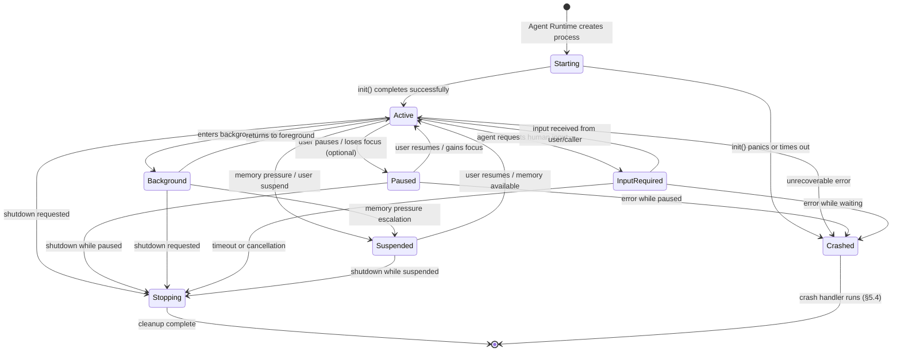

# AIOS Agent Lifecycle & Package Model

Part of: [agents.md](../agents.md) — Agent Framework
**Related:** [anatomy.md](./anatomy.md) — Agent anatomy and manifest, [sandbox.md](./sandbox.md) — Isolation and security, [sdk.md](./sdk.md) — SDK and Scriptable Protocol, [distribution.md](./distribution.md) — Store and packaging

-----

## 4. Installation & Package Model

Agent packages are content-addressed, immutable archives that carry everything an agent needs to run — binary, resources, configuration defaults, and a signed manifest. The package model draws from BeOS/Haiku's design lesson that packages should be filesystem-like structures mounted read-only, with writable state living in a separate overlay. This gives AIOS instant rollback (unmount the new package, remount the old one) without ever risking user data.

### 4.1 Package Format

Every agent is distributed as a `.aios-agent` package — a content-addressed archive stored as a versioned object in the Space Storage subsystem. Because packages are Space objects, they inherit the Version Store's Merkle DAG history, content deduplication, and cryptographic integrity verification for free.

```rust
/// A content-addressed agent package stored in Space Storage.
pub struct AgentPackage {
    /// Space Storage object identifier for this package.
    pub object_id: ObjectId,

    /// The signed, validated manifest extracted from the package.
    pub manifest: AgentManifest,

    /// SHA-256 hash of the complete package contents.
    /// Identical content across different agents shares storage blocks
    /// through the Block Engine's content-addressed deduplication.
    pub content_hash: ContentHash,

    /// Version Store node for this package version.
    /// Links to parent versions via the Merkle DAG, enabling
    /// instant rollback by activating a previous node.
    pub version: Version,

    /// Current activation state of this package.
    pub activation_state: ActivationState,
}
```

```rust
/// Lifecycle state of an installed package.
pub enum ActivationState {
    /// Package is stored but not active. No process running,
    /// no suites registered, no content types claimed.
    Available,

    /// Package is active. Agent process may or may not be running
    /// (lazy activation defers process creation until first use).
    Active,

    /// Package was active but has been suspended by the user,
    /// the Agent Runtime (memory pressure), or enterprise policy.
    /// State is preserved in Spaces for later resumption.
    Suspended,

    /// Package has been deactivated. Suites deregistered, content
    /// type claims released, but package data remains in Space
    /// Storage for potential reactivation.
    Deactivated,
}
```

**Content-addressed properties:**

- **Deduplication.** Two agents that ship the same resource file (e.g., a shared font or icon library) store only one copy of the underlying blocks. The Block Engine's SHA-256 content hashing ensures identical content maps to the same `BlockId`.

- **Integrity.** The `content_hash` is verified against the stored blocks on every activation. A corrupted or tampered package fails verification before any code runs.

- **Versioning.** Each package version is a node in the Version Store's Merkle DAG (see [versioning.md](../../storage/spaces/versioning.md) §5). Updating an agent creates a new node with the old version as its parent. The full version history is preserved.

### 4.2 Package Layout

The internal structure of a `.aios-agent` package follows a fixed layout that the Agent Runtime expects. All paths are relative to the package root.

```rust
/// Internal directory structure of an agent package.
pub struct PackageLayout {
    /// Path to the agent binary or entry script.
    /// For native agents: "bin/agent" (ELF aarch64).
    /// For Python agents: "src/main.py".
    /// For TypeScript agents: "src/main.ts".
    /// For WASM agents: "bin/agent.wasm".
    pub binary: &'static str,

    /// Path to the resources directory (icons, templates, data files).
    /// Read-only at runtime. Content-addressed like everything else.
    pub resources: &'static str,

    /// Path to default configuration values.
    /// These are copied to the agent's writable data directory on first
    /// activation. Subsequent activations do not overwrite user changes.
    pub config_defaults: &'static str,
}
```

```text
my-agent.aios-agent/
├── manifest.toml          # AgentManifest (signed)
├── bin/
│   └── agent              # Native binary or WASM module
├── src/
│   └── main.py            # Script entry point (Python/TS agents)
├── resources/
│   ├── icons/
│   │   ├── icon-16.png
│   │   └── icon-256.png
│   ├── templates/
│   └── data/
├── config/
│   └── defaults.toml      # Default configuration values
└── migration/
    └── v2_to_v3.toml      # Data migration descriptor (§5.5)
```

The manifest includes cross-lesson fields that connect the package to other AIOS subsystems:

- **`content_types`** — Content types this agent handles (from the Content Type Registry pattern, see [communication.md](./communication.md) §11). The Agent Runtime registers these during activation so the system knows which agent to offer when the user opens a file.

- **`scriptable`** — Scriptable Protocol suites this agent implements (see [sdk.md](./sdk.md) §9). Registered with the Tool Manager during activation so other agents and AIRS can discover the agent's verbs.

- **`data_migration`** — An optional migration descriptor that runs when updating from one package version to another. Describes schema changes between versions so user data can be transformed in place. See §5.5 for the update lifecycle.

### 4.3 Mount Mechanism

Agent packages are stored as Space Storage objects. At runtime, the Agent Runtime provides read-only access to package contents through the Space Service — reusing the existing POSIX path mapping infrastructure rather than inventing a new mount system.

```rust
/// Access operations available on a mounted package.
pub enum PackageAccess {
    /// Read a file from the package by relative path.
    /// Returns the file content or an error if the path does not exist.
    ReadPackageFile,

    /// List entries in a package directory.
    /// Returns names and types (file/directory) of immediate children.
    ListPackageDir,
}
```

**Path mapping.** Installed agent packages are accessible under a deterministic path:

```text
/spaces/system/agents/installed/{bundle_id}/       → package contents (read-only)
/spaces/user/agents/{bundle_id}/data/              → agent writable data
/spaces/user/agents/{bundle_id}/config/            → agent configuration
/spaces/user/agents/{bundle_id}/cache/             → agent cache (reclaimable)
```

The Space Service translates these paths into Space Storage queries. The package contents path maps to a read-only view of the `AgentPackage` object. The data, config, and cache paths map to writable Space regions owned by the user.

**User data invariant.** Agent data under `/spaces/user/agents/{bundle_id}/data/` is NEVER rolled back during package updates or version rollback. This directory belongs to the user, not to the agent package. Rolling back an agent to a previous version reverts the code but preserves all user-created data. The only way to delete agent data is explicit user action through the Settings surface or Inspector.

**POSIX bridge.** Agents using the POSIX compatibility layer (see [posix.md](../../platform/posix.md) §6) see these paths as standard filesystem paths. The translation layer maps `open()`, `read()`, `stat()`, and `readdir()` calls to Space Storage operations transparently.

### 4.4 Activation Sequence

Activating a package transitions it from `Available` to `Active` and prepares the system to run the agent. Activation does not start the agent process — that happens during the startup sequence (§5.1) and depends on the agent's `ActivationMode` (eager vs. lazy).

The activation sequence is an 8-step process:

```text
Step 1: Space Storage receives ActivatePackage(object_id) via IPC
     │
Step 2: Validate content_hash against stored SHA-256
     │  ✗ → reject activation (integrity failure)
     │
Step 3: Verify package signature against publisher's key
     │  via Identity subsystem (see identity/agents.md §10)
     │  ✗ → reject activation (signature invalid)
     │
Step 4: Set activation_state = Active
     │
Step 5: Register Scriptable suites with Tool Manager
     │  Each suite becomes a discoverable tool entry
     │
Step 6: Register content types with Content Type Registry
     │  Agent becomes a candidate handler for its declared types
     │
Step 7: Create Version Store snapshot for rollback
     │  Captures the pre-activation state so the previous
     │  package version can be restored instantly
     │
Step 8: Service Manager records the agent as startable
        On next trigger (eager: immediately, lazy: first use),
        the Agent Runtime starts the process with
        capability-constrained IPC channels
```

**Deactivation** reverses steps 6 through 4:

1. Deregister content types from the Content Type Registry.
2. Deregister Scriptable suites from the Tool Manager.
3. Set `activation_state = Deactivated`.

The agent process (if running) is stopped via the graceful shutdown protocol (§5.3) before deactivation proceeds.

-----

## 5. Startup, States, Shutdown, Recovery, Updates

### 5.1 Startup Sequence

When the Agent Runtime decides to start an agent — either at boot (eager), on first capability use (lazy), or by explicit user request — it executes the following sequence:

```text
1. Agent Runtime calls process_create (kernel)
   → allocates TTBR0 address space
   → assigns ProcessId and 16-bit ASID
   → sets resource limits from manifest + trust level

2. Agent Runtime grants capability tokens
   → iterates manifest.capabilities
   → filters by user-approved subset
   → calls cap_grant() for each approved capability
   → tokens are placed in the process's CapabilityTable

3. Agent Runtime loads the agent binary/script
   → Native: ELF loader maps segments into TTBR0
   → Python: RustPython interpreter initialized with entry script
   → TypeScript: QuickJS-ng VM created with entry module
   → WASM: wasmtime instance created with .wasm module

4. Agent Runtime creates system IPC channels
   → AgentContext channel (for lifecycle events)
   → Space access channel (for storage operations)
   → Optional: service channels per manifest.services

5. IPC handshake: Agent Runtime → Agent
   → sends AgentEvent::Started with AgentContext
   → AgentContext contains channel IDs, capability handles,
     Space paths, and configuration

6. Agent's #[agent] macro handles initialization
   → deserializes AgentContext from the startup message
   → calls the developer's init() function
   → registers event handlers
   → enters the event loop

7. Agent Runtime updates AgentCard
   → state = Active, accepting_connections = true
   → registers card with Service Manager

8. Agent Runtime emits audit event
   → "agent.started" with pid, agent_id, trust_level
```

**Eager vs. lazy activation.** Agents declare their preferred activation mode in the manifest:

- **Eager** (`ActivationMode::Eager`) — the Agent Runtime starts the agent at boot (system agents) or at user login (experience agents). The agent remains running until explicitly stopped or the session ends. Used by the Compositor, AIRS, Space Storage, and other system-critical agents.

- **Lazy** (`ActivationMode::Lazy`) — the Agent Runtime defers process creation until the agent is needed. Triggers include: user opens a content type the agent handles, another agent sends an IPC message to the agent's service channel, AIRS determines the agent is needed for a task, or the user explicitly launches the agent. Lazy activation reduces boot time and memory pressure by keeping idle agents unloaded.

### 5.2 Agent States

An agent process moves through a well-defined set of states during its lifetime. The state machine governs what operations the agent can perform, what resources it consumes, and how the system treats it during memory pressure or shutdown.



| State | Capabilities Available | Memory | CPU | IPC |
|---|---|---|---|---|
| Starting | None (initialization in progress) | Allocated | Single-threaded init | Receive only (startup handshake) |
| Active | Full (per manifest approval) | Full allocation | Per-class quantum | Send and receive |
| Paused | Reduced (IPC only) | Retained | No scheduled time | Receive only (queued) |
| Background | Full (reduced priority) | Retained, reclaimable | Idle-class quantum | Send and receive |
| InputRequired | Paused computation | Retained | Minimal (polling) | Receive only (waiting for response) |
| Suspended | None | Reclaimed to swap/zram | None | Queued for resume |
| Stopping | Cleanup only | Retained for cleanup | Time-boxed (5s) | Send only (final messages) |
| Crashed | None | Reclaimed | None | None |

**InputRequired state.** This state is adopted from the Google A2A task lifecycle. An agent enters `InputRequired` when it needs information from the user or from the calling agent to proceed with a task. For example, an agent processing a document might need the user to choose between formatting options, or an orchestrator agent might need clarification on ambiguous instructions.

While in `InputRequired`, the agent's computation is paused but its IPC channels remain open for receiving the expected input. The Agent Runtime tracks a timeout — if no input arrives within the configured window, the agent transitions to `Stopping` and the task is cancelled.

### 5.3 Shutdown

Agents are shut down through either a graceful or forced path. The Agent Runtime always attempts graceful shutdown first.

**Graceful shutdown:**

```text
1. Agent Runtime sends AgentEvent::StateChanged(Stopping)
   via the AgentContext IPC channel

2. Agent receives the event in its event loop
   → saves state to its Space data directory
   → flushes pending writes
   → closes IPC channels it created
   → sends AgentEvent::ShutdownComplete reply

3. Agent Runtime receives ShutdownComplete
   → deregisters Agent Card from Service Manager
   → revokes all capability tokens
   → calls process_exit (kernel)

4. Kernel cleans up process resources:
   → destroys IPC channels owned by the process
   → unmaps shared memory regions
   → frees notification objects
   → releases capability table entries
   → reclaims TTBR0 page tables and physical frames
   → notifies Service Manager (process death notification)
```

**Forced shutdown.** If the agent does not send `ShutdownComplete` within 5 seconds (the `SHUTDOWN_TIMEOUT`), the Agent Runtime forcibly terminates the process:

```text
1. Agent Runtime calls process_kill(pid)
   → kernel terminates all threads in the process
   → same resource cleanup as graceful path (step 4)

2. Agent Runtime emits audit event
   → "agent.force_killed" with pid, agent_id, reason

3. Dependent agents notified via Service Manager
   → on_death callbacks fire for any agent that registered
     a dependency on this agent's services
```

**Resource cleanup is always complete.** Whether shutdown is graceful or forced, the kernel's `process_exit` path walks all resource tables (channels, shared memory, notifications, capabilities) and releases everything. There are no resource leaks from agent crashes or forced kills. See [sandbox.md](./sandbox.md) §6 for the full cleanup sequence.

### 5.4 Crash Recovery

When an agent process terminates unexpectedly — due to a panic, segfault (data abort), illegal instruction, or watchdog timeout — the Agent Runtime executes the crash recovery protocol.

```text
1. Kernel detects abnormal process exit
   → exception handler logs fault type and address
   → process_exit runs full resource cleanup
   → Service Manager fires on_death notifications

2. Agent Runtime receives death notification
   → records crash in agent's crash history
   → increments crash_count for this agent

3. Crash counter evaluation:
   → crash_count == 1: restart immediately (transient fault)
   → crash_count == 2-3: restart with exponential backoff
     (1s, 4s delay)
   → crash_count >= 4: disable agent, notify user
     "Agent {name} has crashed repeatedly. It has been
      disabled. You can re-enable it in Settings."

4. Pre-action snapshot evaluation:
   → if the agent created a checkpoint before a destructive
     operation (e.g., before bulk-editing user data), the
     Version Store can roll back to that snapshot
   → checkpoint API: ctx.spaces().checkpoint("before-migration")

5. Capability review (crash_count >= 3):
   → AIRS analyzes the crash pattern
   → if crashes correlate with specific capability usage,
     AIRS recommends revoking that capability
   → user is prompted: "Agent {name} crashes when using
     {capability}. Remove this permission?"

6. Dependent agent notification:
   → Service Manager notifies all agents that declared a
     dependency on the crashed agent's services
   → dependent agents receive ServiceEvent::ProviderCrashed
   → agents can attempt to reconnect (if the crashed agent
     is restarted) or degrade gracefully
```

**Pre-action snapshots.** Agents performing destructive operations (data migration, bulk edits, format conversion) should create a Version Store checkpoint before proceeding. The SDK provides a convenience method:

```rust
// Before a destructive operation, checkpoint the data Space
let snapshot = ctx.spaces().checkpoint("before-migration").await?;

// Perform the destructive operation
migrate_data(&ctx).await?;

// If the agent crashes during migrate_data(), the Agent Runtime
// can roll back to the "before-migration" snapshot automatically
```

If the agent crashes between `checkpoint()` and completion, the Agent Runtime finds the most recent checkpoint and offers rollback in the crash notification UI.

### 5.5 Updates

Agent updates use a side-by-side model where the new version coexists with the old version in Space Storage until the update is confirmed. This ensures that a failed update never leaves the agent in a broken state.

```text
Update lifecycle:

1. New package version downloaded to Space Storage
   → stored as a new Version Store node
   → parent pointer links to the current active version
   → content_hash computed and verified

2. AIRS pre-update analysis
   → diff manifest capabilities (new vs. old)
   → if new capabilities requested, queue user approval
   → security scan of new package contents

3. Data migration check
   → if manifest includes data_migration descriptor,
     parse the migration steps
   → migration descriptors are declarative (rename field,
     add field with default, remove field) — not arbitrary code

4. Activation switchover
   → deactivate old package (deregister suites + content types)
   → if data migration needed, run migration on agent data
     (under a Version Store snapshot for rollback safety)
   → activate new package (register new suites + content types)
   → if agent was running, restart with new binary

5. Confirmation window
   → new version runs for a configurable period (default: 1 hour)
   → if the agent crashes during this window, automatic rollback
     to the previous version
   → after the window, the update is confirmed and the old
     version node is retained but marked as superseded
```

**Rollback.** Reverting to a previous version activates the old package node in the Version Store. The process is identical to a forward update — deactivate current, activate previous, restart. Rollback never touches user data. Data migration is forward-only; rolling back the package while keeping migrated data is safe because migration descriptors are additive (new fields have defaults, removed fields are ignored by old code).

**Instant rollback guarantee.** Because packages are immutable Space objects and user data is separate, rollback is a metadata operation — change which Version Store node is marked `Active`. No file copying, no extraction, no rebuilding. The old binary is already stored and verified.

### 5.6 Session-Scoped Interactions

For agents that handle multi-turn tasks — conversational agents, document collaboration, iterative analysis — AIOS provides session-scoped interaction contexts inspired by the Google A2A task lifecycle. Sessions provide isolation between concurrent tasks and clean lifecycle management.

```rust
/// A session-scoped interaction context for multi-turn agent tasks.
pub struct AgentSession {
    /// Unique session identifier.
    pub session_id: SessionId,

    /// The agent process hosting this session.
    pub agent_id: AgentId,

    /// The caller that initiated this session (agent or user).
    pub caller: CallerId,

    /// Session state, stored in the agent's Space data directory.
    /// Survives agent restarts within the session timeout.
    pub state_path: SpacePath,

    /// Monotonic timestamp when the session was created.
    pub created_at: u64,

    /// Monotonic timestamp of the last activity in this session.
    pub last_activity: u64,

    /// Maximum idle time before automatic cleanup (ticks).
    /// Default: 30 minutes. Configurable per agent in the manifest.
    pub idle_timeout: u64,
}
```

**Session isolation.** Each session has its own state storage path within the agent's Space data directory (`/spaces/user/agents/{bundle_id}/data/sessions/{session_id}/`). One session cannot read or modify another session's state. This prevents cross-task information leakage in agents that handle multiple concurrent requests.

**Session state persistence.** Session state is stored in Spaces, not in agent memory. If the agent crashes and restarts, it can resume active sessions by reading their state from the Space. The Agent Runtime provides the list of active sessions during the startup handshake (§5.1, step 5).

**Session cleanup.** Sessions are cleaned up in three ways:

- **Explicit completion.** The agent calls `ctx.session().complete()`, which triggers state cleanup and notifies the caller.
- **Timeout.** If no activity occurs for `idle_timeout` ticks, the Agent Runtime sends `AgentEvent::SessionTimeout(session_id)`. The agent can save final state before the session directory is removed.
- **Agent removal.** When an agent is uninstalled, all session state is removed with the agent's data directory (if the user chooses to delete agent data).

-----

## Cross-References

| Topic | Document | Sections |
|---|---|---|
| Agent anatomy and manifest | [anatomy.md](./anatomy.md) | §2, §3 |
| Process isolation and syscalls | [sandbox.md](./sandbox.md) | §6, §7 |
| SDK and AgentContext | [sdk.md](./sdk.md) | §8 |
| Scriptable Protocol | [sdk.md](./sdk.md) | §9 |
| Resource budgets and accounting | [resources.md](./resources.md) | §14 |
| Version Store and Merkle DAG | [versioning.md](../../storage/spaces/versioning.md) | §5 |
| Space Storage data model | [data-structures.md](../../storage/spaces/data-structures.md) | §3 |
| Capability system internals | [model.md](../../security/model.md) | §3 |
| Behavioral Monitor baselines | [behavioral-monitor.md](../../intelligence/behavioral-monitor.md) | §5 |
| Agent identity and signing | [identity/agents.md](../../experience/identity/agents.md) | §10 |
| Content Type Registry | [communication.md](./communication.md) | §11 |
| Tool Manager registration | [tool-manager.md](../../intelligence/tool-manager.md) | §3 |
| POSIX path mapping | [posix.md](../../platform/posix.md) | §6 |
| A/B updates and rollback | [secure-boot/updates.md](../../security/secure-boot/updates.md) | §8 |
| Agent Store and distribution | [distribution.md](./distribution.md) | §12 |
