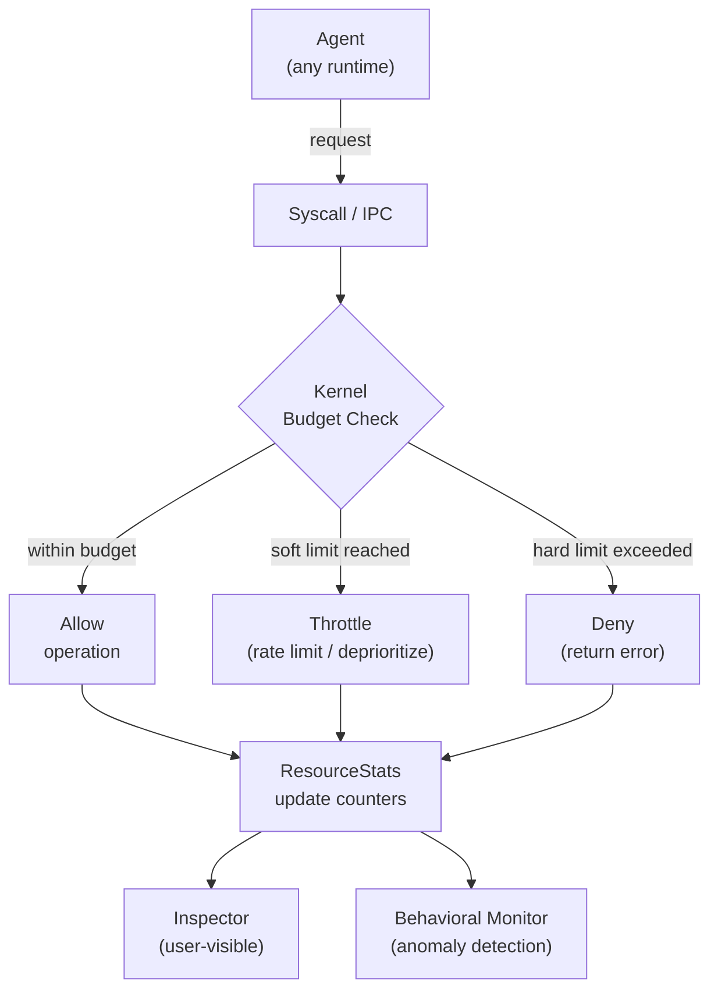

# AIOS Agent Resource Management

Part of: [agents.md](../agents.md) — Agent Framework
**Related:** [sandbox.md](./sandbox.md) — Isolation & Security, [lifecycle.md](./lifecycle.md) — Agent Lifecycle, [scheduler.md](../../kernel/scheduler.md) — CPU scheduling, [memory.md](../../kernel/memory.md) — Memory management, [airs.md](../../intelligence/airs.md) — Inference metering

-----

## 14. Resource Budgets & Accounting

Every agent runs within a resource envelope defined by its trust level, manifest declarations, and user overrides. The kernel enforces hard limits. The Agent Runtime tracks soft limits and emits warnings. AIRS observes resource patterns and recommends adjustments.

Resource accounting serves three goals:

1. **Fairness.** No single agent can monopolize CPU, memory, network, or inference capacity. The system remains responsive even when a third-party agent misbehaves.

2. **Transparency.** The Inspector shows real-time and historical resource usage per agent. Users can see exactly what each agent costs and make informed decisions about which agents to keep, pause, or remove.

3. **Predictability.** Agents declare their expected resource needs in the manifest. The Agent Runtime validates these declarations against observed behavior. Divergence triggers alerts, not silent degradation.



### 14.1 ResourceStats

The `ResourceStats` struct is the canonical accounting record for every running agent. The kernel maintains one instance per `AgentProcess`. Fields are updated atomically by the kernel — agents can read their own stats but cannot modify them.

```rust
/// Per-agent resource accounting, maintained by the kernel.
/// Read-only from the agent's perspective.
pub struct ResourceStats {
    // Memory
    pub memory_allocated: u64,      // bytes currently allocated
    pub memory_limit: u64,          // maximum allowed
    pub memory_peak: u64,           // high water mark
    pub page_faults: u64,           // total page faults

    // CPU
    pub cpu_time_ns: u64,           // total CPU time consumed
    pub cpu_quota_ns: u64,          // per-period quota
    pub cpu_period_ns: u64,         // quota reset period
    pub context_switches: u64,      // voluntary + involuntary
    pub preemptions: u64,           // involuntary context switches

    // IPC
    pub ipc_messages_sent: u64,
    pub ipc_messages_received: u64,
    pub ipc_bytes_sent: u64,
    pub ipc_bytes_received: u64,
    pub ipc_channels_open: u32,
    pub ipc_channels_limit: u32,

    // Network
    pub network_bytes_sent: u64,
    pub network_bytes_received: u64,
    pub network_connections_open: u32,
    pub network_connections_limit: u32,

    // Inference
    pub inference_tokens_used: u64,
    pub inference_tokens_limit: u64,
    pub inference_requests: u64,
    pub inference_latency_sum_ns: u64,

    // Space
    pub space_bytes_written: u64,
    pub space_bytes_read: u64,
    pub space_objects_created: u64,

    // Lifecycle
    pub uptime_ns: u64,
    pub restart_count: u32,
}
```

**Design rationale:**

- All counters are `u64` to avoid overflow in long-running agents. At 10 GB/s of IPC throughput, `ipc_bytes_sent` overflows after ~58 years.
- `memory_peak` captures the high water mark independently of current allocation. This is valuable for the Inspector and for AIRS behavioral analysis — an agent that allocates 1 GB briefly and then frees it looks different from one that holds 1 GB permanently.
- Inference fields track both token count and latency sum. Average latency per request is `inference_latency_sum_ns / inference_requests`. This avoids maintaining a histogram in kernel space while still enabling meaningful reporting.
- `restart_count` tracks how many times the Agent Runtime has restarted this agent (due to crashes or watchdog timeouts). A high restart count signals instability to the Behavioral Monitor (see [behavioral-monitor.md](../../intelligence/behavioral-monitor.md) §3).

**Access pattern:** Agents read their own `ResourceStats` via the `Stats` syscall (syscall 13). The Inspector reads any agent's stats via a capability-gated IPC query to the Agent Runtime. AIRS receives periodic snapshots for anomaly detection.

### 14.2 Memory Budgets

Memory is the most constrained resource on AIOS target hardware (Raspberry Pi 4 with 4-8 GB RAM shared across kernel, agents, and model weights). Every agent has a hard memory limit enforced by the kernel page allocator.

#### 14.2.1 Limit Assignment

Memory limits are determined by a layered policy:

```text
Manifest declaration          Agent declares expected memory needs
    ↓
Trust-level defaults          System/First-party/Third-party/Tab defaults
    ↓
User override                 User can raise or lower via Settings
    ↓
System pressure adjustment    Kernel may reduce effective limits under pressure
```

Default limits by trust level:

| Trust Level | Default Memory Limit | Rationale |
|---|---|---|
| System | Unlimited (kernel pool) | Compositor, AIRS need full access |
| First-party | 512 MB | Browser, media player — known workloads |
| Third-party | 128 MB | Conservative default, user can raise |
| Tab | 64 MB | Per-origin isolation, many concurrent tabs |

#### 14.2.2 Enforcement

The kernel enforces memory limits at two levels:

1. **Page allocation.** When an agent's `memory_allocated` would exceed `memory_limit`, the frame allocator returns an error. The agent receives an out-of-memory error from its `alloc` implementation. Well-written agents handle this gracefully; agents that panic are restarted by the Agent Runtime.

2. **Address space size.** The kernel caps the number of pages mapped into an agent's TTBR0 address space (see [memory/virtual.md](../../kernel/memory/virtual.md) §5). This prevents an agent from mapping shared memory regions to circumvent its allocation limit.

#### 14.2.3 OOM Handling

When system-wide memory pressure reaches critical levels, the kernel's memory reclamation system (see [memory/reclamation.md](../../kernel/memory/reclamation.md) §8) selects agents for memory reduction using the following priority order:

1. **Tab agents** with no visible surface — evict first (can be recreated on demand).
2. **Background agents** with `Suspended` state — reclaim pages, preserve minimal state.
3. **Third-party agents** exceeding their soft limit — reduce to soft limit.
4. **Agents with the highest `memory_peak`** — these have demonstrated willingness to use large amounts of memory.

The kernel never kills system agents or first-party agents for OOM. If memory pressure persists after reclaiming from lower-trust agents, the system notifies the user via the Attention Manager (see [attention.md](../../intelligence/attention.md)).

### 14.3 CPU Quotas

CPU accounting uses a quota-and-period model. Each agent is assigned a CPU time quota that resets at the end of each period. The scheduler enforces quotas by deprioritizing agents that have exhausted their allocation.

#### 14.3.1 Quota Model

```text
quota / period = maximum CPU utilization fraction

Example: 50ms quota / 100ms period = 50% of one core
```

The scheduler tracks CPU time consumed by each agent's threads. When an agent's cumulative CPU time within the current period reaches its quota, the scheduler moves all of the agent's threads to the `Throttled` state. Throttled threads are not eligible for scheduling until the period resets. See [scheduler.md](../../kernel/scheduler.md) for the per-CPU run queue implementation.

Default quotas by trust level:

| Trust Level | Default Quota | Period | Effective Max |
|---|---|---|---|
| System | No quota | N/A | Unlimited |
| First-party | 200 ms | 250 ms | 80% of one core |
| Third-party | 50 ms | 250 ms | 20% of one core |
| Tab | 25 ms | 250 ms | 10% of one core |

#### 14.3.2 Burst Allowance

Strict quota enforcement penalizes agents with bursty workloads (e.g., a text editor that reindexes on save). The scheduler allows limited burst by carrying unused quota forward for one period:

```text
Period 1: used 10ms of 50ms quota → 40ms carry-forward
Period 2: available = 50ms + 40ms = 90ms (capped at 2x quota = 100ms)
Period 3: no carry-forward from Period 2 (unused carry expires)
```

This allows short bursts without permitting sustained over-utilization.

#### 14.3.3 Multi-Core Accounting

CPU quotas are per-agent, not per-core. An agent with a 50ms quota and 250ms period can use 50ms across any combination of cores. The scheduler's load balancer (see [scheduler.md](../../kernel/scheduler.md)) migrates threads as needed, but the total CPU time consumed is tracked centrally in `ResourceStats.cpu_time_ns`.

### 14.4 IPC & Network Limits

#### 14.4.1 IPC Limits

IPC limits prevent a single agent from exhausting system-wide IPC resources (channel table slots, message ring capacity, shared memory regions):

| Resource | System | First-party | Third-party | Tab |
|---|---|---|---|---|
| Open channels | 64 | 32 | 16 | 8 |
| Messages/second | No limit | 10,000 | 1,000 | 500 |
| Shared memory regions | 32 | 16 | 8 | 4 |
| Shared memory total | 256 MB | 64 MB | 16 MB | 4 MB |

Channel limits are enforced by the kernel's `channel_create` syscall — it checks the calling agent's `ipc_channels_open` against `ipc_channels_limit` before allocating a channel slot.

Message rate limiting is enforced by the Agent Runtime as a soft limit. The kernel counts messages but does not drop them. When an agent exceeds its message rate, the Agent Runtime logs a warning and, on repeated violations, notifies the Behavioral Monitor.

#### 14.4.2 Network Limits

Network budgets control bandwidth and connection count per agent. The networking subsystem (see [networking.md](../../platform/networking.md)) enforces these limits at the capability gate:

| Resource | System | First-party | Third-party | Tab |
|---|---|---|---|---|
| Connections | Unlimited | 256 | 64 | 16 |
| Bandwidth (egress) | Unlimited | 100 Mbps | 10 Mbps | 5 Mbps |
| Bandwidth (ingress) | Unlimited | Unlimited | 50 Mbps | 10 Mbps |

Network limits interact with the capability system — an agent must hold a `NetworkAccess` capability to open any connection. The capability token encodes the agent's bandwidth and connection limits, so enforcement happens at the point of connection establishment and packet transmission without additional lookups.

Tab agents are additionally restricted to their declared origin. A tab agent for `example.com` cannot open connections to `other.com` without a cross-origin capability grant from the user.

### 14.5 Inference Budgets & Resource Pressure

#### 14.5.1 Inference Token Quotas

Inference is a scarce, high-cost resource. Every agent that uses AIRS inference operates within a token budget. Token budgets are metered by the AIRS inference engine (see [airs.md](../../intelligence/airs.md) §3.5) and reported back to the kernel via `ResourceStats`.

```text
Inference budget lifecycle:

  Agent manifest declares: inference_tokens_per_day = 10000
  User can override in Settings: inference_tokens_per_day = 50000
  AIRS metering tracks: inference_tokens_used (monotonic counter)
  Agent Runtime resets daily counter at midnight local time
```

When an agent exhausts its token budget:

1. The AIRS inference engine returns an `InferenceBudgetExhausted` error.
2. The agent can inform the user that it needs more tokens.
3. The user can grant additional tokens via Settings or the Inspector.
4. The agent cannot silently escalate its own budget.

Request rate limiting is separate from token budgets. An agent might have 10,000 tokens remaining but be limited to 10 requests per minute to prevent inference queue monopolization.

| Trust Level | Default Tokens/Day | Max Requests/Min |
|---|---|---|
| System | Unlimited | Unlimited |
| First-party | 100,000 | 60 |
| Third-party | 10,000 | 10 |
| Tab | 1,000 | 5 |

#### 14.5.2 Resource Pressure Response

When the system is under resource pressure (memory, CPU, thermal, or battery), agents must adapt. The kernel broadcasts pressure notifications to all agents via the notification subsystem (see [ipc.md](../../kernel/ipc.md)). Agents receive a `ResourcePressure` event indicating the pressure level and affected resource.

```rust
/// Pressure levels broadcast to agents.
pub enum PressureLevel {
    /// Normal operation. No action required.
    None,
    /// Moderate pressure. Reduce optional work (prefetching, background indexing).
    Moderate,
    /// Severe pressure. Release caches, defer non-essential operations.
    Severe,
    /// Critical pressure. Minimize all resource usage immediately.
    /// Failure to respond may result in forced suspension.
    Critical,
}

/// Pressure event delivered to agents via notification channel.
pub struct ResourcePressureEvent {
    pub level: PressureLevel,
    pub resource: PressuredResource,   // Memory, Cpu, Thermal, Battery
    pub agent_memory_target: u64,      // suggested memory reduction target
    pub duration_hint_ms: u64,         // estimated duration of pressure
}
```

Well-behaved agents respond to pressure events by releasing caches, reducing prefetch activity, and lowering rendering quality. The Behavioral Monitor tracks whether agents respond appropriately to pressure events — agents that ignore critical pressure repeatedly are flagged for user review.

**Forced suspension.** If an agent does not reduce its resource usage within 5 seconds of a `Critical` pressure notification, the kernel may forcibly suspend the agent (transition to `Suspended` state). Suspended agents retain their address space but receive no CPU time. The Agent Runtime restores them when pressure subsides.

#### 14.5.3 Space Storage Accounting

Space I/O is tracked but not hard-limited by default. The `space_bytes_written`, `space_bytes_read`, and `space_objects_created` counters provide visibility into an agent's storage behavior. Excessive write activity triggers a Behavioral Monitor alert rather than a hard error — this is because space data belongs to the user, and silently blocking writes could cause data loss.

The exception is ephemeral spaces (see [spaces.md](../../storage/spaces.md)), where per-agent quotas are enforced via `SpaceQuota`. An agent that fills its ephemeral space receives a storage error. The user's personal spaces have system-wide quotas rather than per-agent quotas.

-----

*Next: [intelligence.md](./intelligence.md) — Kernel-internal ML, AIRS-dependent intelligence, future directions*
