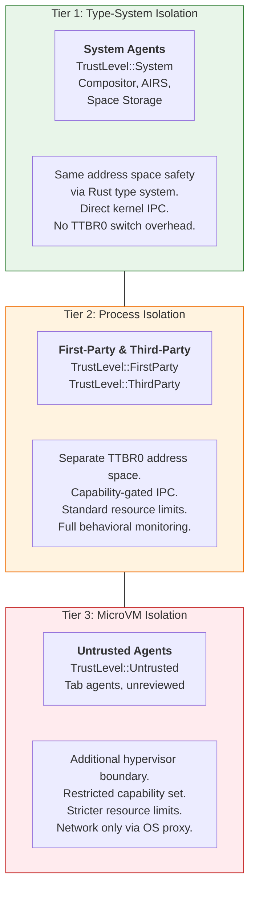
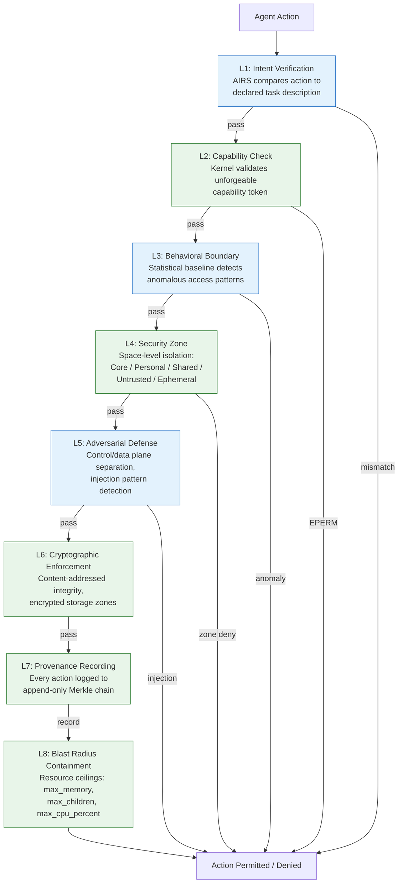

# AIOS Agent Sandbox & Security

Part of: [agents.md](../agents.md) — Agent Framework
**Related:** [model.md](../../security/model.md) — Security Model, [anatomy.md](./anatomy.md) — Agent Anatomy, [lifecycle.md](./lifecycle.md) — Agent Lifecycle, [resources.md](./resources.md) — Resource Budgets

-----

## 6. Isolation Mechanisms

Every agent runs inside a sandbox that the agent cannot escape, weaken, or observe from outside. The sandbox combines hardware isolation (TTBR0 page tables), kernel-enforced capabilities (unforgeable tokens), and graduated trust tiers that match the isolation strength to the agent's provenance. The result is a system where a fully compromised third-party agent cannot corrupt the kernel, other agents, or user data outside its declared scope.

### 6.1 Process Isolation (TTBR0)

Each agent process receives its own TTBR0 page table hierarchy. The kernel builds a 4-level page table set for the agent's user address space and assigns a unique 16-bit ASID (see [memory/virtual.md](../../kernel/memory/virtual.md) §3.4 for ASID allocation). On context switch, the kernel writes the agent's `ASID:PGD` pair to `TTBR0_EL1`, invalidates stale TLB entries, and issues the required barriers (`DSB SY`, `TLBI VMALLE1IS`, `DSB ISH`, `ISB`).

```text
Agent A (TTBR0_A)                Agent B (TTBR0_B)
┌─────────────────┐              ┌─────────────────┐
│ TEXT  0x400000   │              │ TEXT  0x400000   │
│ DATA  0x1000000  │              │ DATA  0x1000000  │
│ HEAP  0x10000000 │              │ HEAP  0x10000000 │
│ STACK 0x7FFF...  │              │ STACK 0x7FFF...  │
└────────┬────────┘              └────────┬────────┘
         │                                │
    ┌────┴────┐                      ┌────┴────┐
    │ PGD (A) │                      │ PGD (B) │
    └────┬────┘                      └────┬────┘
         │                                │
    Physical frames A                Physical frames B
    (no overlap)                     (no overlap)
```

Hardware enforcement properties:

- **No cross-agent memory access.** Agent A's page tables never contain mappings to Agent B's physical frames. A load or store to another agent's memory triggers a synchronous data abort (ESR_EL1 = translation fault), caught by the exception handler.

- **W^X enforcement.** Every page is either writable or executable, never both. The kernel's `map_user_page()` rejects `WRITE | EXECUTE` flag combinations. JIT runtimes (JavaScript in tab agents) use a two-phase protocol: allocate writable, fill code, remap read-execute via syscall.

- **Kernel memory invisible.** TTBR1 maps the kernel address space. User-mode code (EL0) cannot access TTBR1-mapped addresses because `PAN` (Privileged Access Never) and `UXN`/`PXN` bits prevent it. The kernel is architecturally invisible to agents.

- **KASLR.** The kernel's virtual base address is randomized at boot (see [memory/virtual.md](../../kernel/memory/virtual.md) §3.3). Even if an agent discovers a kernel address through a side channel, the address is meaningless across reboots.

### 6.2 Graduated Isolation Tiers

Not all agents need the same isolation strength. System agents that are part of the OS have been audited and signed by the AIOS root key. Tab agents running arbitrary JavaScript from the web need maximum containment. AIOS uses three isolation tiers, selected by the agent's trust level at installation time.



| Property | Tier 1 (System) | Tier 2 (Process) | Tier 3 (MicroVM) |
|---|---|---|---|
| Address space | Shared (kernel) | Separate TTBR0 | Separate TTBR0 + EL2 boundary |
| IPC mechanism | Direct function call | Kernel-mediated channels | Kernel-mediated + hypercall exit |
| Capability set | Broad (system caps) | Manifest-declared | Restricted subset |
| Resource limits | Generous (system budgets) | Per-manifest | Strict (reduced ceilings) |
| Behavioral monitoring | Audit-only | Full statistical baseline | Full + elevated alert threshold |
| Recovery on crash | Kernel restart path | Process restart | VM teardown + restart |
| Context switch cost | None (in-kernel) | TTBR0 swap (~1 us) | VM exit/enter (~5-10 us) |

**Tier selection is immutable after installation.** An agent cannot request a tier upgrade at runtime. Upgrading from Tier 3 to Tier 2 requires a new manifest version, AIRS re-analysis, and user re-approval.

**Tier 1 agents are not trusted blindly.** They are signed by the AIOS root key, compiled from audited source, and verified at boot. The type-system isolation relies on Rust's ownership and borrowing guarantees — a system agent written in safe Rust cannot corrupt another system agent's data structures even within the same address space. `unsafe` blocks in system agents are minimized and individually reviewed.

### 6.3 Capability Confinement & Static Route Verification

Every agent action that crosses its sandbox boundary requires a capability token. Tokens are unforgeable kernel objects (64-bit identifiers backed by a per-process capability table). The kernel creates tokens at agent start based on the manifest's `required_capabilities` list, after user approval.

For the full capability system internals (token lifecycle, attenuation, delegation, temporal capabilities), see [model/capabilities.md](../../security/model/capabilities.md) §3.

**Static capability route verification.** Inspired by Fuchsia's Component Framework, AIOS verifies at manifest-parse time that every declared capability can be satisfied by the system. This is a compile-time-equivalent check for the agent model.

```text
Agent Manifest declares:
  required_capabilities:
    - ReadSpace("user/documents/")
    - Network("api.example.com")
    - InferRequest

System verifies at install time:
  ✓ ReadSpace("user/documents/")  — space exists, user can grant
  ✓ Network("api.example.com")    — network subsystem available
  ✓ InferRequest                  — AIRS service registered

  If any capability cannot be routed:
  ✗ ReadSpace("system/audit/")    — requires TrustLevel::System
  → Installation FAILS with diagnostic:
    "Agent requires ReadSpace('system/audit/') but trust level
     ThirdParty cannot access system spaces."
```

Benefits of static route verification:

- **Fail-fast.** An agent that requests a capability the system cannot provide fails at install, not at runtime. The user never sees a broken agent.
- **Manifest completeness.** Developers discover missing capability declarations during development (`aios agent audit`), not after deployment.
- **Reduced attack surface.** The kernel never creates tokens for capabilities that cannot be satisfied. Fewer tokens means fewer things to revoke.

**Capability attenuation at delegation.** When Agent A delegates a capability to Agent B, the delegated token can only be equal to or weaker than Agent A's token. `ReadSpace("user/documents/")` can be attenuated to `ReadSpace("user/documents/reports/")` but never widened to `ReadSpace("user/")`. The kernel enforces monotonic capability reduction — see [model/capabilities.md](../../security/model/capabilities.md) §3.3.

### 6.4 WASI Capability Model Alignment

WASM agents run inside the wasmtime runtime and interact with AIOS through WIT (WebAssembly Interface Types) imports. Each WIT import maps directly to an AIOS capability token. The mapping is verified at component instantiation — before the WASM module executes its first instruction.

```text
WIT World: wasi-aios-agent

  import wasi-aios:spaces/read      → requires Capability::SpaceRead
  import wasi-aios:spaces/write     → requires Capability::SpaceWrite
  import wasi-aios:flow/push        → requires Capability::FlowPush
  import wasi-aios:inference/request → requires Capability::InferRequest
  import wasi-aios:network/fetch    → requires Capability::Network

Component instantiation:
  1. Parse WASM component, extract import list
  2. For each import, look up required AIOS capability
  3. Check agent's capability table for matching token
  4. If ANY import lacks a matching token → instantiation DENIED
  5. If all match → bind host functions, start execution
```

This alignment provides defense in depth: the WASM sandbox (linear memory, no raw pointers, no syscall access) is the inner boundary, and the AIOS capability system is the outer boundary. A WASM agent must breach both to escape.

| WASI Import | AIOS Capability | Enforcement Point |
|---|---|---|
| `wasi-aios:spaces/read` | `SpaceRead(path)` | Component instantiation + each call |
| `wasi-aios:spaces/write` | `SpaceWrite(path)` | Component instantiation + each call |
| `wasi-aios:flow/push` | `FlowPush` | Component instantiation + each call |
| `wasi-aios:flow/pull` | `FlowPull` | Component instantiation + each call |
| `wasi-aios:inference/request` | `InferRequest` | Component instantiation + each call |
| `wasi-aios:network/fetch` | `Network(origin)` | Component instantiation + each call |
| `wasi-aios:ipc/call` | `ChannelAccess(id)` | Component instantiation + each call |

The "each call" verification is not redundant with the instantiation check. Temporal capabilities may expire between instantiation and use. Revocation may remove a token mid-session. The double-check ensures that a capability that was valid at startup is still valid at the moment of use.

For the full WASM runtime architecture and WIT world definitions, see [language-ecosystem/runtimes.md](../../project/language-ecosystem/runtimes.md) §5 and [language-ecosystem/operations.md](../../project/language-ecosystem/operations.md) §9.

-----

## 7. Security Layer Integration

Agent security is not a single mechanism — it is eight independent layers, each catching threats the others might miss. The structural layers (2, 4, 7, 8) are kernel-enforced and function even when AIRS is completely unavailable. The AI layers (1, 3, 5) provide additional detection for attacks that are structurally permitted but behaviorally anomalous.

For the full eight-layer deep dive, see [model/layers.md](../../security/model/layers.md) §2.

### 7.1 Agent Syscalls

Agents interact with the kernel through 17 syscalls organized into six categories. Each syscall is dispatched through `SVC #0` (from EL0), with the syscall number in `x8` and up to six arguments in `x0`-`x5`. The kernel validates every argument, checks the calling agent's capability table, and returns the result in `x0`.

```rust
/// Agent-facing syscalls. A subset of the 31 kernel syscalls,
/// exposed through the Agent SDK as safe Rust functions.
#[repr(u64)]
pub enum AgentSyscall {
    // ── IPC (4 syscalls) ──────────────────────────────────
    /// Send a message and block until reply.
    /// Requires: ChannelAccess(channel_id)
    IpcCall     = 0,
    /// Send a message without blocking.
    /// Requires: ChannelAccess(channel_id)
    IpcSend     = 1,
    /// Block until a message arrives on a channel.
    /// Requires: ChannelAccess(channel_id)
    IpcRecv     = 2,
    /// Reply to a received call.
    /// Requires: none (reply token from IpcRecv)
    IpcReply    = 3,

    // ── Memory (3 syscalls) ───────────────────────────────
    /// Allocate pages in the agent's address space.
    /// Requires: none (bounded by BlastRadiusPolicy.max_memory)
    MemAlloc    = 18,
    /// Free previously allocated pages.
    /// Requires: none (must own the pages)
    MemFree     = 19,
    /// Create or map a shared memory region.
    /// Requires: SharedMemoryCreate or SharedMemoryAccess
    MemShare    = 20,

    // ── Capabilities (3 syscalls) ─────────────────────────
    /// Request a new capability (triggers user approval UI).
    /// Requires: none (approval is the gate)
    CapRequest  = 14,
    /// Delegate an attenuated capability to another agent.
    /// Requires: the capability being delegated + CapDelegate
    CapDelegate = 15,
    /// Revoke a previously delegated capability.
    /// Requires: ownership of the delegation chain
    CapRevoke   = 16,

    // ── Flow (3 syscalls) ─────────────────────────────────
    /// Push content to the Flow clipboard/transfer system.
    /// Requires: FlowPush
    FlowPush    = 40,
    /// Pull content from Flow.
    /// Requires: FlowPull
    FlowPull    = 41,
    /// Subscribe to Flow events matching a predicate.
    /// Requires: FlowSubscribe
    FlowSubscribe = 42,

    // ── System (3 syscalls) ───────────────────────────────
    /// Open a handle to a Space for reading/writing objects.
    /// Requires: SpaceRead(path) or SpaceWrite(path)
    SpaceOpen   = 50,
    /// Query objects within an open Space.
    /// Requires: SpaceRead(path)
    SpaceQuery  = 51,
    /// Submit an inference request to AIRS.
    /// Requires: InferRequest
    InferRequest = 60,

    // ── Debug (1 syscall) ─────────────────────────────────
    /// Write a debug log line (visible in Inspector).
    /// Requires: none (rate-limited to 100 lines/second)
    DebugLog    = 30,
}
```

**Syscall validation order.** Every syscall follows the same validation pipeline:

```text
1. Trap to EL1 (SVC #0)
2. Save TrapFrame (272 bytes: 31 GP regs + SP_EL0 + ELR_EL1 + SPSR_EL1)
3. Identify calling process (from current thread's ProcessId)
4. Validate syscall number (reject unknown numbers with ENOSYS)
5. Validate arguments (pointer range checks, alignment, bounds)
6. Check capability table (reject if required token missing → EPERM)
7. Execute syscall logic
8. Write result to TrapFrame.x0
9. Return to EL0 (ERET)
```

### 7.2 Eight Security Layers

Each security layer operates independently. When AIRS is unavailable, the AI-dependent layers (1, 3, 5) degrade gracefully — the system falls back to a traditional capability OS with structural enforcement only.



**Layer classification:**

| Layer | Type | Enforcement | AIRS Required | Fallback |
|---|---|---|---|---|
| L1: Intent Verification | AI | Soft (warn/block) | Yes | Skip — action proceeds to L2 |
| L2: Capability Check | Structural | Hard (EPERM) | No | N/A — always active |
| L3: Behavioral Boundary | AI | Soft (rate-limit/pause) | Yes | Skip — no anomaly detection |
| L4: Security Zone | Structural | Hard (zone deny) | No | N/A — always active |
| L5: Adversarial Defense | AI + Structural | Hard (block injection) | Partial | Pattern matching only (no ML classifier) |
| L6: Cryptographic Enforcement | Structural | Hard (integrity fail) | No | N/A — always active |
| L7: Provenance Recording | Structural | Record-only | No | N/A — always active |
| L8: Blast Radius Containment | Structural | Hard (resource deny) | No | N/A — always active |

**The security floor.** When AIRS is completely unavailable, the system operates with layers 2, 4, 6, 7, and 8 — equivalent to a well-designed capability OS. This is the security floor, not the ceiling. The AI layers raise the ceiling by detecting attacks that are structurally permitted but behaviorally anomalous (e.g., a supply chain attack where the compromised agent has legitimate capabilities but uses them in new patterns).

For the full description of each layer's internal design, see [model/layers.md](../../security/model/layers.md) §2.1-§2.8. For attack scenarios showing how multiple layers interact, see [model.md](../../security/model.md) §1.4.

### 7.3 Causal Trace DAGs

Every IPC message in AIOS carries two fields that enable post-incident causation analysis:

```rust
pub struct IpcMessageHeader {
    /// Unique identifier for this trace (propagated across the call chain).
    pub trace_id: TraceId,
    /// The trace_id of the message that caused this message to be sent.
    /// Root messages (user-initiated) have parent_trace_id == trace_id.
    pub parent_trace_id: TraceId,
    /// The agent that sent this message.
    pub sender: AgentId,
    /// Monotonic timestamp (kernel TICK_COUNT at send time).
    pub timestamp: u64,
    // ... remaining header fields
}
```

These fields form a directed acyclic graph (DAG) of causation across the entire agent population:

```text
User clicks "Summarize"
  trace: A001, parent: A001       ← root node (user action)
  │
  ├── Browser Agent → AIRS: InferRequest
  │   trace: A002, parent: A001
  │   │
  │   ├── AIRS → Space Storage: SpaceQuery("user/documents/")
  │   │   trace: A003, parent: A002
  │   │
  │   └── AIRS → Network: fetch("api.anthropic.com")
  │       trace: A004, parent: A002
  │
  └── Browser Agent → Compositor: UpdateSurface
      trace: A005, parent: A001
```

**Incident reconstruction.** When a security event fires (e.g., Layer 3 detects anomalous behavior from AIRS), the trace DAG enables root-cause analysis:

1. Start from the anomalous action's `trace_id`.
2. Walk `parent_trace_id` edges backward to find the originating agent and user action.
3. Walk forward from the root to find all agents that participated in the causal chain.
4. Correlate with Layer 7 provenance records to build a complete timeline.

The DAG answers questions that flat audit logs cannot: "Which agent *caused* this action?" rather than just "Which agent *performed* this action?" This is critical for multi-agent systems where Agent A might trick Agent B into performing a malicious action on Agent A's behalf (confused deputy attack).

**DAG integrity.** The `trace_id` and `parent_trace_id` fields are set by the kernel at IPC send time, not by the sending agent. An agent cannot forge a trace lineage. The kernel copies the current thread's active `trace_id` into outgoing messages and generates new `trace_id` values via a monotonic counter. Trace records are stored in the kernel's provenance ring buffer (see [model/layers.md](../../security/model/layers.md) §2.7) and persisted to `system/audit/` by the Space Storage service.

### 7.4 Trust Level Enforcement

Trust levels are assigned at installation and enforced throughout the agent's lifetime. The kernel stores the trust level in the `ProcessControl` structure and checks it on every capability operation.

```rust
#[derive(Clone, Copy, PartialEq, Eq, PartialOrd, Ord)]
#[repr(u8)]
pub enum TrustLevel {
    /// Kernel and boot-critical services. Signed by AIOS root key.
    System      = 0,
    /// OS-shipped agents (browser, media, inspector). Signed by AIOS key.
    FirstParty  = 1,
    /// Agent Store agents. Signed by developer key, AIRS-analyzed.
    ThirdParty  = 2,
    /// Tab agents, unreviewed agents, sideloaded without signature.
    Untrusted   = 3,
}
```

Trust level determines the ceiling for every security-relevant operation:

| Operation | System | FirstParty | ThirdParty | Untrusted |
|---|---|---|---|---|
| Access system spaces | Yes | Read-only | No | No |
| Spawn child agents | Unlimited | Up to 16 | Up to 4 | No |
| Delegate capabilities | Yes | Yes | Attenuated only | No |
| Direct kernel IPC | Yes | No | No | No |
| Network access | Unrestricted | Per-manifest | Per-manifest | Origin-only |
| Inference requests | Priority | Standard | Rate-limited | Rate-limited + screened |
| Max memory | 512 MB | 256 MB | 128 MB | 64 MB |
| Max CPU (sustained) | 100% | 50% | 25% | 10% |

**Trust level is monotonically non-increasing at runtime.** The kernel provides no API to raise an agent's trust level. A `ThirdParty` agent cannot become `FirstParty` through any runtime action. The only path to a higher trust level is a new agent version signed with the appropriate key, re-analyzed by AIRS, and re-approved by the user.

**Downgrade on anomaly.** Layer 3 (Behavioral Monitoring) can recommend a trust-level downgrade when sustained anomalous behavior is detected. The Agent Runtime reduces the agent's resource limits and capability set to match the lower trust level. The user is notified. The agent can be restored to its original trust level only through explicit user action in Settings.

For the full trust boundary diagram and threat model, see [model.md](../../security/model.md) §1.2.

-----

## Cross-Reference Summary

| Topic | Document |
|---|---|
| Eight security layers (deep dive) | [model/layers.md](../../security/model/layers.md) §2 |
| Capability token lifecycle | [model/capabilities.md](../../security/model/capabilities.md) §3 |
| Trust boundaries and threat model | [model.md](../../security/model.md) §1 |
| Attack scenarios (banking, injection, supply chain, DoS) | [model.md](../../security/model.md) §1.4 |
| Adversarial defense architecture | [adversarial-defense.md](../../security/adversarial-defense.md) |
| WASM runtime and WIT worlds | [language-ecosystem/runtimes.md](../../project/language-ecosystem/runtimes.md) §5 |
| Per-agent address spaces (TTBR0) | [memory/virtual.md](../../kernel/memory/virtual.md) §5 |
| Resource budgets and accounting | [resources.md](./resources.md) §14 |
| Behavioral monitor architecture | [behavioral-monitor.md](../../intelligence/behavioral-monitor.md) |
| Intent verifier architecture | [intent-verifier.md](../../intelligence/intent-verifier.md) |
| Privacy model and taint tracking | [privacy/agent-privacy.md](../../security/privacy/agent-privacy.md) §3 |
