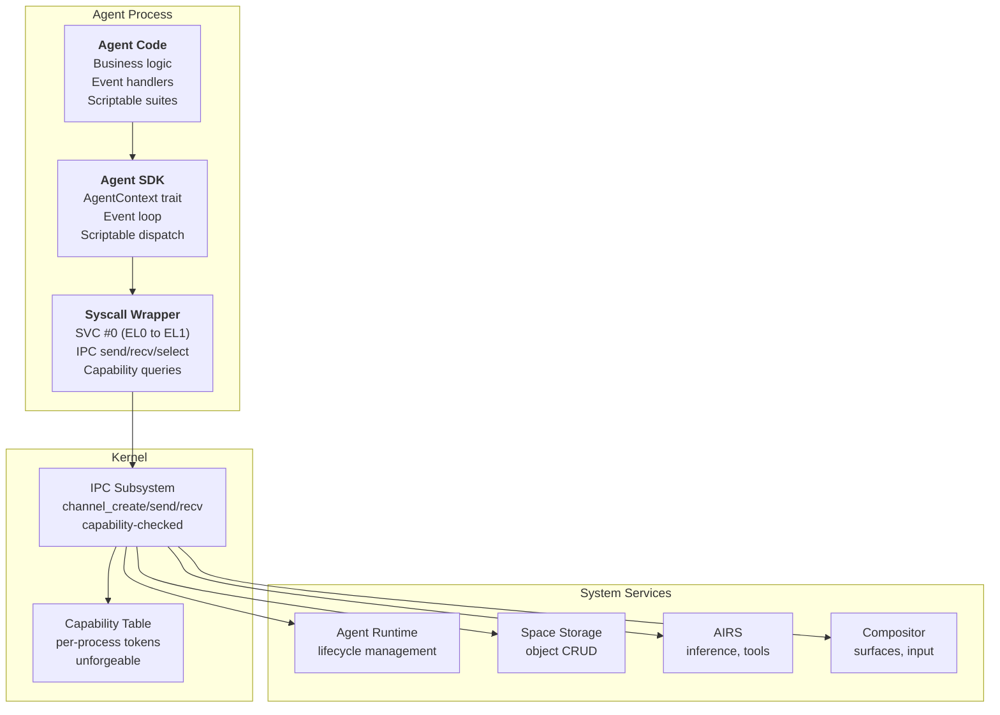
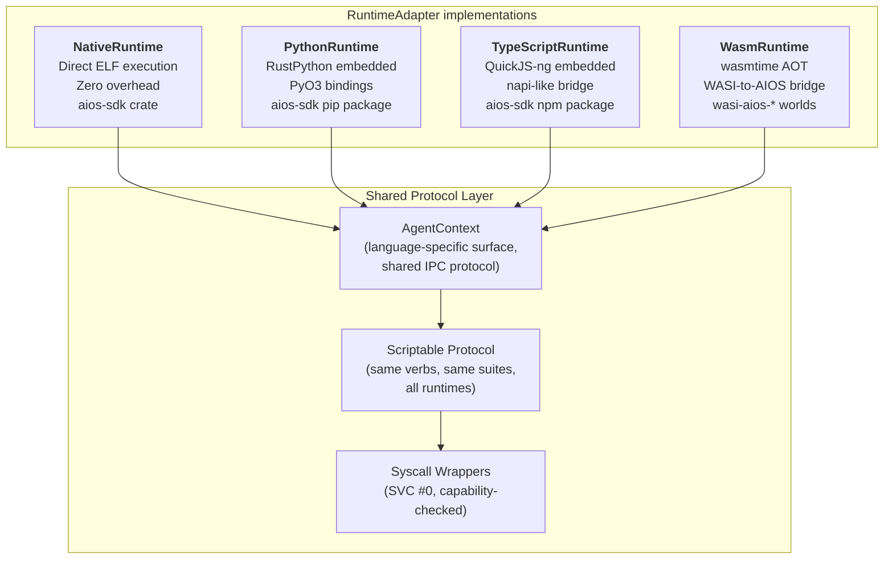

# AIOS Agent SDK & Scriptable Protocol

Part of: [agents.md](../agents.md) — Agent Framework
**Related:** [anatomy.md](./anatomy.md) — Agent anatomy and manifest, [sandbox.md](./sandbox.md) — Isolation and security, [communication.md](./communication.md) — IPC patterns, [lifecycle.md](./lifecycle.md) — Lifecycle and packages

-----

## 8. SDK Architecture

The Agent SDK bridges the gap between agent developer code and the kernel's IPC + capability infrastructure. The developer writes business logic; the SDK handles channel management, event dispatch, message serialization, and capability token bookkeeping. The SDK is language-specific at the API surface (idiomatic Rust, Python, or TypeScript) and uniform at the protocol layer (same IPC messages, same capability model, same Scriptable verbs).



### 8.1 AgentContext Trait

`AgentContext` is the primary interface every agent interacts with. It is constructed by the SDK runtime during startup from the set of IPC channels and capability tokens that the Agent Runtime grants to the process. The agent never constructs an `AgentContext` itself — it receives one.

Each method on `AgentContext` returns a scoped handle that wraps IPC channel operations for that subsystem. The handle holds a reference to the underlying `ChannelId` and serializes method calls into IPC messages. If the agent lacks the capability for a subsystem, the corresponding method returns a handle that fails every call with `CapabilityDenied`.

```rust
pub trait AgentContext: Send + Sync {
    /// Access Space Storage — query, read, write, and manage objects.
    /// Requires ReadSpace/WriteSpace capabilities.
    fn spaces(&self) -> &dyn SpaceClient;

    /// Access the AIRS inference engine — text generation, embeddings,
    /// classification. Requires InferenceCpu/Gpu/Npu capability.
    fn inference(&self) -> &dyn InferenceClient;

    /// Access the Tool Manager — register, discover, and call tools.
    /// Requires ToolRegister/ToolCall capabilities.
    fn tools(&self) -> &dyn ToolClient;

    /// Access the Flow subsystem — context-aware data transfer between
    /// agents and subsystems. Requires FlowSend/FlowReceive capabilities.
    fn flow(&self) -> &dyn FlowClient;

    /// Post attention items (notifications) to the Attention Manager.
    /// Urgency is AI-assessed — the agent provides content, AIRS decides priority.
    fn attention(&self) -> &dyn AttentionClient;

    /// Read user preferences relevant to this agent.
    /// Requires PreferenceRead capability.
    fn preferences(&self) -> &dyn PreferenceClient;

    /// Access this agent's Scriptable interface — execute verbs, describe suites.
    /// Every agent has a Scriptable handle; no capability required for self-access.
    fn scriptable(&self) -> &dyn ScriptableHost;

    /// Get the next event from the SDK event loop.
    /// Blocks until an event is available or the agent is shutting down.
    fn next_event(&self) -> AgentEvent;

    /// Get this agent's manifest.
    fn manifest(&self) -> &AgentManifest;

    /// Get this agent's stable identifier.
    fn agent_id(&self) -> AgentId;

    /// Request graceful shutdown.
    fn shutdown(&self);
}
```

The `SpaceClient`, `InferenceClient`, `ToolClient`, `FlowClient`, `AttentionClient`, and `PreferenceClient` handles are thin wrappers around IPC channels. Each serializes calls into the protocol expected by the target system service and deserializes responses. The agent sees typed Rust (or Python/TypeScript) methods; the SDK sees IPC messages.

### 8.2 The #[agent] Macro

The `#[agent]` proc macro is the entry point for every Rust agent. It generates the boilerplate that connects the developer's code to the SDK runtime: the `_start` function, IPC handshake with the Agent Runtime, panic handler forwarding, `AgentContext` construction from capability channels, and the call to the developer's entry function.

**What the developer writes:**

```rust
use aios_sdk::prelude::*;

#[agent(
    name = "Research Assistant",
    version = "1.0.0",
    capabilities = [
        ReadSpace("research"),
        WriteSpace("research"),
        InferenceCpu(Priority::Normal),
    ],
)]
fn agent_main(ctx: &AgentContext) {
    loop {
        match ctx.next_event() {
            AgentEvent::UserMessage { content, .. } => {
                let results = ctx.spaces().query("research", &content);
                let summary = ctx.inference().complete("Summarize:", &results);
                ctx.flow().send(Response::text(summary));
            }
            AgentEvent::StateChanged(AgentState::Stopping) => break,
            _ => {}
        }
    }
}
```

**What the macro generates:**

```rust
// Manifest embedded in the binary (read by Agent Runtime at load time)
#[link_section = ".aios_manifest"]
static MANIFEST: AgentManifest = AgentManifest {
    name: "Research Assistant",
    version: Version::new(1, 0, 0),
    bundle_id: "com.aios.research-assistant",
    runtime: RuntimeType::Native,
    requested_capabilities: &[
        CapabilityRequest::new(Capability::ReadSpace("research"), true),
        CapabilityRequest::new(Capability::WriteSpace("research"), true),
        CapabilityRequest::new(Capability::InferenceCpu(Priority::Normal), true),
    ],
    // ... remaining fields with defaults ...
};

#[no_mangle]
pub extern "C" fn _start() {
    // 1. IPC handshake with Agent Runtime — receive capability channels
    let channels = sdk_runtime::handshake(&MANIFEST);

    // 2. Install panic handler that forwards to Agent Runtime
    sdk_runtime::install_panic_handler(channels.runtime_channel);

    // 3. Construct AgentContext from granted channels
    let ctx = sdk_runtime::create_context(&MANIFEST, &channels);

    // 4. Call the developer's entry function
    agent_main(&ctx);

    // 5. Clean exit
    sdk_runtime::exit(0);
}
```

The handshake protocol is a three-message exchange:

1. Agent sends `AgentReady { manifest_hash }` on the bootstrap channel (provided by the kernel at process creation).
2. Agent Runtime validates the manifest, mints capability tokens, creates IPC channels to system services, and replies with `ChannelGrant { channels: Vec<(ServiceId, ChannelId)> }`.
3. Agent sends `HandshakeComplete` to confirm it has initialized its `AgentContext`.

After the handshake, the agent's event loop begins receiving events.

### 8.3 Tool Registration

Agents register tools through the `ToolClient` handle, which communicates with the Tool Manager via IPC. The SDK provides a typed surface; the full registration, schema validation, capability enforcement, and seven-stage execution pipeline live in the Tool Manager (see [tool-manager.md](../../intelligence/tool-manager.md) for the complete architecture).

```rust
// Register a tool that other agents (or AIRS) can call
ctx.tools().register(ToolDefinition {
    name: "pdf-extract".into(),
    description: "Extract text from a PDF document".into(),
    parameters: json_schema!({
        "object_id": { "type": "string" },
        "pages": { "type": "string", "description": "Page range" },
    }),
    capability_required: Some(Capability::ReadSpace("documents")),
});

// Discover available tools (from all agents this agent can reach)
let tools = ctx.tools().list(ToolFilter::by_content_type("application/pdf"));

// Call a tool registered by another agent
let result = ctx.tools().call("pdf-extract", json!({
    "object_id": "abc123",
    "pages": "1-5",
}));
```

**SDK-side responsibilities:**

- Serialize `ToolDefinition` into an IPC registration message to the Tool Manager.
- Handle incoming `ToolCallReceived` events by dispatching to the registered handler.
- Serialize the handler's return value back through IPC as a tool call response.
- Propagate errors (timeout, capability denied, handler panic) as typed `ToolError` values.

**Tool Manager responsibilities (not duplicated here):**

- Registry storage, schema validation, versioning (see [registry.md](../../intelligence/tool-manager/registry.md)).
- Seven-stage execution pipeline with 3-level capability validation (see [execution.md](../../intelligence/tool-manager/execution.md)).
- Process isolation, resource limits, crash containment (see [sandboxing.md](../../intelligence/tool-manager/sandboxing.md)).
- MCP bridge for external tool ecosystem compatibility (see [interop.md](../../intelligence/tool-manager/interop.md)).

### 8.4 Event Model

Agents are event-driven. The SDK event loop waits on the agent's IPC channels (via the kernel's `ipc_select` syscall) and delivers typed events. The event loop never blocks the agent — long-running work is dispatched to async tasks within the agent's runtime.

```rust
pub enum AgentEvent {
    /// An IPC message arrived on a channel
    IpcMessage {
        channel: ChannelId,
        message: TypedMessage,
    },

    /// Another agent (or AIRS) is calling one of this agent's tools
    ToolCall {
        caller: AgentId,
        tool_name: String,
        params: Value,
        reply_handle: ReplyHandle,
    },

    /// A timer registered by this agent has fired
    TimerFired {
        timer_id: TimerId,
    },

    /// An object in a mounted Space was created, modified, or deleted
    SpaceChanged {
        space: SpaceId,
        object: ObjectId,
        change: ChangeType,
    },

    /// A Flow entry was received for this agent
    FlowReceived {
        entry: FlowEntry,
    },

    /// The Attention Manager is requesting this agent's attention
    AttentionRequested {
        item: AttentionItem,
    },

    /// The agent's lifecycle state changed
    StateChanged(AgentState),

    /// A Scriptable verb was invoked on this agent by another agent or AIRS
    ScriptableVerb {
        verb: VerbRequest,
        specifier: Specifier,
        reply_handle: ReplyHandle,
    },

    /// A new message from the user in the Conversation Bar
    UserMessage {
        content: String,
        attachments: Vec<ObjectId>,
    },
}
```

Two patterns for handling events:

**Pull-based (recommended for simple agents):**

```rust
fn agent_main(ctx: &AgentContext) {
    loop {
        match ctx.next_event() {
            AgentEvent::ToolCall { tool_name, params, reply_handle, .. } => {
                let result = handle_tool_call(&tool_name, params);
                reply_handle.reply(result);
            }
            AgentEvent::StateChanged(AgentState::Stopping) => break,
            _ => {}
        }
    }
}
```

**Callback-based (for agents with many event sources):**

```rust
fn agent_main(ctx: &AgentContext) {
    ctx.on_tool_call("pdf-extract", |params| extract_pdf(params));
    ctx.on_space_changed("documents", |change| reindex(change));
    ctx.on_flow_received(|entry| process_flow(entry));
    ctx.run_event_loop(); // blocks until shutdown
}
```

Both patterns result in the same underlying `ipc_select` loop. The callback API is sugar — it registers handlers in a dispatch table that the SDK consults when events arrive.

**Graceful shutdown:** When the Agent Runtime sends a shutdown signal, the SDK delivers `AgentEvent::StateChanged(AgentState::Stopping)`. The agent has 5 seconds to persist state to its Spaces, close subsystem sessions, and return from the event loop. After the deadline, the Agent Runtime forcibly terminates the process.

-----

## 9. Scriptable Protocol & Language Runtimes

### 9.1 Scriptable Trait

The Scriptable trait is the AIOS adaptation of BeOS's scripting suites — a universal protocol that makes every agent programmatically controllable through standardized verbs. Where BeOS's `hey` command could address any running application and traverse its object hierarchy, AIOS's Scriptable protocol enables AIRS to discover what any agent can do, compose multi-agent workflows without custom integration code, and control agents through a uniform verb set.

Every agent implements `Scriptable`. This is mandatory, not opt-in. The default implementation (provided by the `#[agent]` macro or `#[derive(Scriptable)]`) exposes basic lifecycle properties. Agents extend with domain-specific suites that declare their capabilities.

```rust
/// The universal agent introspection and control protocol.
/// Every agent implements this trait — either via derive macro (default suite)
/// or manually (custom suites).
pub trait Scriptable {
    /// Return the complete suite hierarchy for this agent.
    /// Suites are self-describing: they declare which properties exist,
    /// what types they hold, and which verbs are valid for each property.
    fn describe(&self) -> Suite;

    /// Execute a verb on a property identified by the specifier chain.
    /// Returns a Value on success or a ScriptError on failure.
    fn execute_verb(
        &mut self,
        verb: VerbRequest,
        specifier: &Specifier,
    ) -> Result<Value, ScriptError>;
}
```

**Verb kinds.** The protocol supports eight verbs — the original six from BeOS (Get, Set, Create, Delete, Count, Execute) plus two additions for reactive queries and introspection:

```rust
/// The eight universal verbs of the Scriptable protocol.
pub enum VerbKind {
    /// Read a property value
    Get,
    /// Write a property value
    Set,
    /// Create a new entity within a collection property
    Create,
    /// Remove an entity from a collection property
    Delete,
    /// Count entities in a collection property
    Count,
    /// Invoke an action (non-CRUD operation)
    Execute,
    /// Subscribe to changes on a property (reactive queries)
    Subscribe,
    /// Return the suite schema for a property (introspection)
    Describe,
}

/// A verb request with its associated payload.
pub enum VerbRequest {
    Get,
    Set { value: Value },
    Create { value: Value },
    Delete,
    Count,
    Execute { args: Value },
    Subscribe { callback_channel: ChannelId },
    Describe,
}
```

**Suite and property declarations.** A `Suite` is a named collection of properties with their type information and supported verbs — the equivalent of BeOS's `BPropertyInfo`:

```rust
/// A named collection of properties that an agent exposes.
/// Suites are hierarchical: an agent can expose multiple suites,
/// and properties within suites can themselves contain sub-suites.
pub struct Suite {
    /// Suite name (e.g., "agent:base", "editor:document")
    pub name: &'static str,
    /// Human-readable description
    pub description: &'static str,
    /// Properties in this suite
    pub properties: &'static [PropertyInfo],
}

/// A single property within a suite.
pub struct PropertyInfo {
    /// Property name (e.g., "Name", "Document", "Cursor")
    pub name: &'static str,
    /// The type of value this property holds
    pub value_type: ValueType,
    /// Which verbs are valid for this property
    pub supported_verbs: &'static [VerbKind],
    /// Capability required to access this property (if any).
    /// Each specifier step in a chain attenuates capabilities —
    /// traversing "Account.Password" checks capabilities at each level.
    pub capability: Option<Capability>,
    /// Sub-suite exposed by this property (for hierarchical traversal)
    pub sub_suite: Option<&'static Suite>,
}
```

### 9.2 Value System

The Scriptable protocol uses a type-safe value system for property reads and writes. All values are self-describing — the receiver can validate types without prior knowledge of the sender.

```rust
/// The types a Scriptable property can hold.
pub enum ValueType {
    String,
    Integer,
    Float,
    Bool,
    Enum { variants: &'static [&'static str] },
    List { element_type: &'static ValueType },
    Map { key_type: &'static ValueType, value_type: &'static ValueType },
    Suite,
    SchemeUrl,
    ObjectId,
}

/// Runtime values exchanged through the Scriptable protocol.
/// Uses heapless containers for no_std compatibility in kernel-adjacent code.
pub enum Value {
    String(heapless::String<256>),
    Integer(i64),
    Float(f64),
    Bool(bool),
    Enum(heapless::String<64>),
    List(heapless::Vec<Value, 64>),
    Map(heapless::Vec<(Value, Value), 32>),
    Suite(Suite),
    SchemeUrl(heapless::String<256>),
    ObjectId(ObjectId),
    Null,
}
```

**Specifiers.** Specifiers identify which entity within a collection a verb targets. They mirror BeOS's hierarchical addressing (e.g., `Entry 0 of Poses of Window /boot/home`) but use capability-scoped paths:

```rust
/// Identifies a specific entity within a collection property.
/// Specifiers can be chained for hierarchical traversal.
pub enum Specifier {
    /// The property itself (no indexing)
    Direct,
    /// By zero-based index: "Document 0"
    Index(usize),
    /// By name: "Account 'admin'"
    Named(heapless::String<128>),
    /// A range of indices: "Documents 0-4"
    Range { start: usize, end: usize },
    /// Chained traversal: "Password of Account 'admin' of Agent 'identity'"
    /// Each step in the chain checks capabilities at that level.
    Chain(heapless::Vec<Specifier, 8>),
}
```

**Capability attenuation through specifier chains.** When AIRS or another agent traverses a specifier chain, the runtime evaluates the conjunction of all capabilities along the path. For example, `GET Password of Account "admin" of Agent "identity"` requires: (1) `ChannelAccess` to the identity agent, (2) `PropertyAccess(Account)` to enumerate accounts, and (3) `PropertyAccess(Account.Password)` to read the password field. This naturally maps to the AIOS capability attenuation model — derived capabilities are always a subset of the parent (see [capabilities.md](../../security/model/capabilities.md) for the capability system internals).

```rust
/// Errors from Scriptable verb execution.
pub enum ScriptError {
    /// The specified property does not exist
    PropertyNotFound,
    /// The verb is not supported for this property
    VerbNotSupported,
    /// The specifier does not resolve to an entity
    SpecifierNotFound,
    /// Type mismatch between provided value and property type
    TypeMismatch { expected: ValueType, got: ValueType },
    /// The caller lacks a required capability for this property
    CapabilityDenied,
    /// The agent is in a state that prevents this operation
    InvalidState,
    /// Custom error from the agent's verb handler
    Custom(heapless::String<256>),
}
```

### 9.3 Default Agent Suite

Every agent gets a base suite automatically. The `#[agent]` macro and `#[derive(Scriptable)]` both generate this suite, ensuring that AIRS can introspect any agent without the developer writing explicit Scriptable code.

```rust
/// The base suite auto-generated for every agent.
/// Provides the minimum properties needed for AIRS discovery and lifecycle management.
pub const AGENT_BASE_SUITE: Suite = Suite {
    name: "agent:base",
    description: "Standard agent lifecycle and identity properties",
    properties: &[
        PropertyInfo {
            name: "Name",
            value_type: ValueType::String,
            supported_verbs: &[VerbKind::Get],
            capability: None,
            sub_suite: None,
        },
        PropertyInfo {
            name: "State",
            value_type: ValueType::Enum {
                variants: &["Active", "Paused", "Suspended", "Background"],
            },
            supported_verbs: &[VerbKind::Get, VerbKind::Subscribe],
            capability: None,
            sub_suite: None,
        },
        PropertyInfo {
            name: "Version",
            value_type: ValueType::String,
            supported_verbs: &[VerbKind::Get],
            capability: None,
            sub_suite: None,
        },
        PropertyInfo {
            name: "Capabilities",
            value_type: ValueType::List {
                element_type: &ValueType::String,
            },
            supported_verbs: &[VerbKind::Get, VerbKind::Count],
            capability: None,
            sub_suite: None,
        },
        PropertyInfo {
            name: "SupportedTypes",
            value_type: ValueType::List {
                element_type: &ValueType::String,
            },
            supported_verbs: &[VerbKind::Get, VerbKind::Count],
            capability: None,
            sub_suite: None,
        },
        PropertyInfo {
            name: "Suites",
            value_type: ValueType::List {
                element_type: &ValueType::Suite,
            },
            supported_verbs: &[VerbKind::Get, VerbKind::Count, VerbKind::Describe],
            capability: None,
            sub_suite: None,
        },
    ],
};
```

The base suite exposes six properties:

| Property | Type | Verbs | Purpose |
|---|---|---|---|
| `Name` | String | Get | Agent's human-readable name from manifest |
| `State` | Enum | Get, Subscribe | Current lifecycle state |
| `Version` | String | Get | Semantic version from manifest |
| `Capabilities` | List\<String\> | Get, Count | Granted capability set |
| `SupportedTypes` | List\<String\> | Get, Count | Content types this agent handles |
| `Suites` | List\<Suite\> | Get, Count, Describe | All suites this agent exposes |

AIRS uses `Describe` on the `Suites` property to discover what an agent can do without prior knowledge of the agent's domain. This is the foundation of autonomous tool discovery and multi-agent workflow composition.

### 9.4 #[derive(Scriptable)] Macro

The `#[derive(Scriptable)]` macro generates `Scriptable` trait implementations from declarative suite definitions. Suites are defined as `const` items with `'static` lifetime, enabling zero-allocation introspection.

**Example: An editor agent with Document and Cursor suites.**

```rust
use aios_sdk::prelude::*;

const DOCUMENT_SUITE: Suite = Suite {
    name: "editor:document",
    description: "Text document manipulation",
    properties: &[
        PropertyInfo {
            name: "Content",
            value_type: ValueType::String,
            supported_verbs: &[VerbKind::Get, VerbKind::Set],
            capability: Some(Capability::ReadSpace("documents")),
            sub_suite: None,
        },
        PropertyInfo {
            name: "Title",
            value_type: ValueType::String,
            supported_verbs: &[VerbKind::Get, VerbKind::Set],
            capability: None,
            sub_suite: None,
        },
        PropertyInfo {
            name: "WordCount",
            value_type: ValueType::Integer,
            supported_verbs: &[VerbKind::Get],
            capability: None,
            sub_suite: None,
        },
    ],
};

const CURSOR_SUITE: Suite = Suite {
    name: "editor:cursor",
    description: "Cursor position and selection",
    properties: &[
        PropertyInfo {
            name: "Line",
            value_type: ValueType::Integer,
            supported_verbs: &[VerbKind::Get, VerbKind::Set],
            capability: None,
            sub_suite: None,
        },
        PropertyInfo {
            name: "Column",
            value_type: ValueType::Integer,
            supported_verbs: &[VerbKind::Get, VerbKind::Set],
            capability: None,
            sub_suite: None,
        },
    ],
};

#[derive(Scriptable)]
#[suites(DOCUMENT_SUITE, CURSOR_SUITE)]
struct EditorAgent {
    documents: Vec<Document>,
    cursor: CursorPosition,
}
```

The derive macro generates:

1. A `describe()` implementation that returns a combined suite containing `AGENT_BASE_SUITE`, `DOCUMENT_SUITE`, and `CURSOR_SUITE`.
2. An `execute_verb()` implementation that routes verbs to the appropriate property handler based on the specifier chain.
3. Type validation — a `Set` verb with a `Value::Integer` on a `ValueType::String` property returns `ScriptError::TypeMismatch` before the handler is called.

**AIRS interaction example.** With the editor agent running, AIRS can compose operations without any custom integration:

```text
DESCRIBE Suites of Agent "my-editor"
  -> [agent:base, editor:document, editor:cursor]

GET Content of Document 0 of Agent "my-editor"
  -> "Hello, world!"

SET Line of Cursor of Agent "my-editor" to 42
  -> Ok

GET WordCount of Document 0 of Agent "my-editor"
  -> 2

SUBSCRIBE Content of Document 0 of Agent "my-editor"
  -> (notifications sent on every content change)
```

This is the BeOS `hey` command brought into an AI-first OS. AIRS does not need per-agent API documentation — it discovers capabilities at runtime through the Scriptable protocol and composes operations from universal verbs.

### 9.5 Language Runtimes

The Agent SDK supports four language runtimes through the `RuntimeAdapter` trait. All runtimes present the same `AgentContext` API and enforce the same capability model. The language is an implementation detail; the capability set is the security boundary.



All runtimes implement the `RuntimeAdapter` trait defined in the language ecosystem architecture (see [integration.md](../../project/language-ecosystem/integration.md) for the full trait definition and dependency chain):

```rust
pub trait RuntimeAdapter: Send + Sync {
    fn init(&mut self, manifest: &AgentManifest) -> Result<()>;
    fn load(&mut self, code: &[u8]) -> Result<()>;
    fn create_context(&self, channels: &ChannelSet) -> Box<dyn AgentContext>;
    fn run(&mut self, ctx: Box<dyn AgentContext>) -> Result<AgentResult>;
    fn shutdown(&mut self, deadline: Timestamp);
    fn runtime_type(&self) -> RuntimeType;
}
```

**Rust runtime (NativeRuntime).** Rust agents compile to aarch64 ELF binaries and link against the `aios-sdk` crate. SDK methods compile to direct syscall invocations and IPC messages — zero interpreter overhead. The `#[agent]` macro generates the entry point, and `#[derive(Scriptable)]` generates suite implementations at compile time.

- Startup latency: < 1 ms
- Memory overhead: none (native binary)
- Scriptable suites: compiled to const statics, zero-allocation describe/dispatch
- Best for: system agents, performance-critical agents, agents processing large data

**Python runtime (PythonRuntime).** Python agents run in an embedded RustPython interpreter. The `AgentContext` is exposed as a Python class via PyO3-style bindings. A restricted stdlib removes dangerous modules (`subprocess`, `socket`, `ctypes`) that would bypass the capability system. File I/O builtins are redirected through the Space API.

```python
from aios_sdk import agent, AgentContext, Scriptable

@agent(name="Analyzer", capabilities=["ReadSpace('data')"])
class AnalyzerAgent(Scriptable):
    # Suites declared as class attributes
    suites = [{
        "name": "analyzer:stats",
        "properties": [
            {"name": "LastResult", "type": "string", "verbs": ["get"]},
        ],
    }]

    async def on_event(self, ctx: AgentContext, event):
        if event.type == "UserMessage":
            data = await ctx.spaces().query("data", event.content)
            self.last_result = await ctx.inference().complete("Analyze:", data)
            await ctx.flow().send(text=self.last_result)
```

- Startup latency: ~50 ms (interpreter initialization)
- Memory overhead: ~10 MB (RustPython interpreter)
- Scriptable suites: declared as Python dicts, marshalled to Rust `Suite` by the bridge
- Best for: AI/ML agents, data processing, rapid prototyping

**TypeScript runtime (TypeScriptRuntime).** TypeScript agents run in QuickJS-ng, a small embeddable JavaScript engine. The `AgentContext` is exposed as a JavaScript object via a napi-like bridge. Node.js APIs are not available — agents use the AIOS SDK. `fetch()` is redirected through the AI Network Model (ANM).

```typescript
import { agent, AgentContext, defineSuite } from "aios-sdk";

const statsSuite = defineSuite("tracker:stats", [
    { name: "EventCount", type: "integer", verbs: ["get", "subscribe"] },
]);

agent({
    name: "Event Tracker",
    capabilities: ["ReadSpace('events')", "WriteSpace('events')"],
    suites: [statsSuite],
}, async (ctx: AgentContext) => {
    ctx.onToolCall("track-event", async (params) => {
        await ctx.spaces().create("events", params);
        return { status: "tracked" };
    });
    ctx.runEventLoop();
});
```

- Startup latency: < 5 ms (QuickJS-ng is small and fast)
- Memory overhead: < 1 MB (engine only)
- Scriptable suites: declared via `defineSuite()`, serialized to IPC messages
- Best for: web-adjacent agents, UI-heavy agents, agents by web developers

**WASM runtime (WasmRuntime).** WASM agents are compiled to WebAssembly modules on the host and AOT-compiled to native aarch64 at install time via wasmtime's Cranelift backend. They interact with the system through custom WASI worlds that map to AIOS capabilities:

| WASI World | Maps To | Capabilities |
|---|---|---|
| `wasi-aios-spaces` | Space Storage IPC | ReadSpace, WriteSpace |
| `wasi-aios-ai` | AIRS inference IPC | InferenceCpu, InferenceGpu |
| `wasi-aios-ipc` | Raw IPC channels | ChannelCreate, ChannelAccess |
| `wasi-aios-capability` | Capability queries | (introspection only) |

Each WASI world corresponds to a set of AIOS capability tokens. The wasmtime host bindings map WIT imports to IPC messages on the agent's capability-gated channels. This aligns with the WASI Component Model: WIT imports are the WASM equivalent of capability tokens.

- Startup latency: < 1 ms (AOT pre-compiled at install time)
- Memory overhead: ~5 MB (wasmtime runtime)
- Scriptable suites: exported via a `wasi-aios-scriptable` world
- Single-threaded limitation: WASI 0.2 does not support threads; WASI 0.3 (async) is the expected path forward (see [operations.md](../../project/language-ecosystem/operations.md) for the WASI standards timeline)
- Best for: untrusted third-party plugins, language-agnostic agents, sandboxed computation
- Double-sandboxed: WASM linear memory sandbox inside the AIOS capability sandbox

**Security equivalence.** All four runtimes enforce identical security properties. A Python agent cannot do anything a Rust agent cannot do (given the same capabilities), and vice versa. The runtime adapter is an implementation detail hidden behind the `AgentContext` trait. The capability set — granted by the kernel, checked on every IPC message — is the security boundary.

-----

## Protocol Layering

The Scriptable protocol sits between the raw IPC layer and the Tool Manager's AI-aware orchestration. This layering separates concerns cleanly: IPC handles transport, Scriptable handles addressing and verbs, Tool Manager handles AI metadata and safety, and MCP handles external ecosystem compatibility.

```text
+---------------------------------------------+
|  MCP Bridge (external ecosystem compat)      |  <- External AI tools
+---------------------------------------------+
|  Tool Manager (AI metadata, safety levels)   |  <- AIRS tool selection
+---------------------------------------------+
|  Scriptable Protocol (universal verbs)       |  <- GET/SET/CREATE/DELETE/COUNT/EXECUTE
+---------------------------------------------+
|  IPC Kit (capability-gated channels)         |  <- <5us round-trip
+---------------------------------------------+
```

**How the layers interact:**

- **IPC Kit** provides the transport: capability-checked message passing between isolated agent processes. All higher layers are built on IPC messages.

- **Scriptable Protocol** provides the addressing and verb semantics. AIRS uses `DESCRIBE` to discover what agents can do. Simple property reads (`GET Name`, `GET State`) go directly through Scriptable — they are introspection, not execution.

- **Tool Manager** wraps Scriptable with AI-specific metadata: natural language descriptions (for LLM tool selection), safety levels (for the Intent Verifier), timeout policies, and the seven-stage execution pipeline. When AIRS composes a multi-agent workflow, it goes through Tool Manager for safety checks and audit logging.

- **MCP Bridge** translates between AIOS's native Scriptable/Tool protocol and the external Model Context Protocol. External MCP servers appear as registered tools. AIOS tools can be exported as MCP endpoints for external AI systems. The bridge is a thin adapter, not a separate protocol layer (see [interop.md](../../intelligence/tool-manager/interop.md) for the full MCP alignment analysis).

**Design rationale.** BeOS's scripting protocol was universal but had no AI awareness — `hey` could address any app, but there was no intelligent tool selection. MCP has AI-aware tool schemas but assumes a single-host architecture with trusted tools. AIOS layers both: Scriptable provides the universal addressing and verb semantics that BeOS proved essential, while Tool Manager adds the AI metadata, safety enforcement, and cross-process isolation that an AI-first OS requires. Neither layer alone is sufficient; together they provide discoverable, composable, auditable agent cooperation.

-----

## Cross-Reference Index

| Topic | Document | Relevant Sections |
|---|---|---|
| Tool Manager architecture | [tool-manager.md](../../intelligence/tool-manager.md) | §1 Core Insight, §2 Three-Tier Architecture |
| Tool registry & schema | [registry.md](../../intelligence/tool-manager/registry.md) | §3 ToolId, §4 Schema system |
| Tool execution pipeline | [execution.md](../../intelligence/tool-manager/execution.md) | §5 Seven-stage pipeline |
| MCP alignment | [interop.md](../../intelligence/tool-manager/interop.md) | §10 MCP bridge |
| Language runtimes | [runtimes.md](../../project/language-ecosystem/runtimes.md) | §2-§5 Per-runtime deep dives |
| RuntimeAdapter trait | [integration.md](../../project/language-ecosystem/integration.md) | §8 Key decisions |
| WASI Component Model | [operations.md](../../project/language-ecosystem/operations.md) | §9 Runtime interoperability |
| Capability system | [capabilities.md](../../security/model/capabilities.md) | §3.1-§3.6 Token lifecycle |
| IPC subsystem | [ipc.md](../../kernel/ipc.md) | All (Phase 3+) |
| Agent anatomy & manifest | [anatomy.md](./anatomy.md) | §2 AgentProcess, AgentManifest |
| Agent sandbox & isolation | [sandbox.md](./sandbox.md) | §6 Isolation mechanisms |
| BeOS Scriptable lessons | [beos-haiku-redox-lessons.md](../../knowledge/discussions/2026-03-23-jl-beos-haiku-redox-lessons.md) | Lesson 1: Scriptable Agent Protocol |
| App Kit ADR | [app-kit.md](../../knowledge/decisions/2026-03-22-jl-app-kit.md) | Scripting interface decision |
