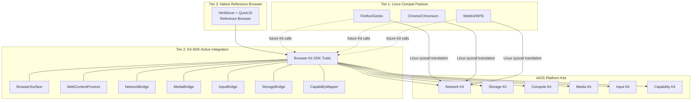

# AIOS Browser Kit

Part of: [architecture.md](../project/architecture.md) — System Architecture
**Kit overview:** [Browser Kit](../kits/application/browser.md) — Application Kit (Layer 4)
**ADR:** [Browser Kit Replaces Progressive Browser](../knowledge/decisions/2026-03-22-jl-browser-kit.md)
**Related:** [subsystem-framework.md](../platform/subsystem-framework.md), [networking.md](../platform/networking.md), [linux-compat.md](../platform/linux-compat.md), [Interface Kit](./ui-toolkit.md)

-----

## §1 Core Insight

Every browser today is a miniature operating system running inside your actual operating system. Chrome has its own process model, sandboxing, networking stack, storage layer, security policy, and GPU abstraction. Chrome's source code is larger than most operating systems.

Browsers became mini-OSes because the actual OS underneath provided nothing useful for web security. The OS gives files and sockets. The browser needs origin isolation, content security policies, sandboxed execution. So the browser rebuilt everything from scratch, on top of an OS that actively gets in its way.

AIOS doesn't have this problem. AIOS already has capabilities, agent isolation, audited networking, Spaces, and Flow. The browser doesn't need to rebuild any of that. It needs to use what the OS provides and focus on the one thing only a browser can do: **execute web content.**

**Browser Kit is the AIOS-native platform SDK** — it defines Rust traits that any browser engine plugs into. AIOS doesn't build a browser engine — it builds the platform that makes any engine a first-class citizen. Firefox, Chrome, and WebKit all integrate through the same Kit traits, gaining capability-enforced security, Space-backed storage, and subsystem-mediated hardware access without modifying their core rendering or JavaScript engines.

-----

## §2 Responsibility Decomposition

What a traditional browser does, and where each responsibility lives in AIOS:

```text
Traditional Browser                    AIOS Decomposition
──────────────────                    ──────────────────
Network stack (HTTP, TLS, DNS)     →  Network Kit (capability-gated, audited)
Connection pooling, caching        →  Network Kit connection manager
Cookie storage                     →  Storage Kit (web-storage Space, per-origin)
localStorage, IndexedDB            →  Storage Kit (sub-spaces per origin)
Process isolation per site         →  Kernel agent isolation (per-tab agent)
Sandboxed renderer                 →  Kernel capability sandbox
Same-origin policy                 →  Capability Kit (origin → capability mapping)
Content Security Policy            →  Capability Kit restrictions
GPU access (WebGL, WebGPU)         →  Compute Kit Tier 2 (compositor-mediated)
Media playback                     →  Media Kit (codecs, sessions, DRM)
Permissions (camera, mic, location)→  Subsystem capability prompts
Download management                →  Flow Kit (into user Space)
──────────────────────────────────────────────────────────
HTML/CSS parsing + layout          ←  STAYS in browser engine
JavaScript execution               ←  STAYS in browser engine
WASM execution                     ←  STAYS in browser engine
DOM manipulation                   ←  STAYS in browser engine
Web API surface                    ←  STAYS in browser (thin shims to Kit traits)
```

The browser shrinks from a mini-OS to a **web content runtime** — a rendering engine and a language runtime, with thin shims that bridge Web APIs to OS services through Browser Kit traits.

-----

## §3 Architecture Overview

Browser Kit operates across three integration tiers, each building on the previous:



### §3.1 Tier 1: Linux Compatibility (Passive)

Firefox, Chrome, and WebKit run unmodified through AIOS's Linux binary compatibility layer (Phase 35-36). The OS applies capability restrictions at the syscall translation boundary — the browser doesn't know it's on AIOS, but AIOS enforces per-process network restrictions, filesystem isolation, and resource accounting.

**What works**: Full web compatibility, extensions, developer tools — everything the browser already does.

**What's limited**: No origin-to-capability mapping, no Space-backed storage, no cross-agent Flow integration. The browser is isolated but not deeply integrated.

### §3.2 Tier 2: Kit SDK (Active Integration)

Browser engines call Browser Kit traits directly for deeper OS integration. This replaces the engine's platform abstraction layer (Chromium Ozone, WebKit WPE backend, Gecko widget layer) with AIOS-native implementations.

**What this enables**: Origin-to-capability mapping, web storage as Spaces, subsystem-mediated hardware access, per-tab resource accounting, capability-level ad blocking, AIRS-searchable browsing data.

### §3.3 Tier 3: Reference Browser (Native)

A lightweight browser built on html5ever (HTML parser) and QuickJS (JavaScript engine) that exercises every Kit trait. Its purpose is to prove the Kit API surface works and provide a basic browser before Linux compat enables full engines.

**What this enables**: Early browser availability (Phase 30, before Linux compat in Phase 35-36), Kit API validation, and a test bed for browser-OS integration patterns.

-----

## §14 Design Principles

### §14.1 Platform, Not Product

AIOS builds the platform that makes browsers better. It does not build a browser engine. Building a browser engine — even partially — means competing with Google, Mozilla, and Apple on their turf. Building the platform means all three benefit from AIOS.

### §14.2 Composition Over Invention

Browser Kit composes existing Platform and Intelligence Kits. It invents nothing that a lower Kit already provides. Network capability gating exists in Network Kit. Storage isolation exists in Storage Kit. Browser Kit adds only browser-specific glue: origin-to-capability derivation, web storage hierarchy mapping, and DOM event translation.

### §14.3 Capability-First

Every browser-OS interaction is mediated by a capability. No ambient authority — a tab agent cannot access any resource without an explicit capability grant derived from its origin, CSP headers, and user consent.

### §14.4 Engine-Agnostic

Browser Kit traits are engine-agnostic. The same `NetworkBridge` trait works for Gecko, Blink, WebKit, Servo, or the reference browser. No trait assumes a specific engine's internals.

### §14.5 Keep Trait Surface Bounded

ChromeOS Lacros (cancelled 2024) demonstrated that browser-OS API surfaces expand without bound when not constrained — growing to 100+ interfaces before the project was abandoned. Browser Kit targets ~12 capability-mediated channels, validated by Fuchsia's Web Runner architecture (~20 FIDL protocols). Trait additions require explicit justification.

### §14.6 Web Content Is Untrusted

All web content — HTML, CSS, JavaScript, WASM, images, fonts — is untrusted input. Browser Kit treats every piece of web content as potentially malicious. Renderers enter a Capsicum-style restricted capability set where only pre-granted capabilities function.

-----

## §15 Implementation Order

Browser Kit integrates at Phase 30 (5 weeks), with full engine availability depending on Linux compatibility (Phase 35-36):

| Sub-phase | Duration | Content | Dependencies |
|---|---|---|---|
| 30A | 2 weeks | Browser Kit traits + reference browser scaffold | Compute Kit, Network Kit, Storage Kit |
| 30B | 2 weeks (concurrent) | Web API bridge (fetch, storage, WebGL, permissions) | 30A traits defined |
| 30C | 1 week | Browser shell (tab management, URL bar, bookmarks) | Interface Kit (Phase 29) |
| 30D | 1 week (concurrent) | Integration (multi-tab compositor, Flow, ad blocking) | 30A + 30B |
| 30E | 1 week | AIOS Web API extensions (aios.space, aios.flow) | 30D |

**Linux compat dependency chain**: Firefox/Chrome availability requires Phase 35 (ELF loader, glibc shim) and Phase 36 (Wayland bridge). WebKit/WPE is recommended as the first Tier 2 integration target due to its minimal embedding API (~4 structs).

-----

## Document Map

| Document | Sections | Content |
|---|---|---|
| **This file** | §1-§3, §14-§15 | Core insight, responsibility decomposition, architecture overview, design principles, implementation order |
| [sdk.md](./browser/sdk.md) | §4-§5 | Browser Kit SDK traits, Web API bridge |
| [origin-mapping.md](./browser/origin-mapping.md) | §6-§7 | Origin-to-capability mapping, CORS as capabilities |
| [storage-bridge.md](./browser/storage-bridge.md) | §8 | Web storage as Spaces |
| [engine-integration.md](./browser/engine-integration.md) | §9-§10 | Engine integration patterns, reference browser |
| [security.md](./browser/security.md) | §11-§12 | Security architecture, unique capabilities |
| [intelligence.md](./browser/intelligence.md) | §13 | AI-native browser intelligence |

## Cross-Reference Index

| Section | Sub-document | Topic |
|---|---|---|
| §1 | This file | Core insight: build platform, not browser |
| §2 | This file | Responsibility decomposition table |
| §3 | This file | Three-tier architecture overview |
| §4 | [sdk.md](./browser/sdk.md) | Browser Kit SDK traits (7 traits) |
| §5 | [sdk.md](./browser/sdk.md) | Web API bridge (fetch, storage, WebGL) |
| §6 | [origin-mapping.md](./browser/origin-mapping.md) | Origin-to-capability mapping |
| §7 | [origin-mapping.md](./browser/origin-mapping.md) | CORS as capabilities |
| §8 | [storage-bridge.md](./browser/storage-bridge.md) | Web storage as Spaces |
| §9 | [engine-integration.md](./browser/engine-integration.md) | Engine integration patterns |
| §10 | [engine-integration.md](./browser/engine-integration.md) | Reference browser (html5ever + QuickJS) |
| §11 | [security.md](./browser/security.md) | Security architecture |
| §12 | [security.md](./browser/security.md) | Unique capabilities |
| §13 | [intelligence.md](./browser/intelligence.md) | AI-native browser intelligence |
| §14 | This file | Design principles |
| §15 | This file | Implementation order |
