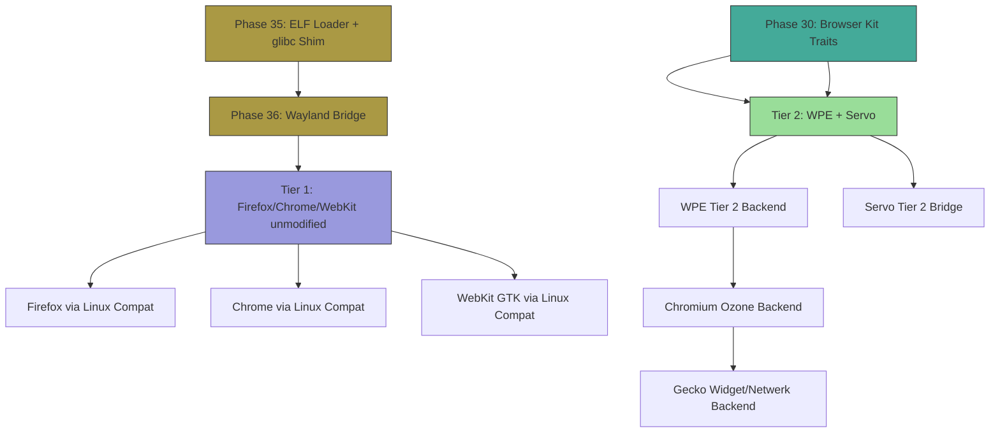

# AIOS Engine Integration Patterns

Part of: [browser.md](../browser.md) — Browser Kit Architecture
**Related:** [sdk.md](./sdk.md) — Browser Kit SDK, [security.md](./security.md) — Security Architecture

-----

## 9. Engine Integration Patterns

Browser Kit defines three integration tiers, each representing a different depth of OS-browser coupling. Every major browser engine fits into at least one tier. The tiers are additive -- an engine can start at Tier 1 (Linux compat, zero modification) and progressively adopt Tier 2 (Kit SDK) as AIOS-specific backends mature.

The tiered model exists because browser engines are among the most complex software artifacts ever built. Expecting Firefox or Chrome to rewrite their platform layers for AIOS on day one is unrealistic. But running them unmodified through Linux compatibility is possible immediately (once Phase 35-36 land), and that provides a viable browser while Tier 2 integration develops incrementally.

### 9.1 Tier 1: Linux Compatibility (Passive)

Firefox, Chrome, and WebKit GTK run unmodified through the Linux binary compatibility layer (Phase 35: ELF loader + glibc shim, Phase 36: Wayland bridge). The browser engine doesn't know it's running on AIOS. From the engine's perspective, it's running on a Linux system with a Wayland compositor.

AIOS applies capability restrictions at the syscall translation boundary. Every `connect()`, `open()`, `mmap()`, `ioctl()` passes through the syscall translation layer (docs/platform/linux-compat/syscall-translation.md, Section 5), where AIOS can enforce per-agent capability policies.

```text
Tier 1: Linux Compatibility (Passive)

┌──────────────────────────────────────────────┐
│            Browser Engine (unmodified)         │
│     Firefox / Chrome / WebKit GTK              │
│     Thinks it's running on Linux               │
├──────────────────────────────────────────────┤
│            glibc ABI Shim (Phase 35)           │
│     Translates glibc calls to AIOS syscalls    │
├──────────────────────────────────────────────┤
│         Syscall Translation Layer               │
│     ┌────────────────────────────────────┐     │
│     │  Capability enforcement point:      │     │
│     │  - Network: restrict connect()      │     │
│     │  - Storage: restrict open()/mmap()  │     │
│     │  - GPU: restrict ioctl(DRM_*)       │     │
│     │  - Audio: restrict ioctl(ALSA_*)    │     │
│     └────────────────────────────────────┘     │
├──────────────────────────────────────────────┤
│          Wayland Bridge (Phase 36)              │
│     AIOS compositor ←→ Wayland protocol        │
└──────────────────────────────────────────────┘
```

**What works at Tier 1:**

- Full web compatibility (the engine's rendering and JS engines are unchanged)
- Browser extensions (engine's extension system is internal, unaffected)
- Developer tools (engine-internal, unaffected)
- Multi-tab rendering (engine manages its own process model)
- WebGL/WebGPU (translated through DRM/KMS compat layer)

**What's limited at Tier 1:**

- **No origin-to-capability mapping.** AIOS sees one agent running the browser binary, not per-tab agents. The browser's internal site isolation still works, but AIOS cannot enforce per-origin network restrictions at the OS level.
- **No Space-backed storage.** Cookies, localStorage, IndexedDB remain in the engine's own file-based storage on the POSIX compatibility layer. No unified quota, no Space search, no cross-device sync of browser state.
- **No Flow integration.** Native AIOS agents cannot send URLs or content to browser tabs through Flow channels. The browser is a black box.
- **No per-tab resource accounting.** AIOS tracks the browser as a single agent's resource usage, not per-tab breakdowns.
- **Coarse audit trail.** AIOS logs syscalls from the browser agent, but cannot attribute network connections to specific origins or tabs.

Tier 1 is the pragmatic starting point. It provides a fully functional browser from day one of Linux compatibility, while Tier 2 integration proceeds in parallel.

### 9.2 Tier 2: Kit SDK (Active Integration)

At Tier 2, the browser engine calls Browser Kit traits directly, replacing the engine's platform abstraction layers with AIOS-native implementations. Each engine has a different abstraction boundary, so the integration point varies per engine.

Tier 2 engines run as native AIOS agents (not through the Linux compat layer). Each tab becomes a separate Tab Agent with origin-derived capabilities. Storage routes through Spaces. Networking routes through the OS HTTP service. The engine focuses on what only it can do: parsing, layout, JavaScript execution.

#### 9.2.1 Firefox/Gecko

Gecko has deep OS assumptions spread across three major abstraction layers:

```text
Gecko Abstraction Layer          AIOS Browser Kit Replacement
──────────────────────────       ──────────────────────────────
widget/ (nsIWidget)           →  BrowserSurface trait
  Window creation, events,       Surface lifecycle, input events,
  clipboard, drag-and-drop       clipboard bridge, compositor submit

gfx/ (Moz2D, WebRender)      →  Compute Kit Tier 1 (wgpu)
  GPU context creation,          wgpu surface allocation,
  buffer management,             shared buffer protocol,
  compositing                    damage-driven composition

netwerk/ (nsIChannel)         →  NetworkBridge trait
  HTTP channels, cache,          OS HTTP service channels,
  cookie handling,               Space-backed cookie store,
  DNS resolution                 OS DNS resolution
```

Gecko is the most complex integration target because `widget/` touches nearly every subsystem (clipboard, drag-and-drop, IME, accessibility, printing). The recommended approach is incremental: start with `netwerk/` replacement (highest isolation value -- moves networking to OS-mediated channels), then `gfx/` (replaces GPU abstraction), and finally `widget/` (replaces windowing).

Estimated effort: 6-9 months for full Tier 2 integration, starting after Phase 30 Kit traits stabilize.

#### 9.2.2 Chrome/Chromium

Chrome has the cleanest platform abstraction of any major engine, thanks to the Ozone layer. Ozone was designed specifically to make Chrome portable to new display systems (it's how Chrome runs on ChromeOS, Wayland, and X11 from the same codebase).

```text
Ozone Platform Interface         AIOS Browser Kit Replacement
──────────────────────────        ──────────────────────────────
OzonePlatform                  →  Top-level factory, creates all below
SurfaceFactoryOzone            →  BrowserSurface trait
PlatformWindowOzone            →  InputBridge + Surface lifecycle
CursorFactoryOzone             →  OS cursor management
GpuPlatformSupportOzone        →  Compute Kit GPU bridge
InputController                →  InputBridge trait
ClipboardOzone                 →  OS clipboard capability
OverlayManagerOzone            →  Compositor overlay hints
```

The Ozone boundary is approximately 7 classes, each with a well-defined interface. An AIOS Ozone backend would implement these interfaces using Browser Kit traits. Chrome's content layer, Blink rendering engine, and V8 JavaScript engine remain untouched.

Estimated effort: 3-4 months. Recommended as the second Tier 2 target after WPE.

#### 9.2.3 WebKit/WPE

WPE (Web Platform for Embedded) is WebKit's headless embedding API, designed for systems without a traditional windowing environment. The abstraction surface is minimal:

```text
WPE Backend Interface             AIOS Browser Kit Replacement
──────────────────────────        ──────────────────────────────
wpe_view_backend                →  BrowserSurface trait
  create/destroy surface,          Surface lifecycle,
  commit buffer, set size          shared buffer submit

wpe_renderer_backend_egl       →  Compute Kit EGL bridge
  EGL context creation,           wgpu surface / EGL-on-wgpu
  buffer export/import             zero-copy buffer exchange

wpe_input                      →  InputBridge trait
  Keyboard, pointer, touch         Input event dispatch

wpe_audio                      →  Audio subsystem bridge
  Audio output routing             OS audio session
```

WPE is the **recommended first Tier 2 integration target** for three reasons:

1. **Smallest API surface.** Four primary structs vs Gecko's dozens of `nsI*` interfaces or Chrome's 7+ Ozone classes. Less surface means fewer integration bugs and faster iteration.
2. **Designed for embedding.** WPE assumes no windowing system exists -- it expects the embedder to provide everything. This matches AIOS's model exactly.
3. **Active upstream interest.** The Igalia-maintained WPE project has expressed interest in new platform backends, making upstream collaboration feasible.

Estimated effort: 2-3 months. Start here.

#### 9.2.4 Servo

Servo is written in Rust and was designed from the start as an embeddable, modular rendering engine. Its internal module boundaries align naturally with Browser Kit traits:

```text
Servo Module                     AIOS Browser Kit Replacement
──────────────────────────       ──────────────────────────────
net/ (resource loading)       →  NetworkBridge trait
  HTTP fetching, caching          OS HTTP service, Space-backed cache

net/storage/ (cookies, etc)   →  StorageBridge trait
  Cookie jar, localStorage        Space-backed origin storage

net/fetch/ (Fetch API impl)   →  NetworkBridge::fetch()
  CORS preflight, streaming       OS-mediated CORS, capability check

compositing/ (embedder API)   →  BrowserSurface trait
  Window management,              Surface lifecycle,
  event loop                      AIOS event dispatch

SpiderMonkey                  →  KEEP (JS engine, no replacement)
style/                        →  KEEP (CSS engine)
layout/                       →  KEEP (box, flex, grid layout)
WebRender                     →  ADAPT (already uses wgpu internally)
```

Servo is the ideal long-term Tier 2 target because its Rust codebase can directly implement Browser Kit traits without FFI. The `net/` and `net/storage/` modules are designed as swappable backends. WebRender already uses `wgpu` internally, so adapting it to Compute Kit's wgpu integration requires configuration changes rather than architectural changes.

Estimated effort: 2-3 months. Can proceed in parallel with WPE integration.

### 9.3 Integration Point Matrix

Summary of per-engine integration complexity and recommended priority:

```text
┌────────────┬──────────────────────┬──────────────────────┬────────────┬──────────┐
│ Engine     │ Abstraction Layer    │ Integration Point    │ Complexity │ Priority │
├────────────┼──────────────────────┼──────────────────────┼────────────┼──────────┤
│ WPE/WebKit │ wpe_view_backend     │ BrowserSurface       │ Low        │ 1st      │
│            │ wpe_renderer_backend │ Compute Kit EGL      │            │          │
│            │ wpe_input            │ InputBridge           │            │          │
├────────────┼──────────────────────┼──────────────────────┼────────────┼──────────┤
│ Servo      │ net/, compositing/   │ NetworkBridge,        │ Low-Med    │ 2nd      │
│            │ WebRender            │ BrowserSurface, wgpu  │            │ (parallel)│
├────────────┼──────────────────────┼──────────────────────┼────────────┼──────────┤
│ Chromium   │ Ozone layer (~7 cls) │ BrowserSurface,       │ Medium     │ 3rd      │
│            │                      │ InputBridge, GPU      │            │          │
├────────────┼──────────────────────┼──────────────────────┼────────────┼──────────┤
│ Gecko      │ widget/gfx/netwerk   │ BrowserSurface,       │ High       │ 4th      │
│            │ (~dozens interfaces) │ NetworkBridge, GPU    │            │          │
└────────────┴──────────────────────┴──────────────────────┴────────────┴──────────┘
```

### 9.4 Linux Compat Dependency Chain

Tier 1 availability depends on the Linux binary compatibility subsystem. No browser engine can run through Tier 1 until the prerequisite phases land:



**Timeline implications:**

- **Phase 30 (Browser Kit):** Tier 2 integration work can begin. WPE and Servo backends are the first targets. Users have the reference browser (Section 10) for basic web browsing.
- **Phase 35 (ELF Loader):** Linux binaries can execute. Browsers can launch but cannot render (no display output).
- **Phase 36 (Wayland Bridge):** Browsers gain display output. Tier 1 is fully functional. Firefox and Chrome become available to users.
- **Post-Phase 36:** Tier 2 integration for Chromium Ozone and Gecko proceeds incrementally. Each engine gains deeper AIOS integration over time.

Between Phase 30 and Phase 35, the reference browser (Section 10) is the only browser available. This 5-phase gap is why the reference browser exists -- it validates the Kit API and provides basic web browsing capability during the window before Linux compat enables production engines.

-----

## 10. Reference Browser

The reference browser is a minimal, AIOS-native web browser built on html5ever and QuickJS. It exists to validate the Browser Kit API surface and to provide basic web browsing before Linux compatibility (Phase 35-36) enables production engines.

### 10.1 Purpose

The reference browser serves three roles:

**Kit API validation.** Every Browser Kit trait must be exercised by at least one consumer before production engines integrate. The reference browser is that consumer. If a trait is awkward to use, the reference browser reveals it before WPE or Servo attempt integration.

**Phase 30 deliverable.** Phase 30 (Web Browser, 5 weeks) must produce a working browser. The reference browser is that working browser -- it renders HTML, executes JavaScript, and demonstrates the full Tab Agent lifecycle, origin-to-capability mapping, and Space-backed storage.

**Integration test bed.** The reference browser exercises the path from URL entry through capability derivation, network fetch, HTML parse, layout, render, and compositor submit. It tests the same integration seams that production engines will use, but with a codebase small enough to debug in hours rather than days.

The reference browser is explicitly NOT a replacement for Firefox, Chrome, or WebKit. It does not aim for full web compatibility. It aims to prove that Browser Kit works.

### 10.2 Architecture

```text
┌─────────────────────────────────────────────────────┐
│                 Reference Browser Shell               │
│         (Tab bar, URL bar, navigation controls)       │
│         Built with Interface Kit (iced bridge)        │
└────────────────────┬──────────────────────────────────┘
                     │ Tab Agent spawn / lifecycle
          ┌──────────▼──────────┐
          │    Reference Tab     │
          │       Agent          │
          │                      │
          │  ┌────────────────┐  │
          │  │  html5ever     │  │
          │  │  HTML parser   │  │
          │  │  + DOM tree    │  │
          │  └───────┬────────┘  │
          │          │           │
          │  ┌───────▼────────┐  │
          │  │  CSS parser    │  │
          │  │  (lightningcss │  │
          │  │   or custom)   │  │
          │  └───────┬────────┘  │
          │          │           │
          │  ┌───────▼────────┐  │
          │  │  Layout engine │  │
          │  │  (block flow,  │  │
          │  │   inline, flex)│  │
          │  └───────┬────────┘  │
          │          │           │
          │  ┌───────▼────────┐  │
          │  │  QuickJS       │  │
          │  │  ES2020 engine │  │
          │  │  (C + Rust FFI)│  │
          │  └───────┬────────┘  │
          │          │           │
          │  ┌───────▼────────┐  │
          │  │  Painter       │  │
          │  │  → wgpu or     │  │
          │  │    software FB │  │
          │  └───────┬────────┘  │
          │          │           │
          │    BrowserSurface    │
          │    submit to         │
          │    compositor        │
          └──────────────────────┘
              │            │
    ┌─────────▼──┐   ┌─────▼────────┐
    │ NetworkBridge│   │ StorageBridge │
    │ → OS HTTP   │   │ → web-storage │
    │   service   │   │   Space       │
    └─────────────┘   └──────────────┘
```

**Component selection rationale:**

- **html5ever** (Rust-native, from the Servo project): Production-quality HTML5 parser, `no_std`-compatible with `alloc`, extensively tested against the HTML5 spec conformance suite. Produces a DOM tree that the layout engine traverses.
- **QuickJS** (C, with Rust bindings via `rquickjs`): Lightweight ES2020-compliant JavaScript engine. Single-file C source, compiles for aarch64, small memory footprint (~200 KB baseline). Used by many embedded projects. Not as fast as V8 or SpiderMonkey, but adequate for the reference browser's purpose.
- **lightningcss** (Rust, from Parcel): Fast CSS parser with selector matching. If `no_std` compatibility proves difficult, a custom CSS 2.1 subset parser is the fallback.
- **Layout engine** (custom, minimal): Block flow, inline flow, and basic flexbox. No grid layout, no multi-column, no advanced CSS3 features. Sufficient for documentation sites and simple web applications.
- **Painter** (custom): Traverses the layout tree and emits draw commands (rectangles, text runs, images) to either a wgpu surface or a software framebuffer, depending on GPU availability.

### 10.3 Kit API Validation

The reference browser exercises every Browser Kit trait. This table maps traits to their usage in the reference browser and what each validates:

```text
┌─────────────────────┬──────────────────────────────┬───────────────────────────────┐
│ Kit Trait           │ Reference Browser Usage       │ Validates                      │
├─────────────────────┼──────────────────────────────┼───────────────────────────────┤
│ BrowserSurface      │ Submit rendered page frames   │ Surface lifecycle, damage      │
│                     │ to compositor                 │ regions, resize handling       │
├─────────────────────┼──────────────────────────────┼───────────────────────────────┤
│ WebContentProcess   │ Tab Agent isolation boundary  │ Agent spawn, capability set,   │
│                     │                               │ IPC to Browser Shell           │
├─────────────────────┼──────────────────────────────┼───────────────────────────────┤
│ NetworkBridge       │ fetch() for page loads,       │ HTTP GET/POST, TLS, caching,   │
│                     │ XHR, resource loading         │ capability-gated connections   │
├─────────────────────┼──────────────────────────────┼───────────────────────────────┤
│ StorageBridge       │ Cookie read/write,            │ Per-origin Space isolation,    │
│                     │ localStorage get/set          │ quota enforcement, persistence │
├─────────────────────┼──────────────────────────────┼───────────────────────────────┤
│ InputBridge         │ Keyboard and mouse events     │ Event dispatch to correct tab, │
│                     │ routed to active tab          │ focus management               │
├─────────────────────┼──────────────────────────────┼───────────────────────────────┤
│ CapabilityMapper    │ URL → CapabilitySet derivation│ Origin parsing, subdomain      │
│                     │ on navigation, permission     │ rules, CSP integration,        │
│                     │ prompts (camera, mic, etc.)   │ grant/deny lifecycle           │
├─────────────────────┼──────────────────────────────┼───────────────────────────────┤
│ MediaBridge         │ Audio/video playback          │ OS media session, codec        │
│                     │                               │ selection, HW decode           │
└─────────────────────┴──────────────────────────────┴───────────────────────────────┘
```

Any trait that proves difficult to use in the reference browser gets redesigned before production engines attempt integration. The reference browser is the canary.

### 10.4 Capabilities

The reference browser supports a practical subset of web standards:

**HTML5 parsing:** Full HTML5 spec compliance via html5ever. All valid HTML5 documents parse correctly. The DOM tree supports standard traversal and manipulation through QuickJS bindings.

**CSS rendering:** CSS 2.1 complete, plus selected CSS3 properties:
- Box model, floats, positioning (static, relative, absolute, fixed)
- Flexbox (basic, no advanced alignment edge cases)
- Colors (hex, rgb, rgba, named colors, currentColor)
- Fonts (system fonts, web fonts via NetworkBridge fetch)
- Media queries (width, height, orientation -- no print)
- Transitions (property, duration, timing-function)
- Custom properties (var())

**JavaScript:** ES2020 via QuickJS:
- Async/await, Promises, generators
- Modules (import/export)
- Proxy, Reflect, Symbol, WeakMap, WeakRef
- DOM manipulation (querySelector, createElement, addEventListener)
- Fetch API (bridged to NetworkBridge)
- localStorage, sessionStorage (bridged to StorageBridge)
- setTimeout, setInterval, requestAnimationFrame

**Adequate for:**
- Documentation sites (MDN, Read the Docs, GitHub READMEs)
- Simple web applications (todo apps, note-taking, calculators)
- Settings and configuration pages
- Static content sites and blogs
- AIOS-specific PWAs using `aios.space()` and `aios.flow()` APIs

### 10.5 Limitations

The reference browser deliberately omits features that would require months of engineering without advancing Browser Kit validation:

**No WebGL or WebGPU.** The reference browser's painter outputs 2D draw commands. 3D rendering through JavaScript is not supported. WebGL/WebGPU validation happens through Tier 2 engine integration, not the reference browser.

**Limited CSS3.** No grid layout, no multi-column, no `writing-mode` (vertical text), no `clip-path`, no `mask`, no `filter` (blur, drop-shadow). No CSS animations (only transitions). These features require a layout engine of production complexity.

**No Web Workers.** QuickJS runs single-threaded within the Tab Agent. SharedArrayBuffer and Atomics are not available. Compute-heavy JavaScript will block the main thread.

**No Service Workers.** The persistent Tab Agent model described in [storage-bridge.md](./storage-bridge.md) Section 8.6 is validated through Tier 2 integration, not the reference browser. The reference browser's tabs are ephemeral.

**Incomplete Web API surface.** Missing APIs include: Intersection Observer, Resize Observer, MutationObserver (basic support only), WebRTC, WebSocket (can be added incrementally), Bluetooth, USB, Gamepad, Speech, Payment Request, Credential Management. Each of these requires specific subsystem integration that the reference browser defers to production engines.

**No browser extensions.** Extension APIs (WebExtensions, Chrome extensions) are engine-specific. The reference browser has no extension system.

**No PDF rendering.** PDF documents are offered for download or opened by a native AIOS PDF viewer agent, not rendered inline.

These limitations are acceptable because the reference browser exists to prove the Kit, not to compete with production engines. Every limitation listed above works correctly when Firefox, Chrome, or WebKit runs through Tier 1 (Linux compat) or Tier 2 (Kit SDK integration). The reference browser is a bridge -- it covers the gap between Phase 30 (Browser Kit) and Phase 35-36 (Linux compat), then gracefully yields to production engines for daily browsing.
