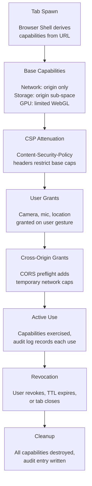

# AIOS Origin-to-Capability Mapping

Part of: [browser.md](../browser.md) — Browser Kit Architecture
**Related:** [sdk.md](./sdk.md) — Browser Kit SDK, [security.md](./security.md) — Security Architecture

-----

## 6. Origin-to-Capability Mapping

Every URL navigation in AIOS is a capability derivation event. When a user navigates to a web page, the Browser Shell does not simply "load a page" — it spawns a Tab Agent with a precisely scoped capability set derived from the target URL. The origin (scheme + host + port) becomes the root identity from which all permissions are computed. This section describes how URLs become capabilities, how those capabilities are enforced at the kernel level, and how users retain control over what web content can do.

### 6.1 Capability Derivation from URL

When the user navigates to `https://weather.com`, the Browser Shell Agent parses the URL into its origin components and derives a `CapabilitySet` that the new Tab Agent will hold. This capability set defines the complete boundary of what the tab can access — network, storage, GPU, sensors, and inter-agent communication.

```rust
/// Browser Shell derives capabilities from URL origin before spawning Tab Agent.
///
/// The derivation follows a principle of least privilege: the Tab Agent
/// receives only the capabilities necessary to render content from its
/// origin. Additional capabilities (camera, mic, geolocation) require
/// explicit user grants at runtime.
fn derive_capabilities(origin: &Origin) -> CapabilitySet {
    CapabilitySet {
        // Network: can ONLY reach the origin and declared CDN subdomains.
        // Cross-origin requests require separate grants (see §7).
        network: vec![
            NetworkCap::service(origin.host(), HTTPS, GET | POST),
            // Common CDN pattern: cdn.{origin} gets automatic read access
            NetworkCap::service(
                &format!("cdn.{}", origin.host()),
                HTTPS,
                GET,
            ),
        ],

        // Storage: isolated sub-space within web-storage, scoped to origin.
        // The Tab Agent cannot see or access storage from any other origin.
        storage: SpaceCap::subspace("web-storage", origin.host()),

        // GPU: limited WebGL/WebGPU access through compositor mediation.
        // Memory cap prevents runaway shaders from exhausting GPU memory.
        gpu: GpuCap::webgl(Megabytes(256)),

        // Sensitive capabilities: None until user explicitly grants.
        // The Tab Agent cannot even attempt to access these subsystems
        // without a capability token — the kernel rejects the syscall.
        camera: None,
        microphone: None,
        geolocation: None,

        // Clipboard: write-only by default (paste requires user gesture).
        // This prevents silent clipboard exfiltration.
        clipboard: ClipboardCap::write_only(),

        // Agent isolation: cannot spawn child agents, cannot access
        // other tabs' memory, cannot access Flow channels directly.
        // All inter-agent communication goes through Browser Shell.
        agent: AgentCap::isolated(),
    }
}

// Browser Shell spawns the Tab Agent with derived capabilities
let tab = agent::spawn("web-tab", derive_capabilities(&origin))?;
```

The derivation is deterministic: the same origin always produces the same base capability set. User-granted permissions (camera, microphone) are stored in the web-storage space under `{origin}/permissions/` and restored on subsequent visits, subject to expiry (web content capabilities have a maximum TTL of 24 hours per the capability system's trust level rules).

**Trust level assignment.** All Tab Agents are created at Trust Level 4 (Web Content) — the most restricted trust level in the AIOS capability hierarchy. This means:

- Maximum capability TTL: 24 hours (re-requested per session)
- No delegatable capabilities (Tab Agents cannot pass capabilities to other agents)
- Mandatory audit logging for all capability exercises
- Kernel rate-limits capability requests from Level 4 agents

### 6.2 Same-Origin Policy as Kernel Enforcement

In traditional browsers, the same-origin policy is enforced by browser logic — JavaScript checks in the renderer process that verify whether a script's origin matches the target resource's origin. This enforcement layer has been bypassed by countless vulnerabilities: Spectre reads cross-origin data through speculative execution, Meltdown breaks kernel-user boundaries, and renderer exploits grant arbitrary memory access within the browser process.

AIOS eliminates this entire class of vulnerabilities by enforcing origin isolation at the kernel level. Each Tab Agent is a separate AIOS agent with its own address space, its own capability table, and its own TTBR0 page table base register. The Tab Agent for `weather.com` physically cannot read memory belonging to the Tab Agent for `bank.com` — not because JavaScript prevents it, but because the MMU hardware maps different physical pages for each agent.

```text
Traditional browser (Chrome):
  ┌─────────────────────────────────────────────┐
  │           Browser Process                    │
  │  ┌──────────┐  ┌──────────┐  ┌──────────┐  │
  │  │Renderer A│  │Renderer B│  │Renderer C│  │
  │  │site-a.com│  │site-b.com│  │site-c.com│  │
  │  └──────────┘  └──────────┘  └──────────┘  │
  │  Same-origin enforced by browser JS logic    │
  │  Renderer exploit → access other renderers   │
  └─────────────────────────────────────────────┘

AIOS (kernel-enforced):
  ┌──────────┐  ┌──────────┐  ┌──────────┐
  │Tab Agent │  │Tab Agent │  │Tab Agent │
  │site-a.com│  │site-b.com│  │site-c.com│
  │TTBR0: 0x1│  │TTBR0: 0x2│  │TTBR0: 0x3│
  │Caps: {A} │  │Caps: {B} │  │Caps: {C} │
  └──────────┘  └──────────┘  └──────────┘
       │              │              │
  ─────┴──────────────┴──────────────┴─────
       AIOS Kernel (hardware-enforced isolation)
       MMU prevents cross-agent memory access
       Capability gate prevents cross-origin I/O
```

**Site isolation maps to agent-per-origin.** Chrome's site isolation places each origin in a separate OS process — an expensive approach that duplicates process overhead (kernel structures, address space metadata, file descriptor tables) for each tab. AIOS Tab Agents are lightweight agents: they share the kernel's infrastructure but have isolated address spaces and capability tables. The isolation is equivalent to Chrome's process isolation but without the memory overhead, because the AIOS agent model was designed for this granularity from the start.

A renderer exploit in a Tab Agent gains nothing useful. The compromised agent can execute arbitrary code within its own address space, but:

- It cannot read other agents' memory (MMU enforcement)
- It cannot make network requests outside its origin (capability gate)
- It cannot access storage from other origins (capability gate)
- It cannot escalate its trust level (kernel-enforced trust levels)
- It cannot suppress its own audit log entries (kernel-owned audit ring)

The attack surface collapses from "the entire browser" to "a single origin's data."

### 6.3 Capability Lifecycle

Capabilities for a Tab Agent follow a well-defined lifecycle that mirrors the tab's existence:



**Phase 1: Creation at tab spawn.** When Browser Shell spawns a Tab Agent, it creates the base capability set from the URL origin (see 6.1). These capabilities are placed in the agent's kernel-managed CapabilityTable.

**Phase 2: Attenuation by CSP.** When the page loads and its `Content-Security-Policy` headers arrive, Browser Shell attenuates the Tab Agent's capabilities to match. A CSP directive like `connect-src 'self' api.example.com` restricts the network capabilities to only those two origins. Attenuation is one-way — CSP can only remove permissions, never add them. This follows the capability attenuation principle: a derived capability is never more permissive than its parent.

**Phase 3: Extension by user grants.** When JavaScript calls `navigator.mediaDevices.getUserMedia()`, the Tab Agent lacks a camera capability. The request propagates to Browser Shell, which presents a permission prompt to the user. If granted, a new CameraCapability token is created with:

- Trust Level 4 restrictions (24-hour TTL)
- Origin-scoped (only this origin can use it)
- Non-delegatable (cannot be passed to other agents)
- Audit-logged (every frame capture recorded)

**Phase 4: Active use.** Each time a capability is exercised (network request, storage write, GPU draw call), the kernel increments the token's `usage_count` and updates `last_used`. This usage data is available to the user through the audit space.

**Phase 6: Revocation on tab close.** When the user closes a tab, Browser Shell destroys the Tab Agent. The kernel walks the agent's CapabilityTable and revokes every token, including any child tokens created through attenuation. Cascade revocation ensures no orphaned capabilities survive the tab's lifecycle. Session-scoped capabilities (e.g., `sessionStorage` access) are destroyed; persistent grants (e.g., "always allow camera for meet.google.com") are preserved in the permissions sub-space for future sessions.

### 6.4 User Overrides

AIOS makes per-origin capabilities visible and controllable by the user. Because capability exercises are audit-logged, the OS can present a clear picture of what each origin has done:

```text
weather.com — Session Activity
────────────────────────────────────────────
Network requests:
  weather.com              142 requests  (self)
  cdn.weather.com           38 requests  (CDN)
  api.maps.google.com       47 requests  (cross-origin, CORS)
  ads.doubleclick.net       23 requests  (third-party, blockable)
  analytics.google.com      12 requests  (third-party, blockable)

Storage:
  localStorage               2.1 MB
  IndexedDB (forecast-cache)  8.4 MB
  Cookies                     3 entries

Permissions:
  Geolocation               Granted (expires in 22h)
  Camera                    Never requested
  Microphone                Never requested
```

The user can take direct action on any line:

- **Revoke cross-origin permissions.** "api.maps.google.com accessed 47 times" — the user can revoke this cross-origin grant. The next `fetch()` to that domain will fail with a NetworkError. The page may break, but the user is in control.
- **Block third-party domains.** The user can permanently block `ads.doubleclick.net` for this origin or globally. The block is enforced at the capability level — no network capability is ever granted for that domain.
- **Clear per-origin storage.** Deleting an origin's sub-space is atomic and complete. No hidden state survives.
- **Revoke sensor permissions.** Geolocation, camera, and microphone grants can be revoked at any time. The kernel immediately invalidates the capability token; the next API call from JavaScript returns PermissionDenied.

These overrides are stored in the user's preferences space and persist across sessions. They are not browser settings — they are OS-level capability policies that apply regardless of which browser engine bridge is active.

### 6.5 Third-Party Script Isolation

Web pages routinely load scripts from third-party origins: ad networks, analytics providers, social media widgets. In traditional browsers, these scripts run in the page's origin context with full access to the DOM, cookies, and network. A compromised ad script can exfiltrate user data, inject content, or redirect navigation.

AIOS Browser Kit treats third-party scripts as sub-capabilities of the page's Tab Agent. When the page loads a script from `ads.doubleclick.net`, Browser Shell creates a sub-capability:

```rust
// Third-party script capability — derived from page's capability set
// but further attenuated with restrictions
let ad_script_cap = NetworkCap::service("ads.doubleclick.net", HTTPS, GET)
    .with_flag(UserCanBlock)       // user can revoke without breaking page
    .with_flag(AuditHighlight)     // highlighted in audit view
    .with_flag(ThirdParty)         // marked as non-essential
    .with_ttl(Duration::hours(1))  // shorter TTL than page itself
    .attenuate(ReadOnly);          // cannot POST data back
```

The `UserCanBlock` flag is the key mechanism. It tells Browser Shell that this capability can be revoked without affecting the page's core functionality. When the user blocks a third-party domain:

1. The capability token is revoked immediately
2. Future `fetch()` calls from scripts hosted on that domain return NetworkError
3. The page's own scripts continue to function normally
4. The block is recorded in the user's preferences and applied on future visits

**Granularity.** Third-party isolation operates at the network capability level, not at the JavaScript execution level. Scripts from `ads.doubleclick.net` still execute in the page's JS context (they share the DOM), but their network capabilities are individually controllable. This matches the web's execution model (scripts share a global) while giving users control over what data leaves the machine.

**Tracker classification.** Browser Kit maintains a classification database (similar to EasyList/EasyPrivacy but integrated into the capability system) that automatically applies `UserCanBlock` and `ThirdParty` flags to known tracking domains. Users can override classifications — marking a domain as essential if blocking it breaks functionality they need.

-----

## 7. CORS as Capabilities

Traditional CORS (Cross-Origin Resource Sharing) is a protocol negotiation between the browser and a remote server: the browser sends a preflight OPTIONS request, the server responds with `Access-Control-Allow-Origin` headers, and the browser decides whether to permit the cross-origin request. The entire mechanism is enforced by browser logic and can be bypassed by anything that makes HTTP requests outside the browser (curl, a compromised renderer, a browser extension).

In AIOS, CORS maps to capability grants. A Tab Agent's base capabilities include only its own origin. Reaching a cross-origin server requires acquiring a new capability — either statically from page metadata or dynamically through the CORS preflight flow. Both paths produce auditable, revocable capability tokens.

### 7.1 Static Capability from Page Metadata

When a page loads, its HTTP response headers and HTML content declare which third-party origins the page expects to contact. Browser Shell parses these declarations and pre-creates sub-capabilities on the Tab Agent before any cross-origin requests are attempted.

**Sources of static declarations:**

- `Content-Security-Policy: connect-src` — declares allowed network targets
- `Content-Security-Policy: img-src`, `font-src`, `style-src` — media and resource origins
- `<link rel="preconnect" href="...">` — pre-declared connections
- `<link rel="dns-prefetch" href="...">` — pre-declared DNS targets
- `<script src="...">` — third-party script origins

```rust
/// Parse page metadata to derive static cross-origin capabilities.
///
/// These capabilities are created when the page loads, before any
/// JavaScript executes. They represent the page's declared intent
/// to contact specific third-party origins.
fn derive_static_cross_origin_caps(
    csp: &ContentSecurityPolicy,
    html_links: &[LinkElement],
    page_origin: &Origin,
) -> Vec<NetworkCap> {
    let mut caps = Vec::new();

    // CSP connect-src declares allowed fetch/XHR/WebSocket targets
    for allowed_origin in csp.connect_src() {
        if allowed_origin != page_origin {
            caps.push(
                NetworkCap::service(allowed_origin.host(), HTTPS, GET)
                    .derived_from(&format!("{}/CSP/connect-src", page_origin))
                    .attenuate(ReadOnly)
                    .with_flag(ThirdParty),
            );
        }
    }

    // Preconnect links indicate expected cross-origin connections
    for link in html_links.iter().filter(|l| l.rel == "preconnect") {
        let target = Origin::parse(&link.href);
        if !caps.iter().any(|c| c.covers(&target)) {
            caps.push(
                NetworkCap::service(target.host(), HTTPS, GET)
                    .derived_from(&format!("{}/preconnect", page_origin))
                    .attenuate(ReadOnly)
                    .with_flag(UserCanBlock),
            );
        }
    }

    // Script src origins get network caps with UserCanBlock
    for link in html_links.iter().filter(|l| l.tag == "script") {
        let target = Origin::parse(&link.src);
        if target != *page_origin && !caps.iter().any(|c| c.covers(&target)) {
            caps.push(
                NetworkCap::service(target.host(), HTTPS, GET)
                    .derived_from(&format!("{}/script-src", page_origin))
                    .with_flag(UserCanBlock)
                    .with_flag(ThirdParty),
            );
        }
    }

    caps
}
```

Static capabilities are created proactively — the Tab Agent has them before JavaScript runs. This eliminates the latency of runtime capability negotiation for declared dependencies.

**CSP as attenuation.** A page that declares `Content-Security-Policy: default-src 'self'` with no `connect-src` override effectively attenuates its own Tab Agent to self-only networking. Browser Shell respects this by not creating any cross-origin network capabilities. CSP becomes a voluntary capability restriction that the page author applies to their own agent — enforced by the kernel, not by browser JS logic.

### 7.2 Dynamic Capability Grant

When JavaScript in a Tab Agent calls `fetch()` targeting a cross-origin URL that was not pre-declared in page metadata, the request cannot proceed — the Tab Agent lacks a network capability for that origin. The request follows the CORS preflight flow, but mediated through the capability system:

```text
Dynamic CORS capability grant flow:

1. Tab Agent (weather.com) calls fetch("https://api.maps.google.com/tiles")
   → Tab Agent checks own CapabilityTable: no cap for api.maps.google.com
   → Tab Agent sends capability request to Browser Shell via IPC

2. Browser Shell receives cross-origin capability request
   → Browser Shell makes preflight OPTIONS request to api.maps.google.com
     (Browser Shell has its own NetworkCap for arbitrary origins)
   → OPTIONS request includes: Origin: https://weather.com

3. api.maps.google.com responds:
   → Access-Control-Allow-Origin: https://weather.com
   → Access-Control-Allow-Methods: GET
   → Access-Control-Max-Age: 3600

4. Browser Shell validates CORS response
   → Origin is allowed: YES
   → Method is allowed: GET: YES
   → Creates temporary NetworkCap for Tab Agent:

     NetworkCap::service("api.maps.google.com", HTTPS, GET)
         .derived_from("weather.com/CORS/preflight")
         .with_ttl(Duration::seconds(3600))  // from Max-Age
         .attenuate(ReadOnly)                 // GET only
         .with_flag(CrossOrigin)
         .with_flag(UserCanBlock)

5. Browser Shell grants capability to Tab Agent via kernel API
   → Kernel places token in Tab Agent's CapabilityTable
   → Audit log: "weather.com granted CORS access to api.maps.google.com"

6. Tab Agent retries the original fetch() — now succeeds
   → Capability gate passes: Tab Agent holds valid NetworkCap
   → OS HTTP Service sends GET to api.maps.google.com
   → Response flows back to Tab Agent's JavaScript
```

The capability grant is:

- **Logged.** The audit ring records when the grant was created, which origin requested it, which CORS headers authorized it, and how many times it was exercised.
- **Time-limited.** The capability's TTL is derived from the CORS `Access-Control-Max-Age` header, capped at the Trust Level 4 maximum of 24 hours.
- **Revocable.** The user can revoke the cross-origin grant at any time through the origin activity view (see 6.4). Revocation invalidates the capability token immediately; the next fetch to that domain fails.
- **Scoped.** The capability only permits the methods declared in `Access-Control-Allow-Methods`. A CORS grant for GET does not permit POST.

**Browser Shell as capability broker.** The Browser Shell Agent operates at a higher trust level than Tab Agents. It holds a broad NetworkCap that allows arbitrary DNS resolution and HTTP requests — necessary for performing CORS preflight checks on behalf of Tab Agents. This is analogous to how traditional browsers have a network stack that can reach any server, while individual renderer processes are sandboxed. The difference is that AIOS makes this trust boundary explicit and kernel-enforced.

### 7.3 Capability Attenuation

Cross-origin capabilities are always attenuated relative to the parent capability. This is the fundamental invariant of the AIOS capability system applied to web security: a derived capability is never more permissive than the capability from which it was derived.

**Attenuation rules for cross-origin capabilities:**

```text
Attenuation hierarchy for web capabilities:

Browser Shell NetworkCap (broad: any origin, any method)
  └── Tab Agent base NetworkCap (origin-only: GET | POST)
        └── CSP-attenuated NetworkCap (origin-only: GET only, if CSP restricts)
              └── Cross-origin NetworkCap (third-party: GET only, time-limited)
                    └── Sub-resource NetworkCap (CDN: GET only, read-only, UserCanBlock)
```

Each level can only restrict, never expand. Concrete attenuation operations:

- **Method restriction.** A base capability permitting GET|POST can produce a cross-origin capability permitting only GET. The reverse is impossible.
- **Time restriction.** Cross-origin capabilities always have shorter TTLs than same-origin capabilities. CORS `Max-Age` is capped at the Trust Level 4 maximum (24 hours). Session-scoped capabilities expire when the tab closes.
- **Read-only restriction.** Cross-origin capabilities default to read-only unless the CORS response explicitly permits mutation methods (PUT, POST, DELETE) and the page's CSP allows it.
- **Header restriction.** `Access-Control-Allow-Headers` limits which request headers the Tab Agent can send. The capability token encodes allowed headers; the kernel rejects requests with disallowed headers before they reach the network stack.

```rust
/// Attenuate a cross-origin capability based on CORS response headers.
///
/// The resulting capability is always less permissive than the parent.
/// The kernel enforces this invariant — capability_attenuate() returns
/// Err(CannotEscalate) if the new capability would exceed the parent.
fn attenuate_from_cors(
    parent: &NetworkCap,
    cors: &CorsResponse,
    requesting_origin: &Origin,
) -> Result<NetworkCap, CapabilityError> {
    let allowed_methods = cors.allow_methods()
        .iter()
        .filter(|m| parent.methods().contains(m))  // cannot exceed parent
        .collect();

    let ttl = Duration::seconds(
        cors.max_age().min(MAX_WEB_CONTENT_TTL_SECS)  // cap at 24h
    );

    parent.attenuate(NetworkCapRestriction {
        methods: allowed_methods,
        ttl,
        headers: cors.allow_headers(),
        read_only: !allowed_methods.contains(&Method::POST),
        flags: CapFlags::CROSS_ORIGIN | CapFlags::USER_CAN_BLOCK,
        audit: AuditLevel::Highlighted,  // cross-origin always highlighted
        provenance: Provenance {
            source: format!("CORS preflight from {}", requesting_origin),
            cors_origin: Some(cors.allow_origin().clone()),
            granted_at: Timestamp::now(),
        },
    })
}
```

**Why attenuation matters for web security.** In traditional browsers, a CORS misconfiguration on the server (e.g., `Access-Control-Allow-Origin: *` with `Access-Control-Allow-Credentials: true`) can expose sensitive data across origins. In AIOS, even if a server returns permissive CORS headers, the resulting capability is still attenuated by the parent chain. A Tab Agent at Trust Level 4 with a 24-hour TTL cap cannot receive a cross-origin capability that bypasses these restrictions — the kernel's `capability_attenuate()` function enforces the invariant structurally.

The capability chain is fully inspectable. The user, the audit system, and AIRS can all trace a cross-origin capability back to its root: which origin requested it, which CORS headers authorized it, when it was granted, how many times it was exercised, and when it expires. This provenance trail is impossible in traditional browsers, where CORS decisions are ephemeral checks that leave no persistent record.
