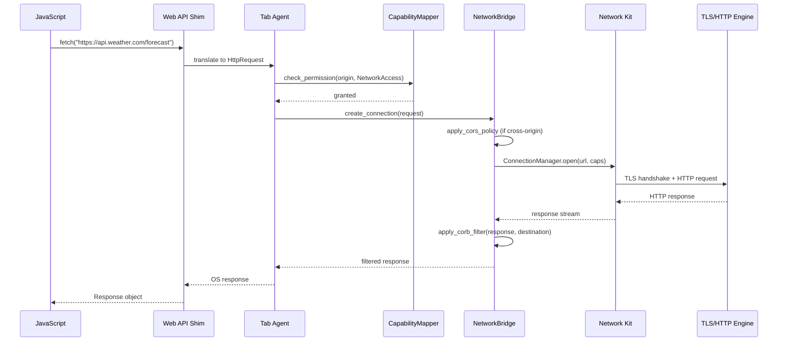

# AIOS Browser Kit SDK

Part of: [browser.md](../browser.md) — Browser Kit Architecture
**Related:** [origin-mapping.md](./origin-mapping.md) — Origin-to-Capability Mapping, [engine-integration.md](./engine-integration.md) — Engine Integration

-----

## 4. Browser Kit SDK Traits

Browser Kit defines seven Rust traits that browser engines implement to integrate with AIOS. These traits mediate all interaction between web content and OS services. The trait surface is deliberately bounded — twelve capability-mediated IPC channels total, validated against Fuchsia Web Runner's approximately twenty FIDL protocols as a complexity reference point. Keeping the count low avoids the ChromeOS Lacros anti-pattern, where roughly one hundred IPC interfaces between Chrome and the OS grew unmanageable and led to project cancellation.

Every trait is engine-agnostic. Servo, Gecko, Blink, WebKit, or a minimal reference browser can implement the same interface. The engine handles web-specific logic (parsing, layout, JS execution); the traits handle everything the OS provides.

-----

### 4.1 BrowserSurface — Compositor Surface Contract

**Purpose:** Manages the compositor surface that browser content renders into. Each Tab Agent owns one or more surfaces (the page surface, popup surfaces, fullscreen video surfaces). BrowserSurface translates browser rendering commands into compositor protocol messages.

**Kit dependency:** Compute Kit (Tier 1) — display surfaces and canvas presentation; compositor service — surface lifecycle, shared buffers, fences, damage reporting ([compositor protocol](../../platform/compositor/protocol.md) sections 3.1-3.4), semantic hints ([compositor protocol](../../platform/compositor/protocol.md) section 4).

```rust
/// Compositor surface contract for browser content.
///
/// One BrowserSurface per visible rendering target. The page itself is one
/// surface; a `<video>` element in fullscreen mode may use a second surface
/// with direct scanout. Popup windows (e.g., `window.open()`) spawn separate
/// Tab Agents with their own surfaces.
pub trait BrowserSurface {
    /// Create a compositor surface for this tab.
    ///
    /// Returns a SurfaceHandle that the engine uses for all subsequent
    /// frame submissions. The compositor assigns dimensions via a Configure
    /// event before the first frame can be submitted.
    fn create_surface(&mut self, initial_hint: ContentHint) -> Result<SurfaceHandle, SurfaceError>;

    /// Submit a rendered frame to the compositor.
    ///
    /// The engine writes pixels into the shared buffer, then calls submit_frame
    /// with a fence that the compositor waits on before compositing. The
    /// compositor owns scheduling — the engine never knows when the frame
    /// actually reaches the display.
    fn submit_frame(&mut self, handle: SurfaceHandle, buffer: SharedBufferRef, fence: FenceId) -> Result<(), SurfaceError>;

    /// Handle a resize event from the compositor.
    ///
    /// Called when the user resizes the window, enters split-view, or the
    /// compositor reassigns display space. The engine must re-layout and
    /// submit a new frame at the new dimensions.
    fn resize(&mut self, handle: SurfaceHandle, width: u32, height: u32) -> Result<(), SurfaceError>;

    /// Declare the damaged region for incremental composition.
    ///
    /// Engines that track dirty rectangles (Servo's display list, Blink's
    /// paint invalidation) report damage so the compositor can skip
    /// recompositing unchanged regions. Omitting damage implies full-surface
    /// damage.
    fn set_damage_region(&mut self, handle: SurfaceHandle, region: DamageRect) -> Result<(), SurfaceError>;

    /// Set semantic hints for compositor behavior.
    ///
    /// Content type (video, text, interactive game) affects compositor
    /// decisions: frame scheduling priority, power management, display
    /// scaling algorithm. Hints change as the user scrolls from a text
    /// article to an embedded video.
    fn set_semantic_hint(&mut self, handle: SurfaceHandle, hint: ContentHint) -> Result<(), SurfaceError>;
}
```

**Example usage:**

```rust
// Tab Agent creates a surface when the page first renders
let surface = browser_surface.create_surface(ContentHint::RichText)?;

// On each animation frame, the engine submits rendered content
let buffer = shared_buffer_pool.acquire(width, height)?;
engine.render_into(&buffer);
let fence = fence_pool.create_release_fence();
browser_surface.submit_frame(surface, buffer.as_ref(), fence)?;

// When the page starts playing a video, update the hint
browser_surface.set_semantic_hint(surface, ContentHint::Video)?;
```

-----

### 4.2 WebContentProcess — Isolated Renderer Sandbox

**Purpose:** Manages the sandboxed process that executes web content (HTML parsing, CSS layout, JavaScript, WebAssembly). Each Tab Agent runs inside a WebContentProcess with a capability set derived from its origin. The OS provides the isolation; the browser engine provides the content execution.

**Kit dependency:** Kernel agent isolation — process spawning, capability sets, resource accounting.

```rust
/// Isolated renderer process with capability-gated IPC.
///
/// The WebContentProcess is the OS-level container for a Tab Agent.
/// The engine runs inside it; the OS enforces its boundaries. A renderer
/// exploit that achieves arbitrary code execution within this process
/// still cannot exceed its capability set.
pub trait WebContentProcess {
    /// Spawn a new renderer process for a tab.
    ///
    /// The process starts with no capabilities. The caller must set
    /// capabilities via set_capability_set() before the process can
    /// access any OS service. This two-phase initialization prevents
    /// race conditions where a renderer could act before its origin-derived
    /// restrictions are in place.
    fn spawn_renderer(&mut self, engine_config: EngineConfig) -> Result<ProcessHandle, ProcessError>;

    /// Set the capability set for this renderer process.
    ///
    /// Called once after spawn_renderer(), before the process begins
    /// executing web content. The capability set is derived from the
    /// navigation origin by CapabilityMapper. Once set, capabilities
    /// can only be further restricted (attenuated), never expanded,
    /// unless the user explicitly grants a new permission.
    fn set_capability_set(&mut self, handle: ProcessHandle, caps: CapabilitySet) -> Result<(), ProcessError>;

    /// Terminate the renderer process.
    ///
    /// Stops execution, reclaims all memory, closes all IPC channels.
    /// Called on tab close, navigation to a new origin (cross-origin
    /// navigation replaces the process), or crash recovery.
    fn terminate(&mut self, handle: ProcessHandle) -> Result<(), ProcessError>;

    /// Query resource usage for this renderer.
    ///
    /// Returns memory, CPU time, network bytes, and storage usage.
    /// Used by the Browser Shell for per-tab resource display and by
    /// the OS for resource pressure decisions.
    fn get_resource_usage(&self, handle: ProcessHandle) -> Result<ResourceUsage, ProcessError>;
}
```

-----

### 4.3 NetworkBridge — Browser-to-Network Kit Translation

**Purpose:** Translates browser network requests (HTTP fetches, WebSocket upgrades, Server-Sent Events) into Network Kit operations. The bridge enforces origin-scoped capabilities and applies web security policies (CORS, CORB) at the OS level rather than inside the browser engine.

**Kit dependency:** Network Kit Bridge Module — ConnectionManager for connection lifecycle, CapabilityGate for origin enforcement ([networking components](../../platform/networking/components.md) sections 3.2, 3.5). Web content uses the Bridge Layer (HTTP/TLS over TCP/IP), not the native ANM mesh. AIOS-native browser extensions (e.g., `aios.space()`) may use the mesh for peer communication.

```rust
/// Translates browser network requests to Network Kit.
///
/// All network I/O from web content passes through this bridge.
/// The browser engine never opens raw sockets or performs DNS resolution;
/// the Network Kit's Bridge Module handles all transport concerns (TCP/IP,
/// TLS, DNS). The bridge's role is to map web-level concepts (origins,
/// CORS, CORB) to OS-level concepts (capabilities, connection pools,
/// audit events).
pub trait NetworkBridge {
    /// Create a network connection scoped to an origin.
    ///
    /// The Network Kit's Bridge Module manages the actual TCP/TLS/QUIC connection.
    /// The bridge validates that the target URL falls within the Tab
    /// Agent's network capabilities before forwarding the request.
    fn create_connection(&mut self, request: HttpRequest) -> Result<ConnectionHandle, NetworkError>;

    /// Set origin-derived network capabilities for this bridge instance.
    ///
    /// Called once during Tab Agent initialization. The capability set
    /// determines which domains this tab can reach. Cross-origin requests
    /// outside this set require explicit CORS capability grants from the
    /// Browser Shell.
    fn set_origin_capabilities(&mut self, caps: Vec<NetworkCapability>) -> Result<(), NetworkError>;

    /// Apply CORS policy to a cross-origin request.
    ///
    /// Evaluates the CORS preflight response against the origin's
    /// capability set. If the server allows the cross-origin request
    /// and the capability set permits it, the bridge grants a temporary
    /// NetworkCapability for the target origin. Both conditions must
    /// hold — a permissive server cannot override a restrictive
    /// capability set.
    fn apply_cors_policy(&mut self, request: &HttpRequest, preflight: &CorsResponse) -> Result<CorsDecision, NetworkError>;

    /// Apply Cross-Origin Read Blocking to a response.
    ///
    /// CORB prevents a compromised renderer from reading cross-origin
    /// responses that should never be accessible (e.g., HTML or JSON
    /// loaded via an  tag). The bridge inspects Content-Type and
    /// X-Content-Type-Options headers and blocks responses that would
    /// constitute cross-origin data leaks. This is enforced at the OS
    /// level — even a fully compromised renderer process cannot read
    /// the blocked response bytes because they never enter the
    /// renderer's address space.
    fn apply_corb_filter(&mut self, response: &HttpResponse, destination: RequestDestination) -> Result<CorbDecision, NetworkError>;
}
```

-----

### 4.4 MediaBridge — Media Kit Routing

**Purpose:** Routes media playback (video, audio) through the Media Kit rather than handling it inside the browser. Hardware-accelerated decode, audio mixing, and DRM enforcement are OS services. The browser engine provides the `<video>`/`<audio>` element logic and UI; the OS provides the pipeline.

**Kit dependency:** Media Kit — MediaCodec trait for decode, media sessions for lifecycle ([media playback](../../platform/media-pipeline/playback.md) sections 5.1-5.6, [media sessions](../../platform/media-pipeline/playback.md) section 6).

```rust
/// Routes media playback through Media Kit.
///
/// The browser engine parses the container format and decides which codec
/// to use. MediaBridge delegates actual decoding to the OS, which can
/// use hardware acceleration (VirtIO-GPU 3D, VideoCore, Apple VT) or
/// software fallback. The engine receives decoded frames and renders
/// them into its compositor surface.
pub trait MediaBridge {
    /// Create a media session for a <video> or <audio> element.
    ///
    /// The session integrates with OS media controls (play/pause from
    /// lock screen, audio routing, now-playing metadata). The session
    /// persists across page scrolls — the user's media experience is
    /// consistent whether they're looking at the tab or not.
    fn create_media_session(&mut self, metadata: MediaMetadata) -> Result<MediaSessionHandle, MediaError>;

    /// Decode a single frame (video) or chunk (audio).
    ///
    /// The engine sends encoded data; the OS returns decoded frames.
    /// For video, decoded frames arrive as shared buffers suitable for
    /// direct composition or GPU texture upload. For audio, decoded
    /// PCM samples route through the audio mixer.
    fn decode_frame(&mut self, session: MediaSessionHandle, encoded: &[u8]) -> Result<DecodedFrame, MediaError>;

    /// Query available codec capabilities.
    ///
    /// Used by the engine to answer MediaCapabilities API queries
    /// and to select the best codec/resolution for adaptive streaming.
    /// The OS knows what hardware decoders are available and their
    /// constraints (max resolution, supported profiles, power cost).
    fn get_codec_capabilities(&self) -> Result<CodecCapabilities, MediaError>;
}
```

-----

### 4.5 InputBridge — DOM Event Translation

**Purpose:** Translates OS input events (keyboard, mouse, touch, gamepad) into DOM-compatible events that the browser engine dispatches to JavaScript. The Input Kit handles device abstraction, gesture recognition, and focus management; the bridge maps those into the DOM event model.

**Kit dependency:** Input Kit — event model, focus routing, gesture recognition ([input events](../../platform/input/events.md) sections 4.1-4.6).

```rust
/// Translates Input Kit events to DOM events.
///
/// The OS delivers typed, high-level input events (key press with
/// Unicode mapping, mouse move with subpixel coordinates, touch
/// with pressure and contact area). The bridge converts these into
/// DOM Event objects that the engine dispatches through its event
/// propagation (capture, target, bubble phases).
pub trait InputBridge {
    /// Subscribe to input events for this tab's surface.
    ///
    /// The compositor routes input events to the focused surface.
    /// This method establishes the subscription so that events arrive
    /// via the Tab Agent's IPC channel. The bridge filters events
    /// based on the surface's input capabilities (e.g., a background
    /// tab receives no input events).
    fn subscribe_input_events(&mut self, surface: SurfaceHandle) -> Result<InputSubscription, InputError>;

    /// Translate an OS input event to a DOM event.
    ///
    /// Maps OsInputEvent (which uses AIOS event types) to DomEvent
    /// (which uses Web platform event types: KeyboardEvent, MouseEvent,
    /// PointerEvent, TouchEvent, WheelEvent, GamepadEvent). Handles
    /// keyboard layout mapping, pointer coordinate transformation
    /// (OS coordinates to CSS coordinates), and touch event coalescing.
    fn translate_to_dom_event(&self, event: OsInputEvent) -> Result<DomEvent, InputError>;

    /// Set the focused surface for input routing.
    ///
    /// When the user clicks a tab or the compositor changes focus,
    /// the bridge updates which surface receives keyboard and IME
    /// events. Focus changes trigger DOM focusin/focusout events.
    fn set_focus_surface(&mut self, surface: SurfaceHandle) -> Result<(), InputError>;
}
```

-----

### 4.6 StorageBridge — Web Storage to Space Mapping

**Purpose:** Maps web storage APIs (localStorage, sessionStorage, IndexedDB, Cache API, cookies) to Space sub-spaces scoped by origin. The browser engine provides the JavaScript API surface; the OS provides the actual storage with unified quotas, backup, sync, and search.

**Kit dependency:** Storage Kit — Spaces subsystem for per-origin storage ([spaces](../../storage/spaces.md) sections 3.0-3.4).

```rust
/// Maps web storage APIs to Space sub-spaces.
///
/// Each origin gets an isolated sub-space within the web-storage system
/// space. The StorageBridge translates between web storage semantics
/// (key-value for localStorage, structured objects for IndexedDB,
/// request/response pairs for Cache API) and Space object operations.
pub trait StorageBridge {
    /// Get the Space handle for an origin's storage.
    ///
    /// Returns a handle scoped to the origin's sub-space within
    /// web-storage. The handle is capability-checked — a Tab Agent
    /// for weather.com cannot obtain the handle for bank.com's storage.
    fn get_origin_space(&self, origin: &Origin) -> Result<SpaceHandle, StorageError>;

    /// Write a storage entry.
    ///
    /// Used by localStorage.setItem(), IndexedDB.put(), Cache.put().
    /// The storage_type parameter determines which sub-directory within
    /// the origin space the entry goes into (local/, indexed-db/, cache-api/).
    fn write_storage(&mut self, space: SpaceHandle, storage_type: WebStorageType, key: &str, value: &[u8]) -> Result<(), StorageError>;

    /// Read a storage entry.
    ///
    /// Used by localStorage.getItem(), IndexedDB.get(), Cache.match().
    /// Returns None if the key does not exist, distinguishing from an
    /// empty value.
    fn read_storage(&self, space: SpaceHandle, storage_type: WebStorageType, key: &str) -> Result<Option<Vec<u8>>, StorageError>;

    /// Clear all storage for an origin.
    ///
    /// Deletes the entire origin sub-space. Used by the "Clear site data"
    /// UI action and the Clear-Site-Data HTTP header. Atomic — partial
    /// clears are not possible.
    fn clear_origin_data(&mut self, space: SpaceHandle) -> Result<(), StorageError>;

    /// Query storage quota usage for an origin.
    ///
    /// Returns bytes used and bytes available. The quota is unified
    /// across all web storage types — the origin has a single allocation
    /// from the web-storage space, not separate limits per API.
    fn get_quota_usage(&self, space: SpaceHandle) -> Result<QuotaUsage, StorageError>;
}
```

-----

### 4.7 CapabilityMapper — Origin-to-Capability Derivation

**Purpose:** Derives OS capability sets from web origins and content security policies. This is the bridge between the web security model (origins, CSP, permissions) and the AIOS security model (capabilities, attenuation, delegation). Every other trait in Browser Kit depends on CapabilityMapper to determine what the Tab Agent is allowed to do.

**Kit dependency:** Capability Kit — token lifecycle, attenuation, delegation ([capability system](../../security/model/capabilities.md) sections 3.1-3.6).

```rust
/// Derives capability sets from web origins.
///
/// When a user navigates to a URL, CapabilityMapper produces the
/// CapabilitySet that governs the Tab Agent for the duration of
/// that navigation. This set is the single source of truth for what
/// the tab can access — it replaces the browser's internal permission
/// database with OS-level capability tokens.
pub trait CapabilityMapper {
    /// Derive a capability set from a navigation origin.
    ///
    /// Combines the origin's domain, scheme, and port with user
    /// preferences (blocked trackers, site-specific permissions),
    /// enterprise policy, and trust level to produce a CapabilitySet.
    /// The result is passed to WebContentProcess::set_capability_set().
    fn derive_from_origin(&self, origin: &Origin) -> Result<CapabilitySet, CapabilityError>;

    /// Apply Content Security Policy restrictions.
    ///
    /// CSP headers (connect-src, script-src, img-src, etc.) attenuate
    /// the capability set. A CSP directive can only REMOVE capabilities,
    /// never add them. If the origin's base capabilities allow fetching
    /// from cdn.example.com but CSP's connect-src omits it, the
    /// capability is revoked for this page load.
    fn apply_csp_restrictions(&mut self, caps: &mut CapabilitySet, csp: &ContentSecurityPolicy) -> Result<(), CapabilityError>;

    /// Grant a cross-origin capability.
    ///
    /// Called when CORS validation succeeds and the user's preferences
    /// allow the cross-origin access. Creates a time-limited, attenuated
    /// capability for the target origin. The grant is logged in the
    /// audit trail and visible to the user in the security inspector.
    fn grant_cross_origin(&mut self, requester: &Origin, target: &Origin, access: CrossOriginAccess) -> Result<CapabilityHandle, CapabilityError>;

    /// Revoke a previously granted capability.
    ///
    /// Cascade revocation ensures that any capabilities delegated
    /// from the revoked capability are also revoked. Used when the
    /// user blocks a permission, when a CSP violation is detected,
    /// or when the tab navigates away from the origin.
    fn revoke_capability(&mut self, handle: CapabilityHandle) -> Result<(), CapabilityError>;

    /// Check whether a specific permission is available.
    ///
    /// Used to implement the Permissions API (navigator.permissions.query()).
    /// Returns the permission state (granted, denied, prompt) based on
    /// the current capability set and user preferences.
    fn check_permission(&self, origin: &Origin, permission: WebPermission) -> PermissionState;
}
```

-----

### 4.8 Trait Surface Budget

The seven traits above expose a total of twenty-nine methods across twelve IPC channels. This is deliberately constrained:

```text
Trait              Methods   IPC Channels   Rationale
-----------------  -------   ------------   ---------
BrowserSurface         5           2         surface lifecycle + frame submission
WebContentProcess      4           1         process lifecycle (shell-to-renderer)
NetworkBridge          4           2         request + response streams
MediaBridge            3           2         session control + frame delivery
InputBridge            3           1         event subscription + delivery
StorageBridge          5           2         read/write + quota queries
CapabilityMapper       5           2         derivation + grant/revoke
-----------------  -------   ------------
TOTAL                 29          12
```

Fuchsia Web Runner uses approximately twenty FIDL protocols for its browser integration, so twelve channels is conservative. The budget leaves room for future traits (e.g., AccessibilityBridge, PrintBridge) without approaching the complexity threshold that caused Lacros to collapse.

-----

## 5. Web API Bridge

Web APIs are the contract between JavaScript and the browser engine. In a traditional browser, Web API implementations live entirely within the browser process and talk directly to kernel syscalls or browser-internal services. In AIOS, Web API implementations are thin shims that route through Browser Kit traits to OS services.

The bridge pattern is consistent across all Web APIs: JavaScript calls a standard Web API, the engine's binding layer invokes the corresponding Browser Kit trait method, the trait method sends a capability-checked IPC message to the appropriate OS service, and the response flows back.

-----

### 5.1 fetch() — Network Requests

The `fetch()` API is the most heavily used bridge. Every XHR, every script load, every image fetch, every CSS stylesheet passes through it.



At no point does the browser engine perform DNS resolution, open a socket, or negotiate TLS. The Network Kit's Bridge Module owns transport (TCP/IP, TLS); the browser owns semantics. A renderer exploit that achieves arbitrary code execution inside the Tab Agent still cannot bypass capability checks because the IPC channel to the Network Kit validates capabilities on every request.

-----

### 5.2 localStorage and IndexedDB — Persistent Storage

```javascript
// JavaScript — standard Web API
localStorage.setItem("theme", "dark");
const theme = localStorage.getItem("theme");

// IndexedDB
const db = await indexedDB.open("app-cache", 1);
const tx = db.transaction("entries", "readwrite");
tx.objectStore("entries").put({ id: 1, data: "cached" });
```

Both APIs route through StorageBridge:

```text
localStorage.setItem("theme", "dark")
  → Web API shim: StorageBridge.write_storage(
        origin_space,
        WebStorageType::LocalStorage,
        "theme",
        b"dark"
    )
  → Space write: web-storage/weather.com/local/theme = "dark"
  → WAL + MemTable + eventual block flush

indexedDB.put(...)
  → Web API shim: StorageBridge.write_storage(
        origin_space,
        WebStorageType::IndexedDb { db: "app-cache", store: "entries" },
        "1",
        serialize(entry)
    )
  → Space write: web-storage/weather.com/indexed-db/app-cache/entries/1
```

The key difference from traditional browsers: all web storage is a Space. It gets unified quotas (the user sees "weather.com uses 12MB" not separate per-API limits), backup through Space snapshots, cross-device sync through Space Mesh, and search through AIRS. The `Clear-Site-Data` HTTP header maps to `StorageBridge::clear_origin_data()`, which atomically deletes the origin's entire sub-space.

-----

### 5.3 WebGL and WebGPU — GPU Access

WebGL and WebGPU requests route through BrowserSurface to the Compute Kit:

```text
canvas.getContext("webgl2")
  → BrowserSurface.create_surface(ContentHint::WebGL)
  → Compositor allocates GPU-backed surface
  → GPU context created with ComputeAccess capability (limited)
  → WebGL calls translate to wgpu operations on the surface

navigator.gpu.requestAdapter()
  → BrowserSurface.create_surface(ContentHint::WebGPU)
  → Compositor allocates GPU-backed surface
  → WebGPU adapter uses Compute Kit Tier 2 (GPU compute)
  → Shader compilation goes through OS shader pipeline
  → GPU memory bounded by Tab Agent's ComputeAccess quota
```

GPU access for web content is always limited. The Tab Agent's `ComputeAccess` capability specifies a memory ceiling (default 256MB for WebGL, 512MB for WebGPU) and a maximum shader complexity. The OS can preempt web GPU workloads when system GPU pressure rises — something no traditional browser can do because it owns the GPU driver.

-----

### 5.4 Sensor and Device APIs — Prompted Capabilities

APIs that access sensors (`navigator.geolocation`, `getUserMedia()`, `navigator.bluetooth`) follow a prompted capability flow:

```text
navigator.geolocation.getCurrentPosition(callback)
  → CapabilityMapper.check_permission(origin, Geolocation)
  → state: "prompt" (no capability held)
  → Browser Shell displays permission prompt to user
  → User grants → CapabilityMapper.grant_cross_origin creates
    time-limited GpsCapability (24h TTL, Trust Level 4)
  → Tab Agent invokes GPS subsystem with capability token
  → Position returned to callback

navigator.mediaDevices.getUserMedia({ video: true })
  → CapabilityMapper.check_permission(origin, Camera)
  → state: "prompt"
  → Browser Shell displays camera permission prompt
  → User grants → CameraCapability created (session-scoped)
  → Camera subsystem activates hardware LED (mandatory)
  → Video frames stream to Tab Agent via MediaBridge
  → On tab close: capability revoked, camera released, LED off
```

The OS enforces hardware indicators (camera LED, microphone indicator) that the browser cannot suppress. A compromised renderer cannot silently activate the camera because the capability grant and the hardware indicator are both kernel-enforced, not browser-enforced.

-----

### 5.5 Service Workers — Persistent Web Content Processes

Service workers are persistent Tab Agents managed through WebContentProcess with a constrained lifecycle:

```rust
// Service worker registration translates to a persistent WebContentProcess
fn register_service_worker(origin: &Origin, script_url: &Url) -> Result<(), SwError> {
    // Spawn a renderer process with service worker constraints
    let handle = web_content_process.spawn_renderer(EngineConfig {
        content_type: ContentType::ServiceWorker,
        ..Default::default()
    })?;

    // Service worker capabilities: network + cache storage, no GPU, no compositor
    let sw_caps = capability_mapper.derive_from_origin(origin)?;
    let sw_caps = sw_caps.attenuate(Attenuation {
        remove: &[Capability::Compositor, Capability::Gpu],
        add_lifecycle: Some(Lifecycle::Persistent {
            wake_on: &[WakeEvent::Push, WakeEvent::Fetch, WakeEvent::Sync],
            idle_timeout: Duration::from_secs(300),
        }),
    });

    web_content_process.set_capability_set(handle, sw_caps)?;
    Ok(())
}
```

The OS manages the service worker's lifecycle — waking it on push events, suspending it after the idle timeout, reclaiming its memory under pressure. The browser engine provides the JavaScript execution; the OS provides the persistence and the wake scheduling. A service worker cannot keep itself alive indefinitely — the OS enforces the idle timeout regardless of what the JavaScript does.

-----

### 5.6 Web API to Kit Trait Mapping

Every Web API that accesses OS services routes through exactly one Browser Kit trait. The following table maps the complete Web API surface to Kit traits, platform Kits, and required capabilities:

| Web API | Kit Trait | Platform Kit | Capability |
|---|---|---|---|
| `fetch()` / `XMLHttpRequest` | NetworkBridge | Network Kit | NetworkAccess(origin) |
| `WebSocket` | NetworkBridge | Network Kit | NetworkAccess(origin) |
| `EventSource` (SSE) | NetworkBridge | Network Kit | NetworkAccess(origin) |
| `localStorage` | StorageBridge | Storage Kit | SpaceAccess(origin/local) |
| `sessionStorage` | StorageBridge | Storage Kit | SpaceAccess(origin/session) |
| `IndexedDB` | StorageBridge | Storage Kit | SpaceAccess(origin/indexed-db) |
| `Cache API` | StorageBridge | Storage Kit | SpaceAccess(origin/cache-api) |
| `document.cookie` | StorageBridge | Storage Kit | SpaceAccess(origin/cookies) |
| `WebGL` / `WebGL2` | BrowserSurface | Compute Kit (Tier 1) | ComputeAccess(limited) |
| `WebGPU` | BrowserSurface | Compute Kit (Tier 2) | ComputeAccess(limited) |
| `Canvas 2D` | BrowserSurface | Compute Kit (Tier 1) | SurfaceAccess |
| `<video>` / `<audio>` | MediaBridge | Media Kit | MediaAccess |
| `MediaSource` (MSE) | MediaBridge | Media Kit | MediaAccess |
| `Web Audio API` | MediaBridge | Audio subsystem | AudioCapability(playback) |
| `getUserMedia()` (camera) | CapabilityMapper | Camera subsystem | CameraCapability (prompted) |
| `getUserMedia()` (mic) | CapabilityMapper | Audio subsystem | AudioCapability (prompted) |
| `navigator.geolocation` | CapabilityMapper | GPS subsystem | GpsCapability (prompted) |
| `Bluetooth API` | CapabilityMapper | Wireless Kit | BluetoothCapability (prompted) |
| `WebUSB` | CapabilityMapper | USB subsystem | UsbCapability (prompted) |
| `Gamepad API` | InputBridge | Input Kit | InputCapability(gamepad) |
| `Keyboard` / `Mouse` / `Touch` events | InputBridge | Input Kit | InputCapability(default) |
| `Pointer Lock` | InputBridge | Input Kit | InputCapability(pointer-lock) |
| `Clipboard API` | CapabilityMapper | Flow Kit | ClipboardCapability (prompted-read) |
| `Notifications API` | CapabilityMapper | Attention Manager | AttentionCapability (prompted) |
| `Service Worker` | WebContentProcess | Kernel | ProcessLifecycle(persistent) |
| `Web Locks API` | StorageBridge | Storage Kit | SpaceAccess(origin) |
| `navigator.permissions` | CapabilityMapper | Capability Kit | (query only, no capability needed) |
| `aios.space()` (extension) | StorageBridge | Storage Kit | SpaceAccess(user-granted) |
| `aios.flow()` (extension) | StorageBridge | Flow Kit | FlowAccess(user-granted) |

**Design invariant:** Every row in this table crosses exactly one capability boundary. A Web API call never requires coordinating multiple capability checks — the Kit trait is responsible for any internal coordination with other OS services. This keeps the bridge layer thin and auditable.

-----

### 5.7 APIs That Stay in the Engine

Not every Web API routes through Browser Kit. APIs that are pure computation or pure DOM manipulation stay entirely within the engine:

```text
Engine-internal (no OS bridge needed):
  DOM manipulation          document.createElement(), element.appendChild()
  CSS                       element.style, getComputedStyle()
  JavaScript core           Promise, async/await, Array, Map, RegExp
  WebAssembly               WebAssembly.compile(), WebAssembly.instantiate()
  URL parsing               new URL(), URLSearchParams
  Text encoding             TextEncoder, TextDecoder
  Timers                    setTimeout(), requestAnimationFrame()
  Crypto (non-random)       crypto.subtle.encrypt() (pure computation)
  Performance               performance.now(), PerformanceObserver
  Intersection Observer     element visibility tracking (layout-internal)
  Mutation Observer         DOM change tracking (engine-internal)
```

The boundary is clear: if the API needs hardware, network, storage, or user permission, it crosses into a Kit trait. If the API operates on in-memory data structures (DOM, JS objects, layout trees), it stays in the engine. This separation means that engine upgrades (new Servo version, new SpiderMonkey) never require Kit trait changes unless the Web platform adds new OS-touching APIs.
