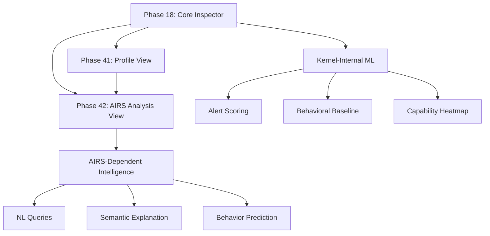

# AIOS Inspector Architecture

## Security & Capability Management Dashboard

**Parent document:** [architecture.md](../project/architecture.md)
**Related:** [model.md §7.1](../security/model.md), [agents.md](agents.md), [compositor.md](../platform/compositor.md), [ui-toolkit.md](ui-toolkit.md), [behavioral-monitor.md](../intelligence/behavioral-monitor.md), [adversarial-defense.md](../security/adversarial-defense.md)

-----

## 1. Core Insight

macOS has Activity Monitor — a window into process CPU, memory, disk, and network activity. It is the user's escape hatch when something feels wrong. But Activity Monitor shows *resources*, not *intent*. You can see that a process uses 80% CPU, but not *why* it accessed your contacts.

AIOS has richer primitives. Every agent action is capability-gated and provenance-recorded. The kernel knows not just *what* an agent consumed, but *what it tried to do*, *what it was denied*, and *which capability tokens authorized each action*. This is fundamentally more information than any traditional OS exposes.

The Inspector synthesizes this information into a coherent security narrative. Rather than showing raw audit logs, it compares what agents *declared* they would do (manifest intent) against what they *actually* did (runtime behavior), surfacing the gap as the primary security signal. It is the single place where users see, understand, and control what agents do on their behalf — the "Activity Monitor for agent security" — but because AIOS records intent and provenance, not just resource counters, it can show things no traditional monitor can.

-----

## 2. Architecture Overview

```text
┌───────────────────────────────────────────────────────────────────┐
│                        Inspector Agent                            │
│                                                                   │
│  ┌─────────────┐  ┌──────────────┐  ┌──────────────────────────┐ │
│  │  Dashboard   │  │  Detail      │  │  Action                  │ │
│  │  Controller  │  │  Views       │  │  Handler                 │ │
│  │             │  │  (9 views)   │  │                          │ │
│  └──────┬──────┘  └──────┬───────┘  └────────────┬─────────────┘ │
│         │                │                       │               │
│  ┌──────▼────────────────▼───────────────────────▼─────────────┐ │
│  │                    Data Layer                                │ │
│  │  ┌─────────────┐ ┌──────────────┐ ┌───────────────────────┐ │ │
│  │  │ Provenance  │ │ Capability   │ │ Agent                 │ │ │
│  │  │ Query       │ │ Query        │ │ Query                 │ │ │
│  │  │ Engine      │ │ Engine       │ │ Engine                │ │ │
│  │  └──────┬──────┘ └──────┬───────┘ └──────────┬────────────┘ │ │
│  └─────────┼───────────────┼────────────────────┼──────────────┘ │
└────────────┼───────────────┼────────────────────┼────────────────┘
             │               │                    │
    ─────────▼───────────────▼────────────────────▼────────
             Kernel syscall interface (AuditRead, CapabilityQuery, etc.)
    ────────────────────────────────────────────────────────
```

**Data Sources:**

| Source | Capability / Access API | Contents |
|---|---|---|
| Provenance chain | `AuditRead` capability | Merkle-chained action records ([layers.md §2.7](../security/model/layers.md)) |
| Capability table | `CapabilityList` / `CapabilityRevoke` syscalls | Active tokens per agent ([capabilities.md §3.1](../security/model/capabilities.md)) |
| Agent registry | Service Manager IPC query | Metadata, trust level, behavioral baseline |
| Security events | `AuditRead` capability (security filter) | Denials, anomalies, injection attempts |
| Profile store | Profile service IPC | Capability profiles, resolution logs ([capabilities.md §3.7](../security/model/capabilities.md)) |
| AIRS analysis | AIRS inference service IPC | SecurityAnalysis results ([airs.md §5.9](../intelligence/airs.md)) |

All reads are non-blocking. The provenance chain is append-only and immutable — the Inspector can never modify it.

-----

## Document Map

| Document | Sections | Content |
|---|---|---|
| **This file** | §1, §2, §15–§17 | Core insight, architecture overview, design principles, implementation order, comparisons |
| [architecture.md](./inspector/architecture.md) | §3, §4 | Agent identity, component architecture, data model, innovations |
| [views.md](./inspector/views.md) | §5 | All 9 views with research-informed enhancements |
| [actions.md](./inspector/actions.md) | §6–§9 | User actions, conversation bar, auto-open triggers, performance |
| [threat-model.md](./inspector/threat-model.md) | §10–§11 | Threat model, security layer positioning, provenance integrity, trust model |
| [intelligence.md](./inspector/intelligence.md) | §12–§14 | AIRS-dependent intelligence, kernel-internal ML, future directions |
| [testing.md](./inspector/testing.md) | §18–§19 | Testing strategy, accessibility |

-----

## 15. Design Principles

**1. Transparency over obscurity.** Every security decision the OS makes is visible. No hidden policies, no silent denials that the user never learns about. Every capability check result — allow or deny — appears in the provenance chain with the specific rule that produced it (inspired by Cilium Hubble's policy verdict annotations).

**2. Comprehensible by default, powerful on demand.** The default view is a simple dashboard: which agents are running, what they recently did, are there any alerts. Drilling down reveals capability tokens, provenance chains, profile resolution traces, and AIRS analysis reports. Three-level semantic zoom (agent → behavioral cluster → raw events) lets users navigate large audit trails without information overload (Provenance Map Orbiter, TaPP 2011).

**3. No special kernel backdoors.** The Inspector is a regular Trust Level 2 agent ([model.md §1.2](../security/model.md)). Its elevated visibility comes from having `AuditRead(Scope::All)` capability, granted because it is system-shipped and signed by the AIOS root key. It uses the same syscall interface as any agent.

**4. Non-blocking.** The Inspector never interferes with agent execution. It is a read-heavy, write-light application. The only writes are user-initiated actions: capability revocation, profile override edits, agent pause/resume.

**5. Intent over resources.** Where traditional monitors show CPU and memory counters, the Inspector shows what agents *tried to do* and whether it was allowed. Resource metrics exist but are secondary to intent-level visibility.

**6. Declared-vs-observed gap as primary signal.** The Inspector compares each agent's manifest (what it *said* it would do) against its runtime behavior (what it *actually* did). Divergences — accessing resources not declared in the manifest, or never using declared capabilities — are surfaced as the primary security signal (inspired by Token Security's intent gap analysis).

**7. Concrete over abstract.** Permissions are displayed in human-readable terms: "Can read your research papers" not "SpaceRead(research/*)". Technical identifiers are available on drill-down but never the default display (Felt 2012, Shen 2021 on permission comprehension).

**8. Alert fatigue resistance.** Raw security events are pre-triaged before display. Kernel-internal alert scoring (frozen decision trees) reduces the alert stream to actionable items. The target is fewer than 50 daily items requiring human attention, down from potentially thousands of raw events (ACM Computing Surveys 2025 on AIRS-based alert triage).

**9. Tamper-evident audit.** The provenance chain is Merkle-linked. The Inspector can walk the chain and verify integrity with logarithmic-sized proofs (~3 KB for 80M events). A broken chain triggers an immediate Level 4 alert (Crosby-Wallach, USENIX Security 2009).

**10. API-first design.** Every view the Inspector renders is backed by a query API that other agents can use. The Inspector is the *reference consumer*, not the only consumer. Accessibility tools, third-party dashboards, and automated compliance reporters all use the same query engines.

-----

## 16. Implementation Order

### Dependency Graph



### What Ships When

| Phase | Capabilities / APIs Added | Views Available |
|---|---|---|
| Phase 18 (Security Architecture) | Core Inspector: `AuditRead` capability, `CapabilityList`/`CapabilityRevoke` syscalls, Service Manager IPC (agent query, pause/resume) | Dashboard, Agent, Provenance, Security Events, Capability, Hardware, Multi-View Linking |
| Phase 41 (Composable Profiles) | Profile service IPC (read profiles, write user overrides) | + Profile View with resolution trace and user overrides |
| Phase 42 (AIRS Intelligence) | AIRS inference service IPC (SecurityAnalysis) | + AIRS Analysis View with recommendations and "Apply" actions |

### Kernel-Internal ML Rollout

These features require no AIRS dependency and ship progressively:

| Feature | Prerequisite | Ships With |
|---|---|---|
| Alert priority scoring | Behavioral monitor baseline data | Phase 18+ (after sufficient baseline data) |
| Behavioral baseline (Welford/z-score) | Already partially designed in behavioral-monitor.md | Phase 18 |
| Provenance graph feature scoring | Provenance chain query engine | Phase 18+ |
| Isolation forest for capability abuse | Capability query engine | Phase 18+ |
| Temporal pattern detection | Timer + provenance correlation | Phase 18+ |
| Capability usage heatmap (EMA matrix) | Capability query engine | Phase 18 |

-----

## 17. Comparisons

### AIOS Inspector vs. macOS Activity Monitor

| Dimension | macOS Activity Monitor | AIOS Inspector |
|---|---|---|
| **Shows** | CPU, memory, disk, network per process | Capabilities, actions, provenance, behavioral baselines per agent |
| **Granularity** | Process-level resource counters | Action-level intent records (what was accessed, why, by whom) |
| **Denials** | Not shown (kernel denials are invisible to users) | Every denial visible with reason, blocking layer, and policy verdict |
| **History** | None (live snapshot only) | Full provenance chain (Merkle-linked, tamper-evident, logarithmic proofs) |
| **User control** | Kill process (all-or-nothing) | Revoke specific capabilities, pause agent, add overrides, dry-run enforcement |
| **AI analysis** | None | AIRS behavioral prediction, corpus comparison, NL queries, semantic explanation |
| **Composition** | N/A | Profile resolution trace showing how layers combine |
| **Integrity** | None | Merkle chain verification, tamper detection, capability snapshots |
| **Conversational** | None | Linked from Conversation Bar natural language queries |

### AIOS Inspector vs. Agent Safehouse

[Agent Safehouse](https://agent-safehouse.dev/) provides sandbox policy management for LLM coding agents on macOS, using `sandbox-exec` profiles. The AIOS Inspector provides analogous functionality but operates at the OS level rather than as an application-level wrapper.

| Dimension | Agent Safehouse | AIOS Inspector |
|---|---|---|
| **Sandbox enforcement** | macOS `sandbox-exec` (application-level) | Kernel capability table (OS-level) |
| **Policy format** | SBPL numbered layers (00-base, 30-toolchains, 60-agents) | Capability profiles with 5 named layers (OsBase through UserOverride) |
| **Deny semantics** | Later rules can override earlier denials | Deny-always-wins across all layers |
| **Visualization** | CLI output, log files | Native GUI with 9 interactive views + multi-view cross-linking |
| **Audit trail** | Log files (mutable) | Merkle-chained provenance (tamper-evident, logarithmic proofs) |
| **AI analysis** | None | AIRS 5-stage pipeline with behavioral prediction + NL queries |
| **User overrides** | Edit SBPL files manually | Layer 90 visual editor in Profile View |
| **Runtime control** | Process kill | Granular: revoke single capability, pause, resume, dry-run |
| **Scope** | Coding agents only | All agents (any category, any runtime) |
| **Deployment** | Third-party tool installed per-agent | Ships with the OS; automatic for all agents |

### AIOS Inspector vs. Production Security Dashboards

| Feature | Datadog AI Console | Wiz Security Graph | Cilium Hubble | AIOS Inspector |
| --- | --- | --- | --- | --- |
| **Agent execution graph** | Interactive DAG | — | — | Execution flow graph (DAG of decisions, tool calls, inter-agent comms) |
| **Cross-entity analysis** | — | Toxic combination detection | — | Toxic combination detection across agent capabilities |
| **Policy verdicts** | — | — | Per-flow verdict annotations | Per-action policy verdict with specific capability/layer |
| **Provenance** | Trace spans | — | Flow logs | Merkle-linked chain with semantic zoom and logarithmic proofs |
| **Natural language** | — | — | — | NL security queries via AIRS (NL2KQL-inspired, 0.964 syntax score) |
| **Anomaly explanation** | — | — | — | Semantic anomaly explanation with causal graphs |

-----

## Cross-Reference Index

| Section | Sub-file | Description |
|---|---|---|
| §1 Core Insight | This file | Provenance synthesis and intent-over-resources |
| §2 Architecture Overview | This file | Component diagram and data sources |
| §3 Agent Identity | [architecture.md](./inspector/architecture.md) | Manifest, capabilities, trust level |
| §4 Component Architecture | [architecture.md](./inspector/architecture.md) | Data flow, query engines, concurrency, innovations |
| §5.1 Dashboard | [views.md](./inspector/views.md) | Default view with rolling window and narrative summaries |
| §5.2 Agent View | [views.md](./inspector/views.md) | Per-agent deep dive with intent gap and execution graph |
| §5.3 Provenance View | [views.md](./inspector/views.md) | Merkle chain browser with semantic zoom |
| §5.4 Security Events | [views.md](./inspector/views.md) | Alert feed with fatigue mitigation and investigation workflow |
| §5.5 Capability View | [views.md](./inspector/views.md) | System-wide tokens with toxic combination detection |
| §5.6 Profile View | [views.md](./inspector/views.md) | Phase 41+ profile management with dry-run enforcement |
| §5.7 AIRS Analysis View | [views.md](./inspector/views.md) | Phase 42+ AI-assisted analysis with recommendations |
| §5.8 Hardware View | [views.md](./inspector/views.md) | Cross-subsystem audit with trust borders |
| §5.9 Multi-View Linking | [views.md](./inspector/views.md) | Cross-view brushing and persona-based presets |
| §6 User Actions | [actions.md](./inspector/actions.md) | Confirmation flows, undo semantics |
| §7 Conversation Bar | [actions.md](./inspector/actions.md) | NL query integration with AIRS |
| §8 Auto-Open Triggers | [actions.md](./inspector/actions.md) | Severity-based auto-open policy |
| §9 Performance | [actions.md](./inspector/actions.md) | Query/memory/render budgets, concurrency model |
| §10 Threat Model | [threat-model.md](./inspector/threat-model.md) | Attacks targeting the Inspector itself |
| §11 Security Layer Positioning | [threat-model.md](./inspector/threat-model.md) | How Inspector reads from all 8 security layers |
| §12 AIRS-Dependent Intelligence | [intelligence.md](./inspector/intelligence.md) | 7 AIRS capabilities |
| §13 Kernel-Internal ML | [intelligence.md](./inspector/intelligence.md) | 6 kernel-internal ML features |
| §14 Future Directions | [intelligence.md](./inspector/intelligence.md) | 5 research directions |
| §15 Design Principles | This file | 10 numbered principles |
| §16 Implementation Order | This file | Dependency graph and phase rollout |
| §17 Comparisons | This file | vs macOS, Agent Safehouse, production dashboards |
| §18 Testing Strategy | [testing.md](./inspector/testing.md) | Unit, integration, red-team, QEMU validation |
| §19 Accessibility | [testing.md](./inspector/testing.md) | Screen reader, keyboard nav, color-blind safety |
