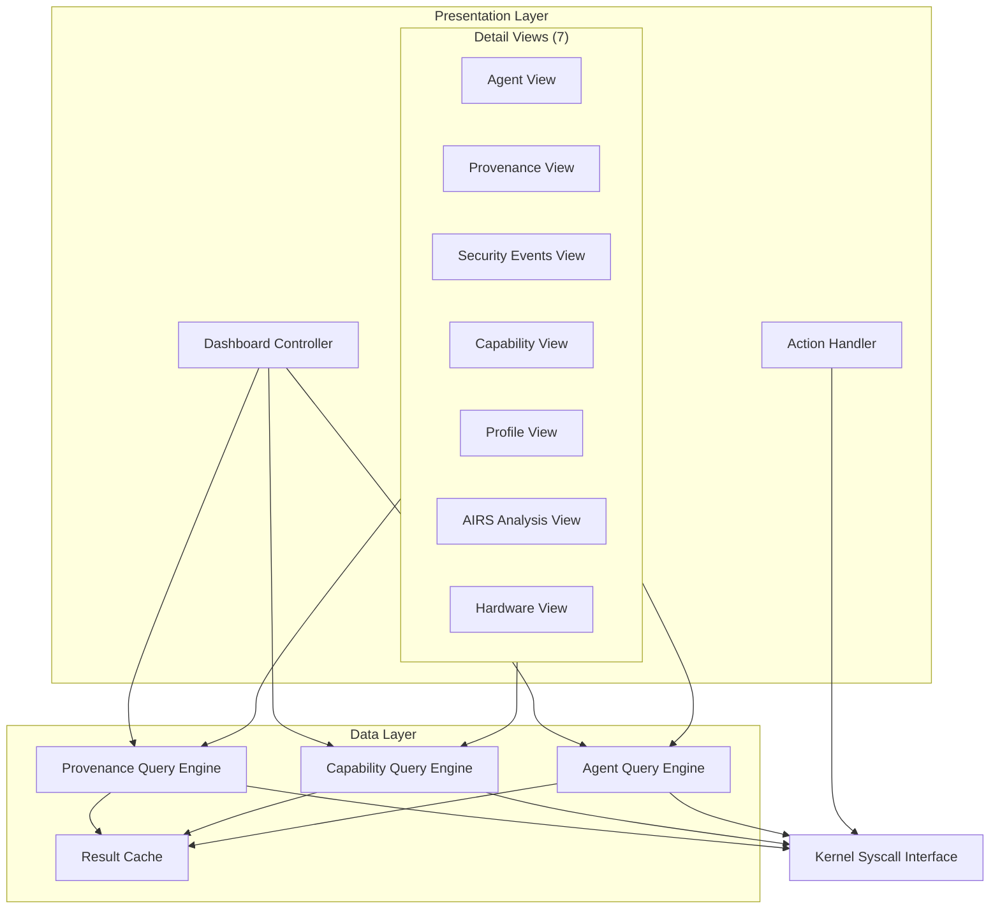
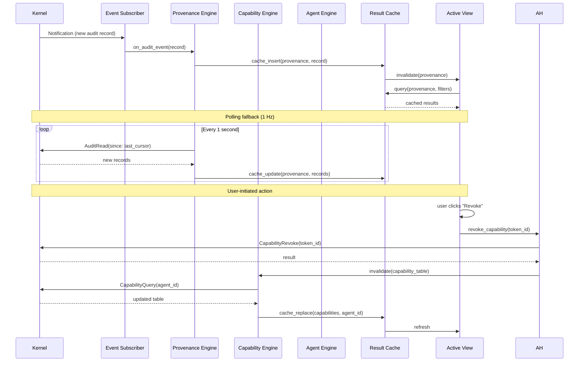
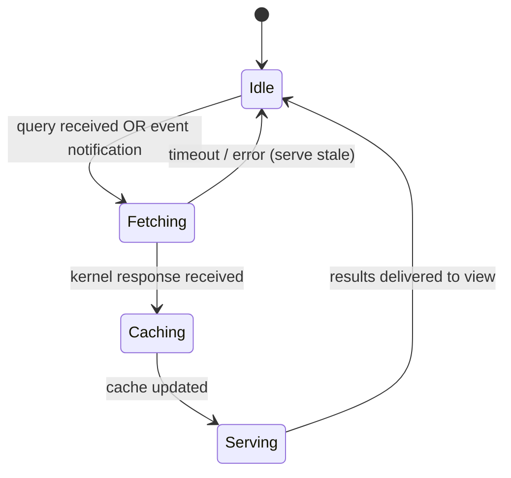

# AIOS Inspector — Architecture & Data Model

Part of: [inspector.md](../inspector.md) — Inspector Architecture
**Related:** [views.md](./views.md) — Views, [actions.md](./actions.md) — Actions, [threat-model.md](./threat-model.md) — Threat Model

-----

## 3. Agent Identity

```rust
pub const INSPECTOR_AGENT: AgentManifest = AgentManifest {
    bundle_id: "dev.aios.inspector",
    name: "Inspector",
    version: "1.0.0",
    // Trust Level 2: Native experience agent (see model.md §1.2)
    runtime: RuntimeType::Native,
    profiles: vec![
        ProfileReference {
            profile_id: "os.base.v1",
            version_req: ">=1.0",
            required: true,
        },
        ProfileReference {
            profile_id: "runtime.native.v1",
            version_req: ">=1.0",
            required: true,
        },
    ],
    requested_capabilities: vec![
        // Core: full audit visibility
        CapabilityRequest {
            capability: Capability::AuditRead(Scope::All),
            justification: "Full audit visibility for security monitoring",
            required: true,
        },
        // Read capability tables for all agents
        CapabilityRequest {
            capability: Capability::CapabilityQuery(Scope::All),
            justification: "Read capability tables for all agents",
            required: true,
        },
        // Revoke capabilities on user's behalf
        CapabilityRequest {
            capability: Capability::CapabilityRevoke(Scope::All),
            justification: "Revoke capabilities on user's behalf",
            required: true,
        },
        // Read agent metadata and behavioral baselines
        CapabilityRequest {
            capability: Capability::AgentQuery(Scope::All),
            justification: "Read agent metadata and behavioral baselines",
            required: true,
        },
        // Pause/resume agents on user's behalf
        CapabilityRequest {
            capability: Capability::AgentControl(Scope::All),
            justification: "Pause/resume agents on user's behalf",
            required: true,
        },
        // Profile management
        CapabilityRequest {
            capability: Capability::ProfileRead(Scope::All),
            justification: "Read capability profiles and resolution logs",
            required: false,
        },
        CapabilityRequest {
            capability: Capability::ProfileWrite(Scope::User),
            justification: "Manage user override profiles (Layer 90)",
            required: false,
        },
        // Compositor surface for its own window
        CapabilityRequest {
            capability: Capability::Compositor(SurfaceType::Window),
            justification: "Compositor surface for Inspector window",
            required: true,
        },
        // Read AIRS analysis results
        CapabilityRequest {
            capability: Capability::InferenceQuery(Scope::SecurityAnalysis),
            justification: "Read AIRS security analysis results",
            required: false,
        },
    ],
};
```

The Inspector's capabilities are broad but bounded. It can **read** everything and **revoke** capabilities, but it cannot **grant** new capabilities, **create** agents, or **write** to agent spaces. This asymmetry is deliberate. The Inspector is an auditor, not an administrator.

Three design constraints enforce this boundary:

1. **No `CapabilityGrant` capability.** The Inspector cannot mint new capability tokens or extend an agent's permission set. Granting is a policy decision that belongs to the profile resolution pipeline ([capabilities.md §3.7](../../security/model/capabilities.md)), not a monitoring tool.

2. **No `AgentCreate` or `AgentInstall` capability.** Installing an agent requires a signed manifest, AIRS analysis, and user consent — a multi-step ceremony that the Inspector observes but does not participate in.

3. **No `SpaceWrite` capability.** The Inspector reads provenance, capabilities, and agent metadata. It never writes to any agent's space. The only write-side capabilities it holds are `CapabilityRevoke` (removing access), `AgentControl` (pause/resume), and `ProfileWrite(Scope::User)` (user-layer overrides only).

This means a compromised Inspector cannot escalate privileges, install malicious agents, or tamper with agent data. The worst outcome is denial of service (revoking legitimate capabilities or pausing agents), which the user can reverse and the kernel logs.

-----

## 4. Component Architecture

### 4.1 Component Decomposition

The Inspector is composed of three layers: a presentation layer (Dashboard Controller + Detail Views), an action layer (Action Handler), and a data layer (three query engines connected to the kernel syscall interface).



**Dashboard Controller** aggregates summary data from all three query engines: agent count, alert count, recent activity, and system-wide security posture. It is the only component that queries all engines simultaneously on every refresh cycle.

**Detail Views** are seven specialized renderers plus the Dashboard (8 views total), each consuming data from one or two query engines. Multi-View Linking is an interaction pattern across views rather than a separate view. Views are lazy — they do not fetch data until the user navigates to them.

| View | Primary Engine | Secondary Engine |
|---|---|---|
| Agent View | Agent Query | Provenance Query |
| Provenance View | Provenance Query | — |
| Security Events View | Provenance Query (security filter) | Agent Query |
| Capability View | Capability Query | Agent Query |
| Profile View | Capability Query | Agent Query |
| AIRS Analysis View | Agent Query | Capability Query |
| Hardware View | Agent Query | Capability Query |

**Action Handler** is the only component that issues write operations (`CapabilityRevoke` syscall, Service Manager IPC for pause/resume, profile service IPC for overrides). Every action passes through a confirmation dialog before execution. The Action Handler never bypasses the presentation layer — it is always invoked by user interaction within a view.

-----

### 4.2 Data Flow

Data flows from the kernel through query engines, into a shared cache, and out to views. Two mechanisms deliver data: event subscriptions (push) and polling (pull).



**Event subscriptions** use the kernel notification mechanism ([ipc.md §5](../../kernel/ipc.md)). The Inspector creates a notification object and registers interest in audit events, capability changes, and agent lifecycle transitions. When the kernel records a new audit entry or modifies a capability table, it signals the notification. The event subscriber thread wakes, reads the new data, and pushes it into the relevant query engine.

**Polling fallback** activates when event subscriptions are unavailable (early boot, kernel versions without notification support, or after a notification queue overflow). Each query engine maintains a cursor (timestamp or sequence number) and polls at 1 Hz for records newer than the cursor.

**Cache invalidation** is per-engine and per-entity. When the Provenance Query Engine receives new records, it invalidates only the affected provenance cache entries. When the Capability Query Engine detects a change to agent X's table, it invalidates only agent X's cached capabilities. Views observe cache invalidation and re-render their affected regions.

-----

### 4.3 Query Engine State Machines

Each query engine operates as an independent state machine with four states.



**Provenance Query Engine** maintains a cursor into the Merkle-chained audit log. On each fetch cycle, it requests records from cursor forward, appends them to the in-memory ring buffer (last 1000 records), and advances the cursor. For historical queries (user scrolling beyond the ring buffer), it issues on-demand `AuditRead` calls with time-range filters. The engine verifies Merkle chain continuity on every batch: each record's `prev_hash` must match the previous record's `this_hash`. A break in the chain triggers an immediate critical alert.

**Capability Query Engine** performs a full table scan on first open (`CapabilityQuery(Scope::All)`), caching all active tokens indexed by agent ID and capability type. Subsequent updates are incremental: when a change notification arrives, the engine re-scans only the affected agent's table. The engine also maintains a delegation graph — a directed acyclic graph of token parent-child relationships — rebuilt from the `delegated_from` field on each token.

**Agent Query Engine** caches agent metadata (manifest, trust level, runtime, anomaly score) at Inspector launch. Metadata changes infrequently (agent install, uninstall, trust level change), so the engine subscribes to agent lifecycle notifications and updates its cache only on these events. Behavioral baselines are fetched from the behavioral monitor ([behavioral-monitor.md](../../intelligence/behavioral-monitor.md)) via the `AgentQuery` syscall and cached with a 60-second TTL.

-----

### 4.4 Concurrency Model

The Inspector uses a four-thread architecture with strict separation between rendering and data access.

| Thread | Responsibility | Blocking Allowed |
|---|---|---|
| Main (render) | UI rendering, user input, view transitions | Never |
| Query | Executes all three query engines, processes responses | Yes (kernel syscalls) |
| Event | Listens on kernel notification objects | Yes (blocking wait) |
| Action | Executes write syscalls (revoke, pause, profile edit) | Yes (kernel syscalls) |

**No locks on the render path.** The main thread never blocks on a mutex, semaphore, or kernel call. Query results are delivered from the query thread to the main thread via a lock-free single-producer single-consumer message queue. The main thread consumes messages at the start of each render frame and updates view state accordingly.

```rust
/// Messages from query/event/action threads to the render thread.
pub enum InspectorMessage {
    /// New provenance records available.
    ProvenanceUpdate(Vec<AuditRecord>),
    /// Capability table changed for an agent.
    CapabilityUpdate { agent_id: AgentId, tokens: Vec<CapabilityToken> },
    /// Agent metadata refreshed.
    AgentUpdate { agent_id: AgentId, metadata: AgentMetadata },
    /// Security event requiring attention.
    SecurityAlert(SecurityEvent),
    /// Action completed (success or failure).
    ActionResult { action_id: ActionId, result: Result<(), ActionError> },
    /// Merkle chain integrity violation detected.
    ChainBreak { record_seq: u64, expected_hash: ContentHash, actual_hash: ContentHash },
}
```

The query thread runs all three engines sequentially within each cycle (provenance, capabilities, agents). Engines that have no pending work (no new notifications, no pending queries) are skipped. This keeps the query thread from spinning — it sleeps when all engines are idle.

The event thread blocks on `ipc_select` across the three notification objects (audit events, capability changes, agent lifecycle). When any notification fires, it wakes and dispatches to the appropriate query engine, which processes the event and sends an `InspectorMessage` to the render thread.

The action thread processes user-initiated write operations one at a time, in FIFO order. Each action is confirmed by the user before being enqueued, and the result is sent back to the render thread as an `ActionResult` message.

-----

### 4.5 Data Model — Provenance Query Pipeline

The Provenance Query Engine exposes a structured query API for filtering and navigating the audit log.

```rust
/// Query parameters for provenance searches.
pub struct AuditQuery {
    /// Filter by agent (None = all agents).
    pub agent_id: Option<AgentId>,
    /// Filter by action type (read, write, net, inference, etc.).
    pub action_types: Option<Vec<ActionType>>,
    /// Time range (inclusive).
    pub time_range: Option<(Timestamp, Timestamp)>,
    /// Filter by result (allowed, denied, or both).
    pub result_filter: Option<AuditResult>,
    /// Maximum number of records to return.
    pub limit: usize,
    /// Cursor for pagination (record sequence number).
    pub cursor: Option<u64>,
}
```

**Tiered retention** governs how much provenance data the Inspector keeps accessible at each level:

| Tier | Storage | Capacity | Access Pattern |
|---|---|---| --- |
| Hot | In-memory ring buffer | Last 1000 records | Sub-millisecond; serves Dashboard and live views |
| Warm | On-disk cache (Inspector's space) | Last 7 days | Tens of milliseconds; serves Provenance View scroll-back |
| Cold | Kernel audit log (read-only) | Full history | Hundreds of milliseconds; serves Export and forensic queries |

The hot tier is a fixed-size ring buffer. When it fills, the oldest record is evicted to the warm tier (written to the Inspector's local space as a compacted batch). The warm tier uses a simple append log with a date-partitioned index. Cold-tier access issues `AuditRead` calls directly to the kernel with time-range filters.

**Merkle verification** runs continuously on the hot tier. Every incoming batch of records is chain-verified: for each record `r[i]`, the engine confirms that `r[i].prev_hash == hash(r[i-1])`. A verification failure triggers an immediate `ChainBreak` message to the render thread, which escalates to a critical security alert. The engine also supports full-chain verification on demand (user-initiated from the Provenance View), which walks the entire warm + cold tiers.

-----

### 4.6 Innovations

#### Capability Snapshots (inspired by seL4 capDL)

seL4's capability distribution language (capDL) provides a serializable, machine-readable description of the entire capability state of a system. The Inspector adapts this concept for runtime forensics.

```rust
/// A frozen point-in-time view of all capability tokens across all agents.
pub struct CapabilitySnapshot {
    /// When this snapshot was taken.
    pub timestamp: Timestamp,
    /// All active tokens, indexed by agent.
    pub tokens: BTreeMap<AgentId, Vec<CapabilityToken>>,
    /// Delegation graph edges (parent_token -> child_token).
    pub delegations: Vec<(CapabilityTokenId, CapabilityTokenId)>,
    /// Hash of the entire snapshot for integrity verification.
    pub snapshot_hash: ContentHash,
}
```

**Diffing** two snapshots produces a structured change set:

```rust
pub struct CapabilityDiff {
    pub from: Timestamp,
    pub to: Timestamp,
    /// Tokens present in `to` but not `from`.
    pub granted: Vec<(AgentId, CapabilityToken)>,
    /// Tokens present in `from` but not `to`.
    pub revoked: Vec<(AgentId, CapabilityToken)>,
    /// Tokens present in both but with changed scope or expiry.
    pub attenuated: Vec<(AgentId, CapabilityToken, CapabilityToken)>,
    /// New delegation edges.
    pub delegated: Vec<(CapabilityTokenId, CapabilityTokenId)>,
}
```

Snapshots serve three purposes:

1. **Incident reconstruction.** When investigating a security event, the user can compare the snapshot taken before the event with the snapshot taken after. The diff shows exactly which capabilities were granted, revoked, or modified.

2. **Compliance reporting.** Snapshots export to a machine-readable format (JSON or CBOR) for external audit tools. An enterprise compliance system can ingest weekly snapshots and verify that no agent exceeded its authorized capability set.

3. **Regression detection.** After an OS update or profile change, comparing before/after snapshots reveals unintended capability changes — agents gaining access they should not have, or losing access they need.

#### Structured Diagnostic Trees (inspired by Fuchsia Inspect)

Fuchsia's Inspect system gives each component a typed key-value hierarchy of its internal state, collected by a centralized diagnostic reader. The Inspector adapts this pattern for agent diagnostics.

```rust
/// A typed hierarchical diagnostic tree exposed by each agent.
pub struct InspectTree {
    /// Root node of the diagnostic hierarchy.
    pub root: InspectNode,
    /// Agent that owns this tree.
    pub agent_id: AgentId,
    /// When this tree was last updated.
    pub last_updated: Timestamp,
}

pub struct InspectNode {
    pub name: String,
    pub properties: Vec<InspectProperty>,
    pub children: Vec<InspectNode>,
}

pub enum InspectProperty {
    String(String, String),
    Int(String, i64),
    Uint(String, u64),
    Double(String, f64),
    Bool(String, bool),
    Bytes(String, Vec<u8>),
    Histogram(String, Vec<u64>),
}
```

Each agent optionally exposes an `InspectTree` through a well-known IPC endpoint. The Agent Query Engine collects these trees during its metadata refresh cycle and caches them. The Agent View renders the tree as an expandable hierarchy, letting the user drill into an agent's internal state without parsing log files.

Example tree for a Research Assistant agent:

```text
research-assistant/
    status: "running"
    uptime_secs: 14523
    requests/
        total: 142
        active: 2
        errors: 0
        latency_ms/
            p50: 45
            p99: 320
    cache/
        entries: 1024
        hit_rate: 0.87
        evictions: 56
    connections/
        api.anthropic.com: "connected"
        arxiv.org: "idle"
```

This approach avoids ad-hoc log parsing and provides consistent, typed diagnostic data across all agents regardless of runtime (Native, WASM, Python, TypeScript).

#### API-First Design

Every view in the Inspector is backed by a query API. The Inspector does not contain privileged data paths — it uses the same `AuditRead`, `CapabilityQuery`, and `AgentQuery` syscalls available to any agent with the appropriate capabilities.

```rust
/// IPC service exposed by the Inspector for programmatic access.
pub trait InspectorQueryService {
    /// Query provenance records with filters.
    fn query_provenance(&self, query: AuditQuery) -> Result<Vec<AuditRecord>, QueryError>;
    /// Get capability snapshot for a specific agent or all agents.
    fn query_capabilities(&self, agent_id: Option<AgentId>) -> Result<CapabilitySnapshot, QueryError>;
    /// Get agent metadata and diagnostic tree.
    fn query_agent(&self, agent_id: AgentId) -> Result<AgentDiagnostics, QueryError>;
    /// Diff two capability snapshots.
    fn diff_snapshots(&self, from: Timestamp, to: Timestamp) -> Result<CapabilityDiff, QueryError>;
    /// Verify Merkle chain integrity over a range.
    fn verify_chain(&self, from: u64, to: u64) -> Result<ChainVerification, QueryError>;
}
```

This API-first approach enables three integration patterns:

1. **Accessibility tools** use the same query APIs to present security information in screen-reader-friendly formats, Braille output, or high-contrast views ([accessibility.md §3](../../experience/accessibility.md)).

2. **Third-party compliance reporters** connect to `InspectorQueryService` via IPC to generate audit reports, SOC 2 evidence packages, or GDPR data access logs without needing direct kernel access.

3. **Automated testing** exercises the Inspector's query APIs without rendering any UI, enabling property-based testing of query correctness, cache consistency, and chain verification.

The `InspectorQueryService` is itself capability-gated. A client connecting to it must hold `AuditRead` at minimum. The Inspector attenuates its own capabilities when serving API clients — a client with `AuditRead(Scope::Agent(X))` receives only agent X's provenance records, even though the Inspector internally holds `AuditRead(Scope::All)`.

-----

## Cross-References

| Topic | Document | Relevant Sections |
|---|---|---|
| Security model & trust levels | [model.md](../../security/model.md) | §1.2 Trust Boundaries, §3.7 Composable Profiles, §6.3 Escalation Policy, §7.1 Inspector |
| Capability system | [capabilities.md](../../security/model/capabilities.md) | §3.1-§3.6 Token lifecycle, delegation, attenuation |
| AIRS capability intelligence | [intelligence-services.md](../../intelligence/airs/intelligence-services.md) | §5.9 Agent Capability Intelligence |
| Behavioral monitor | [behavioral-monitor.md](../../intelligence/behavioral-monitor.md) | §3 Data model, §4 Detection |
| Agent lifecycle | [agents.md](../agents.md) | §3.1 Installation flow |
| IPC notifications | [ipc.md](../../kernel/ipc.md) | §5 Notification objects |
| Provenance & audit | [operations.md](../../security/model/operations.md) | §6 Events, §7 Audit |
| Compositor integration | [compositor.md](../../platform/compositor.md) | §3 Surface protocol |
| Accessibility | [accessibility.md](../../experience/accessibility.md) | §3 Screen reader, §9 Accessibility tree |
