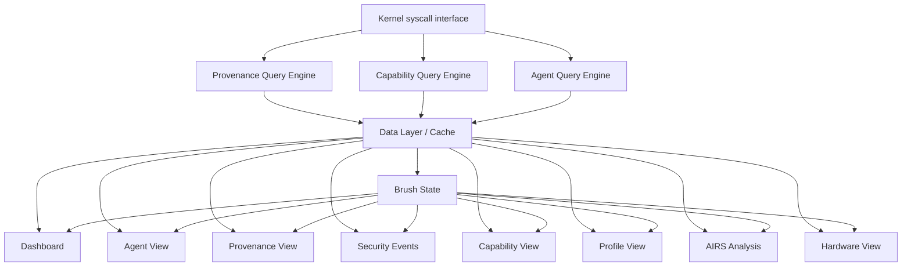

# AIOS Inspector — Views

Part of: [inspector.md](../inspector.md) — Inspector Architecture
**Related:** [architecture.md](./architecture.md) — Architecture, [actions.md](./actions.md) — Actions, [intelligence.md](./intelligence.md) — Intelligence

-----

## 5. Views

The Inspector presents nine views, each corresponding to a distinct concern. The user navigates between them via a sidebar or tab bar. All views share a common data layer (see [architecture.md §4](./architecture.md)) and participate in cross-view linking (see [§5.9](#59-multi-view-linking)).

-----

### 5.1 Dashboard (Default View)

The landing page. Shows system-wide security posture at a glance.

```text
┌──────────────────────────────────────────────────────────────────┐
│  Inspector — Dashboard                                           │
│                                                                  │
│  ┌─────────────┐  ┌─────────────┐  ┌─────────────┐             │
│  │  7 Agents   │  │  0 Alerts   │  │  142 Actions │             │
│  │  Running    │  │  ✓ All Clear│  │  Today       │             │
│  └─────────────┘  └─────────────┘  └─────────────┘             │
│                                                                  │
│  Recent Activity                                                 │
│  ┌──────────────────────────────────────────────────────────┐   │
│  │  12:04  Research Assistant  read  research/papers/ml.pdf │   │
│  │  12:03  Email Agent         net   imap.gmail.com         │   │
│  │  12:01  Budget Tracker      read  finances/budget/q1     │   │
│  │  11:58  Code Editor         write workspace/src/main.rs  │   │
│  │  11:55  Research Assistant  net   api.anthropic.com      │   │
│  └──────────────────────────────────────────────────────────┘   │
│                                                                  │
│  Alerts (last 24h)                                               │
│  ┌──────────────────────────────────────────────────────────┐   │
│  │  (none)                                                   │   │
│  └──────────────────────────────────────────────────────────┘   │
│                                                                  │
│  ┌──────────────────────────────────────────────────────────┐   │
│  │  Privacy Report (7-day rolling)                           │   │
│  │                                                           │   │
│  │  Summary: 4 agents accessed 3 resource types this week.   │   │
│  │  Research Assistant accessed research/papers 89 times,    │   │
│  │  made 42 network calls to api.anthropic.com.              │   │
│  │  No new capability grants. 1 expired token auto-cleaned.  │   │
│  │                                                           │   │
│  │  [Detail: Brief ▾]  [Expand full report]                  │   │
│  └──────────────────────────────────────────────────────────┘   │
└──────────────────────────────────────────────────────────────────┘
```

**Data**: Aggregates from all query engines. Activity feed is the most recent N provenance records. Alert count is unacknowledged security events of severity >= Medium.

#### 7-Day Rolling Privacy Report

The Dashboard defaults to a 7-day rolling temporal window, inspired by the approach of surfacing cumulative privacy-relevant activity over a meaningful period rather than a live snapshot. The report aggregates:

- **Per-agent resource access counts** — grouped by capability type (space reads, network calls, sensor access, inference requests).
- **Capability lifecycle events** — grants, revocations, expirations, and auto-cleanups within the window.
- **Denial summary** — count of blocked actions per agent with top denial reasons.
- **Anomaly summary** — any behavioral monitor alerts triggered during the window.

Users select the temporal window from a dropdown (1 day, 7 days, 30 days). The 7-day default balances recency with enough history to detect patterns.

#### Narrative Summaries

AIRS generates natural-language summaries of agent activity for the privacy report. Rather than requiring users to parse tables and charts, the summary provides a readable account of what happened:

- **Adjustable detail level** — Brief (2-3 sentences), Standard (per-agent paragraph), Detailed (full breakdown with capability tokens cited).
- **Anomaly highlighting** — when behavioral deviations occur, the narrative calls them out explicitly: "Research Assistant made 3x more network calls than its weekly average on Tuesday."
- **No-AIRS fallback** — when inference is unavailable, the Dashboard falls back to a template-based summary using the same aggregated data, filling in agent names, counts, and capability types mechanically.

The narrative summary approach draws on visualization research showing that text-based explanations alongside visual data improve comprehension for non-expert users (Gove, VizSec 2021).

-----

### 5.2 Agent View

Per-agent deep dive. Select an agent from a list to see everything about it.

```text
┌──────────────────────────────────────────────────────────────────┐
│  Inspector — Agent: Research Assistant                            │
│                                                                  │
│  Trust Level: 3 (Third-party)     Runtime: WASM                  │
│  Installed: 2025-01-15            Author: research-tools.dev     │
│  Anomaly Score: 0.12 (normal)     Status: Running                │
│                                                                  │
│  Capabilities (4 active)                              [Revoke ▾] │
│  ┌──────────────────────────────────────────────────────────┐   │
│  │  SpaceRead    research/*              expires: never      │   │
│  │  SpaceWrite   research/papers/*       expires: never      │   │
│  │  Network      api.anthropic.com       expires: never      │   │
│  │  Network      arxiv.org               expires: 24h        │   │
│  └──────────────────────────────────────────────────────────┘   │
│                                                                  │
│  Behavioral Baseline                                             │
│  ┌──────────────────────────────────────────────────────────┐   │
│  │  Reads/day:  avg 34  today 41  ▓▓▓▓▓▓▓▓░░ (within 2σ)  │   │
│  │  Writes/day: avg 8   today 5   ▓▓▓▓░░░░░░ (normal)      │   │
│  │  Net calls:  avg 12  today 15  ▓▓▓▓▓▓▓░░░ (within 2σ)  │   │
│  │  Inference:  avg 6   today 8   ▓▓▓▓▓▓░░░░ (normal)      │   │
│  └──────────────────────────────────────────────────────────┘   │
│                                                                  │
│  Recent Actions (provenance)                                     │
│  ┌──────────────────────────────────────────────────────────┐   │
│  │  12:04  read   research/papers/ml.pdf         ✓ allowed  │   │
│  │  12:03  read   research/papers/transformers   ✓ allowed  │   │
│  │  12:01  net    api.anthropic.com/v1/messages  ✓ allowed  │   │
│  │  11:58  write  research/papers/summary.md     ✓ allowed  │   │
│  │  11:42  read   user/documents/notes.md        ✗ DENIED   │   │
│  └──────────────────────────────────────────────────────────┘   │
│                                                                  │
│  [Pause Agent]  [Revoke All Capabilities]  [View Full Provenance]│
└──────────────────────────────────────────────────────────────────┘
```

**Key interaction**: Clicking a denied action shows *why* it was denied (which layer blocked it, which capability was missing). Clicking "Revoke" on a specific capability token shows a confirmation dialog and immediately revokes via `CapabilityRevoke` syscall.

#### Declared-vs-Observed Intent Gap

The Agent View includes an intent gap section that compares what the agent's manifest declares against what the agent actually does at runtime. This surfaces two categories of divergence:

- **Over-declared** — capabilities requested in the manifest that the agent has never used. These represent unnecessary privilege and candidates for narrowing.
- **Under-declared** — runtime behavior that required capabilities not in the manifest (resulting in denials). These indicate either missing manifest entries or unauthorized access attempts.

```text
┌──────────────────────────────────────────────────────────────────┐
│  Intent Gap Analysis                                             │
│                                                                  │
│  Declared but unused (7 days):                                   │
│  ⚠ Network(arxiv.org) — 0 uses in 7 days, consider removing     │
│                                                                  │
│  Observed but undeclared:                                        │
│  ✗ SpaceRead(user/documents) — 3 denied attempts this week      │
│    Blocked at: Layer 1 (capability check)                        │
│    Missing: SpaceRead(user/documents/*)                          │
└──────────────────────────────────────────────────────────────────┘
```

The gap analysis draws on the principle that security policies should match actual behavior — over-provisioned agents carry unnecessary risk, and under-provisioned agents generate noise from repeated denials. AIRS refines these observations over time, distinguishing between "agent hasn't needed it yet" and "agent will never need it" via behavioral profiling (see [§5.7 AIRS Analysis View](#57-airs-analysis-view-phase-41) and [../../intelligence/behavioral-monitor.md](../../intelligence/behavioral-monitor.md)).

#### Execution Flow Graph

For agents with complex multi-step workflows, the Agent View offers an interactive execution flow graph — a directed acyclic graph (DAG) showing the agent's decision sequence:

```text
┌──────────────────────────────────────────────────────────────────┐
│  Execution Flow (last session)                                   │
│                                                                  │
│  [read ml.pdf] ──→ [inference: summarize] ──→ [write summary.md]│
│       │                                            │             │
│       └──→ [read transformers.pdf] ──→ [net: arxiv.org]          │
│                                                                  │
│  12 steps │ 4 tool calls │ 1 inference │ 0 denials               │
│  [Expand to full trace]                                          │
└──────────────────────────────────────────────────────────────────┘
```

Each node in the DAG represents a provenance record. Edges represent temporal ordering and causal links (e.g., a read that preceded a write to a derived file). Nodes are color-coded by action type: reads (blue), writes (green), network (orange), inference (purple), denials (red).

Clicking a node opens the corresponding provenance record. The graph supports pan, zoom, and collapse of repeated subgraphs (e.g., a loop of read-then-summarize steps). This approach is inspired by observability platforms that visualize agent decision traces as interactive DAGs.

#### Behavioral Density Plots

Below the behavioral baseline bars, the Agent View optionally shows density plots — histograms of action frequency bucketed by hour over the past 7 days. These reveal temporal patterns:

- An agent that only runs during business hours (expected for a work assistant).
- An agent that spikes at 3 AM (unexpected — worth investigating).
- Gradual drift in activity volume over days (potential concern if accelerating).

Density plots use the same provenance data as the baseline display but present it as a time-series distribution rather than a single today-vs-average comparison.

-----

### 5.3 Provenance View

Full Merkle chain browser. The forensic view for investigating what happened and when.

```text
┌──────────────────────────────────────────────────────────────────┐
│  Inspector — Provenance                                          │
│                                                                  │
│  Filter: [All agents ▾] [All actions ▾] [Last 24h ▾] [Search…]  │
│                                                                  │
│  Timeline                                                        │
│  ┌──────────────────────────────────────────────────────────┐   │
│  │  ──●──●──●──●────●──●────────●──●──●──●──●──            │   │
│  │  9am       10am       11am       12pm                    │   │
│  │  ▲ density = action frequency                            │   │
│  └──────────────────────────────────────────────────────────┘   │
│                                                                  │
│  Records                                                         │
│  ┌──────────────────────────────────────────────────────────┐   │
│  │  #4521  12:04:33  Research Assistant  read               │   │
│  │         target: research/papers/ml.pdf                    │   │
│  │         result: allowed                                   │   │
│  │         capability: tok_a3f2 (SpaceRead research/*)       │   │
│  │         prev_hash: 0x8a3f…  this_hash: 0x2b7c…           │   │
│  │                                                           │   │
│  │  #4520  12:03:17  Email Agent  net                        │   │
│  │         target: imap.gmail.com:993                         │   │
│  │         result: allowed                                   │   │
│  │         capability: tok_b712 (Network imap.gmail.com)     │   │
│  │         prev_hash: 0x7e21…  this_hash: 0x8a3f…           │   │
│  └──────────────────────────────────────────────────────────┘   │
│                                                                  │
│  Chain Integrity: ✓ Verified (4521 records, no breaks)           │
│                                                                  │
│  [Export…]                                                        │
└──────────────────────────────────────────────────────────────────┘
```

**Key feature**: Chain integrity verification. The Inspector can walk the Merkle chain and confirm no records have been tampered with. A broken chain triggers an alert.

#### Semantic Zoom

The Provenance View supports three levels of semantic zoom, enabling users to navigate from high-level patterns down to raw events without losing context:

| Level | Granularity | Display | Interaction |
|---|---|---|---|
| 1 — Agent summary | Per-agent | Total actions, denial rate, top resources | Click agent to zoom in |
| 2 — Behavioral cluster | Per-cluster | Groups of related actions (e.g., "research session") | Click cluster to expand |
| 3 — Raw events | Per-record | Full provenance record with hashes and capability tokens | Default detail level |

At Level 1, the Provenance View resembles a summary dashboard filtered to provenance data. At Level 2, AIRS groups temporally and semantically related events into labeled clusters (e.g., "email sync session", "paper research workflow"). At Level 3, each individual provenance record is shown with full Merkle chain metadata.

This three-level approach follows the visual analytics principle of overview-first, zoom-and-filter, details-on-demand. Semantic clustering at Level 2 is powered by the behavioral profiling pipeline described in [../../intelligence/behavioral-monitor/profiling.md §8](../../intelligence/behavioral-monitor/profiling.md). When AIRS is unavailable, Level 2 falls back to temporal grouping (events within 60 seconds of each other are clustered).

#### Merkle Proof Visualization

When verifying chain integrity, the Inspector can display the logarithmic proof path for any individual record. For a chain of N records, a Merkle inclusion proof requires only O(log N) hashes — approximately 3 KB for 80 million events (Crosby-Wallach).

```text
┌──────────────────────────────────────────────────────────────────┐
│  Merkle Proof — Record #4521                                     │
│                                                                  │
│  Root: 0xf1a2…                                                   │
│    ├─ 0xd3b4… ✓                                                  │
│    │   ├─ 0x8a3f… ✓                                              │
│    │   │   ├─ #4520 0x7e21… ✓                                    │
│    │   │   └─ #4521 0x2b7c… ← target record                     │
│    │   └─ 0xc5e6… ✓ (sibling subtree)                            │
│    └─ 0xa7f8… ✓ (sibling subtree)                                │
│                                                                  │
│  Proof size: 3 hashes (96 bytes)    Verification: ✓ valid        │
└──────────────────────────────────────────────────────────────────┘
```

The tree view highlights the path from the target record to the root, with sibling hashes shown collapsed. Users can expand sibling subtrees for full inspection. This provides cryptographic assurance that a specific record exists in the chain without downloading the entire chain.

#### Minimal Attribution Subgraphs

During anomaly investigation, the full provenance chain is overwhelming. The Provenance View offers minimal attribution subgraphs — given an anomalous event, extract only the provenance records causally connected to it:

- **Forward slice** — all events that depended on the anomalous event's output.
- **Backward slice** — all events that the anomalous event consumed.
- **Minimal subgraph** — the union, pruned to remove irrelevant branches.

```text
┌──────────────────────────────────────────────────────────────────┐
│  Attribution Subgraph — Anomaly at #4521                         │
│                                                                  │
│  Backward:                                                       │
│  #4518 read research/papers/ml.pdf → #4519 inference(summarize)  │
│                                        ↓                         │
│  Forward:                            #4521 write summary.md ⚠    │
│  #4521 → #4523 net api.anthropic.com (exfiltration?)             │
│                                                                  │
│  5 of 4521 records relevant (99.9% pruned)                       │
└──────────────────────────────────────────────────────────────────┘
```

This approach dramatically reduces the investigation surface. The causal links are derived from provenance metadata (which records reference outputs of prior records) and the data flow graph maintained by the intent verifier ([../../intelligence/intent-verifier/information-flow.md §5](../../intelligence/intent-verifier/information-flow.md)).

-----

### 5.4 Security Events View

Real-time feed of security-relevant events, filtered by severity.

```text
┌──────────────────────────────────────────────────────────────────┐
│  Inspector — Security Events                                     │
│                                                                  │
│  Filter: [All severities ▾] [All agents ▾] [Live ◉]             │
│                                                                  │
│  ┌──────────────────────────────────────────────────────────┐   │
│  │  ⚠ MEDIUM  11:42  Research Assistant                      │   │
│  │  Capability violation: read user/documents/notes.md       │   │
│  │  Missing capability: SpaceRead(user/documents)            │   │
│  │  Blocked at: Layer 1 (capability check)                   │   │
│  │  Policy: "WASM agents denied access to user/ spaces"      │   │
│  │  [Acknowledge]  [View Agent]  [View Provenance]           │   │
│  │                                                           │   │
│  │  ● LOW     10:15  Budget Tracker                          │   │
│  │  Expired capability used: Network(plaid.com)              │   │
│  │  Token tok_c891 expired at 10:00                          │   │
│  │  Auto-cleaned. No action needed.                          │   │
│  └──────────────────────────────────────────────────────────┘   │
│                                                                  │
│  Event Stats (24h)                                               │
│  Critical: 0  High: 0  Medium: 1  Low: 3                        │
└──────────────────────────────────────────────────────────────────┘
```

**Response levels**: Maps to the 4-level escalation policy defined in [../../security/model.md §6.3](../../security/model.md). Critical events auto-open the Inspector (Level 4 response).

#### Alert Fatigue Mitigation

Raw security telemetry produces far more events than a human can process. The Security Events View applies AIRS pre-triage to reduce noise:

- **Deduplication** — repeated denials of the same capability by the same agent within a window are collapsed into a single event with a count badge (e.g., "3 occurrences").
- **Correlation** — events from the same root cause are grouped. If an agent makes 50 failed reads because it lacks `SpaceRead(user/)`, the view shows one correlated incident, not 50 individual alerts.
- **Severity recalibration** — AIRS adjusts raw severity based on context. An expired token auto-cleanup is informational, not a true security event. A first-time denial from a newly installed agent is lower severity than a denial from an agent that previously had the capability.
- **Target: <50 actionable items/day** — the pre-triage pipeline aims for a 90% reduction from raw events to presented alerts.

When AIRS is unavailable, the view falls back to rule-based deduplication (same agent + same capability + same target within 5 minutes = one event) and presents raw severity levels.

#### Investigation Workflow

The Security Events View supports a structured investigation flow:

1. **Detect** — events appear in the live feed, sorted by severity (Critical first).
2. **Select** — user clicks an event to expand its detail panel.
3. **Drill-down** — links navigate to the Agent View, Provenance View, or Capability View with context preserved.
4. **Annotate** — user can add a free-text note to any event (stored in the audit ring, not the provenance chain).
5. **Decide** — user takes action (acknowledge, revoke capability, pause agent) or dismisses.

This five-step flow ensures that every alert is either acted upon or explicitly dismissed — no alert silently ages out of view.

#### Policy Verdict Annotations

Every security event is annotated with the specific policy verdict that produced it:

- **Which capability** was checked (or found missing).
- **Which profile layer** made the decision (Layer 0 OS Base, Layer 10 Runtime, Layer 50 Agent, Layer 90 User Override).
- **The policy rule text** — a human-readable description of why the decision was made (e.g., "WASM agents denied access to user/ spaces" from Layer 10).

This transforms opaque denials into understandable explanations. The user sees not just "denied" but the specific rule responsible, enabling informed decisions about whether to add a user override or leave the denial in place. Policy verdicts are sourced from the profile resolution trace described in [../../security/model.md §3.7](../../security/model.md).

-----

### 5.5 Capability View

System-wide view of all active capability tokens across all agents.

```text
┌──────────────────────────────────────────────────────────────────┐
│  Inspector — Capabilities                                        │
│                                                                  │
│  Total tokens: 23    Delegated: 2    Expiring <1h: 1             │
│                                                                  │
│  By Agent                                                        │
│  ┌──────────────────────────────────────────────────────────┐   │
│  │  Research Assistant     4 tokens   ▓▓▓▓                  │   │
│  │  Email Agent            5 tokens   ▓▓▓▓▓                 │   │
│  │  Code Editor            6 tokens   ▓▓▓▓▓▓                │   │
│  │  Budget Tracker         3 tokens   ▓▓▓                   │   │
│  │  Browser Shell          5 tokens   ▓▓▓▓▓                 │   │
│  └──────────────────────────────────────────────────────────┘   │
│                                                                  │
│  By Type                                                         │
│  ┌──────────────────────────────────────────────────────────┐   │
│  │  SpaceRead     8   SpaceWrite   4   Network     5        │   │
│  │  Compositor    3   Inference    2   AgentControl 1       │   │
│  └──────────────────────────────────────────────────────────┘   │
│                                                                  │
│  Delegation Chains                                               │
│  ┌──────────────────────────────────────────────────────────┐   │
│  │  tok_d412: Browser Shell → Tab Agent (site-a)             │   │
│  │           Network(site-a.com), attenuated: read-only      │   │
│  │  tok_e523: Code Editor → Language Server                  │   │
│  │           SpaceRead(workspace/src/*), non-delegatable     │   │
│  └──────────────────────────────────────────────────────────┘   │
│                                                                  │
│  [Revoke Selected]  [Export Token Report]                         │
└──────────────────────────────────────────────────────────────────┘
```

#### Toxic Combination Detection

The Capability View performs cross-agent analysis to detect capability combinations that, while individually benign, create exploitable paths when held by communicating agents:

```text
┌──────────────────────────────────────────────────────────────────┐
│  Toxic Combinations (1 detected)                                 │
│                                                                  │
│  ⚠ Potential exfiltration path:                                  │
│  Research Assistant: SpaceRead(research/papers/*)                │
│         + IPC channel to → Email Agent: Network(imap.gmail.com)  │
│                                                                  │
│  Risk: Research Assistant can read sensitive papers and pass      │
│  content to Email Agent, which can send it externally.           │
│                                                                  │
│  Mitigations:                                                    │
│  • Restrict IPC between these agents           [Apply]           │
│  • Add taint label to research/* reads         [Apply]           │
│  • No action (accept risk)                     [Dismiss]         │
└──────────────────────────────────────────────────────────────────┘
```

The analysis considers:

- **IPC channels** — which agents can communicate (from the channel table).
- **Shared memory regions** — which agents share memory segments.
- **Delegation chains** — which agents hold delegated tokens from other agents.
- **Capability pair risks** — specific combinations known to be dangerous (e.g., `SpaceRead(credentials/*)` + `Network(*)` on connected agents).

Toxic combination detection is powered by a graph analysis over the capability table and IPC topology. The intent verifier's information flow analysis ([../../intelligence/intent-verifier/information-flow.md §5](../../intelligence/intent-verifier/information-flow.md)) provides the data flow graph used to identify transitive paths.

#### Capability Diff

The Capability View supports snapshot comparison — the user can select a previous point in time and see what changed:

```text
┌──────────────────────────────────────────────────────────────────┐
│  Capability Diff: now vs. 7 days ago                             │
│                                                                  │
│  + Research Assistant: Network(arxiv.org) — added 3 days ago     │
│  - Budget Tracker: Network(plaid.com) — expired, auto-cleaned    │
│  ~ Email Agent: Network(imap.gmail.com) — renewed (was 24h)     │
│                                                                  │
│  Net change: +1 token, -1 token, 1 renewed                      │
└──────────────────────────────────────────────────────────────────┘
```

Diff notation: `+` = added, `-` = removed, `~` = modified (scope, expiry, or delegation changed). This enables auditors to track privilege creep over time.

#### Concrete-over-Abstract Display

Capability tokens are displayed in human-readable language by default rather than raw capability syntax. The Capability View translates abstract permissions into concrete descriptions:

| Raw Capability | Concrete Display |
|---|---|
| `SpaceRead(research/papers/*)` | Can read your research papers |
| `Network(api.anthropic.com)` | Can connect to Anthropic's API |
| `SpaceWrite(research/papers/*)` | Can create and edit research papers |
| `Compositor(SurfaceType::Window)` | Can display a window on screen |
| `Inference(normal)` | Can use AI for text generation |

A toggle switches between concrete and raw display. The concrete descriptions are generated from a capability-to-text mapping table maintained alongside the capability type definitions. This approach follows research showing that concrete, contextualized permission descriptions lead to better user comprehension than abstract technical labels (Felt 2012, Shen 2021).

-----

### 5.6 Profile View (Phase 40+)

Capability profile management. Shows how profiles compose into resolved capability sets.

```text
┌──────────────────────────────────────────────────────────────────┐
│  Inspector — Capability Profiles                                 │
│                                                                  │
│  Installed Profiles: 8                                           │
│                                                                  │
│  System Profiles                                                 │
│  ┌──────────────────────────────────────────────────────────┐   │
│  │  Layer 0   OS Base          v1.0.0  grants: 3  denials: 0│   │
│  │  Layer 10  Native Runtime   v1.0.0  grants: 5  denials: 1│   │
│  │  Layer 10  WASM Runtime     v1.0.0  grants: 3  denials: 2│   │
│  │  Layer 30  Network Subsys   v1.0.0  grants: 2  denials: 0│   │
│  └──────────────────────────────────────────────────────────┘   │
│                                                                  │
│  Agent: Research Assistant — Profile Resolution                   │
│  ┌──────────────────────────────────────────────────────────┐   │
│  │  Layer 0:  OS Base           → 3 grants                   │   │
│  │  Layer 10: WASM Runtime      → 3 grants, 2 denials        │   │
│  │  Layer 50: Agent manifest    → 4 grants                   │   │
│  │  Layer 90: User override     → (none)                     │   │
│  │  ─────────────────────────────────────────────────────    │   │
│  │  Resolved: 8 grants, 2 denials → 6 effective capabilities │   │
│  │                                                           │   │
│  │  Resolution trace:                                        │   │
│  │  ✓ SpaceRead(research/*) — granted by Layer 50            │   │
│  │  ✓ Network(arxiv.org) — granted by Layer 50               │   │
│  │  ✗ SpaceRead(system/*) — denied by Layer 10 (WASM deny)  │   │
│  │  ✗ RawDevice(*) — denied by Layer 10 (WASM deny)         │   │
│  └──────────────────────────────────────────────────────────┘   │
│                                                                  │
│  User Overrides (Layer 90)                                       │
│  ┌──────────────────────────────────────────────────────────┐   │
│  │  (No overrides configured for this agent)                 │   │
│  │  [Add Override…]                                          │   │
│  └──────────────────────────────────────────────────────────┘   │
└──────────────────────────────────────────────────────────────────┘
```

**Key interaction**: The user can add Layer 90 overrides (deny or attenuate) to any agent's resolved set. Overrides are stored in `user/preferences/capability-overrides/` ([../../security/model.md §3.7.7](../../security/model.md)).

The Profile View implements the visual equivalent of `aios agent audit --show-resolution` — showing exactly how each layer contributes to the final capability set.

#### Dry-Run Enforcement Mode

Before committing a new Layer 90 override, users can preview its effect in dry-run mode. The Profile View traces what *would* change if the override were applied, without actually enforcing it:

```text
┌──────────────────────────────────────────────────────────────────┐
│  Dry-Run: Deny Network(arxiv.org) for Research Assistant         │
│                                                                  │
│  If applied, this override would:                                │
│                                                                  │
│  ✗ Block 12 network calls/day (avg) to arxiv.org                 │
│  ✗ Research Assistant would lose ability to fetch new papers      │
│  ✓ No impact on other agents                                     │
│  ✓ No cascade effects on delegation chains                       │
│                                                                  │
│  Historical impact (last 7 days):                                │
│  42 actions would have been blocked (all Network(arxiv.org))     │
│                                                                  │
│  [Apply Override]  [Cancel]                                       │
└──────────────────────────────────────────────────────────────────┘
```

Dry-run mode replays recent provenance records against the hypothetical capability set to show concrete impact. This prevents users from accidentally breaking agents by removing capabilities they actively use. The dry-run trace is ephemeral — it is computed on-demand and not stored.

-----

### 5.7 AIRS Analysis View (Phase 41+)

Displays AIRS capability intelligence results for installed agents.

```text
┌──────────────────────────────────────────────────────────────────┐
│  Inspector — AIRS Analysis: Research Assistant                    │
│                                                                  │
│  Analysis Confidence: 0.87           Last analyzed: 2h ago       │
│                                                                  │
│  Capability Assessment                                           │
│  ┌──────────────────────────────────────────────────────────┐   │
│  │  ✓ SpaceRead(research/*)      — matches code behavior     │   │
│  │  ✓ Network(api.anthropic.com) — API client detected       │   │
│  │  ✓ Network(arxiv.org)         — HTTP fetch in code        │   │
│  │  ⚠ SpaceWrite(research/*)     — broader than code needs   │   │
│  │    Suggestion: narrow to research/papers/* only            │   │
│  │  ✗ Inference(normal)          — not declared in manifest   │   │
│  │    Suggestion: add — code calls AIRS inference API         │   │
│  └──────────────────────────────────────────────────────────┘   │
│                                                                  │
│  Behavioral Prediction                                           │
│  ┌──────────────────────────────────────────────────────────┐   │
│  │  Predicted access: research/papers/ (high), arxiv.org     │   │
│  │  (medium), api.anthropic.com (high)                       │   │
│  │  Resource usage: moderate memory, low CPU, moderate net    │   │
│  │  Risk factors: none detected                              │   │
│  └──────────────────────────────────────────────────────────┘   │
│                                                                  │
│  Corpus Comparison                                               │
│  ┌──────────────────────────────────────────────────────────┐   │
│  │  Similar agents: 12 in corpus                             │   │
│  │  Capability set: typical for research-assistant category   │   │
│  │  Outliers: none                                           │   │
│  │  Corpus risk score: 0.15 (low)                            │   │
│  └──────────────────────────────────────────────────────────┘   │
│                                                                  │
│  Recommendations                                                 │
│  ┌──────────────────────────────────────────────────────────┐   │
│  │  1. Narrow SpaceWrite to research/papers/* [Apply]        │   │
│  │  2. Add Inference(normal) capability     [Apply]          │   │
│  │  3. Consider using wasm-research profile [Apply Profile]  │   │
│  └──────────────────────────────────────────────────────────┘   │
└──────────────────────────────────────────────────────────────────┘
```

**Key interaction**: "Apply" buttons translate AIRS recommendations into concrete actions — adding a user override, modifying the manifest, or switching to a suggested profile. Each action goes through the standard capability change confirmation flow.

#### Capability Recommendation Engine

AIRS generates least-privilege capability suggestions by combining two analysis sources:

- **Static analysis** — code-level inspection of the agent's bundle identifies API calls, file paths, and network endpoints referenced in source or bytecode. This produces a lower bound on required capabilities.
- **Behavioral data** — runtime provenance records over time reveal which capabilities are actually exercised, at what frequency, and with what access patterns. This produces an empirical upper bound.

The recommendation engine intersects these two views to suggest:

1. **Capability narrowing** — where the granted scope exceeds both static and behavioral evidence (e.g., `SpaceWrite(research/*)` when only `research/papers/*` is ever written).
2. **Capability addition** — where runtime behavior requires capabilities not in the manifest (e.g., inference API calls that work because a transitive delegation exists but should be declared explicitly).
3. **Profile matching** — when the recommended capability set closely matches an existing community profile, suggest adopting that profile for consistency.

Each recommendation includes a confidence score (0.0-1.0) and an evidence summary citing the specific static or behavioral data that motivated it. Recommendations with confidence below 0.5 are shown with a "low confidence" badge and are not auto-applied.

-----

### 5.8 Hardware View

Cross-subsystem audit of hardware access patterns.

```text
┌──────────────────────────────────────────────────────────────────┐
│  Inspector — Hardware Access                                     │
│                                                                  │
│  ┌──────────────────────────────────────────────────────────┐   │
│  │  MIC  Microphone    No active sessions                    │   │
│  │  CAM  Camera        No active sessions                    │   │
│  │  LOC  Location      Email Agent (last: 2h ago, 1 request) │   │
│  │  NET  Network       4 agents active                       │   │
│  │  DSK  Storage       3 agents (12 reads, 4 writes today)   │   │
│  │  GPU  GPU           Browser Shell (2 tabs), Code Editor   │   │
│  └──────────────────────────────────────────────────────────┘   │
│                                                                  │
│  Network Connections (live)                                       │
│  ┌──────────────────────────────────────────────────────────┐   │
│  │  Email Agent        → imap.gmail.com:993    TLS ✓  active│   │
│  │  Research Assistant → api.anthropic.com:443 TLS ✓  idle  │   │
│  │  Browser (tab-1)   → github.com:443        TLS ✓  active│   │
│  │  Browser (tab-2)   → docs.rs:443           TLS ✓  active│   │
│  └──────────────────────────────────────────────────────────┘   │
└──────────────────────────────────────────────────────────────────┘
```

#### Trust-Level Border Colors

The Hardware View cooperates with the compositor ([../../platform/compositor.md](../../platform/compositor.md)) to display trust-level decorations on agent windows. Each agent's window border is color-coded by trust level, enforced by the compositor so that agents cannot spoof or hide their trust decoration:

| Trust Level | Border Color | Meaning |
|---|---|---|
| TL0 — Kernel | No border | Kernel-level component (never windowed) |
| TL1 — OS core | Gold | System-shipped, OS-signed agent |
| TL2 — Native experience | Blue | Native experience agent (e.g., Inspector itself) |
| TL3 — Third-party | Green | Third-party agent, capability-gated |
| TL4 — Untrusted | Red | Sandboxed, minimal capabilities |

The Hardware View includes a legend mapping colors to trust levels. This visual cue allows users to assess trust at a glance without opening the Inspector — a red-bordered window accessing the camera is immediately suspicious.

Border rendering is compositor-enforced: the agent's surface is inset by the border width, and the compositor draws the trust border in the compositor's own rendering pass. The agent cannot draw over or hide its border. See [../../platform/compositor/security.md §10](../../platform/compositor/security.md) for the compositor security model.

#### Sensor Privacy Indicators

The Hardware View aggregates real-time sensor access status into a privacy-first display:

```text
┌──────────────────────────────────────────────────────────────────┐
│  Sensor Privacy Status                                           │
│                                                                  │
│  MIC  ○ Inactive   No agent has microphone access                │
│  CAM  ○ Inactive   No agent has camera access                    │
│  LOC  ◐ Recent     Email Agent used location 2h ago              │
│  NET  ● Active     4 agents with active connections              │
│                                                                  │
│  Hardware indicators:                                            │
│  Camera LED: OFF (enforced by hardware, not software)            │
│  Microphone: no active AudioCaptureSessions                      │
└──────────────────────────────────────────────────────────────────┘
```

Sensor states are: `○` Inactive (no access), `◐` Recent (access within 24h but not now), `● Active` (currently in use). The display links to the camera privacy model ([../../platform/camera/security.md §8](../../platform/camera/security.md)) and audio capture pipeline ([../../platform/audio/mixing.md §4](../../platform/audio/mixing.md)) for hardware-enforced privacy guarantees.

-----

### 5.9 Multi-View Linking

The nine views described above are not isolated — they participate in a linked interaction model that preserves context as users navigate between concerns.

#### Cross-View Brushing

Selecting an entity (agent, capability token, provenance record, or time range) in any view highlights that entity across all open views:

- Selecting "Research Assistant" in the Agent View highlights its tokens in the Capability View, its events in the Security Events View, and its records in the Provenance View.
- Selecting a time range in the Provenance timeline filters the Security Events View and Dashboard to the same window.
- Selecting a capability token in the Capability View highlights all provenance records that used that token.

Brushing state is maintained in the Inspector's data layer, not per-view. When a view opens or refreshes, it reads the current brush state and applies it. This enables fluid investigation: select an anomaly in Security Events, switch to Provenance to see what happened before and after, switch to Agent View to check the behavioral baseline — all with the relevant entity pre-highlighted.

```text
┌─ Agent View ─────────────┐  ┌─ Capability View ────────────────┐
│                           │  │                                   │
│  Research Assistant [SEL] │  │  tok_a3f2 [HIGHLIGHTED]           │
│  ▓▓▓▓▓▓▓▓░░ reads        │  │  tok_b2c1 [HIGHLIGHTED]           │
│                           │  │  tok_d412 (Browser Shell)         │
│                           │  │  tok_e523 (Code Editor)           │
└───────────────────────────┘  └───────────────────────────────────┘
       ↕ brush sync                    ↕ brush sync
┌─ Provenance View ────────────────────────────────────────────────┐
│  ──●──●──●──●──  [FILTERED: Research Assistant only]             │
│  #4521  12:04  Research Assistant  read  ... tok_a3f2            │
│  #4519  12:01  Research Assistant  net   ... tok_b2c1            │
└──────────────────────────────────────────────────────────────────┘
```

#### Persona-Based Presets

Different users care about different aspects of the Inspector. Persona presets configure default views, filters, and layout:

| Persona | Default Views | Default Filters | Focus |
|---|---|---|---|
| **User** | Dashboard, Agent | Severity >= Medium | "Are my agents behaving?" |
| **Developer** | Agent, AIRS Analysis, Capability | Own agents only | "Is my agent's capability set correct?" |
| **Administrator** | Security Events, Capability, Profile | All agents, all severities | "Are policies enforced correctly?" |
| **Auditor** | Provenance, Security Events, Capability Diff | Last 30 days, all agents | "Can I prove compliance?" |

Presets configure: which views appear in the sidebar, which filters are applied by default, and which summary metrics appear on the Dashboard. Users can customize presets or create new ones. The active persona is stored in `user/preferences/inspector/` and syncs across devices via the preference system ([../../intelligence/preferences.md](../../intelligence/preferences.md)).

#### Linked Timeline

When the user selects a time range in any temporal view (Provenance timeline, Security Events feed, Dashboard activity), the selection propagates to all other temporal views:

- Brushing a 1-hour window in the Provenance View filters Security Events to that same hour.
- Selecting "Last 7 days" in the Dashboard privacy report adjusts the Provenance View's default range.
- Zooming into a specific event cluster's time window in Security Events narrows the Dashboard's activity feed.

The linked timeline ensures temporal consistency — when investigating an incident that occurred at 11:42, all views show data from the same time window without requiring the user to set filters independently in each view.

Timeline linking is opt-out: a lock icon next to each view's time filter indicates whether it follows the global timeline or uses an independent range. Views default to linked; the user can unlock a view to investigate a different time period without affecting others.

-----

## View Data Flow Summary

All views share the data layer described in [architecture.md §4](./architecture.md). The flow from kernel data sources to rendered views:



The data layer maintains a 1000-record provenance cache and the full capability token set. Brush state is a lightweight in-memory structure holding the current selection (agent ID, token ID, time range, or provenance record ID). Views subscribe to brush-change notifications and re-render affected sections on change.
