# AIOS Accessibility Engine

## Deep Technical Architecture

**Parent document:** [architecture.md](../project/architecture.md) — Section 7.6 Accessibility
**Related:** [experience.md](./experience.md) — Experience layer surfaces, [compositor.md](../platform/compositor.md) — Compositor accessibility layer and rendering, [ui-toolkit.md](../applications/ui-toolkit.md) — Widget accessibility tree and keyboard navigation, [airs.md](../intelligence/airs.md) — AI-enhanced descriptions and voice control, [lifecycle.md](../kernel/boot/lifecycle.md) — Boot accessibility (§19)

-----

## 1. Overview

Traditional operating systems treat accessibility as a bolt-on — a settings panel you enable after setup, a screen reader installed as a third-party application, a high-contrast theme buried in display preferences. This means a blind user cannot set up the computer without sighted assistance. A user with motor impairment cannot navigate a first-boot wizard designed for mouse and keyboard. Accessibility is an afterthought, and it shows.

AIOS inverts this. Accessibility is a **first-class system service** — loaded before the identity unlock screen, before AIRS, before user preferences exist. Every accessibility feature that doesn't require AI works from the first frame of the first boot. No network. No configuration. No sighted assistance. A user with any disability can complete first boot independently.

**Core design principle:** "Accessibility from the first frame. A user with a disability must be able to complete first boot independently. No accessibility feature requires AIRS, network, or user preferences to function."

**What AIOS provides:**

| Feature | AIRS Required? | Available From |
|---|---|---|
| High contrast mode | No | First frame |
| Large text (2x font scaling) | No | First frame |
| Screen reader (eSpeak-NG TTS) | No | First frame (initramfs) |
| Braille display output | No | First frame (USB HID) |
| Switch scanning (1-switch, 2-switch) | No | First frame |
| Reduced motion | No | First frame |
| Full keyboard navigation | No | First frame |
| Magnification (compositor-level) | No | First frame |
| AI-enhanced image descriptions | Yes | After AIRS loads |
| AI-powered voice control | Yes | After AIRS loads |
| Neural TTS (natural voice) | Yes | After AIRS loads |
| Context-aware UI adaptation | Yes | After AIRS loads |

The split is deliberate. Everything above the line works without AI, without network, without configuration. Everything below the line enhances quality when AI is available. The system is usable either way — AI makes it better, but its absence never makes it broken.

-----

## 2. Architecture

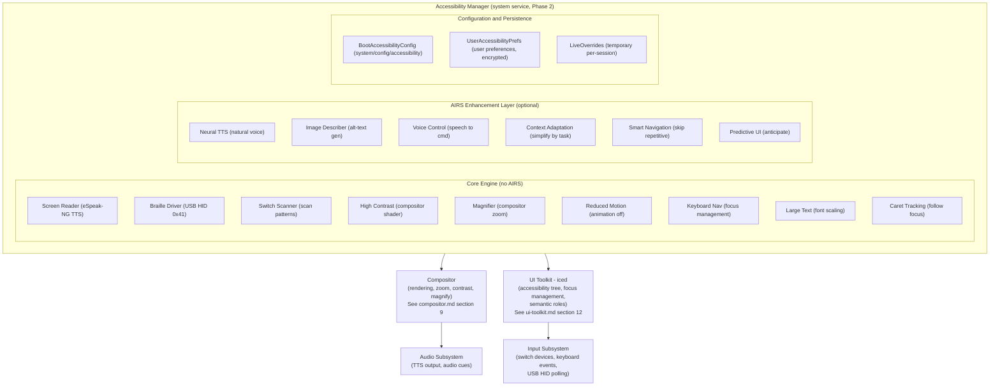

### 2.1 Accessibility Manager

The Accessibility Manager is a system service started during boot Phase 2, before the identity unlock screen. It coordinates all accessibility features and serves as the single point of contact for other services that need accessibility state.

```rust
pub struct AccessibilityManager {
    /// Boot-time config, loaded before identity unlock
    boot_config: BootAccessibilityConfig,

    /// User preferences, loaded after identity unlock
    user_prefs: Option<UserAccessibilityPrefs>,

    /// Active features (union of boot_config and user_prefs)
    active: ActiveAccessibilityState,

    /// Screen reader engine
    screen_reader: ScreenReaderEngine,

    /// Braille display driver
    braille: Option<BrailleDriver>,

    /// Switch scanning engine
    switch_scanner: Option<SwitchScanEngine>,

    /// Magnification state
    magnifier: MagnifierState,

    /// AIRS enhancement layer (populated when AIRS becomes available)
    airs_layer: Option<AirsAccessibilityLayer>,

    /// IPC channel to compositor for rendering adjustments
    compositor_channel: IpcChannel,

    /// IPC channel for accessibility tree updates
    tree_channel: IpcChannel,
}

impl AccessibilityManager {
    /// Called during Phase 2 boot, before identity unlock.
    /// Reads BootAccessibilityConfig from system/config/accessibility.
    /// If no config exists (first boot), enters detection mode.
    pub fn init_boot(config_space: &Space) -> Self {
        let boot_config = match config_space.read("accessibility") {
            Ok(config) => deserialize::<BootAccessibilityConfig>(&config),
            Err(_) => BootAccessibilityConfig::detect_hardware(),
        };

        let mut mgr = Self::new(boot_config);
        mgr.activate_boot_features();
        mgr
    }

    /// Called after identity unlock when user preferences become available.
    /// Merges user preferences with boot config (user prefs take priority).
    pub fn apply_user_prefs(&mut self, prefs: UserAccessibilityPrefs) {
        self.user_prefs = Some(prefs);
        self.recalculate_active_state();
    }

    /// Called when AIRS becomes available (Phase 3).
    /// Enables AI-enhanced features if the user has opted in.
    pub fn attach_airs(&mut self, airs: AirsConnection) {
        self.airs_layer = Some(AirsAccessibilityLayer::new(airs));
        if self.active.neural_tts_preferred {
            self.screen_reader.upgrade_to_neural_tts();
        }
    }
}
```

### 2.2 Two-Phase Configuration

Accessibility configuration uses a two-phase model to handle the chicken-and-egg problem of needing accessibility before user preferences are available:

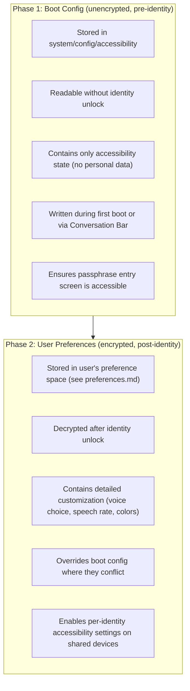

The boot config is intentionally minimal — booleans and a few numeric values. It stores no personal information and is unencrypted so the compositor can read it before identity unlock. The full user preferences are encrypted with everything else and loaded after authentication.

-----

## 3. Screen Reader

### 3.1 eSpeak-NG Integration

The screen reader is built on eSpeak-NG, a compact, multilingual text-to-speech engine compiled into the initramfs. This is the foundation that makes screen reading available from the first frame without AIRS, without network, and without any configuration.

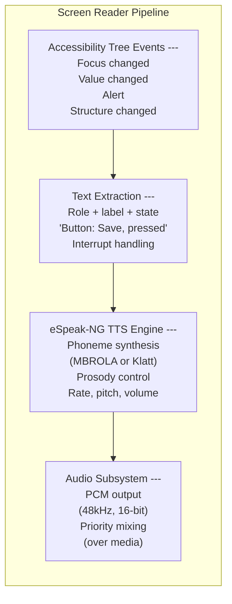

**Why eSpeak-NG:**

- **Size:** ~800 KiB compiled, fits in initramfs without meaningful size impact
- **Languages:** 100+ languages and variants, covering the vast majority of the world's population
- **No model required:** Rule-based synthesis, not neural — no ML model to load, no GPU, no AIRS
- **Latency:** < 10ms from text input to first audio sample — critical for responsive screen reading
- **Proven:** Used by NVDA (Windows), Orca (Linux), and dozens of embedded systems
- **License:** GPL v3 — compiled as a separate process communicating via IPC, keeping the BSD-licensed AIOS code clean

```rust
pub struct ScreenReaderEngine {
    /// eSpeak-NG process handle
    espeak: EspeakProcess,

    /// Speech queue with priority levels
    queue: SpeechQueue,

    /// Current speech rate (0.5 = half speed, 2.0 = double)
    rate: f32,

    /// Current voice variant
    voice: TtsVoice,

    /// Language for TTS output
    language: String,

    /// Whether to use neural TTS when AIRS is available
    neural_tts_preferred: bool,

    /// Neural TTS engine (populated when AIRS attaches)
    neural_engine: Option<NeuralTtsEngine>,
}

pub struct SpeechQueue {
    /// Items waiting to be spoken
    items: VecDeque<SpeechItem>,
}

pub struct SpeechItem {
    /// Text to speak
    text: String,

    /// Priority determines interruption behavior
    priority: SpeechPriority,

    /// Source of this speech item
    source: SpeechSource,
}

pub enum SpeechPriority {
    /// Interrupt everything, speak immediately (alerts, errors)
    Interrupt,

    /// Speak after current word finishes (focus changes)
    Next,

    /// Queue after current item (value changes, descriptions)
    Queued,

    /// Speak only if nothing else is pending (ambient info)
    Idle,
}

pub enum SpeechSource {
    FocusChange(AccessNodeId),
    ValueChange(AccessNodeId),
    Alert(String),
    UserAction(String),
    SystemStatus(String),
}
```

### 3.2 Text Extraction from Accessibility Tree

The screen reader does not read pixels. It reads the accessibility tree maintained by the compositor (see [compositor.md](../platform/compositor.md) §9.1) and populated by the UI toolkit (see [ui-toolkit.md](../applications/ui-toolkit.md) §12.1). Every widget has a semantic role, a label, and a state. The screen reader converts these into natural speech:

```rust
impl ScreenReaderEngine {
    /// Convert an accessibility node to spoken text.
    /// The output varies based on the node's role, state, and context.
    fn node_to_speech(&self, node: &AccessNode, event: &AccessibilityEvent) -> String {
        match event {
            AccessibilityEvent::FocusChanged { .. } => {
                let role_text = self.role_label(&node.role);
                let name = node.name.as_deref().unwrap_or("");
                let state = self.state_label(&node.state);

                // "Save, button"
                // "Username, text input, required"
                // "Enable notifications, checkbox, checked"
                format!("{name}, {role_text}{state}")
            }

            AccessibilityEvent::ValueChanged { value, .. } => {
                // "Volume, 75 percent"
                // "Search results, 3 items"
                format!("{}, {value}", node.name.as_deref().unwrap_or(""))
            }

            AccessibilityEvent::Alert { message } => {
                // Alerts are spoken immediately with distinct prosody
                format!("Alert: {message}")
            }

            AccessibilityEvent::WindowCreated { .. } => {
                format!("{} window opened", node.name.as_deref().unwrap_or("New"))
            }

            AccessibilityEvent::WindowDestroyed { .. } => {
                format!("{} window closed", node.name.as_deref().unwrap_or(""))
            }
        }
    }

    fn role_label(&self, role: &AccessRole) -> &str {
        match role {
            AccessRole::Button => "button",
            AccessRole::TextInput => "text input",
            AccessRole::Label => "",          // labels don't announce their role
            AccessRole::List => "list",
            AccessRole::ListItem => "",       // context from parent
            AccessRole::Checkbox => "checkbox",
            AccessRole::RadioButton => "radio button",
            AccessRole::Slider => "slider",
            AccessRole::Menu => "menu",
            AccessRole::MenuItem => "menu item",
            AccessRole::Tab => "tab",
            AccessRole::Dialog => "dialog",
            AccessRole::Alert => "alert",
            AccessRole::Image => "image",
            AccessRole::Link => "link",
            AccessRole::ScrollArea => "scroll area",
            // ... all WAI-ARIA roles
            _ => "",
        }
    }

    fn state_label(&self, state: &AccessState) -> String {
        let mut parts = Vec::new();
        if state.checked == Some(true) { parts.push("checked"); }
        if state.checked == Some(false) { parts.push("not checked"); }
        if state.expanded == Some(true) { parts.push("expanded"); }
        if state.expanded == Some(false) { parts.push("collapsed"); }
        if state.disabled { parts.push("disabled"); }
        if state.required { parts.push("required"); }
        if state.selected { parts.push("selected"); }
        if parts.is_empty() {
            String::new()
        } else {
            format!(", {}", parts.join(", "))
        }
    }
}
```

### 3.3 Earcons and Audio Cues

Beyond speech, the screen reader plays short audio cues (earcons) for common events. These are pre-rendered PCM samples stored in the initramfs (~50 KiB total):

| Event | Earcon | Purpose |
|---|---|---|
| Focus enters a group/region | Short ascending tone | Spatial orientation |
| Focus leaves a group/region | Short descending tone | Spatial orientation |
| Error or invalid action | Low double-beep | Feedback without interrupting speech |
| Successful action | Soft click | Confirmation |
| Link activation | Soft whoosh | Distinguishes navigation from activation |
| Window opened | Rising chime | Context change notification |
| Window closed | Falling chime | Context change notification |

Earcons are mixed at a lower volume than speech so they never obscure spoken content. They can be disabled via preferences.

-----

## 4. Braille Display Support

### 4.1 USB HID Braille Protocol

AIOS supports refreshable Braille displays via the USB HID Braille usage page (0x41), standardized in the USB HID specification. This means any display conforming to the HID Braille standard works without device-specific drivers.

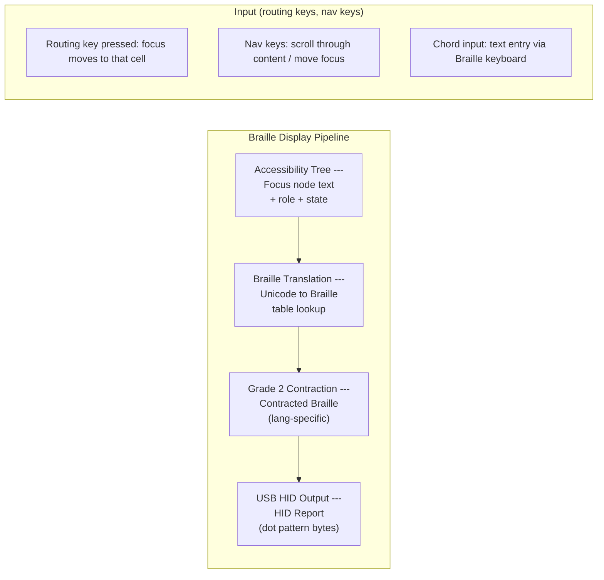

### 4.2 Braille Driver

```rust
pub struct BrailleDriver {
    /// USB HID device handle
    device: UsbHidDevice,

    /// Number of cells on the display (typically 14, 20, 40, or 80)
    cell_count: u8,

    /// Current display content (one byte per cell, 8-dot Braille)
    cells: Vec<u8>,

    /// Braille translation table (Unicode → dot patterns)
    table: BrailleTable,

    /// Grade (1 = uncontracted, 2 = contracted)
    grade: BrailleGrade,

    /// Language for contraction rules
    language: String,

    /// Cursor position on the display
    cursor_cell: u8,

    /// Text window offset (for content longer than display)
    pan_offset: usize,
}

pub enum BrailleGrade {
    /// One-to-one letter mapping, no contractions
    Grade1,
    /// Language-specific contractions (e.g., English Grade 2)
    Grade2,
    /// Computer Braille (8-dot, one-to-one for ASCII)
    Computer,
}

pub struct BrailleTable {
    /// Unicode codepoint → dot pattern mapping
    char_map: HashMap<char, u8>,
    /// Multi-character contraction rules (Grade 2)
    contractions: Vec<ContractionRule>,
}

pub struct ContractionRule {
    /// Text pattern to match (e.g., "the", "ing", "tion")
    pattern: String,
    /// Braille dot pattern for the contraction
    dots: Vec<u8>,
    /// Where this contraction can appear
    position: ContractionPosition,
}

pub enum ContractionPosition {
    Anywhere,
    WordBeginning,
    WordMiddle,
    WordEnding,
    Standalone,
}

impl BrailleDriver {
    /// Detect Braille display on USB bus.
    /// Called during boot Phase 2 hardware detection.
    pub fn detect(usb: &UsbSubsystem) -> Option<Self> {
        // HID usage page 0x41 = Braille Display
        let devices = usb.find_devices(UsbHidUsagePage::Braille);
        if let Some(device) = devices.first() {
            let cell_count = device.descriptor().braille_cell_count();
            Some(Self::new(device.clone(), cell_count))
        } else {
            None
        }
    }

    /// Update the Braille display with new content from the focused node.
    pub fn show_node(&mut self, node: &AccessNode) {
        let text = self.format_for_braille(node);
        let dots = self.translate(&text);
        self.write_cells(&dots);
    }

    /// Translate text to Braille dot patterns using the active table.
    fn translate(&self, text: &str) -> Vec<u8> {
        match self.grade {
            BrailleGrade::Grade1 => {
                text.chars()
                    .map(|c| self.table.char_map.get(&c).copied().unwrap_or(0))
                    .collect()
            }
            BrailleGrade::Grade2 => {
                self.table.contract(text, &self.language)
            }
            BrailleGrade::Computer => {
                text.bytes()
                    .map(|b| self.table.ascii_to_dots(b))
                    .collect()
            }
        }
    }

    /// Write dot patterns to the USB HID device.
    fn write_cells(&mut self, dots: &[u8]) {
        // Truncate or pad to cell_count
        let display_dots: Vec<u8> = dots.iter()
            .skip(self.pan_offset)
            .take(self.cell_count as usize)
            .copied()
            .collect();

        self.cells = display_dots.clone();

        // Send HID output report
        let report = HidOutputReport::braille_cells(&display_dots);
        self.device.send_report(&report);
    }

    /// Handle input from Braille display (routing keys, navigation).
    pub fn handle_input(&mut self, report: HidInputReport) -> BrailleAction {
        match report.usage() {
            BrailleUsage::RoutingKey(cell) => {
                BrailleAction::MoveCursorToCell(cell)
            }
            BrailleUsage::PanLeft => {
                self.pan_offset = self.pan_offset.saturating_sub(self.cell_count as usize);
                BrailleAction::Refresh
            }
            BrailleUsage::PanRight => {
                self.pan_offset += self.cell_count as usize;
                BrailleAction::Refresh
            }
            BrailleUsage::BrailleKeyboard(dots) => {
                BrailleAction::TextInput(self.table.dots_to_char(dots))
            }
            _ => BrailleAction::None,
        }
    }
}
```

### 4.3 Braille and Screen Reader Coordination

When both screen reader and Braille display are active, they operate in concert:

- **Focus changes** update both speech output and Braille display simultaneously
- **Braille routing keys** move the screen reader cursor (speech follows Braille)
- **Speech interruption** does not affect the Braille display (user can re-read at their pace)
- **Long content** is spoken in full but panned on the Braille display (user controls panning)

The user can configure the Braille display to show the current focus (track focus mode) or a specific area of the screen (fixed region mode). In track-focus mode, every focus change updates the Braille display. In fixed-region mode, the display shows a selected portion of the accessibility tree regardless of focus.

-----

## 5. Switch Scanning

### 5.1 Design Rationale

Switch scanning is an alternative input method for users who cannot use a keyboard, mouse, or touchscreen. The user operates one or more physical switches (buttons) connected via USB or Bluetooth. The system highlights UI elements one at a time (or in groups), and the user presses a switch to select the highlighted element.

This is the most constrained input method AIOS supports. A single-switch user has exactly one binary input. The entire OS must be navigable with that one button. This constraint drives the design of the scanning engine.

### 5.2 Scan Patterns

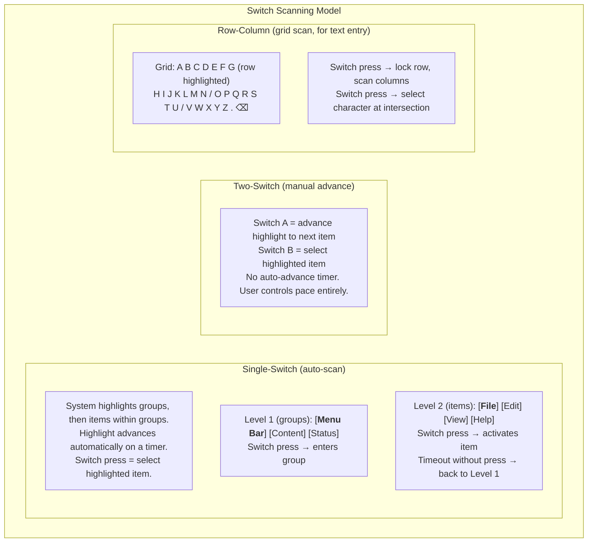

### 5.3 Switch Scan Engine

```rust
pub struct SwitchScanEngine {
    /// Current scan mode
    mode: ScanMode,

    /// Switch hardware configuration
    switches: SwitchConfig,

    /// Scan timing (auto-advance interval)
    scan_interval: Duration,

    /// Current scan state
    state: ScanState,

    /// Scan groups built from accessibility tree
    groups: Vec<ScanGroup>,

    /// Visual highlight style
    highlight: ScanHighlight,

    /// Audio feedback during scanning
    audio_feedback: bool,
}

pub enum ScanMode {
    /// One switch, auto-advancing highlight
    SingleSwitch {
        /// Time between automatic highlight advances
        interval: Duration,
        /// Number of full scans before exiting a group
        loops_before_exit: u8,
    },

    /// Two switches: advance + select
    TwoSwitch,

    /// Row-column grid scan for text entry
    RowColumn {
        interval: Duration,
    },
}

pub struct SwitchConfig {
    /// Switch devices (USB HID or keyboard keys)
    devices: Vec<SwitchDevice>,
    /// Debounce time (prevent double-activation from tremor)
    debounce: Duration,
    /// Long-press threshold (for secondary actions)
    long_press: Duration,
}

pub struct ScanState {
    /// Currently highlighted group index
    group_index: usize,
    /// Currently highlighted item within group
    item_index: Option<usize>,
    /// Scan level (group or item)
    level: ScanLevel,
    /// Timer for auto-advance
    timer: Timer,
    /// Loop counter (for auto-exit)
    loop_count: u8,
}

pub enum ScanLevel {
    /// Scanning across top-level groups
    Group,
    /// Scanning items within a selected group
    Item,
    /// Scanning characters in text entry grid
    Grid { row: usize, col: Option<usize> },
}

pub struct ScanGroup {
    /// Display name (for screen reader announcement)
    name: String,
    /// Items in this group
    items: Vec<ScanItem>,
    /// Bounding rectangle (for visual highlight)
    bounds: Rect,
}

pub struct ScanItem {
    /// The accessibility node this item represents
    node_id: AccessNodeId,
    /// Display label
    label: String,
    /// Action to perform when selected
    action: AccessAction,
    /// Bounding rectangle
    bounds: Rect,
}

impl SwitchScanEngine {
    /// Build scan groups from the accessibility tree.
    /// Groups UI into logical regions for efficient scanning.
    pub fn build_groups(&mut self, tree: &AccessibilityTree) {
        self.groups.clear();

        // Group 1: System controls (Status Strip)
        // Group 2: Navigation / Menu Bar
        // Group 3: Main content area
        // Group 4: Side panels (if present)
        // Group 5: Dialog (if open — takes priority)

        for region in tree.top_level_regions() {
            let items: Vec<ScanItem> = region
                .focusable_descendants()
                .map(|node| ScanItem {
                    node_id: node.id,
                    label: node.name.clone().unwrap_or_default(),
                    action: node.default_action(),
                    bounds: node.bounds,
                })
                .collect();

            if !items.is_empty() {
                self.groups.push(ScanGroup {
                    name: region.name.clone().unwrap_or_default(),
                    items,
                    bounds: region.bounds,
                });
            }
        }
    }

    /// Handle switch press event.
    pub fn switch_pressed(&mut self, switch: SwitchId) -> ScanAction {
        let now = Instant::now();

        match self.mode {
            ScanMode::SingleSwitch { .. } => {
                // Single switch: press always means "select current"
                self.select_current()
            }

            ScanMode::TwoSwitch => {
                match self.switches.role(switch) {
                    SwitchRole::Advance => self.advance(),
                    SwitchRole::Select => self.select_current(),
                }
            }

            ScanMode::RowColumn { .. } => {
                self.grid_select()
            }
        }
    }

    fn select_current(&mut self) -> ScanAction {
        match self.state.level {
            ScanLevel::Group => {
                // Enter the highlighted group
                self.state.level = ScanLevel::Item;
                self.state.item_index = Some(0);
                self.state.loop_count = 0;
                ScanAction::EnterGroup(self.state.group_index)
            }
            ScanLevel::Item => {
                // Activate the highlighted item
                let group = &self.groups[self.state.group_index];
                let item = &group.items[self.state.item_index.unwrap()];
                ScanAction::Activate(item.node_id, item.action.clone())
            }
            ScanLevel::Grid { row, col } => {
                if col.is_none() {
                    // Lock the row, start scanning columns
                    self.state.level = ScanLevel::Grid { row, col: Some(0) };
                    ScanAction::LockRow(row)
                } else {
                    // Select the character
                    ScanAction::GridSelect(row, col.unwrap())
                }
            }
        }
    }

    fn advance(&mut self) -> ScanAction {
        match self.state.level {
            ScanLevel::Group => {
                self.state.group_index =
                    (self.state.group_index + 1) % self.groups.len();
                ScanAction::HighlightGroup(self.state.group_index)
            }
            ScanLevel::Item => {
                let group = &self.groups[self.state.group_index];
                let next = (self.state.item_index.unwrap() + 1) % group.items.len();
                self.state.item_index = Some(next);
                ScanAction::HighlightItem(self.state.group_index, next)
            }
            ScanLevel::Grid { row, col } => {
                // Advance in grid
                ScanAction::HighlightGridCell(row, col.map(|c| c + 1).unwrap_or(0))
            }
        }
    }
}
```

### 5.4 Switch Hardware Detection

Switch access devices are detected during boot via USB HID enumeration. Common switch interfaces present as HID devices with specific usage pages. Additionally, keyboard keys can be mapped as switches for users who can press one or two specific keys but cannot use a full keyboard.

```rust
impl SwitchScanEngine {
    /// Detect connected switch devices.
    /// Falls back to keyboard-as-switch if no dedicated hardware found.
    pub fn detect(
        usb: &UsbSubsystem,
        keyboard: &InputSubsystem,
    ) -> Option<SwitchConfig> {
        // Check for dedicated switch interfaces
        let hid_switches = usb.find_devices(UsbHidUsagePage::Switch);

        if !hid_switches.is_empty() {
            return Some(SwitchConfig::from_hid(hid_switches));
        }

        // Check for switch-mode keyboard request (F8 held at boot)
        if keyboard.key_held(Key::F8) {
            // Space bar = switch A, Enter = switch B
            return Some(SwitchConfig::keyboard_fallback());
        }

        None
    }
}
```

-----

## 6. High Contrast and Magnification

### 6.1 Compositor-Level Rendering

High contrast and magnification are implemented at the compositor level, not in individual widgets. This means they work for every surface — including agents that don't explicitly support accessibility, legacy POSIX applications, and the browser. The compositor applies these as post-processing passes on the final composited frame.

```rust
pub struct HighContrastConfig {
    /// Active contrast scheme
    scheme: ContrastScheme,
    /// Minimum contrast ratio (WCAG AA = 4.5:1, AAA = 7:1)
    min_ratio: f32,
}

pub enum ContrastScheme {
    /// System default (meets WCAG AA)
    Default,
    /// White text on black background
    WhiteOnBlack,
    /// Black text on white background
    BlackOnWhite,
    /// Yellow text on black background (lower eye strain)
    YellowOnBlack,
    /// Green text on black background
    GreenOnBlack,
    /// Custom foreground/background colors
    Custom { foreground: Color, background: Color },
}

pub struct MagnifierState {
    /// Whether magnification is active
    enabled: bool,

    /// Magnification level (1.0 = no magnification)
    zoom: f32,

    /// Magnification mode
    mode: MagnificationMode,

    /// Tracking behavior
    tracking: MagnificationTracking,

    /// Smooth scrolling for magnifier movement
    smooth: bool,
}

pub enum MagnificationMode {
    /// Entire screen is magnified (zoom + pan)
    FullScreen,

    /// Magnified lens follows the cursor/focus
    Lens {
        width: u32,
        height: u32,
    },

    /// Top or bottom half shows magnified view of focus area
    SplitScreen {
        position: SplitPosition,
    },
}

pub enum MagnificationTracking {
    /// Magnifier follows the mouse cursor
    Cursor,
    /// Magnifier follows keyboard/screen reader focus
    Focus,
    /// Magnifier follows both (whichever moved last)
    CursorAndFocus,
}

impl Compositor {
    /// Apply high contrast post-processing to the composited frame.
    /// This is a GPU shader pass that remaps colors.
    fn apply_high_contrast(&self, frame: &mut RenderTarget, config: &HighContrastConfig) {
        match config.scheme {
            ContrastScheme::Default => {} // no-op
            ContrastScheme::WhiteOnBlack => {
                self.gpu.apply_shader(frame, &self.shaders.invert_luminance);
            }
            ContrastScheme::Custom { foreground, background } => {
                self.gpu.apply_shader(
                    frame,
                    &self.shaders.remap_contrast(foreground, background),
                );
            }
            _ => {
                self.gpu.apply_shader(
                    frame,
                    &self.shaders.contrast_remap(&config.scheme),
                );
            }
        }
    }

    /// Apply magnification to the composited frame.
    fn apply_magnification(&self, frame: &mut RenderTarget, state: &MagnifierState) {
        if !state.enabled || state.zoom <= 1.0 {
            return;
        }

        let focus_point = match state.tracking {
            MagnificationTracking::Cursor => self.cursor_position(),
            MagnificationTracking::Focus => self.focused_node_center(),
            MagnificationTracking::CursorAndFocus => self.last_moved_point(),
        };

        match state.mode {
            MagnificationMode::FullScreen => {
                // Viewport is (1/zoom) of the full screen, centered on focus
                let viewport = self.zoom_viewport(focus_point, state.zoom);
                self.gpu.render_zoomed(frame, viewport, state.smooth);
            }
            MagnificationMode::Lens { width, height } => {
                // Render magnified region into a floating rectangle
                let lens_rect = Rect::centered(focus_point, width, height);
                self.gpu.render_lens(frame, lens_rect, state.zoom);
            }
            MagnificationMode::SplitScreen { position } => {
                let (mag_region, source_region) =
                    self.split_regions(position, focus_point, state.zoom);
                self.gpu.render_split(frame, mag_region, source_region, state.zoom);
            }
        }
    }
}
```

### 6.2 Large Text

Large text mode scales all text by 2x (configurable from 1.25x to 4x). This is implemented in the UI toolkit's theme system rather than the compositor, so layout reflows correctly. Widgets rearrange to accommodate larger text rather than simply scaling pixels.

```rust
impl Theme {
    /// Apply large text scaling to all font sizes in the theme.
    pub fn with_text_scale(mut self, scale: f32) -> Self {
        self.font_size_body = (self.font_size_body as f32 * scale) as u16;
        self.font_size_heading = (self.font_size_heading as f32 * scale) as u16;
        self.font_size_caption = (self.font_size_caption as f32 * scale) as u16;
        self.font_size_label = (self.font_size_label as f32 * scale) as u16;

        // Increase spacing proportionally
        self.spacing = (self.spacing as f32 * scale.sqrt()) as u16;
        self.padding = (self.padding as f32 * scale.sqrt()) as u16;

        self
    }
}
```

### 6.3 Reduced Motion

When reduced motion is enabled, the compositor disables or reduces all animations:

- **Context transitions** (Work to Leisure) become instant cuts instead of 300ms fades
- **Window open/close** has no animation
- **Scroll** is immediate, no inertia
- **Focus indicators** do not animate (static highlight instead of pulsing)
- **Flow Tray** items appear without slide-in animation

```rust
pub struct ReducedMotionConfig {
    /// Completely disable all animations
    disable_all: bool,
    /// If not disabling all, reduce animation duration to this fraction
    duration_fraction: f32,   // e.g., 0.25 = 25% of normal duration
    /// Disable parallax and scroll effects
    disable_parallax: bool,
    /// Disable auto-playing video/GIF
    disable_autoplay: bool,
}
```

-----

## 7. Voice Control

### 7.1 Speech-to-Command Pipeline

Voice control allows users to control the OS and applications entirely by voice. It operates in two tiers: basic command recognition (without AIRS) and full natural language control (with AIRS).

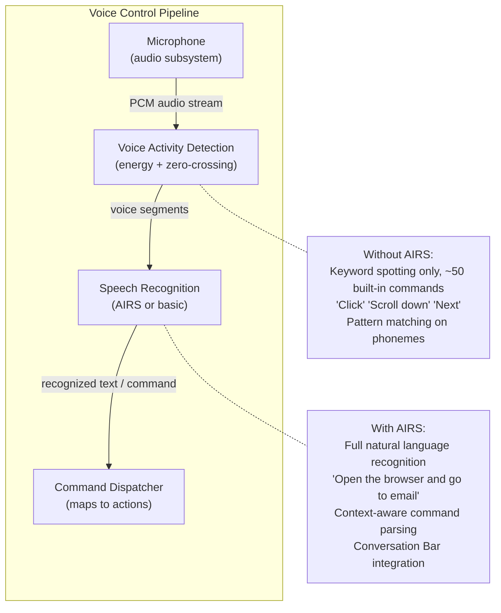

### 7.2 Basic Command Recognition (No AIRS)

Without AIRS, voice control uses a lightweight keyword spotter. This is not full speech recognition — it matches a fixed vocabulary of ~50 commands using phoneme templates stored in the initramfs.

```rust
pub struct BasicVoiceControl {
    /// Keyword spotter (phoneme pattern matching)
    spotter: KeywordSpotter,

    /// Built-in command vocabulary
    commands: Vec<VoiceCommand>,

    /// Whether voice control is actively listening
    listening: bool,

    /// Wake word to begin listening (default: "Computer")
    wake_word: String,
}

pub struct VoiceCommand {
    /// Spoken phrase (phoneme pattern)
    phrase: PhonemePattern,

    /// Display text (for confirmation)
    display: String,

    /// Action to perform
    action: VoiceAction,
}

pub enum VoiceAction {
    // Navigation
    Click,
    DoubleClick,
    ScrollUp,
    ScrollDown,
    NextItem,
    PreviousItem,
    Enter,
    Escape,
    Tab,
    BackTab,

    // Window management
    CloseWindow,
    MinimizeWindow,
    MaximizeWindow,
    SwitchWindow,

    // Screen reader control
    StopSpeaking,
    RepeatLast,
    SpeakAll,
    SpellWord,

    // System
    OpenConversationBar,
    GoHome,
    ShowNotifications,
    LockScreen,

    // Grid overlay for mouse control
    ShowGrid,
    GridNumber(u32),
}
```

### 7.3 Grid Overlay for Mouse Control by Voice

For users who need pixel-level cursor control via voice, the compositor can display a numbered grid overlay. The user says a grid number to move the cursor to that region, then a sub-grid appears for finer positioning:

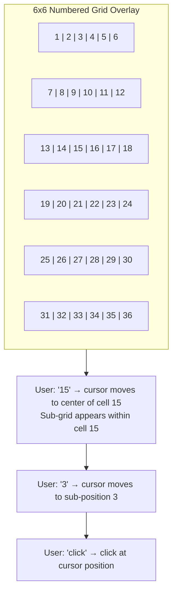

This is a fallback for interactions that cannot be reached through the accessibility tree. Well-designed agents should never require it — all interactive elements should be in the accessibility tree with keyboard focus support.

-----

## 8. Boot-Time Accessibility

### 8.1 First Frame Guarantee

The first frame displayed by AIOS is accessible. This is not aspirational — it is an architectural requirement enforced by the boot sequence. The compositor reads `system/config/accessibility` during Phase 2 (before identity unlock) and applies all configured features before rendering anything to the display.

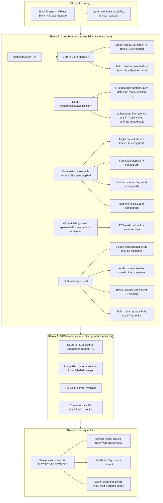

### 8.2 First-Boot Detection Mode

On the very first boot, no accessibility configuration exists. The system must detect whether the user needs accessibility features without requiring them to navigate a settings menu. This is handled by the accessibility detection step described in [lifecycle.md](../kernel/boot/lifecycle.md) §19.1:

```rust
impl BootAccessibilityConfig {
    /// Hardware detection for first boot.
    /// Runs before any UI is displayed.
    pub fn detect_hardware() -> Self {
        let mut config = Self::default();

        // Check USB for assistive devices
        if usb_has_braille_display() {
            config.braille_display = true;
            config.screen_reader = true;   // Braille users typically also want speech
        }

        if usb_has_switch_device() {
            config.switch_access = true;
        }

        // Check for held keys (user pressing F5/F6/F7 during boot)
        if keyboard_held(Key::F5) {
            config.screen_reader = true;
        }
        if keyboard_held(Key::F6) {
            config.high_contrast = true;
        }
        if keyboard_held(Key::F7) {
            config.large_text = true;
        }

        config
    }
}
```

The first frame always displays the accessibility options prompt in large, high-contrast text (24pt, white on dark background) regardless of configuration. This ensures the prompt is readable even for users with moderate vision impairment who haven't yet enabled accessibility:

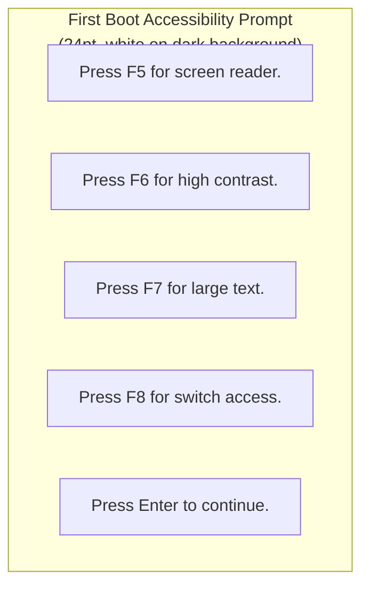

If a screen reader is already active (F5 was held during boot, or a Braille display was detected), this prompt is spoken aloud.

### 8.3 Accessibility Persistence

Once set, accessibility configuration persists across reboots without requiring identity unlock. The config is stored unencrypted in `system/config/accessibility` — it contains no personal data, only feature flags and basic parameters.

```rust
/// Boot-time accessibility config.
/// Stored unencrypted — must be readable before identity unlock.
/// See boot/accessibility.md §19.3 for the full struct.
pub struct BootAccessibilityConfig {
    screen_reader: bool,
    high_contrast: bool,
    large_text: bool,
    reduced_motion: bool,
    braille_display: bool,
    switch_access: bool,
    magnification: bool,
    magnification_level: f32,
    tts_voice: TtsVoice,           // eSpeak variant
    tts_rate: f32,                 // speech rate multiplier (0.5 - 3.0)
    tts_pitch: f32,                // pitch multiplier (0.5 - 2.0)
    tts_volume: f32,               // volume (0.0 - 1.0)
    preferred_language: String,     // for TTS
    contrast_scheme: ContrastScheme,
    scan_mode: Option<ScanMode>,
    scan_interval_ms: u32,         // auto-scan timing
}
```

This config is separate from the user's encrypted preference space. After identity unlock, the Preference Service (see [preferences.md](../intelligence/preferences.md)) loads richer accessibility preferences that can override boot config values. The boot config is the minimum viable state that ensures accessibility is active before anything else.

-----

## 9. Accessibility Tree

### 9.1 Architecture

The accessibility tree is the central data structure that connects assistive technology to the UI. It is a parallel representation of the visual UI, carrying semantic information rather than pixel data. The tree is built from three sources:

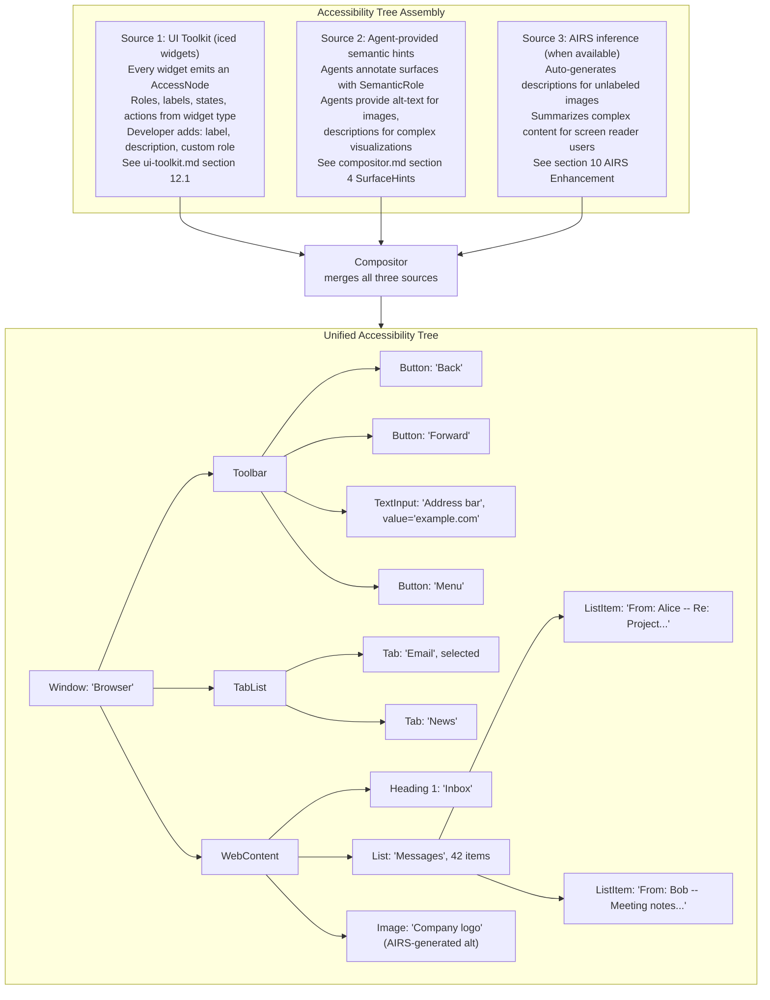

### 9.2 Tree Protocol

The accessibility tree is communicated from agents to the compositor via IPC. Each agent maintains its own subtree and sends updates when the UI changes:

```rust
/// Messages from agents to the Accessibility Manager
pub enum AccessTreeUpdate {
    /// Full tree replacement (on surface creation or major UI change)
    SetTree {
        surface: SurfaceId,
        root: AccessNode,
    },

    /// Incremental update (node changed)
    UpdateNode {
        surface: SurfaceId,
        node_id: AccessNodeId,
        changes: AccessNodeDelta,
    },

    /// Node added to tree
    InsertNode {
        surface: SurfaceId,
        parent: AccessNodeId,
        index: usize,
        node: AccessNode,
    },

    /// Node removed from tree
    RemoveNode {
        surface: SurfaceId,
        node_id: AccessNodeId,
    },

    /// Focus moved to a node
    SetFocus {
        surface: SurfaceId,
        node_id: AccessNodeId,
    },
}

pub struct AccessNodeDelta {
    name: Option<String>,
    description: Option<String>,
    value: Option<String>,
    state: Option<AccessState>,
    bounds: Option<Rect>,
}

pub struct AccessState {
    pub checked: Option<bool>,      // for checkboxes, radio buttons
    pub expanded: Option<bool>,     // for collapsible sections
    pub selected: bool,
    pub disabled: bool,
    pub required: bool,
    pub readonly: bool,
    pub busy: bool,                 // loading state
    pub live_region: Option<LiveRegion>,  // for dynamic content
}

pub enum LiveRegion {
    /// Polite: announce when idle (e.g., search result count)
    Polite,
    /// Assertive: announce immediately (e.g., error messages)
    Assertive,
    /// Off: do not announce changes
    Off,
}
```

### 9.3 Agent Developer Requirements

The UI toolkit handles most accessibility automatically. When a developer creates a button with text, the accessibility tree automatically contains a Button node with the text as its label. However, some cases require explicit developer annotation:

```rust
// Good: label is automatic from text content
button("Save Document").on_press(Message::Save)
// Accessibility tree: Button { label: "Save Document", action: Click }

// Good: image with alt text
image(handle).alt("Pie chart showing 60% complete")
// Accessibility tree: Image { label: "Pie chart showing 60% complete" }

// Bad: icon button without label — screen reader says "button"
button(icon(Icon::Save)).on_press(Message::Save)

// Fixed: icon button with accessible label
button(icon(Icon::Save))
    .on_press(Message::Save)
    .accessible_label("Save Document")
// Accessibility tree: Button { label: "Save Document", action: Click }

// Custom widget with explicit accessibility
canvas(|frame| { /* custom drawing */ })
    .accessible_role(AccessRole::Image)
    .accessible_label("Network traffic graph")
    .accessible_description("Line graph showing inbound and outbound traffic over the last hour")
```

The SDK linter (run via `aios agent audit`) warns about accessibility issues: icon buttons without labels, images without alt text, custom widgets without roles. Agents published to the Agent Store must pass the accessibility audit.

-----

## 10. AIRS Enhancement

When AIRS is available, every accessibility feature improves. But every feature works without AIRS first — AIRS makes it better, not possible.

### 10.1 Enhancement Matrix

| Feature | Without AIRS | With AIRS |
|---|---|---|
| Text-to-speech | eSpeak-NG (robotic, fast) | Neural TTS (natural voice, configurable) |
| Image descriptions | Developer-provided alt text only | Auto-generated descriptions for unlabeled images |
| Voice control | ~50 fixed commands, keyword spotting | Full natural language, context-aware |
| UI navigation | Standard focus order | Smart navigation: skip repetitive elements, predict next action |
| Content summaries | None (full content read) | "This page has 42 messages. 3 are unread. The most recent is from Alice about the project deadline." |
| Error messages | Literal error text | "The file couldn't be saved because the disk is full. You have 3 large files in Downloads that could be deleted." |
| Form assistance | Field labels and types | "This form asks for your shipping address. There are 6 fields. You've filled in 2." |
| Context adaptation | Static accessibility settings | Simplify UI when user is struggling (detected from interaction patterns) |

### 10.2 Neural TTS

When AIRS loads, the screen reader can upgrade from eSpeak-NG to a neural TTS model. The upgrade is seamless — the screen reader engine swaps its output backend without interrupting the speech queue.

```rust
pub struct NeuralTtsEngine {
    /// AIRS inference session for TTS
    session: AirsInferenceSession,

    /// TTS model (loaded as part of AIRS model registry)
    model: ModelRef,

    /// Voice configuration
    voice: NeuralVoice,

    /// Streaming output (starts speaking before full synthesis completes)
    streaming: bool,
}

impl NeuralTtsEngine {
    /// Synthesize speech from text.
    /// Returns a stream of PCM audio chunks for immediate playback.
    pub async fn synthesize(&self, text: &str) -> AudioStream {
        let tokens = self.session.tokenize(text).await;
        let audio = self.session.infer_streaming(
            &self.model,
            &tokens,
            InferenceHints {
                voice: self.voice.clone(),
                streaming: self.streaming,
            },
        ).await;
        audio
    }
}

impl ScreenReaderEngine {
    /// Upgrade from eSpeak-NG to neural TTS.
    /// Fallback remains available if neural TTS fails.
    pub fn upgrade_to_neural_tts(&mut self) {
        if let Some(ref airs_layer) = self.neural_engine {
            // Neural TTS becomes primary, eSpeak-NG becomes fallback
            // If neural TTS latency exceeds 200ms, fall back to eSpeak
            self.primary_engine = TtsEngine::Neural;
            self.fallback_engine = TtsEngine::EspeakNg;
        }
    }
}
```

The user is never forced to use neural TTS. Some users prefer eSpeak-NG's robotic voice because it's faster, more predictable, and they've developed muscle memory for its cadence. The preference is respected.

### 10.3 AI Image Description

When an agent's accessibility tree contains an image without alt text, and AIRS is available, the Accessibility Manager can request an AI-generated description:

```rust
impl AirsAccessibilityLayer {
    /// Generate a description for an image that lacks alt text.
    pub async fn describe_image(
        &self,
        image_data: &[u8],
        context: &ImageContext,
    ) -> Result<String> {
        let prompt = format!(
            "Describe this image concisely for a screen reader user. \
             Context: this image appears in {} with the heading '{}'. \
             Focus on information content, not visual aesthetics.",
            context.surface_title,
            context.nearest_heading.as_deref().unwrap_or("unknown"),
        );

        let description = self.airs.infer(
            ModelTask::ImageDescription,
            &prompt,
            Some(image_data),
        ).await?;

        Ok(description)
    }
}
```

AI-generated descriptions are cached in the accessibility tree so they're not regenerated on every focus change. They're also marked as AI-generated so the user can request re-description or dismiss them.

### 10.4 Context-Aware UI Adaptation

AIRS can observe interaction patterns and adapt the UI for accessibility users:

- **Repeated failed interactions** (e.g., clicking the wrong button multiple times) trigger increased target sizes and spacing
- **Slow navigation** through complex menus triggers simplified menu presentation
- **Frequent use of "repeat"** suggests speech is too fast or content is too complex — adjusts automatically
- **Time-of-day patterns** adjust contrast and brightness automatically (brighter during day, dimmer at night)

All adaptations are transparent to the user and can be disabled. The system tells the user what it changed and why: "I noticed you're having trouble with the small buttons. I've made them larger. You can undo this by saying 'reset button size.'"

-----

## 11. No-AIRS Fallback

Every accessibility feature works without AIRS. This section documents the specific fallback behavior for each AIRS-enhanced feature.

### 11.1 Fallback Specifications

```
Fallback behavior when AIRS is unavailable.
These are not degraded-mode afterthoughts — they are complete,
usable implementations that happen to be less sophisticated.

AirsFallback::TextToSpeech
    engine:     EspeakNg
    quality:    Robotic but clear, <10ms latency
    coverage:   100+ languages

AirsFallback::ImageDescription
    behavior:   Only developer-provided alt text shown
    missing:    Screen reader says 'image' with no description

AirsFallback::VoiceControl
    vocabulary:  ~50 fixed commands
    recognition: Phoneme pattern matching, no language model
    wake_word:   Required — 'Computer' by default

AirsFallback::ContentSummary
    behavior:    Screen reader reads all content linearly
    workaround:  User can use heading navigation to skip sections

AirsFallback::SmartNavigation
    behavior:    Tab order follows widget hierarchy
    workaround:  User uses landmark navigation (jump to heading, list, form)

AirsFallback::ContextAdaptation
    behavior:    Accessibility settings remain fixed
    workaround:  User manually adjusts via Conversation Bar or preferences
```

### 11.2 Graceful Degradation at Runtime

If AIRS goes down while the user is actively using AI-enhanced accessibility features, the Accessibility Manager falls back without interruption:

```rust
impl AccessibilityManager {
    /// Handle AIRS disconnection at runtime.
    /// Switch all features to non-AIRS mode immediately.
    pub fn airs_disconnected(&mut self) {
        // Switch TTS back to eSpeak-NG mid-sentence if needed
        if self.screen_reader.primary_engine == TtsEngine::Neural {
            self.screen_reader.primary_engine = TtsEngine::EspeakNg;
            self.screen_reader.speak(
                "AI voice temporarily unavailable. Using standard voice.",
                SpeechPriority::Next,
            );
        }

        // Voice control reverts to keyword spotter
        if let Some(ref mut voice) = self.voice_control {
            voice.mode = VoiceControlMode::KeywordOnly;
            self.screen_reader.speak(
                "Voice control: basic commands only.",
                SpeechPriority::Queued,
            );
        }

        // Clear cached AI descriptions
        self.airs_layer = None;

        // No disruption to: screen reader, Braille, switch scanning,
        // high contrast, magnification, keyboard navigation, reduced motion
    }
}
```

The key invariant: **no accessibility feature becomes unavailable when AIRS disconnects.** Quality may decrease (robotic voice instead of natural, no image descriptions), but functionality remains complete.

-----

## 12. Implementation Order

Accessibility is not a single phase. It is woven through the development plan from Phase 6 (compositor) through Phase 23 (polish). The principle is: build the infrastructure early, add features incrementally, polish last.

```mermaid
flowchart TD
    P6["Phase 6: Compositor Foundation"]
    P6a["Accessibility tree data structure (AccessNode, AccessRole)"]
    P6b["High contrast shader (white-on-black, applied at compositor)"]
    P6c["Large text support in theme system"]
    P6d["Reduced motion flag (animations respect it)"]
    P6e["Focus indicator rendering (always visible)"]
    P6f["Keyboard focus management (Tab, Enter, Escape, Arrows)"]
    P6 --> P6a & P6b & P6c & P6d & P6e & P6f

    P8["Phase 8: AIRS Integration"]
    P8a["Image description API (for later use by accessibility)"]
    P8 --> P8a

    P9["Phase 9: Experience Layer"]
    P9a["Accessibility options in first-boot flow"]
    P9b["BootAccessibilityConfig persistence"]
    P9c["Conversation Bar: 'turn on screen reader' works"]
    P9 --> P9a & P9b & P9c

    P17["Phase 17: USB Stack"]
    P17a["USB HID Braille display detection and driver"]
    P17b["USB HID switch device detection"]
    P17 --> P17a & P17b

    P20["Phase 20: UI Toolkit Accessibility / Portable UI Toolkit (iced)"]
    P20a["All widgets emit AccessNode automatically"]
    P20b["AccessRole for every standard widget"]
    P20c["Accessible label / description API for developers"]
    P20d["Agent audit: warn on missing labels"]
    P20e["Keyboard navigation: Tab order, arrow key nav"]
    P20f["Accessibility tree generation from iced widget hierarchy"]
    P20g["Cross-platform a11y: AT-SPI2 (Linux), NSAccessibility (macOS)"]
    P20h["Focus management in iced backend"]
    P20 --> P20a & P20b & P20c & P20d & P20e & P20f & P20g & P20h

    P22["Phase 22: Audio Subsystem"]
    P22a["eSpeak-NG integration (IPC to GPL process)"]
    P22b["TTS audio output pipeline (priority mixing)"]
    P22c["Earcon playback"]
    P22d["Voice activity detection for voice control"]
    P22 --> P22a & P22b & P22c & P22d

    P23["Phase 23: Accessibility Polish"]
    P23a["Full screen reader with text extraction"]
    P23b["Braille display: Grade 1, Grade 2, Computer Braille"]
    P23c["Switch scanning: single-switch, two-switch, row-column"]
    P23d["Magnification: full-screen, lens, split-screen"]
    P23e["Voice control: keyword spotter (no AIRS)"]
    P23f["Voice control: full NLU (with AIRS)"]
    P23g["Neural TTS integration (with AIRS)"]
    P23h["AI image description (with AIRS)"]
    P23i["Context-aware UI adaptation (with AIRS)"]
    P23j["Grid overlay for voice mouse control"]
    P23k["WCAG AA compliance audit"]
    P23l["SDK accessibility linter"]
    P23m["Accessibility testing suite"]
    P23 --> P23a & P23b & P23c & P23d & P23e & P23f & P23g & P23h & P23i & P23j & P23k & P23l & P23m

    P6 --> P8 --> P9 --> P17 --> P20 --> P22 --> P23
```

**Why accessibility infrastructure starts in Phase 6:** Retrofitting accessibility into a finished compositor is much harder than building it in from the start. The accessibility tree, focus management, and keyboard navigation are structural — they must be designed into the widget hierarchy and compositor protocol, not bolted on afterward. By Phase 23, the infrastructure exists; the work is features, polish, and compliance testing.

-----

## 13. Design Principles

1. **Accessibility from the first frame.** A user with a disability must be able to complete first boot independently. No accessibility feature requires AIRS, network, or user preferences to function. The passphrase entry screen is accessible before the user has authenticated.

2. **AI makes it better, not possible.** Every accessibility feature works without AIRS. Neural TTS, image description, and smart navigation are enhancements. eSpeak-NG, developer alt text, and standard focus order are the baseline. If AIRS never loads, accessibility is complete.

3. **No special mode.** Accessibility features are always available, not gated behind a "turn on accessibility" toggle. High contrast is a theme. Large text is a font size. Keyboard navigation works for everyone. The screen reader is a service, not an application.

4. **Structural, not annotated.** The accessibility tree is generated from the widget hierarchy, not annotated after the fact. If a widget exists, it is accessible. Developers add labels and descriptions; they do not build a separate accessibility layer.

5. **The most constrained input drives the design.** A single-switch user has one binary input. If the OS is navigable with one button, it is navigable with everything else. Switch scanning is not an afterthought — it is a design constraint that validates the entire input architecture.

6. **Earcons, not just speech.** Audio cues supplement speech for spatial orientation, confirmation, and error feedback. They are short, distinct, and never obscure spoken content. They can be disabled.

7. **Braille is a first-class output.** Braille is not a text dump of speech output. The Braille driver formats content appropriately — contracted Braille for reading, computer Braille for code, Grade 1 for unfamiliar languages. Routing keys and navigation are fully supported.

8. **Performance is an accessibility feature.** A slow screen reader is an unusable screen reader. eSpeak-NG delivers < 10ms latency from event to first audio sample. The accessibility tree uses incremental updates, not full rebuilds. Switch scanning timers are precise to prevent missed inputs.

9. **The user's preferences are sacred.** If the user prefers eSpeak-NG over neural TTS, the system respects this. If the user sets a specific speech rate, scan interval, or contrast scheme, no AI adaptation overrides it without explicit consent. Adaptations are suggestions, not mandates.

10. **Testing is mandatory, not aspirational.** The SDK accessibility linter runs on every agent build. The accessibility test suite includes automated screen reader output verification, focus order validation, contrast ratio checking, and switch scan reachability testing. Agents in the Agent Store must pass the accessibility audit.
