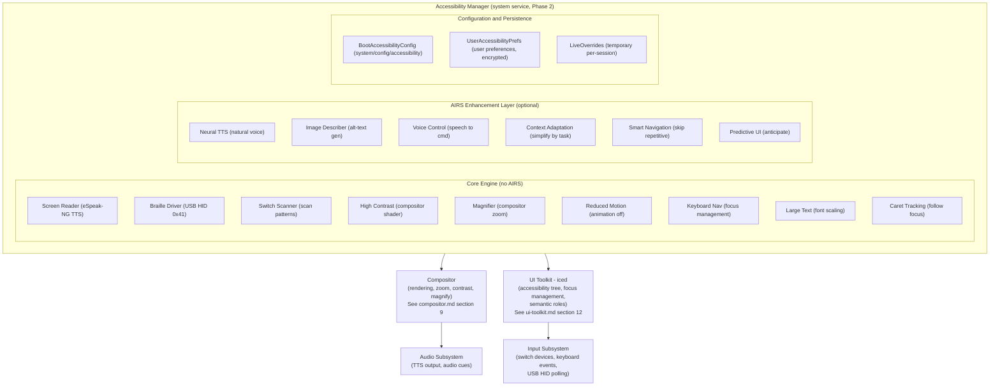
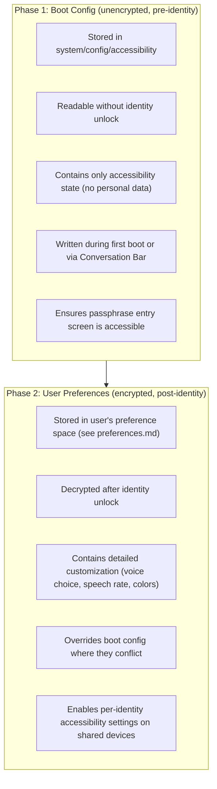

# AIOS Accessibility Engine

## Deep Technical Architecture

**Parent document:** [architecture.md](../project/architecture.md) — Section 7.6 Accessibility
**Related:** [experience.md](./experience.md) — Experience layer surfaces, [compositor.md](../platform/compositor.md) — Compositor accessibility layer and rendering, [ui-toolkit.md](../applications/ui-toolkit.md) — Widget accessibility tree and keyboard navigation, [airs.md](../intelligence/airs.md) — AI-enhanced descriptions and voice control, [accessibility.md](../kernel/boot/accessibility.md) — Boot accessibility (§19), [airs/intelligence-services.md](../intelligence/airs/intelligence-services.md) — Intelligence services, [compositor/security.md](../platform/compositor/security.md) — Compositor accessibility (§11), [privacy.md](../security/privacy.md) — Privacy architecture, [input/ai.md](../platform/input/ai.md) — Input AI-native intelligence

-----

## Document Map

| Document | Sections | Content |
|---|---|---|
| **This file** | §1, §2, §12, §13 | Overview, architecture, implementation order, design principles |
| [assistive-technology.md](./accessibility/assistive-technology.md) | §3, §4, §5, §6, §7 | Screen reader (eSpeak-NG), Braille display, switch scanning, high contrast/magnification, voice control |
| [system-integration.md](./accessibility/system-integration.md) | §8, §9 | Boot-time accessibility, accessibility tree |
| [ai-enhancement.md](./accessibility/ai-enhancement.md) | §10, §11 | AIRS enhancement matrix, no-AIRS fallback specifications |
| [intelligence.md](./accessibility/intelligence.md) | §14, §15, §17 | Kernel-internal ML, AIRS-dependent intelligence, future directions |
| [testing.md](./accessibility/testing.md) | §16 | Testing strategy, WCAG validation, adversarial testing |
| [security.md](./accessibility/security.md) | §18, §19 | Security and privacy, cross-reference index |

-----

## 1. Overview

Traditional operating systems treat accessibility as a bolt-on — a settings panel you enable after setup, a screen reader installed as a third-party application, a high-contrast theme buried in display preferences. This means a blind user cannot set up the computer without sighted assistance. A user with motor impairment cannot navigate a first-boot wizard designed for mouse and keyboard. Accessibility is an afterthought, and it shows.

AIOS inverts this. Accessibility is a **first-class system service** — loaded before the identity unlock screen, before AIRS, before user preferences exist. Every accessibility feature that doesn't require AI works from the first frame of the first boot. No network. No configuration. No sighted assistance. A user with any disability can complete first boot independently.

**Core design principle:** "Accessibility from the first frame. A user with a disability must be able to complete first boot independently. No accessibility feature requires AIRS, network, or user preferences to function."

**What AIOS provides:**

| Feature | AIRS Required? | Available From |
|---|---|---|
| High contrast mode | No | First frame |
| Large text (2x font scaling) | No | First frame |
| Screen reader (eSpeak-NG TTS) | No | First frame (initramfs) |
| Braille display output | No | First frame (USB HID) |
| Switch scanning (1-switch, 2-switch) | No | First frame |
| Reduced motion | No | First frame |
| Full keyboard navigation | No | First frame |
| Magnification (compositor-level) | No | First frame |
| AI-enhanced image descriptions | Yes | After AIRS loads |
| AI-powered voice control | Yes | After AIRS loads |
| Neural TTS (natural voice) | Yes | After AIRS loads |
| Context-aware UI adaptation | Yes | After AIRS loads |

The split is deliberate. Everything above the line works without AI, without network, without configuration. Everything below the line enhances quality when AI is available. The system is usable either way — AI makes it better, but its absence never makes it broken.

-----

## 2. Architecture



### 2.1 Accessibility Manager

The Accessibility Manager is a system service started during boot Phase 2, before the identity unlock screen. It coordinates all accessibility features and serves as the single point of contact for other services that need accessibility state.

```rust
pub struct AccessibilityManager {
    /// Boot-time config, loaded before identity unlock
    boot_config: BootAccessibilityConfig,

    /// User preferences, loaded after identity unlock
    user_prefs: Option<UserAccessibilityPrefs>,

    /// Active features (union of boot_config and user_prefs)
    active: ActiveAccessibilityState,

    /// Screen reader engine
    screen_reader: ScreenReaderEngine,

    /// Braille display driver
    braille: Option<BrailleDriver>,

    /// Switch scanning engine
    switch_scanner: Option<SwitchScanEngine>,

    /// Magnification state
    magnifier: MagnifierState,

    /// AIRS enhancement layer (populated when AIRS becomes available)
    airs_layer: Option<AirsAccessibilityLayer>,

    /// IPC channel to compositor for rendering adjustments
    compositor_channel: IpcChannel,

    /// IPC channel for accessibility tree updates
    tree_channel: IpcChannel,
}

impl AccessibilityManager {
    /// Called during Phase 2 boot, before identity unlock.
    /// Reads BootAccessibilityConfig from system/config/accessibility.
    /// If no config exists (first boot), enters detection mode.
    pub fn init_boot(config_space: &Space) -> Self {
        let boot_config = match config_space.read("accessibility") {
            Ok(config) => deserialize::<BootAccessibilityConfig>(&config),
            Err(_) => BootAccessibilityConfig::detect_hardware(),
        };

        let mut mgr = Self::new(boot_config);
        mgr.activate_boot_features();
        mgr
    }

    /// Called after identity unlock when user preferences become available.
    /// Merges user preferences with boot config (user prefs take priority).
    pub fn apply_user_prefs(&mut self, prefs: UserAccessibilityPrefs) {
        self.user_prefs = Some(prefs);
        self.recalculate_active_state();
    }

    /// Called when AIRS becomes available (Phase 3).
    /// Enables AI-enhanced features if the user has opted in.
    pub fn attach_airs(&mut self, airs: AirsConnection) {
        self.airs_layer = Some(AirsAccessibilityLayer::new(airs));
        if self.active.neural_tts_preferred {
            self.screen_reader.upgrade_to_neural_tts();
        }
    }
}
```

### 2.2 Two-Phase Configuration

Accessibility configuration uses a two-phase model to handle the chicken-and-egg problem of needing accessibility before user preferences are available:



The boot config is intentionally minimal — booleans and a few numeric values. It stores no personal information and is unencrypted so the compositor can read it before identity unlock. The full user preferences are encrypted with everything else and loaded after authentication.

-----

## Relocated Sections

The following sections have moved to sub-documents. These stubs preserve cross-references from external docs.

### 3. Core Assistive Technologies — [assistive-technology.md](./accessibility/assistive-technology.md)

### 4. Screen Reader — [assistive-technology.md §4](./accessibility/assistive-technology.md)

### 5. Braille Display — [assistive-technology.md §5](./accessibility/assistive-technology.md)

### 6. Switch Scanning — [assistive-technology.md §6](./accessibility/assistive-technology.md)

### 7. High Contrast, Magnification, Voice Control — [assistive-technology.md §7](./accessibility/assistive-technology.md)

### 8. Boot-Time Accessibility — [system-integration.md §8](./accessibility/system-integration.md)

### 9. Accessibility Tree — [system-integration.md §9](./accessibility/system-integration.md)

### 10. AIRS Enhancement Matrix — [ai-enhancement.md §10](./accessibility/ai-enhancement.md)

### 11. No-AIRS Fallback — [ai-enhancement.md §11](./accessibility/ai-enhancement.md)

-----

## 12. Implementation Order

Accessibility is not a single phase. It is woven through the development plan from Phase 6 (compositor) through Phase 33 (polish). The principle is: build the infrastructure early, add features incrementally, polish last.

| Phase | Milestone | Deliverable | Dependencies |
|---|---|---|---|
| **Phase 6** | Compositor Foundation | Accessibility tree data structure (AccessNode, AccessRole), high contrast shader, large text support, reduced motion flag, focus indicator rendering, keyboard focus management (Tab/Enter/Escape/Arrows) | None — first accessibility infrastructure |
| **Phase 9** | AIRS Integration | Image description API (for later use by accessibility) | Phase 6 tree structure |
| **Phase 12** | Experience Layer | Accessibility options in first-boot flow, BootAccessibilityConfig persistence, Conversation Bar: "turn on screen reader" works | Phase 6, Phase 9 |
| **Phase 24** | USB Stack | USB HID Braille display detection and driver, USB HID switch device detection | Phase 12 (config persistence) |
| **Phase 29** | UI Toolkit (iced) | All widgets emit AccessNode automatically, AccessRole for every standard widget, accessible label/description API, agent audit (warn on missing labels), keyboard navigation (Tab order, arrow key nav), accessibility tree from iced hierarchy, cross-platform a11y (AT-SPI2, NSAccessibility), focus management in iced backend | Phase 6, Phase 24 |
| **Phase 31** | Audio Subsystem | eSpeak-NG integration (IPC to GPL process), TTS audio output pipeline (priority mixing), earcon playback, voice activity detection | Phase 29 (tree generation) |
| **Phase 33** | Accessibility Polish | Full screen reader with text extraction, Braille display (Grade 1/2/Computer), switch scanning (single/two/row-column), magnification (full-screen/lens/split), voice control (keyword + NLU), neural TTS (AIRS), AI image description (AIRS), context-aware adaptation (AIRS), grid overlay for voice mouse, WCAG AA audit, SDK accessibility linter, accessibility testing suite | All previous phases |

**Why accessibility infrastructure starts in Phase 6:** Retrofitting accessibility into a finished compositor is much harder than building it in from the start. The accessibility tree, focus management, and keyboard navigation are structural — they must be designed into the widget hierarchy and compositor protocol, not bolted on afterward. By Phase 33, the infrastructure exists; the work is features, polish, and compliance testing.


-----

## 13. Design Principles

1. **Accessibility from the first frame.** A user with a disability must be able to complete first boot independently. No accessibility feature requires AIRS, network, or user preferences to function. The passphrase entry screen is accessible before the user has authenticated.

2. **AI makes it better, not possible.** Every accessibility feature works without AIRS. Neural TTS, image description, and smart navigation are enhancements. eSpeak-NG, developer alt text, and standard focus order are the baseline. If AIRS never loads, accessibility is complete.

3. **No special mode.** Accessibility features are always available, not gated behind a "turn on accessibility" toggle. High contrast is a theme. Large text is a font size. Keyboard navigation works for everyone. The screen reader is a service, not an application.

4. **Structural, not annotated.** The accessibility tree is generated from the widget hierarchy, not annotated after the fact. If a widget exists, it is accessible. Developers add labels and descriptions; they do not build a separate accessibility layer.

5. **The most constrained input drives the design.** A single-switch user has one binary input. If the OS is navigable with one button, it is navigable with everything else. Switch scanning is not an afterthought — it is a design constraint that validates the entire input architecture.

6. **Earcons, not just speech.** Audio cues supplement speech for spatial orientation, confirmation, and error feedback. They are short, distinct, and never obscure spoken content. They can be disabled.

7. **Braille is a first-class output.** Braille is not a text dump of speech output. The Braille driver formats content appropriately — contracted Braille for reading, computer Braille for code, Grade 1 for unfamiliar languages. Routing keys and navigation are fully supported.

8. **Performance is an accessibility feature.** A slow screen reader is an unusable screen reader. eSpeak-NG delivers < 10ms latency from event to first audio sample. The accessibility tree uses incremental updates, not full rebuilds. Switch scanning timers are precise to prevent missed inputs.

9. **The user's preferences are sacred.** If the user prefers eSpeak-NG over neural TTS, the system respects this. If the user sets a specific speech rate, scan interval, or contrast scheme, no AI adaptation overrides it without explicit consent. Adaptations are suggestions, not mandates.

10. **Testing is mandatory, not aspirational.** The SDK accessibility linter runs on every agent build. The accessibility test suite includes automated screen reader output verification, focus order validation, contrast ratio checking, and switch scan reachability testing. Agents in the Agent Store must pass the accessibility audit.
