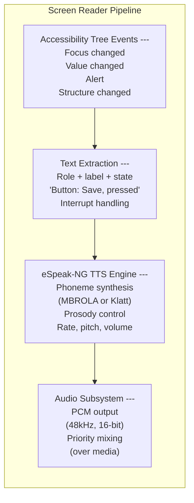
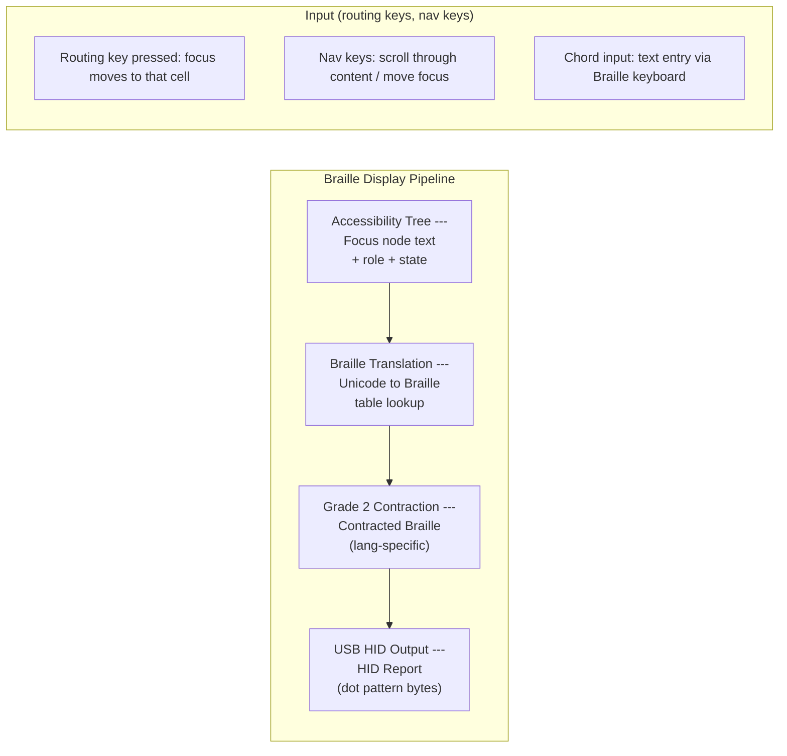
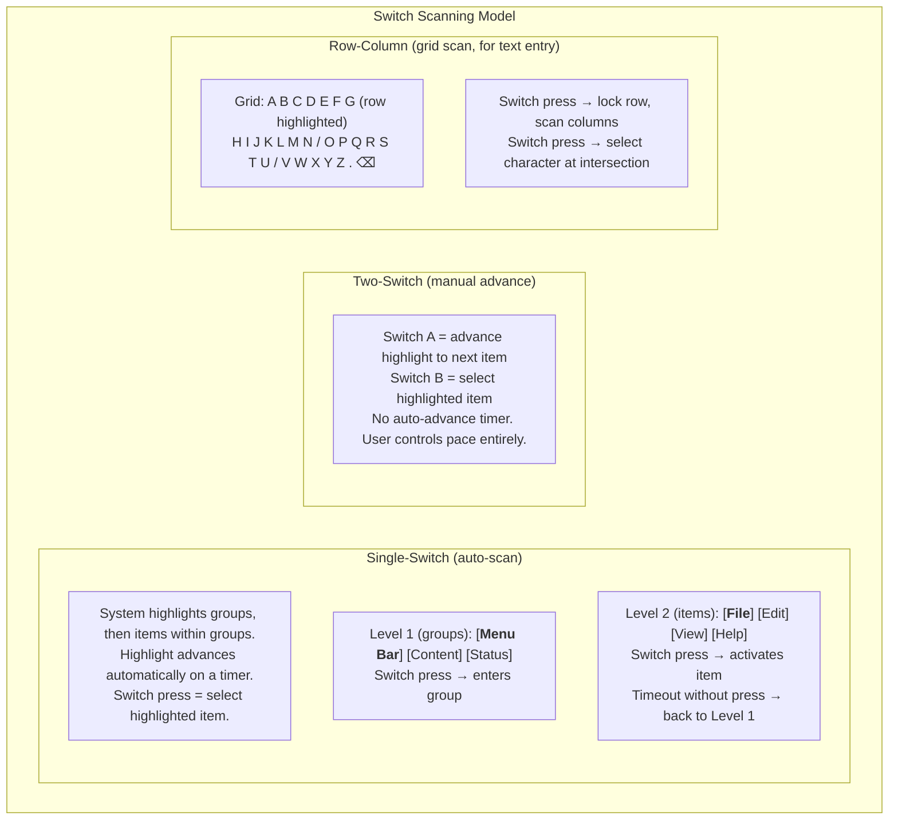
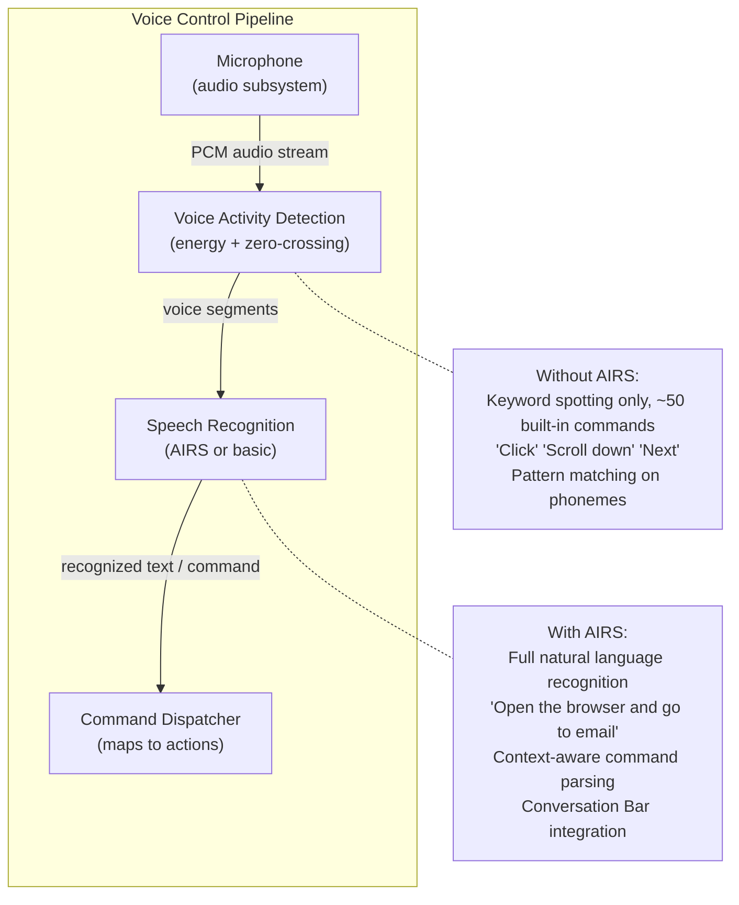
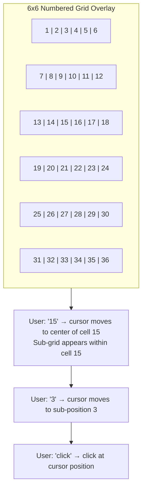

# AIOS Assistive Technology

Part of: [accessibility.md](../accessibility.md) — Accessibility Engine
**Related:** [system-integration.md](./system-integration.md) — Boot-time accessibility and accessibility tree, [ai-enhancement.md](./ai-enhancement.md) — AIRS enhancement layer, [intelligence.md](./intelligence.md) — AI-native intelligence, [security.md](./security.md) — Security and privacy

-----

## 3. Screen Reader

### 3.1 eSpeak-NG Integration

The screen reader is built on eSpeak-NG, a compact, multilingual text-to-speech engine compiled into the initramfs. This is the foundation that makes screen reading available from the first frame without AIRS, without network, and without any configuration.



**Why eSpeak-NG:**

- **Size:** ~800 KiB compiled, fits in initramfs without meaningful size impact
- **Languages:** 100+ languages and variants, covering the vast majority of the world's population
- **No model required:** Rule-based synthesis, not neural — no ML model to load, no GPU, no AIRS
- **Latency:** < 10ms from text input to first audio sample — critical for responsive screen reading
- **Proven:** Used by NVDA (Windows), Orca (Linux), and dozens of embedded systems
- **License:** GPL v3 — compiled as a separate process communicating via IPC, keeping the BSD-licensed AIOS code clean

```rust
pub struct ScreenReaderEngine {
    /// eSpeak-NG process handle
    espeak: EspeakProcess,

    /// Speech queue with priority levels
    queue: SpeechQueue,

    /// Current speech rate (0.5 = half speed, 2.0 = double)
    rate: f32,

    /// Current voice variant
    voice: TtsVoice,

    /// Language for TTS output
    language: String,

    /// Whether to use neural TTS when AIRS is available
    neural_tts_preferred: bool,

    /// Neural TTS engine (populated when AIRS attaches)
    neural_engine: Option<NeuralTtsEngine>,
}

pub struct SpeechQueue {
    /// Items waiting to be spoken
    items: VecDeque<SpeechItem>,
}

pub struct SpeechItem {
    /// Text to speak
    text: String,

    /// Priority determines interruption behavior
    priority: SpeechPriority,

    /// Source of this speech item
    source: SpeechSource,
}

pub enum SpeechPriority {
    /// Interrupt everything, speak immediately (alerts, errors)
    Interrupt,

    /// Speak after current word finishes (focus changes)
    Next,

    /// Queue after current item (value changes, descriptions)
    Queued,

    /// Speak only if nothing else is pending (ambient info)
    Idle,
}

pub enum SpeechSource {
    FocusChange(AccessNodeId),
    ValueChange(AccessNodeId),
    Alert(String),
    UserAction(String),
    SystemStatus(String),
}
```

### 3.2 Text Extraction from Accessibility Tree

The screen reader does not read pixels. It reads the accessibility tree maintained by the compositor (see [compositor.md](../../platform/compositor.md) §9.1) and populated by the UI toolkit (see [interface-kit.md](../../applications/interface-kit/accessibility.md) §12.1). Every widget has a semantic role, a label, and a state. The screen reader converts these into natural speech:

```rust
impl ScreenReaderEngine {
    /// Convert an accessibility node to spoken text.
    /// The output varies based on the node's role, state, and context.
    fn node_to_speech(&self, node: &AccessNode, event: &AccessibilityEvent) -> String {
        match event {
            AccessibilityEvent::FocusChanged { .. } => {
                let role_text = self.role_label(&node.role);
                let name = node.name.as_deref().unwrap_or("");
                let state = self.state_label(&node.state);

                // "Save, button"
                // "Username, text input, required"
                // "Enable notifications, checkbox, checked"
                format!("{name}, {role_text}{state}")
            }

            AccessibilityEvent::ValueChanged { value, .. } => {
                // "Volume, 75 percent"
                // "Search results, 3 items"
                format!("{}, {value}", node.name.as_deref().unwrap_or(""))
            }

            AccessibilityEvent::Alert { message } => {
                // Alerts are spoken immediately with distinct prosody
                format!("Alert: {message}")
            }

            AccessibilityEvent::WindowCreated { .. } => {
                format!("{} window opened", node.name.as_deref().unwrap_or("New"))
            }

            AccessibilityEvent::WindowDestroyed { .. } => {
                format!("{} window closed", node.name.as_deref().unwrap_or(""))
            }
        }
    }

    fn role_label(&self, role: &AccessRole) -> &str {
        match role {
            AccessRole::Button => "button",
            AccessRole::TextInput => "text input",
            AccessRole::Label => "",          // labels don't announce their role
            AccessRole::List => "list",
            AccessRole::ListItem => "",       // context from parent
            AccessRole::Checkbox => "checkbox",
            AccessRole::RadioButton => "radio button",
            AccessRole::Slider => "slider",
            AccessRole::Menu => "menu",
            AccessRole::MenuItem => "menu item",
            AccessRole::Tab => "tab",
            AccessRole::Dialog => "dialog",
            AccessRole::Alert => "alert",
            AccessRole::Image => "image",
            AccessRole::Link => "link",
            AccessRole::ScrollArea => "scroll area",
            // ... all WAI-ARIA roles
            _ => "",
        }
    }

    fn state_label(&self, state: &AccessState) -> String {
        let mut parts = Vec::new();
        if state.checked == Some(true) { parts.push("checked"); }
        if state.checked == Some(false) { parts.push("not checked"); }
        if state.expanded == Some(true) { parts.push("expanded"); }
        if state.expanded == Some(false) { parts.push("collapsed"); }
        if state.disabled { parts.push("disabled"); }
        if state.required { parts.push("required"); }
        if state.selected { parts.push("selected"); }
        if parts.is_empty() {
            String::new()
        } else {
            format!(", {}", parts.join(", "))
        }
    }
}
```

### 3.3 Earcons and Audio Cues

Beyond speech, the screen reader plays short audio cues (earcons) for common events. These are pre-rendered PCM samples stored in the initramfs (~50 KiB total):

| Event | Earcon | Purpose |
|---|---|---|
| Focus enters a group/region | Short ascending tone | Spatial orientation |
| Focus leaves a group/region | Short descending tone | Spatial orientation |
| Error or invalid action | Low double-beep | Feedback without interrupting speech |
| Successful action | Soft click | Confirmation |
| Link activation | Soft whoosh | Distinguishes navigation from activation |
| Window opened | Rising chime | Context change notification |
| Window closed | Falling chime | Context change notification |

Earcons are mixed at a lower volume than speech so they never obscure spoken content. They can be disabled via preferences.

-----

## 4. Braille Display Support

### 4.1 USB HID Braille Protocol

AIOS supports refreshable Braille displays via the USB HID Braille usage page (0x41), standardized in the USB HID specification. This means any display conforming to the HID Braille standard works without device-specific drivers.



### 4.2 Braille Driver

```rust
pub struct BrailleDriver {
    /// USB HID device handle
    device: UsbHidDevice,

    /// Number of cells on the display (typically 14, 20, 40, or 80)
    cell_count: u8,

    /// Current display content (one byte per cell, 8-dot Braille)
    cells: Vec<u8>,

    /// Braille translation table (Unicode → dot patterns)
    table: BrailleTable,

    /// Grade (1 = uncontracted, 2 = contracted)
    grade: BrailleGrade,

    /// Language for contraction rules
    language: String,

    /// Cursor position on the display
    cursor_cell: u8,

    /// Text window offset (for content longer than display)
    pan_offset: usize,
}

pub enum BrailleGrade {
    /// One-to-one letter mapping, no contractions
    Grade1,
    /// Language-specific contractions (e.g., English Grade 2)
    Grade2,
    /// Computer Braille (8-dot, one-to-one for ASCII)
    Computer,
}

pub struct BrailleTable {
    /// Unicode codepoint → dot pattern mapping
    char_map: HashMap<char, u8>,
    /// Multi-character contraction rules (Grade 2)
    contractions: Vec<ContractionRule>,
}

pub struct ContractionRule {
    /// Text pattern to match (e.g., "the", "ing", "tion")
    pattern: String,
    /// Braille dot pattern for the contraction
    dots: Vec<u8>,
    /// Where this contraction can appear
    position: ContractionPosition,
}

pub enum ContractionPosition {
    Anywhere,
    WordBeginning,
    WordMiddle,
    WordEnding,
    Standalone,
}

impl BrailleDriver {
    /// Detect Braille display on USB bus.
    /// Called during boot Phase 2 hardware detection.
    pub fn detect(usb: &UsbSubsystem) -> Option<Self> {
        // HID usage page 0x41 = Braille Display
        let devices = usb.find_devices(UsbHidUsagePage::Braille);
        if let Some(device) = devices.first() {
            let cell_count = device.descriptor().braille_cell_count();
            Some(Self::new(device.clone(), cell_count))
        } else {
            None
        }
    }

    /// Update the Braille display with new content from the focused node.
    pub fn show_node(&mut self, node: &AccessNode) {
        let text = self.format_for_braille(node);
        let dots = self.translate(&text);
        self.write_cells(&dots);
    }

    /// Translate text to Braille dot patterns using the active table.
    fn translate(&self, text: &str) -> Vec<u8> {
        match self.grade {
            BrailleGrade::Grade1 => {
                text.chars()
                    .map(|c| self.table.char_map.get(&c).copied().unwrap_or(0))
                    .collect()
            }
            BrailleGrade::Grade2 => {
                self.table.contract(text, &self.language)
            }
            BrailleGrade::Computer => {
                text.bytes()
                    .map(|b| self.table.ascii_to_dots(b))
                    .collect()
            }
        }
    }

    /// Write dot patterns to the USB HID device.
    fn write_cells(&mut self, dots: &[u8]) {
        // Truncate or pad to cell_count
        let display_dots: Vec<u8> = dots.iter()
            .skip(self.pan_offset)
            .take(self.cell_count as usize)
            .copied()
            .collect();

        self.cells = display_dots.clone();

        // Send HID output report
        let report = HidOutputReport::braille_cells(&display_dots);
        self.device.send_report(&report);
    }

    /// Handle input from Braille display (routing keys, navigation).
    pub fn handle_input(&mut self, report: HidInputReport) -> BrailleAction {
        match report.usage() {
            BrailleUsage::RoutingKey(cell) => {
                BrailleAction::MoveCursorToCell(cell)
            }
            BrailleUsage::PanLeft => {
                self.pan_offset = self.pan_offset.saturating_sub(self.cell_count as usize);
                BrailleAction::Refresh
            }
            BrailleUsage::PanRight => {
                self.pan_offset += self.cell_count as usize;
                BrailleAction::Refresh
            }
            BrailleUsage::BrailleKeyboard(dots) => {
                BrailleAction::TextInput(self.table.dots_to_char(dots))
            }
            _ => BrailleAction::None,
        }
    }
}
```

### 4.3 Braille and Screen Reader Coordination

When both screen reader and Braille display are active, they operate in concert:

- **Focus changes** update both speech output and Braille display simultaneously
- **Braille routing keys** move the screen reader cursor (speech follows Braille)
- **Speech interruption** does not affect the Braille display (user can re-read at their pace)
- **Long content** is spoken in full but panned on the Braille display (user controls panning)

The user can configure the Braille display to show the current focus (track focus mode) or a specific area of the screen (fixed region mode). In track-focus mode, every focus change updates the Braille display. In fixed-region mode, the display shows a selected portion of the accessibility tree regardless of focus.

-----

## 5. Switch Scanning

### 5.1 Design Rationale

Switch scanning is an alternative input method for users who cannot use a keyboard, mouse, or touchscreen. The user operates one or more physical switches (buttons) connected via USB or Bluetooth. The system highlights UI elements one at a time (or in groups), and the user presses a switch to select the highlighted element.

This is the most constrained input method AIOS supports. A single-switch user has exactly one binary input. The entire OS must be navigable with that one button. This constraint drives the design of the scanning engine.

### 5.2 Scan Patterns



### 5.3 Switch Scan Engine

```rust
pub struct SwitchScanEngine {
    /// Current scan mode
    mode: ScanMode,

    /// Switch hardware configuration
    switches: SwitchConfig,

    /// Scan timing (auto-advance interval)
    scan_interval: Duration,

    /// Current scan state
    state: ScanState,

    /// Scan groups built from accessibility tree
    groups: Vec<ScanGroup>,

    /// Visual highlight style
    highlight: ScanHighlight,

    /// Audio feedback during scanning
    audio_feedback: bool,
}

pub enum ScanMode {
    /// One switch, auto-advancing highlight
    SingleSwitch {
        /// Time between automatic highlight advances
        interval: Duration,
        /// Number of full scans before exiting a group
        loops_before_exit: u8,
    },

    /// Two switches: advance + select
    TwoSwitch,

    /// Row-column grid scan for text entry
    RowColumn {
        interval: Duration,
    },
}

pub struct SwitchConfig {
    /// Switch devices (USB HID or keyboard keys)
    devices: Vec<SwitchDevice>,
    /// Debounce time (prevent double-activation from tremor)
    debounce: Duration,
    /// Long-press threshold (for secondary actions)
    long_press: Duration,
}

pub struct ScanState {
    /// Currently highlighted group index
    group_index: usize,
    /// Currently highlighted item within group
    item_index: Option<usize>,
    /// Scan level (group or item)
    level: ScanLevel,
    /// Timer for auto-advance
    timer: Timer,
    /// Loop counter (for auto-exit)
    loop_count: u8,
}

pub enum ScanLevel {
    /// Scanning across top-level groups
    Group,
    /// Scanning items within a selected group
    Item,
    /// Scanning characters in text entry grid
    Grid { row: usize, col: Option<usize> },
}

pub struct ScanGroup {
    /// Display name (for screen reader announcement)
    name: String,
    /// Items in this group
    items: Vec<ScanItem>,
    /// Bounding rectangle (for visual highlight)
    bounds: Rect,
}

pub struct ScanItem {
    /// The accessibility node this item represents
    node_id: AccessNodeId,
    /// Display label
    label: String,
    /// Action to perform when selected
    action: AccessAction,
    /// Bounding rectangle
    bounds: Rect,
}

impl SwitchScanEngine {
    /// Build scan groups from the accessibility tree.
    /// Groups UI into logical regions for efficient scanning.
    pub fn build_groups(&mut self, tree: &AccessibilityTree) {
        self.groups.clear();

        // Group 1: System controls (Status Strip)
        // Group 2: Navigation / Menu Bar
        // Group 3: Main content area
        // Group 4: Side panels (if present)
        // Group 5: Dialog (if open — takes priority)

        for region in tree.top_level_regions() {
            let items: Vec<ScanItem> = region
                .focusable_descendants()
                .map(|node| ScanItem {
                    node_id: node.id,
                    label: node.name.clone().unwrap_or_default(),
                    action: node.default_action(),
                    bounds: node.bounds,
                })
                .collect();

            if !items.is_empty() {
                self.groups.push(ScanGroup {
                    name: region.name.clone().unwrap_or_default(),
                    items,
                    bounds: region.bounds,
                });
            }
        }
    }

    /// Handle switch press event.
    pub fn switch_pressed(&mut self, switch: SwitchId) -> ScanAction {
        let now = Instant::now();

        match self.mode {
            ScanMode::SingleSwitch { .. } => {
                // Single switch: press always means "select current"
                self.select_current()
            }

            ScanMode::TwoSwitch => {
                match self.switches.role(switch) {
                    SwitchRole::Advance => self.advance(),
                    SwitchRole::Select => self.select_current(),
                }
            }

            ScanMode::RowColumn { .. } => {
                self.grid_select()
            }
        }
    }

    fn select_current(&mut self) -> ScanAction {
        match self.state.level {
            ScanLevel::Group => {
                // Enter the highlighted group
                self.state.level = ScanLevel::Item;
                self.state.item_index = Some(0);
                self.state.loop_count = 0;
                ScanAction::EnterGroup(self.state.group_index)
            }
            ScanLevel::Item => {
                // Activate the highlighted item
                let group = &self.groups[self.state.group_index];
                let item = &group.items[self.state.item_index.unwrap()];
                ScanAction::Activate(item.node_id, item.action.clone())
            }
            ScanLevel::Grid { row, col } => {
                if col.is_none() {
                    // Lock the row, start scanning columns
                    self.state.level = ScanLevel::Grid { row, col: Some(0) };
                    ScanAction::LockRow(row)
                } else {
                    // Select the character
                    ScanAction::GridSelect(row, col.unwrap())
                }
            }
        }
    }

    fn advance(&mut self) -> ScanAction {
        match self.state.level {
            ScanLevel::Group => {
                self.state.group_index =
                    (self.state.group_index + 1) % self.groups.len();
                ScanAction::HighlightGroup(self.state.group_index)
            }
            ScanLevel::Item => {
                let group = &self.groups[self.state.group_index];
                let next = (self.state.item_index.unwrap() + 1) % group.items.len();
                self.state.item_index = Some(next);
                ScanAction::HighlightItem(self.state.group_index, next)
            }
            ScanLevel::Grid { row, col } => {
                // Advance in grid
                ScanAction::HighlightGridCell(row, col.map(|c| c + 1).unwrap_or(0))
            }
        }
    }
}
```

### 5.4 Switch Hardware Detection

Switch access devices are detected during boot via USB HID enumeration. Common switch interfaces present as HID devices with specific usage pages. Additionally, keyboard keys can be mapped as switches for users who can press one or two specific keys but cannot use a full keyboard.

```rust
impl SwitchScanEngine {
    /// Detect connected switch devices.
    /// Falls back to keyboard-as-switch if no dedicated hardware found.
    pub fn detect(
        usb: &UsbSubsystem,
        keyboard: &InputSubsystem,
    ) -> Option<SwitchConfig> {
        // Check for dedicated switch interfaces
        let hid_switches = usb.find_devices(UsbHidUsagePage::Switch);

        if !hid_switches.is_empty() {
            return Some(SwitchConfig::from_hid(hid_switches));
        }

        // Check for switch-mode keyboard request (F8 held at boot)
        if keyboard.key_held(Key::F8) {
            // Space bar = switch A, Enter = switch B
            return Some(SwitchConfig::keyboard_fallback());
        }

        None
    }
}
```

-----

## 6. High Contrast and Magnification

### 6.1 Compositor-Level Rendering

High contrast and magnification are implemented at the compositor level, not in individual widgets. This means they work for every surface — including agents that don't explicitly support accessibility, legacy POSIX applications, and the browser. The compositor applies these as post-processing passes on the final composited frame.

```rust
pub struct HighContrastConfig {
    /// Active contrast scheme
    scheme: ContrastScheme,
    /// Minimum contrast ratio (WCAG AA = 4.5:1, AAA = 7:1)
    min_ratio: f32,
}

pub enum ContrastScheme {
    /// System default (meets WCAG AA)
    Default,
    /// White text on black background
    WhiteOnBlack,
    /// Black text on white background
    BlackOnWhite,
    /// Yellow text on black background (lower eye strain)
    YellowOnBlack,
    /// Green text on black background
    GreenOnBlack,
    /// Custom foreground/background colors
    Custom { foreground: Color, background: Color },
}

pub struct MagnifierState {
    /// Whether magnification is active
    enabled: bool,

    /// Magnification level (1.0 = no magnification)
    zoom: f32,

    /// Magnification mode
    mode: MagnificationMode,

    /// Tracking behavior
    tracking: MagnificationTracking,

    /// Smooth scrolling for magnifier movement
    smooth: bool,
}

pub enum MagnificationMode {
    /// Entire screen is magnified (zoom + pan)
    FullScreen,

    /// Magnified lens follows the cursor/focus
    Lens {
        width: u32,
        height: u32,
    },

    /// Top or bottom half shows magnified view of focus area
    SplitScreen {
        position: SplitPosition,
    },
}

pub enum MagnificationTracking {
    /// Magnifier follows the mouse cursor
    Cursor,
    /// Magnifier follows keyboard/screen reader focus
    Focus,
    /// Magnifier follows both (whichever moved last)
    CursorAndFocus,
}

impl Compositor {
    /// Apply high contrast post-processing to the composited frame.
    /// This is a GPU shader pass that remaps colors.
    fn apply_high_contrast(&self, frame: &mut RenderTarget, config: &HighContrastConfig) {
        match config.scheme {
            ContrastScheme::Default => {} // no-op
            ContrastScheme::WhiteOnBlack => {
                self.gpu.apply_shader(frame, &self.shaders.invert_luminance);
            }
            ContrastScheme::Custom { foreground, background } => {
                self.gpu.apply_shader(
                    frame,
                    &self.shaders.remap_contrast(foreground, background),
                );
            }
            _ => {
                self.gpu.apply_shader(
                    frame,
                    &self.shaders.contrast_remap(&config.scheme),
                );
            }
        }
    }

    /// Apply magnification to the composited frame.
    fn apply_magnification(&self, frame: &mut RenderTarget, state: &MagnifierState) {
        if !state.enabled || state.zoom <= 1.0 {
            return;
        }

        let focus_point = match state.tracking {
            MagnificationTracking::Cursor => self.cursor_position(),
            MagnificationTracking::Focus => self.focused_node_center(),
            MagnificationTracking::CursorAndFocus => self.last_moved_point(),
        };

        match state.mode {
            MagnificationMode::FullScreen => {
                // Viewport is (1/zoom) of the full screen, centered on focus
                let viewport = self.zoom_viewport(focus_point, state.zoom);
                self.gpu.render_zoomed(frame, viewport, state.smooth);
            }
            MagnificationMode::Lens { width, height } => {
                // Render magnified region into a floating rectangle
                let lens_rect = Rect::centered(focus_point, width, height);
                self.gpu.render_lens(frame, lens_rect, state.zoom);
            }
            MagnificationMode::SplitScreen { position } => {
                let (mag_region, source_region) =
                    self.split_regions(position, focus_point, state.zoom);
                self.gpu.render_split(frame, mag_region, source_region, state.zoom);
            }
        }
    }
}
```

### 6.2 Large Text

Large text mode scales all text by 2x (configurable from 1.25x to 4x). This is implemented in the UI toolkit's theme system rather than the compositor, so layout reflows correctly. Widgets rearrange to accommodate larger text rather than simply scaling pixels.

```rust
impl Theme {
    /// Apply large text scaling to all font sizes in the theme.
    pub fn with_text_scale(mut self, scale: f32) -> Self {
        self.font_size_body = (self.font_size_body as f32 * scale) as u16;
        self.font_size_heading = (self.font_size_heading as f32 * scale) as u16;
        self.font_size_caption = (self.font_size_caption as f32 * scale) as u16;
        self.font_size_label = (self.font_size_label as f32 * scale) as u16;

        // Increase spacing proportionally
        self.spacing = (self.spacing as f32 * scale.sqrt()) as u16;
        self.padding = (self.padding as f32 * scale.sqrt()) as u16;

        self
    }
}
```

### 6.3 Reduced Motion

When reduced motion is enabled, the compositor disables or reduces all animations:

- **Context transitions** (Work to Leisure) become instant cuts instead of 300ms fades
- **Window open/close** has no animation
- **Scroll** is immediate, no inertia
- **Focus indicators** do not animate (static highlight instead of pulsing)
- **Flow Tray** items appear without slide-in animation

```rust
pub struct ReducedMotionConfig {
    /// Completely disable all animations
    disable_all: bool,
    /// If not disabling all, reduce animation duration to this fraction
    duration_fraction: f32,   // e.g., 0.25 = 25% of normal duration
    /// Disable parallax and scroll effects
    disable_parallax: bool,
    /// Disable auto-playing video/GIF
    disable_autoplay: bool,
}
```

-----

## 7. Voice Control

### 7.1 Speech-to-Command Pipeline

Voice control allows users to control the OS and applications entirely by voice. It operates in two tiers: basic command recognition (without AIRS) and full natural language control (with AIRS).



### 7.2 Basic Command Recognition (No AIRS)

Without AIRS, voice control uses a lightweight keyword spotter. This is not full speech recognition — it matches a fixed vocabulary of ~50 commands using phoneme templates stored in the initramfs.

```rust
pub struct BasicVoiceControl {
    /// Keyword spotter (phoneme pattern matching)
    spotter: KeywordSpotter,

    /// Built-in command vocabulary
    commands: Vec<VoiceCommand>,

    /// Whether voice control is actively listening
    listening: bool,

    /// Wake word to begin listening (default: "Computer")
    wake_word: String,
}

pub struct VoiceCommand {
    /// Spoken phrase (phoneme pattern)
    phrase: PhonemePattern,

    /// Display text (for confirmation)
    display: String,

    /// Action to perform
    action: VoiceAction,
}

pub enum VoiceAction {
    // Navigation
    Click,
    DoubleClick,
    ScrollUp,
    ScrollDown,
    NextItem,
    PreviousItem,
    Enter,
    Escape,
    Tab,
    BackTab,

    // Window management
    CloseWindow,
    MinimizeWindow,
    MaximizeWindow,
    SwitchWindow,

    // Screen reader control
    StopSpeaking,
    RepeatLast,
    SpeakAll,
    SpellWord,

    // System
    OpenConversationBar,
    GoHome,
    ShowNotifications,
    LockScreen,

    // Grid overlay for mouse control
    ShowGrid,
    GridNumber(u32),
}
```

### 7.3 Grid Overlay for Mouse Control by Voice

For users who need pixel-level cursor control via voice, the compositor can display a numbered grid overlay. The user says a grid number to move the cursor to that region, then a sub-grid appears for finer positioning:



This is a fallback for interactions that cannot be reached through the accessibility tree. Well-designed agents should never require it — all interactive elements should be in the accessibility tree with keyboard focus support.
