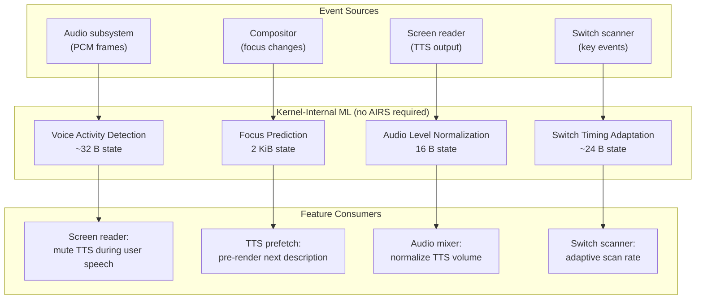
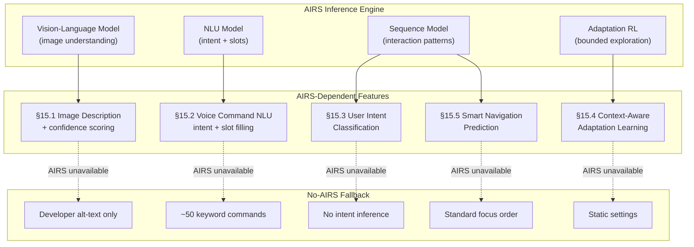
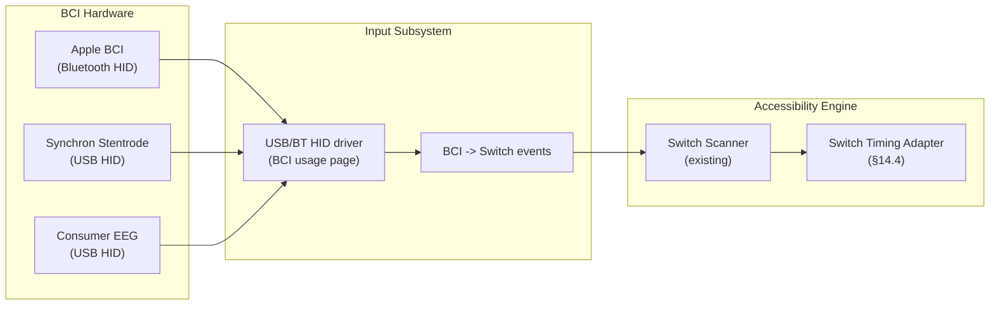

# AIOS Accessibility Intelligence

Part of: [accessibility.md](../accessibility.md) — Accessibility Engine
**Related:** [assistive-technology.md](./assistive-technology.md) — Core assistive technology, [ai-enhancement.md](./ai-enhancement.md) — AIRS enhancement layer, [testing.md](./testing.md) — Testing strategy, [security.md](./security.md) — Security and privacy, [intelligence-services.md](../../intelligence/airs/intelligence-services.md) — AIRS Intelligence Services, [input/ai.md](../../platform/input/ai.md) — Input AI-native intelligence

-----

## 14. Kernel-Internal ML

Kernel-internal ML models run without AIRS — they are purely statistical, frozen decision trees or online algorithms embedded in the kernel and compositor. They enhance accessibility features with no external dependency, no runtime training, and no model loading. Every model listed here works from the first frame of the first boot, before AIRS loads, before the network is available, before user preferences exist.

These models are small enough to fit in L1 cache on any supported platform. State sizes range from 16 bytes to 2 KiB. Update frequencies are tied to natural accessibility events (audio frames, focus changes, key presses) — never polled on a timer. The kernel-internal ML layer complements the no-AIRS baseline described in [assistive-technology.md](./assistive-technology.md) and the AIRS enhancement layer in [ai-enhancement.md](./ai-enhancement.md) §10.



### 14.1 Voice Activity Detection (VAD)

The screen reader must not talk over the user. When a user speaks (to give a voice command, to dictate, or simply to talk to someone nearby), TTS output should pause until the user stops speaking. This requires detecting speech in the microphone input — but it must work without a neural network, without AIRS, and within the constraints of the audio subsystem's ISR context.

The approach uses two complementary features from classical speech processing:

1. **RMS energy**: Voiced speech has higher energy than background noise. An adaptive threshold tracks the noise floor using Welford's online algorithm for running mean and variance.
2. **Zero Crossing Rate (ZCR)**: Voiced speech produces a ZCR below 0.1 (smooth waveform), unvoiced speech (sibilants, fricatives) produces ZCR above 0.3, and background noise is typically intermediate. Combining energy with ZCR reduces false positives from transient noise.

Frame size is 10-30 ms (matching the audio subsystem's buffer period). No FFT, no mel-spectrogram, no neural network. The entire state fits in 32 bytes.

```rust
/// Voice Activity Detection state for screen reader TTS gating.
/// Runs in audio subsystem context — no allocation, no AIRS dependency.
/// Frame-by-frame analysis using RMS energy + Zero Crossing Rate.
pub struct VadState {
    /// Running mean of RMS energy (Welford's online algorithm)
    energy_mean: f32,

    /// Running variance of RMS energy (Welford's M2 accumulator)
    energy_m2: f32,

    /// Number of frames observed (for Welford's algorithm)
    frame_count: u32,

    /// Number of consecutive speech frames (for hangover)
    speech_frames: u16,

    /// Number of consecutive silence frames (for hangover release)
    silence_frames: u16,
}

/// Detection result from a single audio frame.
#[derive(Debug, Clone, Copy, PartialEq, Eq)]
pub enum VadDecision {
    /// Speech detected — screen reader should pause TTS.
    Speech,
    /// No speech — screen reader may continue TTS.
    Silence,
}

impl VadState {
    /// Create a new VAD state with no prior observations.
    pub const fn new() -> Self {
        Self {
            energy_mean: 0.0,
            energy_m2: 0.0,
            frame_count: 0,
            speech_frames: 0,
            silence_frames: 0,
        }
    }

    /// Analyze a single audio frame for speech presence.
    ///
    /// `samples` is a slice of i16 PCM samples (mono, 16 kHz).
    /// Typical frame size: 160 samples (10 ms) to 480 samples (30 ms).
    ///
    /// Returns `VadDecision::Speech` if the frame contains speech,
    /// with hangover to prevent choppy muting during natural pauses.
    pub fn detect_speech(&mut self, samples: &[i16]) -> VadDecision {
        if samples.is_empty() {
            return VadDecision::Silence;
        }

        // Compute RMS energy
        let sum_sq: f64 = samples.iter().map(|&s| (s as f64) * (s as f64)).sum();
        let rms = (sum_sq / samples.len() as f64).sqrt() as f32;

        // Compute Zero Crossing Rate
        let mut crossings = 0u32;
        for i in 1..samples.len() {
            if (samples[i] >= 0) != (samples[i - 1] >= 0) {
                crossings += 1;
            }
        }
        let zcr = crossings as f32 / samples.len() as f32;

        // Update Welford's online statistics for energy
        self.frame_count += 1;
        let delta = rms - self.energy_mean;
        self.energy_mean += delta / self.frame_count as f32;
        let delta2 = rms - self.energy_mean;
        self.energy_m2 += delta * delta2;

        // Adaptive threshold: mean + 2 standard deviations
        let variance = if self.frame_count > 1 {
            self.energy_m2 / (self.frame_count - 1) as f32
        } else {
            0.0
        };
        let std_dev = variance.sqrt();
        let energy_threshold = self.energy_mean + 2.0 * std_dev;

        // Speech detection: high energy AND low ZCR (voiced speech)
        // OR high energy AND high ZCR (unvoiced speech like "s", "sh")
        let is_speech = rms > energy_threshold && (zcr < 0.1 || zcr > 0.3);

        // Hangover: maintain speech state for 150 ms after last speech frame
        // to avoid choppy muting during natural inter-word pauses
        const HANGOVER_FRAMES: u16 = 15; // ~150 ms at 10 ms frames

        if is_speech {
            self.speech_frames = self.speech_frames.saturating_add(1);
            self.silence_frames = 0;
            VadDecision::Speech
        } else {
            self.silence_frames = self.silence_frames.saturating_add(1);
            if self.silence_frames > HANGOVER_FRAMES {
                self.speech_frames = 0;
                VadDecision::Silence
            } else if self.speech_frames > 0 {
                // In hangover period — still report speech
                VadDecision::Speech
            } else {
                VadDecision::Silence
            }
        }
    }
}
```

**State size breakdown:** `energy_mean` (4 B) + `energy_m2` (4 B) + `frame_count` (4 B) + `speech_frames` (2 B) + `silence_frames` (2 B) = 16 B struct, plus padding to 20 B. Including the `VadDecision` return value cached by the screen reader, total working state is under 32 B.

**Clinical basis:** TTS-over-speech is a documented usability problem in screen reader research (Guerreiro et al., ASSETS 2010). Users who rely on speech output cannot distinguish their own voice from the screen reader's when both are active simultaneously. VAD-gated TTS is standard in modern screen readers (NVDA implements a similar but more complex approach using Windows audio session APIs).

**Integration point:** The audio subsystem calls `detect_speech()` on each captured microphone frame. The result is communicated to the screen reader via a shared atomic flag (see [system-integration.md](./system-integration.md) §8 for the audio routing architecture). No IPC overhead — the flag is in the Accessibility Manager's shared state, readable by the TTS output path.

### 14.2 Focus Prediction

When the user navigates the accessibility tree (Tab, Shift+Tab, arrow keys), the screen reader must synthesize a description of the newly focused element and speak it. TTS synthesis has nonzero latency — even eSpeak-NG takes 5-15 ms per utterance, and the compositor must render the focus indicator. If the system can predict which element will receive focus next, it can pre-render the TTS audio and pre-compute the focus indicator position, reducing perceived latency by 30-50 ms.

The prediction model is a first-order Markov chain over `AccessNodeKind` (the element type in the accessibility tree). The transition matrix records observed transitions — for example, "after focusing a button, the user most often focuses a text field next" (common in form navigation). The matrix is updated on every focus change and consulted before each TTS synthesis.

State size is bounded: with 16 `AccessNodeKind` variants, the transition matrix is 16x16 = 256 entries of 4 bytes each = 1024 bytes, plus 16 entries for row totals = 1088 bytes. Well under the 2 KiB budget.

```rust
/// Maximum number of distinct AccessNodeKind variants tracked.
const MAX_NODE_KINDS: usize = 16;

/// First-order Markov chain for focus transition prediction.
/// Updated on every focus change. Consulted to prefetch TTS for the
/// most likely next-focused element.
pub struct FocusPredictionModel {
    /// Transition counts: transitions[from][to] = number of observed transitions.
    transitions: [[u32; MAX_NODE_KINDS]; MAX_NODE_KINDS],

    /// Row totals for normalization (avoids recomputing on every prediction).
    row_totals: [u32; MAX_NODE_KINDS],

    /// Most recent focused node kind (for recording the next transition).
    last_kind: Option<u8>,
}

/// Predicted next focus target with confidence.
pub struct FocusPrediction {
    /// Most likely next AccessNodeKind index.
    pub predicted_kind: u8,

    /// Probability of the prediction (0.0 to 1.0).
    pub confidence: f32,
}

impl FocusPredictionModel {
    /// Create a new model with uniform priors.
    pub const fn new() -> Self {
        Self {
            transitions: [[0; MAX_NODE_KINDS]; MAX_NODE_KINDS],
            row_totals: [0; MAX_NODE_KINDS],
            last_kind: None,
        }
    }

    /// Record a focus transition to the given AccessNodeKind.
    /// Called by the compositor's focus management code on every focus change.
    pub fn record_transition(&mut self, to_kind: u8) {
        let to = (to_kind as usize) % MAX_NODE_KINDS;

        if let Some(from_kind) = self.last_kind {
            let from = (from_kind as usize) % MAX_NODE_KINDS;
            self.transitions[from][to] = self.transitions[from][to].saturating_add(1);
            self.row_totals[from] = self.row_totals[from].saturating_add(1);
        }

        self.last_kind = Some(to_kind);
    }

    /// Predict the most likely next focus target given the current focus.
    /// Returns `None` if no transitions have been observed from the current kind.
    pub fn predict_next(&self, current_kind: u8) -> Option<FocusPrediction> {
        let from = (current_kind as usize) % MAX_NODE_KINDS;
        let total = self.row_totals[from];

        if total == 0 {
            return None;
        }

        // Find the most likely next kind
        let mut best_kind = 0u8;
        let mut best_count = 0u32;

        for to in 0..MAX_NODE_KINDS {
            if self.transitions[from][to] > best_count {
                best_count = self.transitions[from][to];
                best_kind = to as u8;
            }
        }

        Some(FocusPrediction {
            predicted_kind: best_kind,
            confidence: best_count as f32 / total as f32,
        })
    }
}
```

**Prefetch strategy:** When `predict_next()` returns a prediction with confidence above 0.6, the screen reader pre-synthesizes the description of the most likely next element. On a cache hit (the user actually navigates to the predicted element), TTS begins immediately from the pre-rendered buffer. On a cache miss, the pre-rendered audio is discarded and synthesis proceeds normally. The worst case is a wasted synthesis — no user-visible penalty.

**Integration point:** The compositor's focus management code calls `record_transition()` on every focus change. The screen reader calls `predict_next()` after speaking the current element and, if confidence is sufficient, begins background synthesis. See [system-integration.md](./system-integration.md) for the compositor-accessibility protocol.

### 14.3 Audio Level Normalization

eSpeak-NG produces varying output levels across different phonemes and languages. A word containing primarily voiced consonants may be 6-10 dB louder than one with unvoiced fricatives. For screen reader users who rely entirely on audio, these level variations cause listening fatigue over extended sessions.

The normalizer uses an Exponential Weighted Moving Average (EWMA) on the RMS level of each TTS utterance, with a smoothing factor of alpha=0.1 (slow adaptation to avoid sudden volume jumps). The output gain is adjusted to bring the measured level toward a target level. This is separate from the audio subsystem's DSP chain — it operates on the TTS output before it enters the mixer, ensuring accessibility-specific normalization does not affect other audio streams.

```rust
/// EWMA-based audio level normalizer for TTS output.
/// Compensates for varying phoneme loudness in eSpeak-NG.
/// State: 16 bytes. Updated once per utterance (not per frame).
pub struct AudioNormalizer {
    /// EWMA of observed RMS levels (linear scale, not dB).
    ewma_level: f32,

    /// Target output level (linear scale). Set once from user preferences
    /// or default (0.5 = -6 dBFS, a comfortable listening level).
    target_level: f32,

    /// Current gain multiplier applied to TTS output.
    current_gain: f32,

    /// Minimum gain to prevent silence (0.1 = -20 dB floor).
    _min_gain: f32,
}

impl AudioNormalizer {
    /// EWMA smoothing factor. Lower values = slower adaptation.
    /// 0.1 provides smooth transitions over ~10 utterances.
    const ALPHA: f32 = 0.1;

    /// Maximum gain to prevent clipping.
    const MAX_GAIN: f32 = 4.0;

    /// Minimum gain to prevent silence.
    const MIN_GAIN: f32 = 0.1;

    /// Create a normalizer with the given target level.
    pub fn new(target_level: f32) -> Self {
        Self {
            ewma_level: target_level,
            target_level,
            current_gain: 1.0,
            _min_gain: Self::MIN_GAIN,
        }
    }

    /// Measure the RMS level of TTS output and adjust gain for the next utterance.
    ///
    /// Called once per utterance (not per frame) to avoid over-correction.
    /// Returns the gain to apply to the current utterance's audio samples.
    pub fn adjust_level(&mut self, utterance_rms: f32) -> f32 {
        if utterance_rms <= 0.0 {
            return self.current_gain;
        }

        // Update EWMA
        self.ewma_level = Self::ALPHA * utterance_rms + (1.0 - Self::ALPHA) * self.ewma_level;

        // Compute desired gain: bring EWMA toward target
        let desired_gain = if self.ewma_level > 0.0 {
            self.target_level / self.ewma_level
        } else {
            1.0
        };

        // Clamp to prevent clipping or silence
        self.current_gain = desired_gain.clamp(Self::MIN_GAIN, Self::MAX_GAIN);

        self.current_gain
    }
}
```

**Why not use the audio subsystem's DSP?** The audio subsystem provides per-session DSP (see [audio.md](../../platform/audio.md) §4.4). However, accessibility-specific normalization has different goals: it targets TTS intelligibility, not musical fidelity. The target level and adaptation rate are tuned for speech comprehension at extended listening durations, which differs from music or system sound normalization.

### 14.4 Switch Timing Adaptation

Switch scanning (see [assistive-technology.md](./assistive-technology.md) §5 for the scanning engine) relies on precise timing — the scan rate determines how fast the highlight moves across scan groups. Too fast, and the user cannot activate the switch in time. Too slow, and navigation becomes tedious. The optimal rate varies per user and changes during a session as fatigue sets in.

The adapter uses Welford's online algorithm on the interval between successive switch presses. When the mean interval increases by more than 2 standard deviations from the established baseline, fatigue is detected and the scan rate is slowed proportionally. If intervals return to baseline, the original rate is restored.

**Clinical basis:** Step scanning fatigue is a documented clinical problem in users with ALS, muscular dystrophy, and other progressive motor conditions (Szeto & Rha, 1993; Koester & Levine, 1997). Scan rate decay over session duration follows a predictable pattern — the adapter tracks this pattern statistically without requiring clinical calibration.

```rust
/// Online switch timing adapter for fatigue detection.
/// Uses Welford's algorithm on press intervals to detect slowdown.
/// State: ~24 bytes per switch user.
pub struct SwitchTimingAdapter {
    /// Running mean of press intervals in milliseconds.
    mean_interval_ms: f32,

    /// Welford's M2 accumulator for variance.
    m2: f32,

    /// Number of intervals observed.
    count: u32,

    /// Timestamp of the last press (milliseconds since boot).
    last_press_ms: u32,

    /// Baseline mean interval (established after first 20 presses).
    baseline_mean: f32,

    /// Baseline standard deviation.
    baseline_std: f32,
}

impl SwitchTimingAdapter {
    /// Minimum presses before baseline is established.
    const BASELINE_WINDOW: u32 = 20;

    /// Fatigue threshold: mean exceeds baseline by this many standard deviations.
    const FATIGUE_SIGMA: f32 = 2.0;

    /// Minimum scan interval in milliseconds (safety floor).
    const MIN_SCAN_MS: u32 = 200;

    /// Maximum scan interval in milliseconds (usability ceiling).
    const MAX_SCAN_MS: u32 = 5000;

    /// Create a new adapter with no prior observations.
    pub const fn new() -> Self {
        Self {
            mean_interval_ms: 0.0,
            m2: 0.0,
            count: 0,
            last_press_ms: 0,
            baseline_mean: 0.0,
            baseline_std: 0.0,
        }
    }

    /// Record a switch press event.
    ///
    /// `now_ms` is the current timestamp in milliseconds since boot.
    /// The adapter computes the interval from the previous press and
    /// updates its running statistics.
    pub fn record_press(&mut self, now_ms: u32) {
        if self.last_press_ms == 0 {
            // First press — no interval to record
            self.last_press_ms = now_ms;
            return;
        }

        let interval = now_ms.saturating_sub(self.last_press_ms) as f32;
        self.last_press_ms = now_ms;

        // Welford's online update
        self.count += 1;
        let delta = interval - self.mean_interval_ms;
        self.mean_interval_ms += delta / self.count as f32;
        let delta2 = interval - self.mean_interval_ms;
        self.m2 += delta * delta2;

        // Establish baseline after enough observations
        if self.count == Self::BASELINE_WINDOW {
            self.baseline_mean = self.mean_interval_ms;
            self.baseline_std = if self.count > 1 {
                (self.m2 / (self.count - 1) as f32).sqrt()
            } else {
                0.0
            };
        }
    }

    /// Recommend a scan interval based on observed timing patterns.
    ///
    /// Returns the recommended scan interval in milliseconds.
    /// If fatigue is detected (mean interval > baseline + 2 sigma),
    /// the scan rate slows proportionally. If intervals return to
    /// baseline, the original rate is restored.
    pub fn recommended_scan_interval(&self, default_interval_ms: u32) -> u32 {
        // Not enough data yet — use default
        if self.count < Self::BASELINE_WINDOW {
            return default_interval_ms;
        }

        // No meaningful variance — use default
        if self.baseline_std < 1.0 {
            return default_interval_ms;
        }

        let fatigue_threshold = self.baseline_mean + Self::FATIGUE_SIGMA * self.baseline_std;

        if self.mean_interval_ms > fatigue_threshold {
            // Fatigue detected: scale scan interval proportionally
            let fatigue_ratio = self.mean_interval_ms / self.baseline_mean;
            let adjusted = (default_interval_ms as f32 * fatigue_ratio) as u32;
            adjusted.clamp(Self::MIN_SCAN_MS, Self::MAX_SCAN_MS)
        } else {
            // No fatigue — use default (auto-recovery)
            default_interval_ms
        }
    }
}
```

**Auto-recovery:** When the user takes a break and returns, their press intervals naturally return to baseline. The Welford mean tracks this recovery without explicit reset logic — the running mean converges back toward baseline values as new, faster intervals are recorded. No manual "reset fatigue" action is needed.

**Fatigue detection sensitivity:** The 2-sigma threshold was chosen to balance responsiveness with false-positive avoidance. A 1-sigma threshold would trigger on normal inter-press variability during routine use. A 3-sigma threshold would require severe fatigue before responding. Clinical studies on scanning fatigue (Koester & Levine, 1997) show that mean interval increases of 1.5-2x baseline are reliably associated with user-reported fatigue — the 2-sigma threshold captures this range.

### 14.5 Summary

```text
Model              State Size   Update Freq   AIRS Required?
-----------------------------------------------------------------
VAD                ~32 B        Per frame     No
Focus prediction   2 KiB        Per focus     No
Audio normalizer   16 B         Per utterance No
Switch timing      ~24 B        Per press     No
```

Total kernel-internal ML state for accessibility: under 2.5 KiB per user session. All models are deterministic given their inputs — no randomness, no nondeterminism, no runtime training. Behavior is fully reproducible for testing and audit.

-----

## 15. AIRS-Dependent Intelligence

When AIRS is available, the accessibility system gains capabilities that are fundamentally impossible with statistical methods alone — image understanding, natural language processing, intent classification, and personalized adaptation learning. Every feature in this section gracefully degrades when AIRS is unavailable, falling back to the no-AIRS baseline described in [assistive-technology.md](./assistive-technology.md).

The design principle is strict: AIRS makes accessibility **better**, never **possible**. A user who loses AIRS (crash, resource pressure, hardware without NPU) loses quality — not function.



### 15.1 Image Description with Confidence Scoring

When an agent's accessibility tree contains an image without developer-provided alt text, and AIRS is available, the Accessibility Manager can request an AI-generated description. This extends the basic image description in [ai-enhancement.md](./ai-enhancement.md) §10.3 with confidence scoring and trust-calibrated output.

**Research basis:** CHI 2024 research (Huh et al.) found that users rated AI-generated alt-text 2.76/5 for satisfaction and 2.43/4 for trust. The primary complaint was overconfident descriptions of ambiguous images. Users preferred being told "I'm not sure" over receiving a plausible-sounding but incorrect description.

AIOS addresses this with confidence-gated output:

- Descriptions with confidence >= 0.7 are spoken directly: "Photo of two people sitting at a cafe table."
- Descriptions with confidence between 0.4 and 0.7 are qualified: "This might be a photo of people at a table, but I'm not certain."
- Descriptions with confidence below 0.4 are suppressed: "Image present, description uncertain. Press Enter to request a detailed description."

The user can always request a description regardless of confidence — the threshold only controls automatic speech.

```rust
/// AIRS-powered image description with confidence scoring.
/// Falls back to developer-provided alt text when AIRS is unavailable.
pub struct AirsImageDescriber {
    /// AIRS inference session (None when AIRS is offline).
    session: Option<AirsInferenceSession>,

    /// Confidence threshold for automatic speech.
    auto_speech_threshold: f32,

    /// Confidence threshold for qualified speech.
    qualified_threshold: f32,
}

/// Result of an image description request.
pub struct ImageDescription {
    /// The generated description text.
    pub text: DescriptionText,

    /// Model confidence in [0.0, 1.0].
    pub confidence: f32,

    /// How the description should be presented to the user.
    pub presentation: DescriptionPresentation,
}

/// How to present the description based on confidence.
#[derive(Debug, Clone, Copy, PartialEq, Eq)]
pub enum DescriptionPresentation {
    /// Speak directly — high confidence.
    Direct,
    /// Speak with qualification — moderate confidence.
    Qualified,
    /// Suppress automatic speech — low confidence. Offer manual request.
    Suppressed,
}

/// Wrapper for description text with bounded length.
pub struct DescriptionText {
    /// UTF-8 description, max 512 bytes.
    pub text: [u8; 512],
    /// Actual length of the description.
    pub len: usize,
}

impl AirsImageDescriber {
    /// Default confidence thresholds.
    const DEFAULT_AUTO_THRESHOLD: f32 = 0.7;
    const DEFAULT_QUALIFIED_THRESHOLD: f32 = 0.4;

    /// Create a new describer. Session is None until AIRS loads.
    pub fn new() -> Self {
        Self {
            session: None,
            auto_speech_threshold: Self::DEFAULT_AUTO_THRESHOLD,
            qualified_threshold: Self::DEFAULT_QUALIFIED_THRESHOLD,
        }
    }

    /// Describe an image, returning both the description and confidence.
    ///
    /// `image_data` is the raw pixel data (format negotiated with compositor).
    /// `context` provides surrounding UI context (nearby labels, page title)
    /// to improve description accuracy.
    ///
    /// Returns `None` if AIRS is unavailable — caller should fall back to
    /// developer-provided alt text.
    pub fn describe_image(
        &self,
        image_data: &[u8],
        context: &ImageContext,
    ) -> Option<ImageDescription> {
        let session = self.session.as_ref()?;

        let result = session.infer_image_description(image_data, context);

        let presentation = if result.confidence >= self.auto_speech_threshold {
            DescriptionPresentation::Direct
        } else if result.confidence >= self.qualified_threshold {
            DescriptionPresentation::Qualified
        } else {
            DescriptionPresentation::Suppressed
        };

        Some(ImageDescription {
            text: result.text,
            confidence: result.confidence,
            presentation,
        })
    }
}

/// Context provided to the image description model.
pub struct ImageContext {
    /// Nearest text label in the accessibility tree.
    pub nearby_label: Option<[u8; 128]>,

    /// Page or surface title.
    pub page_title: Option<[u8; 128]>,

    /// Element role (button icon, decorative, content image, etc.).
    pub element_role: ImageRole,
}

/// Role of the image in the UI, informing description strategy.
#[derive(Debug, Clone, Copy, PartialEq, Eq)]
pub enum ImageRole {
    /// Content image — describe fully.
    Content,
    /// Icon in a button — describe function, not appearance.
    ButtonIcon,
    /// Decorative — may skip description entirely.
    Decorative,
    /// Avatar or profile photo.
    Avatar,
    /// Chart or data visualization.
    DataVisualization,
}
```

**Neural TTS upgrade:** When AIRS is available, the screen reader can also upgrade from eSpeak-NG to Piper TTS (VITS architecture). Piper achieves approximately 13 ms latency on a Raspberry Pi 4 — fast enough for interactive screen reading. Piper is licensed GPL-3.0, so AIOS runs it as a separate process communicating via IPC, not linked into the kernel. The upgrade path is detailed in [ai-enhancement.md](./ai-enhancement.md) §10.2. If Piper fails or is unavailable, eSpeak-NG remains the fallback — the user never loses TTS.

### 15.2 Voice Command NLU

The no-AIRS voice control baseline (see [assistive-technology.md](./assistive-technology.md) §7) supports approximately 50 fixed keyword commands: "click", "scroll down", "next heading", "go back". This works, but it is brittle — the user must memorize exact phrases, and commands cannot reference dynamic content.

With AIRS, voice control upgrades to full natural language understanding with intent classification and slot filling:

- "Open the third email" maps to intent=`open`, slots=`{ordinal: 3, target: email}`.
- "Click the blue submit button" maps to intent=`click`, slots=`{color: blue, label: submit, element: button}`.
- "Read me the weather" maps to intent=`read_content`, slots=`{topic: weather}`.

The NLU model runs on-device via AIRS inference. Slot values are resolved against the current accessibility tree — "the third email" is matched to the third element with role `listitem` inside a container with label matching "email" or "inbox".

```rust
/// AIRS-powered voice command natural language understanding.
/// Falls back to keyword matching when AIRS is unavailable.
pub struct VoiceCommandNlu {
    /// AIRS inference session for NLU.
    session: Option<AirsInferenceSession>,

    /// Keyword-based fallback engine (always available).
    keyword_fallback: KeywordCommandEngine,
}

/// Parsed voice command with intent and extracted slots.
pub struct ParsedCommand {
    /// The recognized intent (e.g., Open, Click, ReadContent, ScrollTo).
    pub intent: VoiceIntent,

    /// Extracted slot values (variable per intent).
    pub slots: CommandSlots,

    /// Model confidence in the parse (0.0 to 1.0).
    pub confidence: f32,

    /// Whether this was parsed by AIRS NLU or keyword fallback.
    pub source: ParseSource,
}

/// Voice command intent categories.
#[derive(Debug, Clone, Copy, PartialEq, Eq)]
pub enum VoiceIntent {
    /// Click or activate an element.
    Click,
    /// Open an item (file, email, app).
    Open,
    /// Navigate to a location.
    NavigateTo,
    /// Read content aloud.
    ReadContent,
    /// Scroll in a direction.
    Scroll,
    /// Type or dictate text.
    Dictate,
    /// System command (volume, brightness, etc.).
    SystemControl,
    /// Unknown intent — ask user for clarification.
    Unknown,
}

/// Slot values extracted from the voice command.
pub struct CommandSlots {
    /// Target element reference (label, ordinal, or description).
    pub target: Option<SlotValue>,

    /// Ordinal position ("third", "last", "next").
    pub ordinal: Option<u32>,

    /// Direction for navigation/scroll commands.
    pub direction: Option<Direction>,

    /// Text content for dictation.
    pub text: Option<[u8; 256]>,

    /// Number of occupied slots.
    pub slot_count: u8,
}

/// A resolved or unresolved slot value.
pub enum SlotValue {
    /// A text label to match against accessibility tree.
    Label([u8; 128]),
    /// An element kind to filter by.
    ElementKind(AccessNodeKind),
    /// A resolved AccessNode ID (post-resolution).
    ResolvedNode(AccessNodeId),
}

/// Whether the command was parsed by AIRS or the keyword fallback.
#[derive(Debug, Clone, Copy, PartialEq, Eq)]
pub enum ParseSource {
    /// Full NLU with intent + slot extraction.
    AirsNlu,
    /// Keyword matching (limited but always available).
    KeywordFallback,
}

impl VoiceCommandNlu {
    /// Parse a voice command transcript into structured intent + slots.
    ///
    /// If AIRS is available, uses NLU for full natural language understanding.
    /// Otherwise, falls back to keyword matching.
    pub fn parse_command(&self, transcript: &str) -> ParsedCommand {
        if let Some(ref session) = self.session {
            // AIRS NLU path: full intent classification + slot filling
            match session.classify_intent(transcript) {
                Ok(nlu_result) => ParsedCommand {
                    intent: nlu_result.intent,
                    slots: nlu_result.slots,
                    confidence: nlu_result.confidence,
                    source: ParseSource::AirsNlu,
                },
                Err(_) => {
                    // AIRS inference failed — fall back to keywords
                    self.keyword_fallback.parse(transcript)
                }
            }
        } else {
            // No AIRS — keyword fallback
            self.keyword_fallback.parse(transcript)
        }
    }
}
```

**Slot resolution:** After intent + slots are extracted, the Accessibility Manager resolves slot values against the current accessibility tree. "The third email" becomes a query: find all elements with role `ListItem` inside a container whose label contains "email" or "mail", then select index 2 (zero-based). If resolution is ambiguous, the system asks for clarification: "I found 2 email lists. Which one did you mean?" This resolution step is shared between NLU and keyword paths.

### 15.3 User Intent Classification

Beyond individual commands, AIRS can classify the user's high-level goal from a sequence of interactions. This enables proactive assistance — offering shortcuts, simplifying the UI, or providing contextual help before the user explicitly asks.

The classifier observes a bounded window of the last 30 seconds of interaction events (focus changes, key presses, scrolling, pauses) and infers one of several high-level intents:

```rust
/// High-level user intent inferred from interaction sequences.
#[derive(Debug, Clone, Copy, PartialEq, Eq)]
pub enum UserIntent {
    /// User is reading content sequentially (steady Tab/arrow key pace).
    Reading,

    /// User is searching for something (rapid Tab-Tab-Tab, skipping content).
    Searching,

    /// User is filling out a form (alternating between fields and typing).
    FormFilling,

    /// User is exploring/learning the interface (slow, varied navigation).
    Exploring,

    /// User is struggling (repeated undo, long pauses, re-navigation).
    Struggling,

    /// User is performing a routine task (fast, confident navigation pattern).
    Routine,

    /// Insufficient data to classify.
    Unknown,
}

/// AIRS-powered user intent classification from interaction sequences.
/// Falls back to `UserIntent::Unknown` when AIRS is unavailable.
pub struct IntentClassifier {
    /// AIRS inference session.
    session: Option<AirsInferenceSession>,

    /// Bounded circular buffer of recent interaction events.
    event_buffer: InteractionRing,

    /// Maximum observation window in milliseconds.
    window_ms: u32,
}

/// Circular buffer for recent interaction events.
pub struct InteractionRing {
    /// Ring buffer of (timestamp_ms, event_kind) pairs.
    events: [(u32, InteractionKind); 128],

    /// Write index.
    head: usize,

    /// Number of valid entries.
    count: usize,
}

/// Coarse interaction event categories for intent classification.
#[derive(Debug, Clone, Copy, PartialEq, Eq)]
pub enum InteractionKind {
    FocusChange,
    KeyPress,
    TextInput,
    Scroll,
    Undo,
    Pause, // No interaction for > 3 seconds
    Activation, // Button press, link click
}

impl IntentClassifier {
    /// Default observation window: 30 seconds.
    const DEFAULT_WINDOW_MS: u32 = 30_000;

    /// Classify the user's current high-level intent.
    ///
    /// Returns `UserIntent::Unknown` if AIRS is unavailable or
    /// insufficient interaction data has been collected.
    pub fn classify_intent(&self) -> UserIntent {
        if self.event_buffer.count < 5 {
            return UserIntent::Unknown;
        }

        if let Some(ref session) = self.session {
            let features = self.extract_features();
            match session.classify_user_intent(&features) {
                Ok(intent) => intent,
                Err(_) => UserIntent::Unknown,
            }
        } else {
            UserIntent::Unknown
        }
    }

    /// Record an interaction event for intent classification.
    pub fn record_interaction(&mut self, now_ms: u32, kind: InteractionKind) {
        self.event_buffer.push(now_ms, kind);
    }

    /// Extract feature vector from the interaction ring for AIRS inference.
    fn extract_features(&self) -> IntentFeatures {
        let window = self.event_buffer.events_within(self.window_ms);

        IntentFeatures {
            focus_changes_per_sec: window.count_kind(InteractionKind::FocusChange) as f32
                / (self.window_ms as f32 / 1000.0),
            key_presses_per_sec: window.count_kind(InteractionKind::KeyPress) as f32
                / (self.window_ms as f32 / 1000.0),
            undo_count: window.count_kind(InteractionKind::Undo) as u32,
            pause_count: window.count_kind(InteractionKind::Pause) as u32,
            text_input_ratio: window.count_kind(InteractionKind::TextInput) as f32
                / window.total().max(1) as f32,
            mean_inter_event_ms: window.mean_interval_ms(),
        }
    }
}

/// Feature vector for intent classification.
pub struct IntentFeatures {
    pub focus_changes_per_sec: f32,
    pub key_presses_per_sec: f32,
    pub undo_count: u32,
    pub pause_count: u32,
    pub text_input_ratio: f32,
    pub mean_inter_event_ms: f32,
}
```

**Response to classified intent:**

| Intent | System Response |
|---|---|
| Searching | Offer search shortcut: "Would you like to search this page?" |
| Struggling | Offer help: "Would you like me to simplify this view?" |
| FormFilling | Announce form progress: "Field 3 of 6 completed." |
| Exploring | Provide landmarks: "This page has 4 sections. Press H to jump between headings." |
| Routine | Reduce verbosity: skip repeated announcements the user always skips |

All responses are suggestions — never forced. The user can dismiss any suggestion, and dismissal is recorded to avoid repeating unwanted offers.

### 15.4 Context-Aware Adaptation Learning

The most sophisticated AIRS-dependent feature: the system learns which accessibility adaptations help specific users in specific contexts, and suggests them proactively. This goes beyond static preferences ("always use high contrast") to contextual adaptation ("when the user is browsing photos, increase magnification and enable image descriptions automatically").

**Research basis:** Gajos et al. (CHI 2023) demonstrated 83% accuracy in detecting user struggle from implicit signals (slow task completion, repeated undo, excessive scrolling, long pauses) using supervised learning. AIOS applies this finding with a conservative reinforcement learning approach.

```rust
/// Context-aware adaptation learner.
/// Uses bounded RL with conservative exploration to learn which
/// adaptations help the user in which contexts.
pub struct AdaptationLearner {
    /// AIRS inference session.
    session: Option<AirsInferenceSession>,

    /// Adaptation history: (context, adaptation, outcome) triples.
    history: AdaptationHistory,

    /// User vetoes: adaptations the user has permanently rejected.
    /// Once vetoed, an adaptation is never re-suggested in that context.
    vetoes: VetoSet,

    /// Exploration rate: probability of suggesting a new adaptation.
    /// Set to 0.01 (1%) — extremely conservative exploration.
    epsilon: f32,
}

/// An adaptation suggestion from the learning system.
pub struct AdaptationSuggestion {
    /// The proposed adaptation.
    pub adaptation: AccessibilityAdaptation,

    /// Context that triggered the suggestion.
    pub context: AdaptationContext,

    /// Expected benefit score (0.0 to 1.0).
    pub expected_benefit: f32,
}

/// Accessibility adaptations that can be suggested.
#[derive(Debug, Clone, Copy, PartialEq, Eq, Hash)]
pub enum AccessibilityAdaptation {
    /// Increase magnification level.
    IncreaseMagnification,
    /// Enable high contrast for current surface.
    EnableHighContrast,
    /// Reduce visual complexity (hide decorative elements).
    SimplifyView,
    /// Increase scan interval (switch users).
    SlowScanRate,
    /// Enable image descriptions for current context.
    EnableImageDescriptions,
    /// Increase TTS rate (user is proficient).
    IncreaseTtsRate,
    /// Decrease TTS rate (user is struggling).
    DecreaseTtsRate,
    /// Offer keyboard shortcut for repeated action.
    SuggestShortcut,
    /// Increase timeout for interactive elements.
    IncreaseTimeout,
}

/// Context in which an adaptation was suggested or applied.
#[derive(Debug, Clone, Copy, PartialEq, Eq, Hash)]
pub struct AdaptationContext {
    /// Current user intent (from §15.3).
    pub intent: UserIntent,
    /// Current application category.
    pub app_category: AppCategory,
    /// Time of day bucket (morning, afternoon, evening, night).
    pub time_bucket: TimeBucket,
    /// Session duration bucket (fresh, mid-session, extended).
    pub session_duration: SessionDuration,
}

/// Application category for context-aware adaptation.
#[derive(Debug, Clone, Copy, PartialEq, Eq, Hash)]
pub enum AppCategory {
    WebBrowser,
    Email,
    FileManager,
    Settings,
    MediaPlayer,
    TextEditor,
    Terminal,
    Other,
}

impl AdaptationLearner {
    /// Record an interaction and check if an adaptation should be suggested.
    ///
    /// Returns `Some(suggestion)` if the learner believes an adaptation
    /// would help in the current context. Returns `None` if no adaptation
    /// is warranted or AIRS is unavailable.
    pub fn suggest_adaptation(
        &self,
        context: &AdaptationContext,
        struggle_signals: &StruggleSignals,
    ) -> Option<AdaptationSuggestion> {
        let session = self.session.as_ref()?;

        // Check struggle signals
        if !struggle_signals.any_detected() {
            return None;
        }

        // Query the learned model for the best adaptation
        let candidates = session.rank_adaptations(context, struggle_signals);

        // Filter out vetoed adaptations
        let best = candidates
            .iter()
            .find(|c| !self.vetoes.is_vetoed(context, &c.adaptation))?;

        Some(AdaptationSuggestion {
            adaptation: best.adaptation,
            context: *context,
            expected_benefit: best.expected_benefit,
        })
    }

    /// Record the user's response to a suggestion.
    /// `accepted` = true if the user accepted, false if dismissed.
    /// If the user explicitly vetoes ("don't suggest this again"),
    /// the adaptation is permanently blocked in this context.
    pub fn record_response(
        &mut self,
        suggestion: &AdaptationSuggestion,
        accepted: bool,
        vetoed: bool,
    ) {
        if vetoed {
            self.vetoes.add(suggestion.context, suggestion.adaptation);
        }

        self.history.record(
            suggestion.context,
            suggestion.adaptation,
            if accepted {
                AdaptationOutcome::Accepted
            } else {
                AdaptationOutcome::Dismissed
            },
        );
    }
}

/// Implicit struggle signals from user interaction.
pub struct StruggleSignals {
    /// Task completion time exceeds 2x the user's baseline for this task type.
    pub slow_completion: bool,
    /// More than 3 undo operations in the last 30 seconds.
    pub repeated_undo: bool,
    /// Continuous scrolling without activation (searching, not finding).
    pub excessive_scrolling: bool,
    /// No interaction for more than 10 seconds mid-task.
    pub long_pause: bool,
}

impl StruggleSignals {
    /// Returns true if any struggle signal is active.
    pub fn any_detected(&self) -> bool {
        self.slow_completion || self.repeated_undo
            || self.excessive_scrolling || self.long_pause
    }
}

/// Outcome of a suggested adaptation.
#[derive(Debug, Clone, Copy, PartialEq, Eq)]
pub enum AdaptationOutcome {
    Accepted,
    Dismissed,
}
```

**User veto = permanent override:** If a user explicitly vetoes an adaptation ("don't suggest this again"), it is stored in the user's accessibility preferences (encrypted, synced via Space Mesh — see [security.md](./security.md)). The system will never re-suggest that adaptation in that context. This is a hard constraint, not a soft preference — no amount of reinforcement learning overrides an explicit user veto.

**Bounded RL:** The exploration rate (epsilon) is set to 0.01 — the system tries new adaptations only 1% of the time, and only when struggle signals are active. This extreme conservatism is deliberate: accessibility users depend on predictable system behavior. Unexpected UI changes are disorienting, especially for screen reader users who build spatial mental models of the interface. The RL agent optimizes for long-term user satisfaction, not short-term engagement metrics.

### 15.5 Smart Navigation Prediction

Standard accessibility tree navigation is exhaustive — the user traverses every element in document order. For large, complex pages (email inboxes with 100+ messages, social media feeds, settings panels with dozens of options), this is tedious. Smart navigation predicts which accessibility tree branches the user will skip and pre-collapses them, reducing the number of Tab/arrow key presses needed to reach the desired content.

```rust
/// Skip-branch prediction for smart accessibility tree navigation.
/// Learns from the user's navigation history to predict which branches
/// they will skip, and pre-collapses unlikely branches.
pub struct NavigationPredictor {
    /// AIRS inference session for personalized prediction.
    session: Option<AirsInferenceSession>,

    /// Per-branch skip statistics (branch_id -> skip count / visit count).
    branch_stats: BranchStatistics,
}

/// Skip probability for an accessibility tree branch.
pub struct SkipPrediction {
    /// Probability that the user will skip this branch (0.0 to 1.0).
    pub skip_probability: f32,

    /// Whether the branch should be pre-collapsed based on the threshold.
    pub should_collapse: bool,
}

impl NavigationPredictor {
    /// Threshold: branches skipped > 80% of the time are pre-collapsed.
    const SKIP_THRESHOLD: f32 = 0.8;

    /// Minimum observations before prediction is trusted.
    const MIN_OBSERVATIONS: u32 = 5;

    /// Predict the skip probability for a given accessibility tree branch.
    ///
    /// `branch_id` identifies the branch in the current accessibility tree.
    /// `branch_features` describes the branch content (element count,
    /// content type, depth) for model input.
    ///
    /// Returns the skip probability and collapse recommendation.
    pub fn predict_skip_probability(
        &self,
        branch_id: AccessNodeId,
        branch_features: &BranchFeatures,
    ) -> SkipPrediction {
        // Try personalized AIRS prediction first
        if let Some(ref session) = self.session {
            if let Ok(prediction) = session.predict_branch_skip(branch_features) {
                return SkipPrediction {
                    skip_probability: prediction.probability,
                    should_collapse: prediction.probability > Self::SKIP_THRESHOLD,
                };
            }
        }

        // Fall back to branch statistics
        if let Some(stats) = self.branch_stats.get(branch_id) {
            if stats.total_visits >= Self::MIN_OBSERVATIONS {
                let skip_prob = stats.skip_count as f32 / stats.total_visits as f32;
                return SkipPrediction {
                    skip_probability: skip_prob,
                    should_collapse: skip_prob > Self::SKIP_THRESHOLD,
                };
            }
        }

        // No data — do not collapse (safe default)
        SkipPrediction {
            skip_probability: 0.0,
            should_collapse: false,
        }
    }

    /// Record that the user navigated into or skipped a branch.
    pub fn record_navigation(&mut self, branch_id: AccessNodeId, skipped: bool) {
        self.branch_stats.record(branch_id, skipped);
    }
}

/// Features of an accessibility tree branch for skip prediction.
pub struct BranchFeatures {
    /// Number of elements in the branch.
    pub element_count: u32,
    /// Branch depth in the accessibility tree.
    pub depth: u8,
    /// Content type of the branch root.
    pub content_type: AccessNodeKind,
    /// Whether the branch contains the user's last interaction target.
    pub contains_last_target: bool,
    /// Time since last visit to this branch (seconds).
    pub seconds_since_last_visit: u32,
}

/// Per-branch skip/visit statistics.
struct BranchStatistics {
    /// Map from branch identifier to visit statistics.
    /// Bounded to prevent unbounded growth — evicts least-recently-used
    /// entries when the table exceeds 256 entries.
    entries: [Option<BranchEntry>; 256],
}

/// Statistics for a single branch.
struct BranchEntry {
    branch_id: AccessNodeId,
    skip_count: u32,
    total_visits: u32,
    last_visit_tick: u64,
}
```

**Collapse is reversible:** Pre-collapsed branches are not hidden — they appear as a single "N items" summary node. The user can expand any collapsed branch with a single key press (Enter or Right arrow). The prediction only changes the default state; it never removes content from the accessibility tree.

**Privacy:** Navigation patterns are personal behavioral data. All branch statistics and learned models are stored in the user's encrypted preference space. They are never transmitted, never used for analytics, and are deleted on user request. See [security.md](./security.md) for the accessibility data privacy model.

-----

## 17. Future Directions

The features in this section are research-stage — they require hardware, standards, or research maturity that does not yet exist at production quality. They are included here to inform architectural decisions: the accessibility system is designed to accommodate these features without structural changes when they become feasible.

### 17.1 Spatial Audio Navigation

Current screen readers present UI elements as a linear stream of speech. The user builds a mental map of the interface from spoken descriptions — "button, 3 of 5 in toolbar" — which is cognitively expensive. Spatial audio can augment this by positioning element sounds in 3D space corresponding to their visual location on screen.

**Approach:** Head-Related Transfer Function (HRTF) processing maps element screen coordinates to binaural audio positions. An element in the top-left of the screen sounds like it comes from the user's upper-left. Focus changes produce a spatial audio cue that "moves" to the new element's position, giving the user an intuitive sense of layout.

```rust
/// Spatial audio positioning for accessibility navigation cues.
/// Maps screen coordinates to HRTF-processed binaural audio.
pub struct SpatialAudioNav {
    /// HRTF dataset (generic — personalized HRTFs don't scale).
    hrtf: HrtfDataset,

    /// Screen dimensions for coordinate normalization.
    screen_width: u32,
    screen_height: u32,
}

/// A spatial audio cue for a focus change.
pub struct SpatialCue {
    /// Azimuth angle in degrees (-90 = left, 0 = center, +90 = right).
    pub azimuth: f32,

    /// Elevation angle in degrees (-45 = below, 0 = center, +45 = above).
    pub elevation: f32,

    /// Audio sample to spatialize (focus change click, type-specific tone).
    pub sample: AudioSampleRef,
}

impl SpatialAudioNav {
    /// Convert a screen-space element position to a spatial audio cue.
    pub fn position_to_cue(
        &self,
        x: u32,
        y: u32,
        element_kind: AccessNodeKind,
    ) -> SpatialCue {
        // Normalize to [-1.0, 1.0] range
        let norm_x = (x as f32 / self.screen_width as f32) * 2.0 - 1.0;
        let norm_y = (y as f32 / self.screen_height as f32) * 2.0 - 1.0;

        SpatialCue {
            azimuth: norm_x * 90.0,   // Full left-right span
            elevation: -norm_y * 45.0, // Top = up, bottom = down
            sample: Self::sample_for_kind(element_kind),
        }
    }

    fn sample_for_kind(kind: AccessNodeKind) -> AudioSampleRef {
        // Different element types get different audio textures:
        // buttons = click, text fields = soft chime, headings = tone
        AudioSampleRef::for_element_kind(kind)
    }
}
```

**Research challenge:** Generic HRTFs work for most users but produce incorrect spatial perception for some head geometries. Personalized HRTF measurement requires specialized equipment that does not scale to consumer use. The current research direction is adaptive HRTF — start with generic, refine based on user feedback about perceived direction accuracy. This is an active area in spatial audio research (AES 2024, Ziegelwanger et al.).

**Integration:** Spatial cues are mixed into the TTS audio stream via the audio subsystem's mixer. The compositor provides element coordinates via the accessibility tree. No new subsystem is required — only a new mixing path from the Accessibility Manager to the audio session.

### 17.2 Haptic Feedback Integration

Vibrotactile feedback provides a non-visual, non-auditory channel for accessibility information. Different vibration patterns can indicate element types (short pulse for button, double-pulse for link, long vibration for error), focus changes, and switch scanning position confirmation.

**Research basis:** Numerous studies (Brewster et al., 2007; Hoggan et al., 2008) demonstrate that pattern-based haptic feedback is rated significantly more useful than simple vibration alerts by users with visual impairments. Users can learn to distinguish 6-8 distinct patterns reliably within a single training session.

**Hardware integration:** Haptic feedback devices connect via USB HID (rumble-capable gamepads, dedicated haptic controllers). The input subsystem (see [input.md](../../platform/input.md) §3.1) already handles USB HID enumeration. Haptic output would use the HID output report mechanism — the same path used for gamepad rumble, extended with accessibility-specific usage pages.

```rust
/// Haptic feedback patterns for accessibility events.
#[derive(Debug, Clone, Copy, PartialEq, Eq)]
pub enum HapticPattern {
    /// Short single pulse — button focus.
    SinglePulse { duration_ms: u16, intensity: u8 },

    /// Double pulse — link focus.
    DoublePulse { pulse_ms: u16, gap_ms: u16, intensity: u8 },

    /// Rising ramp — entering a container/group.
    RisingRamp { duration_ms: u16 },

    /// Falling ramp — leaving a container/group.
    FallingRamp { duration_ms: u16 },

    /// Continuous vibration — error or alert.
    Continuous { duration_ms: u16, intensity: u8 },

    /// Rhythmic pattern — switch scanning position confirmation.
    ScanConfirm { pulses: u8, pulse_ms: u16 },
}
```

**Switch scanning integration:** For switch users, haptic confirmation of selection is particularly valuable. When the scan highlight reaches a group and the user presses the switch, a haptic pulse confirms the selection without requiring visual or auditory attention. This is especially useful in noisy environments where audio cues may be masked.

### 17.3 Cross-Device Accessibility Sync

When a user owns multiple AIOS devices, their accessibility preferences should follow them. High contrast settings, switch timing profiles, TTS voice and rate preferences, custom voice commands, and learned adaptation models should sync across devices via Space Mesh (see [multi-device.md](../../platform/multi-device.md) §4.3).

**Precedent:** Apple's Voice Control vocabulary syncing (introduced 2025) demonstrates that cross-device accessibility sync is both technically feasible and user-expected. AIOS extends this to the full accessibility preference surface.

**Sync scope:**

| Data Category | Sync? | Rationale |
|---|---|---|
| High contrast / large text / reduced motion | Yes | Core visual preferences |
| TTS voice, rate, pitch | Yes | User comfort settings |
| Switch timing profiles | Yes | Per-user motor calibration |
| Custom voice commands | Yes | User-learned vocabulary |
| Learned adaptation models | Yes | Personalized ML state |
| VAD baseline (§14.1) | No | Environment-specific, not portable |
| Focus prediction matrix (§14.2) | No | App-specific, rebuild per device |

**Privacy:** Accessibility preferences are personal health data — they reveal the user's disability, its severity, and its progression over time (switch timing drift correlates with motor function decline). All sync is end-to-end encrypted using the user's device keys. The Space Mesh sync protocol (see [spaces/sync.md](../../storage/spaces/sync.md)) provides the encryption and conflict resolution infrastructure. Accessibility data is never included in analytics, crash reports, or diagnostic telemetry.

### 17.4 Neural Braille

Current Braille display output (see [assistive-technology.md](./assistive-technology.md) §4) presents text in a fixed format — the full line, scrolled by panning. Neural Braille adds intelligence to Braille output:

**Dynamic cell count adaptation:** Predict the number of Braille cells needed for the current content and adjust the display's active region. When reading a heading (short text), use fewer cells and center the content. When reading a paragraph, use the full display width.

**Tactile graphics:** Modern refreshable Braille displays (e.g., Canute 360) support multi-line output. Simple diagrams — bar charts, line graphs, basic shapes — can be rendered as tactile graphics using Unicode Braille patterns (U+2800 to U+28FF). This brings data visualization to Braille users for the first time at the OS level.

**Math Braille:** Integration with LibLouis for mathematical Braille notation:

| Standard | Region | Example |
|---|---|---|
| Nemeth Code | English-speaking | `#c+#d .k #g` for 3+4=7 |
| Marburg | German-speaking | Different code points for fractions |
| UEB Math | International | Unified English Braille math extensions |

**BrlAPI/BRLTTY compatibility:** The existing Linux Braille ecosystem uses BrlAPI (the Braille API) and BRLTTY (the Braille TTY daemon) to communicate with Braille displays. AIOS should provide a BrlAPI-compatible interface (see [system-integration.md](./system-integration.md) for the POSIX bridge) so that existing Braille display drivers and tools work without modification. LibLouis provides the Braille translation tables for grade 1 (letter-by-letter), grade 2 (contracted), and math notation across dozens of languages.

### 17.5 Formal Verification

The accessibility system makes strong guarantees — "focus is never trapped", "every interactive element is reachable", "capability-gated access cannot be bypassed". These are currently enforced by testing (see [testing.md](./testing.md)). Formal verification can prove them mathematically.

**Key invariants to verify:**

| Property | Type | Approach |
|---|---|---|
| Focus never trapped | Liveness | Model accessibility tree as directed graph; prove no terminal nodes except explicit exit points |
| Every interactive element reachable | Reachability | Prove that for any interactive `AccessNode`, there exists a finite sequence of Tab/arrow presses from any starting node |
| Capability bypass impossible | Safety | Prove that `AccessibilityCapability` enforcement on every IPC path is complete (no unchecked path exists) |
| TTS never silent when screen reader active | Liveness | Prove that the TTS pipeline has no deadlock states where speech is queued but never delivered |
| Switch scanning covers all interactive elements | Coverage | Prove that the scan group builder includes every interactive node in at least one scan group |

**Approach:** Model the accessibility tree as a finite state machine where states are focused elements and transitions are user actions (Tab, Shift+Tab, arrow keys, Enter). The state machine is extracted from the compositor's focus management code and verified using either:

- **TLA+** for temporal properties (liveness, eventual reachability)
- **Kani** (Rust model checker) for safety properties on the actual Rust code (capability enforcement, W^X compliance)

Formal verification is expensive and applies to a frozen snapshot of the code. It complements — but does not replace — the continuous testing strategy in [testing.md](./testing.md).

### 17.6 Open-Source Collaboration

AIOS accessibility benefits from and should contribute to the broader accessibility ecosystem:

**NVDA** (NonVisual Desktop Access, Windows): The most mature open-source screen reader. AIOS can learn from NVDA's architecture — particularly its add-on system, Braille display driver framework, and TTS abstraction layer. NVDA's object model (NVDAObjects) inspired the `AccessNode` design in [assistive-technology.md](./assistive-technology.md).

**Orca** (Linux/GNOME, AT-SPI2): The primary Linux screen reader. AIOS should provide AT-SPI2 compatibility (see [system-integration.md](./system-integration.md)) so that Orca and other AT-SPI2 clients can access AIOS accessibility trees with minimal adaptation. Potential for shared code in the AT-SPI2 translation layer.

**LibLouis**: The universal Braille translation library. LibLouis supports 100+ Braille tables across dozens of languages, including grade 1, grade 2 (contracted), and math notation. AIOS should use LibLouis as a subprocess (it is LGPL-2.1, acceptable for process-isolated use) for Braille translation rather than reimplementing Braille tables.

**Newton Project** (Wayland accessibility): A nascent effort to define a sandboxed accessibility protocol for Wayland compositors. AIOS's capability-gated accessibility architecture (see [security.md](./security.md)) may inform Newton's security model. Collaboration here benefits the entire Wayland ecosystem.

### 17.7 Brain-Computer Interfaces

BCIs are transitioning from research to consumer hardware. Apple announced a BCI HID profile in May 2025, signaling that BCI input will be a standard HID device class within the next product cycle. Synchron's implanted BCI (Stentrode) has received FDA approval for clinical trials and connects via USB. The market is projected to reach $3.1B by 2030.

**AIOS BCI integration path:**



**BCI as switch input:** The simplest and most robust integration treats BCI signals as switch scanning input. A "thought click" maps to a switch press. This reuses the entire switch scanning infrastructure (see [assistive-technology.md](./assistive-technology.md) §5) — scan groups, timing adaptation, auditory feedback — without any BCI-specific UI. The user navigates via switch scanning, but the switch is their brain instead of a physical button.

**Why switch mapping first:** Direct cursor control via BCI (move a pointer by thinking about direction) requires high-bandwidth, low-latency BCI signals that current consumer hardware cannot reliably provide. Switch-based interaction requires only a binary signal (activated / not activated), which current BCIs can deliver with acceptable accuracy (>90% for Synchron). As BCI hardware improves, the integration path can expand from binary switch to multi-class selection to continuous control.

**HID integration:** Apple's BCI HID profile defines a new HID usage page for neural input. AIOS should support this usage page in the input subsystem's HID driver (see [input.md](../../platform/input.md) §3.2) so that BCI devices are recognized and routed to the accessibility engine automatically, like any other switch device. No new subsystem is required — the input subsystem's existing hotplug infrastructure handles device discovery.

-----

## Intelligence Summary

| Section | Feature | AIRS Dependency | State Size | Fallback |
|---|---|---|---|---|
| §14.1 | Voice Activity Detection | None | ~32 B | N/A (always available) |
| §14.2 | Focus Prediction | None | 2 KiB | N/A (always available) |
| §14.3 | Audio Level Normalization | None | 16 B | N/A (always available) |
| §14.4 | Switch Timing Adaptation | None | ~24 B | N/A (always available) |
| §15.1 | Image Description | Required | Session-scoped | Developer alt-text only |
| §15.2 | Voice Command NLU | Required | Session-scoped | ~50 keyword commands |
| §15.3 | User Intent Classification | Required | ~1.5 KiB (ring buffer) | `UserIntent::Unknown` |
| §15.4 | Context-Aware Adaptation | Required | History + VetoSet | Static preferences |
| §15.5 | Smart Navigation Prediction | Required (with stats fallback) | ~4 KiB (branch table) | Standard focus order |
| §17.1 | Spatial Audio Navigation | Future | HRTF dataset | Linear TTS output |
| §17.2 | Haptic Feedback | Future | Per-pattern config | Audio/visual cues only |
| §17.3 | Cross-Device Sync | Future | Sync metadata | Per-device preferences |
| §17.4 | Neural Braille | Future | Per-display state | Fixed-format Braille |
| §17.5 | Formal Verification | Future | N/A (offline) | Testing-based assurance |
| §17.6 | Open-Source Collaboration | Future | N/A (process) | AIOS-native implementations |
| §17.7 | Brain-Computer Interfaces | Future | Switch adapter state | Physical switch devices |
