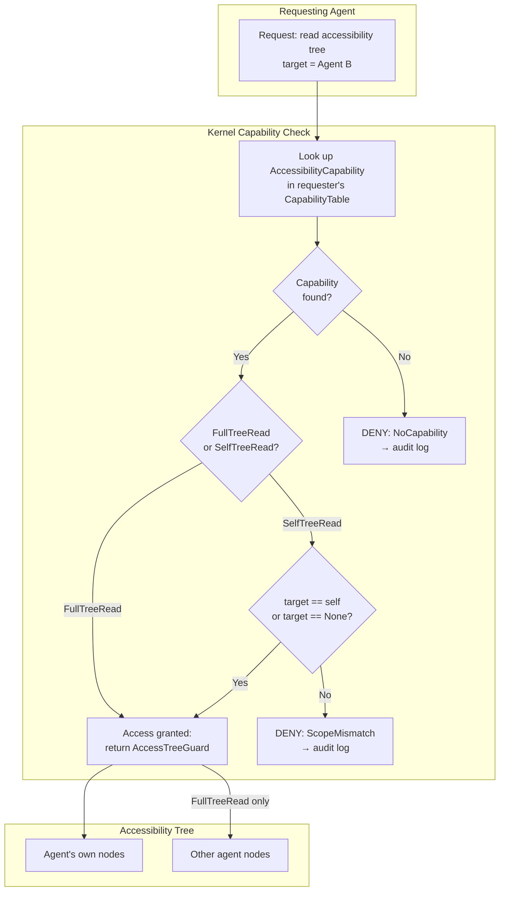

# AIOS Accessibility Security and Privacy

Part of: [accessibility.md](../accessibility.md) — Accessibility Engine
**Related:** [assistive-technology.md](./assistive-technology.md) — Core assistive technology, [system-integration.md](./system-integration.md) — Boot-time accessibility, [intelligence.md](./intelligence.md) — AI-native intelligence, [testing.md](./testing.md) — Testing strategy, [model.md](../../security/model.md) — Security model, [privacy.md](../../security/privacy.md) — Privacy architecture

-----

## 18. Security and Privacy

Accessibility APIs are a privileged attack surface. The Georgia Tech "A11y Attacks" paper documented 12 attacks across 4 platforms (Windows, macOS, Linux, Android) exploiting accessibility APIs for privilege escalation, sandbox bypass, and keystroke logging. Every attack relies on the same fundamental flaw: accessibility APIs grant broad, ambient access to UI state and input synthesis without capability-gated controls.

AIOS blocks these attacks by design. The capability system ensures that accessibility tree access, screen reader output, and synthetic input generation are all gated by explicit, attenuated capabilities — not ambient permissions granted to any process that claims to be an assistive technology.

### 18.1 Accessibility Tree Access Control

The accessibility tree contains the full semantic structure of every visible UI element: labels, roles, states, values, and relationships. On conventional platforms, any process can register as an "accessibility service" and read the entire tree for all applications. This is the root cause of attacks #1-3 in the Georgia Tech taxonomy: a malicious agent reads another application's accessibility tree to extract passwords, financial data, or private messages.

AIOS enforces per-agent isolation at the capability level. An agent can only read its own accessibility tree nodes unless it holds an explicit `AccessibilityCapability` token granted by the kernel.

```rust
/// Capability tokens for accessibility tree operations.
/// Granted by the kernel capability system (cap/ module).
/// Trust level requirements follow security/model.md §3.
#[derive(Debug, Clone, Copy, PartialEq, Eq)]
pub enum AccessibilityCapability {
    /// Read the full accessibility tree for all agents.
    /// Required trust level: TL1 (System Services only).
    /// Holders: screen reader, accessibility inspector.
    FullTreeRead,

    /// Read only the requesting agent's own accessibility subtree.
    /// Required trust level: TL2 (Native Agents) or higher.
    /// Holders: any agent that needs to introspect its own UI.
    SelfTreeRead,

    /// Write accessibility annotations (labels, hints, roles).
    /// Required trust level: TL2 (Native Agents) or higher.
    /// Holders: agents providing custom accessibility metadata.
    AnnotationWrite,

    /// Subscribe to focus change and tree mutation events.
    /// Required trust level: TL1 (System Services only).
    /// Holders: screen reader, switch scanning engine.
    TreeEventSubscribe,
}

/// Guard that enforces accessibility tree access checks.
/// Created per-request; cannot be stored or transferred.
pub struct AccessTreeGuard<'a> {
    /// The agent requesting access.
    requester_pid: ProcessId,

    /// The capability token authorizing this access.
    capability: &'a CapabilityToken,

    /// The target agent's subtree (None = full tree).
    target_scope: Option<ProcessId>,
}

impl<'a> AccessTreeGuard<'a> {
    /// Validate that the requester holds the required capability
    /// and that the access scope matches the capability's authority.
    ///
    /// Returns Ok(guard) if access is permitted, or Err with the
    /// specific denial reason for audit logging.
    pub fn check_access(
        requester: ProcessId,
        target: Option<ProcessId>,
        cap_table: &'a CapabilityTable,
    ) -> Result<Self, AccessDenied> {
        // Step 1: Find an AccessibilityCapability in the requester's table
        let cap = cap_table
            .find_capability(requester, CapabilityKind::Accessibility)
            .ok_or(AccessDenied::NoCapability)?;

        // Step 2: Check scope — SelfTreeRead cannot access other agents
        match cap.accessibility_level() {
            AccessibilityCapability::FullTreeRead => {
                // TL1 agents can read any subtree
            }
            AccessibilityCapability::SelfTreeRead => {
                if target != Some(requester) && target.is_some() {
                    return Err(AccessDenied::ScopeMismatch {
                        requested: target,
                        permitted: requester,
                    });
                }
            }
            _ => return Err(AccessDenied::InsufficientLevel),
        }

        Ok(Self {
            requester_pid: requester,
            capability: cap,
            target_scope: target,
        })
    }
}

/// Reasons an accessibility tree access request can be denied.
#[derive(Debug)]
pub enum AccessDenied {
    /// Requester holds no AccessibilityCapability token.
    NoCapability,
    /// Requester's capability scope does not cover the target agent.
    ScopeMismatch {
        requested: Option<ProcessId>,
        permitted: ProcessId,
    },
    /// Capability level insufficient for the requested operation.
    InsufficientLevel,
    /// Capability token has been revoked (cascade revocation).
    Revoked,
}
```

The following diagram shows how capability enforcement flows from an agent's accessibility tree request through the kernel capability system:



**Attack vectors blocked:**

| Georgia Tech Attack | Description | AIOS Mitigation |
|---|---|---|
| #1 Credential harvesting | Read password fields via a11y tree | SelfTreeRead cannot cross agent boundaries |
| #2 UI state exfiltration | Read other app's UI content | FullTreeRead requires TL1 (kernel-granted) |
| #3 Privilege escalation | Register as a11y service for elevated access | No ambient a11y registration; capability-gated |

### 18.2 Screen Reader Eavesdropping Prevention

Screen readers speak the text content of the focused UI element. On conventional platforms, any process can intercept TTS audio output or monitor the text being sent to the speech engine. The Georgia Tech attacks #7-8 demonstrate eavesdropping on screen reader output to capture sensitive content (emails, messages, passwords) without directly accessing the application.

AIOS routes screen reader TTS through a secure audio channel that is capability-gated and isolated from other audio sessions.

```rust
/// Secure TTS channel that prevents eavesdropping on screen reader output.
/// The audio session is capability-gated: only the screen reader process
/// and the audio mixer (TL1) can access the PCM stream.
pub struct SecureTtsChannel {
    /// Audio session dedicated to screen reader output.
    /// Created with AudioCapability::ExclusiveOutput (TL1 only).
    audio_session: AudioSessionId,

    /// The screen reader process that owns this channel.
    owner_pid: ProcessId,

    /// Timing normalization: pad inter-utterance gaps to constant duration.
    /// Prevents timing side-channel that leaks content length/structure.
    constant_rate_ms: u32,

    /// Minimum silence gap between utterances (milliseconds).
    /// Set to constant_rate_ms regardless of actual content length.
    inter_utterance_pad: u32,
}

impl SecureTtsChannel {
    /// Create a new secure TTS channel for the screen reader.
    /// Requires AudioCapability::ExclusiveOutput (TL1).
    pub fn create(
        owner: ProcessId,
        audio_cap: &CapabilityToken,
    ) -> Result<Self, SecureTtsError> {
        // Verify TL1 audio capability
        if !audio_cap.has_right(AudioRight::ExclusiveOutput) {
            return Err(SecureTtsError::InsufficientCapability);
        }

        Ok(Self {
            audio_session: AudioSessionId::new_secure(),
            owner_pid: owner,
            constant_rate_ms: 150,  // Normalize to 150ms gaps
            inter_utterance_pad: 150,
        })
    }

    /// Queue text for speech synthesis through the secure channel.
    /// The text content is NOT written to the audit log to protect
    /// the privacy of content being read aloud.
    pub fn speak(&self, text: &str, priority: TtsPriority) {
        // Audit entry records that speech occurred, not what was spoken
        audit_log(AuditEvent::TtsSpeech {
            pid: self.owner_pid,
            priority,
            text_length: text.len(),
            // Deliberately omits text content
        });

        // Route through capability-gated audio session
        self.audio_session.submit_pcm(
            self.synthesize(text),
            self.constant_rate_ms,
        );
    }
}
```

**Timing side-channel mitigation:** Without constant-rate queuing, an attacker who can observe the timing of audio output (e.g., through power analysis or audio session metadata) can infer the length and structure of content being read. By padding all inter-utterance gaps to a fixed duration, the timing channel is eliminated. The content length is logged for system diagnostics but the actual text is never persisted.

**Attack vectors blocked:**

| Georgia Tech Attack | Description | AIOS Mitigation |
|---|---|---|
| #7 TTS eavesdropping | Intercept speech engine text input | Capability-gated audio session; no ambient access |
| #8 Audio stream capture | Record screen reader audio output | SecureTtsChannel isolated from other audio sessions |

### 18.3 Accessibility Data Protection

Accessibility features generate and store several categories of data with different sensitivity levels. The data classification determines encryption, persistence, and sharing policies.

```rust
/// Classification of accessibility-related data for privacy enforcement.
/// Maps to the privacy architecture's data lifecycle model
/// (privacy/data-lifecycle.md §7).
#[derive(Debug, Clone, Copy, PartialEq, Eq)]
pub enum AccessibilityDataClass {
    /// Boot configuration: boolean flags (screen_reader_enabled, etc.).
    /// Stored in system/config/accessibility (unencrypted Space object).
    /// Non-sensitive: contains only feature toggles, no user content.
    BootConfig,

    /// User voice command history and custom command mappings.
    /// Encrypted with user identity key. Never shared cross-user.
    VoiceCommands,

    /// Switch scanning timing profiles (dwell times, scan rates).
    /// Encrypted with user identity key. Contains motor ability data.
    SwitchTimingProfile,

    /// Learned adaptations (UI simplification patterns, predicted nav).
    /// Encrypted with user identity key. Contains behavioral signals.
    LearnedAdaptation,

    /// AIRS-generated image descriptions.
    /// Ephemeral: computed on demand, never persisted to storage.
    /// Protects privacy of described visual content.
    AirsDescription,

    /// TTS audio output PCM data.
    /// Ephemeral: streamed to audio hardware, never buffered to disk.
    TtsAudioOutput,

    /// Focus prediction model weights (kernel-internal ML).
    /// Encrypted: trained from user navigation transitions (behavioral data).
    /// Per-user, never shared across users.
    FocusPredictionModel,
}

impl AccessibilityDataClass {
    /// Whether this data class requires encryption at rest.
    pub const fn requires_encryption(&self) -> bool {
        matches!(
            self,
            Self::VoiceCommands
                | Self::SwitchTimingProfile
                | Self::LearnedAdaptation
                | Self::FocusPredictionModel
        )
    }

    /// Whether this data class is persisted to storage.
    pub const fn is_persisted(&self) -> bool {
        matches!(
            self,
            Self::BootConfig
                | Self::VoiceCommands
                | Self::SwitchTimingProfile
                | Self::LearnedAdaptation
                | Self::FocusPredictionModel
        )
    }

    /// Whether this data can be shared across users on the same device.
    pub const fn is_cross_user_shareable(&self) -> bool {
        // No accessibility data is shared across users.
        // Boot config is per-device but contains no user-specific content.
        false
    }
}
```

**Data classification summary:**

| Data Type | Encrypted? | Persisted? | Shared Cross-User? | Rationale |
|---|---|---|---|---|
| Boot config (booleans) | No | Yes | No (per-device) | Feature toggles only; needed before identity unlock |
| User voice commands | Yes | Yes | No | Contains speech patterns and custom vocabulary |
| Switch timing profiles | Yes | Yes | No | Reveals motor ability characteristics |
| Learned adaptations | Yes | Yes | No | Behavioral signals about cognitive patterns |
| AIRS image descriptions | N/A | No | No | Ephemeral; protects privacy of visual content |
| TTS audio output | N/A | No | No | Streamed to hardware; never buffered |
| Focus prediction model | No | Yes | No (per-user) | Model weights contain no user content |

**Boot config special case:** The boot accessibility configuration (`BootAccessibilityConfig` from system-integration.md §8) must be readable before identity unlock. It contains only boolean flags (`screen_reader_enabled`, `high_contrast`, `switch_scanning`) and numeric values (`font_scale`, `dwell_time_ms`). No user-identifying or sensitive content is stored in boot config. This is an intentional design trade-off: accessibility must work before the user can authenticate, so the configuration that enables authentication accessibility cannot itself require authentication.

### 18.4 Synthetic Input Security

Voice control, switch scanning, and brain-computer interfaces generate synthetic input events that are injected into the compositor's input pipeline. On conventional platforms, any accessibility service can synthesize arbitrary input events — clicks, keystrokes, gestures — without restriction. The Georgia Tech attacks #10-12 demonstrate input injection via accessibility APIs to perform unauthorized actions, bypass security dialogs, and automate click fraud.

AIOS requires an explicit `CompositorCapability::SyntheticInput` token (TL1 only) for any synthetic input generation. Every synthetic event is tagged with its source and logged to the audit trail.

```rust
/// Guard that validates and logs synthetic input events
/// generated by accessibility features (voice control,
/// switch scanning, BCI).
pub struct SyntheticInputGuard {
    /// The accessibility feature generating input.
    source: SyntheticInputSource,

    /// Process ID of the accessibility service.
    owner_pid: ProcessId,

    /// Rate limiter: max 100 synthetic events per second.
    /// Prevents runaway input injection from compromised services.
    rate_limiter: RateLimiter,

    /// Capability token authorizing synthetic input.
    /// Must be CompositorCapability::SyntheticInput (TL1).
    capability: CapabilityHandle,
}

/// Source of a synthetic input event, for audit trail attribution.
#[derive(Debug, Clone, Copy, PartialEq, Eq)]
pub enum SyntheticInputSource {
    /// Voice control: user spoke a command that maps to input.
    VoiceControl,
    /// Switch scanning: user activated a switch at the highlighted item.
    SwitchScan,
    /// Brain-computer interface: neural signal decoded to input.
    BrainComputerInterface,
    /// Automated testing (TL1 only, disabled in production builds).
    TestHarness,
}

/// Rate limiter for synthetic input events.
/// Sliding window: 100 events per 1000ms.
pub struct RateLimiter {
    /// Timestamps of recent events (circular buffer).
    window: [u64; 100],
    /// Current write index.
    index: usize,
    /// Window duration in ticks (1000 = 1 second at 1 kHz).
    window_ticks: u64,
}

impl SyntheticInputGuard {
    /// Create a guard for synthetic input generation.
    /// Requires CompositorCapability::SyntheticInput (TL1 only).
    pub fn new(
        source: SyntheticInputSource,
        owner: ProcessId,
        cap: CapabilityHandle,
        cap_table: &CapabilityTable,
    ) -> Result<Self, SyntheticInputError> {
        // Verify the capability is valid and has SyntheticInput right
        let token = cap_table
            .get(owner, cap)
            .ok_or(SyntheticInputError::NoCapability)?;

        if !token.has_right(CompositorRight::SyntheticInput) {
            return Err(SyntheticInputError::InsufficientCapability);
        }

        if token.is_revoked() {
            return Err(SyntheticInputError::Revoked);
        }

        Ok(Self {
            source,
            owner_pid: owner,
            rate_limiter: RateLimiter::new(100, 1000),
            capability: cap,
        })
    }

    /// Validate a synthetic input event and log it to the audit trail.
    /// Returns Ok if the event is permitted, Err if rate-limited or
    /// the capability has been revoked since guard creation.
    pub fn validate_and_log(
        &mut self,
        event: &InputEvent,
        tick: u64,
    ) -> Result<(), SyntheticInputError> {
        // Check rate limit
        if !self.rate_limiter.check(tick) {
            audit_log(AuditEvent::SyntheticInputRateLimited {
                pid: self.owner_pid,
                source: self.source,
                event_type: event.event_type(),
            });
            return Err(SyntheticInputError::RateLimited);
        }

        // Log the synthetic event (always, for forensic reconstruction)
        audit_log(AuditEvent::SyntheticInput {
            pid: self.owner_pid,
            source: self.source,
            event_type: event.event_type(),
            target_surface: event.target_surface(),
            timestamp: tick,
        });

        Ok(())
    }
}
```

**Rate limiting rationale:** The 100 events/second cap is derived from human input rates. A fast typist produces approximately 80 keystrokes per second at peak burst. Switch scanning operates at 1-5 events per second. Voice commands produce 1-3 events per command. The 100/s limit accommodates burst typing via voice dictation while preventing automated click flood attacks. If a legitimate accessibility feature needs higher rates (e.g., continuous mouse tracking for head-pointer control), the rate limit can be raised via an attenuated capability with a higher `max_rate` field.

**Attack vectors blocked:**

| Georgia Tech Attack | Description | AIOS Mitigation |
|---|---|---|
| #10 Input injection | Synthesize clicks on security dialogs | SyntheticInput requires TL1 capability |
| #11 Click fraud | Automated ad clicking via a11y input | Rate limiting + full audit trail |
| #12 Keystroke synthesis | Type commands as another user | Source attribution; synthetic events tagged |

-----

## 19. Cross-Reference Index

Every accessibility section references and is referenced by other architecture documents. This index maps the relationships for navigation and consistency validation.

| Section | Related Documents |
|---|---|
| §1 Overview | `experience/experience.md`, `project/architecture.md` §7.6 |
| §2 Architecture | `platform/compositor.md` §9, `applications/interface-kit/accessibility.md` §12 |
| §3 Screen Reader | `platform/audio/subsystem.md` §3, `kernel/boot/accessibility.md` §19 |
| §4 Braille Display | `platform/usb/device-classes.md` §4.7, `platform/input/devices.md` §3.5 |
| §5 Switch Scanning | `platform/input/devices.md` §3.5, `platform/input/events.md` §4 |
| §6 High Contrast | `platform/compositor/rendering.md` §5, `platform/gpu/rendering.md` §11 |
| §7 Voice Control | `platform/input/ai.md` §10.7, `intelligence/airs/intelligence-services.md` §5 |
| §8 Boot-Time Accessibility | `kernel/boot/accessibility.md` §19, `kernel/boot/services.md` §4-5 |
| §9 Accessibility Tree | `platform/compositor/security.md` §11, `applications/interface-kit/accessibility.md` §12 |
| §10 AIRS Enhancement | `intelligence/airs/inference.md` §3, `intelligence/airs/intelligence-services.md` §5 |
| §11 No-AIRS Fallback | `intelligence/airs.md` §2, `kernel/boot/accessibility.md` §19 |
| §12 Implementation Order | `platform/subsystem-framework.md` §5, `platform/input/integration.md` §6 |
| §13 Design Principles | `platform/posix.md` §9, `platform/linux-compat/syscall-translation.md` §5 |
| §14 Kernel-Internal ML | `intelligence/behavioral-monitor/detection.md` §4, `kernel/scheduler.md` §16 |
| §15 AIRS-Dependent Intelligence | `intelligence/airs/intelligence-services.md` §5, `intelligence/context-engine.md` §4 |
| §16 Testing Strategy | `security/fuzzing/tooling.md` §6, `security/static-analysis.md` |
| §17 Future Directions | `platform/input/future.md` §11, `platform/wireless/bluetooth.md` §4.6 |
| §18 Security and Privacy | `security/model.md` §3, `security/privacy.md` §5, `security/adversarial-defense/threat-model.md` §2 |
| §19 Cross-Reference Index | All documents listed in this table |

**Bidirectional references:** The following architecture documents reference the accessibility engine and should be updated when accessibility design changes:

| Document | Section | Reference Type |
|---|---|---|
| `platform/compositor/security.md` | §11 Accessibility | Compositor exposes tree to screen reader |
| `platform/input/devices.md` | §3.5 Accessibility devices | Switch interfaces, sip-puff controllers |
| `platform/input/ai.md` | §10.7 Accessibility ML | Predictive input for motor impairment |
| `platform/usb/device-classes.md` | §4.7 Accessibility | Braille displays, switch arrays |
| `platform/audio/subsystem.md` | §3 Sessions | Screen reader audio session routing |
| `kernel/boot/accessibility.md` | §19-21 | First-frame accessibility guarantee |
| `security/privacy.md` | §5 Sensor privacy | Microphone for voice control |
| `intelligence/airs/intelligence-services.md` | §5 | Image description, UI simplification |
| `platform/wireless/bluetooth.md` | §4.6 LE Audio | Hearing aid streaming profile |
| `experience/experience.md` | Accessibility section | Top-level experience architecture |
