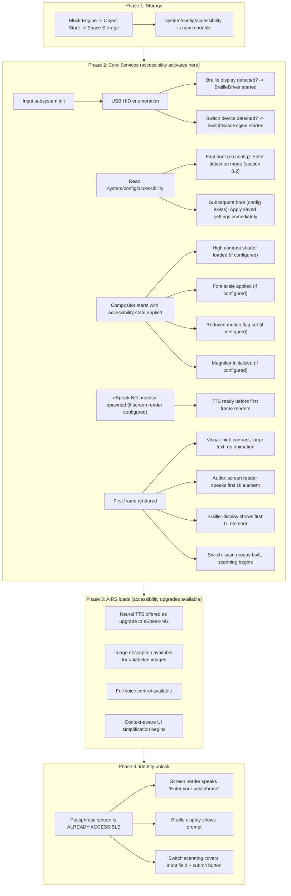
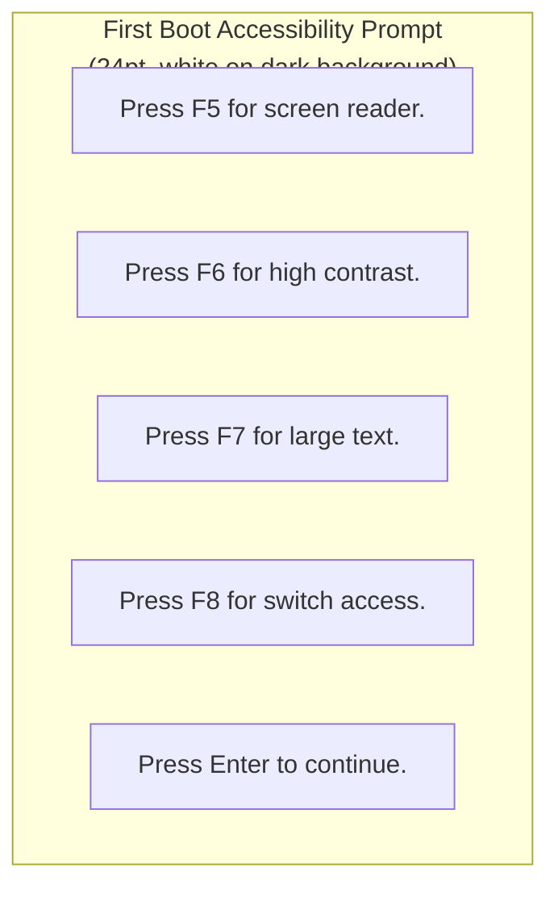
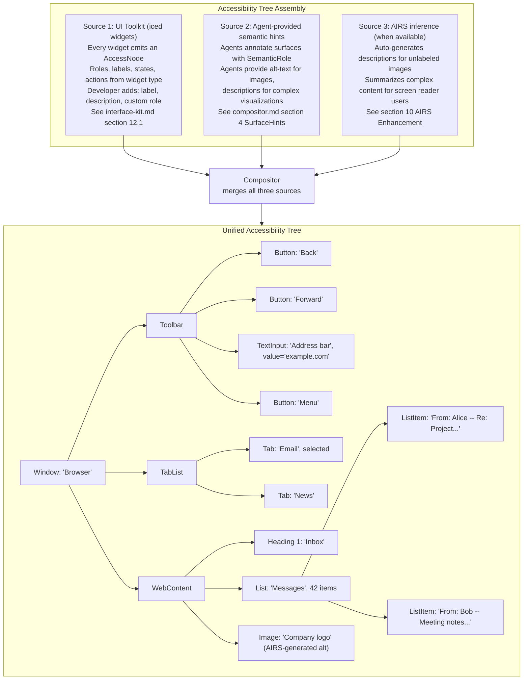

# AIOS Accessibility System Integration

Part of: [accessibility.md](../accessibility.md) — Accessibility Engine
**Related:** [assistive-technology.md](./assistive-technology.md) — Screen reader, Braille, switch scanning, [ai-enhancement.md](./ai-enhancement.md) — AIRS enhancement layer, [security.md](./security.md) — Security and privacy, [boot/accessibility.md](../../kernel/boot/accessibility.md) — Boot accessibility

-----

## 8. Boot-Time Accessibility

### 8.1 First Frame Guarantee

The first frame displayed by AIOS is accessible. This is not aspirational — it is an architectural requirement enforced by the boot sequence. The compositor reads `system/config/accessibility` during Phase 2 (before identity unlock) and applies all configured features before rendering anything to the display.



### 8.2 First-Boot Detection Mode

On the very first boot, no accessibility configuration exists. The system must detect whether the user needs accessibility features without requiring them to navigate a settings menu. This is handled by the accessibility detection step described in [boot/accessibility.md](../../kernel/boot/accessibility.md) §19.1:

```rust
impl BootAccessibilityConfig {
    /// Hardware detection for first boot.
    /// Runs before any UI is displayed.
    pub fn detect_hardware() -> Self {
        let mut config = Self::default();

        // Check USB for assistive devices
        if usb_has_braille_display() {
            config.braille_display = true;
            config.screen_reader = true;   // Braille users typically also want speech
        }

        if usb_has_switch_device() {
            config.switch_access = true;
        }

        // Check for held keys (user pressing F5/F6/F7 during boot)
        if keyboard_held(Key::F5) {
            config.screen_reader = true;
        }
        if keyboard_held(Key::F6) {
            config.high_contrast = true;
        }
        if keyboard_held(Key::F7) {
            config.large_text = true;
        }

        config
    }
}
```

The first frame always displays the accessibility options prompt in large, high-contrast text (24pt, white on dark background) regardless of configuration. This ensures the prompt is readable even for users with moderate vision impairment who haven't yet enabled accessibility:



If a screen reader is already active (F5 was held during boot, or a Braille display was detected), this prompt is spoken aloud.

### 8.3 Accessibility Persistence

Once set, accessibility configuration persists across reboots without requiring identity unlock. The config is stored unencrypted in `system/config/accessibility` — it contains no personal data, only feature flags and basic parameters.

```rust
/// Boot-time accessibility config.
/// Stored unencrypted — must be readable before identity unlock.
/// This is the extended post-boot config used by the Accessibility Manager.
/// The minimal boot-time version is defined in kernel/boot/accessibility.md §19.3.
pub struct BootAccessibilityConfig {
    // --- Core flags (match boot/accessibility.md §19.3) ---
    screen_reader: bool,
    high_contrast: bool,
    large_text: bool,
    reduced_motion: bool,
    braille_display: bool,
    switch_access: bool,
    tts_voice: TtsVoice,           // eSpeak variant
    tts_rate: f32,                 // speech rate multiplier
    preferred_language: String,     // for TTS

    // --- Extended fields (Accessibility Manager additions) ---
    magnification: bool,
    magnification_level: f32,
    tts_pitch: f32,                // pitch multiplier (0.5 - 2.0)
    tts_volume: f32,               // volume (0.0 - 1.0)
    contrast_scheme: ContrastScheme,
    scan_mode: Option<ScanMode>,
    scan_interval_ms: u32,         // auto-scan timing
}
```

This config is separate from the user's encrypted preference space. After identity unlock, the Preference Service (see [preferences.md](../../intelligence/preferences.md)) loads richer accessibility preferences that can override boot config values. The boot config is the minimum viable state that ensures accessibility is active before anything else.

-----

## 9. Accessibility Tree

### 9.1 Architecture

The accessibility tree is the central data structure that connects assistive technology to the UI. It is a parallel representation of the visual UI, carrying semantic information rather than pixel data. The tree is built from three sources:



### 9.2 Tree Protocol

The accessibility tree is communicated from agents to the compositor via IPC. Each agent maintains its own subtree and sends updates when the UI changes:

```rust
/// Messages from agents to the Accessibility Manager
pub enum AccessTreeUpdate {
    /// Full tree replacement (on surface creation or major UI change)
    SetTree {
        surface: SurfaceId,
        root: AccessNode,
    },

    /// Incremental update (node changed)
    UpdateNode {
        surface: SurfaceId,
        node_id: AccessNodeId,
        changes: AccessNodeDelta,
    },

    /// Node added to tree
    InsertNode {
        surface: SurfaceId,
        parent: AccessNodeId,
        index: usize,
        node: AccessNode,
    },

    /// Node removed from tree
    RemoveNode {
        surface: SurfaceId,
        node_id: AccessNodeId,
    },

    /// Focus moved to a node
    SetFocus {
        surface: SurfaceId,
        node_id: AccessNodeId,
    },
}

pub struct AccessNodeDelta {
    name: Option<String>,
    description: Option<String>,
    value: Option<String>,
    state: Option<AccessState>,
    bounds: Option<Rect>,
}

pub struct AccessState {
    pub checked: Option<bool>,      // for checkboxes, radio buttons
    pub expanded: Option<bool>,     // for collapsible sections
    pub selected: bool,
    pub disabled: bool,
    pub required: bool,
    pub readonly: bool,
    pub busy: bool,                 // loading state
    pub live_region: Option<LiveRegion>,  // for dynamic content
}

pub enum LiveRegion {
    /// Polite: announce when idle (e.g., search result count)
    Polite,
    /// Assertive: announce immediately (e.g., error messages)
    Assertive,
    /// Off: do not announce changes
    Off,
}
```

### 9.3 Agent Developer Requirements

The UI toolkit handles most accessibility automatically. When a developer creates a button with text, the accessibility tree automatically contains a Button node with the text as its label. However, some cases require explicit developer annotation:

```rust
// Good: label is automatic from text content
button("Save Document").on_press(Message::Save)
// Accessibility tree: Button { label: "Save Document", action: Click }

// Good: image with alt text
image(handle).alt("Pie chart showing 60% complete")
// Accessibility tree: Image { label: "Pie chart showing 60% complete" }

// Bad: icon button without label — screen reader says "button"
button(icon(Icon::Save)).on_press(Message::Save)

// Fixed: icon button with accessible label
button(icon(Icon::Save))
    .on_press(Message::Save)
    .accessible_label("Save Document")
// Accessibility tree: Button { label: "Save Document", action: Click }

// Custom widget with explicit accessibility
canvas(|frame| { /* custom drawing */ })
    .accessible_role(AccessRole::Image)
    .accessible_label("Network traffic graph")
    .accessible_description("Line graph showing inbound and outbound traffic over the last hour")
```

The SDK linter (run via `aios agent audit`) warns about accessibility issues: icon buttons without labels, images without alt text, custom widgets without roles. Agents published to the Agent Store must pass the accessibility audit.
