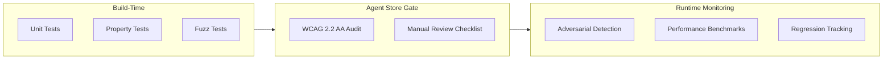
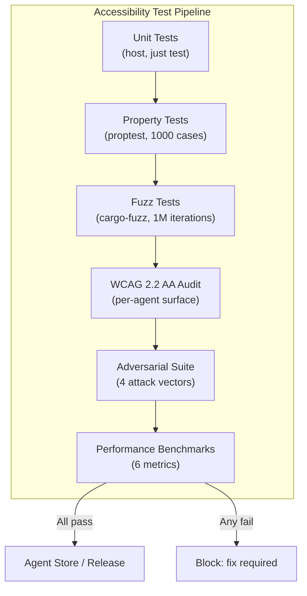

# AIOS Accessibility Testing Strategy

Part of: [accessibility.md](../accessibility.md) — Accessibility Engine
**Related:** [assistive-technology.md](./assistive-technology.md) — Core assistive technology, [system-integration.md](./system-integration.md) — System integration, [intelligence.md](./intelligence.md) — AI-native intelligence, [security.md](./security.md) — Security and privacy

-----

## 16. Testing Strategy

Accessibility testing in AIOS combines three complementary approaches: property-based invariant checking that catches structural violations at scale, automated WCAG 2.2 AA compliance auditing that covers ~70% of success criteria mechanically, and adversarial testing that validates the security boundary between agents' accessibility trees. Together, these form a continuous assurance pipeline that runs at build time, at agent publication time (Agent Store gate), and at runtime via the Inspector dashboard.



-----

### 16.1 Unit Testing

Each accessibility feature has focused unit tests that verify correctness at the component level. These tests run on the host target during `just test` and do not require QEMU.

```rust
/// TTS phoneme output verification.
/// Ensures the eSpeak-NG pipeline produces correct phoneme sequences
/// for known input strings across supported languages.
#[cfg(test)]
mod tts_tests {
    use super::*;

    #[test]
    fn phoneme_output_english() {
        let engine = EspeakEngine::new(Language::English);
        let phonemes = engine.text_to_phonemes("Hello world");
        assert!(!phonemes.is_empty());
        // eSpeak-NG produces IPA-like output
        assert!(phonemes.contains("hɛ"));
        assert!(phonemes.contains("wɜː"));
    }

    #[test]
    fn speech_queue_priority_ordering() {
        let mut queue = SpeechQueue::new();
        queue.enqueue("normal text", SpeechPriority::Normal);
        queue.enqueue("alert!", SpeechPriority::Alert);
        queue.enqueue("status update", SpeechPriority::Status);

        // Alerts always dequeue first, then normal, then status
        assert_eq!(queue.dequeue().unwrap().priority, SpeechPriority::Alert);
        assert_eq!(queue.dequeue().unwrap().priority, SpeechPriority::Normal);
        assert_eq!(queue.dequeue().unwrap().priority, SpeechPriority::Status);
    }
}

/// Braille cell encoding verification.
/// Validates Unicode Braille Pattern mapping (U+2800..U+28FF)
/// and contracted Braille grade 2 output.
#[cfg(test)]
mod braille_tests {
    use super::*;

    #[test]
    fn braille_cell_encoding_ascii() {
        let translator = BrailleTranslator::new(BrailleGrade::Grade1);
        let cells = translator.translate("abc");
        // Grade 1: a=dot1, b=dot1+2, c=dot1+4
        assert_eq!(cells[0], BrailleCell::from_dots(&[1]));
        assert_eq!(cells[1], BrailleCell::from_dots(&[1, 2]));
        assert_eq!(cells[2], BrailleCell::from_dots(&[1, 4]));
    }

    #[test]
    fn braille_cell_unicode_roundtrip() {
        let cell = BrailleCell::from_dots(&[1, 2, 4, 5]);
        let unicode = cell.to_unicode();
        assert!(unicode >= '\u{2800}' && unicode <= '\u{28FF}');
        let decoded = BrailleCell::from_unicode(unicode);
        assert_eq!(cell, decoded);
    }
}

/// Scan timing accuracy verification.
/// Switch scanning must maintain configurable dwell times
/// within 5ms tolerance for motor-impaired users.
#[cfg(test)]
mod scan_tests {
    use super::*;

    #[test]
    fn scan_dwell_time_bounds() {
        let config = ScanConfig {
            dwell_ms: 1000,
            auto_scan: true,
            scan_direction: ScanDirection::RowColumn,
        };
        let engine = SwitchScanEngine::new(config);
        // Dwell time must be within 5ms of configured value
        let actual = engine.effective_dwell_ms();
        assert!((actual as i64 - 1000i64).unsigned_abs() <= 5);
    }
}

/// Contrast ratio calculation verification.
/// Uses WCAG relative luminance formula:
/// L = 0.2126*R + 0.7152*G + 0.0722*B (linearized sRGB)
#[cfg(test)]
mod contrast_tests {
    use super::*;

    #[test]
    fn contrast_black_on_white() {
        let ratio = contrast_ratio(Color::WHITE, Color::BLACK);
        assert!((ratio - 21.0).abs() < 0.1); // Maximum contrast is 21:1
    }

    #[test]
    fn contrast_wcag_aa_threshold() {
        let fg = Color::from_rgb(0x76, 0x76, 0x76); // Gray
        let bg = Color::WHITE;
        let ratio = contrast_ratio(fg, bg);
        assert!(ratio >= 4.5, "WCAG AA requires >= 4.5:1, got {ratio:.2}:1");
    }

    #[test]
    fn contrast_symmetric() {
        let a = Color::from_rgb(0x33, 0x66, 0x99);
        let b = Color::from_rgb(0xFF, 0xCC, 0x00);
        assert_eq!(contrast_ratio(a, b), contrast_ratio(b, a));
    }
}
```

Struct invariants enforced by unit tests:

| Struct | Invariant | Test |
|---|---|---|
| `AccessNode` | Always has a non-empty `role` field | `access_node_requires_role` |
| `SpeechQueue` | Alert > Normal > Status priority ordering | `speech_queue_priority_ordering` |
| `BrailleCell` | Dot pattern fits in 8 bits (dots 1-8) | `braille_cell_dot_range` |
| `ScanGroup` | Contains at least one interactive element | `scan_group_nonempty` |
| `FocusRing` | No duplicate entries, circular traversal | `focus_ring_no_duplicates` |
| `AccessibilityConfig` | Font scale in range 1.0..5.0 | `config_font_scale_bounds` |

-----

### 16.2 Integration Testing

Integration tests verify end-to-end pipelines where multiple accessibility components interact. These run in QEMU and validate observable behavior.

**Test 1: Accessibility tree change triggers TTS output**

A UI element gains focus. The compositor updates the accessibility tree. The screen reader engine detects the change, extracts the accessible name and role, and enqueues a speech utterance. The test verifies that the correct text reaches the audio subsystem within the latency budget.

```rust
/// Integration test: tree mutation → TTS pipeline.
/// Verifies that an accessibility tree focus change produces
/// the correct speech output within 10ms.
fn test_tree_change_triggers_tts() {
    let mut tree = AccessibilityTree::new();
    let button = tree.add_node(AccessNode {
        role: Role::Button,
        name: "Submit".into(),
        ..Default::default()
    });

    let mut reader = ScreenReaderEngine::new(TtsEngine::EspeakNg);
    reader.attach_tree(&tree);

    // Simulate focus moving to the button
    tree.set_focus(button);

    // Drain the speech queue — should contain "Submit, button"
    let utterance = reader.next_utterance();
    assert!(utterance.text.contains("Submit"));
    assert!(utterance.text.contains("button"));
}
```

**Test 2: Braille display update latency**

When focus changes in the accessibility tree, the Braille display driver must receive updated cell data within 5ms. The test measures elapsed time from `set_focus()` to `BrailleDriver::cells_updated()`.

**Test 3: Switch selection triggers action**

The scan engine highlights a group, then an element. When the user activates the switch, the highlighted element's default action executes. The test verifies that a button click handler fires after the scan-select sequence.

**Test 4: Boot accessibility detection persists**

On first boot with a Braille display connected, the system detects the device, enables screen reader mode, and writes the configuration to `system/config/accessibility`. On the next boot (simulated by re-reading config), the same settings apply without re-detection.

```rust
/// Integration test: boot detection → config persistence.
fn test_boot_accessibility_persistence() {
    // Simulate first boot with Braille display connected
    let detected = BootAccessibilityConfig::detect_hardware();
    assert!(detected.braille_display_present);
    assert!(detected.screen_reader_enabled);

    // Write to storage
    let space = SpaceStorage::open("system/config/accessibility");
    space.write_config(&detected);

    // Simulate second boot — read from storage
    let loaded = space.read_config::<BootAccessibilityConfig>();
    assert_eq!(loaded.screen_reader_enabled, detected.screen_reader_enabled);
    assert_eq!(loaded.braille_display_present, detected.braille_display_present);
}
```

-----

### 16.3 Property-Based Testing

Property-based testing is the core innovation in AIOS accessibility assurance. Rather than testing specific scenarios, the system generates random UI trees and verifies that structural invariants hold for all of them. This catches classes of bugs that scenario-based tests miss — for example, a focus trap that only appears when three nested dialogs are open simultaneously.

Five invariants define the accessibility contract. Every agent surface must satisfy all five before publication in the Agent Store, and the compositor continuously spot-checks them at runtime.

```rust
/// Accessibility invariant checker.
/// Generates random UI trees via proptest and verifies
/// that all five structural invariants hold.
pub struct AccessibilityInvariantChecker {
    /// Maximum tree depth for generated test cases
    max_depth: usize,

    /// Maximum number of nodes per generated tree
    max_nodes: usize,

    /// WCAG conformance level to check against
    conformance_level: WcagLevel,
}

impl AccessibilityInvariantChecker {
    pub fn new() -> Self {
        Self {
            max_depth: 16,
            max_nodes: 512,
            conformance_level: WcagLevel::AA,
        }
    }

    /// Run all five invariants against a generated accessibility tree.
    /// Returns a list of violations (empty = all pass).
    pub fn check_all_invariants(
        &self,
        tree: &AccessibilityTree,
    ) -> Vec<InvariantViolation> {
        let mut violations = Vec::new();
        violations.extend(self.check_keyboard_reachability(tree));
        violations.extend(self.check_no_focus_traps(tree));
        violations.extend(self.check_contrast_ratios(tree));
        violations.extend(self.check_accessible_names(tree));
        violations.extend(self.check_focus_order(tree));
        violations
    }

    /// Invariant 1: Every interactive element is keyboard-reachable.
    /// Traverse the full tree. For every node with an interactive role
    /// (Button, Link, TextInput, Checkbox, etc.), verify that the
    /// tab order includes it.
    pub fn check_keyboard_reachability(
        &self,
        tree: &AccessibilityTree,
    ) -> Vec<InvariantViolation> {
        let tab_order = tree.compute_tab_order();
        let tab_set: HashSet<NodeId> = tab_order.iter().copied().collect();
        let mut violations = Vec::new();

        for node in tree.iter() {
            if node.role.is_interactive() && !tab_set.contains(&node.id) {
                violations.push(InvariantViolation {
                    invariant: Invariant::KeyboardReachable,
                    node_id: node.id,
                    message: format!(
                        "Interactive element '{}' (role={:?}) not in tab order",
                        node.name, node.role
                    ),
                });
            }
        }
        violations
    }

    /// Invariant 2: Focus is never trapped.
    /// Starting from any focused element, pressing Tab repeatedly
    /// must eventually cycle back to the starting element. The cycle
    /// length must not exceed the total number of interactive elements.
    pub fn check_no_focus_traps(
        &self,
        tree: &AccessibilityTree,
    ) -> Vec<InvariantViolation> {
        let tab_order = tree.compute_tab_order();
        if tab_order.is_empty() {
            return Vec::new();
        }

        let max_steps = tab_order.len();
        let mut violations = Vec::new();

        for &start in &tab_order {
            let mut current = start;
            let mut steps = 0;

            loop {
                current = tree.next_tab_stop(current);
                steps += 1;
                if current == start {
                    break; // Successfully cycled back
                }
                if steps > max_steps {
                    violations.push(InvariantViolation {
                        invariant: Invariant::NoFocusTrap,
                        node_id: start,
                        message: format!(
                            "Focus trapped: {} Tab presses from node {} \
                             did not cycle back",
                            steps, start.0
                        ),
                    });
                    break;
                }
            }
        }
        violations
    }

    /// Invariant 3: Contrast ratio >= 4.5:1 for all text (WCAG AA).
    /// For every text node, compute the contrast ratio between its
    /// foreground color and the effective background color (walking
    /// up the tree to find the nearest opaque background).
    pub fn check_contrast_ratios(
        &self,
        tree: &AccessibilityTree,
    ) -> Vec<InvariantViolation> {
        let mut violations = Vec::new();
        let threshold = match self.conformance_level {
            WcagLevel::A => 3.0,    // Large text minimum
            WcagLevel::AA => 4.5,   // Normal text minimum
            WcagLevel::AAA => 7.0,  // Enhanced contrast
        };

        for node in tree.iter() {
            if !node.role.has_text_content() {
                continue;
            }
            let fg = node.computed_foreground();
            let bg = tree.effective_background(node.id);
            let ratio = contrast_ratio(fg, bg);

            if ratio < threshold {
                violations.push(InvariantViolation {
                    invariant: Invariant::ContrastRatio,
                    node_id: node.id,
                    message: format!(
                        "Contrast {ratio:.2}:1 < {threshold}:1 for '{}' \
                         (fg=#{:06X}, bg=#{:06X})",
                        node.name,
                        fg.to_rgb(),
                        bg.to_rgb(),
                    ),
                });
            }
        }
        violations
    }

    /// Invariant 4: Every element with a role has a non-empty accessible name.
    /// Elements without names are invisible to screen readers. Decorative
    /// elements (role=None or role=Presentation) are excluded.
    pub fn check_accessible_names(
        &self,
        tree: &AccessibilityTree,
    ) -> Vec<InvariantViolation> {
        let mut violations = Vec::new();

        for node in tree.iter() {
            if node.role == Role::None || node.role == Role::Presentation {
                continue;
            }
            if node.name.is_empty() && node.label_source == LabelSource::None {
                violations.push(InvariantViolation {
                    invariant: Invariant::AccessibleName,
                    node_id: node.id,
                    message: format!(
                        "Node {:?} (role={:?}) has no accessible name",
                        node.id, node.role
                    ),
                });
            }
        }
        violations
    }

    /// Invariant 5: Focus order matches visual order.
    /// The tab sequence should follow reading order (left-to-right,
    /// top-to-bottom for LTR locales). Deviations greater than one
    /// visual row are flagged as potential surprises for users.
    pub fn check_focus_order(
        &self,
        tree: &AccessibilityTree,
    ) -> Vec<InvariantViolation> {
        let tab_order = tree.compute_tab_order();
        let mut violations = Vec::new();

        for window in tab_order.windows(2) {
            let current = tree.get_node(window[0]);
            let next = tree.get_node(window[1]);

            if let (Some(cur_bounds), Some(nxt_bounds)) =
                (current.bounds, next.bounds)
            {
                // Next element should be to the right or below
                let visual_before = nxt_bounds.y < cur_bounds.y
                    || (nxt_bounds.y == cur_bounds.y
                        && nxt_bounds.x < cur_bounds.x);
                // Allow wrapping: next row starts at left edge
                let row_wrap = nxt_bounds.y > cur_bounds.y
                    && nxt_bounds.x < cur_bounds.x;

                if visual_before && !row_wrap {
                    violations.push(InvariantViolation {
                        invariant: Invariant::FocusOrder,
                        node_id: window[1],
                        message: format!(
                            "Focus jumps backward: ({},{}) -> ({},{})",
                            cur_bounds.x, cur_bounds.y,
                            nxt_bounds.x, nxt_bounds.y,
                        ),
                    });
                }
            }
        }
        violations
    }
}

/// Violation record produced by invariant checks.
#[derive(Debug, Clone)]
pub struct InvariantViolation {
    /// Which invariant was violated
    pub invariant: Invariant,

    /// The node that triggered the violation
    pub node_id: NodeId,

    /// Human-readable description of the violation
    pub message: String,
}

/// The five accessibility invariants.
#[derive(Debug, Clone, Copy, PartialEq, Eq)]
pub enum Invariant {
    /// Every interactive element reachable via Tab
    KeyboardReachable,
    /// No focus traps — Tab always cycles
    NoFocusTrap,
    /// Contrast ratio meets WCAG threshold
    ContrastRatio,
    /// All semantic elements have accessible names
    AccessibleName,
    /// Tab order matches visual reading order
    FocusOrder,
}
```

Property-based test execution uses `proptest` to generate random accessibility trees with configurable depth, breadth, and role distribution:

```rust
#[cfg(test)]
mod property_tests {
    use proptest::prelude::*;
    use super::*;

    /// Generate a random accessibility tree with up to 128 nodes.
    fn arb_access_tree() -> impl Strategy<Value = AccessibilityTree> {
        (1..128usize).prop_flat_map(|node_count| {
            prop::collection::vec(arb_access_node(), node_count)
                .prop_map(|nodes| AccessibilityTree::from_nodes(nodes))
        })
    }

    proptest! {
        /// All interactive elements must be keyboard-reachable
        /// in any randomly generated UI tree.
        #[test]
        fn all_interactive_elements_reachable(
            tree in arb_access_tree()
        ) {
            let checker = AccessibilityInvariantChecker::new();
            let violations = checker.check_keyboard_reachability(&tree);
            prop_assert!(
                violations.is_empty(),
                "Unreachable elements: {:?}",
                violations
            );
        }

        /// Focus must never be trapped in any generated tree.
        #[test]
        fn focus_never_trapped(tree in arb_access_tree()) {
            let checker = AccessibilityInvariantChecker::new();
            let violations = checker.check_no_focus_traps(&tree);
            prop_assert!(
                violations.is_empty(),
                "Focus traps: {:?}",
                violations
            );
        }

        /// Every semantic element must have an accessible name.
        #[test]
        fn all_elements_have_names(tree in arb_access_tree()) {
            let checker = AccessibilityInvariantChecker::new();
            let violations = checker.check_accessible_names(&tree);
            prop_assert!(
                violations.is_empty(),
                "Missing names: {:?}",
                violations
            );
        }
    }
}
```

-----

### 16.4 WCAG 2.2 AA Compliance Validation

WCAG 2.2 is now ISO/IEC 40500:2025 — the formal international standard for web content accessibility. AIOS adopts WCAG 2.2 AA as its compliance benchmark for all agent surfaces, even though AIOS is not a web browser. The success criteria map cleanly to native UI: "keyboard accessible" means Tab reaches every interactive element, "contrast minimum" means the compositor enforces color ratios, and so on.

Automated auditing covers approximately 70% of WCAG 2.2 AA success criteria. The remaining 30% require human judgment — for example, whether alt text is *meaningful* (not just present), whether focus order is *logical* (not just sequential), and whether content is *readable* (not just displayed).

```rust
/// WCAG 2.2 AA compliance auditor.
/// Runs automated checks against an agent's accessibility tree
/// and returns pass/fail/manual-review results per criterion.
pub struct WcagAudit {
    /// Target conformance level
    level: WcagLevel,

    /// Invariant checker used for structural validation
    checker: AccessibilityInvariantChecker,
}

/// Result of a single WCAG criterion check.
#[derive(Debug, Clone)]
pub struct WcagResult {
    /// WCAG criterion identifier (e.g., "1.4.3")
    pub criterion: &'static str,

    /// Short description
    pub description: &'static str,

    /// Outcome of the check
    pub outcome: WcagOutcome,

    /// Details — empty for Pass, populated for Fail/ManualReview
    pub details: Vec<String>,
}

/// Possible outcomes of a WCAG criterion check.
#[derive(Debug, Clone, Copy, PartialEq, Eq)]
pub enum WcagOutcome {
    /// Criterion satisfied by all elements
    Pass,
    /// Criterion violated by one or more elements
    Fail,
    /// Automated check not possible — requires human review
    ManualReview,
    /// Criterion not applicable to this surface
    NotApplicable,
}

impl WcagAudit {
    pub fn new(level: WcagLevel) -> Self {
        Self {
            level,
            checker: AccessibilityInvariantChecker::new(),
        }
    }

    /// Run the full WCAG 2.2 AA audit against a surface's
    /// accessibility tree. Returns one WcagResult per criterion.
    pub fn audit_surface(
        &self,
        tree: &AccessibilityTree,
    ) -> Vec<WcagResult> {
        vec![
            self.check_1_1_1_non_text_content(tree),
            self.check_1_3_1_info_and_relationships(tree),
            self.check_1_4_3_contrast_minimum(tree),
            self.check_2_1_1_keyboard(tree),
            self.check_2_4_3_focus_order(tree),
            self.check_2_4_7_focus_visible(tree),
            self.check_3_1_1_language_of_page(tree),
            self.check_4_1_2_name_role_value(tree),
        ]
    }

    fn check_1_1_1_non_text_content(
        &self,
        tree: &AccessibilityTree,
    ) -> WcagResult {
        // Check that images have alt text. Presence is automated;
        // quality (meaningful vs. empty) requires manual review.
        let images: Vec<_> = tree.iter()
            .filter(|n| n.role == Role::Image)
            .collect();

        let missing: Vec<_> = images.iter()
            .filter(|n| n.name.is_empty())
            .map(|n| format!("Image node {:?} missing alt text", n.id))
            .collect();

        if images.is_empty() {
            WcagResult {
                criterion: "1.1.1",
                description: "Non-text content",
                outcome: WcagOutcome::NotApplicable,
                details: Vec::new(),
            }
        } else if missing.is_empty() {
            WcagResult {
                criterion: "1.1.1",
                description: "Non-text content",
                outcome: WcagOutcome::ManualReview,
                details: vec![
                    "Alt text present on all images — verify quality".into()
                ],
            }
        } else {
            WcagResult {
                criterion: "1.1.1",
                description: "Non-text content",
                outcome: WcagOutcome::Fail,
                details: missing,
            }
        }
    }

    fn check_1_3_1_info_and_relationships(
        &self,
        tree: &AccessibilityTree,
    ) -> WcagResult {
        let violations: Vec<_> = tree.iter()
            .filter(|n| n.role == Role::None && n.has_children())
            .map(|n| format!("Container {:?} has no semantic role", n.id))
            .collect();

        WcagResult {
            criterion: "1.3.1",
            description: "Info and relationships",
            outcome: if violations.is_empty() {
                WcagOutcome::Pass
            } else {
                WcagOutcome::Fail
            },
            details: violations,
        }
    }

    fn check_1_4_3_contrast_minimum(
        &self,
        tree: &AccessibilityTree,
    ) -> WcagResult {
        let violations = self.checker.check_contrast_ratios(tree);
        let details: Vec<_> = violations.iter()
            .map(|v| v.message.clone())
            .collect();

        WcagResult {
            criterion: "1.4.3",
            description: "Contrast (minimum)",
            outcome: if details.is_empty() {
                WcagOutcome::Pass
            } else {
                WcagOutcome::Fail
            },
            details,
        }
    }

    fn check_2_1_1_keyboard(
        &self,
        tree: &AccessibilityTree,
    ) -> WcagResult {
        let violations = self.checker.check_keyboard_reachability(tree);
        let details: Vec<_> = violations.iter()
            .map(|v| v.message.clone())
            .collect();

        WcagResult {
            criterion: "2.1.1",
            description: "Keyboard accessible",
            outcome: if details.is_empty() {
                WcagOutcome::Pass
            } else {
                WcagOutcome::Fail
            },
            details,
        }
    }

    fn check_2_4_3_focus_order(
        &self,
        tree: &AccessibilityTree,
    ) -> WcagResult {
        let violations = self.checker.check_focus_order(tree);
        let details: Vec<_> = violations.iter()
            .map(|v| v.message.clone())
            .collect();

        // Focus order requires both automated + manual verification
        WcagResult {
            criterion: "2.4.3",
            description: "Focus order",
            outcome: if details.is_empty() {
                WcagOutcome::ManualReview
            } else {
                WcagOutcome::Fail
            },
            details: if details.is_empty() {
                vec!["Automated checks pass — verify logical order".into()]
            } else {
                details
            },
        }
    }

    fn check_2_4_7_focus_visible(
        &self,
        tree: &AccessibilityTree,
    ) -> WcagResult {
        let missing_indicator: Vec<_> = tree.iter()
            .filter(|n| n.role.is_interactive() && !n.has_focus_indicator)
            .map(|n| format!("Node {:?} has no visible focus indicator", n.id))
            .collect();

        WcagResult {
            criterion: "2.4.7",
            description: "Focus visible",
            outcome: if missing_indicator.is_empty() {
                WcagOutcome::Pass
            } else {
                WcagOutcome::Fail
            },
            details: missing_indicator,
        }
    }

    fn check_3_1_1_language_of_page(
        &self,
        tree: &AccessibilityTree,
    ) -> WcagResult {
        let has_lang = tree.root().language.is_some();

        WcagResult {
            criterion: "3.1.1",
            description: "Language of page",
            outcome: if has_lang {
                WcagOutcome::Pass
            } else {
                WcagOutcome::Fail
            },
            details: if has_lang {
                Vec::new()
            } else {
                vec!["Root node missing language attribute".into()]
            },
        }
    }

    fn check_4_1_2_name_role_value(
        &self,
        tree: &AccessibilityTree,
    ) -> WcagResult {
        let violations = self.checker.check_accessible_names(tree);
        let details: Vec<_> = violations.iter()
            .map(|v| v.message.clone())
            .collect();

        WcagResult {
            criterion: "4.1.2",
            description: "Name, role, value",
            outcome: if details.is_empty() {
                WcagOutcome::Pass
            } else {
                WcagOutcome::Fail
            },
            details,
        }
    }
}
```

WCAG 2.2 AA criteria automated testability matrix:

```text
WCAG Criterion              Automated?  Test Method
────────────────────────────────────────────────────────────
1.1.1 Non-text content      Partial     Check alt-text presence; AI quality TBD
1.3.1 Info and relationships Yes        Verify semantic roles in access tree
1.4.3 Contrast (minimum)    Yes         Compute foreground/background ratio
2.1.1 Keyboard accessible   Yes         Property: all interactive elements reachable
2.4.3 Focus order           Partial     Property + manual verification of logic
2.4.7 Focus visible         Yes         Check focus indicator rendered
3.1.1 Language of page      Yes         Check lang attribute set on root
4.1.2 Name, role, value     Yes         Property: all elements have role + name
```

**Agent Store gate**: every agent submitted to the Agent Store must pass the automated portion of `WcagAudit::audit_surface()` with zero `Fail` outcomes. Criteria marked `ManualReview` are flagged for human review during the publication process.

**Manual review checklist** for the ~30% of criteria requiring judgment:

1. Does focus order follow a logical reading sequence for the content type?
2. Are image descriptions meaningful (not just "image" or the filename)?
3. Is body text readable at the default font size?
4. Do error messages provide actionable guidance?
5. Are time limits adjustable or announced in advance?
6. Is motion/animation avoidable via reduced-motion preference?
7. Are form field labels descriptive and associated with inputs?

-----

### 16.5 Adversarial Testing

Based on the Georgia Tech "A11y Attacks" taxonomy (12 attack classes across 4 platforms), AIOS validates that accessibility APIs do not create cross-agent information leakage or enable input injection.

```rust
/// Adversarial test suite for accessibility security.
/// Each test attempts to exploit the accessibility API in a way
/// that should be blocked by the capability system.
pub struct AdversarialTestSuite {
    /// Attacker agent's process ID (low trust level)
    attacker_pid: ProcessId,

    /// Victim agent's process ID (holds sensitive data)
    victim_pid: ProcessId,
}

impl AdversarialTestSuite {
    /// Attack 1: A11y API abuse — read another agent's tree.
    /// The attacker requests the accessibility tree of the victim agent.
    /// This must fail because each agent's tree is capability-gated.
    pub fn test_cross_agent_tree_read(&self) -> TestResult {
        let result = accessibility_manager::get_tree(
            self.attacker_pid,
            self.victim_pid,
        );

        match result {
            Err(AccessibilityError::CapabilityDenied) => {
                TestResult::Pass("Cross-agent tree read correctly denied")
            }
            Ok(_) => {
                TestResult::Fail("CRITICAL: attacker read victim's a11y tree")
            }
            Err(e) => {
                TestResult::Fail(&format!("Unexpected error: {e:?}"))
            }
        }
    }

    /// Attack 2: Content injection — set misleading accessible names.
    /// The attacker attempts to modify accessible names in the victim's
    /// tree, causing the screen reader to speak attacker-controlled text.
    pub fn test_accessible_name_injection(&self) -> TestResult {
        let result = accessibility_manager::set_node_name(
            self.attacker_pid,
            NodeRef {
                owner: self.victim_pid,
                node_id: NodeId(0),
            },
            "Fake button — click to transfer funds",
        );

        match result {
            Err(AccessibilityError::CapabilityDenied) => {
                TestResult::Pass("Name injection correctly denied")
            }
            Ok(_) => {
                TestResult::Fail(
                    "CRITICAL: attacker modified victim's accessible name"
                )
            }
            Err(e) => {
                TestResult::Fail(&format!("Unexpected error: {e:?}"))
            }
        }
    }

    /// Attack 3: Timing side-channel via TTS queue.
    /// The attacker measures TTS queue timing to infer what content
    /// the victim is viewing (longer speech = more text on screen).
    /// Mitigation: TTS queue timing is not observable across agents.
    pub fn test_tts_timing_side_channel(&self) -> TestResult {
        // Attempt to observe the victim's TTS queue depth
        let result = speech_manager::get_queue_depth(
            self.attacker_pid,
            self.victim_pid,
        );

        match result {
            Err(AccessibilityError::CapabilityDenied) => {
                TestResult::Pass("TTS queue depth not observable cross-agent")
            }
            Ok(depth) => {
                TestResult::Fail(&format!(
                    "CRITICAL: leaked victim TTS queue depth: {depth}"
                ))
            }
            Err(e) => {
                TestResult::Fail(&format!("Unexpected error: {e:?}"))
            }
        }
    }

    /// Attack 4: Synthetic input injection via a11y API.
    /// The attacker attempts to send click/keystroke events to the
    /// victim's surface using accessibility APIs, bypassing the
    /// input subsystem's capability gate.
    pub fn test_synthetic_input_injection(&self) -> TestResult {
        let result = accessibility_manager::send_action(
            self.attacker_pid,
            NodeRef {
                owner: self.victim_pid,
                node_id: NodeId(0),
            },
            AccessibilityAction::Click,
        );

        match result {
            Err(AccessibilityError::CapabilityDenied) => {
                TestResult::Pass("Synthetic input injection correctly denied")
            }
            Ok(_) => {
                TestResult::Fail(
                    "CRITICAL: attacker injected input into victim's surface"
                )
            }
            Err(e) => {
                TestResult::Fail(&format!("Unexpected error: {e:?}"))
            }
        }
    }

    /// Run all adversarial tests. All must pass for the accessibility
    /// subsystem to be considered secure.
    pub fn run_all(&self) -> Vec<TestResult> {
        vec![
            self.test_cross_agent_tree_read(),
            self.test_accessible_name_injection(),
            self.test_tts_timing_side_channel(),
            self.test_synthetic_input_injection(),
        ]
    }
}
```

-----

### 16.6 Fuzz Testing

Fuzz testing targets the parsing and protocol boundaries of the accessibility subsystem — the places where malformed or adversarial input arrives from untrusted agents.

**Fuzz target 1: AccessTreeUpdate protocol messages**

The compositor receives `AccessTreeUpdate` messages from each agent describing mutations to its accessibility tree. Malformed updates (invalid node IDs, circular parent references, trees exceeding depth limits, trees with millions of nodes) must be rejected without crashing or corrupting the merged tree.

```rust
/// Fuzz target: accessibility tree update parsing.
/// Generates malformed AccessTreeUpdate messages and feeds them
/// to the tree merger. No input should cause a panic.
fn fuzz_access_tree_update(data: &[u8]) {
    if let Ok(update) = AccessTreeUpdate::deserialize(data) {
        let mut tree = AccessibilityTree::new();
        // Must not panic, must not corrupt tree
        let _ = tree.apply_update(update);
        // Post-condition: tree is still well-formed
        assert!(tree.is_well_formed());
    }
}
```

**Fuzz target 2: Braille translation input**

The Braille translator accepts Unicode strings and produces Braille cell sequences. Invalid Unicode (unpaired surrogates, overlong UTF-8 sequences), extremely long strings (1 MB+), and strings containing only combining characters must be handled gracefully.

```rust
/// Fuzz target: Braille translator.
/// No input string should cause a panic or unbounded memory allocation.
fn fuzz_braille_translation(data: &[u8]) {
    if let Ok(text) = core::str::from_utf8(data) {
        let translator = BrailleTranslator::new(BrailleGrade::Grade2);
        let cells = translator.translate(text);
        // Output length bounded by input length × contraction factor
        assert!(cells.len() <= text.len() * 2 + 16);
    }
}
```

**Fuzz target 3: Switch scanning input timing**

The switch scan engine receives timestamped activation events from the input subsystem. Fuzz inputs include sub-millisecond intervals between activations, negative time deltas (clock skew), simultaneous activations on multiple switches, and activation floods exceeding 1000 events per second.

```rust
/// Fuzz target: switch scanning timing.
/// Validates that the scan engine handles pathological timing
/// without entering an invalid state.
fn fuzz_switch_timing(data: &[u8]) {
    let mut engine = SwitchScanEngine::new(ScanConfig::default());
    let mut offset = 0;

    while offset + 8 <= data.len() {
        let timestamp = u64::from_le_bytes(
            data[offset..offset + 8].try_into().unwrap()
        );
        let _ = engine.on_switch_activate(SwitchEvent {
            timestamp_ms: timestamp,
            switch_id: SwitchId(0),
        });
        offset += 8;
    }

    // Engine must remain in a valid state
    assert!(engine.is_valid_state());
}
```

-----

### 16.7 Performance Benchmarks

Accessibility features must not introduce perceptible latency. The following targets are enforced by the benchmark suite and tracked in the Inspector dashboard as regression indicators.

```text
Metric                          Target         Measurement Method
───────────────────────────────────────────────────────────────────
TTS queuing latency             < 10ms         Tree change -> speech start
Braille update latency          < 5ms          Focus change -> cell update
Focus prediction hit rate       > 60%          After 100 interactions
Switch fatigue detection        <= 3 cycles    From drift onset to rate reduction
High contrast shader overhead   < 1ms/frame    Frame timing delta
Boot a11y detection             < 100ms        Power-on -> first accessible frame
```

```rust
/// Performance benchmark harness for accessibility features.
/// Results are compared against target thresholds and reported
/// to the Inspector dashboard for regression tracking.
pub struct AccessibilityBenchmarks;

impl AccessibilityBenchmarks {
    /// Measure TTS queuing latency: time from accessibility tree
    /// focus change to first audio sample enqueued.
    pub fn bench_tts_latency(iterations: usize) -> BenchResult {
        let mut samples = Vec::with_capacity(iterations);
        let mut tree = AccessibilityTree::new();
        let mut reader = ScreenReaderEngine::new(TtsEngine::EspeakNg);
        reader.attach_tree(&tree);

        for i in 0..iterations {
            let node = tree.add_node(AccessNode {
                role: Role::Button,
                name: format!("Button {i}"),
                ..Default::default()
            });

            let start = timestamp_ns();
            tree.set_focus(node);
            reader.process_pending();
            let end = timestamp_ns();

            samples.push(end - start);
        }

        BenchResult {
            metric: "tts_queuing_latency",
            target_ns: 10_000_000, // 10ms
            median_ns: median(&samples),
            p99_ns: percentile(&samples, 99),
            pass: percentile(&samples, 99) < 10_000_000,
        }
    }

    /// Measure Braille update latency: time from focus change
    /// to Braille display driver receiving updated cells.
    pub fn bench_braille_latency(iterations: usize) -> BenchResult {
        let mut samples = Vec::with_capacity(iterations);

        for _ in 0..iterations {
            let start = timestamp_ns();
            // Simulate focus change -> translation -> cell update
            let text = "Example text content";
            let translator = BrailleTranslator::new(BrailleGrade::Grade2);
            let _cells = translator.translate(text);
            let end = timestamp_ns();

            samples.push(end - start);
        }

        BenchResult {
            metric: "braille_update_latency",
            target_ns: 5_000_000, // 5ms
            median_ns: median(&samples),
            p99_ns: percentile(&samples, 99),
            pass: percentile(&samples, 99) < 5_000_000,
        }
    }

    /// Measure high contrast shader overhead per frame.
    pub fn bench_high_contrast_overhead(frames: usize) -> BenchResult {
        let mut baseline_samples = Vec::with_capacity(frames);
        let mut contrast_samples = Vec::with_capacity(frames);

        for _ in 0..frames {
            let start = timestamp_ns();
            render_frame(HighContrastMode::Off);
            let end = timestamp_ns();
            baseline_samples.push(end - start);

            let start = timestamp_ns();
            render_frame(HighContrastMode::On);
            let end = timestamp_ns();
            contrast_samples.push(end - start);
        }

        let baseline_median = median(&baseline_samples);
        let contrast_median = median(&contrast_samples);
        let overhead = contrast_median.saturating_sub(baseline_median);

        BenchResult {
            metric: "high_contrast_shader_overhead",
            target_ns: 1_000_000, // 1ms
            median_ns: overhead,
            p99_ns: percentile(&contrast_samples, 99)
                .saturating_sub(percentile(&baseline_samples, 99)),
            pass: overhead < 1_000_000,
        }
    }
}

/// Benchmark result for a single metric.
#[derive(Debug, Clone)]
pub struct BenchResult {
    /// Metric identifier
    pub metric: &'static str,

    /// Target threshold in nanoseconds
    pub target_ns: u64,

    /// Observed median in nanoseconds
    pub median_ns: u64,

    /// Observed 99th percentile in nanoseconds
    pub p99_ns: u64,

    /// Whether the metric meets its target
    pub pass: bool,
}
```


