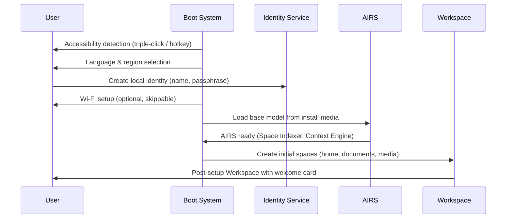

# AIOS Experience Layer

## Deep Technical Architecture

**Parent document:** [architecture.md](../project/architecture.md)
**Related:** [compositor.md](../platform/compositor.md) — Compositor and display, [airs.md](../intelligence/airs.md) — AI Runtime Service, [spaces.md](../storage/spaces.md) — Space Storage, [flow.md](../storage/flow.md) — Flow data transfer, [conversation-bar.md](../intelligence/conversation-manager/conversation-bar.md) — Conversation Bar technical spec, [context-engine.md](../intelligence/context-engine.md) — Context inference, [attention.md](../intelligence/attention.md) — Attention management, [preferences.md](../intelligence/preferences.md) — Preference system, [task-manager.md](../intelligence/task-manager.md) — Task lifecycle, [agents.md](../applications/agents.md) — Agent runtime, [inspector.md](../applications/inspector.md) — Security dashboard, [terminal.md](../applications/terminal.md) — Terminal emulator, [interface-kit.md](../applications/interface-kit.md) — Interface Kit (AIOS-native UI), [accessibility.md](./accessibility.md) — Accessibility architecture, [identity.md](./identity.md) — Identity and onboarding, [model.md](../security/model.md) — Security model, [privacy.md](../security/privacy.md) — Privacy architecture, [multi-device/experience.md](../platform/multi-device/experience.md) — Multi-device UX

-----

## Document Map

| Section | Authoritative Cross-Reference |
|---|---|
| §1 Core Insight | — |
| §2 The Five Surfaces | — |
| §3 The Workspace | [task-manager.md](../intelligence/task-manager.md), [context-engine.md](../intelligence/context-engine.md) |
| §4 The Conversation Bar | [conversation-bar.md](../intelligence/conversation-manager/conversation-bar.md) §9–§11 |
| §5 The Flow Tray | [flow.md](../storage/flow.md), [flow/integration.md](../storage/flow/integration.md) §6, [flow/history.md](../storage/flow/history.md) |
| §6 The Status Strip | [compositor/rendering.md](../platform/compositor/rendering.md) §6 |
| §7 The Attention Panel | [attention.md](../intelligence/attention.md) |
| §8 Space Navigator | [space-indexer.md](../intelligence/space-indexer.md), [spaces.md](../storage/spaces.md) |
| §9 Agent Presence | [agents.md](../applications/agents.md), [inspector.md](../applications/inspector.md) |
| §10 Provenance Everywhere | [spaces/versioning.md](../storage/spaces/versioning.md) §5 |
| §11 Context Transitions | [context-engine/signals.md](../intelligence/context-engine/signals.md), [context-engine/inference.md](../intelligence/context-engine/inference.md), [context-engine/overrides.md](../intelligence/context-engine/overrides.md) |
| §12 First Boot & Onboarding | [identity.md](./identity.md) §2, [accessibility.md](./accessibility.md), [boot/accessibility.md](../kernel/boot/accessibility.md) §19–§21 |
| §13 Settings & Preferences UX | [preferences.md](../intelligence/preferences.md), [preferences/resolution.md](../intelligence/preferences/resolution.md) §5, [preferences/temporal.md](../intelligence/preferences/temporal.md) §14 |
| §14 Multi-Device Experience | [multi-device/experience.md](../platform/multi-device/experience.md) §4.1–§4.5 |
| §15 Security UX Patterns | [model/capabilities.md](../security/model/capabilities.md) §3, [privacy.md](../security/privacy.md) |
| §16 Developer Experience | [interface-kit.md](../applications/interface-kit.md), [compositor/protocol.md](../platform/compositor/protocol.md) §4 |
| §17 Design Language | [compositor/protocol.md](../platform/compositor/protocol.md) §4, [interface-kit.md](../applications/interface-kit.md) |
| §18 What Users Never See | — |
| §19 AI-Native Experience | [airs/intelligence-services.md](../intelligence/airs/intelligence-services.md) §5, [compositor/ai-native.md](../platform/compositor/ai-native.md) §12–§13 |
| §20 Future Directions | — |
| §21 Implementation Order | — |

-----

## 1. Core Insight

Every desktop operating system presents the same model: a desktop with icons, a taskbar with running applications, a file manager with directory trees, a notification center with a list of alerts. This model was designed for a world where a computer runs isolated programs that don't know about each other and the user is the only intelligence that connects them.

AIOS doesn't have that world. AIOS has spaces instead of files, agents instead of applications, Flow instead of clipboard, context instead of explicit modes, and an AI runtime that understands what the user is doing. The GUI must reflect this fundamentally different model.

**The AIOS experience is not a reskinned Linux desktop.** There is no desktop with scattered icons. There is no Start menu with a list of installed programs. There is no file manager with a tree of directories. There is no notification center that dumps every alert into a chronological list. Every one of these is replaced by something designed for how AIOS actually works.

-----

## 1.1 Three Interaction Layers

The AIOS experience is not a single fixed UX model. It coexists in three layers, each adding intelligence on top of the previous. Users experience whichever layer their hardware and AIRS state supports. See [ADR: Three Interaction Layers](../knowledge/decisions/2026-03-16-jl-three-interaction-layers.md).

| Layer | Name | AIRS Required | What Changes |
| --- | --- | --- | --- |
| **Layer 1** | Classic Desktop | No | Traditional windows, taskbar, mouse/keyboard. The Five Surfaces (§2) render as conventional UI. No intelligence — pure compositor + input. |
| **Layer 2** | Smart Desktop | Basic AIRS (Context Engine) | Windows + AIOS intelligence: information gravity, context-aware layout, Flow integration, attention-dimming, semantic workspace switching. The Five Surfaces gain adaptive behavior. |
| **Layer 3** | Intelligence Surface | Full AIRS stack | No fixed windows. AIRS composes a generative UI per context — temporal screen, fluid layout, proactive content. The Five Surfaces dissolve into continuous intelligence. |

**Key properties:**

- **Layer 1 is always available.** If AIRS fails, crashes, or hasn't loaded yet, the user has a fully functional desktop. Layer 1 is the minimum viable compositor (Phase 7).
- **Layers coexist via weighted blending.** A user in Layer 2 might have some windows in fixed positions (Layer 1 behavior) and others in context-aware layout (Layer 2 behavior). The transition is continuous, not a mode switch.
- **Linux apps participate in Layer 1 fully, Layer 2 partially.** A Firefox window gets positioned by the context-aware layout engine in Layer 2, but its internal content is opaque to AIRS. AIOS-native apps can expose semantic hints that make Layer 2/3 more effective.
- **Layer 3 is the long-term vision** (Phase 30+). Layers 1 and 2 are the near-term deliverables.

The Five Surfaces described below are the building blocks used by all three layers. Their behavior adapts based on which layer is active.

-----

## 2. The Five Surfaces

The AIOS experience is built on five primary surfaces. Everything the user sees is one of these:

```text
┌─────────────────────────────────────────────────────────────┐
│                                                              │
│  ┌───────────────────────────────────────────────────────┐  │
│  │                    1. WORKSPACE                        │  │
│  │           The contextual home view                     │  │
│  │     What you see when you're between activities        │  │
│  └───────────────────────────────────────────────────────┘  │
│                                                              │
│  ┌───────────────────────────────────────────────────────┐  │
│  │                 2. ACTIVITY WINDOWS                     │  │
│  │    Browser, terminal, media, games, agent UIs          │  │
│  │     The actual things you're doing right now            │  │
│  └───────────────────────────────────────────────────────┘  │
│                                                              │
│  ┌───────────────────────────────────────────────────────┐  │
│  │               3. CONVERSATION BAR                      │  │
│  │       Natural language interface to everything         │  │
│  │    One gesture away, never forced, always available    │  │
│  └───────────────────────────────────────────────────────┘  │
│                                                              │
│  ┌───────────────────────────────────────────────────────┐  │
│  │                 4. FLOW TRAY                            │  │
│  │       Visual pipeline of data in transit               │  │
│  │     What's moving between spaces and agents            │  │
│  └───────────────────────────────────────────────────────┘  │
│                                                              │
│  ┌───────────────────────────────────────────────────────┐  │
│  │               5. STATUS STRIP                          │  │
│  │     System health, attention digest, context           │  │
│  │       Minimal, non-intrusive, always truthful          │  │
│  └───────────────────────────────────────────────────────┘  │
│                                                              │
└─────────────────────────────────────────────────────────────┘
```

-----

## 3. The Workspace

### 3.1 Not a Desktop

Traditional desktops show you the same thing regardless of what you're doing. Icons on a wallpaper. A taskbar. A clock. It's a static stage that never changes.

The Workspace is **contextual**. It adapts to what the Context Engine ([context-engine.md](../intelligence/context-engine.md)) infers about your current activity. It's what you see when you return to home — between activities, at the start of a session, after closing your last window.

### 3.2 Work Context

When the Context Engine detects work engagement:

```text
┌─────────────────────────────────────────────────────────────┐
│  WORKSPACE — Work                                     14:30 │
│                                                              │
│  ┌─ Active Tasks ─────────────────────────────────────────┐ │
│  │                                                         │ │
│  │  ● Review PR #427          ◐ ████░░░░░░ 40%            │ │
│  │    3 files reviewed, 2 remaining                       │ │
│  │    [Continue in Browser] [Open Terminal]                │ │
│  │                                                         │ │
│  │  ○ Write architecture doc                               │ │
│  │    Last edited 2 hours ago                              │ │
│  │    [Resume]                                             │ │
│  │                                                         │ │
│  └─────────────────────────────────────────────────────────┘ │
│                                                              │
│  ┌─ Recent Spaces ─────────────┐ ┌─ Attention ───────────┐ │
│  │                              │ │                        │ │
│  │  📁 project-alpha/          │ │  3 items since 13:00   │ │
│  │     Modified 5 min ago      │ │                        │ │
│  │     by code-assistant       │ │  ▸ Alex: meeting moved │ │
│  │                              │ │    to 16:00 (Slack)   │ │
│  │  📁 research/papers/        │ │  ▸ CI passed on main   │ │
│  │     3 new objects today     │ │  ▸ 2 emails (digest)   │ │
│  │                              │ │                        │ │
│  │  📁 notes/daily/            │ │  [See digest]          │ │
│  │     Today's note exists     │ │                        │ │
│  └──────────────────────────────┘ └────────────────────────┘ │
│                                                              │
│  ┌─ Quick Actions ────────────────────────────────────────┐ │
│  │  [New Terminal]  [Open Browser]  [Search Spaces]       │ │
│  └─────────────────────────────────────────────────────────┘ │
└─────────────────────────────────────────────────────────────┘
```

**What's different from a traditional desktop:**

- **Tasks, not applications.** You see your active tasks and their progress, not a list of running programs. The Task Manager ([task-manager.md](../intelligence/task-manager.md)) tracks what you're working on, not just what's open.
- **Spaces, not files.** Recent Spaces shows activity — what changed, what agents did, how many new objects — not just file names and modification dates.
- **Attention, not notifications.** The Attention section shows an AI-triaged digest, not a chronological dump. Three items, not thirty.
- **Context-aware actions.** Quick Actions show what's relevant right now (terminal, browser for code review), not every possible application.

### 3.3 Leisure Context

When the Context Engine detects leisure:

```text
┌─────────────────────────────────────────────────────────────┐
│  WORKSPACE — Evening                                  20:15 │
│                                                              │
│  ┌─ Continue ─────────────────────────────────────────────┐ │
│  │                                                         │ │
│  │  🎵 Album: Dark Side of the Moon — Pink Floyd          │ │
│  │     Paused at track 4 · 23:15 remaining                │ │
│  │     [Resume]                                            │ │
│  │                                                         │ │
│  │  🌐 Reading: "Attention Is All You Need" — arxiv.org   │ │
│  │     Tab open from 18:30 · scrolled to page 4           │ │
│  │     [Continue Reading]                                  │ │
│  │                                                         │ │
│  └─────────────────────────────────────────────────────────┘ │
│                                                              │
│  ┌─ Media ──────────────────┐ ┌─ Browse ──────────────────┐│
│  │                           │ │                            ││
│  │  Recent albums            │ │  Bookmarks                 ││
│  │  Recent playlists         │ │  Reading list              ││
│  │  Continue podcast         │ │  Saved articles            ││
│  │                           │ │                            ││
│  └───────────────────────────┘ └────────────────────────────┘│
│                                                              │
│  Notifications suppressed until 07:00                        │
│  (except calls from Favorites)                               │
└─────────────────────────────────────────────────────────────┘
```

**What's different:**

- The layout is sparser. Less information density. More breathing room.
- Tasks are hidden. You're not working.
- Continue section shows media and reading state — picked up from where you left off across agents.
- Notifications are suppressed. The OS tells you this explicitly so you feel safe.

### 3.4 How the Workspace Knows

The Workspace isn't hardcoded. It queries:

1. **Task Manager** ([task-manager.md](../intelligence/task-manager.md)): Active tasks, their state and progress
2. **Context Engine** ([context-engine.md](../intelligence/context-engine.md)): Work/leisure/gaming/focus context
3. **Space Storage** ([spaces.md](../storage/spaces.md)): Recently accessed spaces, modification activity
4. **Attention Manager** ([attention.md](../intelligence/attention.md)): Triaged notification digest
5. **Agent Runtime** ([agents.md](../applications/agents.md)): Running agents, their current state
6. **Media subsystem** ([audio.md](../platform/audio.md)): Now playing, queue, pause state

The Workspace is a **live view over system state**, not a static page. It updates in real-time as state changes. On multi-device setups, the Workspace reflects tasks and state from all paired devices via the Space Mesh ([multi-device/experience.md](../platform/multi-device/experience.md) §4.3).

-----

## 4. The Conversation Bar

> **Authoritative reference:** [conversation-manager/conversation-bar.md](../intelligence/conversation-manager/conversation-bar.md) contains the full technical architecture for the Conversation Bar, including compositor integration (§11.1), structured output rendering (§10), accessibility (§9.4), and multi-conversation management (§11.3). This section provides the experience-layer perspective.

### 4.1 Design Philosophy

The Conversation Bar is the single most important GUI element in AIOS. It's not a search bar (like Spotlight or Krunner) and it's not a chatbot widget. It's a **natural language command interface** that can do anything the OS can do.

**One gesture to invoke.** A swipe from the edge, a keyboard shortcut (`Super+Space`), or a tap on the Status Strip. It slides in as a panel, not a fullscreen takeover.

**Never forced.** The system never opens the Conversation Bar uninvited. Even during onboarding, it's presented as "this is here if you want it" not "you must use this." There are no mandatory tutorial conversations.

**Conversational, not form-based.** You don't fill in fields. You describe what you want. The model interprets intent and routes to the appropriate tool or response.

**Structured output, not just text.** The Conversation Bar returns interactive visual results — object cards, task progress, capability listings, data tables — not walls of text. Every response is rendered with the appropriate component for its content type.

### 4.2 Capabilities

The Conversation Bar can do anything the OS can do through natural language:

- **Space queries** — find objects by meaning, recency, agent activity, or relationships
- **Task management** — create, resume, complete, and track tasks with live progress cards
- **System control** — context overrides, audio control, network queries, agent management
- **Agent interaction** — spawn agents, delegate tasks, inspect capabilities and audit logs

The Conversation Bar also uses on-screen awareness to understand what the user is looking at, enabling requests like "explain this" or "send this to Alex" without explicit context. See [conversation-bar.md](../intelligence/conversation-manager/conversation-bar.md) §9 for the full invocation model, §10 for the structured output component registry, and §11 for compositor and context integration.

-----

## 5. The Flow Tray

> **Authoritative reference:** [flow.md](../storage/flow.md) — Flow hub with data model, transforms, history, integration, security, and SDK sub-documents.

### 5.1 What Flow Looks Like

Flow replaces the clipboard. But unlike the clipboard (which is invisible), Flow is **visible**. The Flow Tray shows data in transit between agents and spaces:

```text
┌─ FLOW TRAY ──────────────────────────────────────────────┐
│                                                           │
│  ↓ research-agent → research/papers/               now   │
│    3 PDF objects (transformer survey, attention...)       │
│    [View] [Cancel]                                        │
│                                                           │
│  ✓ Browser tab (arxiv) → research/papers/     2 min ago  │
│    Highlighted text + source URL                          │
│    [View in space]                                        │
│                                                           │
│  ◐ backup-agent → backup/daily/              in progress  │
│    47 of 312 objects synced                               │
│    [Pause] [Details]                                      │
│                                                           │
└───────────────────────────────────────────────────────────┘
```

**What's different from a clipboard:**

- **Visible.** You can see what's moving and where it's going.
- **Typed.** Flow knows it's carrying PDFs, not just bytes. It can show previews. The transform engine ([flow/transforms.md](../storage/flow/transforms.md) §4) adapts content to its destination.
- **Contextual.** Flow transforms data based on destination. Dropping rich text into a terminal strips formatting. Dropping an image into a research space adds provenance metadata.
- **Historical.** The tray shows recent transfers, not just the current one. You can grab something you flowed 10 minutes ago. History is searchable ([flow/history.md](../storage/flow/history.md) §5).
- **Bidirectional.** Flow isn't just "copy from A, paste into B." It's a pipeline. An agent can push data to your Flow, and you can route it to any destination.

### 5.2 Flow Interactions

**Drag and drop:** Drag from any surface, drop into any surface. The compositor routes through Flow ([flow/integration.md](../storage/flow/integration.md) §6). The data is capability-checked at both ends.

**Flow gestures:** Select text in the browser, flick toward the edge → appears in Flow Tray. Tap an item in Flow Tray, flick into a window → data arrives with context.

**Agent-initiated Flow:** An agent pushes results to your Flow Tray. You see a notification in the tray: "Research agent found 3 papers." You choose where they go.

**Cross-device Flow:** On device A, put something in Flow. On device B (synced via Space Mesh), it appears in your Flow Tray. Seamless cross-device data transfer without cloud intermediaries ([flow/history.md](../storage/flow/history.md) §9).

-----

## 6. The Status Strip

### 6.1 Minimal, Truthful, Non-Intrusive

The Status Strip replaces the traditional taskbar/system tray. It lives at the bottom (or top, user-configurable) and contains only essential information:

```text
┌─────────────────────────────────────────────────────────────┐
│ ● Work · 3 tasks │ 🔊 · 📶 · 🔋 78% │ Tue 14:30 │ ▲ 2  │
└─────────────────────────────────────────────────────────────┘
  ↑                  ↑                    ↑             ↑
  Context + tasks    System status        Time          Attention
                                                        badge
```

**Left: Context indicator.** Shows the current inferred context (Work, Leisure, Focus, Gaming) and active task count. Tapping opens the Workspace.

**Center: System status.** Audio, network, battery. Only shows active subsystems. No Wi-Fi icon if you're on Ethernet. No battery if you're plugged in. Shows what matters, hides what doesn't.

**Right: Time + Attention badge.** The attention badge shows how many items are waiting in the digest. Tapping opens the Attention Panel — not a notification center, but an AI-summarized digest.

The Status Strip also shows a conversation indicator for the active Conversation Bar session — a dot (idle), pulsing dot (streaming), or badge (unread tool results). See [conversation-bar.md](../intelligence/conversation-manager/conversation-bar.md) §11.3 for details.

### 6.2 No System Tray Clutter

Traditional system trays accumulate icons from every background application. AIOS has no system tray. Background agents are managed through the Workspace (running agents section) or the Conversation Bar ("what agents are running?"). The Status Strip stays clean.

-----

## 7. The Attention Panel

> **Authoritative reference:** [attention.md](../intelligence/attention.md) — full attention management architecture including scoring, routing, batching, and priority tiers.

### 7.1 Not a Notification Center

Traditional notification centers are reverse-chronological dumps. Every notification has equal visual weight. Thirty Slack messages look identical to one urgent message from your boss.

The Attention Panel is **AI-triaged**:

```text
┌─ ATTENTION ──────────────────────────────────────────────┐
│                                                           │
│  ── Since your last check (2 hours ago) ──               │
│                                                           │
│  URGENT                                                   │
│  ┌─────────────────────────────────────────────────────┐ │
│  │  Alex: "Server is down, need your help ASAP"        │ │
│  │  Slack · 15 min ago                                  │ │
│  │  [Reply] [Open Slack tab]                            │ │
│  └─────────────────────────────────────────────────────┘ │
│                                                           │
│  SUMMARY                                                  │
│  ┌─────────────────────────────────────────────────────┐ │
│  │  5 Slack messages in #engineering (none urgent)      │ │
│  │  2 emails: 1 newsletter, 1 meeting confirmation     │ │
│  │  CI: 3 builds passed, 0 failed                      │ │
│  │  backup-agent: daily backup completed (312 objects)  │ │
│  └─────────────────────────────────────────────────────┘ │
│                                                           │
│  DEFERRED                                                 │
│  ┌─────────────────────────────────────────────────────┐ │
│  │  System update available (non-urgent)                │ │
│  │  Weather: rain expected tomorrow                     │ │
│  └─────────────────────────────────────────────────────┘ │
│                                                           │
│  [Mark all seen] [Settings]                               │
│                                                           │
└───────────────────────────────────────────────────────────┘
```

**What's different:**

- **Urgency tiers.** Urgent items are visually prominent. Everything else is condensed. The Attention Manager scores each notification semantically, not just by source.
- **AI summarization.** Five Slack messages become one line: "5 Slack messages in #engineering (none urgent)." You decide if you want to read them, not the OS.
- **Since your last check.** Time-scoped, not infinite scrollback.
- **Actionable.** Every item has actions. Not just "dismiss" — actual responses.
- **Intelligent batching.** Research shows 3x/day notification batching reduces stress and improves productivity vs real-time interrupts. AIRS learns each user's optimal batch timing. Context-aware DND auto-activates during presentations and screen sharing (following the GNOME 47/48 pattern).

-----

## 8. Space Navigator

> **Authoritative reference:** [space-indexer.md](../intelligence/space-indexer.md) — semantic indexing pipeline, embedding index, full-text index, relationship graph. [spaces.md](../storage/spaces.md) — Space Storage data model.

### 8.1 Not a File Manager

AIOS has no file manager. It has a **Space Navigator** — a visual tool for exploring spaces by meaning, relationships, and activity rather than by directory path:

```text
┌─ SPACE NAVIGATOR ────────────────────────────────────────┐
│                                                           │
│  Search: [architecture design decisions        ] 🔍      │
│                                                           │
│  ┌─ Results (semantic) ──────────────────────────────┐   │
│  │                                                    │   │
│  │  📄 IPC Design Rationale          research/aios/  │   │
│  │     "Why synchronous IPC is the right choice..."  │   │
│  │     Similarity: 0.94 · Created Mon · 2,400 words  │   │
│  │                                                    │   │
│  │  📄 Microkernel Architecture Doc   docs/           │   │
│  │     "Core architecture decisions for AIOS..."     │   │
│  │     Similarity: 0.91 · Created last week          │   │
│  │                                                    │   │
│  │  📄 L4 Comparison Notes            research/refs/  │   │
│  │     "seL4 capability model vs AIOS capability..." │   │
│  │     Similarity: 0.87 · Created 2 weeks ago        │   │
│  │                                                    │   │
│  └────────────────────────────────────────────────────┘   │
│                                                           │
│  ┌─ Relationships ────────────────────────────────────┐  │
│  │                                                     │  │
│  │  IPC Design Rationale                               │  │
│  │    ├── DerivedFrom: Microkernel Architecture Doc    │  │
│  │    ├── References: L4 Comparison Notes              │  │
│  │    ├── InputTo: Task "Design syscall interface"     │  │
│  │    └── RelatedTo: 4 other objects (show all)        │  │
│  │                                                     │  │
│  └─────────────────────────────────────────────────────┘  │
│                                                           │
│  ┌─ Activity ──────────────────────────────────────────┐ │
│  │  This space: 12 objects modified today               │ │
│  │  Last agent: code-assistant (3 hours ago)            │ │
│  │  Space size: 847 objects, 124 MB                     │ │
│  └──────────────────────────────────────────────────────┘ │
└───────────────────────────────────────────────────────────┘
```

**What's different from a file manager:**

- **Search first.** The primary interaction is search, not navigation. Type what you're looking for, get semantic results ranked by the Space Indexer ([space-indexer/search-integration.md](../intelligence/space-indexer/search-integration.md) §8).
- **Relationships visible.** Every object shows its connections via the relationship graph ([space-indexer/relationship-graph.md](../intelligence/space-indexer/relationship-graph.md) §7). You see the knowledge graph, not a flat list.
- **Activity, not just metadata.** You see what agents touched this space, when, and how much changed.
- **No paths to remember.** Objects have names, tags, and relationships — not `/home/user/Documents/Projects/AIOS/design/ipc/v3-final-FINAL.md`.

### 8.2 Path Navigation Still Works

For users who want it, the Space Navigator has a path bar. `user/research/aios/` works. The POSIX bridge ([spaces/posix.md](../storage/spaces/posix.md)) means `ls /spaces/research/` works in the terminal too. Paths are a compatibility feature, not the primary interaction.

-----

## 9. Agent Presence

> **Authoritative reference:** [agents.md](../applications/agents.md) — agent runtime, lifecycle, and capabilities. [inspector.md](../applications/inspector.md) — deep security dashboard.

### 9.1 Agents Are Visible

In traditional OSes, background processes are invisible unless you open Task Manager. In AIOS, agents are first-class citizens of the experience. The user can always see which agents are active:

**In the Workspace:** Running agents section shows what's active and what they're doing.

**In the Status Strip:** Agent activity indicator (subtle glow or badge) when agents are actively working.

**In the Conversation Bar:** "What agents are running?" → full list with capabilities and current activity.

**In the Inspector** ([inspector.md](../applications/inspector.md)): Deep visibility — every action, every capability used, every space accessed.

**In the Terminal** ([terminal.md](../applications/terminal.md)): Agent processes are visible via standard process listing; the terminal integrates with the agent lifecycle.

### 9.2 Agent Cards

Each agent has a visual card that shows:

```text
┌─ code-assistant ─────────────────────────────────────────┐
│                                                           │
│  Status: Active · Running for 2h 15m                     │
│  Current task: "Review PR #427"                          │
│                                                           │
│  Capabilities:                                            │
│    ✓ Read: project-alpha/                                │
│    ✓ Write: project-alpha/reviews/                       │
│    ✓ Network: github.com                                 │
│    ✗ Microphone, Camera, GPS (not requested)             │
│                                                           │
│  Resource usage:                                          │
│    Memory: 48 MB · CPU: 2% · Network: 1.2 MB today      │
│                                                           │
│  [Pause] [Stop] [Revoke capability...] [View audit log]  │
│                                                           │
└───────────────────────────────────────────────────────────┘
```

**Why this matters:** Users can see exactly what agents are doing and control them. No invisible background processes. No silent data exfiltration. Transparency is the default.

Agent Cards align with the Declarative generative UI pattern — agents return structured content specifications, and the experience layer renders them using the standard component registry. This is consistent with Google's A2UI (Agent-to-User Interface) approach: a component catalog, security model, and streaming protocol that is framework-agnostic. Agents also select their interaction modality (popup, ambient indicator, or silent action) based on urgency and context, following the Sensible Agent two-module framework (action suggestion + modality selection).

-----

## 10. Provenance Everywhere

### 10.1 Visible Origin

Every object in AIOS has a provenance chain. The GUI makes this visible:

**On hover/long-press:** A small provenance badge shows where this object came from.

```text
Created by: research-agent · from arxiv.org/abs/1706.03762
Modified by: you · 2 hours ago
Derived from: "Attention Is All You Need" summary
```

**In the Space Navigator:** The Relationships panel shows the full provenance chain — what this was derived from, what was derived from it, which tasks used it as input.

**In the Inspector:** Full Merkle chain with cryptographic signatures ([spaces/versioning.md](../storage/spaces/versioning.md) §5). Every version, every edit, every agent that touched it.

### 10.2 Why Users Care

- "Where did this come from?" → Instantly answered for any object.
- "Did I write this or did the AI?" → Provenance records `AiGenerated { model, prompt_hash }`.
- "Who shared this with me?" → Provenance records identity and path.
- "Can I trust this data?" → Provenance shows the full chain from original source.

-----

## 11. Context Transitions

> **Authoritative reference:** [context-engine.md](../intelligence/context-engine.md) — Context Engine hub. See [signals.md](../intelligence/context-engine/signals.md) §3 for signal sources, [inference.md](../intelligence/context-engine/inference.md) §4 for the classifier and hysteresis model, [overrides.md](../intelligence/context-engine/overrides.md) §5 for user override rules.

### 11.1 Visual Context Shifts

When the Context Engine detects a context change, the UI transitions smoothly:

**Work → Leisure:**

- Workspace layout shifts to sparser, media-focused
- Color temperature warms slightly (configurable)
- Notification threshold relaxes (shown subtly in Status Strip)
- Transition is animated, not jarring — 300ms fade

**Any → Focus:**

- Non-essential UI elements dim
- Status Strip minimizes to a thin line
- Notification badge disappears (Attention Manager in digest-only mode)
- Only the focused activity window remains prominent

**Any → Gaming:**

- Fullscreen handoff to game
- Status Strip hides completely
- Notifications suppressed except Interrupt-level
- Compositor enters low-latency mode (direct scanout — [compositor/rendering.md](../platform/compositor/rendering.md) §5.3)

### 11.2 Override Is Always Available

The user can always override the inferred context:

- Via Conversation Bar: "I'm working now" / "I'm done for the day"
- Via Status Strip: tap the context indicator to cycle or set manually
- Via gesture: configurable gesture to toggle focus mode

The system acknowledges the override visually and respects it until the user changes it or enough time passes that re-inference is appropriate (configurable, default 4 hours). Override rules can be combined with temporal and location triggers ([preferences/temporal.md](../intelligence/preferences/temporal.md) §14).

-----

## 12. First Boot & Onboarding

### 12.1 Design Philosophy

First boot is a user's first impression of AIOS. Three principles govern it:

**Completable independently.** The entire first-boot flow works without a network connection. Wi-Fi setup is offered but not required. Identity creation is local. AIRS loads from the install media.

**Accessibility from first frame.** Following the Apple VoiceOver OOBE pattern, accessibility is always available — never a "skip" option. Triple-click on the power button (or F5/F6/F7 hotkeys) invokes the screen reader before the setup flow begins. USB Braille displays are auto-detected at boot. Language is auto-detected from locale and keyboard layout. See [accessibility.md](./accessibility.md) and [boot/accessibility.md](../kernel/boot/accessibility.md) §19–§21.

**No mandatory AI conversation.** The Conversation Bar is introduced as "this is here when you want it" — a single card explaining the gesture to invoke it. The user is never forced into a chatbot interaction to complete setup.

### 12.2 First Boot Flow



### 12.3 Post-Setup Workspace

The first Workspace the user sees is empty but not blank:

- A **welcome card** explains the Five Surfaces in 3 sentences
- **Initial spaces** are created: `user/home/`, `user/documents/`, `user/media/`
- The **Conversation Bar hint** is visible — a subtle "Super+Space to ask anything" indicator
- **No tutorial modals**, no mandatory walkthroughs, no unskippable tours

The user can immediately start using the system. Context detection begins learning from the first interaction.

-----

## 13. Settings & Preferences UX

> **Authoritative reference:** [preferences.md](../intelligence/preferences.md) — full preference architecture. [preferences/resolution.md](../intelligence/preferences/resolution.md) §5 for the NLU pipeline. [preferences/temporal.md](../intelligence/preferences/temporal.md) §14 for context-driven rules.

### 13.1 Conversational Configuration

The Conversation Bar is the primary settings path. Users describe what they want in natural language:

- "Make the text bigger" → font size preference updated
- "I want dark mode when it's after 8pm" → temporal rule created
- "Don't notify me about emails on weekends" → context-driven rule created
- "What changed my notification settings?" → preference history with explainability ([preferences/history.md](../intelligence/preferences/history.md) §9)

The NLU pipeline ([preferences/resolution.md](../intelligence/preferences/resolution.md) §5) parses intent, extracts the preference domain, and applies the change with a confirmation card showing what was set and how to undo it.

### 13.2 Settings UI

For users who prefer a visual interface, the Settings UI provides a structured preference browser:

- Organized by **domain** (display, audio, privacy, agents, network, accessibility)
- **Searchable** — type to filter, results highlighted in context
- Each setting shows its **source** (user, context rule, enterprise policy, default) and **history** (when it was last changed and by what)
- Settings that conflict with other settings are flagged with resolution explanation

### 13.3 Context Rules

Temporal and contextual rules follow a "when + then" pattern:

- "When I'm at work → suppress personal notifications"
- "When connected to the projector → increase font size and disable animations"
- "When battery is below 20% → reduce screen brightness"

Rules are created conversationally or through a visual rule editor in the Settings UI. Each rule shows when it last triggered and what it changed.

### 13.4 Enterprise-Managed Settings

In enterprise environments, some settings are locked by policy. Locked settings display:

- A lock icon with the policy source ("Managed by IT — Company Security Policy")
- A brief rationale explaining **why** the setting is locked, not just that it is
- A link to request an exception (if the policy allows it)

See [preferences/security.md](../intelligence/preferences/security.md) §15 for capability-gated access and enterprise policy enforcement.

-----

## 14. Multi-Device Experience

> **Authoritative reference:** [multi-device/experience.md](../platform/multi-device/experience.md) §4.1–§4.5 — full multi-device UX architecture. [multi-device/pairing.md](../platform/multi-device/pairing.md) — device pairing and trust.

### 14.1 Handoff

When a task is active on one device and the user picks up another paired device, a **handoff banner** appears on the receiving device:

- Shows the task name, source device, and current state
- One-tap "Continue here" action transfers the session
- The source device shows "Continued on [device]" and releases focus
- Handoff works for browser tabs, Conversation Bar sessions, media playback, and terminal sessions

### 14.2 Unified Clipboard via Flow

Cross-device Flow is seamless. Copy on device A, paste on device B — Flow entries appear in both devices' Flow Trays. No explicit "send to device" action needed. The Space Mesh sync layer handles replication.

### 14.3 Space Mesh Visibility

The Space Navigator shows sync status for multi-device spaces:

- A sync indicator per space (synced, syncing, conflict, offline)
- The Status Strip shows overall mesh health
- Conflicts are surfaced as Attention items, not silent failures

### 14.4 Cross-Device Conversation

The Conversation Bar can reference other devices: "What's playing on my desk speaker?" or "Send this to my tablet." Device context is part of the conversation, enabling natural cross-device interaction without switching devices.

-----

## 15. Security UX Patterns

> **Authoritative reference:** [model/capabilities.md](../security/model/capabilities.md) §3 — capability token system. [privacy.md](../security/privacy.md) — privacy architecture. [inspector.md](../applications/inspector.md) — security dashboard.

### 15.1 Capability Prompts

When an agent requests a new capability, the prompt is structured for clarity:

```text
┌─ code-assistant wants access ────────────────────────────┐
│                                                           │
│  WHAT:  Read files in project-alpha/src/                 │
│  WHY:   "To review the authentication module you asked   │
│          me to check"                                     │
│  SCOPE: Read-only · This space only · Expires in 1 hour  │
│                                                           │
│  [Allow] [Allow once] [Deny] [View agent audit log]      │
│                                                           │
└───────────────────────────────────────────────────────────┘
```

Prompts appear at the **moment of use** (just-in-time disclosure), not in an upfront permission wall. Research shows that batch-permission systems lead to consent fatigue — 62% of alerts are ignored. AIOS shows prompts only when the agent actually needs the capability, with clear context for why.

### 15.2 Trust Level Indicators

Agent Cards display a visual trust badge reflecting the agent's trust level:

- **System** — built-in, kernel-level trust (no badge needed)
- **Verified** — cryptographically signed by a known publisher
- **Community** — reviewed but not formally verified
- **Unknown** — unreviewed, restricted capabilities by default

Trust level determines the default capability set. Higher trust = fewer prompts for routine operations.

### 15.3 Inspector Integration

The Inspector ([inspector.md](../applications/inspector.md)) is the deep security dashboard, accessible from:

- Agent Cards → "View audit log" button
- Conversation Bar → "Show me what the research agent accessed today"
- Status Strip → long-press on agent activity indicator

It provides full capability audit trails, provenance chains, and behavioral anomaly reports.

### 15.4 Privacy Indicators

Hardware privacy indicators are non-negotiable:

- **Camera:** Hardware LED is always on when camera is active. Software cannot override this. A compositor-level viewfinder indicator appears in the Status Strip ([camera/security.md](../platform/camera/security.md) §9).
- **Microphone:** Visual indicator in Status Strip when any agent has microphone access. Audio capture requires explicit recording consent.
- **AI provenance:** Every AI-generated or AI-modified object carries provenance metadata. The user always knows what the AI touched.

The Microsoft Copilot notification backlash (Windows rolling back AI integration from the notification center after user outcry) is a cautionary tale: AI must never silently inhabit system surfaces. AIOS always shows clear AI provenance.

-----

## 16. Developer Experience

> **Authoritative reference:** [interface-kit.md](../applications/interface-kit.md) — iced-based UI toolkit. [agents.md](../applications/agents.md) — agent development model. [compositor/protocol.md](../platform/compositor/protocol.md) §4 — semantic hints.

### 16.1 Toolkit Integration

The AIOS experience layer is built with the iced toolkit (Rust, Elm-inspired). Agent developers use the same toolkit, ensuring consistent look and feel:

- Agent UIs are compositor surfaces with semantic hints ([compositor/protocol.md](../platform/compositor/protocol.md) §4) — the compositor knows what content type the agent is displaying
- Standard components (cards, tables, buttons, input fields) are provided by the toolkit
- Custom renderers can be registered for agent-specific content types via the Conversation Bar's component registry

### 16.2 Agent UI Patterns

Agent windows fit naturally into the Five Surfaces model:

- **Activity Windows** — agents that need their own window (e.g., a code editor agent)
- **Conversation Bar results** — agents that return structured data appear as interactive cards in the Bar
- **Flow Tray entries** — agents that produce data appear as Flow items
- **Status Strip indicators** — agents with background activity show subtle status indicators
- **Workspace cards** — agents with ongoing tasks appear in the Workspace task list

### 16.3 Native Feel Without Special Effort

Agent developers get AIOS integration automatically:

- **Context theming** — UI adapts to the user's current context (work/leisure color temperature, density)
- **Accessibility** — iced widget hierarchy generates the accessibility tree automatically
- **Flow integration** — drag-and-drop into and out of agent windows works via the compositor's Flow routing
- **Keyboard navigation** — standard tab order and focus management from the toolkit

-----

## 17. Design Language

### 17.1 Visual Principles

1. **Density adapts to context.** Work mode shows more information. Leisure mode shows less. Focus mode shows almost nothing except the activity.
2. **Motion is meaningful.** Animations convey state changes (context transitions, Flow transfers, agent activity). Never gratuitous. The compositor's animation system ([compositor/rendering.md](../platform/compositor/rendering.md) §5.5) degrades gracefully: spring physics → linear interpolation → instant transition (reduced-motion mode).
3. **Text is the primary medium.** AIOS is a text-forward OS. Summaries, descriptions, search results — text is how information is presented. Icons are secondary.
4. **Color conveys state, not decoration.** Urgency = warm. Normal = neutral. Suppressed = cool. Context changes shift the palette subtly.
5. **No chrome for chrome's sake.** Every pixel earns its place. No decorative borders, shadows, or gradients unless they convey information (depth, focus, grouping).
6. **Design for peripheral attention.** Following Calm Technology principles (81-point standard across attention, periphery, durability, light, sound, materials), AIOS surfaces are designed for the periphery of attention — they inform without demanding. Only Urgent-tier items demand focal attention.

### 17.2 Built With Iced

The entire experience layer is built with the iced toolkit ([interface-kit.md](../applications/interface-kit.md), Rust, Elm-inspired). This means:

- Cross-platform: the same UI code runs on AIOS, Linux, macOS, and Web
- Developers building agents use the same toolkit, so agent UIs feel native
- GPU-accelerated rendering via wgpu ([compositor/gpu.md](../platform/compositor/gpu.md) §8)
- Accessibility tree generated from the iced widget hierarchy
- Semantic surface hints ([compositor/protocol.md](../platform/compositor/protocol.md) §4) enable the compositor to make intelligent layout decisions based on content type

-----

## 18. What Users Never See

The most important part of the AIOS experience is what's **absent**:

- **No installation wizards.** Agents declare capabilities and run. No "Next → Next → Install → Reboot."
- **No update interruptions.** A/B updates happen in the background. The user sees "Update ready, switch at next reboot" — never "Updating, please wait."
- **No driver prompts.** Plug in hardware. Subsystem framework recognizes it. It works. The user sees "New device: USB Headset" in the Status Strip.
- **No permission fatigue.** Capabilities are approved at moment of use with clear context. No "Allow camera access?" every time a known agent needs the camera — once granted with a scope, it stays granted.
- **No file-type associations.** Objects have content types. The OS knows what opens them. No "Which application do you want to use to open this file?"
- **No settings archaeology.** The Conversation Bar handles configuration: "Make the text bigger" → done. No hunting through Settings → Display → Font Size → Advanced.
- **No manual organization.** AIRS indexes everything. Tags are generated. Relationships are inferred. The user doesn't need to carefully file things into the right folder.

-----

## 19. AI-Native Experience

### 19.1 AIRS-Dependent UX

These experience features require the AI Runtime Service ([airs.md](../intelligence/airs.md)) to be active:

**Predictive workspace layout.** AIRS uses historical window placement patterns to predict optimal layout for the current context. When you start a code review task, the Workspace can pre-arrange browser + terminal + diff viewer based on learned preferences.

**Attention triage.** The Attention Manager ([attention.md](../intelligence/attention.md)) uses AIRS to score notification urgency semantically — understanding that "server is down" is urgent regardless of its source, while "weekly newsletter" is never urgent. Optimal notification batch timing is learned per user.

**Semantic search.** The Space Navigator's search is powered by the Space Indexer ([space-indexer.md](../intelligence/space-indexer.md)), which uses AIRS for embedding generation and semantic ranking.

**Conversational understanding.** The Conversation Bar uses on-screen awareness — understanding what the user is currently looking at to provide contextual responses. Cross-request context is preserved within sessions. Privacy-first: all inference is on-device.

**Proactive agent modality.** Following the Sensible Agent two-module framework (UIST 2025), agents choose their interaction modality based on urgency and context: popup for urgent results, ambient indicator for background status, silent action for routine operations. AIRS drives the modality selection.

### 19.2 Kernel-Internal ML

These experience features use frozen statistical models with no AIRS dependency:

- **Frame cost prediction** — decision trees predict compositor frame rendering cost to maintain 60 fps ([compositor/ai-native.md](../platform/compositor/ai-native.md) §13)
- **Focus prediction** — statistical model of window switch patterns enables pre-rendering of likely-next-focused windows
- **Input pattern detection** — typing speed adaptation and gesture smoothing based on per-user input statistics ([input/ai.md](../platform/input/ai.md) §10)

### 19.3 Graceful Degradation

Every surface works without AIRS. AI enhances but never gates functionality:

| Surface | With AIRS | Without AIRS |
|---|---|---|
| Workspace | Predictive layout, context-aware | Static layout, manual context |
| Conversation Bar | Semantic understanding, tool routing | Keyword search, command palette |
| Attention Panel | AI-triaged urgency tiers | Chronological, source-based grouping |
| Space Navigator | Semantic search, relationship inference | Full-text search, explicit relationships |
| Flow Tray | Smart transform suggestions | Manual format selection |

When AIRS becomes unavailable (crash, resource pressure, model loading), the experience layer shows a structured degradation message — not a crash dialog. The transition is seamless: surfaces fall back to their non-AI baselines, and a Status Strip indicator shows "AI: offline" with an estimated recovery time.

AIOS uses the **Declarative** generative UI pattern: agents return structured content specifications (content type + data), and the experience layer renders them using the component registry. This avoids both the rigidity of Static UI (frontend hardcodes everything) and the security risk of Open-ended UI (agents render arbitrary surfaces).

-----

## 20. Future Directions

**Spatial computing input.** Gaze and hand tracking as primary input modalities (Apple Vision Pro, Meta Quest patterns). Foveated rendering in the compositor for efficiency. Requires new input device drivers and compositor integration.

**Voice-first mode.** Conversational OS control without visual focus — an ambient mode where the Conversation Bar operates entirely through speech. Requires AIRS with on-device speech recognition. The Humane AI Pin serves as a cautionary tale: voice-only without fallback frustrates users. AIOS would offer voice as a complement, not a replacement.

**Adaptive density by display and distance.** UI density adjusts based on viewing distance — denser on a close phone, sparser on a distant projector. Per-output compositor scaling ([compositor/rendering.md](../platform/compositor/rendering.md) §6.3) provides the foundation.

**Multi-user experience layer.** Shared workspaces with per-user context and permissions. Fast user switching via the Status Strip. Requires per-user Context Engine instances and per-user capability tables.

**JIT (Just-in-Time) UI/UX.** Interfaces that anticipate, compose, and retire UI elements as context changes — beyond static layouts. The Workspace already adapts to context; JIT extends this to all surfaces, dynamically composing UI from available data and predicted intent.

-----

## 21. Implementation Order

```text
Phase 7a:  Compositor + window management        → surfaces composited
Phase 7b:  Status Strip (basic)                  → system status visible
Phase 7c:  Workspace (static, no context)        → home view with spaces + tasks
Phase 7d:  Input routing + focus management      → keyboard/mouse works
Phase 13a: Conversation Bar (search only)        → semantic space search
Phase 13b: Conversation Bar (full)               → task creation, system control, agent interaction
Phase 13c: Space Navigator                       → visual space exploration
Phase 16a: Flow Tray                             → visible data transfer
Phase 16b: Attention Panel                       → AI-triaged notifications
Phase 16c: Context transitions                   → visual context shifts
Phase 16d: Workspace (contextual)                → context-adaptive home view
Phase 17:  Agent Cards + presence                → agent visibility
Phase 21:  First boot & onboarding               → OOBE with accessibility
Phase 25:  Settings & preferences UX             → conversational configuration
Phase 27:  Multi-device experience               → handoff, cross-device Flow
Phase 30:  Iced integration                      → full toolkit with cross-platform
Phase 34:  Accessibility throughout              → screen reader, keyboard nav
Phase 37:  Security UX patterns                  → capability prompts, trust indicators
Phase 39:  AI-native experience                  → AIRS-driven layout, triage, search
```
