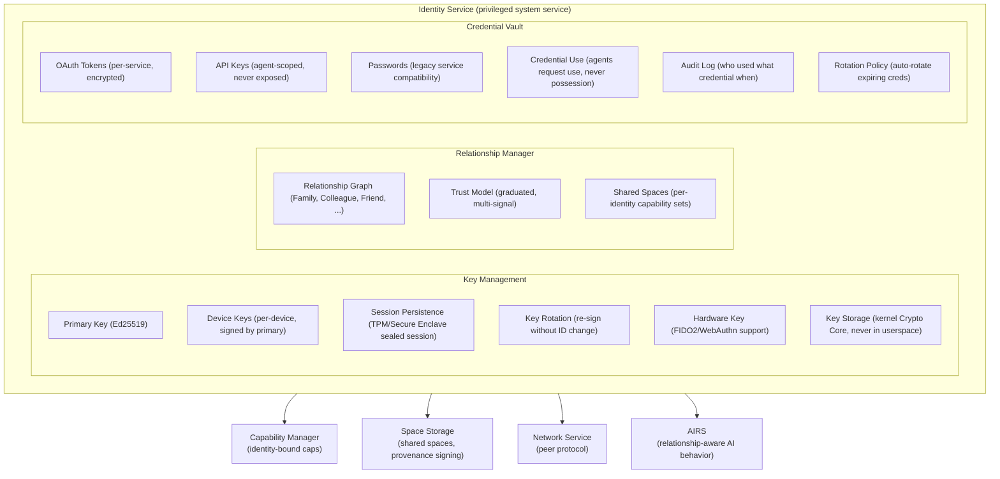
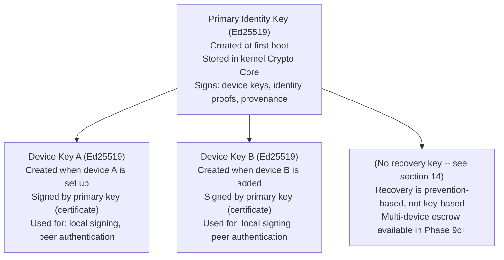
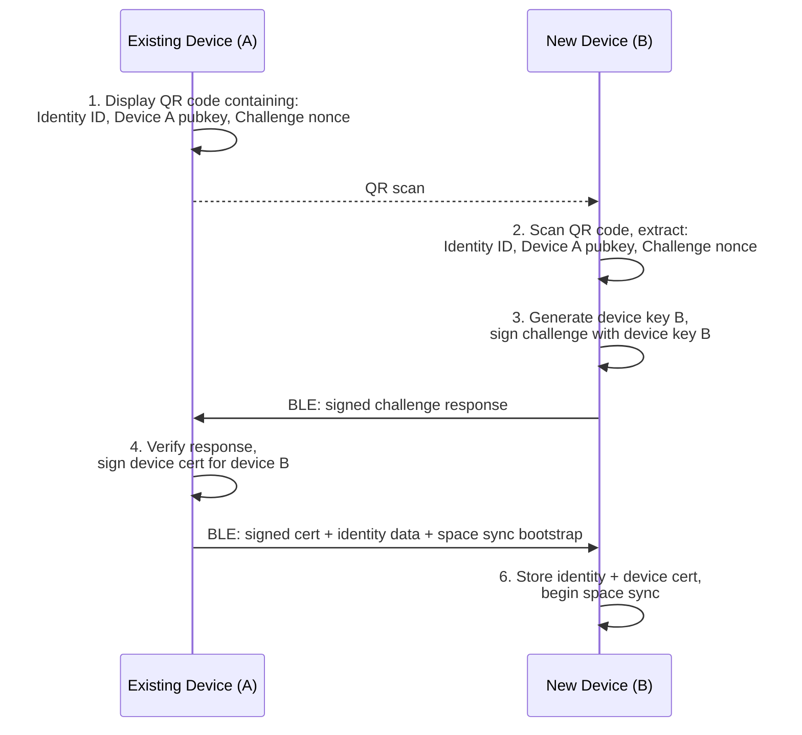

# AIOS Identity & Relationships

## Deep Technical Architecture

**Parent document:** [architecture.md](../project/architecture.md)
**Related:** [model.md](../security/model.md) — Capability system and trust boundaries, [spaces.md](../storage/spaces.md) — Space sharing and provenance, [networking.md](../platform/networking.md) — Peer protocol and credential isolation, [agents.md](../applications/agents.md) — Agent identity and delegation, [airs.md](../intelligence/airs.md) — Relationship-aware AI behavior

-----

## 1. Overview

Traditional operating systems model identity as a **user account** — a username, a password, a home directory, a UID. This model was designed for timesharing mainframes where multiple people shared one machine. It persists today even though the reality has inverted: one person now uses multiple machines.

AIOS is a single-user operating system. There is no multi-user login. There are no user accounts. Instead, AIOS has **cryptographic identity** — a key pair that proves who you are without a password, without a server, without a username. Your identity is yours. It lives on your device. It doesn't depend on any company's infrastructure.

**What identity replaces:**

|Traditional OS|AIOS|
|---|---|
|Username + password|Ed25519 key pair|
|User account database|Local identity with peer exchange|
|Contact list / address book|Relationship graph with graduated trust|
|OAuth tokens scattered across apps|Credential isolation via Identity Service|
|File permissions (rwx, ACLs)|Capability-based access tied to identity|
|"Sign in with Google"|Cryptographic proof, no intermediary|

**Key principles:**

1. **Cryptographic, not credential-based.** Your identity is a key pair, not a password. Proving identity means signing a challenge, not transmitting a secret.
2. **Local-first.** No central identity server. No dependency on cloud infrastructure. Identity works offline, on an air-gapped device.
3. **Graduated trust.** Relationships aren't binary (known/unknown). Trust is a spectrum: Family → Friend → Colleague → Acquaintance → Service → Unknown. Trust level affects everything from attention priority to space sharing defaults.
4. **One identity, many devices.** Your identity spans all your AIOS devices. Spaces sync. Preferences sync. Relationships sync. Each device has its own key pair signed by the primary identity key.
5. **Privacy by design.** You control what identity information is shared. No identity is leaked without consent. Anonymous interaction is supported.

-----

## 2. Architecture



The Identity Service runs as a privileged system service (Trust Level 1). It manages keys, relationships, credentials, and identity proofs. All other services interact with identity through IPC — no service directly accesses key material.

-----

## 3. The Identity

### 3.1 Data Model

```rust
pub struct Identity {
    /// Globally unique identifier — derived from public key hash
    pub id: IdentityId,

    /// Ed25519 signing key pair
    /// Private key NEVER leaves kernel Crypto Core
    pub public_key: Ed25519PublicKey,

    /// Human-readable display name
    pub display_name: String,

    /// Optional avatar (reference to space object)
    pub avatar: Option<SpaceObjectRef>,

    /// Devices associated with this identity
    pub devices: Vec<DeviceInfo>,

    /// When this identity was created
    pub created: SystemTime,

    /// Relationship graph
    pub relationships: Vec<Relationship>,

    /// Spaces this identity has access to
    pub space_access: Vec<(SpaceId, AccessLevel)>,

    /// Bound hardware keys (FIDO2) for additional authentication.
    /// Added via bind_hardware_key() (§3.2).
    pub hardware_keys: Vec<HardwareKeyBinding>,

    /// Trust model parameters
    pub trust: TrustModel,
}

/// Derived from SHA-256 hash of the public key
/// 32 bytes, globally unique, deterministic
pub struct IdentityId([u8; 32]);

impl IdentityId {
    pub fn from_public_key(key: &Ed25519PublicKey) -> Self {
        let hash = sha256(key.as_bytes());
        IdentityId(hash)
    }

    /// Short form for display: first 8 bytes as hex
    pub fn short(&self) -> String {
        hex::encode(&self.0[..8])
    }
}

pub struct DeviceInfo {
    /// Device-specific key pair (signed by primary key)
    pub device_public_key: Ed25519PublicKey,
    /// Human-readable device name
    pub device_name: String,
    /// Device certificate: primary key's signature over device_public_key.
    /// Re-signed during key rotation (§4.3).
    pub certificate: Signature,
    /// When this device was added
    pub added: SystemTime,
    /// Last sync time
    pub last_sync: Option<SystemTime>,
    /// Whether this is the current device
    pub is_current: bool,
}
```

### 3.2 Identity Creation

Identity is created during first boot. No account registration. No email address. No phone number:

```rust
/// Userspace identity service. Manages identity lifecycle, key rotation,
/// relationships, and space sharing. Runs as a Trust Level 1 service.
pub struct IdentityService {
    /// The user's identity
    pub identity: Identity,
    /// History of key rotations for auditability (§4.3)
    pub rotation_history: Vec<RotationCertificate>,
}

impl IdentityService {
    pub fn create_identity(display_name: &str) -> Identity {
        // 1. Generate primary Ed25519 key pair in kernel Crypto Core
        let key_pair = crypto_core::generate_ed25519();

        // 2. Derive identity ID from public key
        let id = IdentityId::from_public_key(&key_pair.public);

        // 3. Generate device key for this device
        let device_key = crypto_core::generate_ed25519();
        let device_cert = key_pair.sign(&DeviceCertificate {
            device_key: device_key.public,
            device_name: hostname(),
            issued: SystemTime::now(),
        });

        // 4. Create identity
        let identity = Identity {
            id,
            public_key: key_pair.public,
            display_name: display_name.to_string(),
            avatar: None,
            devices: vec![DeviceInfo {
                device_public_key: device_key.public,
                device_name: hostname(),
                certificate: device_cert,
                added: SystemTime::now(),
                last_sync: None,
                is_current: true,
            }],
            created: SystemTime::now(),
            relationships: Vec::new(),
            space_access: Vec::new(),
            hardware_keys: Vec::new(),
            trust: TrustModel::default(),
        };

        // 5. Store in system/identity/ space
        space::write("system/identity/primary", &identity);

        // 6. Warn the user: no recovery mechanism exists by design (§14)
        display_no_recovery_warning();

        identity
    }
}
```

AIOS does not generate a recovery key. There is no seed phrase, no mnemonic, and no offline backup of key material. If the user forgets their passphrase and the device is powered off, their data is irrecoverable. This is a deliberate design choice — see §14 for the rationale and the prevention-based approach AIOS uses instead.

-----

## 4. Key Management

### 4.1 Key Hierarchy



### 4.2 Kernel Crypto Core

Private keys never leave the kernel's Cryptographic Core. Userspace services request signing operations via syscall:

```rust
/// Kernel-side key storage
pub struct CryptoCore {
    /// Keys indexed by key ID, stored in kernel memory
    keys: HashMap<KeyId, Ed25519PrivateKey>,
}

/// Syscall interface — userspace cannot read private keys
pub enum CryptoSyscall {
    /// Generate a new key pair, return public key + key ID
    GenerateKey -> (KeyId, Ed25519PublicKey),

    /// Sign data with a stored key
    Sign { key_id: KeyId, data: &[u8] } -> Signature,

    /// Verify a signature with a public key (no private key needed)
    Verify { public_key: &Ed25519PublicKey, data: &[u8], signature: &Signature } -> bool,

    /// Derive a shared secret (for encryption, key exchange)
    KeyExchange { our_key: KeyId, their_public: &X25519PublicKey } -> SharedSecret,
}
```

Even if a userspace service is compromised, it cannot extract private keys. It can only request signatures — and each signature request is logged in the audit trail.

### 4.3 Key Rotation

Keys can be rotated without changing identity:

```rust
impl IdentityService {
    pub fn rotate_primary_key(&mut self) -> Result<(), RotationError> {
        // 1. Generate new key pair
        let new_key = crypto_core::generate_ed25519();

        // 2. Sign rotation certificate with OLD key
        let rotation_cert = RotationCertificate {
            old_public: self.identity.public_key,
            new_public: new_key.public,
            timestamp: SystemTime::now(),
            reason: RotationReason::Scheduled,
        };
        let signed = crypto_core::sign(self.primary_key_id, &rotation_cert.to_bytes());

        // 3. Update identity
        self.identity.public_key = new_key.public;

        // 4. Re-sign all device certificates with new key
        for device in &mut self.identity.devices {
            let cert = crypto_core::sign(new_key.id, &device.to_cert_bytes());
            device.certificate = cert;
        }

        // 5. Notify all relationships about key change
        self.notify_relationships_key_rotated(&rotation_cert, &signed);

        // 6. Store rotation history
        self.rotation_history.push(rotation_cert);

        Ok(())
    }
}
```

The rotation certificate is signed by the old key, proving continuity. Relationships that receive the rotation notice can verify the chain: old key signed the rotation to new key.

### 4.4 Hardware Key Support

For users with FIDO2/WebAuthn hardware keys (YubiKey, etc.):

```rust
pub enum KeyStorage {
    /// Software key in kernel Crypto Core (default)
    Software,
    /// Hardware security key (FIDO2)
    Hardware { device_path: String },
}

impl IdentityService {
    pub fn bind_hardware_key(&mut self, hardware_key: &FidoDevice) -> Result<(), Error> {
        // Register hardware key as an additional authentication factor
        let attestation = hardware_key.make_credential(&self.identity.id)?;

        self.identity.hardware_keys.push(HardwareKeyBinding {
            attestation,
            device_name: hardware_key.name(),
            added: SystemTime::now(),
        });

        Ok(())
    }
}
```

Hardware keys provide a second factor for high-security operations: key rotation, device addition, recovery.

-----

## 5. Relationships

### 5.1 Data Model

```rust
pub struct Relationship {
    /// Who this relationship is with
    pub with: IdentityId,
    /// Their public key (for verification)
    pub their_public_key: Ed25519PublicKey,
    /// Their display name
    pub their_display_name: String,
    /// Kind of relationship
    pub kind: RelationshipKind,
    /// Trust level (graduated)
    pub trust_level: TrustLevel,
    /// Spaces shared with this identity
    pub shared_spaces: Vec<SharedSpaceConfig>,
    /// When this relationship was established
    pub established: SystemTime,
    /// How this relationship was established
    pub establishment: EstablishmentMethod,
    /// Interaction history summary
    pub interaction_summary: InteractionSummary,
}

pub enum RelationshipKind {
    /// Close personal relationship — highest default trust
    Family,
    /// Personal relationship — high trust
    Friend,
    /// Professional relationship — moderate trust
    Colleague,
    /// Met once, low interaction — low trust
    Acquaintance,
    /// Automated service (API, bot, company) — minimal trust
    Service,
    /// No established relationship — no trust
    Unknown,
}

pub enum TrustLevel {
    /// Full shared space access, attention priority, capability sharing
    Trusted,
    /// Identity confirmed, limited sharing, moderate attention boost
    Verified,
    /// Seen before, minimal sharing, no attention boost
    Known,
    /// No trust, no sharing, items deprioritized
    Unknown,
}

pub enum EstablishmentMethod {
    /// Mutual introduction via existing relationship
    MutualIntroduction { introducer: IdentityId },
    /// Direct peer discovery on local network
    PeerDiscovery,
    /// Manual key exchange (QR code, NFC, out-of-band)
    ManualExchange,
    /// Imported from external service
    ServiceImport { service: ServiceId },
}
```

### 5.2 Establishing Relationships

Relationships are established through verified exchange, never through unilateral declaration:

```rust
impl IdentityService {
    /// Initiate a relationship via QR code exchange
    pub fn initiate_relationship_qr(&self) -> QrPayload {
        QrPayload {
            identity_id: self.identity.id,
            public_key: self.identity.public_key,
            display_name: self.identity.display_name.clone(),
            // Signed by our key to prove ownership
            signature: crypto_core::sign(
                self.primary_key_id,
                &self.identity.id.as_bytes(),
            ),
        }
    }

    /// Complete relationship establishment after scanning peer's QR
    pub fn establish_relationship(
        &mut self,
        peer: QrPayload,
        kind: RelationshipKind,
    ) -> Result<Relationship, Error> {
        // 1. Verify peer's signature proves they own their claimed identity
        let valid = crypto_core::verify(
            &peer.public_key,
            &peer.identity_id.as_bytes(),
            &peer.signature,
        );
        if !valid {
            return Err(Error::InvalidSignature);
        }

        // 2. Create relationship
        let relationship = Relationship {
            with: peer.identity_id,
            their_public_key: peer.public_key,
            their_display_name: peer.display_name,
            kind,
            trust_level: Self::default_trust_for_kind(&kind),
            shared_spaces: Vec::new(),
            established: SystemTime::now(),
            establishment: EstablishmentMethod::ManualExchange,
            interaction_summary: InteractionSummary::default(),
        };

        // 3. Store relationship
        self.identity.relationships.push(relationship.clone());
        space::write(
            &format!("system/identity/relationships/{}", peer.identity_id.short()),
            &relationship,
        );

        Ok(relationship)
    }

    fn default_trust_for_kind(kind: &RelationshipKind) -> TrustLevel {
        match kind {
            RelationshipKind::Family => TrustLevel::Trusted,
            RelationshipKind::Friend => TrustLevel::Verified,
            RelationshipKind::Colleague => TrustLevel::Verified,
            RelationshipKind::Acquaintance => TrustLevel::Known,
            RelationshipKind::Service => TrustLevel::Known,
            RelationshipKind::Unknown => TrustLevel::Unknown,
        }
    }
}
```

### 5.3 Mutual Introduction

A trusted intermediary can introduce two identities:

```rust
pub struct Introduction {
    /// Who is being introduced
    pub subject: IdentityId,
    pub subject_public_key: Ed25519PublicKey,
    pub subject_display_name: String,
    /// Who is introducing them
    pub introducer: IdentityId,
    /// Suggested relationship kind
    pub suggested_kind: RelationshipKind,
    /// Signed by the introducer's key
    pub introducer_signature: Signature,
}
```

When Alice introduces Bob to Carol, both Bob and Carol receive an `Introduction` signed by Alice. They can verify Alice's signature (they both trust Alice) and establish a relationship with initial trust derived from Alice's trust level.

-----

## 6. Trust Model

### 6.1 Trust Computation

Trust is not a single value — it's a composite of multiple signals:

```rust
pub struct TrustModel {
    /// Base trust from relationship kind
    pub base_trust: f32,
    /// Trust adjustment from interaction history
    pub interaction_trust: f32,
    /// Trust adjustment from verification level
    pub verification_trust: f32,
    /// Trust adjustment from mutual connections
    pub network_trust: f32,
    /// Time-based decay (trust decreases without interaction)
    pub recency_factor: f32,
}

impl TrustModel {
    pub fn compute_trust_score(&self) -> f32 {
        let raw = self.base_trust
            + self.interaction_trust
            + self.verification_trust
            + self.network_trust;

        (raw * self.recency_factor).clamp(0.0, 1.0)
    }

    pub fn trust_level(&self) -> TrustLevel {
        let score = self.compute_trust_score();
        match score {
            s if s >= 0.8 => TrustLevel::Trusted,
            s if s >= 0.5 => TrustLevel::Verified,
            s if s >= 0.2 => TrustLevel::Known,
            _ => TrustLevel::Unknown,
        }
    }
}
```

### 6.2 Trust Signals

|Signal|Source|Effect|
|------|------|------|
|Relationship kind|User declaration|Family=0.9, Friend=0.7, Colleague=0.6, Acquaintance=0.3|
|Interaction frequency|Attention audit log|Frequent interaction → +0.1|
|Verification method|Establishment method|In-person QR → +0.1, mutual intro → +0.05|
|Mutual connections|Relationship graph|Shared trusted connections → +0.05 each|
|Time since last interaction|System clock|>6 months → recency_factor drops|
|Negative signals|AIRS behavioral monitoring|Suspicious sharing patterns → -0.2|

### 6.3 What Trust Affects

Trust level influences multiple system behaviors:

```rust
pub struct TrustEffects {
    pub attention_priority_boost: i8,    // higher trust → more urgent items
    pub space_sharing_default: AccessLevel, // higher trust → more generous defaults
    pub capability_sharing: bool,        // can share agent capabilities
    pub flow_auto_accept: bool,          // auto-accept Flow transfers
    pub peer_sync_enabled: bool,         // allow Space Mesh sync
}

impl TrustEffects {
    pub fn for_level(level: TrustLevel) -> Self {
        match level {
            TrustLevel::Trusted => TrustEffects {
                attention_priority_boost: 2,
                space_sharing_default: AccessLevel::ReadWrite,
                capability_sharing: true,
                flow_auto_accept: true,
                peer_sync_enabled: true,
            },
            TrustLevel::Verified => TrustEffects {
                attention_priority_boost: 1,
                space_sharing_default: AccessLevel::ReadOnly,
                capability_sharing: false,
                flow_auto_accept: false,
                peer_sync_enabled: true,
            },
            TrustLevel::Known => TrustEffects {
                attention_priority_boost: 0,
                space_sharing_default: AccessLevel::None,
                capability_sharing: false,
                flow_auto_accept: false,
                peer_sync_enabled: false,
            },
            TrustLevel::Unknown => TrustEffects {
                attention_priority_boost: -2,
                space_sharing_default: AccessLevel::None,
                capability_sharing: false,
                flow_auto_accept: false,
                peer_sync_enabled: false,
            },
        }
    }
}
```

-----

## 7. Space Sharing

### 7.1 Shared Space Configuration

Spaces are shared with specific identities at specific access levels:

```rust
pub struct SharedSpaceConfig {
    /// The space being shared
    pub space_id: SpaceId,
    /// The identity it's shared with
    pub shared_with: IdentityId,
    /// Access level
    pub access: AccessLevel,
    /// Capability token (cryptographically bound to identity)
    pub capability_token: SpaceCapabilityToken,
    /// When sharing was granted
    pub granted: SystemTime,
    /// Optional expiry
    pub expires: Option<SystemTime>,
}

pub enum AccessLevel {
    /// No access
    None,
    /// Can read objects in the space
    ReadOnly,
    /// Can read and write objects
    ReadWrite,
    /// Can read, write, and manage sharing for this space
    Admin,
}
```

### 7.2 Sharing Flow

```rust
impl IdentityService {
    pub fn share_space(
        &mut self,
        space_id: &SpaceId,
        with: &IdentityId,
        access: AccessLevel,
    ) -> Result<SharedSpaceConfig, Error> {
        // 1. Verify we have admin access to this space
        if !self.has_admin_access(space_id) {
            return Err(Error::InsufficientAccess);
        }

        // 2. Verify the target identity exists in our relationships
        let relationship = self.get_relationship(with)
            .ok_or(Error::UnknownIdentity)?;

        // 3. Create capability token bound to their identity
        let token = self.capability_manager.create_space_token(
            space_id,
            with,
            access,
        );

        // 4. Create sharing config
        let config = SharedSpaceConfig {
            space_id: space_id.clone(),
            shared_with: *with,
            access,
            capability_token: token,
            granted: SystemTime::now(),
            expires: None,
        };

        // 5. Store sharing config
        space::write(
            &format!("system/identity/sharing/{}/{}", space_id, with.short()),
            &config,
        );

        // 6. If peer is online, notify them via AIOS Peer Protocol
        if let Some(peer) = self.network.find_peer(with) {
            peer.send(PeerMessage::SpaceShared {
                space_id: space_id.clone(),
                access,
                token: token.clone(),
            });
        }

        Ok(config)
    }

    pub fn revoke_space_sharing(
        &mut self,
        space_id: &SpaceId,
        from: &IdentityId,
    ) -> Result<(), Error> {
        // 1. Revoke the capability token
        self.capability_manager.revoke_space_token(space_id, from);

        // 2. Remove sharing config
        space::delete(
            &format!("system/identity/sharing/{}/{}", space_id, from.short()),
        );

        // 3. Notify peer if online
        if let Some(peer) = self.network.find_peer(from) {
            peer.send(PeerMessage::SpaceRevoked {
                space_id: space_id.clone(),
            });
        }

        Ok(())
    }
}
```

### 7.3 Capability Binding

Capability tokens are cryptographically bound to identity:

```rust
/// Space-sharing capability token. Distinct from the kernel-level
/// CapabilityToken (model.md §3) — this is a higher-level
/// identity-bound access grant for cross-space sharing.
pub struct SpaceCapabilityToken {
    /// What this token grants access to
    pub space_id: SpaceId,
    /// Who this token is for (identity-bound, non-transferable)
    pub bound_to: IdentityId,
    /// What access level
    pub access: AccessLevel,
    /// When this token was issued
    pub issued: SystemTime,
    /// Signed by the space owner's identity key
    pub owner_signature: Signature,
    /// Token ID for revocation
    pub token_id: TokenId,
}

impl SpaceCapabilityToken {
    pub fn verify(&self, owner_public_key: &Ed25519PublicKey) -> bool {
        let data = self.signable_bytes();
        crypto_core::verify(owner_public_key, &data, &self.owner_signature)
    }
}
```

A capability token cannot be transferred to another identity. If Alice shares a space with Bob, Bob cannot re-share that token with Carol. Bob would need Alice's permission (Admin access) to share further.

-----

## 8. Cross-Device Identity

### 8.1 Device Addition

Adding a new device to an existing identity:



```rust
impl IdentityService {
    pub fn add_device(&mut self, new_device_pubkey: &Ed25519PublicKey,
                      device_name: &str) -> Result<DeviceCertificate, Error> {
        // 1. Sign device certificate with primary key
        let cert = DeviceCertificate {
            identity_id: self.identity.id,
            device_public_key: *new_device_pubkey,
            device_name: device_name.to_string(),
            issued: SystemTime::now(),
            issuer: self.identity.public_key,
        };

        let signature = crypto_core::sign(self.primary_key_id, &cert.to_bytes());
        let signed_cert = SignedDeviceCertificate { cert, signature };

        // 2. Add device to identity
        self.identity.devices.push(DeviceInfo {
            device_public_key: *new_device_pubkey,
            device_name: device_name.to_string(),
            certificate: signature,
            added: SystemTime::now(),
            last_sync: None,
            is_current: false,
        });

        // 3. Trigger initial Space Mesh sync for new device
        self.space_mesh.initiate_full_sync(new_device_pubkey);

        Ok(signed_cert)
    }
}
```

### 8.2 Device Revocation

When a device is lost or compromised:

```rust
impl IdentityService {
    pub fn revoke_device(&mut self, device_pubkey: &Ed25519PublicKey) -> Result<(), Error> {
        // 1. Remove device from identity
        self.identity.devices.retain(|d| &d.device_public_key != device_pubkey);

        // 2. Issue revocation certificate (signed by primary key)
        let revocation = RevocationCertificate {
            revoked_device: *device_pubkey,
            reason: RevocationReason::LostDevice,
            timestamp: SystemTime::now(),
        };
        let signed = crypto_core::sign(self.primary_key_id, &revocation.to_bytes());

        // 3. Broadcast revocation to all remaining devices via Space Mesh
        self.space_mesh.broadcast(SpaceMeshMessage::DeviceRevoked {
            certificate: signed,
        });

        // 4. Notify all relationships (so they reject the revoked device)
        for rel in &self.identity.relationships {
            if let Some(peer) = self.network.find_peer(&rel.with) {
                peer.send(PeerMessage::DeviceRevoked {
                    certificate: signed.clone(),
                });
            }
        }

        // 5. Rotate keys shared with the revoked device
        self.rotate_shared_keys();

        Ok(())
    }
}
```

### 8.3 Space Mesh Sync

Spaces sync across devices sharing an identity via the Space Mesh Protocol:

```rust
pub struct SpaceMesh {
    /// Connected devices for this identity
    peers: Vec<SpaceMeshPeer>,
    /// Sync state per space per device
    sync_state: HashMap<(SpaceId, Ed25519PublicKey), SyncState>,
}

pub struct SyncState {
    /// Last Merkle root hash synced
    pub last_hash: MerkleHash,
    /// Objects pending sync
    pub pending: Vec<SpaceObjectId>,
    /// Sync direction
    pub direction: SyncDirection,
}

pub enum SyncDirection {
    /// Both ways
    Bidirectional,
    /// This device → peer only
    PushOnly,
    /// Peer → this device only
    PullOnly,
}
```

-----

## 9. AIOS Peer Protocol Identity

### 9.1 Peer Authentication

When two AIOS devices discover each other on a network:

```rust
impl PeerProtocol {
    pub async fn authenticate_peer(&self, connection: &mut PeerConnection)
        -> Result<PeerIdentity, Error>
    {
        // 1. Exchange identity proofs
        let our_proof = IdentityProof {
            identity_id: self.identity.id,
            device_public_key: self.device_key.public,
            device_certificate: self.device_cert.clone(),
            // Prove liveness with a signed timestamp
            timestamp: SystemTime::now(),
            timestamp_signature: crypto_core::sign(
                self.device_key_id,
                &SystemTime::now().to_bytes(),
            ),
        };

        connection.send(&our_proof).await?;
        let their_proof: IdentityProof = connection.recv().await?;

        // 2. Verify their proof
        // a. Device certificate is signed by their identity key
        let cert_valid = crypto_core::verify(
            &their_proof.device_certificate.issuer,
            &their_proof.device_certificate.cert.to_bytes(),
            &their_proof.device_certificate.signature,
        );
        if !cert_valid {
            return Err(Error::InvalidCertificate);
        }

        // b. Timestamp is signed by their device key (proves liveness)
        let timestamp_valid = crypto_core::verify(
            &their_proof.device_public_key,
            &their_proof.timestamp.to_bytes(),
            &their_proof.timestamp_signature,
        );
        if !timestamp_valid {
            return Err(Error::InvalidTimestamp);
        }

        // c. Device key matches the certificate
        if their_proof.device_public_key != their_proof.device_certificate.cert.device_public_key {
            return Err(Error::KeyMismatch);
        }

        // 3. Check if we have a relationship with this identity
        let relationship = self.identity_service
            .get_relationship(&their_proof.identity_id);

        Ok(PeerIdentity {
            identity_id: their_proof.identity_id,
            public_key: their_proof.device_certificate.cert.issuer,
            device_key: their_proof.device_public_key,
            relationship,
        })
    }
}
```

### 9.2 Capability Exchange

After authentication, peers exchange capabilities based on their relationship trust level:

```rust
impl PeerProtocol {
    pub fn negotiate_capabilities(
        &self,
        peer: &PeerIdentity,
    ) -> PeerCapabilitySet {
        let trust = peer.relationship
            .map(|r| r.trust_level)
            .unwrap_or(TrustLevel::Unknown);

        let effects = TrustEffects::for_level(trust);

        PeerCapabilitySet {
            can_share_spaces: effects.peer_sync_enabled,
            can_send_flow: effects.flow_auto_accept,
            can_post_attention: trust >= TrustLevel::Known,
            can_request_spaces: trust >= TrustLevel::Verified,
            max_bandwidth: Self::bandwidth_for_trust(trust),
        }
    }
}
```

-----

## 10. Agent Identity

### 10.1 Agent Signing Keys

Agents have their own identity — the developer's signing key:

```rust
pub struct AgentIdentity {
    /// Developer's signing key (from agent manifest)
    pub developer_key: Ed25519PublicKey,
    /// Developer name
    pub developer_name: String,
    /// Agent name
    pub agent_name: String,
    /// Agent version
    pub version: Version,
    /// Signature over the agent binary
    pub binary_signature: Signature,
}
```

### 10.2 Delegation Chain

When an agent acts on behalf of the user, the action includes a delegation chain:

```rust
pub struct DelegatedAction {
    /// What action was performed
    pub action: ActionDescription,
    /// The user's identity (delegator)
    pub user_identity: IdentityId,
    /// The agent that performed the action (delegate)
    pub agent_identity: AgentIdentity,
    /// User's signature authorizing the agent (capability grant)
    pub delegation_proof: SpaceCapabilityToken,
    /// Agent's signature over the action
    pub agent_signature: Signature,
    /// Timestamp
    pub timestamp: SystemTime,
}
```

This creates an unforgeable record: the user authorized the agent (delegation_proof), and the agent performed the specific action (agent_signature). Both signatures are verifiable by any third party.

### 10.3 Provenance Integration

Every space object records who created or modified it:

```rust
pub struct Provenance {
    /// Who created this object
    pub creator: ProvenanceActor,
    /// When
    pub created: SystemTime,
    /// Modification history
    pub modifications: Vec<ProvenanceEntry>,
    /// Merkle-linked to parent (tamper-evident)
    pub parent_hash: Option<MerkleHash>,
    /// Signature over this provenance entry
    pub signature: Signature,
}

pub enum ProvenanceActor {
    /// Created directly by the user
    User { identity: IdentityId },
    /// Created by an agent on behalf of the user
    Agent {
        identity: IdentityId,
        agent: AgentIdentity,
        delegation: SpaceCapabilityToken,
    },
    /// Created by AI inference
    AiGenerated {
        identity: IdentityId,
        model: ModelId,
        prompt_hash: Hash,
    },
    /// Imported from external source
    Imported {
        identity: IdentityId,
        source_url: String,
        import_agent: AgentIdentity,
    },
}
```

-----

## 11. Credential Isolation

### 11.1 The Problem

Traditional systems give agents (applications) direct access to credentials. A browser stores cookies. An email client stores IMAP passwords. A GitHub CLI stores OAuth tokens. Any application with read access to `~/.config/` can steal every credential on the system.

### 11.2 AIOS Solution

Agents never possess credentials. The Identity Service holds all credentials. Agents request credential **use** — the Identity Service applies the credential on their behalf:

```rust
impl IdentityService {
    /// Agent requests to use a credential
    pub fn use_credential(
        &self,
        agent: &AgentId,
        service: &ServiceId,
        request: CredentialUseRequest,
    ) -> Result<CredentialUseResponse, Error> {
        // 1. Verify agent has capability to use this service's credentials
        if !self.capability_manager.check_credential_use(agent, service) {
            return Err(Error::CapabilityDenied);
        }

        // 2. Retrieve credential from vault
        let credential = self.vault.get(service)?;

        // 3. Apply credential to the request (agent never sees the credential)
        let response = match &request {
            CredentialUseRequest::HttpHeader { header_name } => {
                CredentialUseResponse::HttpHeader {
                    name: header_name.clone(),
                    value: credential.to_header_value(),
                }
            }
            CredentialUseRequest::OAuthToken => {
                CredentialUseResponse::OAuthToken {
                    access_token: credential.access_token(),
                    expires: credential.expires(),
                }
            }
            CredentialUseRequest::Sign { data } => {
                CredentialUseResponse::Signed {
                    signature: credential.sign(data),
                }
            }
        };

        // 4. Audit log
        self.audit_log.record(CredentialUseAudit {
            agent: *agent,
            service: service.clone(),
            request_type: request.type_name(),
            timestamp: SystemTime::now(),
        });

        Ok(response)
    }
}
```

The agent receives the effect of the credential (an HTTP header value, a signed payload) but never the credential itself. Even if the agent is compromised, the attacker cannot extract credentials.

### 11.3 Credential Storage

```rust
pub struct CredentialVault {
    /// Credentials encrypted at rest with identity key
    credentials: HashMap<ServiceId, EncryptedCredential>,
    /// Decryption requires kernel Crypto Core
    encryption_key_id: KeyId,
}

pub struct EncryptedCredential {
    pub service: ServiceId,
    pub credential_type: CredentialType,
    pub encrypted_data: Vec<u8>,    // AES-256-GCM encrypted
    pub nonce: [u8; 12],
    pub added: SystemTime,
    pub last_used: SystemTime,
    pub rotation_policy: Option<RotationPolicy>,
}

pub enum CredentialType {
    OAuthToken { provider: String, scopes: Vec<String> },
    ApiKey { service: String },
    Password { service: String, username: String },
    Certificate { subject: String },
}
```

-----

## 12. Service Identities

External services are modeled as identities with their own relationship entries:

```rust
pub struct ServiceIdentity {
    /// Service identifier
    pub service_id: ServiceId,
    /// Service name (e.g., "GitHub", "Slack")
    pub name: String,
    /// Service's public key (if applicable, for verification)
    pub service_key: Option<Ed25519PublicKey>,
    /// Connector agent that interfaces with this service
    pub connector_agent: AgentId,
    /// Credentials for this service
    pub credentials: Vec<CredentialType>,
    /// What data this service has access to
    pub data_sharing: DataSharingConfig,
    /// Trust level for this service
    pub trust_level: TrustLevel,
}

pub struct DataSharingConfig {
    /// What spaces this service can access
    pub space_access: Vec<(SpaceId, AccessLevel)>,
    /// What identity information is shared with this service
    pub identity_disclosure: IdentityDisclosure,
}

pub enum IdentityDisclosure {
    /// Full identity shared (display name, avatar)
    Full,
    /// Minimal (pseudonymous handle)
    Minimal,
    /// Anonymous (no identity information)
    Anonymous,
}
```

When a connector agent (e.g., slack-connector) accesses Slack's API, it goes through the Identity Service for credential use. The connector agent never directly holds the OAuth token.

-----

## 13. Privacy

### 13.1 Local-First Identity

- No central identity server. No "identity provider."
- Identity is created on-device and stays on-device.
- Relationships are stored locally, not in a cloud database.
- Identity information is shared only with explicit consent.

### 13.2 Minimal Disclosure

When interacting with peers or services, the user controls what identity information is shared:

```rust
pub struct IdentityDisclosureConfig {
    /// What to share with peers by default
    pub peer_default: PeerDisclosure,
    /// Per-relationship overrides
    pub relationship_overrides: HashMap<IdentityId, PeerDisclosure>,
    /// What to share with services by default
    pub service_default: ServiceDisclosure,
}

pub struct PeerDisclosure {
    pub share_display_name: bool,
    pub share_avatar: bool,
    pub share_device_count: bool,
    pub share_relationship_count: bool,
}

/// What identity information is disclosed to system services.
pub struct ServiceDisclosure {
    /// Share a stable pseudonymous ID (not the real IdentityId)
    pub share_pseudonym: bool,
    /// Share display name with the service
    pub share_display_name: bool,
}
```

### 13.3 Anonymous Mode

For interactions where identity should not be revealed:

```rust
impl IdentityService {
    pub fn create_anonymous_session(&self) -> AnonymousSession {
        // Generate ephemeral key pair (not linked to primary identity)
        let ephemeral = crypto_core::generate_ed25519();

        AnonymousSession {
            ephemeral_key: ephemeral.public,
            key_id: ephemeral.id,
            // No link to primary identity
            linked_identity: None,
            expires: SystemTime::now() + Duration::from_hours(24),
        }
    }
}
```

Anonymous sessions use ephemeral keys that are not linked to the primary identity. The peer sees a valid Ed25519 public key but cannot connect it to the user's real identity.

-----

## 14. Recovery Design: Prevention, Not Restoration

AIOS does not implement a key recovery mechanism. There is no seed phrase, no mnemonic backup, no key escrow, and no recovery file. If the user forgets their passphrase and the device is powered off, their encrypted data is permanently irrecoverable. This is a deliberate architectural decision.

### 14.1 Rationale

Every recovery mechanism is an attack surface. A BIP-39 mnemonic can be stolen, photographed, or socially engineered. A recovery file can be exfiltrated. Key escrow requires trusting a third party or managing offline material that the user will lose, forget, or store insecurely. For a single-device, local-first system with no cloud infrastructure, every recovery scheme adds complexity and failure modes disproportionate to its benefit.

**What we evaluated and rejected:**

| Mechanism | Why rejected |
|---|---|
| BIP-39 seed phrase (24-word mnemonic) | Users lose paper. Photographing it defeats the purpose. Digital storage is just a key file with extra steps. |
| Recovery key file (USB, printout) | Same custodial burden as seed phrase. Users store it next to the device or lose it entirely. |
| OPAQUE (aPAKE) | Requires an online server. Contradicts local-first, offline-capable design. |
| Shamir secret sharing | Requires N trusted parties who maintain availability. Social graph changes. Recombination is fragile. |
| Social recovery (guardian model) | Requires infrastructure for guardian coordination. Guardians move, die, change devices. |
| Secure enclave / TEE escrow | Platform-dependent. Ties recovery to specific hardware. Not portable. |

The common failure mode: every scheme either requires infrastructure AIOS doesn't have (servers, guardians, blockchain), or shifts the custodial burden to the user (paper, USB drive, password manager) — which is exactly the problem recovery is supposed to solve.

### 14.2 Prevention-Based Design

Instead of recovering from a forgotten passphrase, AIOS prevents lockout through aggressive session persistence and low-friction passphrase management:

**1. Aggressive session persistence.** Once authenticated, the session stays alive as long as possible. The master key is sealed to the current boot session using the device's TPM or Secure Enclave (when available). The user only re-enters their passphrase after a cold reboot — not on lid close, not on sleep, not on screen lock. The goal: minimize the number of times the user must recall their passphrase, so they don't forget it.

```rust
pub enum SessionPersistence {
    /// Master key sealed to TPM/Secure Enclave for current boot session.
    /// Key survives sleep/wake cycles. Destroyed only on shutdown/reboot.
    /// This is the default on devices with a secure element.
    HardwareSealed {
        sealed_blob: Vec<u8>,
    },
    /// Master key kept in pinned kernel memory across sleep/wake.
    /// Less secure than hardware sealing (vulnerable to cold boot attacks)
    /// but available on all devices. Destroyed on shutdown/reboot.
    KernelPinned,
}
```

**2. Passphrase change while authenticated.** While the session is live (master key in memory), the user can change their passphrase at any time via the Identity Service. This is the "recovery" path — it happens *before* the user forgets, not after. The system periodically reminds the user that their passphrase can be changed if they feel uncertain about it.

```rust
impl IdentityService {
    /// Change the identity passphrase while the session is active.
    /// The master key is already in memory — re-derive it under the new passphrase.
    pub fn change_passphrase(
        &mut self,
        current_passphrase: &str,
        new_passphrase: &str,
    ) -> Result<(), Error> {
        // 1. Verify current passphrase (defense against unattended terminal)
        let verify_key = derive_master_key(current_passphrase, &self.identity_salt);
        if verify_key != self.master_key {
            return Err(Error::InvalidPassphrase);
        }

        // 2. Generate new salt
        let new_salt = crypto_core::random_bytes::<32>();

        // 3. Derive new master key from new passphrase
        let new_master = derive_master_key(new_passphrase, &new_salt);

        // 4. Re-encrypt all space keys under new master key
        for (space_id, encrypted_key) in &mut self.space_keys {
            let decrypted = decrypt_space_key(&self.master_key, encrypted_key);
            *encrypted_key = encrypt_space_key(&new_master, &decrypted);
        }

        // 5. Update stored salt and master key
        self.identity_salt = new_salt;
        self.master_key = new_master;

        // 6. Persist updated key material
        space::write("system/identity/key_metadata", &self.key_metadata());

        Ok(())
    }
}
```

**3. Clear warning at setup.** During first boot, the system displays an unambiguous warning:

```
Your passphrase protects all data on this device.

If you forget your passphrase and your device is powered off,
your data cannot be recovered. This is by design.

You can change your passphrase at any time while logged in.
```

The user must acknowledge this warning before identity creation proceeds.

**4. Multi-device escrow (Phase 9c+).** When multi-device support lands, device-to-device key escrow becomes the natural recovery mechanism: Device A holds an encrypted shard of Device B's master key, and vice versa. This requires no seed phrases, no paper, no third-party infrastructure — just a second AIOS device. This is the real recovery story, deferred to the phase where it becomes architecturally possible.

### 14.3 Key Compromise

If the primary key is compromised (not just a lost device):

```rust
impl IdentityService {
    pub fn emergency_rekey(&mut self) -> Result<(), Error> {
        // 1. Generate new primary key
        let new_key = crypto_core::generate_ed25519();
        let new_id = IdentityId::from_public_key(&new_key.public);

        // 2. Sign migration certificate with OLD key (proves continuity)
        let migration = MigrationCertificate {
            old_id: self.identity.id,
            new_id,
            old_public: self.identity.public_key,
            new_public: new_key.public,
            reason: MigrationReason::KeyCompromise,
            timestamp: SystemTime::now(),
        };
        let signed = crypto_core::sign(self.primary_key_id, &migration.to_bytes());

        // 3. Notify all relationships
        for rel in &self.identity.relationships {
            if let Some(peer) = self.network.find_peer(&rel.with) {
                peer.send(PeerMessage::IdentityMigration {
                    certificate: signed.clone(),
                });
            }
        }

        // 4. Update identity
        self.identity.id = new_id;
        self.identity.public_key = new_key.public;

        // 5. Re-sign all device certificates
        self.resign_all_device_certs();

        // 6. Rotate all shared space tokens
        self.rotate_all_space_tokens();

        Ok(())
    }
}
```

-----

## 15. Implementation Order

```
Phase 4a:   Kernel Crypto Core                 → Ed25519 key generation, signing, verification
Phase 4b:   Identity creation at first boot    → primary key, device key, no-recovery warning
Phase 4c:   Identity storage in system space   → identity persisted

Phase 8a:   Relationship data model            → relationship CRUD
Phase 8b:   QR-based relationship exchange     → in-person identity verification
Phase 8c:   Trust model computation            → graduated trust scores

Phase 12a:  Credential vault                   → encrypted credential storage
Phase 12b:  Credential isolation               → agents use, never possess
Phase 12c:  Service identity modeling          → external services as identities

Phase 15a:  Cross-device identity              → device addition, revocation
Phase 15b:  Space Mesh sync                    → space sync across devices
Phase 15c:  Peer Protocol authentication       → mutual device authentication
Phase 15d:  Multi-device key escrow            → device-to-device recovery (with Space Sync)

Phase 18a:  Mutual introduction                → relationship via intermediary
Phase 18b:  Privacy controls                   → disclosure settings, anonymous mode
Phase 18c:  Key rotation                       → scheduled and emergency re-keying
Phase 25:   Agent delegation chains            → provenance with agent identity
```

-----

## 16. Design Principles

1. **Cryptographic, not credential-based.** Identity is a key pair, not a password. Authentication means signing a challenge, not transmitting a secret. Replay attacks are impossible.

2. **Local-first, no intermediary.** No identity provider. No OAuth server controlled by a third party. Your identity exists on your device and nowhere else unless you choose to share it.

3. **Trust is graduated.** Relationships are not binary. Family, friend, colleague, acquaintance, service, unknown — each level unlocks different capabilities. Trust evolves through interaction, verification, and time.

4. **Agents use credentials, never possess them.** The Identity Service holds all secrets. Agents request the effect of a credential (a signed request, an HTTP header) without ever seeing the credential itself.

5. **Keys never leave the kernel.** Private keys are stored in the kernel Crypto Core. Userspace can request signatures but cannot read key material. A compromised userspace process cannot steal keys.

6. **Prevention over recovery.** AIOS does not implement key recovery. Instead, it prevents lockout through aggressive session persistence, low-friction passphrase changes, and (in Phase 9c+) device-to-device escrow. No seed phrase, no recovery file, no custodial burden. If the user forgets their passphrase and the device is off, data is gone — the same model as full-disk encryption.

7. **Provenance is identity-linked.** Every object in every space records who created it, how, and when. The provenance chain is signed and Merkle-linked. You can always answer "who did this?" and "did I write this or did the AI?"

8. **Privacy by default.** Minimal disclosure. Anonymous mode available. The user chooses what identity information to share, with whom, and when.
