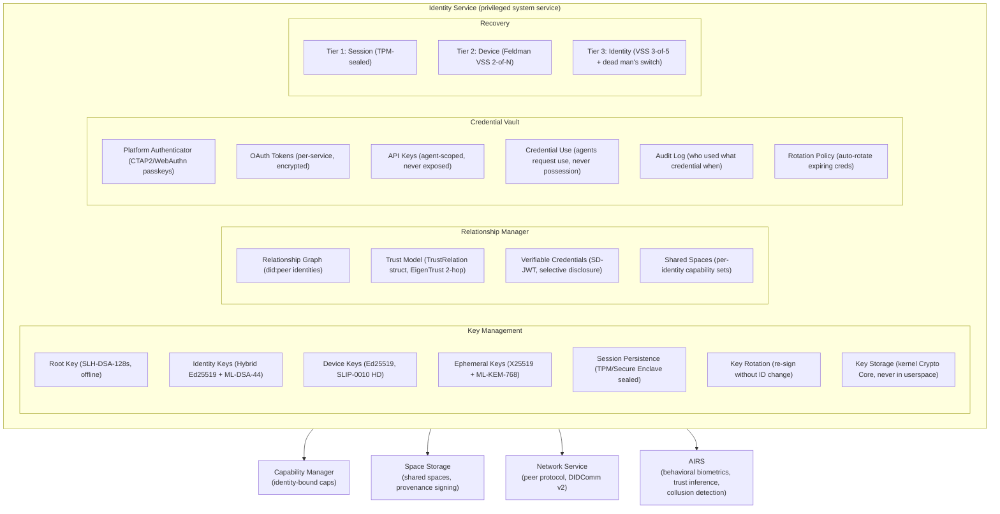

# AIOS Identity & Relationships

## Deep Technical Architecture

**Parent document:** [architecture.md](../project/architecture.md)
**Related:** [model.md](../security/model.md) — Capability system and trust boundaries, [spaces.md](../storage/spaces.md) — Space sharing and provenance, [networking.md](../platform/networking.md) — Peer protocol and credential isolation, [agents.md](../applications/agents.md) — Agent identity and delegation, [airs.md](../intelligence/airs.md) — Relationship-aware AI behavior, [decentralisation.md](../security/decentralisation.md) — DID/VC integration (Pillar 1)

-----

## 1. Overview

Traditional operating systems model identity as a **user account** — a username, a password, a home directory, a UID. This model was designed for timesharing mainframes where multiple people shared one machine. It persists today even though the reality has inverted: one person now uses multiple machines.

AIOS is a single-user operating system. There is no multi-user login. There are no user accounts. Instead, AIOS has **cryptographic identity** — a key pair that proves who you are without a password, without a server, without a username. Your identity is yours. It lives on your device. It doesn't depend on any company's infrastructure.

**What identity replaces:**

|Traditional OS|AIOS|
|---|---|
|Username + password|Ed25519 key pair (PQC-ready hierarchy)|
|User account database|Local identity with peer exchange (did:peer)|
|Contact list / address book|Relationship graph with graduated trust (EigenTrust)|
|OAuth tokens scattered across apps|Credential isolation via Identity Service|
|File permissions (rwx, ACLs)|Capability-based access tied to identity|
|"Sign in with Google"|Cryptographic proof, no intermediary (WebAuthn passkeys)|
|No recovery / seed phrase|Graduated 3-tier recovery (Feldman VSS)|

**Key principles:**

1. **Cryptographic, not credential-based.** Your identity is a key pair, not a password. Proving identity means signing a challenge, not transmitting a secret.
2. **Local-first.** No central identity server. No dependency on cloud infrastructure. Identity works offline, on an air-gapped device.
3. **Graduated trust.** Relationships aren't binary (known/unknown). Trust is a spectrum: Family → Friend → Colleague → Acquaintance → Service → Unknown. Trust level affects everything from attention priority to space sharing defaults.
4. **One identity, many devices.** Your identity spans all your AIOS devices. Spaces sync. Preferences sync. Relationships sync. Each device has its own key pair derived from the identity key via SLIP-0010 HD derivation.
5. **Privacy by design.** You control what identity information is shared. Selective disclosure via Schnorr proofs and Bulletproofs. Anonymous mode available. No identity is leaked without consent.
6. **Crypto-agile.** The 4-level key hierarchy (SLH-DSA root → hybrid Ed25519+ML-DSA identity → Ed25519 device → ephemeral X25519+ML-KEM) prepares for post-quantum migration without breaking existing identity bindings.

-----

## 2. Architecture



The Identity Service runs as a privileged system service (Trust Level 1). It manages the 4-level key hierarchy, relationships with EigenTrust-based trust computation, credentials including WebAuthn passkeys, and graduated recovery via Feldman VSS. All other services interact with identity through IPC — no service directly accesses key material.

-----

## Document Map

| Document | Sections | Content |
|---|---|---|
| **This file** | §1, §2, §15, §16 | Overview, architecture, implementation order, design principles |
| [core.md](./identity/core.md) | §3, §4 | Identity data model, creation flow, 4-level PQC key hierarchy (SLH-DSA → hybrid Ed25519+ML-DSA → Ed25519 HD → ephemeral), CryptoBackend trait, HSM abstraction, SLIP-0010 derivation |
| [relationships.md](./identity/relationships.md) | §5, §6 | TrustRelation struct, EigenTrust 2-hop propagation, did:peer (numalgo 2), SD-JWT verifiable credentials, TOFU upgrade pattern, key transparency log |
| [sharing.md](./identity/sharing.md) | §7 | Space sharing config, share/revoke flows, capability tokens |
| [cross-device.md](./identity/cross-device.md) | §8, §9 | Device addition/revocation, Space Mesh sync, peer authentication, capability exchange |
| [agents.md](./identity/agents.md) | §10 | Agent manifest signing, supply chain verification, HD-derived agent keys, delegation chain limits (depth 3), AI-generated content provenance |
| [credentials.md](./identity/credentials.md) | §11, §12 | Credential isolation, credential vault, rotation policies, AIOS as CTAP2/WebAuthn platform authenticator, service identities (§12.6), mediated OAuth (§12.7) |
| [privacy.md](./identity/privacy.md) | §13, §14 | Privacy controls, selective disclosure (Schnorr/Bulletproofs/ring signatures), anonymous mode, graduated 3-tier recovery (Feldman VSS, dead man's switch, proactive share refresh) |
| [intelligence.md](./identity/intelligence.md) | §17 | AI-native identity intelligence: kernel-internal ML (keystroke, session confidence, trust anomaly, recovery risk), AIRS-dependent (behavioral fusion, collusion detection, guardian health), comparative analysis |

-----

## 15. Implementation Order

```text
Phase 4a:   Kernel Crypto Core                 → Ed25519 key generation, signing, verification
Phase 4b:   Identity creation at first boot    → primary key, device key, recovery warning
Phase 4c:   Identity storage in system space   → identity persisted
Phase 4d:   CryptoBackend trait                → Algorithm enum, SoftwareHsm default

Phase 9a:   Relationship data model            → TrustRelation struct, relationship CRUD
Phase 9b:   QR-based relationship exchange     → in-person identity verification (did:peer)
Phase 9c:   Trust model computation            → EigenTrust 2-hop, TOFU upgrade pattern
Phase 9d:   Key transparency log               → append-only signed identity event log

Phase 16a:  Credential vault                   → encrypted credential storage
Phase 16b:  Credential isolation               → agents use, never possess
Phase 16c:  Service identity modeling          → external services as identities
Phase 16d:  Platform authenticator             → CTAP2/WebAuthn passkey provider
Phase 16e:  Credential rotation                → auto-rotate OAuth, expiry warnings

Phase 22a:  Cross-device identity              → device addition, revocation (SLIP-0010 HD)
Phase 22b:  Space Mesh sync                    → space sync across devices
Phase 22c:  Peer Protocol authentication       → mutual device authentication (DIDComm v2)
Phase 22d:  Tier 2 recovery                    → Feldman VSS device-to-device key recovery

Phase 25a:  Mutual introduction                → relationship via intermediary
Phase 25b:  Privacy controls                   → disclosure settings, anonymous mode
Phase 25c:  Selective disclosure               → Schnorr proofs, Bulletproofs, ring signatures
Phase 25d:  Key rotation                       → scheduled and emergency re-keying
Phase 25e:  Tier 3 recovery                    → identity VSS, dead man's switch, cancel window
Phase 25f:  Proactive share refresh            → Herzberg protocol, threshold resharing

Phase 30a:  SD-JWT verifiable credentials      → Ed25519-compatible selective disclosure
Phase 30b:  PQC migration Phase A              → hybrid Ed25519+ML-DSA-44 identity keys
Phase 30c:  PQC root key                       → SLH-DSA-128s offline root, versioned signatures

Phase 35a:  Agent manifest signing             → supply chain verification, transparency receipts
Phase 35b:  Agent delegation chains            → provenance with agent identity, depth limits
Phase 35c:  AI content provenance              → model ID, prompt hash, generation params
```

-----

## 16. Design Principles

1. **Cryptographic, not credential-based.** Identity is a key pair, not a password. Authentication means signing a challenge, not transmitting a secret. Replay attacks are impossible.

2. **Local-first, no intermediary.** No identity provider. No OAuth server controlled by a third party. Your identity exists on your device and nowhere else unless you choose to share it. did:peer identities are resolved peer-to-peer, not via blockchain or server.

3. **Trust is graduated.** Relationships are not binary. Family, friend, colleague, acquaintance, service, unknown — each level unlocks different capabilities. Trust evolves through interaction, verification, and time. EigenTrust propagation computes transitive trust bounded to 2 hops.

4. **Agents use credentials, never possess them.** The Identity Service holds all secrets. Agents request the effect of a credential (a signed request, an HTTP header) without ever seeing the credential itself. Agent signing keys are HD-derived and independently revocable.

5. **Keys never leave the kernel.** Private keys are stored in the kernel Crypto Core. Userspace can request signatures but cannot read key material. A compromised userspace process cannot steal keys.

6. **Prevention first, safety net second.** AIOS prevents lockout through aggressive session persistence, low-friction passphrase changes, and continuous authentication. Recovery exists as a graduated safety net (session → device VSS → identity VSS with dead man's switch), not as a primary path. Prevention is always the foundation.

7. **Crypto-agile.** The 4-level key hierarchy separates concerns by lifetime and algorithm. Post-quantum migration happens layer by layer without breaking existing identity bindings. The CryptoBackend trait abstracts algorithm selection behind a stable interface.

8. **Provenance is identity-linked.** Every object in every space records who created it, how, and when. The provenance chain is signed and Merkle-linked. You can always answer "who did this?" and "did I write this or did the AI?"

9. **Privacy by default.** Minimal disclosure. Selective disclosure via zero-knowledge proofs (Schnorr, Bulletproofs) when feasible. Anonymous mode available. The user chooses what identity information to share, with whom, and when.

-----

## Cross-Reference Index

| Section | Sub-document | Description |
|---|---|---|
| §1 | This file | Overview and comparison table |
| §2 | This file | Architecture diagram and Identity Service |
| §3 | [core.md](./identity/core.md) | Identity data model and creation |
| §4 | [core.md](./identity/core.md) | Key management, PQC hierarchy, Crypto Core |
| §5 | [relationships.md](./identity/relationships.md) | Relationship data model (did:peer, TrustRelation) |
| §6 | [relationships.md](./identity/relationships.md) | Trust model (EigenTrust, SD-JWT, TOFU) |
| §7 | [sharing.md](./identity/sharing.md) | Space sharing |
| §8 | [cross-device.md](./identity/cross-device.md) | Cross-device identity |
| §9 | [cross-device.md](./identity/cross-device.md) | Peer protocol identity |
| §10 | [agents.md](./identity/agents.md) | Agent identity, manifest signing, delegation |
| §11 | [credentials.md](./identity/credentials.md) | Credential isolation |
| §12 | [credentials.md](./identity/credentials.md) | Platform authenticator (WebAuthn), service identities (§12.6), OAuth (§12.7) |
| §13 | [privacy.md](./identity/privacy.md) | Privacy controls, selective disclosure |
| §14 | [privacy.md](./identity/privacy.md) | Graduated 3-tier recovery design |
| §15 | This file | Implementation order |
| §16 | This file | Design principles |
| §17 | [intelligence.md](./identity/intelligence.md) | AI-native identity intelligence |
