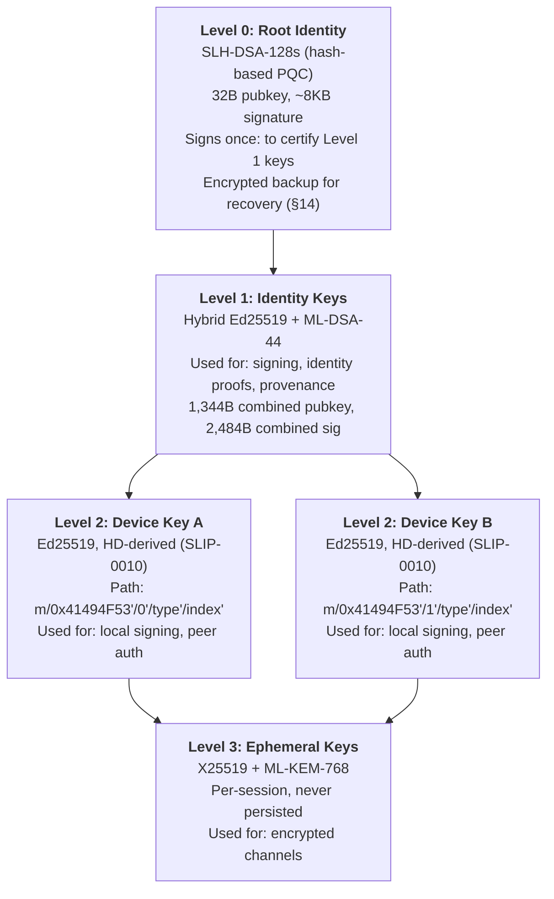

# AIOS Identity Core & Key Management

Part of: [identity.md](../identity.md) — Identity & Relationships
**Related:** [relationships.md](./relationships.md) — Trust model & relationship graph, [credentials.md](./credentials.md) — Credential isolation & service identities, [privacy.md](./privacy.md) — Recovery design & privacy controls

**Cross-references:** [model/hardening.md §4](../../security/model/hardening.md) — Crypto primitives, [model/operations.md §13.1](../../security/model/operations.md) — PQC migration path, [decentralisation.md §3](../../security/decentralisation.md) — Pillar 1 (Self-Sovereign Identity)

-----

## 3. The Identity

### 3.1 Data Model

```rust
pub struct Identity {
    /// Globally unique identifier — derived from public key hash
    pub id: IdentityId,

    /// Primary identity public key (Level 1 in key hierarchy, §4.1)
    /// Currently Ed25519; migrates to hybrid Ed25519 + ML-DSA-44 (§4.7)
    pub public_key: PublicKeyBundle,

    /// DID document for this identity (did:peer numalgo 2)
    /// See relationships.md §5 for DID usage in peer exchange
    pub did: DidDocument,

    /// Human-readable display name
    pub display_name: String,

    /// Optional avatar (reference to space object)
    pub avatar: Option<SpaceObjectRef>,

    /// Devices associated with this identity
    pub devices: Vec<DeviceInfo>,

    /// When this identity was created
    pub created: SystemTime,

    /// Relationship graph
    pub relationships: Vec<Relationship>,

    /// Spaces this identity has access to
    pub space_access: Vec<(SpaceId, AccessLevel)>,

    /// Bound hardware keys (FIDO2) for additional authentication.
    /// Added via bind_hardware_key() (§3.2). Optional backup only — the
    /// Kernel Crypto Core is the primary platform authenticator (§4.6).
    pub hardware_keys: Vec<HardwareKeyBinding>,

    /// Trust model parameters
    pub trust: TrustModel,

    /// Key transparency log — append-only record of key events
    pub key_log: KeyTransparencyLog,
}

/// Derived from SHA-256 hash of the public key
/// 32 bytes, globally unique, deterministic
pub struct IdentityId([u8; 32]);

impl IdentityId {
    pub fn from_public_key(key: &PublicKeyBundle) -> Self {
        // Hash the canonical encoding of the primary public key
        let hash = sha256(key.canonical_bytes());
        IdentityId(hash)
    }

    /// Short form for display: first 8 bytes as hex
    pub fn short(&self) -> String {
        hex::encode(&self.0[..8])
    }
}

/// Versioned public key bundle supporting algorithm migration
pub enum PublicKeyBundle {
    /// Phase A: Ed25519 only (current)
    Ed25519(Ed25519PublicKey),
    /// Phase B: Hybrid Ed25519 + ML-DSA-44 (PQC transition)
    Hybrid {
        ed25519: Ed25519PublicKey,
        ml_dsa: MlDsa44PublicKey,  // 1,312 bytes
    },
    /// Phase C: ML-DSA-44 only (post-transition)
    MlDsa44(MlDsa44PublicKey),
}

pub struct DeviceInfo {
    /// Device-specific key pair (Level 2, signed by identity key)
    /// HD-derived via SLIP-0010 from identity master seed (§4.4)
    pub device_public_key: Ed25519PublicKey,
    /// Human-readable device name
    pub device_name: String,
    /// Device certificate: identity key's signature over device_public_key.
    /// Re-signed during key rotation (§4.5).
    pub certificate: VersionedSignature,
    /// HD derivation path for this device (§4.4)
    pub derivation_path: DerivationPath,
    /// When this device was added
    pub added: SystemTime,
    /// Last time this device synced spaces
    pub last_sync: Option<SystemTime>,
    /// Whether this is the current device
    pub is_current: bool,
}
```

### 3.2 Identity Creation

At first boot, AIOS creates a single identity:

```rust
impl IdentityService {
    pub fn create_identity(display_name: &str) -> Identity {
        // 1. Generate root key (Level 0) in kernel Crypto Core
        //    Target design: SLH-DSA-128s (conservative PQC, hash-based security)
        //    Phase A (current): Ed25519 root — see §4.7 PQC Migration Timeline
        //    Phase B: upgrades to SLH-DSA-128s root
        let root_key = crypto_core::generate_key(Algorithm::SlhDsa128s);
        // Root private key stays in kernel, encrypted at rest

        // 2. Derive identity master seed via SLIP-0010
        let master_seed = crypto_core::derive_master_seed(root_key.id);

        // 3. Generate identity key (Level 1) — hybrid for PQC transition
        //    Phase A: Ed25519 only. Phase B: hybrid Ed25519 + ML-DSA-44.
        let identity_key = crypto_core::generate_key(Algorithm::Ed25519);

        // 4. Root signs identity key certificate
        let identity_cert = crypto_core::sign(
            root_key.id,
            &identity_key.public.canonical_bytes(),
        );

        // 5. Derive IdentityId from identity public key
        let id = IdentityId::from_public_key(&identity_key.public);

        // 6. Derive device key (Level 2) via SLIP-0010
        //    Path: m / 0x41494F53' / 0' / 0' / 0'
        let device_path = DerivationPath::new(&[
            0x41494F53 | HARDENED,  // "AIOS"
            0 | HARDENED,           // device_id = 0 (first device)
            0 | HARDENED,           // key_type = signing
            0 | HARDENED,           // index = 0 (current)
        ]);
        let device_key = crypto_core::derive_child(
            master_seed,
            &device_path,
        );
        let device_cert = crypto_core::sign(
            identity_key.id,
            &device_key.public.as_bytes(),
        );

        // 7. Generate DID document (did:peer numalgo 2)
        let did = DidDocument::peer_numalgo2(
            &identity_key.public,
            &device_key.public,
        );

        // 8. Create identity
        let identity = Identity {
            id,
            public_key: PublicKeyBundle::Ed25519(identity_key.public),
            did,
            display_name: display_name.to_string(),
            avatar: None,
            devices: vec![DeviceInfo {
                device_public_key: device_key.public,
                device_name: platform::device_name(),
                certificate: VersionedSignature::new(
                    Algorithm::Ed25519,
                    device_cert,
                ),
                derivation_path: device_path,
                added: SystemTime::now(),
                last_sync: None,
                is_current: true,
            }],
            created: SystemTime::now(),
            relationships: Vec::new(),
            space_access: Vec::new(),
            hardware_keys: Vec::new(),
            trust: TrustModel::default(),
            key_log: KeyTransparencyLog::new(id),
        };

        // 9. Log identity creation event
        identity.key_log.append(KeyEvent::IdentityCreated {
            identity_id: id,
            root_algorithm: Algorithm::SlhDsa128s,
            identity_algorithm: Algorithm::Ed25519,
            timestamp: SystemTime::now(),
        });

        // 10. Store in system/identity/ space
        space::write("system/identity/primary", &identity);

        // 11. Warn the user: recovery design is prevention-based (§14)
        display_recovery_warning();

        identity
    }
}
```

AIOS uses a prevention-based approach to recovery rather than traditional key backup mechanisms. See [privacy.md §14](./privacy.md) for the graduated 3-tier recovery design.

-----

## 4. Key Management

### 4.1 Key Hierarchy

AIOS uses a 4-level key hierarchy designed for post-quantum migration and hardware security module abstraction:



**Level rationale:**

| Level | Algorithm | Why this algorithm | Signs what |
|---|---|---|---|
| 0 — Root | SLH-DSA-128s | Hash-based = most conservative PQC. Tiny 32B pubkey. Slow signing is acceptable (used once). | Level 1 identity keys |
| 1 — Identity | Hybrid Ed25519 + ML-DSA-44 | Backward-compatible. Secure against both classical and quantum. AND-composition (both must verify). | Device certificates, provenance, identity proofs |
| 2 — Device | Ed25519 (SLIP-0010 HD) | Fast, small signatures. Per-device isolation. HD derivation enables deterministic key recovery. | Peer authentication, session tokens, IPC |
| 3 — Ephemeral | X25519 + ML-KEM-768 | Hybrid KEM for forward secrecy. Per-session. Never persisted. | Key exchange for encrypted channels |

### 4.2 Key Wrapping Hierarchy

Keys are wrapped (encrypted) by their parent in the hierarchy, following the Apple Secure Enclave pattern:

```text
Hardware Seed (OTP/fused or generated-and-sealed)
├── Root Identity Key (SLH-DSA-128s, wrapped by hardware seed + passphrase)
│   ├── Identity Signing Key (Ed25519 + ML-DSA-44, wrapped by root)
│   ├── Identity Encryption Key (X25519, wrapped by root)
│   └── Identity Authentication Key (for CTAP2/passkey, wrapped by root)
├── Storage Master Key (AES-256, derived from hardware seed + user passphrase)
│   ├── Per-Space Keys (AES-256-GCM, wrapped by storage master)
│   │   └── Per-Object Keys (optional, for fine-grained encryption zones)
│   └── WAL Encryption Key
└── Ephemeral Session Keys (derived per-session, never persisted)
```

Wrapped keys can be stored on disk or in regular memory — only the Kernel Crypto Core can unwrap them. This allows efficient key management without exposing raw key material.

### 4.3 Kernel Crypto Core

Private keys never leave the kernel's Cryptographic Core. Userspace services request cryptographic operations via syscall:

```rust
/// Kernel-side key storage with pluggable backend
pub struct CryptoCore {
    /// Active HSM backend (software, FIDO2, TrustZone, or Secure Enclave)
    backend: Box<dyn HardwareSecurityModule>,
    /// Key metadata (algorithm, creation time, usage count)
    key_metadata: HashMap<KeyId, KeyMetadata>,
    /// Audit log for all crypto operations
    audit: CryptoAuditLog,
}

/// Syscall interface — userspace cannot read private keys
pub enum CryptoSyscall {
    /// Generate a new key pair, return public key + key ID
    GenerateKey { algorithm: Algorithm } -> (KeyId, PublicKeyBundle),

    /// Sign data with a stored key (versioned signature output)
    Sign { key_id: KeyId, data: &[u8] } -> VersionedSignature,

    /// Verify a signature with a public key (no private key needed)
    Verify {
        public_key: &PublicKeyBundle,
        data: &[u8],
        signature: &VersionedSignature,
    } -> bool,

    /// Derive a child key via SLIP-0010 HD derivation
    DeriveChild { parent: KeyId, path: &DerivationPath } -> (KeyId, PublicKeyBundle),

    /// Key exchange (hybrid X25519 + ML-KEM-768)
    KeyExchange {
        our_key: KeyId,
        their_public: &KemPublicKey,
    } -> SharedSecret,
}
```

Even if a userspace service is compromised, it cannot extract private keys. It can only request signatures — and each signature request is logged in the audit trail.

#### 4.3.1 CryptoBackend Trait

The Kernel Crypto Core abstracts over algorithm implementations via a trait:

```rust
/// Algorithm-agnostic crypto backend
pub trait CryptoBackend: Send + Sync {
    fn algorithm(&self) -> Algorithm;
    fn sign(&self, key: KeyHandle, msg: &[u8], sig: &mut [u8]) -> Result<usize, CryptoError>;
    fn verify(&self, pubkey: &[u8], msg: &[u8], sig: &[u8]) -> Result<bool, CryptoError>;
    fn derive_child(&self, parent: KeyHandle, index: u32) -> Result<KeyHandle, CryptoError>;
}

pub enum Algorithm {
    Ed25519,
    MlDsa44,
    SlhDsa128s,
    HybridEd25519MlDsa44,
    MlKem768,
    Aes256Gcm,
}
```

#### 4.3.2 Hardware Security Module Trait

The Kernel Crypto Core supports pluggable hardware backends:

```rust
/// Pluggable HSM backend — keys never leave the implementation
pub trait HardwareSecurityModule: Send + Sync {
    fn generate_key(&self, algo: Algorithm) -> Result<KeyHandle, HsmError>;
    fn sign(&self, handle: KeyHandle, data: &[u8]) -> Result<Vec<u8>, HsmError>;
    fn verify(&self, handle: KeyHandle, data: &[u8], sig: &[u8]) -> Result<bool, HsmError>;
    fn derive_key(&self, parent: KeyHandle, path: &[u32]) -> Result<KeyHandle, HsmError>;
    fn export_public(&self, handle: KeyHandle) -> Result<PublicKeyBundle, HsmError>;
    // Private keys NEVER exported
}
```

**Planned implementations:**

| Implementation | Phase | Platform | Description |
|---|---|---|---|
| `SoftwareHsm` | 4a | All | Keys in kernel memory, protected by capability system. Default. |
| `Fido2Hsm` | 16+ | USB HID | Optional backup via hardware FIDO2 keys. User concern: supply chain + side-channel risks make this secondary, not primary. |
| `TrustZoneHsm` | 22+ | Pi 4/5 | ARM Secure World integration via OP-TEE. |
| `SecureEnclaveHsm` | 22+ | Apple Silicon | Native Secure Enclave integration via m1n1/kernel driver. |

### 4.4 SLIP-0010 Hierarchical Deterministic Key Derivation

Device keys (Level 2) are derived deterministically from the identity master seed using SLIP-0010, which defines Ed25519-compatible HD derivation:

```text
Master seed derivation:
  master_secret = HMAC-SHA512(key="ed25519 seed", data=root_seed)
    → left 32 bytes  = master private key (clamped per Ed25519)
    → right 32 bytes = chain code

Child key derivation (hardened only):
  child = HMAC-SHA512(key=chain_code, data=0x00 || private_key || index)
    → left 32 bytes  = child private key
    → right 32 bytes = child chain code
```

**AIOS derivation path (BIP-44 inspired):**

```text
m / purpose' / device_id' / key_type' / index'
m / 0x41494F53' / 0' / 0' / 0'    → Device 0, signing key, current
m / 0x41494F53' / 0' / 1' / 0'    → Device 0, encryption key, current
m / 0x41494F53' / 0' / 2' / 0'    → Device 0, authentication key, current
m / 0x41494F53' / 1' / 0' / 0'    → Device 1, signing key, current
```

- `purpose` = `0x41494F53` = "AIOS" in ASCII
- All paths hardened (required for Ed25519 SLIP-0010 — no public derivation)
- `key_type`: 0 = signing, 1 = encryption, 2 = authentication
- `index`: allows key rotation without changing hierarchy (increment index)

**Why hardened-only is good for AIOS:** Hardened derivation requires the parent private key, which means device keys cannot be derived by anyone who only holds the public key. Since the master seed lives in the Kernel Crypto Core and never leaves, this is exactly the isolation property AIOS requires.

**PQC compatibility:** The same HMAC-SHA512 derivation works for ML-DSA seed derivation (ML-DSA keygen takes a 32-byte seed). The HD scheme is algorithm-agnostic at the derivation level; only the final key generation step differs per algorithm.

### 4.5 Key Rotation

Keys can be rotated without changing identity:

```rust
impl IdentityService {
    pub fn rotate_primary_key(&mut self) -> Result<(), RotationError> {
        // 1. Generate new key pair (same algorithm as current)
        let new_key = crypto_core::generate_key(self.current_algorithm());

        // 2. Sign rotation certificate with OLD key
        let rotation_cert = RotationCertificate {
            old_public: self.identity.public_key.clone(),
            new_public: new_key.public.clone(),
            timestamp: SystemTime::now(),
            reason: RotationReason::Scheduled,
        };
        let signed = crypto_core::sign(self.primary_key_id, &rotation_cert.to_bytes());

        // 3. Update identity
        self.identity.public_key = new_key.public;

        // 4. Re-sign all device certificates with new key
        for device in &mut self.identity.devices {
            let cert = crypto_core::sign(new_key.id, &device.to_cert_bytes());
            device.certificate = VersionedSignature::new(
                self.current_algorithm(),
                cert,
            );
        }

        // 5. Update DID document (signed delta for did:peer rotation)
        self.identity.did.rotate_key(&new_key.public, &signed);

        // 6. Notify all relationships about key change
        self.notify_relationships_key_rotated(&rotation_cert, &signed);

        // 7. Log to key transparency log
        self.identity.key_log.append(KeyEvent::KeyRotated {
            old_key_hash: sha256(rotation_cert.old_public.canonical_bytes()),
            new_key_hash: sha256(rotation_cert.new_public.canonical_bytes()),
            reason: RotationReason::Scheduled,
            timestamp: SystemTime::now(),
        });

        // 8. Store rotation history
        self.rotation_history.push(rotation_cert);

        Ok(())
    }
}
```

The rotation certificate is signed by the old key, proving continuity. Relationships that receive the rotation notice can verify the chain: old key signed the rotation to new key.

### 4.6 Versioned Signature Envelope

PQC signatures (ML-DSA-44: 2,420 bytes) exceed the 256-byte IPC RawMessage payload. All signatures use a versioned envelope:

```text
Wire format: [version:u8][algo_id:u8][sig_data:variable]

version = 1 (current)
algo_id:
  0x01 = Ed25519           (64 bytes)
  0x02 = ML-DSA-44         (2,420 bytes)
  0x03 = SLH-DSA-128s      (7,856 bytes)
  0x04 = Hybrid Ed25519+ML-DSA-44 (2,484 bytes)
```

```rust
pub struct VersionedSignature {
    pub version: u8,
    pub algorithm: Algorithm,
    pub data: Vec<u8>,
}

impl VersionedSignature {
    pub fn new(algo: Algorithm, sig_bytes: Vec<u8>) -> Self {
        Self { version: 1, algorithm: algo, data: sig_bytes }
    }

    /// For IPC: large signatures use multi-part transfer or shared memory
    pub fn fits_inline(&self) -> bool {
        self.data.len() + 2 <= MAX_MESSAGE_SIZE  // 256 bytes
    }
}
```

### 4.7 PQC Migration Timeline

```text
Phase A (current):
  Identity keys:   Ed25519
  Device keys:     Ed25519 (SLIP-0010 HD)
  Key exchange:    X25519
  Root key:        Ed25519 (upgraded to SLH-DSA in Phase B)

Phase B (PQC transition):
  Identity keys:   Hybrid Ed25519 + ML-DSA-44 (AND-composition)
  Device keys:     Ed25519 (SLIP-0010 HD, unchanged)
  Key exchange:    Hybrid X25519 + ML-KEM-768
  Root key:        SLH-DSA-128s (hash-based, most conservative)
  Signature format: Versioned envelope (§4.6)
  Compatibility:   Old verifiers check Ed25519 component only

Phase C (post-quantum):
  Identity keys:   ML-DSA-44 only (Ed25519 deprecated)
  Device keys:     ML-DSA-44 (new HD derivation scheme)
  Key exchange:    ML-KEM-768
  Root key:        SLH-DSA-128s (unchanged)
```

**Size impact:**

| Component | Phase A (Ed25519) | Phase B (Hybrid) | Phase C (ML-DSA) |
|---|---|---|---|
| Identity pubkey | 32 B | 1,344 B | 1,312 B |
| Identity signature | 64 B | 2,484 B | 2,420 B |
| Root pubkey | 32 B | 32 B | 32 B |
| Root signature | 64 B | 7,856 B | 7,856 B |
| Device certificate | ~100 B | ~2,550 B | ~2,480 B |

**RustCrypto no_std crates (all Apache-2.0/MIT, BSD-2-Clause compatible):**

| Crate | Algorithm | Purpose |
|---|---|---|
| `ml-dsa` | ML-DSA-44/65/87 (FIPS 204) | Identity signing (Phase B+) |
| `slh-dsa` | SLH-DSA-128s (FIPS 205) | Root identity signatures |
| `ml-kem` | ML-KEM-768 (FIPS 203) | Hybrid key exchange |
| `hkdf` | HMAC-based KDF | SLIP-0010 derivation |
| `hmac` | HMAC-SHA512 | SLIP-0010 child key derivation |

### 4.8 Hardware Key Support

For users with FIDO2/WebAuthn hardware keys (YubiKey, etc.):

```rust
pub enum KeyStorage {
    /// Software key in kernel Crypto Core (default, primary)
    Software,
    /// Hardware security key (FIDO2) — optional backup
    Hardware { device_path: String },
}

impl IdentityService {
    pub fn bind_hardware_key(&mut self, hardware_key: &FidoDevice) -> Result<(), Error> {
        // Register hardware key as an additional authentication factor
        let attestation = hardware_key.make_credential(&self.identity.id)?;

        self.identity.hardware_keys.push(HardwareKeyBinding {
            attestation,
            device_name: hardware_key.name(),
            added: SystemTime::now(),
        });

        Ok(())
    }
}
```

Hardware FIDO2 keys serve as an **optional backup factor**, not the primary authenticator. The AIOS Kernel Crypto Core is the platform authenticator (see [credentials.md §12](./credentials.md) for the CTAP2 platform authenticator design).

### 4.9 Key Transparency Log

An append-only, signed log of all identity key events provides auditability and tamper evidence:

```rust
pub struct KeyTransparencyLog {
    pub identity_id: IdentityId,
    pub entries: Vec<SignedKeyEvent>,
}

pub enum KeyEvent {
    IdentityCreated { identity_id: IdentityId, root_algorithm: Algorithm, identity_algorithm: Algorithm, timestamp: SystemTime },
    KeyRotated { old_key_hash: [u8; 32], new_key_hash: [u8; 32], reason: RotationReason, timestamp: SystemTime },
    DeviceAdded { device_key_hash: [u8; 32], device_name: String, timestamp: SystemTime },
    DeviceRevoked { device_key_hash: [u8; 32], reason: RevocationReason, timestamp: SystemTime },
    AlgorithmMigrated { from: Algorithm, to: Algorithm, timestamp: SystemTime },
}

pub struct SignedKeyEvent {
    pub event: KeyEvent,
    /// Signed by the identity key active at the time of the event
    pub signature: VersionedSignature,
    /// Hash chain: SHA-256(previous_entry_hash || this_event_bytes)
    pub chain_hash: [u8; 32],
}
```

The log is exchanged with peers during relationship establishment and key rotation, allowing any party to verify the full history of an identity's key lifecycle.
