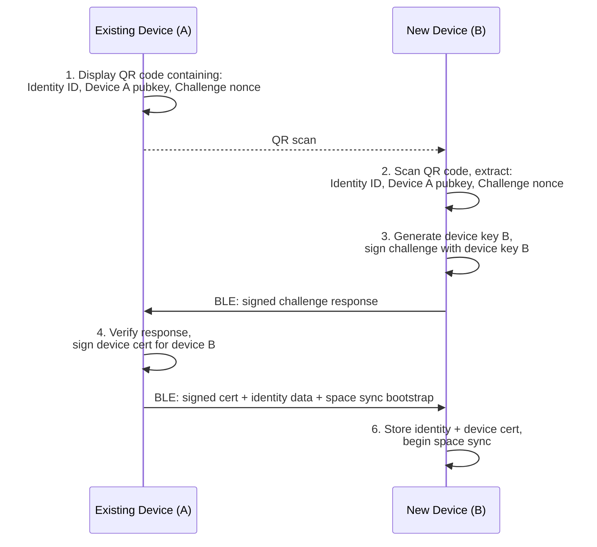

# AIOS Cross-Device Identity & Peer Protocol

Part of: [identity.md](../identity.md) — Identity & Relationships
**Related:** [core.md](./core.md) — Key management & device keys, [sharing.md](./sharing.md) — Space sharing, [relationships.md](./relationships.md) — Trust-based capability exchange

**Cross-references:** [multi-device/pairing.md](../../platform/multi-device/pairing.md) — Device pairing & SPAKE2+, [networking/protocols.md](../../platform/networking/protocols.md) — AIOS Peer Protocol

-----

## 8. Cross-Device Identity

### 8.1 Device Addition

Adding a new device to an existing identity:



```rust
impl IdentityService {
    pub fn add_device(&mut self, new_device_pubkey: &Ed25519PublicKey,
                      device_name: &str) -> Result<DeviceCertificate, Error> {
        // 1. Sign device certificate with primary key
        let cert = DeviceCertificate {
            identity_id: self.identity.id,
            device_public_key: *new_device_pubkey,
            device_name: device_name.to_string(),
            issued: SystemTime::now(),
            issuer: self.identity.public_key,
        };

        let signature = crypto_core::sign(self.primary_key_id, &cert.to_bytes());
        let signed_cert = SignedDeviceCertificate { cert, signature };

        // 2. Add device to identity
        self.identity.devices.push(DeviceInfo {
            device_public_key: *new_device_pubkey,
            device_name: device_name.to_string(),
            certificate: signature,
            added: SystemTime::now(),
            last_sync: None,
            is_current: false,
        });

        // 3. Trigger initial Space Mesh sync for new device
        self.space_mesh.initiate_full_sync(new_device_pubkey);

        Ok(signed_cert)
    }
}
```

### 8.2 Device Revocation

When a device is lost or compromised:

```rust
impl IdentityService {
    pub fn revoke_device(&mut self, device_pubkey: &Ed25519PublicKey) -> Result<(), Error> {
        // 1. Remove device from identity
        self.identity.devices.retain(|d| &d.device_public_key != device_pubkey);

        // 2. Issue revocation certificate (signed by primary key)
        let revocation = RevocationCertificate {
            revoked_device: *device_pubkey,
            reason: RevocationReason::LostDevice,
            timestamp: SystemTime::now(),
        };
        let signed = crypto_core::sign(self.primary_key_id, &revocation.to_bytes());

        // 3. Broadcast revocation to all remaining devices via Space Mesh
        self.space_mesh.broadcast(SpaceMeshMessage::DeviceRevoked {
            certificate: signed,
        });

        // 4. Notify all relationships (so they reject the revoked device)
        for rel in &self.identity.relationships {
            if let Some(peer) = self.network.find_peer(&rel.with) {
                peer.send(PeerMessage::DeviceRevoked {
                    certificate: signed.clone(),
                });
            }
        }

        // 5. Rotate keys shared with the revoked device
        self.rotate_shared_keys();

        Ok(())
    }
}
```

### 8.3 Space Mesh Sync

Spaces sync across devices sharing an identity via the Space Mesh Protocol:

```rust
pub struct SpaceMesh {
    /// Connected devices for this identity
    peers: Vec<SpaceMeshPeer>,
    /// Sync state per space per device
    sync_state: HashMap<(SpaceId, Ed25519PublicKey), SyncState>,
}

pub struct SyncState {
    /// Last Merkle root hash synced
    pub last_hash: MerkleHash,
    /// Objects pending sync
    pub pending: Vec<SpaceObjectId>,
    /// Sync direction
    pub direction: SyncDirection,
}

pub enum SyncDirection {
    /// Both ways
    Bidirectional,
    /// This device → peer only
    PushOnly,
    /// Peer → this device only
    PullOnly,
}
```

-----

## 9. AIOS Peer Protocol Identity

### 9.1 Peer Authentication

When two AIOS devices discover each other on a network:

```rust
impl PeerProtocol {
    pub async fn authenticate_peer(&self, connection: &mut PeerConnection)
        -> Result<PeerIdentity, Error>
    {
        // 1. Exchange identity proofs
        let our_proof = IdentityProof {
            identity_id: self.identity.id,
            device_public_key: self.device_key.public,
            device_certificate: self.device_cert.clone(),
            // Prove liveness with a signed timestamp
            timestamp: SystemTime::now(),
            timestamp_signature: crypto_core::sign(
                self.device_key_id,
                &SystemTime::now().to_bytes(),
            ),
        };

        connection.send(&our_proof).await?;
        let their_proof: IdentityProof = connection.recv().await?;

        // 2. Verify their proof
        // a. Device certificate is signed by their identity key
        let cert_valid = crypto_core::verify(
            &their_proof.device_certificate.issuer,
            &their_proof.device_certificate.cert.to_bytes(),
            &their_proof.device_certificate.signature,
        );
        if !cert_valid {
            return Err(Error::InvalidCertificate);
        }

        // b. Timestamp is signed by their device key (proves liveness)
        let timestamp_valid = crypto_core::verify(
            &their_proof.device_public_key,
            &their_proof.timestamp.to_bytes(),
            &their_proof.timestamp_signature,
        );
        if !timestamp_valid {
            return Err(Error::InvalidTimestamp);
        }

        // c. Device key matches the certificate
        if their_proof.device_public_key != their_proof.device_certificate.cert.device_public_key {
            return Err(Error::KeyMismatch);
        }

        // 3. Check if we have a relationship with this identity
        let relationship = self.identity_service
            .get_relationship(&their_proof.identity_id);

        Ok(PeerIdentity {
            identity_id: their_proof.identity_id,
            public_key: their_proof.device_certificate.cert.issuer,
            device_key: their_proof.device_public_key,
            relationship,
        })
    }
}
```

### 9.2 Capability Exchange

After authentication, peers exchange capabilities based on their relationship trust level:

```rust
impl PeerProtocol {
    pub fn negotiate_capabilities(
        &self,
        peer: &PeerIdentity,
    ) -> PeerCapabilitySet {
        // Compute trust score from relationship (§6.2)
        let score = peer.relationship
            .map(|r| self.trust_engine.compute_trust(&r.peer_did))
            .unwrap_or(TrustScore::zero());

        let effects = TrustEffects::for_score(&score);

        PeerCapabilitySet {
            can_share_spaces: effects.peer_sync_enabled,
            can_send_flow: effects.flow_auto_accept,
            can_post_attention: score.combined >= 0.2,
            can_request_spaces: score.combined >= 0.5,
            max_bandwidth: Self::bandwidth_for_score(&score),
        }
    }
}
```
