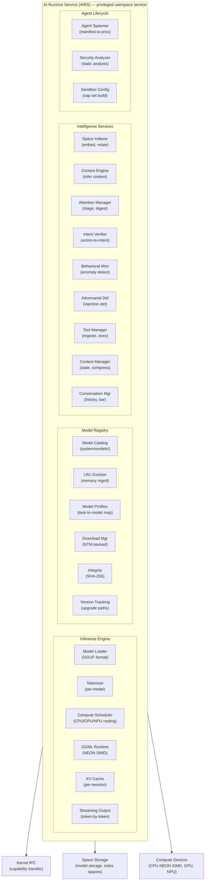

# AIOS AI Runtime Service (AIRS)

## Deep Technical Architecture

**Parent document:** [architecture.md](../project/architecture.md)
**Related:** [spaces.md](../storage/spaces.md) — Space Storage, [subsystem-framework.md](../platform/subsystem-framework.md) — Universal hardware abstraction

-----

## 1. Core Insight

Traditional operating systems treat AI as an application — a program the user runs, like any other. The AI has no special access to system state, no kernel integration, and no ability to enhance the OS itself. It's just another process fighting for resources.

AIOS inverts this. The AI Runtime Service (AIRS) is a **privileged system service** — the first non-kernel component loaded at boot, with direct access to spaces, the capability system, and hardware compute resources. AIRS is to intelligence what the kernel is to resource management: invisible infrastructure that makes everything else work better.

**AIRS is not a chatbot.** It's the engine behind semantic search, intent verification, behavioral monitoring, context inference, attention management, adversarial defense, space indexing, and agent lifecycle. The conversation bar is just one small interface to AIRS. Most of its work happens without any user interaction.

-----

## 2. Architecture



### 2.1 Why a Single Service (Monolith Now, Structured Split Later)

AIRS is a single process containing the inference engine, model registry, all intelligence services, and the resource orchestrator. This is deliberate — the inference engine is the scarce resource, and seven subsystems all share one model in RAM. Splitting into separate processes adds IPC overhead without creating more inference capacity.

On 8 GB hardware with one 4.5 GB model, splitting KV cache memory across processes halves the practical context window for both security checks and conversation. The monolith does not compromise security — the kernel monitors AIRS externally (§10.3), enforces capabilities regardless of internal structure, and can disable resource orchestration while keeping security active.

At 32+ GB, the split becomes viable: separate models eliminate contention between security intent checks and conversation generation, and each service gets its own failure domain. The internal architecture is already structured for this — each subsystem is a Rust module with a defined interface, security and resource paths share no mutable state, and IPC channels are defined per-function.

Full details in [inference.md §3.1](./airs/inference.md).

### 2.2 Relationship to the Microkernel

AIOS is a microkernel OS — 31 syscalls for capabilities, IPC, page tables, and process lifecycle. Everything else runs in userspace as Trust Level 1 services. AIRS being monolithic or split is a userspace concern that does not affect the kernel's architecture. The kernel does plain LRU and fixed pools; AIRS makes it smarter from userspace. If AIRS crashes, the kernel keeps working with static heuristics.

This separation is why the damage ceiling for a compromised AIRS resource orchestrator is denial of service, not data breach (model.md §9.6).

-----

## Document Map

| Document | Sections | Content |
|---|---|---|
| **This file** | §1, §2, §9, §12 | Overview, architecture, design principles, implementation order |
| [inference.md](./airs/inference.md) | §3 | GGML runtime, compute scheduler, KV cache, streaming output |
| [model-registry.md](./airs/model-registry.md) | §4 | Model storage, profiles, quantization, LRU eviction, boot selection |
| [intelligence-services.md](./airs/intelligence-services.md) | §5 | Space Indexer, Context Engine, Attention Manager, Intent Verifier (summary), Behavioral Monitor, Adversarial Defense, Tool Manager, Conversation Manager, Agent Capability Intelligence |
| [intent-verifier.md](./intent-verifier.md) | §1–§17 | Intent Verifier deep dive: verification pipeline, structured intent specs, IPC taint labels, behavioral integration, adversarial resistance, AI-native intelligence |
| [lifecycle-and-data.md](./airs/lifecycle-and-data.md) | §6, §7, §8 | Agent lifecycle, data model, key technology choices |
| [security.md](./airs/security.md) | §10 | Security path isolation, crash containment, agent hint processing, kernel oversight, provenance |
| [scaling.md](./airs/scaling.md) | §11 | Hardware scaling trajectory, multi-model architecture, context windows, NPU integration |
| [ai-native.md](./airs/ai-native.md) | §13, §14, §15 | Kernel-internal ML, AIRS-dependent intelligence, future directions |

-----

## 9. Design Principles

1. **Local first.** All inference happens on-device. No cloud dependency. User data never leaves the machine for AI processing.
2. **Streaming always.** Every inference call produces streaming output. No blocking calls. The user sees tokens as they're generated.
3. **Graceful degradation.** Every AIRS feature has a non-AI fallback. The system works without AIRS — it just works better with it.
4. **Memory-aware.** Models are loaded and evicted based on available RAM. AIRS never causes OOM. Background work yields to interactive use.
5. **Security is not optional.** Intent verification and behavioral monitoring are always on (when AIRS is available). They can't be disabled by agents.
6. **Models are replaceable.** Users can swap models. System services use model profiles, not hardcoded model names. A better model drops in seamlessly.
7. **Indexing is continuous.** The Space Indexer runs whenever there's spare compute. The semantic index is always as up-to-date as resources allow.
8. **Forward-compatible.** Model management is size-agnostic and hardware-tier-aware. The same architecture handles a 500 MB model on 4 GB and a 40 GB model on 64 GB.
9. **Resource intelligence is optimization, not security.** AIRS resource orchestration (prefetching, pool management, compression scheduling) makes the system faster, never safer. If disabled, the system falls back to static heuristics. Security never depends on correct resource decisions.

-----

## 12. Implementation Order

Development plan phases (see development-plan.md — not to be confused with boot phases):

```text
Dev Phase 9a:  GGML integration + model loading          → inference works
Dev Phase 9b:  Compute scheduler + KV cache management   → concurrent sessions
Dev Phase 9c:  Streaming output + conversation manager   → conversation bar works
Dev Phase 9d:  Model registry + LRU eviction             → multiple models supported
Dev Phase 9e:  Quantization selector + hardware tier      → auto-select best model for device
Dev Phase 10a: Space Indexer + selective embedding         → semantic search (promoted objects)
Dev Phase 10b: Context Engine + Attention Manager         → context-aware behavior
Dev Phase 10c: Conversation bar UI integration            → user-facing AI ready
Dev Phase 13a: Intent Verifier + Behavioral Monitor       → security layers 1 + 3
Dev Phase 13b: Adversarial Defense + hint screening        → security layer 5 + hint input vector
Dev Phase 13c: Tool Manager + Agent Lifecycle             → full agent framework
Dev Phase 21a: Model residency policy + switching opt     → minimize model swap latency
Dev Phase 21b: Dynamic model pool (grow/shrink on demand) → efficient RAM use
Dev Phase 21b+: Resource orchestration security            → kernel AIRS monitor, fallback mode,
                (security/resource path isolation,            resource directive provenance,
                 agent hint screening, allocation opacity)    damage ceiling: DoS only, not breach
Dev Phase 21c: Multi-model ensemble routing               → specialist routing (16+ GB)
Dev Phase 21d: NPU integration via subsystem framework    → hardware-accelerated inference
```

-----

## Cross-Reference Index

External docs reference AIRS sections by number. This index maps each §N.N to its sub-document:

| Section | Title | Location |
|---|---|---|
| §1 | Core Insight | This file |
| §2, §2.1, §2.2 | Architecture | This file |
| §3, §3.1–§3.4 | Inference Engine | [inference.md](./airs/inference.md) |
| §4, §4.1–§4.6 | Model Registry | [model-registry.md](./airs/model-registry.md) |
| §5, §5.1–§5.9 | Intelligence Services | [intelligence-services.md](./airs/intelligence-services.md) |
| §6 | Agent Lifecycle | [lifecycle-and-data.md](./airs/lifecycle-and-data.md) |
| §7 | Data Model | [lifecycle-and-data.md](./airs/lifecycle-and-data.md) |
| §8 | Key Technology Choices | [lifecycle-and-data.md](./airs/lifecycle-and-data.md) |
| §9 | Design Principles | This file |
| §10, §10.1–§10.5 | Resource Orchestration Security | [security.md](./airs/security.md) |
| §11, §11.1–§11.4 | Future: Scaling with Hardware | [scaling.md](./airs/scaling.md) |
| §12 | Implementation Order | This file |
| §13, §13.1–§13.7 | Kernel-Internal ML | [ai-native.md](./airs/ai-native.md) |
| §14, §14.1–§14.11 | AIRS-Dependent Intelligence | [ai-native.md](./airs/ai-native.md) |
| §15 | Future Directions | [ai-native.md](./airs/ai-native.md) |
