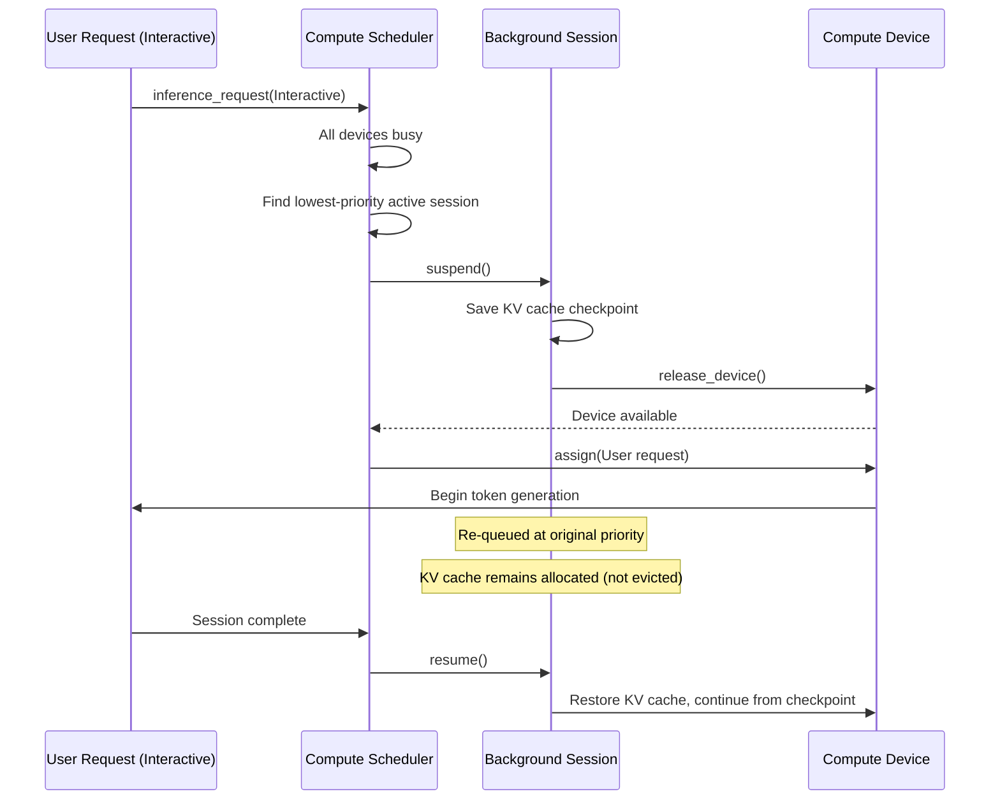
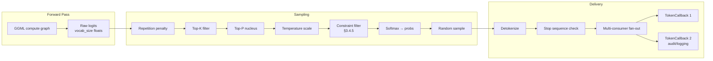
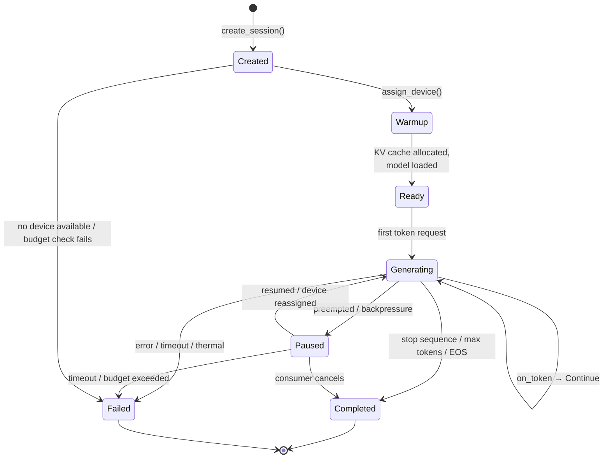

# AIOS AIRS Inference Engine

Part of: [airs.md](../airs.md) — AI Runtime Service
**Related:** [model-registry.md](./model-registry.md) — Model storage and selection, [scaling.md](./scaling.md) — Hardware scaling and NPU integration

-----

## 3. Inference Engine

The inference engine runs local LLM inference. No cloud dependency. All inference happens on-device. It manages the complete lifecycle from session creation through token generation to completion, coordinating compute resources, memory, and streaming output across heterogeneous hardware.

The engine is the scarce resource at the center of AIRS — seven intelligence services (Space Indexer, Context Engine, Attention Manager, Intent Verifier, Behavioral Monitor, Adversarial Defense, Tool Manager) all share one model in RAM on memory-constrained hardware. The inference engine's scheduler, metering, and session management determine who gets inference capacity and when.

### 3.1 Runtime: GGML with NEON SIMD

GGML is the inference runtime — a C library purpose-built for running quantized language models on consumer hardware. AIOS wraps it in a Rust safety layer that manages memory ownership, provides crash containment (§3.7), and exposes a safe Rust API to the rest of AIRS.

#### 3.1.1 Core Structures

```rust
pub struct InferenceEngine {
    /// The GGML runtime wrapper — owns the C library lifecycle.
    /// Initialized once at AIRS boot; persists for the process lifetime.
    runtime: GgmlRuntime,

    /// All active inference sessions, keyed by SessionId.
    /// Each session holds a reference to a loaded model and its own KV cache.
    active_sessions: HashMap<SessionId, InferenceSession>,

    /// Compute scheduler — routes inference to CPU/GPU/NPU.
    /// Queries the kernel's ComputeRegistry for device capabilities.
    compute_scheduler: ComputeScheduler,

    /// KV cache pool — manages memory for all session caches.
    /// Coordinates with the kernel's PagedAttention allocator (memory/ai.md §6.3).
    kv_cache_pool: KvCachePool,

    /// Inference metering — per-agent token accounting and rate limiting.
    meter: InferenceMeter,

    /// Session counter for unique ID generation.
    next_session_id: AtomicU64,
}

pub struct InferenceSession {
    id: SessionId,
    model: ModelHandle,
    kv_cache: KvCache,
    agent: AgentId,
    priority: InferencePriority,
    state: SessionState,
    token_callback: Box<dyn TokenCallback>,
    config: SessionConfig,
    stats: SessionStats,
}

pub struct SessionConfig {
    max_tokens: u32,
    temperature: f32,
    top_p: f32,
    top_k: u32,
    repetition_penalty: f32,
    stop_sequences: Vec<String>,
    /// Structured output constraint (§3.4.5). None = unconstrained generation.
    output_constraint: Option<OutputConstraint>,
    /// Speculative decoding configuration (§3.4.4). None = standard decoding.
    speculation: Option<SpeculationConfig>,
}

pub enum InferencePriority {
    /// User is waiting for a response (conversation bar).
    /// Preempts all other priorities. Target: <500ms time-to-first-token.
    Interactive,
    /// System service needs inference (intent verification, context engine).
    /// Second priority. May preempt background work.
    System,
    /// Background task (Space indexing, metadata generation).
    /// Uses remaining compute after interactive and system.
    Background,
    /// Scheduled batch work (re-indexing, summarization).
    /// Lowest priority. Only runs when system is otherwise idle.
    Batch,
}
```

#### 3.1.2 FFI Binding Architecture

GGML is a C library. The FFI boundary is the most security-sensitive part of the inference engine — a bug in C code can corrupt Rust memory, bypass type safety, and crash the entire AIRS process. The binding architecture minimizes the attack surface:

```rust
/// Low-level FFI bindings to GGML. All unsafe code is confined to this module.
/// No other module in AIRS calls GGML functions directly.
mod ggml_sys {
    // Raw C function declarations — generated by bindgen or hand-written.
    // Every function here is unsafe extern "C".
    extern "C" {
        pub fn ggml_init(params: ggml_init_params) -> *mut ggml_context;
        pub fn ggml_free(ctx: *mut ggml_context);
        pub fn ggml_graph_compute(ctx: *mut ggml_context, graph: *mut ggml_cgraph) -> i32;
        // ... ~50 GGML functions total
    }
}

/// Safe Rust wrapper over ggml_sys. Owns the GGML context and ensures
/// memory safety through RAII. Implements Drop to free GGML resources.
pub struct GgmlRuntime {
    /// GGML context pointer. Never null after initialization.
    /// Freed in Drop. Not Send — GGML contexts are single-threaded.
    ctx: *mut ggml_sys::ggml_context,

    /// Memory pool backing the GGML context. Allocated from Pool::Model
    /// via the kernel's frame allocator. Pinned for the context lifetime.
    memory_pool: ModelMemoryRegion,

    /// Loaded model weights. Mapped read-only from the model file.
    /// Multiple sessions can share one model via refcount.
    model: Option<LoadedModel>,

    /// Watchdog handle for crash containment (§3.7.2).
    /// If GGML code hangs or crashes, the watchdog triggers recovery.
    watchdog: WatchdogHandle,
}

impl Drop for GgmlRuntime {
    fn drop(&mut self) {
        // SAFETY: ctx was allocated by ggml_init and has not been freed.
        // We own the context exclusively (not Send/Sync).
        unsafe { ggml_sys::ggml_free(self.ctx); }
    }
}
```

**Binding design principles:**

- **Single unsafe boundary**: All FFI calls are in `ggml_sys`. The rest of AIRS interacts only with safe Rust wrappers.
- **Ownership clarity**: `GgmlRuntime` owns the GGML context. `LoadedModel` owns the weight tensors. `KvCache` owns per-session state. Rust's borrow checker enforces these relationships.
- **No raw pointer escape**: Pointers from GGML never leave the `GgmlRuntime` module. All external APIs use safe Rust types.
- **Crash containment**: The watchdog (§3.7.2) monitors GGML execution. A signal handler catches segfaults in C code and converts them to recoverable Rust errors.

#### 3.1.3 Compute Graph Lifecycle

Each inference call (prompt encoding + token generation) creates a GGML compute graph. The graph is a DAG of tensor operations that GGML executes:

```mermaid
flowchart LR
    subgraph Build["Graph Build (Rust)"]
        T[Tokenize prompt] --> E[Create embedding tensors]
        E --> L[Build transformer layers]
        L --> O[Add output projection]
    end

    subgraph Plan["Graph Plan (GGML)"]
        O --> A[Allocate scratch buffers]
        A --> S[Schedule operations]
        S --> P[Assign to compute threads]
    end

    subgraph Execute["Graph Execute (GGML + NEON)"]
        P --> M[Matrix multiply<br>NEON SIMD]
        M --> N[Layer norm]
        N --> AT[Attention<br>KV cache read/write]
        AT --> FF[Feed-forward]
        FF --> LG[Logits output]
    end

    subgraph Decode["Token Decode (Rust)"]
        LG --> SA[Sample token<br>temp/top-p/top-k]
        SA --> CB[TokenCallback]
        CB --> |Continue| T2[Next token<br>→ back to Execute]
        CB --> |Stop| DN[Done]
    end
```



**Graph lifecycle phases:**

1. **Build** (Rust): Construct the graph from the model architecture. Each transformer layer adds attention, feed-forward, and normalization nodes. The graph is rebuilt for each forward pass (GGML graphs are ephemeral).

2. **Plan** (GGML): Allocate scratch memory for intermediate tensors. GGML uses a memory pool (not `malloc`) — the pool is pre-allocated from `Pool::Model` at session creation. Schedule operations across available threads.

3. **Execute** (GGML + NEON): Run the graph. Matrix multiplications use NEON SIMD kernels (§3.1.4). KV cache is read for past context and written with new key-value pairs. The thermal yield point (§3.1.5) is checked between layers.

4. **Decode** (Rust): Convert logits to a token via sampling (§3.4.3). Invoke the `TokenCallback`. If the callback returns `Continue`, loop back to execute the next token.

#### 3.1.4 NEON SIMD Acceleration

AIOS targets aarch64 exclusively, so all GGML compute kernels use ARM NEON SIMD instructions. NEON provides 128-bit vector registers (32 registers, `v0`–`v31`), enabling 4 FP32 or 16 INT8 operations per instruction.

**Key GGML NEON kernels for quantized inference:**

```text
Operation                  Quant Format    NEON Intrinsics           Throughput
────────────────────────   ────────────    ─────────────────────     ──────────────
Q4_K_M dot product         4-bit mixed     vdotq_s32, vaddq_s32     16 MACs/cycle
Q5_K_M dot product         5-bit mixed     vdotq_s32, vshrq_n_s32   12 MACs/cycle
Q6_K dot product           6-bit           vdotq_s32, vandq_u8      10 MACs/cycle
Q8_0 dot product           8-bit uniform   vdotq_s32                16 MACs/cycle
FP16 GEMM                  16-bit float    vfmaq_f16 (if available) 8 FMAs/cycle
FP32 GEMM                  32-bit float    vfmaq_f32                4 FMAs/cycle
Softmax                    FP32            vexpq_f32 (approx)       4 ops/cycle
Layer norm                 FP32            vfmaq_f32, vrsqrteq_f32  4 ops/cycle
RoPE (rotary embedding)    FP32            vfmaq_f32, vmulq_f32     4 ops/cycle
```

**Quantization format selection:**

The model registry ([model-registry.md](./model-registry.md) §4.3) selects the optimal quantization format based on hardware capabilities reported by the kernel's ComputeCapabilityDescriptor ([compute/classification.md](../../kernel/compute/classification.md) §4). The inference engine does not choose quantization — it executes whatever format the loaded model uses.

```text
Format     Bits/Weight    Memory (7B)    Quality vs FP16    Best For
────────   ───────────    ───────────    ───────────────    ────────────────────
Q4_0       4.0            ~3.5 GB        ~85%               4 GB devices (minimum viable)
Q4_K_M     4.5            ~4.1 GB        ~92%               4-8 GB devices (recommended default)
Q5_K_M     5.5            ~4.8 GB        ~96%               8 GB devices
Q6_K       6.5            ~5.5 GB        ~98%               16 GB devices
Q8_0       8.0            ~6.7 GB        ~99.5%             16+ GB devices (near-lossless)
F16        16.0           ~13 GB         100%               32+ GB devices (reference)
```

#### 3.1.5 Thermal Integration

The inference engine integrates with the kernel's thermal management system ([thermal/scheduling.md](../../platform/thermal/scheduling.md) §6.4) through a yield point mechanism. After each transformer layer, the engine checks thermal state and adjusts its behavior:

```rust
/// Thermal-aware inference chunk sizes.
/// Controls how many tokens are generated between thermal yield points.
/// Source of truth: thermal/scheduling.md §6.4
pub struct ThermalChunkPolicy {
    /// Tokens per chunk at each thermal state.
    /// The engine generates this many tokens, then checks thermal state.
    pub tokens_per_chunk: [u32; 4],  // [Normal, Warm, Throttled, Critical]
}

impl Default for ThermalChunkPolicy {
    fn default() -> Self {
        Self {
            tokens_per_chunk: [8, 4, 2, 0],  // Critical = stop generating
        }
    }
}

/// Called between transformer layers during inference.
/// If the device is thermally throttled, this blocks until temperature drops.
/// If critical, returns Err to abort the inference session.
pub fn thermal_yield_point(
    registry: &ComputeRegistryHandle,
    device_id: ComputeDeviceId,
) -> Result<ThermalAction, InferenceError> {
    let state = registry.thermal_state(device_id);
    match state {
        ThermalState::Normal => Ok(ThermalAction::Continue),
        ThermalState::Warm => Ok(ThermalAction::ReduceChunk),
        ThermalState::Throttled => {
            // Yield to scheduler, re-check after cooldown period
            Ok(ThermalAction::YieldAndRetry)
        }
        ThermalState::Critical => Err(InferenceError::ThermalShutdown),
    }
}
```

The thermal pressure weight is reconciled with memory pressure (thermal/scheduling.md §6.5): the effective inference budget is `min(memory_weight, thermal_weight)`, ensuring the engine respects whichever constraint is tighter.

#### 3.1.6 Memory Ownership Model

The inference engine manages three categories of memory, each with distinct ownership rules:

```text
Category              Owner            Allocator           Lifetime            Sharing
──────────────────    ─────────────    ─────────────────   ──────────────────  ─────────────
Model weights         LoadedModel      Pool::Model          Model load→evict   Shared (refcount)
KV cache blocks       KvCachePool      PagedAttention       Session→evict      Per-session (COW prefix)
Scratch buffers       GgmlRuntime      Pool::Kernel         Graph build→free   Never shared
```

- **Model weights** are loaded into `Pool::Model` memory regions ([memory/ai.md](../../kernel/memory/ai.md) §6.2) as read-only 2 MB huge pages. Multiple sessions share the same model weights via reference counting. The model registry manages loading and eviction.

- **KV cache blocks** are managed by the PagedAttention allocator ([memory/ai.md](../../kernel/memory/ai.md) §6.3). The inference engine requests blocks through the `KvCachePool` interface but does not manage the underlying block table — that is the kernel's responsibility. Prefix sharing (common system prompts) uses copy-on-write semantics.

- **Scratch buffers** are temporary memory used by GGML during graph execution. Allocated from `Pool::Kernel` at graph build time, freed immediately after the forward pass completes. Never shared between sessions.

**Why GGML, not a full ML framework:**

- Designed specifically for LLM inference on consumer hardware
- Optimized quantization (Q4_K_M, Q5_K_M, Q6_K) — 7B models fit in 4-6 GB RAM
- NEON SIMD optimizations for aarch64 (the only architecture AIOS targets)
- No Python dependency, no CUDA dependency, no GPU required (GPU optional)
- C library with stable ABI — straightforward Rust FFI binding
- Active community with rapid quantization research adoption

-----

### 3.2 Compute Scheduler

Multiple services need inference simultaneously. The Compute Scheduler allocates compute resources across sessions with different priorities, thermal constraints, and hardware capabilities. Rather than maintaining its own device list, the scheduler queries the kernel's ComputeRegistry ([compute/registry.md](../../kernel/compute/registry.md) §5) for available devices and their capabilities.

#### 3.2.1 Scheduler Architecture

```rust
pub struct ComputeScheduler {
    /// Reference to the kernel's centralized compute device registry.
    /// AIRS queries this for device capabilities, utilization, and
    /// thermal state — it does not maintain a separate device list.
    /// See compute/classification.md §3 for ComputeDevice trait.
    registry: ComputeRegistryHandle,

    /// Priority queue of pending inference requests.
    /// Ordered by (priority class, arrival time).
    queue: PriorityQueue<InferenceRequest>,

    /// Currently executing inference sessions with their device assignments.
    active: Vec<ActiveInference>,

    /// Scheduling policy configuration.
    policy: SchedulingPolicy,

    /// Device scoring cache — refreshed every scheduling cycle.
    /// Avoids repeated registry queries within a single scheduling decision.
    device_scores: Vec<(ComputeDeviceId, DeviceScore)>,

    /// Continuous batching state — tracks which sessions can be coalesced
    /// into a single forward pass on the same device.
    batch_state: BatchState,
}

/// Compute device classes that the scheduler can target.
/// Maps to kernel ComputeClass (compute/classification.md §3.2).
pub enum ComputeDeviceClass {
    Cpu {
        cores: u32,
        neon: bool,           // NEON SIMD available (always true on aarch64)
        threads_available: u32,
    },
    Gpu {
        memory: usize,
        compute_units: u32,
        api: GpuApi,          // Vulkan, Metal (future)
    },
    Npu {
        tops: f32,            // tera-operations per second
        supported_formats: Vec<QuantFormat>,
    },
    Dsp {
        macs_per_cycle: u32,  // multiply-accumulate ops per cycle
    },
}

pub struct SchedulingPolicy {
    /// Interactive requests preempt background work.
    preemption: bool,
    /// Maximum concurrent inference sessions across all devices.
    max_concurrent: u32,
    /// Memory budget for KV caches (bytes).
    kv_cache_budget: usize,
    /// Background inference throttle (fraction of compute, 0.0–1.0).
    background_throttle: f32,
    /// Chunked prefill configuration — controls how long prompts are
    /// broken into smaller chunks interleaved with decode tokens.
    chunked_prefill: ChunkedPrefillPolicy,
}

pub struct ChunkedPrefillPolicy {
    /// Maximum prompt tokens to process in a single prefill chunk.
    /// Larger chunks = faster prefill but higher time-to-first-token variance.
    pub max_chunk_tokens: u32,
    /// Whether to interleave prefill chunks with decode tokens from
    /// other sessions (continuous batching).
    pub interleave_decode: bool,
}
```

#### 3.2.2 Device Selection Algorithm

When a new inference request arrives, the scheduler scores each available device and selects the best match. The scoring function considers multiple factors:

```rust
pub struct DeviceScore {
    /// Final composite score (higher = better). Range: 0.0–1.0.
    pub total: f32,
    /// Component scores for diagnostics.
    pub components: ScoreComponents,
}

pub struct ScoreComponents {
    /// Does this device support the model's quantization format?
    /// 0.0 = unsupported (disqualified), 1.0 = native support.
    pub format_support: f32,
    /// Current utilization (0.0 = idle = best, 1.0 = fully loaded = worst).
    pub utilization: f32,
    /// Thermal headroom (0.0 = critical = worst, 1.0 = cool = best).
    pub thermal: f32,
    /// Memory fit — can the model + KV cache fit on this device?
    /// 0.0 = doesn't fit (disqualified), 1.0 = fits with headroom.
    pub memory_fit: f32,
    /// Estimated throughput for this model on this device (tok/s).
    /// Normalized to [0.0, 1.0] against the best available device.
    pub throughput: f32,
    /// Estimated time-to-first-token for this device.
    /// Normalized inversely (lower latency = higher score).
    pub latency: f32,
}

impl ComputeScheduler {
    /// Score a device for a given inference request.
    fn score_device(
        &self,
        device: &ComputeCapabilityDescriptor,
        request: &InferenceRequest,
    ) -> DeviceScore {
        let format_support = if device.quant_formats.contains(request.quant_format) {
            1.0
        } else {
            0.0  // Hard disqualification
        };

        let utilization = 1.0 - device.utilization();
        let thermal = device.thermal_headroom();
        let memory_fit = self.compute_memory_fit(device, request);
        let throughput = self.estimate_throughput(device, request);
        let latency = self.estimate_latency(device, request);

        // Weighted combination. Weights differ by priority class:
        // Interactive favors latency; Background favors throughput.
        let weights = match request.priority {
            InferencePriority::Interactive => [0.0, 0.15, 0.15, 0.0, 0.20, 0.50],
            InferencePriority::System      => [0.0, 0.20, 0.15, 0.0, 0.35, 0.30],
            InferencePriority::Background  => [0.0, 0.25, 0.20, 0.0, 0.45, 0.10],
            InferencePriority::Batch       => [0.0, 0.30, 0.20, 0.0, 0.50, 0.00],
        };

        let total = format_support.min(memory_fit) * (  // Hard gates
            weights[1] * utilization +
            weights[2] * thermal +
            weights[4] * throughput +
            weights[5] * latency
        );

        DeviceScore {
            total,
            components: ScoreComponents {
                format_support, utilization, thermal,
                memory_fit, throughput, latency,
            },
        }
    }
}
```

**Scheduling rules (expanded):**

1. **Interactive requests** (user waiting) always preempt background work. The scheduler suspends the lowest-priority active background session, saves its KV cache state, and reassigns the device.

2. **System requests** (security services) get second priority. Intent verification and behavioral monitoring are latency-sensitive — they must complete before the user's action proceeds.

3. **Background requests** (indexing) use remaining compute. Throttled to `background_throttle` fraction of total compute capacity. Space indexing generates embeddings continuously; the scheduler ensures it never starves interactive use.

4. **If memory is exhausted**, the oldest background KV cache is evicted. Eviction follows priority ordering: Batch < Background < System < Interactive.

5. **Device preference order**: NPU preferred for small models and embedding generation (fixed-point arithmetic excels); GPU for large models with FP16 support; CPU as universal fallback. The scoring algorithm implements this via throughput estimation.

#### 3.2.3 Preemption Mechanics

When a higher-priority request arrives and all devices are busy, the scheduler must preempt a lower-priority session:



**Preemption constraints:**

- Only sessions with `supports_preemption() == true` on their assigned device can be preempted mid-computation. Most CPUs support preemption (at thread granularity). NPUs typically do not — the scheduler waits for the current NPU operation to complete.
- Preempted sessions retain their KV cache allocation. Only eviction (memory pressure) frees the cache.
- Preemption is bounded: at most one preemption per scheduling cycle to prevent thrashing.

#### 3.2.4 Continuous Batching

On hardware with sufficient memory (16+ GB), the scheduler can coalesce multiple sessions into a single forward pass. This is called continuous batching — sessions at different stages of generation share compute:

```rust
pub struct BatchState {
    /// Sessions eligible for batching on each device.
    /// All sessions in a batch must use the same model.
    batches: HashMap<ComputeDeviceId, Vec<BatchEntry>>,
    /// Maximum batch size per device (limited by KV cache memory).
    max_batch_size: u32,
}

pub struct BatchEntry {
    session_id: SessionId,
    /// Prefill = processing prompt tokens. Decode = generating tokens.
    phase: BatchPhase,
    /// Number of tokens in this entry's current chunk.
    chunk_tokens: u32,
}

pub enum BatchPhase {
    /// Processing prompt tokens (compute-heavy, many tokens per step).
    Prefill { remaining_tokens: u32 },
    /// Generating tokens (memory-heavy, one token per step).
    Decode,
}
```

**Continuous batching benefits:**

- On a 4-core CPU generating at 8 tok/s per session, batching 4 sessions achieves ~28 tok/s total (vs 8 tok/s serial) due to better NEON utilization.
- Prefill tokens from a new session can be interleaved with decode tokens from existing sessions (chunked prefill), reducing time-to-first-token for new requests without stalling ongoing generation.

**When batching is not used:**

- On 4-8 GB hardware, memory is too constrained for multiple KV caches. The scheduler runs sessions serially.
- Different models cannot be batched together — each model has distinct weight tensors.
- NPU inference typically processes one session at a time due to compiled graph constraints.

#### 3.2.5 Interaction with Kernel Compute Budget

The scheduler operates within budgets enforced by the kernel's ComputeBudget ([compute/budget.md](../../kernel/compute/budget.md) §7). Each agent has a compute budget determined by its trust level:

```text
Trust Level     Time Budget (per hour)    Power Budget (mW)    Source
────────────    ──────────────────────    ─────────────────    ──────────────────────
System          Unlimited                 Unlimited            compute/budget.md §7.4
Native          30 min                    TDP × 0.8            compute/budget.md §7.4
Third-party     5 min                     TDP × 0.3            compute/budget.md §7.4
Web             30 sec                    TDP × 0.1            compute/budget.md §7.4
```

Before starting an inference session, the scheduler checks the agent's remaining budget. If the budget is exhausted, the request is handled according to the agent's `BudgetPolicy` (Queue, Downgrade, or Reject). The inference metering system (§3.5) tracks actual usage and reports back to the kernel budget enforcer.

The system-wide ComputeQuota ([compute/budget.md](../../kernel/compute/budget.md) §8) enforces fairness across priority classes: Interactive gets up to 60% of compute, System 25%, Background 15%. These fractions are soft limits — if no interactive requests are pending, background work can use the full device.

-----

### 3.3 KV Cache Management

KV (key-value) caches are the memory cost of keeping a conversation context. Each active inference session has a KV cache proportional to its context length. This section covers the inference engine's view of KV cache lifecycle — the kernel's PagedAttention block allocator is authoritative for memory layout and block management ([memory/ai.md](../../kernel/memory/ai.md) §6.3).

#### 3.3.1 Session-Cache Relationship

```rust
pub struct KvCachePool {
    /// All allocated caches, keyed by session.
    allocated: HashMap<SessionId, KvCache>,
    /// Total bytes available for KV caches across all sessions.
    /// Set at AIRS boot from Pool::Model budget minus loaded model sizes.
    total_budget: usize,
    /// Current total usage across all caches.
    total_used: usize,
    /// LRU eviction order — most recently used at the back.
    eviction_order: LruList<SessionId>,
    /// Prefix sharing registry — maps common prompt hashes to shared prefixes.
    shared_prefixes: HashMap<PrefixHash, SharedPrefixHandle>,
}

pub struct KvCache {
    session: SessionId,
    model: ModelId,
    /// Current token count in this cache.
    context_length: u32,
    /// Model's maximum context window (e.g., 8192, 32768).
    max_context: u32,
    /// Actual memory used by this cache's blocks.
    memory_bytes: usize,
    /// Last time this cache was accessed (for LRU).
    last_used: Timestamp,
    /// Priority class of the owning session — affects eviction order.
    priority: InferencePriority,
    /// Cache state for lifecycle management.
    state: CacheState,
}

pub enum CacheState {
    /// Cache is actively being used by a generating session.
    Active,
    /// Session is paused; cache is in memory but not being written.
    Warm,
    /// Cache has been serialized to disk; can be reconstructed.
    Serialized { disk_location: SpaceObjectId },
    /// Cache has been evicted; must be rebuilt from conversation history.
    Evicted,
}
```

#### 3.3.2 Eviction Policy

Eviction follows a priority-weighted LRU strategy:

```text
Eviction Order (first evicted → last evicted):

1. Batch sessions (lowest priority, oldest first)
2. Background sessions (next lowest, oldest first)
3. System sessions (higher priority, oldest first)
4. Interactive sessions (highest priority, oldest first — evicted only under extreme memory pressure)
```

Within the same priority class, the oldest (least recently used) cache is evicted first. Before eviction, the engine attempts to serialize the cache to disk if the session might resume (§3.3.3).

**Eviction triggers:**

- **New session request**: When a new session's KV cache would exceed `total_budget`, evict until there's room.
- **Memory pressure signal**: The kernel's memory pressure system ([memory/reclamation.md](../../kernel/memory/reclamation.md) §8) can signal AIRS to reduce KV cache usage. AIRS responds by evicting low-priority caches.
- **Idle timeout**: Conversation bar sessions idle for >5 minutes have their caches serialized to disk (§3.3.3) and the memory freed. The conversation history remains in a Space — the cache can be reconstructed.

#### 3.3.3 Disk Serialization

KV caches can be serialized to a Space for later reconstruction, avoiding full re-computation:

```rust
pub struct CacheSerializer {
    /// Target Space for serialized caches (system Space).
    space: SpaceId,
    /// Compression before writing — KV caches are highly compressible
    /// (many near-zero attention values in early layers).
    compression: CompressionConfig,
}

impl CacheSerializer {
    /// Serialize a KV cache to disk. Returns a handle for reconstruction.
    /// The cache can be reconstructed in ~100ms (disk read) vs ~2-5s
    /// (full re-computation from conversation history).
    pub fn serialize(&self, cache: &KvCache) -> Result<SpaceObjectId, StorageError> {
        // 1. Snapshot the cache blocks (COW — doesn't block inference)
        // 2. Compress (LZ4 for speed — ~3:1 ratio on KV data)
        // 3. Write to Space as a versioned object
        // 4. Return handle for later restore
        todo!()
    }

    /// Reconstruct a KV cache from a serialized snapshot.
    pub fn deserialize(&self, handle: SpaceObjectId) -> Result<KvCache, StorageError> {
        // 1. Read from Space
        // 2. Decompress
        // 3. Allocate fresh KV blocks from PagedAttention
        // 4. Copy data into blocks
        todo!()
    }
}
```

#### 3.3.4 Prefix Sharing

When multiple sessions use the same system prompt (common for AIRS intelligence services), they can share the KV cache prefix via copy-on-write:

```text
Session A (Intent Verifier):  [shared system prompt KV | session-specific KV]
Session B (Behavioral Mon):   [shared system prompt KV | session-specific KV]
Session C (Context Engine):   [shared system prompt KV | session-specific KV]
                                       ↑
                              One copy in memory (COW)
```

The shared prefix is identified by hashing the system prompt tokens. When a new session starts with a known prefix, the engine points its KV cache to the shared blocks (read-only) and only allocates new blocks for session-specific tokens. This is coordinated with the kernel's SharedPrefix mechanism ([memory/ai.md](../../kernel/memory/ai.md) §6.3).

**Memory savings example (8 GB device, 8B Q4 model):**

```text
Without prefix sharing:  7 intelligence services × 2048 system prompt tokens × 1 MB = 7 MB
With prefix sharing:     1 shared prefix × 2048 tokens × 1 MB + 7 × session-specific = 1 MB + variable
Savings:                 ~6 MB (significant when KV budget is 500 MB–1 GB)
```

#### 3.3.5 Context Window Management

When a session approaches its model's maximum context length, the engine must manage the transition:

```rust
pub enum ContextOverflowPolicy {
    /// Truncate oldest tokens from the cache (sliding window).
    /// Fast but loses early context.
    SlidingWindow { keep_tokens: u32 },

    /// Compress the KV cache using attention-score-based eviction:
    /// remove KV entries for tokens with the lowest cumulative
    /// attention scores (inspired by H2O / Scissorhands research).
    /// Preserves important context, slower than sliding window.
    AttentionEviction { target_length: u32 },

    /// Summarize early context into a compressed representation
    /// and restart the KV cache. Requires an inference call for
    /// summarization. Best quality but highest latency.
    Summarize { summary_budget_tokens: u32 },

    /// Reject further tokens — session must be closed and restarted.
    /// Used for batch/background sessions where context loss is unacceptable.
    Reject,
}
```

The policy is selected per-session based on the use case:

- **Conversation bar**: `SlidingWindow` (immediate response expected)
- **Intent verification**: `Reject` (short interactions, never hits limit)
- **Space indexing**: `Summarize` (quality matters, latency tolerable)
- **Long document analysis**: `AttentionEviction` (preserves relevant context)

-----

### 3.4 Streaming Output

All inference produces streaming output — tokens are delivered one at a time as they're generated. This section covers the token generation pipeline from logits to consumer delivery.

#### 3.4.1 Token Generation Pipeline



#### 3.4.2 Token Callback Interface

```rust
pub trait TokenCallback: Send {
    /// Called for each generated token.
    /// The token string may be a partial UTF-8 character (especially for
    /// non-Latin scripts). Consumers must buffer until they have complete
    /// characters.
    fn on_token(&mut self, token: &str) -> TokenAction;

    /// Called when generation is complete (stop sequence, max tokens, or EOS).
    fn on_complete(&mut self, stats: InferenceStats);

    /// Called on error (GGML crash, thermal shutdown, budget exceeded, timeout).
    fn on_error(&mut self, error: InferenceError);
}

pub enum TokenAction {
    /// Keep generating the next token.
    Continue,
    /// Stop generation immediately (user cancelled, stop sequence hit externally).
    Stop,
    /// Pause generation briefly — backpressure from the consumer.
    /// The engine sleeps for the given duration, then resumes.
    /// If the consumer is consistently slow, the engine may reduce batch size.
    Pause(Duration),
}

pub struct InferenceStats {
    /// Total tokens generated in this session.
    tokens_generated: u32,
    /// Average generation speed (tokens per second).
    tokens_per_second: f32,
    /// Time from request submission to first token delivered.
    time_to_first_token: Duration,
    /// Total wall-clock time for the session.
    total_time: Duration,
    /// Which model was used (useful when AIRS auto-selects).
    model_used: ModelId,
    /// Which compute device executed the inference.
    compute_device: ComputeDeviceId,
    /// Token counts for metering (§3.5).
    prompt_tokens: u32,
    completion_tokens: u32,
    /// Speculative decoding stats (if enabled).
    speculation_stats: Option<SpeculationStats>,
}
```

**Consumer types and their callback behavior:**

| Consumer | `on_token` behavior | `on_complete` behavior |
|---|---|---|
| Conversation bar | Display immediately (character buffering for CJK) | Show "done" indicator |
| Intent verifier | Accumulate internally, parse for intent match | Return verified/rejected decision |
| Space indexer | Discard tokens, only use final result | Store embedding in index |
| Behavioral monitor | Accumulate, check for anomaly patterns | Log analysis result |
| Tool manager | Parse for tool call JSON (structured output) | Execute tool, feed result back |

#### 3.4.3 Sampling Strategies

The engine supports multiple sampling strategies, selected per-session:

```rust
pub enum SamplingStrategy {
    /// Standard sampling: temperature + top-k + top-p.
    /// Used for conversation, creative tasks.
    Standard {
        temperature: f32,   // 0.0 = greedy, 1.0 = neutral, >1.0 = creative
        top_k: u32,         // 0 = disabled, 40 = typical
        top_p: f32,         // 0.0 = disabled, 0.9 = typical (nucleus sampling)
    },

    /// Greedy decoding: always pick the highest-probability token.
    /// Used for intent verification, structured output, deterministic tasks.
    Greedy,

    /// Min-P sampling: dynamic threshold based on the top token's probability.
    /// More robust than top-p for varying distribution shapes.
    MinP {
        min_p: f32,         // Minimum probability relative to top token (e.g., 0.05)
        temperature: f32,
    },

    /// Mirostat: target a specific perplexity (entropy) level.
    /// Self-adjusting — maintains consistent output quality regardless of context.
    Mirostat {
        target_entropy: f32, // Typically 3.0–5.0
        learning_rate: f32,  // Adaptation speed (typically 0.1)
    },
}
```

**Repetition penalty** is applied before sampling to reduce token repetition:

```rust
pub struct RepetitionPenalty {
    /// Multiplicative penalty for tokens that appear in the last N tokens.
    pub penalty: f32,          // 1.0 = no penalty, 1.1 = mild, 1.3 = strong
    /// How far back to look for repeated tokens.
    pub window: u32,           // Typically 64–256
    /// Frequency penalty: penalize tokens proportional to how often they appear.
    pub frequency_penalty: f32, // 0.0 = disabled
    /// Presence penalty: flat penalty for any token that appeared at all.
    pub presence_penalty: f32,  // 0.0 = disabled
}
```

#### 3.4.4 Speculative Decoding

Speculative decoding accelerates generation by using a small "draft" model to generate N candidate tokens, then verifying all N in a single forward pass of the target model:

```rust
pub struct SpeculationConfig {
    /// Draft model for candidate generation. Must be much smaller than
    /// the target model (e.g., 1B draft for 8B target).
    pub draft_model: ModelId,
    /// Number of candidate tokens to generate per speculation step.
    /// Higher = more potential speedup, but lower acceptance rate.
    pub lookahead: u32,       // Typically 4–8
    /// Minimum acceptance rate before disabling speculation.
    /// If the draft model's predictions are too inaccurate, overhead > benefit.
    pub min_acceptance_rate: f32, // Typically 0.5
}

pub struct SpeculationStats {
    /// Total draft tokens generated.
    pub draft_tokens: u32,
    /// Draft tokens accepted by the target model.
    pub accepted_tokens: u32,
    /// Acceptance rate = accepted / draft.
    pub acceptance_rate: f32,
    /// Effective speedup vs standard decoding.
    pub speedup_factor: f32,
}
```

**How speculative decoding works:**

1. Draft model generates `lookahead` tokens (fast — small model).
2. Target model processes all `lookahead` tokens in one forward pass (parallel verification).
3. Target model accepts tokens where draft and target agree (same sampling distribution).
4. First disagreement: target model's token replaces draft's, remaining drafts discarded.
5. Net effect: 2-3x throughput when draft model predicts well (>70% acceptance rate).

**When speculative decoding is used:**

- Only on 8+ GB hardware (need memory for both models).
- Only for interactive sessions (latency-sensitive).
- Disabled automatically if acceptance rate drops below `min_acceptance_rate`.
- The draft model is loaded from the model registry on demand.

#### 3.4.5 Structured Output (Constrained Decoding)

For tool calling, JSON output, and intent verification, the engine can constrain token generation to follow a grammar or schema:

```rust
pub enum OutputConstraint {
    /// Constrain output to valid JSON matching a JSON Schema.
    /// Uses a finite state machine (FSM) to mask invalid tokens
    /// at each generation step.
    JsonSchema {
        schema: JsonSchema,
        /// Whether to allow the model to generate whitespace/formatting
        /// or force minimal JSON.
        compact: bool,
    },

    /// Constrain output to a context-free grammar (BNF-like).
    /// More general than JSON — can enforce any structured format.
    Grammar {
        grammar: ContextFreeGrammar,
    },

    /// Constrain output to one of a fixed set of strings.
    /// Efficient: precomputes token prefixes for each option.
    Choice {
        options: Vec<String>,
    },

    /// Regex constraint — output must match the given pattern.
    Regex {
        pattern: String,
    },
}
```

**How constrained decoding works:**

At each token generation step, the constraint engine computes a set of valid next tokens based on the current state of the FSM/grammar. Invalid tokens have their logits set to negative infinity before sampling. This guarantees the output matches the constraint while preserving the model's probability distribution over valid tokens.

**Performance impact:** Constraint checking adds ~1-5% overhead per token (FSM transition is O(1) for JSON schema, O(|grammar|) for general CFGs).

#### 3.4.6 Multi-Consumer Streaming

A single inference session can have multiple consumers. The primary consumer (conversation bar, intent verifier) receives tokens via `TokenCallback`. Secondary consumers receive tokens via a fan-out mechanism:

```rust
pub struct MultiConsumerStream {
    /// Primary consumer — controls the session (Stop/Pause/Continue).
    primary: Box<dyn TokenCallback>,
    /// Secondary consumers — receive tokens but cannot control the session.
    /// Used for audit logging, behavioral monitoring, analytics.
    secondary: Vec<Box<dyn TokenObserver>>,
}

/// Read-only observer that receives tokens but cannot stop/pause generation.
pub trait TokenObserver: Send {
    fn observe_token(&mut self, token: &str);
    fn observe_complete(&mut self, stats: &InferenceStats);
    fn observe_error(&mut self, error: &InferenceError);
}
```

#### 3.4.7 Cancellation Semantics

Cancellation can be requested by the consumer (via `TokenAction::Stop`) or externally (agent terminated, budget exceeded, thermal shutdown):

```rust
pub enum CancellationReason {
    /// Consumer returned TokenAction::Stop.
    ConsumerRequested,
    /// The owning agent's process was terminated.
    AgentTerminated,
    /// Token budget for this agent was exceeded (§3.5).
    BudgetExceeded,
    /// Device entered Critical thermal state (§3.1.5).
    ThermalShutdown,
    /// Session timed out (no tokens generated within deadline).
    Timeout,
    /// Higher-priority session needs this device (preemption).
    Preempted,
}
```

On cancellation, the engine:

1. Stops token generation immediately (after the current GGML graph completes).
2. Calls `on_complete` (for consumer-requested) or `on_error` (for all other reasons).
3. Marks the session as `Completed` or `Failed` in the session state machine (§3.6).
4. Retains the KV cache in `Warm` state for potential resumption (unless evicted).

-----

### 3.5 Inference Metering

The inference metering system tracks per-agent token usage and enforces budgets. It operates at the AIRS level (above the kernel's ComputeBudget) and provides finer-grained control over inference resources.

#### 3.5.1 Meter Architecture

```rust
/// Cost-aware inference metering — tracks per-agent token usage
/// and enforces budgets. Conceptually inspired by OpenFang's cost metering
/// and GCRA rate limiting, but this implementation aggregates usage per
/// agent (not per model).
pub struct InferenceMeter {
    /// Per-agent cumulative token usage.
    agent_usage: HashMap<AgentId, TokenUsage>,
    /// Per-agent budget limits (None = unlimited for system agents).
    agent_budgets: HashMap<AgentId, Option<TokenBudget>>,
    /// GCRA rate limiter: prevents burst inference that starves other agents.
    rate_limiter: GcraRateLimiter,
    /// Usage history for trend analysis (rolling 24-hour window).
    history: UsageHistory,
}

pub struct TokenUsage {
    /// Cumulative prompt tokens processed.
    prompt_tokens: u64,
    /// Cumulative completion tokens generated.
    completion_tokens: u64,
    /// Estimated compute cost based on model quantization and device speed.
    compute_cost: Duration,
    /// Current window start time (for windowed budgets).
    window_start: Timestamp,
}

pub struct TokenBudget {
    /// Maximum tokens (prompt + completion) per scheduling window.
    max_tokens_per_window: u64,
    /// Window duration (e.g., 1 hour).
    window: Duration,
    /// Action when budget exceeded.
    exceeded_policy: BudgetPolicy,
    /// Maximum burst size (tokens in a single request).
    max_burst: u64,
}

pub enum BudgetPolicy {
    /// Queue requests until next window opens.
    Queue,
    /// Downgrade to a smaller/faster model (e.g., 8B → 3B).
    Downgrade,
    /// Reject with error.
    Reject,
}
```

#### 3.5.2 GCRA Rate Limiting

The Generic Cell Rate Algorithm (GCRA) prevents burst inference that could starve other agents. GCRA models each agent as a "leaky bucket" — tokens are consumed at a steady rate, with a burst allowance:

```rust
pub struct GcraRateLimiter {
    /// Per-agent GCRA state.
    agents: HashMap<AgentId, GcraState>,
    /// Default rate parameters by trust level.
    defaults: HashMap<TrustLevel, GcraParams>,
}

pub struct GcraParams {
    /// Steady-state token rate (tokens per second).
    pub emission_interval_ns: u64,  // Nanoseconds per token
    /// Burst tolerance — maximum number of tokens that can be consumed
    /// instantaneously before rate limiting kicks in.
    pub burst_tolerance: u64,
}

pub struct GcraState {
    /// Theoretical Arrival Time — when the next token is "expected"
    /// at the steady-state rate. Updated on each token consumption.
    pub tat: Timestamp,
}
```

**Rate limit defaults by trust level:**

```text
Trust Level     Steady Rate (tok/s)    Burst Tolerance    Emission Interval
────────────    ───────────────────    ───────────────    ─────────────────
System          Unlimited              Unlimited          0 ns
Native          100                    500                10 ms
Third-party     20                     100                50 ms
Web             5                      20                 200 ms
```

#### 3.5.3 Budget Enforcement Flow

```text
Agent requests inference
    │
    ├─ Check GCRA rate limiter
    │   ├─ Within rate → proceed
    │   └─ Over rate → delay request (backpressure)
    │
    ├─ Check token budget
    │   ├─ Within budget → proceed
    │   └─ Over budget → apply BudgetPolicy
    │       ├─ Queue → add to pending queue
    │       ├─ Downgrade → select smaller model
    │       └─ Reject → return InferenceError::BudgetExceeded
    │
    ├─ Check kernel ComputeBudget (compute/budget.md §7)
    │   ├─ Within budget → proceed
    │   └─ Over budget → return InferenceError::ComputeBudgetExceeded
    │
    └─ Start inference session
        │
        └─ On each token: update TokenUsage counters
```

#### 3.5.4 Predictive Budget Estimation (AIRS-Dependent)

AIRS can predict the likely completion length from the prompt, enabling proactive budget management:

```rust
/// Predicts the number of completion tokens a request will consume.
/// Uses a lightweight regression model trained on historical session data.
///
/// Inputs: prompt length, prompt topic (from Context Engine), model size,
///         temperature setting, presence of stop sequences.
/// Output: estimated completion tokens (mean + 95th percentile).
pub struct CompletionPredictor {
    /// Feature weights — updated periodically from session history.
    weights: PredictorWeights,
    /// Historical session data for calibration (rolling 1000-session window).
    calibration: RingBuffer<SessionSample>,
}

impl CompletionPredictor {
    /// Predict completion length before starting inference.
    /// Returns (estimated_tokens, upper_bound_95th_percentile).
    pub fn predict(&self, request: &InferenceRequest) -> (u32, u32) {
        // Linear regression on [prompt_length, temperature, model_size]
        // Calibrated from recent session history
        todo!()
    }
}
```

This prediction enables:

- **Proactive budget warnings**: Alert the agent before starting a request that would exceed its budget.
- **Model selection**: Choose a smaller model if the predicted cost exceeds the budget for the preferred model.
- **Batch scheduling**: Estimate how long a batch session will occupy a device, improving scheduling decisions.

-----

### 3.6 Session Lifecycle

Every inference request follows a defined session lifecycle. The session state machine ensures correct resource management and enables pause/resume across device reassignments.

#### 3.6.1 Session State Machine



#### 3.6.2 Session State Definition

```rust
pub enum SessionState {
    /// Session created, not yet assigned to a compute device.
    /// KV cache not yet allocated. Waiting in scheduler queue.
    Created {
        queued_at: Timestamp,
    },

    /// Assigned to a device. Loading model weights and allocating KV cache.
    /// For warm models (already loaded), this is near-instant.
    /// For cold models (need loading), this may take seconds.
    Warmup {
        device: ComputeDeviceId,
        started_at: Timestamp,
    },

    /// KV cache allocated, model loaded, ready to process prompt.
    /// Prompt prefill has not started yet.
    Ready {
        device: ComputeDeviceId,
    },

    /// Actively generating tokens. The forward pass is running.
    Generating {
        device: ComputeDeviceId,
        tokens_generated: u32,
        started_at: Timestamp,
        last_token_at: Timestamp,
    },

    /// Temporarily paused. KV cache is retained in memory.
    /// Reasons: device preempted, consumer backpressure, thermal throttle.
    Paused {
        reason: PauseReason,
        paused_at: Timestamp,
        /// Device assignment may be released during pause.
        device: Option<ComputeDeviceId>,
    },

    /// Session completed successfully. Stats are final.
    Completed {
        stats: InferenceStats,
    },

    /// Session failed. Error details available.
    Failed {
        error: InferenceError,
        /// Partial stats up to the failure point.
        partial_stats: Option<InferenceStats>,
    },
}

pub enum PauseReason {
    /// Higher-priority session needs this device.
    Preempted,
    /// Consumer returned TokenAction::Pause.
    Backpressure,
    /// Device entered Warm or Throttled thermal state.
    ThermalThrottle,
    /// GGML runtime needs to swap model weights (rare).
    ModelSwap,
}
```

#### 3.6.3 Session Creation

```rust
impl InferenceEngine {
    /// Create a new inference session.
    ///
    /// This performs budget checks, queues the request, and returns
    /// a session handle. Token generation has not started yet — the
    /// session enters Created state and waits for the scheduler to
    /// assign a device.
    pub fn create_session(
        &mut self,
        agent: AgentId,
        model: ModelId,
        config: SessionConfig,
        callback: Box<dyn TokenCallback>,
    ) -> Result<SessionId, InferenceError> {
        // 1. Check GCRA rate limit
        self.meter.check_rate(agent)?;

        // 2. Check token budget (predictive — estimate completion length)
        let (est_tokens, _) = self.meter.predictor.predict_from_config(&config);
        self.meter.check_budget(agent, est_tokens)?;

        // 3. Check kernel compute budget
        self.compute_scheduler.check_kernel_budget(agent)?;

        // 4. Allocate session ID
        let id = SessionId(self.next_session_id.fetch_add(1, Ordering::Relaxed));

        // 5. Create session in Created state
        let session = InferenceSession {
            id,
            model: self.resolve_model(model, agent)?,
            kv_cache: KvCache::uninitialized(id),
            agent,
            priority: self.priority_for_agent(agent),
            state: SessionState::Created { queued_at: Timestamp::now() },
            token_callback: callback,
            config,
            stats: SessionStats::new(),
        };

        self.active_sessions.insert(id, session);

        // 6. Submit to scheduler queue
        self.compute_scheduler.enqueue(InferenceRequest {
            session_id: id,
            priority: self.active_sessions[&id].priority,
            model: self.active_sessions[&id].model.clone(),
        });

        Ok(id)
    }
}
```

#### 3.6.4 Pause and Resume

Sessions can be paused (preemption, backpressure, thermal) and resumed:

```rust
impl InferenceEngine {
    /// Pause an active session. Retains KV cache in memory.
    pub fn pause_session(
        &mut self,
        id: SessionId,
        reason: PauseReason,
    ) -> Result<(), InferenceError> {
        let session = self.active_sessions.get_mut(&id)
            .ok_or(InferenceError::SessionNotFound)?;

        match &session.state {
            SessionState::Generating { device, .. } => {
                let device = *device;
                session.state = SessionState::Paused {
                    reason,
                    paused_at: Timestamp::now(),
                    device: match reason {
                        PauseReason::Preempted => None, // Device released
                        _ => Some(device),               // Device retained
                    },
                };
                Ok(())
            }
            _ => Err(InferenceError::InvalidState),
        }
    }

    /// Resume a paused session. May assign a different device.
    pub fn resume_session(&mut self, id: SessionId) -> Result<(), InferenceError> {
        let session = self.active_sessions.get_mut(&id)
            .ok_or(InferenceError::SessionNotFound)?;

        match &session.state {
            SessionState::Paused { device, .. } => {
                if let Some(dev) = device {
                    // Device still assigned — resume directly
                    session.state = SessionState::Generating {
                        device: *dev,
                        tokens_generated: session.stats.tokens_generated,
                        started_at: session.stats.started_at,
                        last_token_at: Timestamp::now(),
                    };
                } else {
                    // Device was released (preemption) — re-queue for scheduling
                    session.state = SessionState::Created {
                        queued_at: Timestamp::now(),
                    };
                    self.compute_scheduler.enqueue(InferenceRequest {
                        session_id: id,
                        priority: session.priority,
                        model: session.model.clone(),
                    });
                }
                Ok(())
            }
            _ => Err(InferenceError::InvalidState),
        }
    }
}
```

-----

### 3.7 Error Handling and Recovery

The inference engine must handle errors from multiple sources: GGML C code crashes, memory exhaustion, thermal shutdown, budget violations, and device failures. The error handling architecture ensures AIRS continues operating even when individual inference sessions fail catastrophically.

#### 3.7.1 Error Taxonomy

```rust
#[derive(Debug, Clone)]
pub enum InferenceError {
    // --- Runtime errors (from GGML) ---
    /// GGML returned an error code from graph computation.
    GgmlComputeError { code: i32, message: String },
    /// GGML crashed (segfault, abort) — caught by signal handler.
    GgmlCrash { signal: i32 },
    /// GGML hung — watchdog timeout exceeded.
    GgmlTimeout { elapsed: Duration },

    // --- Resource errors ---
    /// Out of KV cache memory — all caches allocated, eviction failed.
    OutOfCacheMemory { requested: usize, available: usize },
    /// Model not loaded and cannot be loaded (OOM, missing file).
    ModelLoadFailed { model: ModelId, reason: String },
    /// Kernel compute budget exceeded for this agent.
    ComputeBudgetExceeded { agent: AgentId },

    // --- Metering errors ---
    /// AIRS-level token budget exceeded.
    BudgetExceeded { agent: AgentId, used: u64, limit: u64 },
    /// GCRA rate limit exceeded.
    RateLimited { agent: AgentId, retry_after: Duration },

    // --- Thermal errors ---
    /// Device entered Critical thermal state — inference aborted.
    ThermalShutdown { device: ComputeDeviceId },

    // --- Session errors ---
    /// Session not found (already completed, expired, or invalid ID).
    SessionNotFound,
    /// Invalid state transition (e.g., resume a completed session).
    InvalidState,
    /// Session timed out (no tokens generated within deadline).
    SessionTimeout { elapsed: Duration },

    // --- Device errors ---
    /// Compute device became unavailable (removed, error state).
    DeviceUnavailable { device: ComputeDeviceId },
    /// Device rejected the compute command (invalid format, unsupported op).
    DeviceError { device: ComputeDeviceId, error: String },
}
```

#### 3.7.2 GGML Crash Containment

GGML is C code — it can segfault, buffer overflow, or enter infinite loops. The crash containment system prevents a GGML failure from taking down all of AIRS:

```rust
pub struct CrashContainment {
    /// Signal handler that catches SIGSEGV, SIGBUS, SIGFPE, SIGABRT
    /// during GGML execution and converts them to InferenceError::GgmlCrash.
    signal_handler: SignalHandler,

    /// Watchdog timer that fires if a GGML forward pass exceeds the
    /// expected duration. Prevents infinite loops in C code.
    watchdog: Watchdog,

    /// Recovery state — after a GGML crash, this tracks what needs
    /// cleanup (leaked memory, corrupted state).
    recovery: RecoveryState,
}

pub struct Watchdog {
    /// Maximum time for a single forward pass (one token).
    /// Typically 10x the expected time for the hardware tier.
    pub max_forward_pass: Duration,

    /// Maximum time for prompt prefill (scales with prompt length).
    /// Calculated as: base_timeout + (prompt_tokens × per_token_timeout).
    pub max_prefill_base: Duration,
    pub max_prefill_per_token: Duration,
}
```

**Crash recovery sequence:**

1. **Signal caught**: The signal handler in the GGML execution thread catches SIGSEGV/SIGBUS/SIGFPE.
2. **Convert to error**: The signal is converted to `InferenceError::GgmlCrash` via `longjmp` back to the safe Rust boundary.
3. **Session cleanup**: The crashed session's KV cache is freed. The session transitions to `Failed` state.
4. **Runtime validation**: The `GgmlRuntime` runs a self-check (small test inference). If it passes, the runtime is reused. If it fails, the entire GGML context is torn down and re-initialized.
5. **Other sessions continue**: Sessions on different devices are unaffected. Sessions on the same device are paused during runtime validation, then resumed.

**Watchdog recovery** follows the same sequence but with step 1 replaced by a timer expiration. The stuck GGML thread is terminated via `pthread_cancel` (last resort — may leak memory, but prevents a hung AIRS process).

#### 3.7.3 OOM Recovery

When the inference engine cannot allocate memory for a KV cache or scratch buffer:

1. **Evict caches**: The `KvCachePool` evicts the lowest-priority caches until enough memory is available.
2. **Serialize caches**: If eviction alone isn't sufficient, serialize `Warm` caches to disk.
3. **Downgrade model**: If the model itself is too large, fall back to a smaller quantization (e.g., Q5_K_M → Q4_K_M).
4. **Reject request**: If none of the above works, return `InferenceError::OutOfCacheMemory`.

The engine never causes a system-wide OOM. It operates within the memory budget allocated by the kernel's Pool::Model ([memory/ai.md](../../kernel/memory/ai.md) §6.1), and all allocations go through the frame allocator with pool-level pressure tracking.

-----

### 3.8 Performance Benchmarks and Targets

#### 3.8.1 Key Metrics

```rust
pub struct InferenceMetrics {
    /// Time from request submission to first token delivered to consumer.
    /// Critical for interactive sessions — users notice >500ms delays.
    pub time_to_first_token: Duration,

    /// Tokens generated per second (steady-state, after first token).
    /// Sustained throughput during generation.
    pub tokens_per_second: f32,

    /// Total tokens generated per second across all concurrent sessions.
    /// Measures aggregate system throughput.
    pub aggregate_throughput: f32,

    /// End-to-end latency for a complete request (prompt + generation).
    pub total_latency: Duration,

    /// KV cache memory efficiency: useful bytes / allocated bytes.
    /// Measures PagedAttention fragmentation.
    pub cache_efficiency: f32,

    /// Fraction of compute budget actually used vs. allocated.
    pub compute_utilization: f32,
}
```

#### 3.8.2 Performance Targets by Hardware Tier

These targets assume single-session inference with a 7B parameter model:

```text
Hardware Tier        Model     Quant     TTFT      tok/s     Context    Memory
─────────────────    ──────    ──────    ──────    ──────    ────────   ──────
QEMU (emulated)      3B       Q4_K_M    ~5s       ~1        2K         2 GB
Pi 4 (4 GB)          3B       Q4_0      ~2s       ~3-4      4K         2 GB
Pi 5 (8 GB)          8B       Q4_K_M    ~800ms    ~6-8      8K         4 GB
Apple M1 (16 GB)     8B       Q5_K_M    ~200ms    ~25-35    32K        8 GB
Apple M2 (32 GB)     13B      Q4_K_M    ~300ms    ~20-30    32K        16 GB
Apple M3+ (64 GB)    70B      Q4_K_M    ~500ms    ~15-25    128K       32 GB
```

**Target invariants:**

- Interactive TTFT < 500ms on target hardware (Pi 5+)
- System inference (intent verification) < 200ms for 50-token response
- Background inference uses ≤ 15% of compute when interactive sessions are active
- KV cache efficiency > 90% (PagedAttention minimizes fragmentation)

#### 3.8.3 Benchmark Suite

The inference engine includes a built-in benchmark suite for validation:

```rust
pub struct InferenceBenchmark {
    /// Standard prompts of varying length for reproducible testing.
    pub prompts: Vec<BenchmarkPrompt>,
    /// Configuration: iterations, warmup rounds, statistical aggregation.
    pub config: BenchmarkConfig,
}

pub struct BenchmarkPrompt {
    pub name: &'static str,
    pub tokens: Vec<u32>,
    pub expected_output_tokens: u32,
}
```

**Standard benchmark prompts:**

| Name | Prompt tokens | Expected output | Measures |
|---|---|---|---|
| `short_qa` | 32 | 64 | TTFT, basic throughput |
| `medium_conversation` | 256 | 256 | Sustained generation |
| `long_context` | 2048 | 128 | Prefill speed, KV cache |
| `intent_verify` | 64 | 16 | System inference latency |
| `embedding_batch` | 512 × 10 | N/A (embedding) | Batch throughput |
| `structured_json` | 128 | 256 (JSON) | Constrained decoding overhead |

-----

### 3.9 Technology Alternatives and Migration Path

#### 3.9.1 candle: Pure Rust Inference Runtime

The active discussion on platform vision ([discussions/2026-03-16-jl-platform-vision-custom-core.md](../../knowledge/discussions/2026-03-16-jl-platform-vision-custom-core.md) §6) evaluates candle (by Hugging Face) as a potential replacement for GGML. candle is a pure Rust ML inference runtime that aligns with the "Custom Core, Open-Source Bridges" principle.

**candle vs GGML comparison:**

```text
Aspect                  GGML                        candle
─────────────────────   ─────────────────────────   ────────────────────────────
Language                C                           Pure Rust
FFI required            Yes (unsafe boundary)       No
GGUF model support      Native                      Via gguf crate (compatible)
ARM NEON SIMD           Hand-optimized kernels      Via candle-core NEON backend
Metal GPU               Via ggml-metal               Via candle-metal
CUDA GPU                Via ggml-cuda                Via candle-cuda
Crash containment       Signal handler (§3.7.2)     Rust panics (catch_unwind)
Memory safety           C-level (manual)             Rust-level (compiler-enforced)
Build system            C + cmake (complex)          Pure Cargo (simple)
Quantization formats    All common formats           Q4_K_M, Q5_K_M, Q6_K, Q8_0
Community               llama.cpp ecosystem          Hugging Face ecosystem
Maturity                Very mature (2+ years)       Maturing (1+ year)
Performance (ARM)       Reference implementation     ~85-95% of GGML on NEON
```

**Key advantage of candle for AIOS:** No FFI boundary eliminates the entire crash containment system (§3.7.2). A candle panic is a normal Rust panic — caught with `catch_unwind`, no signal handler needed. This removes ~200 lines of unsafe code and the most fragile part of the inference engine.

**Key risk:** candle's NEON SIMD kernels are not yet as optimized as GGML's hand-tuned assembly. On ARM hardware (AIOS's primary target), GGML may generate tokens 5-15% faster. This gap is narrowing as candle's NEON backend improves.

#### 3.9.2 Trait-Abstracted Runtime

To enable migration without rewriting AIRS, the inference engine uses a trait abstraction:

```rust
/// Abstraction over the inference runtime (GGML, candle, or future backends).
/// All AIRS code interacts with this trait, not with runtime-specific APIs.
pub trait InferenceRuntime: Send {
    /// Load a model from a GGUF file.
    fn load_model(&mut self, path: &Path, quant: QuantFormat)
        -> Result<ModelHandle, InferenceError>;

    /// Unload a model, freeing its memory.
    fn unload_model(&mut self, handle: ModelHandle) -> Result<(), InferenceError>;

    /// Run a single forward pass (prompt encoding or token generation).
    /// Returns raw logits for the next token position.
    fn forward(
        &mut self,
        model: &ModelHandle,
        tokens: &[u32],
        kv_cache: &mut KvCacheHandle,
    ) -> Result<Vec<f32>, InferenceError>;

    /// Generate embeddings for a token sequence.
    fn embed(
        &mut self,
        model: &ModelHandle,
        tokens: &[u32],
    ) -> Result<Vec<f32>, InferenceError>;

    /// Query the runtime's capabilities (supported formats, devices).
    fn capabilities(&self) -> RuntimeCapabilities;

    /// Run a self-check to verify the runtime is in a healthy state.
    fn health_check(&mut self) -> Result<(), InferenceError>;
}

pub struct GgmlBackend {
    runtime: GgmlRuntime,
    crash_containment: CrashContainment,
}

pub struct CandleBackend {
    // No crash containment needed — Rust panics are sufficient
    device: candle_core::Device,
    models: HashMap<ModelHandle, candle_transformers::Model>,
}

impl InferenceRuntime for GgmlBackend { /* ... */ }
impl InferenceRuntime for CandleBackend { /* ... */ }
```

**Migration strategy:**

1. **Phase 9**: GGML backend — proven, well-tested, matches architecture docs.
2. **Post-Phase 9**: Add candle backend behind the `InferenceRuntime` trait. Run both in parallel (A/B testing) to validate correctness and measure performance delta.
3. **When candle NEON performance reaches parity**: Switch default to candle. Keep GGML as fallback.
4. **Long-term**: Remove GGML backend when candle is proven stable. Eliminates all C code from AIRS.

#### 3.9.3 Other Runtimes Considered

| Runtime | Language | Why Not (for now) |
|---|---|---|
| **llama.cpp** | C++ | Larger than GGML (server features we don't need), C++ FFI more complex |
| **TensorRT-LLM** | C++/Python | NVIDIA-only, requires CUDA — not available on ARM SBCs |
| **vLLM** | Python | Python dependency unacceptable for OS-level service |
| **SGLang** | Python | Same — Python runtime too heavy |
| **ONNX Runtime** | C++ | General-purpose (not LLM-optimized), large dependency |
| **tinygrad** | Python | Research-oriented, not production-ready for inference |

-----

### 3.10 AI-Native Inference Intelligence

AIRS intelligence services can improve inference quality and efficiency through learned optimization. These features require AIRS to be running and are not available during degraded mode.

#### 3.10.1 Learned KV Cache Eviction (AIRS-Dependent)

Standard LRU eviction treats all cached tokens equally. Learned eviction uses attention scores to identify which tokens are actually important for future generation:

```rust
/// Attention-score-based KV cache eviction.
/// Tracks cumulative attention received by each token across layers.
/// Tokens with consistently low attention scores are evicted first,
/// preserving tokens the model actually attends to.
///
/// Inspired by H2O (Heavy-Hitter Oracle) and Scissorhands research.
pub struct LearnedCacheEvictor {
    /// Per-token attention score accumulator.
    /// Updated after each forward pass with the attention weights.
    attention_scores: HashMap<SessionId, Vec<f32>>,
    /// Eviction threshold: tokens with cumulative score below this
    /// fraction of the max score are candidates for eviction.
    threshold: f32,
    /// Minimum number of recent tokens to always keep (recency bias).
    /// Recent tokens are never evicted regardless of attention score.
    recency_window: u32,
}

impl LearnedCacheEvictor {
    /// Select tokens to evict from a KV cache that has reached capacity.
    /// Returns indices of tokens to evict, ordered by importance (least first).
    pub fn select_eviction_candidates(
        &self,
        session: SessionId,
        target_eviction_count: u32,
    ) -> Vec<u32> {
        // 1. Get attention scores for all tokens
        // 2. Exclude tokens in recency_window
        // 3. Sort remaining by cumulative attention score (ascending)
        // 4. Return the lowest-scored tokens up to target count
        todo!()
    }

    /// Update attention scores after a forward pass.
    /// Called by the inference engine with the attention weights
    /// from the most recent transformer layer.
    pub fn update_scores(
        &mut self,
        session: SessionId,
        layer_attention_weights: &[f32],
    ) {
        // Exponential moving average of attention scores per token.
        // Decay factor ensures recent attention patterns are weighted
        // more heavily than historical patterns.
        todo!()
    }
}
```

**Expected benefit:** 15-25% longer effective context windows at the same memory budget, because evicted tokens are the ones the model wasn't using anyway.

#### 3.10.2 RL-Based Request Scheduling (AIRS-Dependent)

The compute scheduler (§3.2) uses a hand-tuned scoring function. AIRS can replace the scoring weights with a reinforcement learning agent that optimizes for a composite reward:

```rust
/// RL-based scheduling advisor.
/// Observes scheduling decisions and their outcomes (TTFT, throughput,
/// preemption frequency, thermal events) and learns to improve the
/// scoring weights over time.
pub struct SchedulingAdvisor {
    /// Learned scoring weights — replaces the hand-tuned defaults
    /// in §3.2.2 after sufficient training data is collected.
    learned_weights: Option<ScoringWeights>,
    /// Experience buffer — stores (state, action, reward) tuples
    /// from recent scheduling decisions.
    experience: RingBuffer<SchedulingExperience>,
    /// Update frequency — retrain weights every N decisions.
    update_interval: u32,
}

pub struct SchedulingExperience {
    /// State: device utilizations, queue depths, thermal states.
    state: SchedulerState,
    /// Action: which device was selected, which session was preempted.
    action: SchedulingAction,
    /// Reward: composite of TTFT, throughput, thermal events, fairness.
    reward: f32,
}

pub struct ScoringWeights {
    /// Per-priority-class weights for the 6 scoring components.
    /// Shape: [4 priorities × 6 components].
    weights: [[f32; 6]; 4],
}
```

**Reward function:**

```text
reward = α × (1 / TTFT_normalized)           // Minimize time-to-first-token
       + β × throughput_normalized            // Maximize aggregate throughput
       - γ × preemption_count                 // Minimize preemptions
       - δ × thermal_event_count              // Minimize thermal shutdowns
       + ε × fairness_index                   // Gini coefficient of agent compute
```

The advisor operates as a shadow policy initially — it recommends actions but the hand-tuned policy makes the actual decisions. When the advisor's cumulative reward exceeds the baseline by a confidence threshold, it takes over scheduling decisions.

#### 3.10.3 Adaptive Quantization Selection (AIRS-Dependent)

Different model layers have different sensitivity to quantization. AIRS can learn which layers tolerate aggressive quantization (Q4) and which need higher precision (Q6/Q8):

```rust
/// Per-layer quantization sensitivity analysis.
/// Monitors output quality (perplexity) under different quantization
/// configurations and recommends mixed-precision quantization.
pub struct AdaptiveQuantizer {
    /// Per-layer sensitivity scores (higher = more sensitive to quantization).
    /// Updated by comparing outputs from different quantization levels.
    layer_sensitivity: Vec<f32>,
    /// Current mixed-precision configuration.
    /// Maps layer index → quantization format.
    layer_quant_map: Vec<QuantFormat>,
    /// Quality threshold — switch to higher precision if perplexity
    /// exceeds this relative to the FP16 baseline.
    quality_threshold: f32,
}
```

**Expected benefit:** 10-20% memory reduction vs uniform quantization at equivalent quality, or equivalent memory with measurably better output quality. Particularly effective for attention layers (sensitive) vs feed-forward layers (robust).

#### 3.10.4 Workload-Predictive Prefetching (AIRS-Dependent)

AIRS can predict upcoming inference requests from the Context Engine's activity signals and pre-warm models and KV caches:

```rust
/// Predicts upcoming inference needs and pre-warms resources.
/// Uses Context Engine signals (user activity, open applications,
/// time-of-day patterns) to anticipate model loading.
pub struct InferencePrefetcher {
    /// Prediction model: context signals → likely model needs.
    predictor: ContextToModelPredictor,
    /// Currently pre-warmed models (loaded but no active sessions).
    prewarmed: Vec<ModelId>,
    /// Maximum memory budget for pre-warming (fraction of Pool::Model).
    max_prewarm_budget: f32,
}
```

**Example:** If the Context Engine detects the user opening a code editor, the prefetcher loads the code-specialist model before the user asks a coding question. This eliminates the model-load latency (2-5 seconds) from the first request.

-----

### 3.11 Cross-Reference Summary

| Topic | Authoritative Document | This Doc's Role |
|---|---|---|
| PagedAttention block tables, block sizing, prefix caching memory | [memory/ai.md](../../kernel/memory/ai.md) §6.3 | Reference — covers session-level cache lifecycle |
| Model memory regions, userfaultfd loading, model eviction | [memory/ai.md](../../kernel/memory/ai.md) §6.2, §6.4 | Reference — covers inference engine integration |
| ComputeDevice trait, ComputeClass, QuantFormatSet | [compute/classification.md](../../kernel/compute/classification.md) §3–4 | Reference — covers scheduler's use of registry |
| ComputeRegistry query APIs | [compute/registry.md](../../kernel/compute/registry.md) §5 | Reference |
| ComputeBudget, ComputeQuota, trust-level defaults | [compute/budget.md](../../kernel/compute/budget.md) §7–8 | Reference — covers inference metering interface |
| Model storage, profiles, quantization tiers, boot selection | [model-registry.md](./model-registry.md) §4 | Reference |
| Hardware scaling, multi-model architecture, NPU integration | [scaling.md](./scaling.md) §11 | Reference |
| Thermal chunk modifiers, thermal yield point | [thermal/scheduling.md](../../platform/thermal/scheduling.md) §6 | Reference — covers engine's yield point |
| Intelligence services that consume inference | [intelligence-services.md](./intelligence-services.md) §5 | Reference — covers session priority mapping |
| Security path isolation, AIRS crash containment | [security.md](./security.md) §10 | Reference |
| Custom Core, Open-Source Bridges principle | [discussions/2026-03-16-jl-platform-vision-custom-core.md](../../knowledge/discussions/2026-03-16-jl-platform-vision-custom-core.md) | Reference — informs §3.9 candle evaluation |
| AIRS AI-native intelligence (kernel-internal ML, AIRS-dependent) | [ai-native.md](./ai-native.md) §13–14 | Reference — §3.10 is inference-specific subset |
