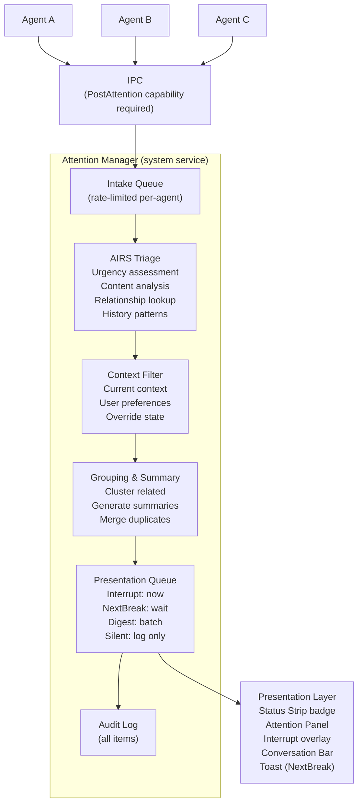

# AIOS Attention Management

## Deep Technical Architecture

**Parent document:** [architecture.md](../project/architecture.md)
**Related:** [airs.md](./airs.md) — Urgency inference and summarization, [context-engine.md](./context-engine.md) — Context-aware filtering, [experience.md](../experience/experience.md) — Attention Panel UI, [agents.md](../applications/agents.md) — Agent attention posting, [model.md](../security/model.md) — Capability enforcement

-----

## 1. Overview

Notifications are broken. Every application believes its messages are important. A promotional email has the same visual weight as a server outage. A game achievement badge interrupts a deep coding session. Users receive hundreds of notifications per day and learn to ignore them all — which means they also miss the ones that matter.

The problem is structural: traditional notification systems let **senders** decide importance. The app that sends the notification chooses the title, the sound, the badge count, the priority level. A social media app has every incentive to mark everything as urgent. The user is the victim of a race to the bottom where every notification screams for attention.

AIOS inverts this. **The AI decides importance, not the sender.** Agents post attention items — structured descriptions of events — and the Attention Manager uses AIRS to assess urgency based on the user's context, relationships, history, and the actual content. An agent cannot set its own urgency. It can declare what happened. The system decides whether the user cares.

**Key principles:**

1. **AI-assessed urgency.** The sender describes the event. AIRS determines importance.
2. **Context-aware delivery.** What gets through depends on what the user is doing right now.
3. **Never interruptive unless genuinely urgent.** During leisure, only a system error or a critical person breaks through.
4. **Summarized, not listed.** Five Slack messages become one line: "5 messages in #engineering (none urgent)."
5. **Actionable, not just dismissible.** Every attention item has concrete actions, not just "OK."

-----

## 2. Architecture



-----

## 3. The Attention Item

### 3.1 Data Model

```rust
pub struct AttentionItem {
    /// Unique identifier
    pub id: AttentionId,

    /// Which agent posted this item
    pub source: AgentId,

    /// Structured content — not a free-form string
    pub content: AttentionContent,

    /// AI-assessed urgency (set by AIRS, not by the agent)
    pub urgency: Urgency,

    /// Relevance to the user's current activity (0.0 - 1.0)
    pub relevance: f32,

    /// Proposed action the user can take with one click
    pub auto_actionable: Option<ProposedAction>,

    /// Group ID for clustering related items
    pub group: Option<GroupId>,

    /// When this item was posted
    pub timestamp: SystemTime,

    /// When this item expires (no longer relevant)
    pub expiry: Option<SystemTime>,

    /// Whether the user has seen this item
    pub seen: bool,

    /// Whether the user has acted on this item
    pub acted: bool,

    /// Triage metadata from AIRS
    pub triage: TriageMetadata,
}

pub enum AttentionContent {
    /// Message from a person
    PersonMessage {
        sender: IdentityId,
        channel: String,
        preview: String,
        service: ServiceId,
    },
    /// System event (build, deploy, error)
    SystemEvent {
        event_type: SystemEventType,
        summary: String,
        details: Option<String>,
    },
    /// Agent report (task complete, results ready)
    AgentReport {
        agent: AgentId,
        task: Option<TaskId>,
        summary: String,
        results: Option<Vec<ObjectId>>,
    },
    /// Calendar/scheduling
    Schedule {
        event_name: String,
        time: SystemTime,
        change: Option<ScheduleChange>,
    },
    /// External service update
    ServiceUpdate {
        service: ServiceId,
        summary: String,
        url: Option<String>,
    },
}

pub enum Urgency {
    /// Show immediately — system error, critical person, safety alert
    Interrupt,
    /// Show when the user next pauses — colleague message, build result
    NextBreak,
    /// Batch into periodic summary — newsletters, non-urgent updates
    Digest,
    /// Log but never show — telemetry, routine confirmations
    Silent,
}
```

### 3.2 How Items Differ from Notifications

| Property | Traditional Notification | AIOS Attention Item |
| --- | --- | --- |
| Urgency | Set by sending app | Set by AI based on content + context |
| Content | Free-form string | Typed, structured data |
| Grouping | None (chronological list) | AI clusters related items |
| Summarization | None | AI generates one-line summaries |
| Actions | Dismiss / Open app | Context-specific (Reply, Accept, Snooze, etc.) |
| Filtering | Per-app toggle | Per-context, per-relationship, AI-triaged |
| History | Scrollback until cleared | Queryable audit log with analytics |

-----

## 4. Urgency Assessment

### 4.1 How AIRS Determines Urgency

When an attention item arrives, AIRS evaluates multiple signals to assign urgency:

```rust
pub struct UrgencyAssessment {
    /// Final urgency level
    pub urgency: Urgency,
    /// Confidence in the assessment (0.0 - 1.0)
    pub confidence: f32,
    /// Signals that contributed to the decision
    pub signals: Vec<UrgencySignal>,
}

pub enum UrgencySignal {
    /// Sender is in user's relationships with high trust
    RelationshipPriority { identity: IdentityId, trust: TrustLevel },
    /// Content contains urgency markers ("ASAP", "urgent", "down", "broken")
    ContentUrgencyMarkers { markers: Vec<String> },
    /// Content sentiment indicates distress or emergency
    SentimentAnalysis { sentiment: Sentiment, confidence: f32 },
    /// User historically engages with items from this source quickly
    HistoricalEngagement { source: AgentId, avg_response_time: Duration },
    /// Item is time-sensitive (meeting in 10 minutes, deployment window)
    TimeSensitivity { deadline: SystemTime },
    /// Source agent trust level (system agents rank higher)
    AgentTrustLevel { trust: TrustLevel },
    /// Content type inherently urgent (system errors, security alerts)
    InherentUrgency { event_type: SystemEventType },
}
```

### 4.1.1 AttentionModel

The `AttentionModel` holds urgency classification parameters used by the Attention Manager
to calibrate how incoming items are assessed (referenced by architecture.md §2.6 and
context-engine.md).

```rust
pub struct AttentionModel {
    /// Weights for each urgency signal type (tuned per-user over time)
    pub signal_weights: HashMap<UrgencySignalKind, f32>,
    /// Threshold above which an item is classified as Interrupt
    pub interrupt_threshold: f32,
    /// Threshold for NextBreak classification
    pub next_break_threshold: f32,
    /// Threshold for Digest classification (below this → Silent)
    pub digest_threshold: f32,
    /// Decay factor for historical engagement influence
    pub engagement_decay: f32,
    /// Maximum number of interrupts per hour before auto-dampening
    pub interrupt_rate_limit: u32,
}

pub enum UrgencySignalKind {
    RelationshipPriority,
    ContentUrgencyMarkers,
    SentimentAnalysis,
    HistoricalEngagement,
    TimeSensitivity,
    AgentTrustLevel,
    InherentUrgency,
}
```

### 4.2 Assessment Pipeline

```rust
impl AttentionManager {
    async fn assess_urgency(&self, item: &mut AttentionItem) -> UrgencyAssessment {
        let mut signals = Vec::new();

        // 1. Check if sender is a known identity with high trust
        if let AttentionContent::PersonMessage { sender, .. } = &item.content {
            if let Some(rel) = self.identity_service.get_relationship(sender).await {
                let priority = match rel.kind {
                    RelationshipKind::Family => UrgencySignal::RelationshipPriority {
                        identity: *sender,
                        trust: TrustLevel::Trusted,
                    },
                    RelationshipKind::Colleague => UrgencySignal::RelationshipPriority {
                        identity: *sender,
                        trust: rel.trust_level,
                    },
                    _ => UrgencySignal::RelationshipPriority {
                        identity: *sender,
                        trust: TrustLevel::Known,
                    },
                };
                signals.push(priority);
            }
        }

        // 2. Content analysis via AIRS inference
        let content_text = item.content.to_text();
        let analysis = self.airs.analyze_urgency(&content_text).await;
        if !analysis.urgency_markers.is_empty() {
            signals.push(UrgencySignal::ContentUrgencyMarkers {
                markers: analysis.urgency_markers,
            });
        }
        signals.push(UrgencySignal::SentimentAnalysis {
            sentiment: analysis.sentiment,
            confidence: analysis.confidence,
        });

        // 3. Historical engagement patterns
        let history = self.audit_log.engagement_stats(&item.source).await;
        if history.avg_response_time < Duration::from_secs(60) {
            signals.push(UrgencySignal::HistoricalEngagement {
                source: item.source,
                avg_response_time: history.avg_response_time,
            });
        }

        // 4. Time sensitivity
        if let AttentionContent::Schedule { time, .. } = &item.content {
            let until = time.duration_since(SystemTime::now()).unwrap_or_default();
            if until < Duration::from_secs(600) {
                signals.push(UrgencySignal::TimeSensitivity { deadline: *time });
            }
        }

        // 5. Inherent urgency from system events
        if let AttentionContent::SystemEvent { event_type, .. } = &item.content {
            match event_type {
                SystemEventType::Error | SystemEventType::SecurityAlert => {
                    signals.push(UrgencySignal::InherentUrgency {
                        event_type: *event_type,
                    });
                }
                _ => {}
            }
        }

        // 6. Compute final urgency from signals
        let urgency = Self::compute_urgency(&signals);
        let confidence = Self::compute_confidence(&signals);

        UrgencyAssessment { urgency, confidence, signals }
    }

    fn compute_urgency(signals: &[UrgencySignal]) -> Urgency {
        // Any inherent urgency signal → Interrupt
        if signals.iter().any(|s| matches!(s, UrgencySignal::InherentUrgency { .. })) {
            return Urgency::Interrupt;
        }

        // Family + urgency markers → Interrupt
        let has_family = signals.iter().any(|s| matches!(s,
            UrgencySignal::RelationshipPriority { trust: TrustLevel::Trusted, .. }
        ));
        let has_urgency_markers = signals.iter().any(|s| matches!(s,
            UrgencySignal::ContentUrgencyMarkers { .. }
        ));
        if has_family && has_urgency_markers {
            return Urgency::Interrupt;
        }

        // Time-sensitive → NextBreak (or Interrupt if < 5 min)
        if let Some(UrgencySignal::TimeSensitivity { deadline }) =
            signals.iter().find(|s| matches!(s, UrgencySignal::TimeSensitivity { .. }))
        {
            let until = deadline.duration_since(SystemTime::now()).unwrap_or_default();
            if until < Duration::from_secs(300) {
                return Urgency::Interrupt;
            }
            return Urgency::NextBreak;
        }

        // Known person with fast historical response → NextBreak
        let has_known_person = signals.iter().any(|s| matches!(s,
            UrgencySignal::RelationshipPriority { .. }
        ));
        let fast_response = signals.iter().any(|s| matches!(s,
            UrgencySignal::HistoricalEngagement { .. }
        ));
        if has_known_person && fast_response {
            return Urgency::NextBreak;
        }

        // Default for known persons
        if has_known_person {
            return Urgency::NextBreak;
        }

        // Everything else → Digest
        Urgency::Digest
    }
}
```

### 4.3 Why Agents Cannot Set Urgency

If agents controlled their own urgency, every agent would set `Interrupt`. This is exactly the problem with traditional notifications. In AIOS:

- The agent's `PostAttention` IPC message has no urgency field.
- The agent provides `AttentionContent` — a structured description of what happened.
- AIRS assesses urgency based on content, sender, context, and history.
- The agent never knows what urgency was assigned to its item.

This removes the incentive for urgency inflation. An agent that says "server is down" will be assessed as urgent because the content analysis detects a critical event, not because the agent claimed it was urgent.

-----

## 5. Context Filtering

After urgency assessment, items pass through the Context Filter. The user's current context determines what gets through:

### 5.1 Context-Based Thresholds

```rust
pub struct ContextFilter {
    context: ContextState,
    user_overrides: AttentionPreferences,
}

impl ContextFilter {
    pub fn should_present(&self, item: &AttentionItem) -> PresentationDecision {
        let threshold = self.threshold_for_context();

        match item.urgency {
            Urgency::Interrupt => {
                // Interrupt always gets through unless user explicitly suppressed
                if self.user_overrides.suppress_all {
                    PresentationDecision::Queue
                } else {
                    PresentationDecision::Immediate
                }
            }
            Urgency::NextBreak => {
                if threshold <= UrgencyThreshold::NextBreak {
                    PresentationDecision::WaitForBreak
                } else {
                    PresentationDecision::Digest
                }
            }
            Urgency::Digest => {
                PresentationDecision::Digest
            }
            Urgency::Silent => {
                PresentationDecision::LogOnly
            }
        }
    }

    fn threshold_for_context(&self) -> UrgencyThreshold {
        match self.context.mode() {
            ContextMode::Work => UrgencyThreshold::NextBreak,
            ContextMode::Leisure => UrgencyThreshold::InterruptOnly,
            ContextMode::Focus => UrgencyThreshold::InterruptOnly,
            ContextMode::Gaming => UrgencyThreshold::InterruptOnly,
        }
    }
}

pub enum PresentationDecision {
    /// Show now (interrupt overlay or toast)
    Immediate,
    /// Queue until user pauses activity
    WaitForBreak,
    /// Include in next digest
    Digest,
    /// Log to audit, never present
    LogOnly,
    /// Queue until context changes
    Queue,
}
```

### 5.2 Break Detection

For `NextBreak` items, the Attention Manager detects user pauses:

```rust
pub struct BreakDetector {
    last_input_time: Instant,
    break_threshold: Duration,    // default: 30 seconds of no input
    context_engine: ContextEngineClient,
}

impl BreakDetector {
    pub fn is_user_on_break(&self) -> bool {
        let idle_duration = Instant::now() - self.last_input_time;
        idle_duration > self.break_threshold
    }

    pub fn on_input_event(&mut self) {
        self.last_input_time = Instant::now();
    }

    pub fn on_break_detected(&self) -> Vec<AttentionItem> {
        // Return all queued NextBreak items
        self.next_break_queue.drain(..).collect()
    }
}
```

When the user pauses (30 seconds of no input), queued `NextBreak` items appear as subtle toasts — visible but not blocking.

### 5.3 Context Transition Flush

When the Context Engine detects a transition (work → leisure), the Attention Manager re-evaluates all queued items:

```rust
impl AttentionManager {
    pub fn on_context_transition(&mut self, old: ContextMode, new: ContextMode) {
        // Re-filter all queued items with new context
        let mut to_present = Vec::new();
        for item in self.queued_items.drain(..) {
            let decision = self.context_filter.should_present(&item);
            match decision {
                PresentationDecision::Immediate | PresentationDecision::WaitForBreak => {
                    to_present.push(item);
                }
                PresentationDecision::Digest => {
                    self.digest_buffer.push(item);
                }
                PresentationDecision::LogOnly => {
                    self.audit_log.record(&item);
                }
                PresentationDecision::Queue => {
                    self.queued_items.push(item);
                }
            }
        }

        // Present accumulated items as a digest on transition
        if !to_present.is_empty() {
            self.present_transition_digest(to_present);
        }
    }
}
```

-----

## 6. Grouping and Summarization

### 6.1 Grouping Algorithm

Related items are clustered before presentation. Grouping reduces noise — instead of 12 individual Slack messages, the user sees "12 Slack messages in 3 channels."

```rust
pub struct AttentionGroup {
    pub id: GroupId,
    pub items: Vec<AttentionItem>,
    pub summary: String,           // AI-generated one-liner
    pub highest_urgency: Urgency,  // max urgency in group
    pub source_agent: AgentId,     // common source
    pub category: GroupCategory,
}

pub enum GroupCategory {
    /// Messages from one channel/thread
    MessageThread { channel: String, count: usize },
    /// Multiple events from same agent
    AgentBatch { agent: AgentId, count: usize },
    /// CI/build results
    BuildResults { passed: usize, failed: usize },
    /// Email digest
    EmailBatch { count: usize, important: usize },
    /// Uncategorized cluster
    Mixed { count: usize },
}

impl AttentionManager {
    fn group_items(&self, items: &[AttentionItem]) -> Vec<AttentionGroup> {
        let mut groups: HashMap<GroupKey, Vec<&AttentionItem>> = HashMap::new();

        for item in items {
            let key = self.group_key(item);
            groups.entry(key).or_default().push(item);
        }

        groups.into_iter().map(|(key, items)| {
            let highest_urgency = items.iter()
                .map(|i| &i.urgency)
                .max()
                .cloned()
                .unwrap_or(Urgency::Silent);

            let summary = self.airs.summarize_group(&items);

            AttentionGroup {
                id: GroupId::new(),
                items: items.into_iter().cloned().collect(),
                summary,
                highest_urgency,
                source_agent: items[0].source,
                category: Self::categorize(&key, &items),
            }
        }).collect()
    }

    fn group_key(&self, item: &AttentionItem) -> GroupKey {
        match &item.content {
            AttentionContent::PersonMessage { channel, service, .. } => {
                GroupKey::Channel(service.clone(), channel.clone())
            }
            AttentionContent::SystemEvent { event_type, .. } => {
                GroupKey::SystemEvent(*event_type)
            }
            AttentionContent::AgentReport { agent, .. } => {
                GroupKey::Agent(*agent)
            }
            AttentionContent::ServiceUpdate { service, .. } => {
                GroupKey::Service(service.clone())
            }
            AttentionContent::Schedule { .. } => {
                GroupKey::Schedule
            }
        }
    }
}
```

### 6.2 AI Summarization

AIRS generates natural language summaries for groups:

```rust
impl AirsClient {
    pub async fn summarize_group(&self, items: &[&AttentionItem]) -> String {
        let context = SummarizationContext {
            item_count: items.len(),
            content_previews: items.iter()
                .take(5)
                .map(|i| i.content.to_text())
                .collect(),
            source_info: items[0].source.display_name(),
            time_span: TimeSpan::from_items(items),
        };

        // AIRS inference call
        let prompt = format!(
            "Summarize {} attention items from {} in one sentence. \
             Items span {}. Previews: {}",
            context.item_count,
            context.source_info,
            context.time_span,
            context.content_previews.join("; "),
        );

        self.infer(&prompt, ModelProfile::FastSummary).await
    }
}
```

Example summaries:

| Items | Summary |
| --- | --- |
| 5 Slack messages in #engineering | "5 messages in #engineering about deployment timing (none urgent)" |
| 3 CI builds | "3 builds completed: 2 passed, 1 failed (main branch)" |
| 8 emails | "8 emails: 1 from Alex about meeting, 5 newsletters, 2 automated" |
| 4 agent reports | "research-agent finished processing 4 papers, results in research/" |

-----

## 7. The Attention Digest

### 7.1 Digest Structure

The digest is a periodic summary of all attention activity since the user's last check:

```rust
pub struct AttentionDigest {
    /// Time range this digest covers
    pub since: SystemTime,
    pub until: SystemTime,

    /// Items requiring action, grouped by urgency
    pub urgent: Vec<AttentionGroup>,
    pub summary: Vec<AttentionGroup>,
    pub deferred: Vec<AttentionGroup>,

    /// Aggregate statistics
    pub stats: DigestStats,
}

pub struct DigestStats {
    pub total_items: usize,
    pub items_by_source: HashMap<AgentId, usize>,
    pub items_actioned: usize,
    pub items_auto_resolved: usize,
}
```

### 7.2 When Digests Are Presented

Digests are presented at natural transition points, never arbitrarily:

```rust
pub enum DigestTrigger {
    /// User tapped the attention badge in the Status Strip
    UserRequested,
    /// Context transition (work → leisure, focus → work)
    ContextTransition { from: ContextMode, to: ContextMode },
    /// Long break detected (> 5 minutes idle)
    LongBreak,
    /// Conversation Bar query ("what did I miss?")
    ConversationQuery,
    /// Scheduled digest time (if user configured, e.g., every 2 hours)
    Scheduled,
}
```

### 7.3 Digest Rendering

```text
┌─ ATTENTION ──────────────────────────────────────────────┐
│                                                           │
│  ── Since 13:00 (2 hours ago) ──                         │
│                                                           │
│  URGENT                                                   │
│  ┌─────────────────────────────────────────────────────┐ │
│  │  Alex: "Server is down, need your help ASAP"        │ │
│  │  Slack · 15 min ago                                  │ │
│  │  [Reply] [Open Slack]                                │ │
│  └─────────────────────────────────────────────────────┘ │
│                                                           │
│  SUMMARY                                                  │
│  ┌─────────────────────────────────────────────────────┐ │
│  │  5 Slack messages in #engineering (none urgent)      │ │
│  │  2 emails: 1 newsletter, 1 meeting confirmation     │ │
│  │  CI: 3 builds passed, 0 failed                      │ │
│  │  backup-agent: daily backup completed (312 objects)  │ │
│  └─────────────────────────────────────────────────────┘ │
│                                                           │
│  DEFERRED                                                 │
│  ┌─────────────────────────────────────────────────────┐ │
│  │  System update available (non-urgent)                │ │
│  │  Weather: rain expected tomorrow                     │ │
│  └─────────────────────────────────────────────────────┘ │
│                                                           │
│  Total: 14 items · 1 needs action · 13 informational    │
│  [Mark all seen] [Settings]                               │
│                                                           │
└───────────────────────────────────────────────────────────┘
```

-----

## 8. Auto-Actionable Items

### 8.1 Proposed Actions

Some attention items arrive with actions the user can take immediately:

```rust
pub struct ProposedAction {
    /// Human-readable description of what this action does
    pub description: String,
    /// The actual action to execute
    pub action: ActionType,
    /// Required capabilities (verified before presenting)
    pub required_capabilities: Vec<Capability>,
    /// Whether this action is reversible
    pub reversible: bool,
}

pub enum ActionType {
    /// Reply to a message
    Reply { channel: IpcChannel, draft: Option<String> },
    /// Open a URL or Space object
    Open { target: OpenTarget },
    /// Accept/decline a calendar event
    CalendarResponse { event_id: String, response: CalendarRsvp },
    /// Dismiss or snooze
    Snooze { duration: Duration },
    /// Run an agent task
    AgentTask { agent: AgentId, task: TaskSpec },
    /// Custom action defined by the posting agent
    Custom { agent: AgentId, action_id: String, params: serde_json::Value },
}
```

### 8.2 Action Verification

Before presenting an auto-actionable item, the Attention Manager verifies that the proposed action's required capabilities are available:

```rust
impl AttentionManager {
    fn verify_action(&self, action: &ProposedAction) -> bool {
        for cap in &action.required_capabilities {
            if !self.capability_manager.check(cap) {
                return false;
            }
        }
        true
    }

    fn present_item(&self, item: &AttentionItem) -> PresentableItem {
        let actions = if let Some(proposed) = &item.auto_actionable {
            if self.verify_action(proposed) {
                vec![
                    PresentableAction::primary(&proposed.description),
                    PresentableAction::secondary("Snooze"),
                    PresentableAction::secondary("Dismiss"),
                ]
            } else {
                vec![PresentableAction::secondary("Dismiss")]
            }
        } else {
            vec![PresentableAction::secondary("Dismiss")]
        };

        PresentableItem { item: item.clone(), actions }
    }
}
```

### 8.3 Examples

| Event | Proposed Actions |
| --- | --- |
| "Alex asks: can you review PR #427?" | [Accept and open PR] [Decline] [Remind in 1hr] |
| "Meeting moved to 16:00" | [Acknowledge] [Suggest different time] [Decline] |
| "CI build failed on feature branch" | [View logs] [Rerun] [Dismiss] |
| "backup-agent completed daily backup" | [View details] — auto-dismiss after 1 hour |
| "System update available" | [Install at next reboot] [Remind tomorrow] [Details] |

-----

## 9. Agent Interaction

### 9.1 Posting Attention Items

Agents post attention items via IPC. The agent needs the `PostAttention` capability in its manifest:

```toml
# Agent manifest
[capabilities]
attention = "post"  # can post attention items
```

```rust
// Agent code — posting an attention item
use aios_sdk::attention;

pub async fn notify_results_ready(results: &[ObjectId]) {
    attention::post(AttentionRequest {
        content: AttentionContent::AgentReport {
            agent: self_agent_id(),
            task: current_task_id(),
            summary: format!("Found {} papers matching your criteria", results.len()),
            results: Some(results.to_vec()),
        },
        // Note: no urgency field. The agent cannot set urgency.
        expiry: Some(SystemTime::now() + Duration::from_hours(24)),
        auto_action: Some(ProposedAction {
            description: "View results in Space Navigator".into(),
            action: ActionType::Open {
                target: OpenTarget::Space("research/papers/".into()),
            },
            required_capabilities: vec![],
            reversible: true,
        }),
    }).await;
}
```

### 9.2 Rate Limiting

To prevent attention flooding, the Attention Manager rate-limits per agent:

```rust
pub struct RateLimiter {
    /// Maximum items per minute per agent
    per_minute: HashMap<AgentId, u32>,
    /// Maximum items per hour per agent
    per_hour: HashMap<AgentId, u32>,
    /// Default limits
    default_per_minute: u32,  // 10
    default_per_hour: u32,    // 100
}

impl RateLimiter {
    pub fn check(&mut self, agent: &AgentId) -> RateLimitResult {
        let minute_count = self.per_minute.entry(*agent).or_insert(0);
        let hour_count = self.per_hour.entry(*agent).or_insert(0);

        if *minute_count >= self.default_per_minute {
            return RateLimitResult::Throttled {
                retry_after: Duration::from_secs(60),
            };
        }
        if *hour_count >= self.default_per_hour {
            return RateLimitResult::Throttled {
                retry_after: Duration::from_secs(3600),
            };
        }

        *minute_count += 1;
        *hour_count += 1;
        RateLimitResult::Allowed
    }
}
```

If an agent exceeds rate limits, its items are silently demoted to `Silent` urgency and logged for review. Repeated violations trigger a behavioral anomaly flag in AIRS.

-----

## 10. Presentation Layer

### 10.1 Presentation Channels

Attention items reach the user through different channels depending on urgency and context:

```rust
pub enum PresentationChannel {
    /// Status Strip badge — count of unseen items
    /// Always visible (except Gaming mode)
    StatusBadge,

    /// Attention Panel — full digest view
    /// Opened by tapping badge or asking "what did I miss?"
    AttentionPanel,

    /// Interrupt overlay — urgent items
    /// Slides in from edge, requires acknowledgment
    InterruptOverlay,

    /// Toast — NextBreak items during detected pause
    /// Subtle, auto-dismisses after 5 seconds, non-blocking
    Toast,

    /// Conversation Bar — queryable
    /// "What notifications did I get?" / "Any messages from Alex?"
    ConversationBar,
}
```

### 10.2 Routing Logic

```rust
impl PresentationRouter {
    pub fn route(&self, item: &AttentionItem, decision: PresentationDecision)
        -> Vec<PresentationChannel>
    {
        match decision {
            PresentationDecision::Immediate => {
                vec![
                    PresentationChannel::InterruptOverlay,
                    PresentationChannel::StatusBadge,
                ]
            }
            PresentationDecision::WaitForBreak => {
                vec![
                    PresentationChannel::Toast,  // when break detected
                    PresentationChannel::StatusBadge,
                ]
            }
            PresentationDecision::Digest => {
                vec![PresentationChannel::StatusBadge]
                // Appears in AttentionPanel when user opens it
            }
            PresentationDecision::LogOnly => {
                vec![] // audit log only
            }
            PresentationDecision::Queue => {
                vec![] // held until context changes
            }
        }
    }
}
```

### 10.3 Interrupt Overlay

For `Interrupt`-level items, a non-dismissible overlay appears:

```text
┌─────────────────────────────────────────────────────────┐
│                                                          │
│  ⚠ Alex (Slack):                                        │
│  "Server is down, need your help ASAP"                  │
│                                                          │
│  [Reply] [Open Slack] [Snooze 15min]                    │
│                                                          │
└─────────────────────────────────────────────────────────┘
```

The overlay is:

- Positioned at the top of the screen, not fullscreen
- Semi-transparent background so context isn't lost
- Requires one action (reply, open, snooze, or dismiss)
- Plays a subtle audio cue (configurable, can be silenced)

-----

## 11. User Controls

### 11.1 Per-Agent Settings

```rust
pub struct AgentAttentionConfig {
    /// Override urgency for this agent (e.g., "never interrupt me for this")
    pub max_urgency: Option<Urgency>,
    /// Whether this agent's items appear in digests
    pub include_in_digest: bool,
    /// Custom rate limits
    pub rate_limit: Option<RateLimit>,
    /// Whether to auto-dismiss after expiry
    pub auto_dismiss: bool,
}
```

### 11.2 Relationship Overrides

```rust
pub struct RelationshipAttentionConfig {
    /// Always interrupt for this person, regardless of context
    pub always_interrupt: bool,
    /// Never show items from this person (blocked)
    pub blocked: bool,
    /// Custom sound for this person
    pub custom_sound: Option<SoundId>,
}
```

### 11.3 Conversational Configuration

All attention settings are configurable via the Conversation Bar:

- "Never interrupt me for the weather agent" → sets max_urgency to Digest
- "Always show messages from Alex immediately" → sets always_interrupt for Alex
- "Suppress notifications until 7am" → sets time-based override
- "I'm heads down for 2 hours" → Context Engine override, InterruptOnly threshold
- "How many notifications did I get today?" → audit log query

### 11.4 Do Not Disturb

```rust
pub struct DoNotDisturb {
    pub active: bool,
    pub until: Option<SystemTime>,
    pub exceptions: Vec<DndException>,
}

pub enum DndException {
    /// Allow interrupts from specific identities
    Identity(IdentityId),
    /// Allow interrupts from specific agents
    Agent(AgentId),
    /// Allow system-level emergencies
    SystemEmergency,
    /// Allow phone calls (if telephony agent exists)
    PhoneCalls,
}
```

-----

## 12. Relationship-Aware Priority

The Identity system feeds into urgency assessment. Items from people the user has relationships with receive priority adjustments:

```rust
pub struct RelationshipPriorityBoost {
    pub relationship_kind: RelationshipKind,
    pub urgency_boost: i8,  // -2 to +2
}

impl RelationshipPriorityBoost {
    pub fn for_kind(kind: RelationshipKind) -> Self {
        match kind {
            RelationshipKind::Family => Self { relationship_kind: kind, urgency_boost: 2 },
            RelationshipKind::Friend => Self { relationship_kind: kind, urgency_boost: 1 },
            RelationshipKind::Colleague => Self { relationship_kind: kind, urgency_boost: 1 },
            RelationshipKind::Acquaintance => Self { relationship_kind: kind, urgency_boost: 0 },
            RelationshipKind::Service => Self { relationship_kind: kind, urgency_boost: -1 },
            RelationshipKind::Unknown => Self { relationship_kind: kind, urgency_boost: -2 },
        }
    }
}
```

A `Digest`-level message from a family member gets boosted to `NextBreak`. A `NextBreak`-level marketing message from an unknown service gets demoted to `Digest`. The user's relationship graph is the signal, not the sender's self-declared importance.

-----

## 13. Audit and History

### 13.1 Audit Log

Every attention item is recorded in `system/audit/attention/`:

```rust
pub struct AuditEntry {
    pub item: AttentionItem,
    pub triage: TriageMetadata,
    pub presentation: PresentationDecision,
    pub user_action: Option<UserAction>,
    pub response_time: Option<Duration>,
    pub timestamp: SystemTime,
    /// SHA-256 hash of the previous entry, forming a tamper-evident chain.
    /// Zero hash for the first entry in the log.
    pub prev_hash: ContentHash,
}

pub enum UserAction {
    Seen,
    Dismissed,
    Acted(ActionType),
    Snoozed(Duration),
    Never, // user never saw this item
}
```

### 13.2 Queryable History

Users can query attention history via the Conversation Bar:

- "What notifications did I get last week?" → time-range query
- "How many items did the weather agent post?" → per-agent stats
- "Show me everything Alex sent" → identity-filtered query
- "What's my average notification rate?" → analytics query
- "Did I miss anything important yesterday?" → urgency-filtered query with AI assessment

### 13.3 Pattern Analysis

AIRS periodically analyzes attention patterns to improve triage:

```rust
pub struct AttentionAnalytics {
    /// Items per day, trending up or down
    pub daily_volume: TimeSeries,
    /// Average response time per urgency level
    pub response_times: HashMap<Urgency, Duration>,
    /// Agents with highest post volume
    pub top_agents: Vec<(AgentId, usize)>,
    /// Items the user consistently ignores
    pub ignored_patterns: Vec<IgnorePattern>,
    /// Items the user consistently acts on quickly
    pub engaged_patterns: Vec<EngagePattern>,
}
```

If the user consistently ignores items from a particular agent, AIRS suggests reducing that agent's urgency or suppressing it entirely. If the user always responds quickly to a particular person, AIRS boosts that person's priority.

-----

## 14. Performance

### 14.1 Latency Targets

| Operation | Target |
| --- | --- |
| Intake (receive IPC message) | < 1ms |
| AIRS urgency assessment | < 50ms for single item |
| Context filter check | < 1ms |
| Grouping (batch of 10) | < 10ms |
| Summarization (AIRS) | < 200ms for group summary |
| Presentation routing | < 1ms |
| Total intake-to-presentation (Interrupt) | < 100ms |
| Total intake-to-presentation (NextBreak) | < 500ms |
| Digest generation | < 2 seconds |

### 14.2 Batch Processing

Non-urgent items are batched to amortize AIRS inference costs:

```rust
impl AttentionManager {
    async fn process_batch(&mut self) {
        // Collect items from intake queue (up to 50)
        let batch: Vec<AttentionItem> = self.intake_queue
            .drain(..self.intake_queue.len().min(50))
            .collect();

        if batch.is_empty() {
            return;
        }

        // Batch urgency assessment (single AIRS call for efficiency)
        let assessments = self.airs.batch_assess_urgency(&batch).await;

        // Apply assessments and route
        for (mut item, assessment) in batch.into_iter().zip(assessments) {
            item.urgency = assessment.urgency;
            item.triage = assessment.into();
            let decision = self.context_filter.should_present(&item);
            self.route(item, decision);
        }
    }
}
```

### 14.3 Caching

Urgency assessments for recurring patterns are cached:

```rust
pub struct TriageCache {
    /// Cache key: (source_agent, content_type_hash)
    cache: LruCache<(AgentId, u64), CachedAssessment>,
    ttl: Duration, // 1 hour
}

pub struct CachedAssessment {
    pub urgency: Urgency,
    pub created: Instant,
}
```

If the same agent posts the same type of content repeatedly (e.g., hourly build results), the cached assessment is used instead of calling AIRS again.

-----

## 15. Boot-Time Initialization

The Attention Manager is a system service that starts during boot Phase 4 (User Services). Unlike most services, the Attention Manager must handle a bootstrapping problem: it depends on AIRS for urgency assessment, but AIRS may still be loading its model when the first attention items arrive. This section specifies the Attention Manager's initialization sequence, its minimal startup state, and how it connects to the compositor notification pipeline.

### 15.1 Initialization Sequence

```text
Boot Phase 4 — Attention Manager startup:

1. Service Manager spawns Attention Manager process
   Capabilities granted: PostAttention (receive), ContextRead,
   CompositorNotify, AIRSInference (optional at this point)

2. Load user preferences from user/preferences/attention/
   - Per-agent suppression rules
   - Per-person priority boosts
   - Quiet hours schedule
   - Digest frequency setting
   If preferences don't exist (first boot): use built-in defaults

3. Initialize intake queue
   - Per-agent rate limiters (default: 10 items/minute/agent)
   - Total queue depth: 1000 items
   - Items arriving before AIRS is ready are queued, not dropped

4. Initialize audit log writer
   - Connect to system/audit/attention/ Space
   - All items logged regardless of AIRS availability

5. Connect to Context Engine (if available)
   - Subscribe to ContextState changes
   - If Context Engine not yet ready: assume ContextMode::Default
     (medium notification threshold, no context filtering)

6. Probe AIRS availability
   - Send a lightweight health check to AIRS inference endpoint
   - If AIRS responds: enter AI-triage mode (normal operation)
   - If AIRS not yet ready: enter rule-based triage mode (§15.2)

7. Connect to Compositor notification pipeline
   - Register as the notification source for Status Strip badge
   - Register as the source for interrupt overlays
   - If Compositor not yet ready (Phase 4 runs before Phase 5):
     buffer presentation events until compositor connects

8. Signal Service Manager: Attention Manager ready
   - Other services can now post attention items via IPC
```

### 15.2 Pre-AIRS Triage (Rule-Based Mode)

Before AIRS loads its model (which may take several seconds on slow storage), the Attention Manager uses rule-based urgency assessment. This is a simpler, faster evaluation that doesn't require LLM inference.

```rust
pub struct RuleBasedTriage {
    /// Keyword patterns in item text that indicate high urgency,
    /// e.g. "ASAP", "urgent", "down", "broken", "outage", "cannot log in".
    /// Typically matched as simple case-insensitive substrings.
    urgent_keywords: Vec<&'static str>,
    /// Agent categories with default urgency levels
    agent_urgency_defaults: HashMap<AgentCategory, Urgency>,
    /// Person priority from identity system (if available)
    relationship_boosts: HashMap<IdentityId, f32>,
}

impl RuleBasedTriage {
    pub fn assess(&self, item: &AttentionItem) -> UrgencyAssessment {
        let mut score: f32 = 0.0;

        // 1. Agent category baseline
        score += match item.source.category {
            AgentCategory::System => 0.8,       // system alerts are usually important
            AgentCategory::Communication => 0.5, // messages vary
            AgentCategory::Productivity => 0.3,  // typically low urgency
            AgentCategory::Media => 0.1,         // almost never urgent
            AgentCategory::Gaming => 0.05,       // never urgent
            _ => 0.3,
        };

        // 2. Keyword scan (no AI, just pattern matching)
        if self.urgent_keywords.iter().any(|kw| item.content.to_text().contains(kw)) {
            score += 0.3;
        }

        // 3. Relationship boost (if identity service is up)
        if let AttentionContent::PersonMessage { sender, .. } = &item.content {
            if let Some(boost) = self.relationship_boosts.get(sender) {
                score += boost;  // e.g., +0.4 for family members
            }
        }

        // 4. Content type baseline (structural signal, not agent-declared)
        score += match &item.content {
            AttentionContent::SystemEvent { event_type, .. } => match event_type {
                SystemEventType::Error | SystemEventType::SecurityAlert => 0.2,
                _ => 0.0,
            },
            AttentionContent::Schedule { time, .. } => {
                // Time-sensitive items get a boost based on proximity
                let until = time.duration_since(SystemTime::now()).unwrap_or_default();
                if until < Duration::from_secs(600) { 0.2 } else { 0.0 }
            }
            _ => 0.0,
        };

        score = score.clamp(0.0, 1.0);

        UrgencyAssessment {
            urgency: if score > 0.8 {
                Urgency::Interrupt
            } else if score > 0.5 {
                Urgency::NextBreak
            } else if score > 0.2 {
                Urgency::Digest
            } else {
                Urgency::Silent
            },
            confidence: 0.3, // rule-based is always low confidence
            signals: Vec::new(), // no AI signals available
        }
    }
}
```

**Rule-based triage limitations:**
- No content understanding — cannot distinguish "server is on fire" from "server deployed successfully"
- No behavioral pattern learning — treats every notification from an app the same way
- No cross-item correlation — cannot group "5 messages from the same thread" without reading them
- Higher false-interrupt rate — more things get through that shouldn't

**Transition to AI triage.** When AIRS becomes available, the Attention Manager:
1. Switches to AI-triage mode for all new items
2. Does **not** re-triage queued items that were already delivered (that would cause duplicate notifications)
3. Re-triages queued items that are still in the intake queue (not yet delivered)
4. Logs the mode transition in the audit log

### 15.3 Minimal Startup State

The Attention Manager is functional with zero configuration:

| Dependency | Available at startup? | Fallback |
| --- | --- | --- |
| AIRS | Maybe (loading model) | Rule-based triage (§15.2) |
| Context Engine | Maybe (starting concurrently) | Assume ContextMode::Default — medium threshold |
| Identity Service | Maybe (starting concurrently) | No relationship boosts; all senders treated equally |
| Compositor | No (Phase 5) | Buffer presentation events; deliver when compositor connects |
| User Preferences | Yes (loaded from Space) | Built-in defaults if first boot |
| Audit Log | Yes (Space writer) | Always available after Phase 2 (storage) |

**First-boot behavior.** On first boot, no user preferences exist. The Attention Manager uses conservative defaults: only system agents can interrupt, everything else goes to the digest. The user configures preferences through the Conversation Bar ("make messages from Mom always interrupt") or the Settings agent. Preferences are stored in `user/preferences/attention/` and loaded on subsequent boots.

### 15.4 Compositor Connection

The Attention Manager connects to the compositor's notification pipeline during Phase 5, when the compositor starts. Before that connection:

- Items that would be interrupts are buffered (max 10 buffered interrupts)
- Items that would be digest or silent are stored normally
- When the compositor connects, buffered interrupts are delivered in chronological order
- If more than 10 interrupts buffered: oldest are demoted to digest (the user wasn't looking at the screen anyway)

The connection uses a dedicated IPC channel with the `CompositorNotify` capability. The Attention Manager sends structured presentation commands:

```rust
pub enum PresentationCommand {
    /// Update the Status Strip badge count
    UpdateBadge { unseen_count: u32, highest_urgency: Urgency },
    /// Show an interrupt overlay (urgent item)
    ShowInterrupt { item: PresentableItem, timeout: Duration },
    /// Show a toast notification (NextBreak item, user is at a break)
    ShowToast { item: PresentableItem, timeout: Duration },
    /// Update the Attention Panel content (digest items changed)
    RefreshPanel { items: Vec<PresentableItem> },
}
```

-----

## 16. Implementation Order

Development plan phases (see development-plan.md — not to be confused with boot phases):

```text
Dev Phase 9a:   Attention Manager service          → intake queue, audit log
Dev Phase 9b:   AIRS urgency assessment            → basic content analysis
Dev Phase 9c:   Context filtering                  → context-aware thresholds
Dev Phase 9d:   Status Strip badge                 → unseen count visible

Dev Phase 11a:  Attention Panel UI                 → digest view with grouping
Dev Phase 11b:  Interrupt overlay                  → urgent items break through
Dev Phase 11c:  Toast notifications                → NextBreak delivery
Dev Phase 11d:  Grouping and summarization         → AI-generated summaries

Dev Phase 14a:  Auto-actionable items              → one-click actions
Dev Phase 14b:  Relationship-aware priority        → identity integration
Dev Phase 14c:  User controls                      → per-agent, per-person settings
Dev Phase 14d:  Conversational configuration       → Conversation Bar integration

Dev Phase 17:   Break detection                    → idle-based NextBreak delivery
Dev Phase 19:   Pattern analysis                   → AIRS learns from engagement
Dev Phase 21:   Cross-device attention sync        → Space Mesh attention state
Dev Phase 24:   Attention analytics                → queryable history, trends
```

-----

## 17. Design Principles

1. **The AI decides importance, not the sender.** Agents describe events. AIRS assesses urgency. No agent can inflate its own priority.

2. **Context determines delivery.** The same item might interrupt during work but get digested during leisure. What matters is what the user is doing right now.

3. **Summarize, don't list.** Five related items become one summary. The user sees patterns, not individual alerts.

4. **Every item is actionable.** "Dismiss" is never the only option. Items carry proposed actions the user can take with one tap.

5. **Silence is the default.** Most of what happens in the background should stay in the background. The audit log captures everything; the user sees only what matters.

6. **Relationships are the signal.** A message from a family member is inherently more important than one from an unknown service. The identity system provides the context that traditional notification systems lack.

7. **The user is always in control.** Override any decision. Suppress any agent. Boost any person. The AI's assessment is a default, not a mandate.

8. **History is queryable.** Nothing is lost. Everything is in the audit log. "What did I miss?" has a real answer.

-----

## 18. Security

The Attention Manager sits at a critical trust boundary: it receives structured data from every agent on the system and decides what reaches the user's screen. A compromised or malicious agent that can manipulate the attention pipeline can escalate its own importance, suppress other agents' items, or inject misleading content into the user's attention stream.

### 18.1 Threat Model

| Threat | Attack vector | Impact |
| --- | --- | --- |
| Urgency inflation | Agent crafts AttentionContent with false urgency markers ("CRITICAL", "server down") to trick AIRS into assigning Interrupt | User interrupted unnecessarily; trust in attention system erodes |
| Attention flooding | Agent posts thousands of items per second to overwhelm intake queue | Legitimate items delayed or dropped; denial of service |
| Content injection | Agent embeds misleading text in `summary` or `preview` fields to impersonate another agent or person | User takes action based on false information |
| Suppression attack | Compromised agent fills the intake queue with low-priority items, pushing legitimate urgent items out of buffer | Urgent items missed |
| Audit log tampering | Agent attempts to modify or delete its own audit entries | Accountability broken; malicious activity hidden |
| Side-channel leak | Agent infers user context (Focus mode, activity, relationships) from delivery timing or rate-limit feedback | Privacy violation |

### 18.2 Capability Enforcement

The Attention Manager enforces capabilities at every boundary. No agent can interact with the attention pipeline without the appropriate token (see [capabilities.md](../security/model/capabilities.md) §3).

```rust
pub enum AttentionCapability {
    /// Post attention items to the intake queue.
    /// Granted to most agents. Rate-limited per §9.2.
    PostAttention,

    /// Read attention items posted by OTHER agents.
    /// Restricted: only Inspector and analytics agents.
    ReadAttention,

    /// Modify attention preferences or filtering rules.
    /// Restricted: only Settings agent and Conversation Bar.
    ConfigureAttention,

    /// Query the audit log for attention history.
    /// Granted per-agent: each agent can query its own items.
    /// Full audit access: only Inspector.
    QueryAuditLog { scope: AuditScope },

    /// Receive presentation commands (badge, overlay, toast).
    /// Restricted: only Compositor.
    CompositorNotify,

    /// Invoke AIRS inference for urgency assessment.
    /// Restricted: only Attention Manager (system service).
    AIRSInference,

    /// Append entries to the attention audit log.
    /// Write-only: permits sequential appends, no reads or deletes.
    /// Restricted: only Attention Manager (system service).
    AuditAppend,
}

pub enum AuditScope {
    /// Agent can only see its own items
    OwnItems,
    /// Full audit access (Inspector only)
    AllItems,
}
```

**Capability attenuation:** A `PostAttention` token can be attenuated to restrict the content types an agent may post. For example, a media agent might be restricted to `AttentionContent::AgentReport` only — it cannot post `PersonMessage` content, which would be a content injection vector.

### 18.3 Damage Ceiling Guarantees

Even with a valid `PostAttention` capability, an agent's ability to harm the user is bounded:

| Control | Mechanism | Ceiling |
| --- | --- | --- |
| Rate limiting | Per-agent token bucket (§9.2) | 10 items/min, 100 items/hr |
| Urgency cap | AIRS assessment (not agent-declared) | Agent cannot force Interrupt |
| Queue depth | Bounded intake queue (1000 items); on overflow, lowest-urgency item evicted | High-urgency items cannot be displaced by low-priority floods |
| Demotion cascade | Repeated rate-limit violations → items auto-demoted to Silent | Flooding has zero user impact |
| Behavioral flag | 3+ rate-limit violations in 1 hour → anomaly flag in AIRS | Inspector notifies user |
| Capability revocation | User revokes PostAttention via Inspector or Conversation Bar | Agent permanently silenced until reinstalled |

### 18.4 Audit Log Integrity

The audit log in `system/audit/attention/` is append-only and tamper-evident:

- **Write-only for agents:** No agent — including the Attention Manager itself — can modify or delete audit entries. The audit log writer has a one-way capability: `AuditAppend`, which permits only sequential writes.
- **Hash chain:** Each audit entry includes a SHA-256 hash of the previous entry, forming a tamper-evident chain. The Inspector validates chain integrity on startup and periodically during operation.
- **Separate storage zone:** The audit Space resides in the `system/` security zone (see [spaces.md](../storage/spaces.md) §3.2), which has a higher trust level than user or ephemeral zones. Only kernel-level and system services can write to it.

### 18.5 Content Screening

Before urgency assessment, the Attention Manager screens incoming content for policy violations:

```rust
pub struct ContentScreener {
    /// Reject items containing executable payloads or markup injection
    sanitizer: InputSanitizer,
    /// Detect impersonation (agent claiming to be a different source)
    impersonation_detector: ImpersonationDetector,
    /// Check content against trust-level restrictions
    trust_policy: TrustLevelPolicy,
}

impl ContentScreener {
    pub fn screen(&self, item: &AttentionItem) -> ScreeningResult {
        // 1. Sanitize: strip or reject executable content, markup, control chars
        if let Err(violation) = self.sanitizer.check(&item.content) {
            return ScreeningResult::Rejected(violation);
        }

        // 2. Impersonation check: PersonMessage must match agent's declared
        //    identity bindings. A weather agent cannot post as "Alex (Slack)".
        if let AttentionContent::PersonMessage { sender, service, .. } = &item.content {
            if !self.impersonation_detector.verify(item.source, sender, service) {
                return ScreeningResult::Rejected(
                    ScreeningViolation::Impersonation,
                );
            }
        }

        // 3. Trust-level policy: third-party agents (Level 3) cannot post
        //    SystemEvent::SecurityAlert — only system agents (Level 1) can.
        if let AttentionContent::SystemEvent { event_type, .. } = &item.content {
            if !self.trust_policy.allows(item.source, event_type) {
                return ScreeningResult::Rejected(
                    ScreeningViolation::TrustLevelViolation,
                );
            }
        }

        ScreeningResult::Passed
    }
}
```

### 18.6 Side-Channel Mitigation

To prevent agents from inferring user context through delivery timing:

- **Constant-time rate limiting:** Rate-limit responses return after a fixed delay regardless of whether the item was accepted or throttled. The agent cannot distinguish "accepted" from "queued" from "demoted."
- **No delivery receipt:** Agents do not receive confirmation that their item was presented to the user. They post and forget. This prevents an agent from timing user responses to infer activity patterns.
- **Audit queries are scoped:** An agent with `QueryAuditLog { scope: OwnItems }` can see its own items' delivery status, but not other agents' items or the user's response times to other agents.

-----

## 19. AI-Native Intelligence

The Attention Manager is AIOS's most AI-dependent system service. While §4 describes the basic AIRS urgency assessment pipeline, this section covers advanced AI capabilities that make AIOS's attention management qualitatively different from traditional notification systems.

### 19.1 AIRS-Dependent Capabilities

These features require the full AIRS runtime with LLM inference and are unavailable during pre-AIRS boot (§15.2).

#### 19.1.1 Learned Urgency Calibration

AIRS tunes its urgency model per-user based on engagement feedback. ML-based notification preference predictors that combine content features with contextual sensing data (location, time, activity, device state) can achieve high accuracy, particularly when personalized to individual users over time.

```rust
pub struct UrgencyCalibrator {
    /// Per-user signal weights, updated from engagement history
    user_weights: HashMap<UrgencySignalKind, f32>,
    /// Bayesian prior from population-level engagement data
    population_prior: HashMap<UrgencySignalKind, f32>,
    /// Learning rate for weight updates
    alpha: f32,
    /// Minimum observations before overriding population prior
    min_observations: u32,
}

impl UrgencyCalibrator {
    /// Update weights based on user response to an item.
    /// Fast response (< 60s) = positive signal for current urgency level.
    /// Ignored item = negative signal. Snoozed = mild negative.
    pub fn update(&mut self, item: &AttentionItem, action: &UserAction) {
        let reward = match action {
            UserAction::Acted(_) => 1.0,
            UserAction::Seen => 0.3,
            UserAction::Snoozed(_) => -0.2,
            UserAction::Dismissed => -0.5,
            UserAction::Never => -1.0,
        };

        for signal in &item.triage.signals {
            let kind = signal.kind();
            let current = self.user_weights.entry(kind).or_insert(
                *self.population_prior.get(&kind).unwrap_or(&0.5),
            );
            *current += self.alpha * reward;
            *current = current.clamp(0.0, 1.0);
        }
    }
}
```

Over time, AIRS learns that this specific user always responds quickly to Slack messages from colleagues (boost `HistoricalEngagement` weight) but ignores newsletters (reduce `AgentTrustLevel` weight for the newsletter agent). The population prior prevents cold-start problems for new users.

#### 19.1.2 Adversarial Content Detection

AIRS monitors for agents that craft content designed to game urgency assessment — the attention equivalent of SEO spam:

- **Urgency marker stuffing:** Agent includes "URGENT CRITICAL ASAP" in every item. AIRS detects the pattern by comparing the agent's content urgency markers against the user's actual response rate. If the user consistently ignores "urgent" items from an agent, AIRS dampens that agent's urgency marker signals.
- **Impersonation via content:** An agent posts `PersonMessage` with a preview that mimics a message from a known contact. Content screening (§18.5) catches direct impersonation, but AIRS also applies semantic similarity detection to flag items whose language style closely matches known contacts.
- **Context manipulation:** An agent posts time-sensitive items with fake deadlines. AIRS cross-references claimed deadlines against the user's calendar and known schedules to validate `TimeSensitivity` signals.

#### 19.1.3 Personalized Summarization

Different users prefer different summary styles. AIRS adapts digest summaries based on engagement patterns:

- **Brevity preference:** Some users act on one-line summaries; others expand every group. AIRS adjusts summary length accordingly.
- **Detail focus:** Some users care about sender names; others care about topic keywords. AIRS weights summary content based on which elements correlate with user engagement.
- **Temporal framing:** "5 messages in the last hour" vs "5 messages since your last check" — AIRS learns which temporal framing the user prefers.

#### 19.1.4 Cross-Item Correlation

AIRS detects relationships between items from different agents that no single agent can see:

- **Cascading events:** A CI failure notification from the build agent + a Slack message mentioning "broken build" from a colleague → AIRS groups them and boosts urgency because they're about the same incident.
- **Duplicate detection:** A calendar reminder from the scheduling agent + an email reminder from the email agent about the same meeting → AIRS merges them into a single attention item.
- **Contradiction detection:** One agent reports "deploy successful," another reports "deploy failed" → AIRS flags the contradiction and presents both with elevated urgency.

#### 19.1.5 Predictive Attention

AIRS anticipates what the user will care about based on temporal and behavioral patterns:

- **Proactive digest:** If the user typically checks the attention panel at 9am, AIRS pre-generates the morning digest at 8:55am so it's ready instantly.
- **Anticipated queries:** If the user always asks "any messages from Alex?" after a focus session, AIRS pre-computes the answer and surfaces it when the focus session ends.
- **Attention budget:** AIRS estimates the user's attention capacity based on current cognitive load (inferred from Context Engine) and throttles non-urgent items when the user is under high load.

### 19.2 Kernel-Internal ML

These lightweight models run without AIRS and provide attention management even when the full AI runtime is unavailable (boot, AIRS crash, low-power mode).

#### 19.2.1 Fast-Path Urgency Heuristic

A decision tree trained offline on population engagement data, compiled to a fixed lookup table in the kernel. Runs in < 1ms with zero memory allocation:

```text
Decision tree for pre-AIRS urgency classification:

1. Is content type SystemEvent with SecurityAlert or Error?
   → YES: Interrupt (confidence: 0.95)
2. Is sender in user's top-5 contacts (by response frequency)?
   → YES: NextBreak (confidence: 0.80)
3. Is agent category System or Communication?
   → YES and content contains urgency keywords? → NextBreak (0.70)
   → YES and no urgency keywords? → Digest (0.60)
4. Is item time-sensitive (< 10 minutes to deadline)?
   → YES: NextBreak (confidence: 0.75)
5. Default: Digest (confidence: 0.50)
```

This decision tree augments the rule-based triage in §15.2. On first boot (no engagement data), the rule-based triage from §15.2 is used. Once sufficient engagement data accumulates, this decision tree is trained offline and deployed as a static lookup table, replacing the rule-based heuristics. It is retrained weekly from updated engagement data.

#### 19.2.2 Posting Rate Anomaly Detector

An exponentially weighted moving average (EWMA) tracker per agent detects abnormal posting patterns without AIRS:

```rust
pub struct PostingRateMonitor {
    /// Per-agent EWMA of posting rate (items/minute)
    rates: HashMap<AgentId, f64>,
    /// Smoothing factor (0.1 = slow adaptation, 0.5 = fast)
    alpha: f64,
    /// Threshold multiplier for anomaly detection
    anomaly_multiplier: f64,  // default: 3.0 (3σ equivalent)
}

impl PostingRateMonitor {
    pub fn record_post(&mut self, agent: AgentId) -> AnomalyResult {
        let rate = self.rates.entry(agent).or_insert(1.0);
        let current_rate = self.measure_current_rate(agent);

        if current_rate > *rate * self.anomaly_multiplier {
            return AnomalyResult::Anomalous {
                expected: *rate,
                observed: current_rate,
            };
        }

        // Update EWMA
        *rate = self.alpha * current_rate + (1.0 - self.alpha) * *rate;
        AnomalyResult::Normal
    }
}
```

When an anomaly is detected, the agent's items are auto-demoted to Silent and a behavioral flag is logged in the audit trail. When AIRS becomes available, it performs deeper analysis of the flagged agent's posting history.

#### 19.2.3 Engagement Pattern Classifier

A per-user lookup table mapping (agent, content_type) pairs to historical engagement rates. Updated daily from audit log data:

```rust
pub struct EngagementClassifier {
    /// (agent, content_type) → historical action rate (0.0 - 1.0)
    action_rates: HashMap<(AgentId, ContentTypeHash), f32>,
    /// Minimum samples before the classifier is used
    min_samples: u32,
}

impl EngagementClassifier {
    /// Returns an engagement prediction that can boost or dampen urgency.
    pub fn predict(&self, agent: AgentId, content_type: ContentTypeHash) -> Option<f32> {
        self.action_rates.get(&(agent, content_type)).copied()
    }
}
```

If the user acts on 90% of build failure notifications but only 5% of newsletter digests, this classifier provides a strong prior for urgency adjustment even without AIRS inference.

-----

## 20. Testing Strategy

### 20.1 Unit Tests

| Component | Test category | Key assertions |
| --- | --- | --- |
| `UrgencyAssessment` | Signal scoring | InherentUrgency always → Interrupt; family + urgency markers → Interrupt; default → Digest |
| `ContextFilter` | Threshold logic | Focus mode blocks NextBreak; Work mode passes NextBreak; suppress_all blocks Interrupt |
| `AttentionGroup` | Grouping keys | Same channel → one group; same agent → one group; mixed → separate groups |
| `RateLimiter` | Token bucket | At limit → Throttled; after window reset → Allowed; burst within window → partial accept |
| `ContentScreener` | Sanitization | Markup stripped; impersonation rejected; trust-level violations caught |
| `UrgencyCalibrator` | Weight update | Acted → positive shift; Never → negative shift; weights clamped [0, 1] |
| `PostingRateMonitor` | EWMA tracking | Normal rate → Normal; 3× rate spike → Anomalous; EWMA converges after spike |
| `BreakDetector` | Idle detection | 30s idle → break; continuous input → no break; input resets timer |
| `AuditEntry` | Hash chain | Each entry's prev_hash matches previous entry's hash; empty chain starts with zero hash |

### 20.2 Integration Tests

| Scenario | Setup | Expected outcome |
| --- | --- | --- |
| Multi-agent posting | 5 agents post items concurrently | All items triaged, grouped, and routed without data races |
| Digest rendering | 20 items accumulated over 2 hours | Digest groups items by source, shows summaries, correct urgency ordering |
| Context transition | User transitions Work → Leisure | Queued items re-evaluated; NextBreak items released as digest |
| Rate limit enforcement | Agent posts 15 items in 1 minute | First 10 accepted, last 5 throttled, audit log records throttle events |
| AIRS failover | Kill AIRS mid-operation | Attention Manager falls back to rule-based/decision-tree triage within 1 tick |
| Compositor connection | Start Attention Manager before Compositor | Buffered interrupts delivered in order when Compositor connects |
| Capability revocation | Revoke agent's PostAttention token | Subsequent posts rejected with CapabilityDenied error |
| Cross-item correlation | Two agents report same incident | AIRS groups them; user sees single attention item with both sources |

### 20.3 Performance Tests

| Benchmark | Target | Method |
| --- | --- | --- |
| Intake throughput | > 1000 items/sec | Synthetic posting from 50 agents, measure queue drain rate |
| Triage latency (rule-based) | < 1ms per item | Single-item triage without AIRS, wall-clock timing |
| Triage latency (AIRS) | < 50ms per item | Single-item AIRS inference, end-to-end |
| Batch assessment | < 500ms for 50 items | Batch AIRS call, amortized latency |
| Digest generation | < 2s for 100 items | Full grouping + summarization |
| Audit log write | < 100μs per entry | Append-only write with hash chain |
| Context filter check | < 1ms | Threshold lookup + override check |
| Memory footprint | < 4 MiB for 1000 queued items | Measure RSS of Attention Manager process |

### 20.4 Fuzzing Targets

The Attention Manager's input boundaries are fuzz targets. For fuzzing methodology, tooling tiers, and adoption roadmap, see [fuzzing.md](../security/fuzzing.md). The targets below should also be added to the fuzz target catalog in [tooling.md](../security/fuzzing/tooling.md) §6.

| Target | Input surface | Invariant |
| --- | --- | --- |
| `AttentionContent` deserialization | IPC message payload | Malformed content → graceful rejection, never panic |
| `AttentionItem` field bounds | Urgency, relevance, expiry fields | Out-of-range values clamped or rejected; no UB |
| `ProposedAction` validation | Action type + capability requirements | Invalid capability references → action stripped, item still triaged |
| Rate limiter overflow | Rapid-fire posting (> 10K items/sec) | Queue bounded; lowest-urgency items evicted first; no OOM |
| Content screening bypass | Markup injection, control characters, impersonation | All sanitization rules enforced; no escape from screening |
| Audit log hash chain | Concurrent appends from multiple items | Chain integrity maintained; no hash collision or skip |
| Group key collisions | Items designed to hash to same group key | Grouping still produces correct categories; no mis-grouping |

### 20.5 Property-Based Tests

| Property | Invariant |
| --- | --- |
| Urgency monotonicity | Adding an urgency-boosting signal to an item never decreases its urgency level |
| Grouping stability | Grouping the same set of items twice produces identical groups |
| Rate limit fairness | Two agents with the same token bucket parameters get the same throughput |
| Audit completeness | Every item that enters the intake queue has exactly one audit entry |
| Context filter idempotency | Filtering the same item twice with the same context produces the same decision |
| Capability enforcement totality | Every code path that accesses the intake queue checks PostAttention capability |
| Digest coverage | Every non-Silent item appears in exactly one digest group |

-----

## 21. Future Directions

### 21.1 Cross-Device Attention Sync

When AIOS runs on multiple devices (phone, laptop, desktop), attention state must synchronize via Space Mesh (see [multi-device.md](../platform/multi-device.md) §4). Design considerations:

- **Delivery deduplication:** An item delivered as a toast on the laptop should not also interrupt on the phone. The Attention Manager tracks per-item delivery state in a CRDT-based attention record replicated via Space Mesh.
- **Device-appropriate presentation:** The same item might appear as a toast on the laptop but a vibration on the phone. Each device's Attention Manager evaluates local context independently but shares triage metadata.
- **Latency budget:** Sync must complete within the triage window (< 100ms for Interrupt items). The sync protocol uses optimistic delivery: present on the active device immediately, send a "delivered" marker to other devices that suppresses duplicate presentation.

### 21.2 Scaling to 100+ Agents

As the agent ecosystem grows, the current flat intake queue may not scale. Planned mitigations:

- **Hierarchical intake:** Agents grouped into tiers (system, communication, productivity, media, third-party). Each tier has a dedicated intake sub-queue with independent rate limits and priority weights.
- **Agent reputation score:** Agents that consistently post items the user engages with earn higher reputation. High-reputation agents get higher rate limits and faster triage. Low-reputation agents are throttled more aggressively.
- **Delegated triage:** For agent clusters (e.g., 10 email-related agents), a coordinator agent pre-triages within its cluster and posts a single consolidated item to the Attention Manager, reducing intake load.

### 21.3 Hardware-Accelerated Urgency Inference

On devices with NPUs (Neural Processing Units), urgency assessment can move from AIRS LLM inference to a dedicated on-device model:

- **Quantized urgency classifier:** A small transformer (< 10M parameters) quantized to INT8, running on the NPU. Achieves AIRS-comparable accuracy for common content types with 10× lower latency and no AIRS dependency.
- **Content embedding cache:** Pre-compute embeddings for common senders, agents, and content patterns. Urgency classification reduces to a vector similarity lookup — sub-millisecond latency.
- **Hybrid inference:** NPU handles common cases (> 80% of items); AIRS handles novel or ambiguous content. This reduces AIRS inference load by 80% while maintaining quality.

### 21.4 Task Manager Integration

The Attention Manager and Task Manager (see [task-manager.md](./task-manager.md)) can exchange signals to improve both systems:

- **Attention-informed task priority:** If the user acts on an attention item related to a pending task, the Task Manager boosts that task's priority. If the user ignores attention items about a task, the Task Manager infers the task is not urgent.
- **Task-driven attention suppression:** When the user is actively working on a task (as tracked by the Task Manager), attention items unrelated to that task are demoted. This provides a task-context Focus mode without explicit user configuration.
- **Completion awareness:** When a task completes, the Task Manager posts a consolidated result as a single attention item rather than individual status updates during execution.

### 21.5 Temporal Priority Decay

Urgency should decay over time for items that remain unacted:

- **Exponential decay:** An Interrupt-level item that has been visible for 10 minutes without user action decays to NextBreak. After 1 hour, it decays to Digest. This prevents stale urgent items from permanently occupying attention space.
- **Deadline-aware decay:** Items with explicit deadlines decay faster after the deadline passes. A meeting reminder that was urgent 5 minutes before the meeting becomes Digest 5 minutes after.
- **Re-escalation on update:** If the source agent posts an update to an existing item (e.g., "server still down"), the decay resets and urgency is re-assessed with fresh context.

### 21.6 Learned Do-Not-Disturb

Instead of requiring users to manually activate Focus modes, AIRS can learn to detect focus sessions automatically:

- **Input pattern analysis:** Sustained keyboard activity with no mouse movement → likely coding. Fast mouse movement with clicks → likely browsing. Extended idle → likely away. These patterns can trigger automatic Focus mode transitions.
- **Application context signals:** If the user has a full-screen IDE open with a single file for 30+ minutes, infer deep work. If the user has 15 browser tabs and is switching rapidly, infer exploratory work (higher interruptibility).
- **Learned quiet hours:** AIRS observes that the user never engages with non-urgent items between 11pm and 7am and learns to auto-enable Digest-only mode during those hours without explicit configuration.
- **Confidence-gated activation:** Automatic Focus mode only activates when AIRS confidence exceeds a threshold (e.g., 0.85). Below that, the system continues with normal context-based filtering to avoid false positives.
