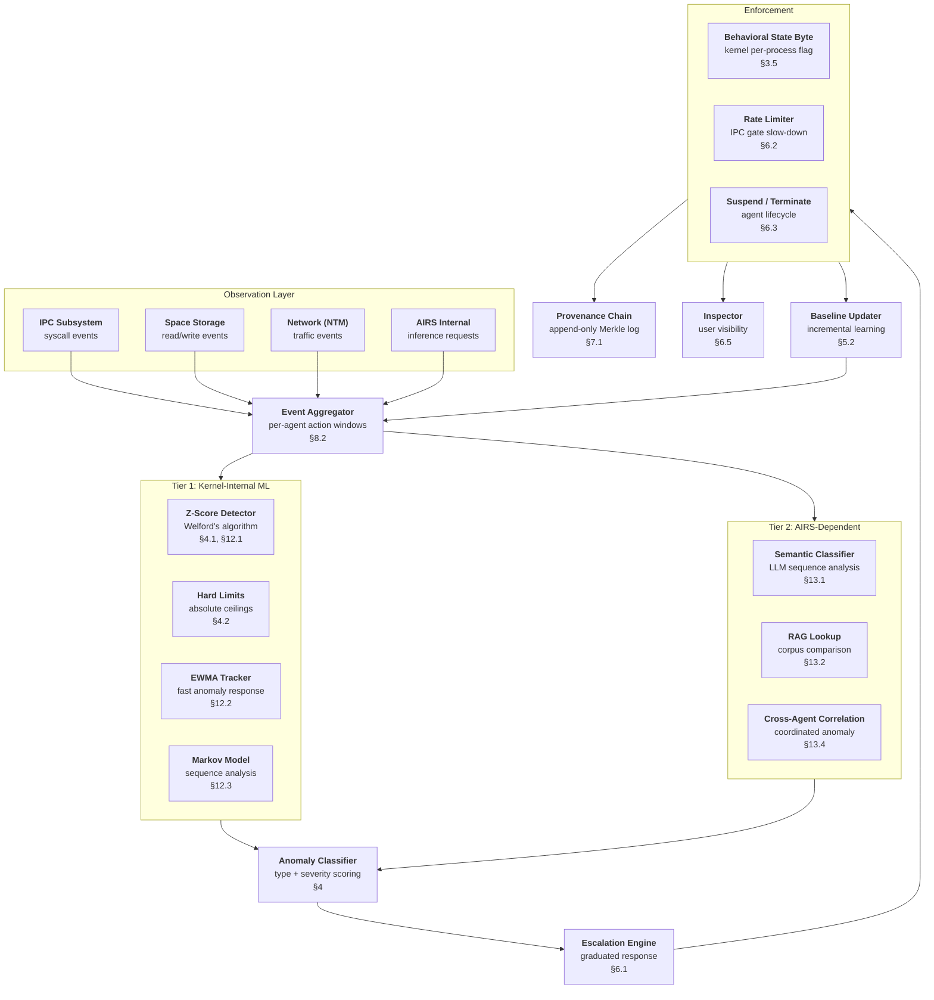

# AIOS Behavioral Monitor

## Deep Technical Architecture

**Parent document:** [architecture.md](../project/architecture.md)
**Related:** [airs.md](./airs.md) — AI Runtime Service, [intelligence-services.md](./airs/intelligence-services.md) — AIRS intelligence services (§5.5 summary), [model.md](../security/model.md) — Security model, [layers.md](../security/model/layers.md) — Eight defense layers (Layer 3), [operations.md](../security/model/operations.md) — Zero trust enforcement, [ipc.md](../kernel/ipc.md) — IPC behavioral gate, [context-engine.md](./context-engine.md) — Context-driven adaptation, [agents.md](../applications/agents.md) — Agent framework and lifecycle, [inspector.md](../applications/inspector.md) — Security dashboard, [subsystem-framework.md](../platform/subsystem-framework.md) — Universal capability gate and audit patterns

**Note:** The Behavioral Monitor is Security Layer 3 in the AIOS eight-layer defense model. It is implemented as an AIRS intelligence service with kernel-internal fallback components. Its capability gate, audit logging, and provenance recording follow the universal patterns defined in the security model document.

-----

## Document Map

This document was split for navigability. Each sub-document preserves the original section numbers for cross-reference stability.

| Document | Sections | Content |
|---|---|---|
| **This file** | §1, §2, §14, §15 | Core insight, architecture, implementation order, design principles |
| [data-model.md](./behavioral-monitor/data-model.md) | §3 | Behavioral data model: baselines, policies, anomaly types, state byte, storage |
| [detection.md](./behavioral-monitor/detection.md) | §4, §5 | Statistical detection engine, baseline learning algorithms |
| [response.md](./behavioral-monitor/response.md) | §6, §7 | Escalation policies, enforcement actions, provenance and audit |
| [profiling.md](./behavioral-monitor/profiling.md) | §8 | Agent behavior profiling pipeline: predicted vs. observed behavior |
| [security.md](./behavioral-monitor/security.md) | §9, §10 | Security layer integration, AIRS self-monitoring |
| [evasion.md](./behavioral-monitor/evasion.md) | §11 | Evasion resistance, adversarial robustness, threat analysis |
| [intelligence.md](./behavioral-monitor/intelligence.md) | §12, §13, §16 | Kernel-internal ML, AIRS-dependent intelligence, future directions |

-----

## 1. Core Insight

Capabilities are necessary but insufficient. A capability token proves an agent is *allowed* to perform an action — it does not prove the action is *appropriate* right now.

Consider an email agent with `ReadSpace("email/")` and `Network(smtp.gmail.com)` capabilities. Layer 2 (capability checking) confirms these are valid, kernel-issued tokens. But:

- At 3 AM, the agent reads every email in the archive (it normally reads 5–10 per session)
- It then opens network connections to an endpoint it has never contacted before
- The action sequence — bulk read followed by bulk send — matches no prior session

Every individual action is permitted. The aggregate behavior is a data exfiltration attack. Capabilities see trees; the Behavioral Monitor sees the forest.

This is the fundamental gap between **structural security** (is this agent allowed?) and **dynamic security** (is this agent behaving normally?). Traditional operating systems close this gap with user vigilance — the user notices something is wrong. AIOS closes it with continuous, automated behavioral analysis.

### What the Behavioral Monitor Does

The Behavioral Monitor learns how each agent normally operates — what it reads, what it writes, how much network traffic it generates, what times it's active, what action sequences it follows. It builds a statistical baseline from observed behavior. Then, continuously and in real time, it compares current behavior against that baseline.

When behavior deviates significantly, the monitor responds with graduated escalation: first rate-limiting (slowing the agent down), then suspension (pausing it), then user notification and possible termination. The response is proportional to the severity and persistence of the anomaly.

### Two-Tier Intelligence

The Behavioral Monitor operates at two tiers, reflecting AIOS's progressive intelligence architecture:

**Tier 1: Kernel-Internal ML** — Statistical detection that runs without AIRS. Welford's online algorithm for z-score computation, exponentially weighted moving averages for fast anomaly response, and lightweight Markov models for sequence analysis. Total state: ~10 KB for 64 agents. Always available, even on resource-constrained devices with no model loaded. This tier handles hard limits, rate anomalies, and basic sequence novelty.

**Tier 2: AIRS-Dependent Intelligence** — Semantic analysis using the loaded language model. Classifies action sequences with contextual understanding ("this agent is a calendar agent accessing photos — that's unusual"). Retrieval-augmented generation compares behavior against a corpus of known-good agents. LoRA fine-tuning adapts detection to the deployment's specific agent ecosystem. Cross-agent correlation detects coordinated attacks that individual baselines miss.

Tier 1 is the floor — it is always active and cannot be disabled. Tier 2 is the ceiling — it activates when AIRS has capacity and provides higher-fidelity detection. The system degrades gracefully: if AIRS is unavailable, Tier 1 continues protecting the user. The user is never unprotected.

### Relationship to Other Security Layers

The Behavioral Monitor is Layer 3 in the eight-layer defense model:

| Layer | Component | What It Checks | Latency |
|---|---|---|---|
| 1 | Intent Verifier | Is this action consistent with the user's request? | ~50ms (LLM) |
| 2 | Capability System | Does the agent hold a valid capability token? | ~1μs (kernel) |
| **3** | **Behavioral Monitor** | **Is this action consistent with how the agent normally behaves?** | **~10μs (statistical) / ~5ms (AIRS)** |
| 4 | Security Zones | Is the data in a zone the agent can access? | ~1μs (kernel) |
| 5 | Adversarial Defense | Is the input a prompt injection attempt? | ~20ms (classifier) |
| 6 | Content Screening | Does the output contain harmful content? | ~30ms (classifier) |
| 7 | Provenance Chain | Is there an immutable audit trail? | ~5μs (append) |
| 8 | User Override | Can the user always intervene? | 0 (always available) |

Layer 3 catches threats that Layers 1 and 2 cannot:

- **Layer 1 misses:** Intent verification is per-action and synchronous — it doesn't see aggregate patterns across hundreds of actions
- **Layer 2 misses:** Capabilities are static permissions — they don't encode "this agent normally reads 10 emails, not 10,000"
- **Layer 3 catches:** Statistical anomalies across time, volume, targets, and sequences — even when every individual action is permitted and intent-aligned

Conversely, Layer 3 has blind spots that other layers cover:

- A single perfectly-timed malicious action within normal behavioral parameters → Layer 1 (intent) catches this
- An agent accessing a space outside its capability set → Layer 2 (capabilities) catches this
- A prompt injection that changes behavior within normal statistical bounds → Layer 5 (adversarial defense) catches this

The layers are complementary. No single layer is sufficient. Together, they provide defense in depth.

-----

## 2. Architecture



### Where Components Run

| Component | Execution Context | Why |
|---|---|---|
| Hard limits, behavioral state byte | Kernel (IPC fast path) | Must be enforced even if AIRS crashes |
| Z-score, EWMA, Markov model | Kernel (timer-driven) | No AIRS dependency, O(1) per observation |
| Event aggregation | AIRS process | Needs cross-subsystem visibility |
| Semantic classifier, RAG, correlation | AIRS process | Requires LLM inference |
| Escalation engine | AIRS process (kernel fallback) | AIRS decides escalation level; kernel enforces if AIRS unavailable |
| Provenance recording | Kernel | Must be tamper-proof, even from AIRS |
| Inspector UI | Inspector agent | User-facing, capability-gated |

### Data Flow Summary

1. **Observe**: Every agent action generates an event (IPC call, space read/write, network send, inference request)
2. **Aggregate**: Events are bucketed per-agent into time windows (1-second for Tier 1, 1-minute for Tier 2)
3. **Detect**: Tier 1 runs z-score and hard limit checks on every window. Tier 2 runs semantic analysis on flagged windows
4. **Classify**: Anomalies are typed (frequency, volume, temporal, target novelty, sequence) and severity-scored
5. **Escalate**: The escalation engine applies graduated response based on severity and persistence
6. **Enforce**: The kernel updates the behavioral state byte and applies rate limiting or suspension
7. **Record**: Every enforcement action is appended to the provenance chain
8. **Learn**: Non-anomalous windows update the baseline incrementally; user overrides adjust thresholds

-----

## 14. Implementation Order

The Behavioral Monitor spans multiple development phases, reflecting its dependency on the AIRS inference engine and security architecture.

| Phase | Milestone | Deliverable |
|---|---|---|
| **10** (AIRS Intelligence Services) | M30–M32 | Core Behavioral Monitor: `BehavioralMonitor` struct, `BehavioralBaseline`, `BehavioralPolicy`, hard limits, z-score detection, basic escalation, audit logging. Tier 1 fully operational. |
| **13** (Agent Framework) | M39–M41 | Agent profiling pipeline: observation collection, predicted vs. observed comparison (§8), cold start via Agent Capability Intelligence priors. |
| **17** (Security Architecture) | M51–M53 | Security integration: behavioral state byte in IPC fast path (§3.5, §6.4), zero trust behavioral gate, AIRS self-monitoring (§10), provenance chain integration (§7). |
| **34** (Secure Boot & Updates) | — | Formal verification of hard limit invariants ("hard limits are always enforced", "escalation terminates"). |
| **41** (AIRS Capability Intelligence) | M124–M126 | AIRS-dependent intelligence: semantic sequence analysis (§13.1), RAG behavioral lookup (§13.2), LoRA fine-tuning (§13.3), cross-agent correlation (§13.4). Full Tier 2 operational. |

### Dependencies

```text
Phase 9 (AIRS Inference Engine) ──► Phase 10 (Behavioral Monitor core)
Phase 10 ──► Phase 13 (Agent profiling)
Phase 10 ──► Phase 17 (Security integration)
Phase 9 + Phase 41 ──► Tier 2 intelligence
```

### What Ships When

- **After Phase 10**: Agents are behaviorally monitored with statistical detection. Hard limits enforced. Escalation works. Audit trail exists. Users see anomalies in Inspector.
- **After Phase 17**: Behavioral state byte integrated into IPC fast path. Zero trust enforcement stack complete. AIRS self-monitoring active. Provenance chain tamper-proof.
- **After Phase 41**: Full semantic analysis. Cross-agent correlation catches coordinated attacks. LoRA adaptation personalizes detection to the deployment.

-----

## 15. Design Principles

### 15.1 Hard Limits Always, Baselines When Available

Hard limits are absolute ceilings that cannot be exceeded regardless of baseline. They enforce safety invariants even during the warmup period (before a baseline exists), even when AIRS is unavailable, and even if the baseline has been manipulated. Hard limits are the last line of defense. Baselines are intelligence on top of safety.

### 15.2 Observe Before Enforce

A new agent starts in `AuditOnly` mode. For the warmup period (default: 7 days), the monitor observes and builds a baseline without blocking. Hard limits are enforced immediately, but statistical detection is suppressed. This prevents false positives from condemning a legitimate agent that simply has unusual but consistent behavior.

### 15.3 Escalate, Never Jump

The response to an anomaly is always graduated: rate-limit → pause → notify → terminate. The monitor never jumps from "everything is fine" to "terminate the agent" without intermediate steps. Each escalation level has a cooldown period. De-escalation occurs automatically when behavior returns to normal. The user is always informed before termination.

### 15.4 Behavioral State Is a Signal, Not a Verdict

The behavioral state byte modulates enforcement — it does not replace capability checks. An agent with `behavioral_state = RATE_LIMITED` still has its capabilities validated on every action. Behavioral monitoring adds a dimension of analysis; it never subtracts structural security guarantees.

### 15.5 Kernel-Internal Fallback for All Critical Checks

Every critical behavioral check has a kernel-internal implementation that runs without AIRS. Hard limits are kernel-enforced. The behavioral state byte is kernel-maintained. Rate limiting is kernel-applied. If AIRS crashes, these mechanisms continue operating. The user is never unprotected due to an AIRS failure.

### 15.6 AIRS Monitors Agents; Kernel Monitors AIRS

The Behavioral Monitor watches agents. The `AirsDirectiveMonitor` (a kernel-side component) watches AIRS. Hardware security features (PAC, BTI, MTE) watch the kernel. No component monitors itself. Trust flows downward toward hardware, and each layer is monitored by a layer closer to the silicon.

### 15.7 User Visibility Always

Every behavioral baseline, anomaly detection, escalation action, and enforcement decision is visible through the Inspector. The user can view per-agent anomaly scores, historical enforcement timelines, and baseline evolution. Transparency is not optional — a behavioral monitor that operates in secret undermines user trust.

### 15.8 Provenance for All Enforcement Actions

Every enforcement action (rate-limit, suspend, terminate) is recorded in the append-only Merkle provenance chain with timestamp, agent ID, anomaly type, severity, and a snapshot of the relevant baseline. This record is kernel-signed and immutable. It cannot be altered by AIRS or any agent. Provenance ensures accountability and enables forensic analysis.

### 15.9 False Positives Degrade Experience; False Negatives Risk Security

The monitor must balance sensitivity and specificity. A false positive (flagging normal behavior) suspends a legitimate agent and frustrates the user. A false negative (missing anomalous behavior) allows a potential attack. The default tuning is conservative: prefer slightly higher false negatives over false positives, because the user's trust in the system depends on it not crying wolf. Hard limits provide a safety net for the false negatives that slip through.

### 15.10 Evasion Resistance Is a Design Constraint

The behavioral monitor must be designed with adversarial agents in mind. Every detection algorithm must be evaluated for evasion resistance: can an attacker gradually shift the baseline? Can they exploit the warmup period? Can they learn the exact detection threshold from enforcement feedback? Evasion resistance is not an afterthought — it is a first-class design requirement documented in [evasion.md](./behavioral-monitor/evasion.md).
