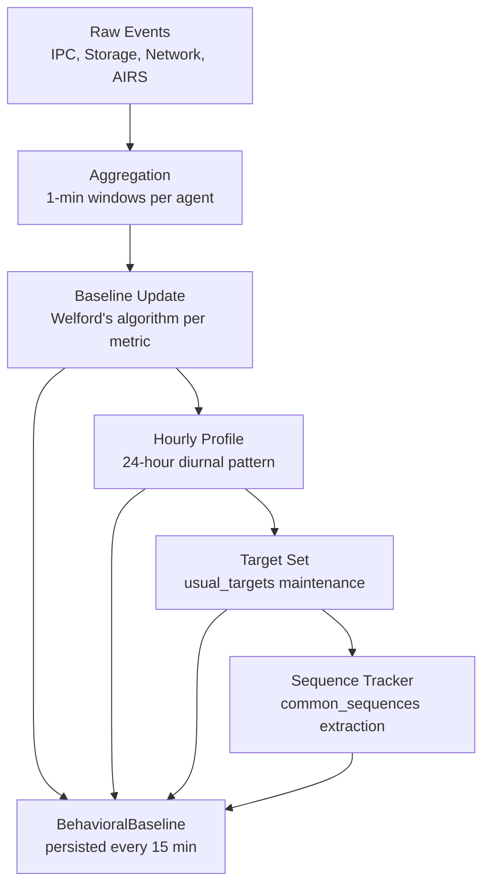

# AIOS Behavioral Monitor — Agent Behavior Profiling

Part of: [behavioral-monitor.md](../behavioral-monitor.md) — Behavioral Monitor Architecture
**Related:** [data-model.md](./data-model.md) — Baseline data structures, [detection.md](./detection.md) — Detection algorithms, [intelligence-services.md](../airs/intelligence-services.md) — Agent Capability Intelligence (§5.9)

-----

## §8. Agent Behavior Profiling Pipeline

The profiling pipeline connects install-time behavioral prediction (Agent Capability Intelligence) with runtime behavioral monitoring. It answers two questions:

1. **Before the agent runs:** What behavior do we *expect* based on static analysis and corpus comparison?
2. **While the agent runs:** What behavior do we *observe*, and how does it compare to predictions?

### §8.1 Predicted vs. Observed Behavior

The Agent Capability Intelligence pipeline ([intelligence-services.md §5.9](../airs/intelligence-services.md)) produces behavioral predictions at install time through five stages:

```text
Stage 1: Static Code Analysis      → CodeAnalysisReport (API calls, data flows)
Stage 2: Manifest Review            → ManifestReviewReport (unused/undeclared capabilities)
Stage 3: Behavioral Prediction      → PredictedBehavior (LLM-generated behavior profile)
Stage 4: Corpus Comparison          → CorpusComparison (outlier detection vs. known agents)
Stage 5: Profile Suggestion         → ProfileSuggestion (recommended capability profiles)
```

Stage 3 produces a `PredictedBehavior` — an LLM-generated estimate of how the agent will behave at runtime:

```rust
pub struct PredictedBehavior {
    /// Expected action rates (per minute) by type
    expected_rates: HashMap<ActionType, RateRange>,
    /// Expected target spaces
    expected_targets: Vec<SpacePattern>,
    /// Expected active hours (e.g., "business hours" for a work agent)
    expected_schedule: Option<TimeRange>,
    /// Expected action sequences (common workflows)
    expected_sequences: Vec<ActionSequence>,
    /// Confidence in the prediction (0.0–1.0)
    confidence: f32,
}

pub struct RateRange {
    min: f64,
    max: f64,
    /// Expected mean rate
    typical: f64,
}
```

The Behavioral Monitor uses `PredictedBehavior` as a prior for baseline initialization (see [detection.md §5.4](./detection.md)). As runtime observations accumulate, the baseline transitions from prediction-dominated to observation-dominated.

### §8.2 Observation Collection

The profiling pipeline collects behavioral events from four subsystems:

| Source | Events Collected | Collection Method |
|---|---|---|
| **IPC Subsystem** | Syscall type, target channel, payload size, frequency | Kernel instrumentation at IPC entry point |
| **Space Storage** | Read/write/delete operations, target space, object count, bytes | Storage subsystem event hooks |
| **Network (NTM)** | Connection targets, bytes sent/received, protocol | NTM event hooks |
| **AIRS Internal** | Inference requests, token count, model used | AIRS-internal counters |

**Aggregation windows:** Raw events are aggregated into per-agent observation windows:

- **1-second micro-window**: Used for hard limit enforcement (60-bucket sliding window)
- **1-minute macro-window**: Used for Tier 1 statistical detection (z-score, EWMA)
- **1-hour profile window**: Used for hourly profile updates and temporal pattern analysis
- **1-day summary**: Used for weekly profile updates and long-term trend analysis

Events within a window are counted by type — the monitor tracks action *rates*, not individual action *contents*. The Behavioral Monitor does not inspect what an agent reads or writes; it observes that an agent read 47 objects from `personal/email/` in the last minute. Content inspection is the domain of Layer 4 (Security Zones) and Layer 6 (Content Screening).

### §8.3 Profile Construction

The profiling pipeline constructs a `BehavioralBaseline` from raw observations through incremental updates:



**Hourly profile rotation:** At the end of each hour, the aggregated statistics for that hour are folded into the corresponding `hourly_profile[hour]` entry. The `RunningStats` for each `ActionProfile` field are updated using the decayed Welford variant (see [detection.md §5.2](./detection.md)).

**Target set maintenance:** New targets are added to `usual_targets` when observed. Targets are aged out after 30 days without access. The set has a maximum size of 256 entries per agent; when full, the least-recently-accessed target is evicted.

**Sequence extraction:** The profiling pipeline maintains a frequency counter for observed action sequences (length-8 windows). The top 32 sequences by frequency are stored in `common_sequences`. Sequences are re-ranked weekly; low-frequency sequences are evicted.

### §8.4 Profile Comparison

The profiling pipeline continuously compares predicted behavior (from Stage 3) against observed behavior:

```rust
pub struct ProfileDivergence {
    agent_id: AgentId,
    /// How different observed behavior is from predicted (0.0 = identical, 1.0 = completely different)
    divergence_score: f64,
    /// Which dimensions diverge most
    top_divergences: Vec<DivergenceDimension>,
    /// How long the agent has been running
    observation_duration: Duration,
}

pub enum DivergenceDimension {
    /// Observed rate differs from predicted for an action type
    RateDivergence {
        action: ActionType,
        predicted: RateRange,
        observed_mean: f64,
    },
    /// Agent accesses targets not in predicted set
    TargetDivergence {
        unpredicted_targets: Vec<ActionTarget>,
    },
    /// Agent is active at times not in predicted schedule
    ScheduleDivergence {
        predicted: TimeRange,
        observed_active_hours: Vec<u8>,
    },
    /// Agent performs sequences not in predicted patterns
    SequenceDivergence {
        novel_sequences: Vec<ActionSequence>,
    },
}
```

**Divergence scoring:** The divergence score is a weighted combination of per-dimension scores:

| Dimension | Weight | How Computed |
|---|---|---|
| Rate divergence | 0.3 | Average z-score of observed mean vs. predicted `typical` |
| Target divergence | 0.3 | Fraction of observed targets not in predicted set |
| Schedule divergence | 0.2 | Fraction of active hours outside predicted schedule |
| Sequence divergence | 0.2 | Fraction of observed sequences not in predicted patterns |

**When divergence triggers action:**
- **Low divergence (< 0.3):** Normal — prediction was accurate. No action.
- **Medium divergence (0.3–0.6):** The agent behaves differently than predicted. This is not necessarily anomalous — the prediction may have been incomplete. The monitor logs the divergence but relies on baseline-based detection (which adapts to actual behavior).
- **High divergence (> 0.6):** The agent behaves very differently than predicted. The monitor flags this for Tier 2 (AIRS) semantic analysis: "This email agent was predicted to read emails and send replies, but it's primarily accessing the calendar and spawning child agents. Is this legitimate?"

### §8.5 Profile Evolution

Agent behavior changes over time due to agent updates, user workflow changes, and seasonal patterns. The profiling pipeline handles this:

**Agent updates:** When an agent is updated (new version installed), the monitor:
1. Retains the existing baseline (does not reset)
2. Temporarily widens the anomaly threshold by 1.5× for 48 hours (grace period)
3. Runs new behavioral prediction (Stage 3) on the updated agent code
4. Compares the new prediction against the existing baseline
5. If the new prediction diverges significantly from the old baseline, logs a `baseline_shift_expected` event

**Behavioral drift detection:** The monitor tracks the rate of baseline change over time. If the baseline shifts faster than a configurable drift rate (default: 10% mean change per week), the monitor flags `BaselineDrift`:

```rust
pub struct BaselineDrift {
    agent_id: AgentId,
    metric: String,
    /// Rate of change (percent per week)
    drift_rate: f64,
    /// Direction of drift
    direction: DriftDirection,
    /// How long the drift has been sustained
    duration: Duration,
}

pub enum DriftDirection {
    Increasing,
    Decreasing,
    Volatile,  // mean is stable but variance is increasing
}
```

Baseline drift is not an anomaly in itself — it is a signal for Tier 2 analysis. AIRS evaluates whether the drift is explained by legitimate factors (agent update, user behavior change) or might indicate a gradual ramp-up attack (see [evasion.md §11.2](./evasion.md)).

**Rollback detection:** If an agent update causes a sudden behavioral change that triggers enforcement, and the user rolls back the agent to its previous version, the monitor restores the pre-update baseline from the persisted baseline file. This prevents false positives from brief update experiments.
