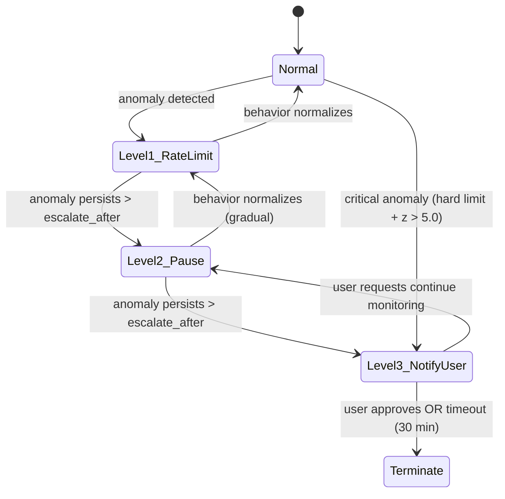
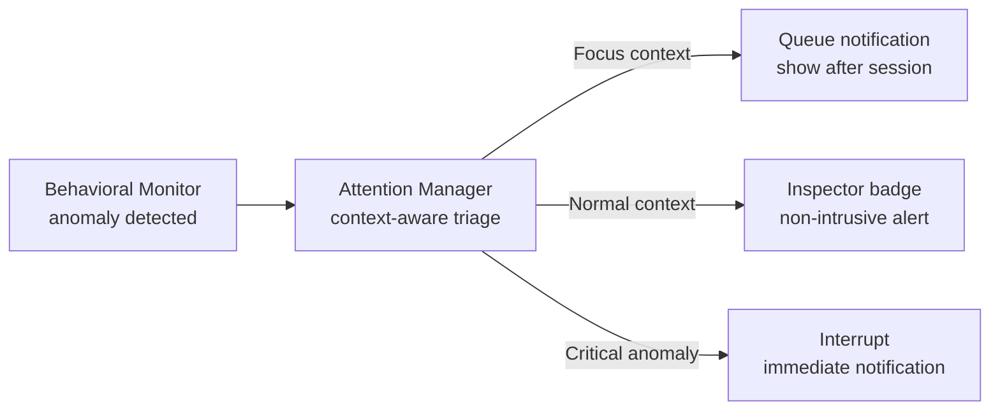

# AIOS Behavioral Monitor — Response and Enforcement

Part of: [behavioral-monitor.md](../behavioral-monitor.md) — Behavioral Monitor Architecture
**Related:** [detection.md](./detection.md) — Detection engine, [data-model.md](./data-model.md) — Data structures, [security.md](./security.md) — Security layer integration

-----

## §6. Escalation and Enforcement

### §6.1 Escalation Policy

The Behavioral Monitor responds to detected anomalies with graduated escalation. Responses are proportional to severity and persistent — the monitor never jumps directly to termination from a single anomaly.

```rust
pub struct EscalationPolicy {
    /// First response: slow down the agent
    level_1: EscalationAction,         // default: RateLimit { factor: 0.5 }
    /// Second response: pause the agent
    level_2: EscalationAction,         // default: Pause
    /// Third response: notify the user and decide
    level_3: EscalationAction,         // default: PauseAndNotify
    /// How long to wait at each level before escalating
    escalate_after: Duration,          // default: 5 minutes
}

pub enum EscalationAction {
    /// Reduce allowed IPC rate by factor (0.0–1.0, lower = slower)
    RateLimit { factor: f32 },
    /// Suspend agent execution, preserve state
    Pause,
    /// Notify user via Inspector and Attention Manager
    NotifyUser { severity: AlertSeverity },
    /// Pause agent and notify user simultaneously
    PauseAndNotify { severity: AlertSeverity },
    /// Terminate agent process, clean up resources
    Terminate,
}

pub enum AlertSeverity {
    /// Low: logged, visible in Inspector timeline
    Info,
    /// Medium: Inspector notification badge, Attention Manager flag
    Warning,
    /// High: prominent notification, may interrupt current context
    Critical,
}
```

**Escalation state machine:**



**De-escalation:** When the agent's behavior returns to within baseline parameters (z-score drops below `anomaly_threshold - 0.5` for `escalate_after` duration), the monitor de-escalates one level at a time. De-escalation is always gradual — an agent that was at Level 2 (Pause) returns to Level 1 (RateLimit) first, not directly to Normal. This prevents oscillating behavior (anomaly → de-escalate → anomaly → de-escalate).

**Critical fast-track:** For extreme anomalies (hard limit exceeded AND z-score > 5.0), the monitor skips Level 1 and 2 and goes directly to Level 3 (NotifyUser). This handles obvious attack scenarios (e.g., an agent suddenly reading 10,000 objects/minute when its baseline is 10).

### §6.2 Rate Limiting

Rate limiting is the least disruptive enforcement action. It slows the agent's IPC processing without stopping it entirely.

**Mechanism:** When `behavioral_state` is set to `RateLimited`, the kernel inserts a delay before processing each IPC call from the agent. The delay is computed from the rate-limiting factor:

```text
delay_ms = (1.0 / factor - 1.0) * BASE_IPC_LATENCY_MS
```

For the default factor of 0.5: `delay_ms = (2.0 - 1.0) * 0.1 = 0.1ms` — effectively halving the agent's IPC throughput. For a more aggressive factor of 0.1: `delay_ms = (10.0 - 1.0) * 0.1 = 0.9ms` — reducing throughput to 10% of normal.

**Scope:** Rate limiting applies to all IPC calls from the agent, not just the action type that triggered the anomaly. This is intentional — behavioral anomalies often involve coordination across multiple action types (read-then-send), so limiting only one type is insufficient.

**Duration:** Rate limiting persists until de-escalation criteria are met or the monitor escalates to the next level.

### §6.3 Agent Suspension and Termination

**Pause** suspends agent execution:
- The agent's threads are frozen (removed from scheduler run queues)
- All pending IPC messages are held in channel buffers
- Agent state is preserved (memory, open channels, pending timers)
- The agent can be resumed by the monitor (de-escalation) or the user (via Inspector)
- Paused agents consume memory but no CPU

**Terminate** kills the agent:
- Agent process is destroyed (all threads terminated)
- Resources are cleaned up: channels destroyed, shared memory unmapped, capabilities revoked, notifications released
- The provenance chain records the termination with full context (anomaly type, severity, baseline snapshot)
- The user is always notified of termination — the monitor never silently kills an agent
- The agent can be reinstalled and restarted, but starts with a fresh baseline (warmup period restarts)

**Terminate is a last resort.** It occurs only when:
1. The escalation policy reaches Level 3 and the user approves termination, OR
2. The escalation policy reaches Level 3, the user does not respond within 30 minutes, and the anomaly severity is Critical, OR
3. A hard limit is exceeded repeatedly (3+ times in 10 minutes) after rate limiting

### §6.4 IPC Behavioral Gate Integration

The behavioral state byte is checked in the IPC fast path as part of the five-level zero-trust enforcement stack:

```text
Level 1: STRUCTURAL CHECK     — Does the agent hold a valid capability? (kernel)
Level 2: PROTOCOL CHECK        — Does message type match channel protocol? (kernel)
Level 3: BEHAVIORAL CHECK      — Is behavioral_state acceptable? (kernel, AIRS-informed)
Level 4: SERVICE CHECK         — Does operation-level capability permit this? (service)
Level 5: AUDIT                 — Log source, destination, capability used (kernel)
```

**Level 3 logic:**

```text
match process.behavioral_state:
    Normal => proceed to Level 4
    Elevated => proceed to Level 4 (log with extra detail)
    RateLimited => insert delay, then proceed to Level 4
    Suspended => return IpcError::AgentSuspended
```

The behavioral check adds ~10ns overhead in the common case (`Normal` — a single byte comparison). Rate-limited agents see the configured delay. Suspended agents receive an immediate error without consuming IPC resources.

**Cross-reference:** [ipc.md §9.1](../../kernel/ipc.md) for the full IPC fast path, [operations.md §10.4](../../security/model/operations.md) for the zero-trust enforcement stack.

### §6.5 User Notification and Inspector Integration

When the escalation engine notifies the user, the notification flows through the Attention Manager, which triages it based on the current context:



**Inspector agent view:**

The Inspector provides a dedicated behavioral monitoring dashboard per agent:

- **Baseline visualization**: hourly activity heatmap showing read/write/network/inference rates across 24 hours
- **Anomaly timeline**: chronological list of detected anomalies with type, severity, and enforcement action taken
- **Current state**: real-time behavioral state (`Normal`, `Elevated`, `RateLimited`, `Suspended`)
- **Anomaly score**: rolling score combining all active anomalies (0.0 = completely normal, 1.0 = maximum anomaly)
- **User actions**: approve anomaly (dismiss and update baseline), revoke capabilities, pause/resume agent, terminate agent, adjust thresholds

**User override handling:** When the user dismisses an anomaly ("this is fine"), the monitor treats it as a signal to update the baseline:
- The observation that triggered the anomaly is added to the baseline
- The anomaly threshold for that specific anomaly type is temporarily raised (1.5× for 24 hours)
- If the user dismisses the same anomaly type 3+ times, the monitor permanently adjusts the baseline and logs a `false_positive_correction` event

-----

## §7. Provenance and Audit

### §7.1 Enforcement Provenance

Every enforcement action is recorded in the append-only Merkle provenance chain. The provenance record captures the full context of the enforcement decision:

```rust
pub struct BehavioralEnforcementRecord {
    /// When the enforcement action occurred
    timestamp: Timestamp,
    /// Which agent was affected
    agent_id: AgentId,
    /// What anomaly was detected
    anomaly_type: AnomalyType,
    /// Severity score (0.0–1.0)
    severity: f64,
    /// What enforcement action was taken
    action: EscalationAction,
    /// Escalation level at the time (1, 2, or 3)
    escalation_level: u8,
    /// Snapshot of the relevant baseline statistics at the time
    baseline_snapshot: BaselineSnapshot,
    /// Hash of the previous provenance record (Merkle chain)
    prev_hash: ContentHash,
}

pub struct BaselineSnapshot {
    /// The specific statistic that was anomalous
    metric: String,
    /// Baseline mean at the time of detection
    mean: f64,
    /// Baseline standard deviation
    stddev: f64,
    /// Number of observations in the baseline
    count: u64,
    /// The observed value that triggered the anomaly
    observed: f64,
}
```

The provenance chain is kernel-signed — AIRS cannot forge, modify, or delete enforcement records. This ensures accountability even if AIRS is compromised.

### §7.2 Audit Space Storage

All behavioral events are stored in `system/audit/behavioral/events/`:

```text
system/audit/behavioral/events/
├── 2026-03-18/
│   ├── anomalies.log        # All detected anomalies (all severity levels)
│   └── enforcement.log      # Only enforcement actions (rate-limit, pause, terminate)
├── 2026-03-17/
│   └── ...
└── retention.config
```

**Anomaly log format:** Each entry contains the full `AnomalyType` enum variant, the agent ID, timestamp, severity score, and whether enforcement was applied. Entries during warmup are tagged `warmup: true`.

**Enforcement log format:** Each entry is a `BehavioralEnforcementRecord` as defined above. This log is the authoritative record of all behavioral enforcement actions.

**Query interface:** The Inspector queries the audit space via the standard Space Storage API with capability `ReadSpace("system/audit/behavioral/")`. The query supports:
- Filter by agent ID
- Filter by anomaly type
- Filter by severity range
- Filter by date range
- Aggregate: anomaly count by type per day

### §7.3 Compliance Reporting

For enterprise deployments, the behavioral monitoring audit trail serves as a compliance control:

**SIEM integration:** Behavioral enforcement events can be exported to external SIEM systems via the audit drain mechanism ([observability.md](../../kernel/observability.md)). The export format is structured JSON, compatible with standard SIEM ingestion pipelines.

**Compliance report generation:** The Inspector can generate compliance reports summarizing:
- Number of agents monitored
- Anomalies detected per agent per time period
- Enforcement actions taken
- User override history (false positive rate)
- Hard limit utilization (how close agents come to their limits)

**Data residency:** Behavioral baselines and audit logs are stored locally on the device. In multi-device deployments, cross-device behavioral data sharing is opt-in and anonymized (see [intelligence.md §16.1](./intelligence.md) for federated behavioral intelligence).
