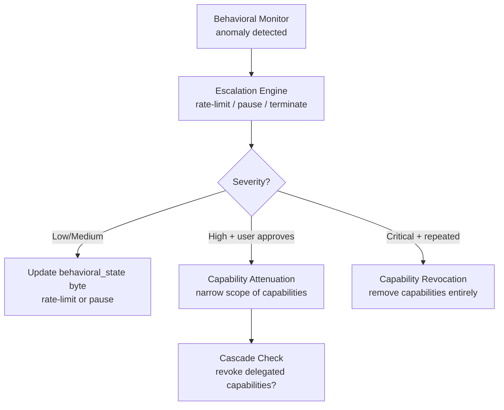

# AIOS Behavioral Monitor — Security Integration

Part of: [behavioral-monitor.md](../behavioral-monitor.md) — Behavioral Monitor Architecture
**Related:** [layers.md](../../security/model/layers.md) — Eight defense layers (Layer 3), [operations.md](../../security/model/operations.md) — Zero trust enforcement, [evasion.md](./evasion.md) — Evasion resistance, [response.md](./response.md) — Enforcement mechanisms

-----

## §9. Security Layer Integration

### §9.1 Position in the Eight-Layer Model

The Behavioral Monitor is **Layer 3: Behavioral Boundary** in the AIOS eight-layer defense model:

```text
Layer 1: Intent Verification       (AIRS)   — Is this consistent with the user's request?
Layer 2: Capability System          (kernel)  — Does the agent hold a valid capability?
Layer 3: BEHAVIORAL MONITOR         (AIRS+kernel) — Is this consistent with normal behavior?
Layer 4: Security Zones             (kernel)  — Is the data in an accessible zone?
Layer 5: Adversarial Defense        (AIRS)   — Is the input a prompt injection?
Layer 6: Content Screening          (AIRS)   — Does the output contain harmful content?
Layer 7: Provenance Chain           (kernel)  — Is there an immutable audit trail?
Layer 8: User Override              (always)  — Can the user always intervene?
```

**What Layer 3 catches that Layers 1 and 2 cannot:**

| Scenario | Layer 1 (Intent) | Layer 2 (Capability) | Layer 3 (Behavioral) |
|---|---|---|---|
| Agent with valid caps reading 10,000 emails at 3 AM | Might miss (each read looks like a valid email action) | Allows (capability is valid) | **Catches** (frequency spike + temporal anomaly) |
| Compromised agent slowly exfiltrating data over weeks | Misses (each action looks innocuous) | Allows (caps unchanged) | **Catches** (baseline drift + volume spike at slow timescale) |
| Agent accessing a new space after a prompt injection | Catches (intent mismatch) | May allow (if cap was over-provisioned) | **Catches** (target novelty) |
| Agent operating normally but with injected instructions | Misses (actions look normal) | Allows | Misses (behavior matches baseline) — Layer 5 catches |

Layer 3 is most valuable for detecting **aggregate anomalies** — patterns that emerge only when observing behavior over time. Individual-action checks (Layers 1, 2, 5) may miss coordinated or slow-moving threats.

### §9.2 Zero Trust Integration

The behavioral check is Level 3 of the five-level zero-trust enforcement stack that every IPC call passes through:

```text
Level 1: STRUCTURAL CHECK      — Does the agent hold valid capability? .........(kernel, ~1μs)
Level 2: PROTOCOL CHECK         — Does message type match channel protocol? .....(kernel, ~0.5μs)
Level 3: BEHAVIORAL CHECK       — Is behavioral_state acceptable? ...............(kernel, ~10ns)
Level 4: SERVICE CHECK          — Does operation-level capability permit this? ..(service, ~5μs)
Level 5: AUDIT                  — Log source, destination, capability used ......(kernel, ~5μs)
```

The behavioral check is the cheapest level in the stack — a single byte comparison in the common case (`Normal = 0`). This is by design: the behavioral state byte is pre-computed by AIRS and cached in kernel per-process data. The IPC fast path pays no inference cost; it only reads the cached verdict.

**Continuous verification principle:** Every IPC call passes through all five levels. There is no "trusted" fast path that skips behavioral checks. Even system agents are checked — though their hard limits are much higher and their anomaly thresholds are wider.

### §9.3 Intent Verification Coordination

Layer 1 (Intent Verification) and Layer 3 (Behavioral Monitor) operate on different dimensions:

| Dimension | Layer 1 (Intent) | Layer 3 (Behavioral) |
|---|---|---|
| **Scope** | Per-action | Aggregate (across time) |
| **Timing** | Synchronous (blocks action until verified) | Asynchronous (updates state periodically) |
| **Intelligence** | Requires LLM inference (semantic) | Statistical + optional LLM |
| **Latency** | ~50ms per action | ~10ns (cached state byte) |
| **Catches** | Single malicious action | Patterns of anomalous behavior |

**How they coordinate:**

1. **Intent → Behavioral:** When intent verification blocks an action (confidence below threshold), the Behavioral Monitor records the block event. Repeated intent-verification blocks increase the agent's anomaly score even if individual actions don't trigger statistical detection.

2. **Behavioral → Intent:** When the Behavioral Monitor elevates an agent's state to `Elevated`, the Intent Verifier switches to `Synchronous` mode for that agent (verifying every action, not just high-risk ones). This provides deeper analysis for agents exhibiting suspicious patterns.

3. **Mutual backup:** If AIRS is unavailable, Layer 1 (intent) stops entirely (fallback: skip), but Layer 3 (behavioral) continues at Tier 1 (kernel-internal statistical checks). The behavioral monitor provides a safety net when intent verification is offline.

### §9.4 Adversarial Defense Coordination

Layer 5 (Adversarial Defense) detects prompt injection in inputs. Layer 3 (Behavioral Monitor) detects changes in behavior. They catch different phases of an attack:

```text
Attack timeline:
1. Attacker crafts prompt injection in data → Layer 5 may detect
2. Agent processes injected instructions    → Layer 1 may detect intent mismatch
3. Agent behavior changes (exfiltrates data) → Layer 3 detects behavioral anomaly
```

**Key insight:** Even if Layers 1 and 5 miss the injection, Layer 3 catches the *effect*. A successfully injected agent will behave differently from its baseline — accessing new targets, generating unusual action sequences, or operating at anomalous rates. The Behavioral Monitor doesn't need to detect the injection mechanism; it detects the behavioral consequences.

**Correlation:** When Layer 5 detects a prompt injection attempt but Layer 3 shows no behavioral change, the agent likely resisted the injection (good). When Layer 3 detects a behavioral change without a Layer 5 alert, the injection may have been novel enough to evade the classifier — the behavioral change is the backup signal.

### §9.5 Capability Revocation Feedback

When the Behavioral Monitor triggers enforcement, it may feed back into the capability system:



**Attenuation vs. revocation:**
- **Attenuation** narrows the scope of existing capabilities. Example: an email agent's `ReadSpace("personal/")` is attenuated to `ReadSpace("personal/email/")` — it can still read emails but not other personal data. The agent continues operating with reduced access.
- **Revocation** removes capabilities entirely. The agent can no longer perform the associated actions. This is a stronger response, typically requiring user approval.

**Cascade effects:** When an agent has delegated capabilities to child agents, revoking the parent's capability cascades to all children (per the capability system's cascade revocation mechanism, see [capabilities.md §3.6](../../security/model/capabilities.md)).

-----

## §10. AIRS Self-Monitoring

### §10.1 AirsDirectiveMonitor

AIRS issues resource orchestration directives — memory pool resizing, data prefetch, compression scheduling. These directives are themselves actions that can be anomalous. A compromised or malfunctioning AIRS could issue pathological directives that degrade system performance or security.

The **kernel** monitors AIRS, not the other way around. The `AirsDirectiveMonitor` runs in kernel context with no AIRS dependency:

```rust
/// Kernel-side monitor for AIRS resource directive behavior.
/// This is NOT part of AIRS — it runs in kernel context.
/// Simple statistical checks, no AI, no LLM inference.
pub struct AirsDirectiveMonitor {
    /// Baseline for AIRS directive rates (built during first 24 hours)
    baseline: AirsDirectiveBaseline,
    /// Hard limits (never exceeded regardless of baseline)
    hard_limits: AirsDirectiveLimits,
    /// Current state
    state: AirsMonitorState,
}

pub struct AirsDirectiveBaseline {
    /// Directives per second by type
    prefetch_rate: RunningStats,
    pool_resize_rate: RunningStats,
    compress_rate: RunningStats,
    /// Total directives per minute
    total_rate: RunningStats,
    /// Typical directive sizes (bytes requested for prefetch, pool delta)
    typical_sizes: RunningStats,
    /// Hours of observation
    observation_hours: u32,
}

pub struct AirsDirectiveLimits {
    /// Maximum directives per second (all types combined)
    max_directives_per_second: u32,             // default: 100
    /// Maximum single pool resize delta
    max_pool_resize_bytes: usize,               // default: 64 MB
    /// Maximum prefetch batch size
    max_prefetch_objects: u32,                   // default: 50
    /// Maximum fraction of user pool AIRS can direct
    max_user_pool_fraction: f32,                // default: 0.5
}

pub enum AirsMonitorState {
    /// Normal operation — AIRS directives accepted
    Normal,
    /// AIRS directives are rate-limited (mild anomaly detected)
    RateLimited { factor: f32 },
    /// AIRS resource orchestration disabled — kernel uses static heuristics
    Fallback { reason: String, since: Timestamp },
}
```

**Detection logic:** The kernel uses the same z-score mechanism as the agent behavioral monitor, applied to AIRS directive rates. If AIRS issues directives at a rate exceeding 3σ above baseline, or if any hard limit is exceeded, the kernel transitions to `RateLimited` or `Fallback` mode.

### §10.2 Fallback Mode

When the kernel detects anomalous AIRS directive patterns, it transitions to `Fallback` mode:

| Subsystem | Normal (AIRS-directed) | Fallback (static heuristics) |
|---|---|---|
| Memory eviction | AI-prioritized page eviction | Plain LRU eviction |
| Data prefetch | Predictive prefetch | No prefetch |
| Pool boundaries | Dynamic resizing | Fixed at last known-good sizes |
| Compression | AI-prioritized scheduling | Age-based fixed policy |
| **Security services** | **Active** | **Active** |

**Critical distinction:** Only AIRS *resource orchestration* directives are disabled in fallback. AIRS *security* functions — intent verification (Layer 1), behavioral monitoring (Layer 3), adversarial defense (Layer 5), content screening (Layer 6) — continue operating. The system is slower but equally secure.

The kernel logs the fallback transition as a security event in the provenance chain and notifies the user: "AIRS resource orchestration paused due to anomalous behavior. Security services remain active."

### §10.3 Kernel Oversight Architecture

The `AirsDirectiveMonitor` exemplifies a fundamental AIOS security principle: **every monitor is itself monitored by a layer closer to hardware.**

```text
Hardware (PAC, BTI, MTE)     monitors → Kernel code integrity
Kernel (AirsDirectiveMonitor) monitors → AIRS directive behavior
AIRS (Behavioral Monitor)     monitors → Agent behavior
Agent capability system        monitors → Agent resource access
```

No component monitors itself. Trust flows downward toward hardware, and each layer is monitored by a layer with a smaller trusted computing base. The kernel's monitoring of AIRS is purely statistical — it uses the same `RunningStats` z-score mechanism, with no AI or LLM dependency. This makes the kernel monitor's behavior fully deterministic and verifiable.

**Recovery from fallback:** AIRS exits fallback mode when its directive rates return to within 2σ of baseline for 10 consecutive minutes. The kernel re-enables resource directives incrementally:

1. **First:** Prefetch (lowest risk — only affects performance, not security)
2. **Then:** Compression scheduling (medium risk — affects storage utilization)
3. **Last:** Pool resizing (highest risk — affects memory allocation boundaries)

Each phase is monitored for 5 minutes before proceeding to the next. If anomalous behavior recurs during incremental re-enablement, the kernel returns to full `Fallback` mode immediately.

**Panic circuit breaker:** If AIRS panics 3 times within 60 seconds, the kernel disables AIRS resource orchestration permanently until manual intervention (system administrator or Inspector-initiated recovery). This prevents a crash loop from oscillating between active and fallback modes.
