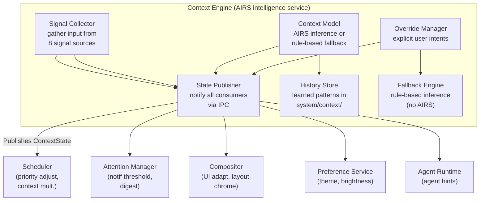

# AIOS Context Engine

## Deep Technical Architecture

**Parent document:** [architecture.md](../project/architecture.md)
**Related:** [airs.md](./airs.md) — AI Runtime Service, [compositor.md](../platform/compositor.md) — Compositor and display, [agents.md](../applications/agents.md) — Agent framework

-----

## Document Map

This document was split for navigability. Each sub-document preserves the original section numbers for cross-reference stability.

| Document | Sections | Content |
|---|---|---|
| **This file** | §1, §2, §11, §12 | Overview, architecture, implementation order, design principles |
| [signals.md](./context-engine/signals.md) | §3 | Signal collection: sources, weights, collection frequency |
| [inference.md](./context-engine/inference.md) | §4 | Context inference: feature extraction, classifier, hysteresis, transitions |
| [overrides.md](./context-engine/overrides.md) | §5 | Override system: explicit overrides, examples, stacking |
| [consumers.md](./context-engine/consumers.md) | §6 | Consumers: scheduler, attention manager, compositor, preference service |
| [learning.md](./context-engine/learning.md) | §7, §8, §13, §14 | Learning & personalization, fallback engine, AI-native context intelligence, future directions |
| [sdk.md](./context-engine/sdk.md) | §9, §10 | SDK API, diagnostics & Inspector integration |

-----

## 1. Overview

Every traditional OS forces the user to manage their own context. You turn on "Do Not Disturb" when you want to focus. You switch display profiles when you move from coding to watching a movie. You close chat apps when you need to concentrate. You are the context engine, and you are terrible at it — you forget, you get lazy, you leave focus mode on for six hours and miss a call from your kid's school.

The AIOS Context Engine eliminates this. It continuously infers user context from system signals — what space is active, what agents are running, what the keyboard cadence looks like, what time it is, what the calendar says — and publishes a `ContextState` that drives the entire system. AI engagement level, notification threshold, resource scheduling priority, UI layout — all adapt automatically.

There are no toggles. There are no modes. The user never thinks about "switching" to anything. The OS just knows.

When the user does want to express intent — "heads down for two hours" or "I'm done for the day" — the Context Engine accepts that as an override. Overrides are always time-bounded. They expire. The system returns to inference. Forgotten overrides cannot exist.

The Context Engine is an intelligence service within AIRS. When AIRS is available, context inference uses a lightweight classifier model that processes signal vectors in under a millisecond. When AIRS is unavailable (early boot, resource pressure, user disabled), the engine falls back to a rule-based system using time-of-day heuristics and explicit overrides. The system degrades gracefully — it gets dumber, but it never breaks.

-----

## 2. Architecture



The engine runs as a subservice of AIRS, sharing AIRS's privileged access to system state. It reads signals from other system services via IPC, produces a `ContextState`, and publishes that state to all consumers. Consumers subscribe and react — they never poll.

**Data flow is one-directional.** Signal sources push into the engine. The engine publishes state. Consumers read state. No consumer can modify the context. Only the Override Manager (driven by user intent) can force a state change.

-----

## 11. Implementation Order

The Context Engine is built incrementally. Each development phase (numbered per the project development plan in [development-plan.md](../project/development-plan.md), not to be confused with boot phases) delivers testable functionality. Later phases add intelligence.

```text
Dev Phase 11: Basic Context Engine
  ├── ContextState struct and IPC publishing
  ├── Signal Collector (ActiveSpace, RunningAgents, TimeOfDay)
  ├── Rule-based inference (weighted average, no AIRS)
  ├── Override Manager (explicit overrides, time-bounded)
  ├── State Publisher (pub/sub to consumers)
  ├── Hysteresis (transition delays, debouncing)
  ├── Scheduler integration (context multipliers)
  └── Inspector diagnostics (current state, signal values)

Dev Phase 11: AIRS Classifier Integration
  ├── Feature extractor (signals → fixed-length vector)
  ├── Context classifier model (small GGUF, ~2 MB)
  ├── AIRS inference integration (~1ms per inference)
  ├── Fallback detection (AIRS unavailable → rule-based)
  └── Classifier training pipeline (offline, ship with OS)

Dev Phase 11: Attention Manager Integration
  ├── AttentionItem processing pipeline
  ├── AIRS urgency re-assessment
  ├── Notification threshold filtering
  ├── Grouping and digest batching
  ├── Compositor notification routing
  └── Auto-action support

Dev Phase 21: Learning and Personalization
  ├── Observation recording (context transitions, stability)
  ├── Pattern extraction (work hours, space associations)
  ├── Override correction learning
  ├── UserHistory signal integration
  ├── Privacy controls (inspect, delete, disable)
  └── Pattern export for Inspector

Dev Phase 21a: AI-Native Context Intelligence (§13)
  ├── TCN/TinyHAR learned classifiers (<500KB, ARM NEON)
  ├── Dempster-Shafer evidential signal fusion
  ├── Kalman filter context state smoothing
  ├── GRU proactive context prediction
  ├── DistilBERT notification triage (quantized)
  ├── Breakpoint detection (Horvitz/Iqbal)
  ├── Cross-device context sync (BLE + CRDTs)
  └── LLM-powered context narration

Dev Phase 21b: Future Directions (§14)
  ├── Kernel-internal frozen decision trees
  ├── Federated context learning (FedAvg/FedPer)
  ├── Differential privacy (Apple LDP model)
  ├── Privacy-preserving computation (TrustZone)
  ├── Contextual RL for notification scheduling
  ├── Multimodal & ambient context (wearables)
  └── Formal verification (seL4 IFC model)

Dev Phase 27: Power-Aware Context
  ├── Battery level as signal (low battery → resource conservation)
  ├── Thermal state as signal (throttled → reduce background work)
  ├── Power source as signal (plugged in → less conservative)
  └── Integration with scheduler power management
```

**Critical dependencies:**

- Context Engine requires IPC (dev phase 3) — all signal collection and state publishing is IPC-based.
- Context Engine requires Compositor (dev phase 6) — ActiveSpace and InputPattern signals come from the compositor.
- Context Engine requires Agent Runtime (dev phase 7) — RunningAgents signal comes from the Agent Runtime.
- AIRS classifier requires AIRS inference engine (dev phase 9) — the classifier runs on AIRS.
- Attention Manager requires AIRS (dev phase 9) — urgency re-assessment needs inference.
- Learning requires History Store in spaces (dev phase 4) — patterns stored in `system/context/` space.
- AI-Native Context Intelligence (§13) requires AIRS Core (dev phase 9) — learned classifiers, evidential fusion, and prediction models run on AIRS.
- Cross-device context sync (§13.5) requires Networking (dev phase 8) and Multi-device pairing (dev phase 37).
- Federated learning (§14.2) requires Multi-device fleet management (dev phase 37).

**Testing strategy.** The rule-based fallback is tested first and serves as the reference implementation. The AIRS classifier must match or exceed the fallback's accuracy on a labeled test set before it replaces the fallback as the primary inference path. Both paths are always available — the system can switch between them at runtime.

-----

## 12. Design Principles

1. **No toggles, no modes.** The user never switches between "work mode" and "play mode." The OS infers context continuously. The user can override, but they never have to manage.

2. **Overrides expire.** Every override is time-bounded. Forgotten overrides cannot exist. The system always returns to inference.

3. **Hysteresis over responsiveness.** A context engine that flickers between states is worse than no context engine. Transitions are delayed, debounced, and directional. The system may be slow to react, but it is never wrong for long.

4. **Signals, not surveillance.** The engine sees structural metadata: which space, which agents, what input cadence, what time. It never sees content. The user can inspect everything the engine knows, delete it, or disable learning entirely.

5. **Graceful degradation.** Without AIRS, the engine falls back to rules. Without rules, explicit overrides still work. Without overrides, the system defaults to `Ambient` AI and `NextBreak` notifications. There is always a functional floor.

6. **Consumers react, they don't control.** Consumers subscribe to `ContextState` and adapt. They cannot modify the context. Only the user can override. This prevents agents from gaming the context system to get more resources or attention.

7. **AIRS enhances, rules suffice.** The AIRS classifier makes the engine smarter — it catches edge cases, learns personal patterns, correlates signals that the rule-based model misses. But the rule-based model works. Shipping the rule-based model alone delivers value. AIRS makes it great.

8. **Transparency.** The Inspector shows every signal, every weight, every transition, every learned pattern. The context engine is not a black box. The user can always understand why the system is behaving the way it is.

-----

## Cross-Reference Index

Quick lookup for commonly referenced sections across the context engine sub-documents:

| Reference | Location | Topic |
|---|---|---|
| §3.1 Signal Sources | [signals.md](./context-engine/signals.md) | Eight signal sources (ActiveSpace, RunningAgents, etc.) |
| §3.2 Signal Weights | [signals.md](./context-engine/signals.md) | Per-signal weights by context type |
| §3.3 Signal Collection Frequency | [signals.md](./context-engine/signals.md) | Collection frequency and IPC mechanism |
| §4.1 The Context Model | [inference.md](./context-engine/inference.md) | AIRS classifier, rule-based fallback, feature extraction |
| §4.2 Inference Pipeline | [inference.md](./context-engine/inference.md) | Signal → coalesce → override check → model → hysteresis → publish |
| §4.3 State Transitions | [inference.md](./context-engine/inference.md) | Hysteresis, directional transition delays, debouncing |
| §4.4 The ContextState | [inference.md](./context-engine/inference.md) | ContextState struct, work_engagement, ai_engagement, ContextMode |
| §5.1 Explicit Overrides | [overrides.md](./context-engine/overrides.md) | Override struct, time-bounded invariant, OverrideManager |
| §5.2 Override Examples | [overrides.md](./context-engine/overrides.md) | Common overrides and their effects |
| §5.3 Override Stacking | [overrides.md](./context-engine/overrides.md) | Stack semantics, cancel, resume |
| §6.1 Scheduler | [consumers.md](./context-engine/consumers.md) | Context multipliers, priority adjustment |
| §6.2 Attention Manager | [consumers.md](./context-engine/consumers.md) | Notification threshold, digest batching |
| §6.3 Compositor | [consumers.md](./context-engine/consumers.md) | UI adaptation, layout, chrome |
| §6.4 Preference Service | [consumers.md](./context-engine/consumers.md) | Theme, brightness, color temperature adaptation |
| §7.1 Pattern Learning | [learning.md](./context-engine/learning.md) | Observation, correction, reinforcement |
| §7.2 Privacy | [learning.md](./context-engine/learning.md) | Local storage, inspection, deletion, disabling |
| §8.1 Rule-Based Fallback | [learning.md](./context-engine/learning.md) | Weighted average inference without AIRS |
| §8.2 Fallback Quality | [learning.md](./context-engine/learning.md) | AIRS vs rule-based comparison |
| §8.3 Boot-Time Context Behavior | [learning.md](./context-engine/learning.md) | Context during early boot, Semantic Resume |
| §9.1 Reading Context (for agents) | [sdk.md](./context-engine/sdk.md) | AgentContext trait, ContextRead capability |
| §9.2 Posting Attention Items | [sdk.md](./context-engine/sdk.md) | AttentionItem posting, AIRS re-assessment |
| §9.3 Subscribing to Context Changes | [sdk.md](./context-engine/sdk.md) | Context update stream for agents |
| §9.4 Capability Requirements | [sdk.md](./context-engine/sdk.md) | ContextRead, AttentionPost, no agent overrides |
| §10.1 Inspector View | [sdk.md](./context-engine/sdk.md) | Full signal breakdown, transitions, stats |
| §10.2 Diagnostic API | [sdk.md](./context-engine/sdk.md) | ContextDiagnostic enum, SignalSnapshot |
| §13.1 Learned Context Classification | [learning.md](./context-engine/learning.md) | TCN/TinyHAR models, LoRA, Prototypical Networks |
| §13.2 Evidential Signal Fusion | [learning.md](./context-engine/learning.md) | Dempster-Shafer, Kalman filter |
| §13.3 Proactive Context Prediction | [learning.md](./context-engine/learning.md) | GRU sequence model, ultradian rhythms |
| §13.4 Intelligent Notification Triage | [learning.md](./context-engine/learning.md) | Content-aware urgency, attention budget, breakpoint detection |
| §13.5 Cross-Device Context Sync | [learning.md](./context-engine/learning.md) | BLE discovery, CRDTs, context quality |
| §13.6 LLM-Powered Context Narration | [learning.md](./context-engine/learning.md) | Semantic matching, conversational queries |
| §13.7 Summary | [learning.md](./context-engine/learning.md) | Feature/tier/latency/model-size table |
| §14.1 Kernel-Internal Decision Trees | [learning.md](./context-engine/learning.md) | Frozen GBDT, app standby buckets |
| §14.2 Federated Context Learning | [learning.md](./context-engine/learning.md) | FedAvg, FedPer, DP-FedAvg |
| §14.3 Differential Privacy for Patterns | [learning.md](./context-engine/learning.md) | Apple LDP, RAPPOR, privacy accountant |
| §14.4 Privacy-Preserving Computation | [learning.md](./context-engine/learning.md) | TrustZone, Secure Aggregation |
| §14.5 Contextual Reinforcement Learning for Notifications | [learning.md](./context-engine/learning.md) | Thompson Sampling, DQN/PPO |
| §14.6 Multimodal and Ambient Context | [learning.md](./context-engine/learning.md) | Wearables, temporal degradation |
| §14.7 Formal Verification of Context Safety | [learning.md](./context-engine/learning.md) | seL4 IFC, context-dependent capabilities |
| §14.8 References | [learning.md](./context-engine/learning.md) | Research sources and citations |
