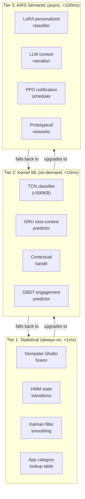

# AIOS Context Engine — Learning, Fallback, and Intelligence

Part of: [context-engine.md](../context-engine.md) — Context Engine
**Related:** [signals.md](./signals.md) — Signal sources that feed learning, [inference.md](./inference.md) — Inference pipeline and models, [sdk.md](./sdk.md) — Diagnostics for learned patterns

-----

## 7. Learning and Personalization

### 7.1 Pattern Learning

Over time, the Context Engine learns user-specific patterns that improve inference accuracy. Learning is passive — the engine observes context transitions and their outcomes, not user content.

What the engine learns:

- **Typical work hours.** "This user codes Monday-Friday 9 AM to 12 PM and 1 PM to 5 PM. On weekends, they sometimes code in the morning but not reliably."
- **Space-context associations.** "The 'research' space is always work. The 'music' space is ambiguous. The 'game-saves' space is always leisure."
- **Agent combination patterns.** "When the IDE agent and terminal agent are both active, this user is in deep work for an average of 2.3 hours."
- **Override patterns.** "This user activates 'heads down' about 3 times per week, always in the afternoon, always for 1-2 hours."
- **Notification response patterns.** "During high work_engagement, this user ignores Digest notifications for 2+ hours. During leisure, they respond to NextBreak notifications within 5 minutes."

Learning happens through observation of context transitions and their stability:

```rust
pub struct LearningEngine {
    /// Accumulated observations
    observations: Vec<ContextObservation>,
    /// Derived patterns
    patterns: Pattern,
    /// Learning rate (how quickly patterns update)
    learning_rate: f32,
    /// Minimum observations before a pattern is used
    min_observations: usize,         // default: 20
}

pub struct ContextObservation {
    /// What signals were active
    signals: Vec<ContextSignal>,
    /// What context was inferred
    inferred_state: ContextState,
    /// How long the context was stable
    stability_duration: Duration,
    /// Did the user override?
    was_overridden: bool,
    /// Timestamp
    timestamp: Timestamp,
}

impl LearningEngine {
    pub fn observe(&mut self, obs: ContextObservation) {
        self.observations.push(obs.clone());

        // If the user overrode an inferred state, that's a correction signal.
        // The inference was wrong. Adjust patterns to prevent the same mistake.
        if obs.was_overridden {
            self.adjust_for_correction(&obs);
        }

        // If the inferred state was stable for > 10 minutes without override,
        // that's a confirmation signal. The inference was right. Reinforce.
        if obs.stability_duration > Duration::from_secs(600) && !obs.was_overridden {
            self.reinforce(&obs);
        }

        // Periodically recompute derived patterns
        if self.observations.len() % 50 == 0 {
            self.recompute_patterns();
        }
    }
}
```

**Override correction.** If the user frequently overrides the inferred context for a specific signal combination, the engine learns to infer differently next time. Example: the engine infers leisure because it's 9 PM, but the user says "heads down." After several such corrections, the engine reduces the weight of TimeOfDay for this user's evening hours.

### 7.2 Privacy

All learning data stays local. Nothing leaves the device.

- **Storage.** Patterns are stored in `system/context/` space. This is a system space, not readable by third-party agents.
- **Inspection.** The user can open the Inspector and see exactly what the Context Engine has learned: time-based patterns, space associations, agent combination mappings. No black boxes.
- **Deletion.** The user can delete all learned patterns at any time. The engine resets to base weights and starts learning from scratch.
- **Disabling.** The user can disable learning entirely. The engine will still function using base weights and explicit overrides. Inference quality will be lower but the system will work.
- **No content access.** The engine never sees document content, message text, or browsing history. It sees structural signals: which space, which agents, what input cadence, what time. The engine knows "the user is typing fast in the 'research' space" but never "the user is writing about quantum computing."

```rust
pub struct PrivacyControls {
    /// Is learning enabled?
    learning_enabled: bool,
    /// Maximum observation retention period
    retention_period: Duration,         // default: 90 days
    /// Space where patterns are stored
    storage_space: SpaceId,            // system/context/
}

impl PrivacyControls {
    pub fn delete_all_patterns(&mut self) {
        self.storage_space.delete_all();
        // Engine continues with base weights
    }

    pub fn export_patterns(&self) -> PatternExport {
        // User can export learned patterns for inspection
        // Returns human-readable summary, not raw model weights
        PatternExport {
            work_hours: self.describe_work_hours(),
            space_associations: self.describe_space_patterns(),
            common_overrides: self.describe_override_patterns(),
        }
    }
}
```

-----

## 8. Fallback (Without AIRS)

### 8.1 Rule-Based Fallback

When AIRS is unavailable — during early boot before AIRS loads, during resource pressure when the inference engine is paused, or if the user has disabled AIRS — the Context Engine falls back to the `RuleBasedModel` described in Section 4.1.

The fallback uses the same signal collection, the same override system, and the same state publishing. Only the inference step changes: instead of a classifier model, a weighted average computes the `ContextState`.

```text
Fallback inference:

1. For each signal, compute a work_engagement score (0.0-1.0)
   based on hard-coded rules:

   ActiveSpace:
     Work/System → 0.9
     Communication → 0.6
     Personal → 0.5
     Media → 0.2
     Gaming → 0.0
     Unknown → 0.5

   RunningAgents:
     Productivity agents > 50% of active → 0.8
     Gaming agents present → 0.1
     Mixed → 0.5

   TimeOfDay (weekday):
     06:00-09:00 → 0.6 (morning, probably work)
     09:00-17:00 → 0.7 (business hours)
     17:00-21:00 → 0.4 (evening, ambiguous)
     21:00-06:00 → 0.2 (night, probably leisure)

   TimeOfDay (weekend):
     All hours → 0.3 (leisure bias)

2. Multiply each score by its base weight
3. Sum and normalize → work_engagement
4. Derive ai_engagement, notification_threshold,
   resource_priority from work_engagement using
   the same thresholds as the classifier
```

```rust
impl RuleBasedModel {
    fn time_of_day_score(time: &TimeSignal) -> f32 {
        let hour = time.local_time.hour();
        let weekend = matches!(time.day_of_week, DayOfWeek::Saturday | DayOfWeek::Sunday)
            || time.is_holiday;

        if weekend {
            return 0.3;
        }

        match hour {
            6..=8   => 0.6,
            9..=16  => 0.7,
            17..=20 => 0.4,
            _       => 0.2,
        }
    }
}
```

### 8.2 Fallback Quality

The rule-based fallback is functional but noticeably less nuanced than the AIRS classifier:

| Scenario                                    | AIRS classifier | Rule-based fallback |
|---------------------------------------------|-----------------|---------------------|
| Coding at 10 PM on a weekday                | Work (correct)  | Leisure (wrong — TimeOfDay dominates) |
| Browsing documentation during gaming break  | Leisure (correct, sustained gaming context) | Mixed (unstable — ActiveSpace flickers) |
| Video call that is actually a social hangout | Communication (adapts from conversation signals) | Work (wrong — CalendarState says "meeting") |
| User's personal coding style (very slow typing) | Work (learned pattern) | Mixed (InputPattern says low cadence = leisure) |

The fallback works well for clear-cut situations: 9 AM on a Monday with an IDE open is obviously work. A game running fullscreen on a Saturday night is obviously leisure. It struggles with ambiguous or unusual situations where the AIRS classifier would use learned patterns and cross-signal correlation.

**When AIRS is unavailable, explicit overrides become more important.** The system should suggest overrides more proactively: if the fallback keeps getting it wrong, the user learns to say "heads down" or "gaming." This is still better than no context engine at all — the override system alone is more useful than manual mode-switching.

### 8.3 Boot-Time Context Behavior

During boot, the Context Engine faces a unique situation: it must publish a `ContextState` before any meaningful user signals exist. This section specifies exactly what happens between the Context Engine starting (Phase 3, after AIRS — see [services.md §4.5](../../kernel/boot/services.md) dependency graph) and the first real user activity.

**Boot-time signal availability:**

| Signal | Available at boot? | Value during boot |
|---|---|---|
| ActiveSpace | No (compositor not running) | `None` — no space is active |
| RunningAgents | Partial (system agents only) | System agents starting; no user agents yet |
| InputPattern | No (no user input yet) | `InputActivity::Idle` |
| TimeOfDay | Yes | Current wall-clock time |
| CalendarState | No (calendar agent not started) | `CalendarContext::Unknown` |
| MediaPlayback | No (media agents not started) | `MediaState::Idle` |
| UserHistory | No (no recent interactions) | Empty pattern |
| ExplicitIntent | No (no user input yet) | `None` |

**Boot-time inference.** With only TimeOfDay and hardware signals available, the Context Engine produces a conservative initial state:

```rust
impl ContextEngine {
    /// Generate the initial ContextState during boot.
    /// Called once during Phase 3 initialization, before any user signals.
    fn boot_context(&self) -> ContextState {
        let time_signal = self.signal_collector.time_of_day();
        let battery = self.signal_collector.battery_state();

        // Use time-of-day as the primary signal
        let work_engagement = RuleBasedModel::time_of_day_score(&time_signal);

        // Battery-aware adjustment: if battery is critical, reduce resource priority
        let resource_priority = if battery.level < 0.10 && !battery.ac_connected {
            ResourcePriority::Balanced
        } else {
            ResourcePriority::from_engagement(work_engagement)
        };

        ContextState {
            work_engagement,
            ai_engagement: AiEngagement::Ambient, // conservative: don't pop up AI UI
            notification_threshold: Urgency::NextBreak, // moderate filtering during boot
            resource_priority,
        }
    }
}
```

**Key design decisions for boot context:**

1. **`AiEngagement::Ambient`, not `Available`.** During boot, the system should not proactively show AI UI (Conversation Bar, suggestion panels). The user may be waiting for the desktop to appear. Once the user interacts and signals accumulate, the engagement level adjusts naturally.

2. **Low confidence.** The boot context is inherently low-confidence — consumers that check confidence (e.g., the scheduler's context multiplier) should use a conservative default instead of the inferred value when few signals are available.

3. **Boot heuristic source.** The audit log records that this context state came from boot heuristics (via `ContextSource::Fallback`), not from real signal analysis. Useful for debugging context transitions.

**Transition to real context.** Once the compositor starts (Phase 6) and the user begins interacting, real signals flow in. The Context Engine transitions from boot heuristics to normal inference:

```text
Boot context lifecycle:

Phase 3: Context Engine starts (after AIRS, non-critical path)
  → Publishes BootHeuristic context (Low confidence)
  → All consumers receive conservative defaults

Phase 6: Compositor + agents start
  → ActiveSpace signal arrives (user's last workspace)
  → RunningAgents signal populates as agents launch
  → Confidence rises to Medium

Phase 6 + 30s: User interacts
  → InputPattern signal activates
  → Confidence rises to High
  → Context Engine switches from rule-based to AIRS classifier
    (if AIRS model is loaded by now)

Phase 6 + 5min: Steady state
  → All 8 signal sources active
  → AIRS classifier running
  → Learning engine observing
  → Full confidence
```

**Semantic Resume integration.** When the system restores a previous session via Semantic Resume (see [suspend.md §15.3](../../kernel/boot/suspend.md)), the Context Engine receives a hint about the user's pre-reboot context from the resume state. If the user was in deep work before a crash, the Context Engine initializes with a work-biased context rather than a neutral boot context. This reduces the jarring transition of "I was coding, the system crashed, and now it thinks I'm leisuring."

```rust
pub enum BootContextHint {
    /// Clean boot — no prior context information
    ColdBoot,
    /// Semantic Resume — we know what the user was doing
    SemanticResume { previous_context: ContextState },
    /// Recovery mode — system is in a degraded state
    RecoveryMode,
    /// Proactive wake — system woke up for a scheduled task
    ProactiveWake { scheduled_task: TaskDescription },
}
```

-----

## 13. AI-Native Context Intelligence

The Context Engine's intelligence capabilities span three tiers. Tier 1 (statistical, always-on) is covered in §8 Fallback. Tier 2 (kernel-internal ML) and Tier 3 (full AIRS) are described here.



### 13.1 Learned Context Classification

The AIRS classifier described in §4.1 is a small fixed model. With AI-native intelligence, it evolves:

**Temporal Convolutional Networks (TCN).** TCNs are the strongest candidate for Tier 2 context classification. They are causal (only look at past signals, not future), parallelizable during training, and produce models under 500KB — efficient on ARM NEON. Unlike RNNs, TCNs have fixed-depth receptive fields, making inference time predictable.

**TinyHAR-style models.** Human Activity Recognition research has produced models achieving near-state-of-the-art accuracy at under 100KB. These are directly deployable as frozen kernel models for Tier 1 operation when AIRS is unavailable but better-than-rule-based inference is desired.

**LoRA personalization.** A frozen base context model ships with the OS. Per-user personalization uses Low-Rank Adaptation (LoRA) adapters (~1MB) that modify the base model's behavior without retraining it. When the user overrides an inference, the LoRA adapter weights adjust. This enables per-user accuracy improvements while keeping the base model shared and updatable.

```rust
pub struct PersonalizedClassifier {
    /// Frozen base model (shipped with OS, ~2MB GGUF)
    base_model: ModelHandle,
    /// Per-user LoRA adapter (~1MB, stored in system/context/)
    lora_adapter: Option<LoraWeights>,
    /// Update the LoRA adapter from override corrections
    adapter_lr: f32,                    // default: 0.001
    /// Minimum corrections before adapter is applied
    min_corrections: usize,            // default: 10
}
```

**Prototypical Networks.** Users may want custom context modes beyond work/leisure/gaming — "studying," "creative work," "meal prep." Prototypical Networks allow defining new context categories from just 3-5 examples. The user labels a few moments ("right now is 'studying'"), and the network learns a prototype embedding for that category. This is a Tier 3 (AIRS) feature because it requires embedding computation.

### 13.2 Evidential Signal Fusion

The rule-based fallback (§8) uses simple weighted averaging to combine signals. AI-native fusion is more sophisticated:

**Dempster-Shafer evidential reasoning.** Instead of treating each signal as a probability, Dempster-Shafer theory assigns each signal a *belief mass* over the set of possible contexts and a mass for uncertainty ("I don't know"). Conflicting signals are handled gracefully — if the calendar says "meeting" but the gamepad is active, the theory quantifies the conflict rather than averaging it away. This is Tier 1: interpretable, lightweight, no training needed.

```rust
pub struct EvidentialFusion {
    /// Belief mass functions per signal source
    mass_functions: Vec<MassFunction>,
    /// Combined belief after Dempster's rule of combination
    combined_belief: BeliefAssignment,
    /// Conflict coefficient (0.0 = agreement, 1.0 = full conflict)
    conflict: f32,
}

pub struct BeliefAssignment {
    work: f32,          // belief mass for "work" context
    leisure: f32,       // belief mass for "leisure" context
    gaming: f32,        // belief mass for "gaming" context
    uncertainty: f32,   // "I don't know" mass
}
```

**Kalman filter smoothing.** The work_engagement score is treated as a noisy observation of the user's true state. A Kalman filter smooths the signal, preventing mode thrashing during rapid transitions. The process noise parameter controls how quickly the filter responds to genuine changes — lower noise = more inertia = fewer false transitions. This complements hysteresis (§4.3) by operating at the signal level rather than the state transition level.

**Hybrid architecture.** Per-signal-source feature extractors (Tier 2) feed into a shared fusion layer (Tier 3). Each extractor learns signal-specific patterns (e.g., the input extractor learns that this user's "focused coding" looks like 40 WPM, not the default 80 WPM). The fusion layer learns cross-signal correlations that the rule-based model misses.

### 13.3 Proactive Context Prediction

Rather than reacting to context changes, the engine can predict them:

**GRU sequence model.** A Gated Recurrent Unit model trained on the user's context history predicts the next context transition. "It's 11:55 AM and the user has been coding for 3 hours → 85% probability of a break in the next 10 minutes." The scheduler can use this to pre-load the user's typical break-time agents (music player, browser) or defer non-urgent background tasks until the predicted break.

**Ultradian rhythm awareness.** Research shows humans naturally cycle through ~90-minute focus periods followed by ~20-minute recovery periods. The Context Engine can detect these rhythms in the user's history and align its predictions. If the user has been in deep focus for 85 minutes, proactively reducing notification suppression prepares for the natural break without requiring the user to signal it.

**HMM state transitions.** A Hidden Markov Model captures the structure of context transitions: work→focus→break→work chains, or leisure→gaming→idle→sleep patterns. The HMM's transition matrix is learned from the user's history. This is Tier 1 — HMMs are lightweight (<1KB model) and provide probabilistic next-state predictions.

```rust
pub struct ContextPredictor {
    /// HMM transition matrix (Tier 1, always available)
    hmm: HiddenMarkovModel,
    /// GRU sequence model (Tier 2, when kernel ML available)
    gru: Option<GruModel>,
    /// Predicted next context and confidence
    prediction: Option<ContextPrediction>,
}

pub struct ContextPrediction {
    predicted_context: ContextMode,
    confidence: f32,
    predicted_transition_time: Duration,    // "in ~8 minutes"
    recommended_action: Option<PredictiveAction>,
}

pub enum PredictiveAction {
    PreloadAgents(Vec<AgentId>),
    DeferBackgroundWork(Duration),
    RelaxNotificationFilter,
    PrepareForSleep,
}
```

### 13.4 Intelligent Notification Triage

The Attention Manager (§6.2) filters notifications against the context threshold. AI-native intelligence makes this smarter:

**Content-aware urgency.** A quantized DistilBERT or TinyBERT model (Tier 3) reads the notification content and assesses urgency independently of the sender's declaration. "Server is on fire" in a Slack message is genuinely urgent. "Check out this meme" from the same channel is not. The model learns to distinguish content patterns that predict user engagement.

**Sender relationship graph.** The strongest predictor of notification urgency is the sender's relationship to the user. A message from the user's manager during work hours is almost always worth interrupting for. A message from a marketing bot is almost never worth interrupting for. The Context Engine maintains a sender importance graph:

```rust
pub struct SenderImportance {
    sender_id: AgentId,
    /// Learned importance score (0.0-1.0)
    importance: f32,
    /// How often the user engages with this sender
    engagement_rate: f32,
    /// Average response time (lower = more important to user)
    avg_response_time: Duration,
    /// Relationship category
    category: SenderCategory,
}

pub enum SenderCategory {
    Manager,        // auto-high importance
    DirectReport,   // high during work context
    Peer,           // moderate, context-dependent
    External,       // low unless explicit relationship
    System,         // importance varies by content
    Bot,            // default low
}
```

**Attention as finite budget.** Research (Gloria Mark, UC Irvine) shows that context switches cost ~23 minutes of recovery time. The Context Engine tracks an **attention budget** — a finite daily interruption capacity. Each interrupt costs attention budget. When the budget is depleted, the threshold automatically tightens. This prevents notification fatigue even when individual notifications pass the urgency threshold.

**Breakpoint detection.** The engine identifies natural breakpoints in the user's activity — moments when an interruption is least costly. Typing pauses, app switches, scrolling stops, and compile waits are breakpoints. Notifications marked `NextBreak` are delivered at the next detected breakpoint rather than at an arbitrary time.

```rust
pub struct AttentionBudget {
    /// Daily budget (resets at midnight)
    daily_budget: u32,              // default: 50 interrupts/day
    /// Remaining budget
    remaining: u32,
    /// Budget depletion rate adjustment based on user feedback
    depletion_weight: f32,          // default: 1.0
}

pub struct BreakpointDetector {
    /// Input velocity threshold for detecting pauses
    idle_threshold: Duration,       // default: 3 seconds
    /// App switch as breakpoint
    app_switch_window: Duration,    // default: 2 seconds after switch
    /// Compile/build as breakpoint
    build_start_detected: bool,
}
```

### 13.5 Cross-Device Context Sync

When AIOS runs on multiple devices (see [multi-device.md](../../platform/multi-device.md)), context should flow between them:

**Discovery and advertisement.** Following the Apple Continuity pattern, devices advertise their current context mode (not full context state) via BLE. A user's phone advertising "gaming" tells the desktop to suppress work notifications. Only the coarse context mode is broadcast — detailed signals stay on each device.

**CRDT-based sync.** For full context synchronization between trusted devices, CRDTs (Conflict-free Replicated Data Types) enable offline-capable sync without a central server:

- **LWW-Register** for current context mode — last-write-wins ensures the most recent active device's context dominates
- **G-Counter** for accumulated metrics (total focus minutes today, interruption count) — monotonically increasing counters merge correctly under any network partition

```rust
pub struct CrossDeviceContext {
    /// This device's current context (authoritative)
    local_context: ContextState,
    /// Contexts from paired devices (received via BLE/WiFi)
    peer_contexts: HashMap<DeviceId, PeerContext>,
    /// Fused context (optional, for multi-device awareness)
    fused_context: Option<ContextState>,
}

pub struct PeerContext {
    device_id: DeviceId,
    context_mode: ContextMode,          // coarse mode only (BLE)
    full_context: Option<ContextState>, // full state (WiFi, if trusted)
    last_updated: Timestamp,
    freshness: ContextFreshness,
}

pub enum ContextFreshness {
    Live,           // updated within last 30 seconds
    Recent,         // updated within last 5 minutes
    Stale,          // older than 5 minutes — weight reduced in fusion
    Offline,        // device not seen — excluded from fusion
}
```

**Context quality model.** When fusing context from multiple devices, freshness, confidence, and resolution matter. A stale context from a device that went offline 30 minutes ago should be weighted lower than a live context from the device the user is actively using. The active device (last input event) is always authoritative.

### 13.6 LLM-Powered Context Narration

At Tier 3, the full AIRS inference engine can generate natural language descriptions of context:

**Structured signals → narrative.** Instead of a numeric `work_engagement: 0.82`, the engine produces: "You've been in deep coding focus for the past 2 hours in the research space. Your typing cadence is high and sustained. No meetings until 3 PM." This narrative powers conversational context queries via the Conversation Bar.

**Conversational context queries.** "What was I doing when I got that email?" AIRS searches the context history, correlates the timestamp, and answers: "You were in deep work mode, coding in the research space. The email arrived during a natural typing pause and was delivered as a NextBreak notification."

**Cross-app semantic grouping.** For notification summarization, AIRS uses entity extraction to group related notifications: "5 messages about the deployment (3 from #engineering, 2 from CI bot)" rather than "5 new notifications." This requires Tier 3 because entity extraction and semantic similarity are compute-intensive.

### 13.7 Summary

| Feature | Tier | Latency | Model Size | AIRS Required |
|---|---|---|---|---|
| TCN context classifier | 2 | <10ms | ~500KB | No (kernel ML) |
| LoRA personalization | 3 | <50ms | ~1MB adapter | Yes |
| Prototypical Networks | 3 | <100ms | ~2MB | Yes |
| Dempster-Shafer fusion | 1 | <0.1ms | N/A (algorithm) | No |
| Kalman filter smoothing | 1 | <0.1ms | N/A (algorithm) | No |
| GRU prediction | 2 | <10ms | ~200KB | No (kernel ML) |
| HMM transitions | 1 | <0.1ms | <1KB | No |
| Content-aware urgency | 3 | <100ms | ~50MB (quantized) | Yes |
| Sender importance | 2 | <1ms | <10KB | No (kernel ML) |
| Attention budget | 1 | <0.1ms | N/A (counter) | No |
| Breakpoint detection | 1 | <0.1ms | N/A (heuristic) | No |
| Cross-device BLE | 1 | N/A | N/A (protocol) | No |
| CRDT sync | 1 | <1ms | N/A (algorithm) | No |
| LLM narration | 3 | <1s | ~2GB | Yes |
| Semantic grouping | 3 | <100ms | ~50MB | Yes |

-----

## 14. Future Directions

### 14.1 Kernel-Internal Decision Trees

The rule-based fallback (§8) can be upgraded with frozen gradient-boosted decision trees (GBDT) that ship with the OS. These models are trained offline on aggregate context data and deployed as read-only binary blobs. They provide better-than-rule-based accuracy without requiring AIRS.

**Agent priority tiers.** Android's Adaptive Battery uses App Standby Buckets (Active, Working Set, Frequent, Rare, Restricted) to manage background app behavior. AIOS can apply a similar model to agents: the GBDT predicts which bucket each agent belongs to based on the user's recent interaction patterns, and the scheduler adjusts resource allocation accordingly.

**Interruptibility prediction.** A frozen decision tree trained on input velocity features (typing cadence, mouse movement, app switch frequency) predicts the user's interruptibility on a 0-1 scale. This Tier 1 model runs in <0.1ms and provides a quick estimate that the Attention Manager uses when AIRS is unavailable for full content-aware triage.

### 14.2 Federated Context Learning

When AIOS is deployed across a fleet (enterprise, family, or personal multi-device), federated learning enables collective intelligence without centralizing data:

**FedAvg.** The base context classifier is periodically improved by aggregating gradient updates from participating devices. Each device trains locally on its own context history, computes a model update, and sends only the update (not the data) to a coordination hub. The hub averages updates and distributes the improved model. No device's raw context data leaves the device.

**Personalized FL (FedPer).** The model is split into shared base layers (universal patterns like "gaming with a gamepad is leisure") and personalized heads (user-specific patterns like "this user codes at midnight"). Base layers are updated via FedAvg. Personalized heads stay on-device and are never shared.

**DP-FedAvg.** For enterprise deployments where even gradient updates could leak information, differential privacy is applied: gradients are clipped to a maximum norm and Gaussian noise is added before aggregation. This provides a formal privacy guarantee (ε-differential privacy) at the cost of slightly slower model convergence.

### 14.3 Differential Privacy for Patterns

The Learning Engine (§7) accumulates user patterns locally. Differential privacy can provide formal guarantees about what information these patterns reveal:

**Local Differential Privacy (LDP).** Following Apple's approach, the Context Engine can apply randomized response to pattern observations before storing them. Instead of recording "user was in work mode at 9:03 AM," the engine records a noisy version. Over many observations, the true pattern emerges statistically, but any single observation is plausible under multiple true states.

**Privacy budget tracking.** A privacy accountant tracks the cumulative privacy loss (ε) across all learning operations. When the budget is exhausted, learning pauses until the budget resets (daily or weekly). Rényi Differential Privacy (RDP) or zero-concentrated DP (zCDP) provide tighter accounting than basic (ε,δ)-DP, enabling more learning within the same privacy budget.

```rust
pub struct PrivacyAccountant {
    /// Maximum daily privacy budget
    daily_epsilon: f32,             // default: 4.0 (moderate privacy)
    /// Remaining budget
    remaining_epsilon: f32,
    /// Privacy loss per observation
    per_observation_cost: f32,      // depends on noise mechanism
    /// Budget reset interval
    reset_interval: Duration,       // default: 24 hours
    /// Mechanism: Laplace, Gaussian, or Randomized Response
    mechanism: PrivacyMechanism,
}
```

**RAPPOR-style reporting.** If AIOS ever supports aggregate telemetry (opt-in), Google's RAPPOR protocol provides a two-stage randomized response mechanism. A permanent randomized response prevents longitudinal privacy erosion (the same observation always maps to the same noisy value), while an instantaneous randomized response adds additional noise per collection event.

### 14.4 Privacy-Preserving Computation

Context processing can be hardened beyond on-device storage:

**Capability-gated isolation.** Following the Android Private Compute Core model, the Context Engine runs in an isolated subsystem with no direct network access. All IPC is mediated by the capability system. The Context Engine has `SignalRead` capabilities for its signal sources and `StatePublish` capabilities for its consumers, but no `NetworkAccess` capability. Even a compromised Context Engine cannot exfiltrate data.

**ARM TrustZone integration.** Sensitive context processing — pattern learning, privacy accountant state, LoRA adapter weights — runs in the Secure World via TrustZone. The Normal World kernel receives only the computed `ContextState`, never the raw observations or model internals. This protects context data even if the main kernel is compromised.

**Secure Aggregation.** For multi-device context sync, Google's Secure Aggregation protocol enables a hub device to aggregate context updates from the user's fleet without seeing individual device updates. Each device encrypts its update with a shared secret; the hub can only decrypt the sum. This is relevant for federated LoRA adapter training across devices.

**PRIO/DAP.** The IETF Distributed Aggregation Protocol (DAP) uses secret-sharing to compute aggregate statistics. If AIOS supports opt-in anonymous telemetry for context model improvement, PRIO/DAP provides the gold standard for privacy-preserving data collection.

### 14.5 Contextual Reinforcement Learning for Notifications

The notification triage system (§13.4) can evolve from heuristics to learned policies:

**Contextual bandits (Tier 1).** A Thompson Sampling bandit learns the optimal deliver/defer decision for each notification type × context combination. The bandit observes the user's response (engaged, dismissed, ignored) and updates its policy. This is lightweight enough for kernel-internal ML — the model is a small table of Beta distribution parameters.

**Deep RL (Tier 3).** For long-horizon notification scheduling, a PPO (Proximal Policy Optimization) agent learns to optimize daily notification satisfaction. Research shows 15-25% improvement in user-reported satisfaction compared to rule-based thresholds. The RL agent considers not just individual notifications but the sequence — "I showed 3 interrupts this hour, defer the next one even if it's moderately urgent."

**Learning signals.** The RL agent learns from implicit feedback, not explicit ratings:

- Notification engaged within 30 seconds → positive reward
- Notification dismissed → negative reward
- Notification ignored for 5+ minutes → strong negative reward
- User manually lowered notification threshold after delivery → negative reward
- User manually raised threshold → positive reward for previous suppressions

### 14.6 Multimodal and Ambient Context

Future signal sources beyond the current eight:

**Physiological signals.** Integration with wearables (smartwatch, fitness tracker) provides heart rate variability (HRV) and electrodermal activity (EDA) as cognitive load indicators. High HRV + low EDA = relaxed state. Low HRV + high EDA = stressed/focused. These signals are strong but require user opt-in and sensor availability.

**Context abstraction for privacy.** When sharing context across devices or with enterprise systems, detailed context is abstracted: "busy" instead of "in a meeting with [person]," "focused" instead of "coding in [project]." Abstraction levels are configurable and capability-gated.

**Temporal degradation.** Detailed context decays to coarse over time. A 5-minute-old context record includes full signal breakdown. A 1-hour-old record retains only the context mode. A 24-hour-old record retains only a timestamp and binary work/leisure classification. This limits the exposure window if stored context is compromised.

**Split Learning.** For multi-device learning, raw sensor data stays on the originating device. Only compact intermediate activations (the "cut layer" output) are sent to the hub device for aggregation. This provides stronger privacy than sending raw features while enabling cross-device model training.

### 14.7 Formal Verification of Context Safety

The Context Engine makes decisions that affect user experience and security. Formal verification can prove safety properties:

**Information flow control.** Following seL4's approach, the capability system can be formally verified to ensure that context data cannot flow from the Context Engine to unauthorized consumers. The proof establishes that a consumer without `ContextRead` capability can never observe context state, even through side channels.

**Context-dependent capabilities.** Capabilities that are valid only in certain contexts: a sync capability that only works on trusted WiFi, a notification suppression that only activates during calendar events with matching attendees, or a resource boost that only applies during the user's learned work hours. Formal verification proves that context-dependent capabilities cannot be exercised outside their valid context.

**Audit completeness.** A formal proof that every context state change is recorded in the audit log, and that no context observation is processed without corresponding audit entries. This guarantees that the Inspector's view is always complete and accurate.

### 14.8 References

Key research informing these directions:

- Horvitz & Iqbal, "Models of Attention in Computing and Communication" — breakpoint theory, interruption cost modeling
- Mehrotra et al., "Intelligent Notification Systems: A Survey" — three-layer urgency model, content + context + decision fusion
- McMahan et al., "Communication-Efficient Learning of Deep Networks from Decentralized Data" — FedAvg, the foundation of federated learning
- Bailey & Konstan, "On the Need for Attention-Aware Systems" — 23-minute recovery cost from context switches
- Gloria Mark, "Attention Span" — empirical studies on digital interruption and recovery
- Okoshi et al., "Attelia: Reducing User's Cognitive Load and Sedentary Time" — sensor-based interruptibility prediction
- Pejovic & Musolesi, "InterruptMe" — machine learning for mobile interruptibility
- Apple, "Learning with Privacy at Scale" (2017) — local differential privacy with CMS/Hadamard sketches
- Google, "RAPPOR: Randomized Aggregatable Privacy-Preserving Ordinal Response" — two-stage randomized response
- Erlingsson et al., "PRISM/PRIO" — secret-sharing based aggregate statistics
- Kairouz et al., "Advances and Open Problems in Federated Learning" — comprehensive FL survey
