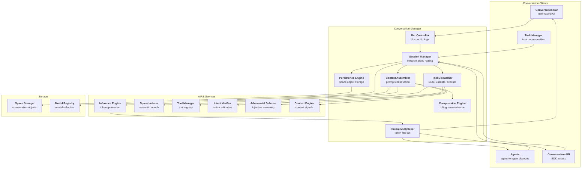
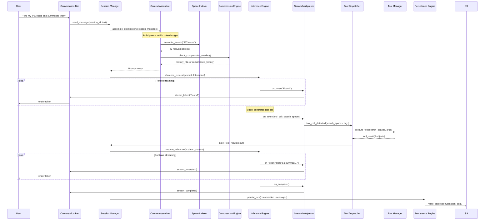

# AIOS Conversation Manager

## Deep Technical Architecture

**Parent document:** [architecture.md](../project/architecture.md)
**Related:** [airs.md](./airs.md) — AIRS inference engine and service framework, [context-engine.md](./context-engine.md) — Context signals and adaptation, [attention.md](./attention.md) — AI-triaged notifications, [task-manager.md](./task-manager.md) — Task decomposition and routing, [experience.md](../experience/experience.md) — Experience layer overview, [spaces.md](../storage/spaces.md) — Space Storage persistence, [agents.md](../applications/agents.md) — Agent framework and lifecycle, [model.md](../security/model.md) — Capability-based access control, [flow.md](../storage/flow.md) — Data exchange and provenance

**Note:** The Conversation Manager is an AIRS intelligence service. Its capability gate, audit logging, and streaming patterns follow the universal patterns defined in the AIRS document. This document is the authoritative reference for the Conversation Bar UI, superseding [experience.md §4](../experience/experience.md).

-----

## Document Map

This document is organized as a hub with sub-documents for navigability. Each sub-document preserves section numbers for cross-reference stability.

| Document | Sections | Content |
|---|---|---|
| **This file** | §1, §2, §15, §16 | Overview, architecture, implementation order, design principles |
| [sessions.md](./conversation-manager/sessions.md) | §3, §4 | Session lifecycle, multi-turn state, persistence, search, branching, retention |
| [context-windows.md](./conversation-manager/context-windows.md) | §5, §6 | Context assembly pipeline, token budgeting, RAG, compression algorithms |
| [tool-orchestration.md](./conversation-manager/tool-orchestration.md) | §7, §8 | Tool invocation flow, multi-step chains, confirmation gates, built-in tools |
| [conversation-bar.md](./conversation-manager/conversation-bar.md) | §9, §10, §11 | Conversation Bar design, structured output, compositor and context integration |
| [streaming.md](./conversation-manager/streaming.md) | §12, §13 | Streaming token delivery, backpressure, cancellation, AI-native streaming intelligence |
| [security.md](./conversation-manager/security.md) | §14 | Prompt injection defense, capability enforcement, privacy, audit, content safety |

-----

## 1. Overview

Every AI assistant today is a disconnected chat window. It runs in a browser tab or an app sandbox, cut off from the operating system. It cannot see your files. It cannot see your tasks. It cannot see what you were doing five minutes ago. You copy-paste context into the chat window, wait for a response, then copy-paste the result back out. The conversation is trapped — it cannot search your documents, cannot control your system, cannot hand off work to another agent.

The result is a brutal context gap. You know what you are working on. The AI does not. Every conversation starts cold. You re-explain your project, your constraints, your preferences. You manually attach files. You manually describe errors. The AI generates a response that might reference a library you don't use, a file structure you don't have, or an approach your team already rejected — because it has no system context.

AIOS closes this gap. The **Conversation Manager** is an AIRS intelligence service that manages multi-turn conversation sessions with the local inference engine. It is not a chatbot. It is the orchestration layer that connects natural language interaction to the full power of the operating system.

**What the Conversation Manager does:**

- **Maintains conversation sessions** — stateful, multi-turn dialogue with persistence across reboots. One conversation can span days, be forked, searched, and shared.
- **Assembles context from the OS** — each turn's prompt is built from the conversation history, semantically relevant space objects, active tasks, running agents, and the current context mode. The user never copy-pastes context.
- **Compresses context windows** — when conversation history exceeds the model's context window, older messages are progressively summarized. Originals remain in storage — compression is a view, not a deletion.
- **Orchestrates tool use** — the model can invoke registered tools (space search, system control, agent commands, Flow operations) within the conversation. Tool calls are transparent, capability-gated, and auditable.
- **Streams tokens to the Conversation Bar** — every response streams token-by-token to the Conversation Bar UI. Streaming is the only mode for interactive conversations.
- **Persists everything as space objects** — conversations are first-class objects in Space Storage. They are searchable, versioned, and subject to the same capability system as any other data.

**Key distinctions:**

| Component | Role | Boundary |
|---|---|---|
| **Inference Engine** ([inference.md §3](./airs/inference.md)) | Raw token generation, KV cache, compute scheduling | Stateless — no conversation awareness |
| **Conversation Manager** (this document) | Session state, context assembly, tool orchestration, compression | Stateful — owns the conversation lifecycle |
| **Conversation Bar** (§9-11) | UI surface — input, rendering, structured output | Rendering only — all logic lives in the Conversation Manager |

The Conversation Manager serves any client that needs multi-turn dialogue: the Conversation Bar, agent-to-agent conversations, headless agent sessions, and the Task Manager's conversational task decomposition. The Conversation Bar is the primary user-facing client, but it is one consumer among many.

-----

## 2. Architecture

### 2.1 Component Overview



The Conversation Manager has seven internal components:

1. **Session Manager** — creates, resumes, suspends, and destroys conversation sessions. Manages the session pool and enforces per-agent session limits. Routes sessions to the appropriate model via the Model Registry.

2. **Context Assembler** — builds the prompt for each inference turn. Combines the system prompt, capability declarations, retrieved context (from Space Indexer), conversation history (possibly compressed), and the current user message. Enforces token budget allocation.

3. **Compression Engine** — monitors conversation history token count. When history approaches the context window limit, triggers progressive summarization of older messages. Three compression tiers: extractive, abstractive, and hierarchical.

4. **Tool Dispatcher** — intercepts tool call markers in model output. Validates tool calls against registered schemas, checks capability tokens, routes to the Tool Manager via IPC, and injects tool results back into the conversation.

5. **Stream Multiplexer** — receives tokens from the Inference Engine and fans them out to all subscribed consumers. Handles backpressure, batching, and cancellation.

6. **Persistence Engine** — serializes conversation state to Space Storage. Handles conversation creation, updates, forking, and deletion. Maintains conversation metadata for search indexing.

7. **Bar Controller** — handles Conversation Bar-specific concerns: invocation/dismissal animations, structured output rendering, quick actions, and compositor surface management. This component is only active when the Conversation Bar is in use.

### 2.2 Conversation Turn Sequence

A complete conversation turn with tool use:



### 2.3 Core Data Types

These types expand the definitions from [intelligence-services.md §5.8](./airs/intelligence-services.md):

```rust
/// Unique conversation identifier (UUID v7 — time-ordered)
pub struct ConversationId(u128);

/// Unique session identifier — one conversation may have many sessions
pub struct SessionId(u64);

/// Runtime conversation session (in-memory, tied to InferenceSession)
pub struct ConversationSession {
    id: SessionId,
    conversation: ConversationId,
    inference_session: InferenceSessionHandle,
    origin: SessionOrigin,
    config: SessionConfig,
    state: SessionState,
    created_at: Timestamp,
    last_active: Timestamp,
}

/// Where the session was initiated
pub enum SessionOrigin {
    ConversationBar,           // user invoked the Conversation Bar
    Agent(AgentId),            // agent-to-agent dialogue
    TaskManager(TaskId),       // task decomposition conversation
    Api(AgentId),              // SDK/API access
}

/// Session configuration
pub struct SessionConfig {
    model: Option<ModelId>,    // None = use default from AirsConfig
    temperature: f32,
    max_response_tokens: u32,
    system_prompt_template: SystemPromptTemplate,
    tool_allowlist: Option<Vec<ToolId>>,  // None = all permitted tools
    compression_strategy: CompressionStrategy,
}

/// Persistent conversation record (stored as space object)
pub struct Conversation {
    id: ConversationId,
    messages: Vec<StoredMessage>,
    context: ConversationContext,
    space: SpaceId,
    metadata: ConversationMetadata,
}

/// Conversation context — rebuilt each turn
pub struct ConversationContext {
    /// Spaces the user has been working in
    recent_spaces: Vec<SpaceId>,
    /// Active tasks for context injection
    active_tasks: Vec<TaskId>,
    /// Semantically relevant objects (retrieved per-turn)
    retrieved_context: Vec<ObjectId>,
    /// Running token count for the conversation history
    token_count: u32,
}

/// Single message in conversation history
pub struct StoredMessage {
    id: MessageId,
    role: Role,
    content: String,
    timestamp: Timestamp,
    token_count: u32,
    tool_invocation: Option<ToolInvocationRecord>,
    compressed_from: Option<Vec<MessageId>>,  // if this is a summary
}

/// Message role (from lifecycle-and-data.md §7)
pub enum Role {
    System,
    User,
    Assistant,
    Tool { name: String },
}

/// Conversation metadata for search and management
pub struct ConversationMetadata {
    title: Option<String>,     // auto-generated or user-set
    created_at: Timestamp,
    last_active: Timestamp,
    turn_count: u32,
    total_tokens_generated: u64,
    models_used: Vec<ModelId>,
    summary: Option<String>,   // auto-generated conversation summary
    parent: Option<ConversationId>,  // for forked conversations
    fork_point: Option<MessageId>,
}
```

-----

## 15. Implementation Order

Development phases aligned with [airs.md §12](./airs.md) and [development-plan.md](../project/development-plan.md):

```text
Dev Phase 9c:  Session Manager + Context Assembler + Persistence Engine
               → basic single-turn conversation, storage as space objects
               → multi-turn with history, context assembly from spaces
               → streaming output integration with Stream Multiplexer

Dev Phase 10a: Space Indexer integration
               → RAG: semantic search results injected into conversation context

Dev Phase 10b: Context Engine integration
               → context-aware conversation behavior (adapt to focus/leisure)

Dev Phase 10c: Conversation Bar UI
               → Bar Controller, compositor surface, structured output rendering
               → invocation/dismissal, keyboard navigation, accessibility
               → multi-conversation management (session switcher, search)

Dev Phase 13c: Tool Dispatcher + Tool Manager integration
               → tool invocation within conversations, multi-step chains
               → confirmation gates for destructive operations
               → built-in tools (space ops, system control, Flow)

Dev Phase 21+: Compression Engine (advanced)
               → abstractive and hierarchical compression
               → multi-model context transfer
               → conversation forking and branching

Dev Phase 29+: AI-native intelligence
               → predictive context retrieval
               → adaptive token delivery rate
               → conversation quality metrics
               → learned prompt optimization
```

### Implementation Dependencies

```text
Must complete BEFORE Conversation Manager:
    Phase 3:  IPC & Capability System (capability-gated access)
    Phase 4:  Space Storage (conversation persistence)
    Phase 6:  Window Compositor (Conversation Bar rendering)
    Phase 9a: GGML integration (inference engine)
    Phase 9b: KV cache management (concurrent sessions)

Enabled BY Conversation Manager:
    Phase 10: Intelligence Services (Conversation Manager is a core service)
    Phase 11: Context Engine consumers (conversation context adaptation)
    Phase 13: Agent Framework (agents invoke conversations)
    Phase 14: Task Manager (conversational task decomposition)
    Phase 16: Developer SDK (Conversation API for third-party agents)
```

-----

## 16. Design Principles

1. **Conversations are first-class objects.** Every conversation is a space object — searchable, versioned, capability-gated, and persistent across reboots. Conversations are user data with the same provenance tracking as any other space content.

2. **The Bar is optional.** The Conversation Manager serves any client: the Conversation Bar, agents, the Task Manager, the SDK. The Bar is the primary user-facing consumer, but the Conversation Manager works without it. A headless AIOS installation can still have conversations.

3. **Context is assembled, not accumulated.** Each inference turn rebuilds the prompt from scratch — system prompt, capability declarations, retrieved context, compressed history, current message. No stale context survives between turns. This is more expensive than incremental append but eliminates an entire class of context staleness bugs.

4. **Streaming is the only mode.** Every interactive conversation response streams token-by-token. There is no batch mode, no "wait for complete response" mode. Streaming is fundamental to the user experience — the user sees thought form in real time.

5. **Tools are transparent.** When the model invokes a tool, the user sees the tool name, the arguments, and the result. Tool calls are never hidden. This builds trust and helps the user understand what the system is doing on their behalf.

6. **Compression is lossy but auditable.** When older messages are summarized to fit the context window, the originals remain in Space Storage. The summary is a view — a compressed representation for the model's benefit. The user can always retrieve the full conversation history.

7. **Never forced.** The Conversation Bar never opens uninvited. The system never initiates a conversation the user didn't request. Even during onboarding, the Bar is presented as "this is here if you want it," not "you must use this."

8. **Capability-gated everything.** Creating conversations, reading history, invoking tools, accessing the Bar — every operation requires capability tokens. An agent cannot read another agent's conversations. A compromised agent cannot escalate through the conversation system.

9. **Local inference, no cloud dependency.** All conversation inference happens on-device via AIRS. No conversation data leaves the machine for AI processing. Cloud-enhanced inference is an opt-in future extension, not a design assumption.

10. **Forking over editing.** Conversations branch, they don't rewrite. "Go back and try a different approach" creates a fork — a new conversation linked to the parent at the fork point. The original conversation remains unchanged. This matches the Version Store's Merkle DAG model and preserves provenance.

-----

## Cross-Reference Index

| Section | Sub-Document | Topic |
|---|---|---|
| §1 | This file | Overview |
| §2, §2.1–§2.3 | This file | Architecture, component overview, turn sequence, core data types |
| §3, §3.1–§3.4 | [sessions.md](./conversation-manager/sessions.md) | Session lifecycle, pool, routing, model selection |
| §4, §4.1–§4.4 | [sessions.md](./conversation-manager/sessions.md) | Persistence, search, branching, retention |
| §5, §5.1–§5.3 | [context-windows.md](./conversation-manager/context-windows.md) | Context assembly, token budget, RAG |
| §6, §6.1–§6.4 | [context-windows.md](./conversation-manager/context-windows.md) | Compression strategy, algorithms, lossless preservation, multi-model transfer |
| §7, §7.1–§7.4 | [tool-orchestration.md](./conversation-manager/tool-orchestration.md) | Tool discovery, invocation flow, multi-step chains, result rendering |
| §8, §8.1–§8.3 | [tool-orchestration.md](./conversation-manager/tool-orchestration.md) | Built-in tools: space ops, system control, Flow integration |
| §9, §9.1–§9.4 | [conversation-bar.md](./conversation-manager/conversation-bar.md) | Bar design, invocation, layout, accessibility |
| §10, §10.1–§10.3 | [conversation-bar.md](./conversation-manager/conversation-bar.md) | Structured output types, component registry, interactive results |
| §11, §11.1–§11.3 | [conversation-bar.md](./conversation-manager/conversation-bar.md) | Compositor integration, context adaptation, multi-conversation management |
| §12, §12.1–§12.5 | [streaming.md](./conversation-manager/streaming.md) | Streaming architecture, backpressure, cancellation, tool call detection, stream persistence |
| §13, §13.1–§13.6 | [streaming.md](./conversation-manager/streaming.md) | Predictive prefetch, adaptive rate, quality metrics, streaming-aware compression, speculative KV cache warming, voice-aware streaming |
| §14, §14.1–§14.5 | [security.md](./conversation-manager/security.md) | Injection defense, capabilities, privacy, audit, content safety |
| §15 | This file | Implementation order |
| §16 | This file | Design principles |
