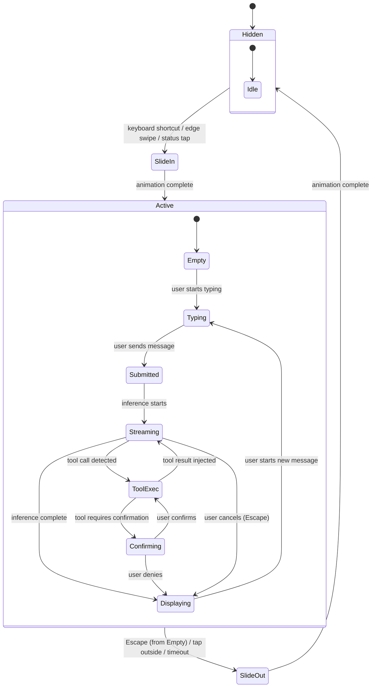

# AIOS Conversation Manager — Conversation Bar

Part of: [conversation-manager.md](../conversation-manager.md) — Conversation Manager
**Related:** [sessions.md](./sessions.md) — Session lifecycle, [tool-orchestration.md](./tool-orchestration.md) — Tool result rendering, [streaming.md](./streaming.md) — Token delivery to UI, [security.md](./security.md) — Capability enforcement

**Note:** This document is the authoritative reference for the Conversation Bar UI. The summary in [experience.md §4](../../experience/experience.md) provides a high-level overview; this document contains the full technical architecture.

-----

## 9. Conversation Bar Design

The Conversation Bar is the single most important GUI element in AIOS. It is not a search bar (like Spotlight or Krunner) and it is not a chatbot widget. It is a **natural language command interface** that can do anything the OS can do — search spaces, control agents, manage tasks, inspect provenance, and interact with system services — all through conversation.

### 9.1 Design Philosophy

**One gesture to invoke.** The Bar appears with a single action — a keyboard shortcut, an edge swipe, or a tap on the Status Strip. It never requires navigating menus or opening an application.

**Never forced.** The system never opens the Conversation Bar uninvited. Even during onboarding, it is presented as "this is here when you want it," not "you must use this." There are no mandatory tutorial conversations.

**Conversational, not form-based.** Users describe what they want in natural language. They do not fill in forms, select from dropdowns, or navigate wizard dialogs. The model interprets intent and routes to the appropriate tool or response.

**Structured output, not just text.** The Conversation Bar returns interactive visual results — object cards, task progress, capability listings, data tables — not walls of text. Every response is rendered with the appropriate component for its content type.

**Always interruptible.** The user can cancel any streaming response, dismiss the Bar mid-conversation, or switch conversations at any time. No operation locks the user into waiting.

### 9.2 Invocation and Dismissal



**Invocation methods:**

| Method | Gesture | Platform |
|---|---|---|
| Keyboard shortcut | `Super+Space` (configurable) | All |
| Edge swipe | Swipe up from bottom edge | Touch devices |
| Status Strip tap | Tap conversation indicator | All |
| Voice activation | "Hey AIOS" (opt-in, capability-gated) | Devices with microphone |
| Programmatic | Agent requests Bar open with prefilled prompt | Agents with `ConversationBarInvoke` capability |

**Dismissal:**

- **Escape** (from empty input) — slides the Bar away
- **Tap outside** — dismisses the Bar
- **Inactivity timeout** — configurable (default: 5 minutes), suspends the session
- **Escape during streaming** — cancels the response, stays in Bar

**Persistence on dismiss:** Dismissing the Bar suspends the session but does not end the conversation. Reopening the Bar resumes from where the user left off.

### 9.3 Layout and Visual Design

The Conversation Bar is a panel that slides in from the bottom (or side, user-configurable). It is not a fullscreen overlay — other windows remain visible and interactive behind it.

```text
┌──────────────────────────── Desktop ────────────────────────────┐
│                                                                  │
│    ┌─── Window A ───┐     ┌─── Window B ───┐                   │
│    │                 │     │                 │                   │
│    │                 │     │                 │                   │
│    │                 │     │                 │                   │
│    └─────────────────┘     └─────────────────┘                   │
│                                                                  │
├──────────────────────── Conversation Bar ────────────────────────┤
│  ┌─ Session: IPC Design ──────────────────── ● model-7b ─── ×  ─┤
│  │                                                               │
│  │  ┌─────────────────────────────────────────────────────────┐  │
│  │  │ You: Find my notes about the IPC design from last week  │  │
│  │  └─────────────────────────────────────────────────────────┘  │
│  │                                                               │
│  │  Found 3 objects in research/aios-notes:                      │
│  │                                                               │
│  │  ┌─ 📄 IPC Performance Analysis ────────────────────────┐    │
│  │  │  Created Tuesday · 1,200 words · tags: ipc, bench     │    │
│  │  │  "Analysis of L4 IPC patterns and how they apply..."   │    │
│  │  │  [Open]  [Send via Flow]  [Show provenance]            │    │
│  │  └────────────────────────────────────────────────────────┘    │
│  │                                                               │
│  │  ┌─ 📄 Syscall Design Draft ────────────────────────────┐    │
│  │  │  Created Monday · 800 words · tags: syscalls, kernel   │    │
│  │  │  "Minimal syscall set: IpcCall, IpcSend, IpcRecv..."   │    │
│  │  │  [Open]  [Send via Flow]  [Show provenance]            │    │
│  │  └────────────────────────────────────────────────────────┘    │
│  │                                                               │
│  ├───────────────────────────────────────────────────────────────┤
│  │  ┌──────────────────────────────────────── 🎤 ── ➤ ┐        │
│  │  │  Ask anything...                                   │        │
│  │  └────────────────────────────────────────────────────┘        │
│  └───────────────────────────────────────────────────────────────┘
└──────────────────────────────────────────────────────────────────┘
```

**Visual zones:**

1. **Session header** — conversation title (auto-generated or user-set), active model indicator, close button, session switcher
2. **Conversation thread** — scrollable history of messages and structured results. User messages right-aligned, assistant messages left-aligned.
3. **Input area** — text input field with voice toggle button and send button. Supports multiline input (Shift+Enter for newline, Enter to send).
4. **Quick actions** — contextual action buttons that appear below the last response. Actions are derived from the response content (e.g., "Open all" for search results, "Create task" for action items).

**Panel sizing:**

- **Default height:** 40% of screen height (configurable)
- **Minimum height:** 200px (enough for input + one response)
- **Maximum height:** 80% of screen height
- **Resizable:** user can drag the top edge to resize
- **Width:** full screen width (bottom panel) or 400-600px (side panel)

### 9.4 Keyboard Navigation and Accessibility

The Conversation Bar is fully accessible:

**Keyboard navigation:**

| Key | Action |
|---|---|
| `Super+Space` | Toggle Bar visibility |
| `Enter` | Send message / activate focused element |
| `Shift+Enter` | New line in input |
| `Escape` | Cancel streaming / dismiss Bar (if input empty) |
| `Tab` | Move focus: input → results → actions → input |
| `Shift+Tab` | Reverse focus order |
| `Up/Down` | Navigate conversation history / result items |
| `Ctrl+C` | Copy focused result content |
| `Ctrl+K` | Clear input, focus input field |
| `Ctrl+/` | Open session switcher |

**Screen reader support:**

- All UI elements have ARIA labels and roles
- Streaming text is announced progressively (not character-by-character — buffered into sentence-level announcements)
- Tool execution status is announced: "Using tool: search_spaces"
- Structured results are announced with type and count: "Search results: 3 documents found"
- Focus management: focus moves to new content when it appears, returns to input when interaction completes

**Visual accessibility:**

- High contrast mode: respects system-wide high contrast preference
- Reduced motion mode: disables slide animations, uses instant show/hide
- Font scaling: respects system font size preference (applies to all Bar text)
- Color: no information conveyed by color alone — icons and labels accompany all status indicators

**Voice input:**

- Voice input is a first-class alternative to typing, not an afterthought
- Activated by tapping the microphone button or pressing a configurable key (default: `Ctrl+M`)
- Voice-to-text uses AIRS inference (on-device speech recognition)
- Visual feedback: pulsing microphone icon while listening, transcribed text appears in input field
- Voice input respects the same capability gates as typed input

-----

## 10. Structured Output Rendering

The Conversation Bar renders AI responses and tool results as structured visual components, not plain text. This is the "natural language in, structured visual output" principle.

### 10.1 Output Types

Every response from the Conversation Manager is tagged with a content type. The Bar Controller maps content types to rendering components:

| Content Type | Visual Component | Interactions |
|---|---|---|
| `Text` | Markdown-rendered text block | Copy, select |
| `ObjectList` | Stacked object cards with summaries | Open, Send via Flow, Show provenance, drag to Flow Tray |
| `Table` | Sortable data table with column headers | Sort, copy row, export |
| `Code` | Syntax-highlighted code block | Copy, run (if applicable), line numbers |
| `ActionConfirmation` | Success/info card with action description | Undo (if available) |
| `Error` | Error card with red accent | Retry, show details, apply suggested fix |
| `Progress` | Animated progress bar with status text | Cancel, view details |
| `TaskCard` | Live task card with progress tracking | View, cancel, pause |
| `AgentStatus` | Agent card with capability listing | Invoke, revoke capability |
| `Chart` | Simple visualization (bar, line, pie) | Hover for values, export data |
| `ConversationList` | List of conversation summaries | Open, fork, delete |
| `CapabilityList` | Capability tokens with scope info | Revoke, attenuate |

### 10.2 Component Registry

The Bar Controller maintains a registry mapping content types to rendering components:

```rust
/// Component registry for structured output rendering
pub struct ComponentRegistry {
    /// Built-in renderers for standard content types
    builtin: HashMap<ContentType, ComponentRenderer>,
    /// Agent-registered custom renderers
    custom: HashMap<(AgentId, ContentType), ComponentRenderer>,
}

/// How a content type should be rendered
pub struct ComponentRenderer {
    /// Compositor surface type for this component
    surface_type: SurfaceType,
    /// Layout constraints
    min_height: u32,
    max_height: u32,
    /// Whether this component supports drag-to-Flow
    flow_draggable: bool,
    /// Interaction handlers
    actions: Vec<ActionDefinition>,
}

pub struct ActionDefinition {
    label: String,
    icon: Option<IconId>,
    /// Keyboard shortcut within the component
    shortcut: Option<KeyBinding>,
    /// Capability required to execute this action
    capability: Capability,
    /// Handler
    handler: ActionHandler,
}
```

**Custom renderers:** Agents can register custom content types and renderers via the Tool Manager. For example, a weather agent might register a `WeatherForecast` content type with a custom visualization component. Custom renderers run in a sandboxed compositor surface and cannot access data outside their content payload.

**Fallback:** If no renderer is registered for a content type, the Bar falls back to plain text rendering of the JSON payload. This ensures that conversations always display something, even if a custom renderer is unavailable.

### 10.3 Interactive Results

Results in the Conversation Bar are interactive surfaces, not static text:

**Object cards** — display a space object's title, creation date, word count, tags, and a text excerpt. Actions: Open (opens the object in its default viewer), Send via Flow (creates a Flow entry), Show provenance (displays the object's provenance chain). Object cards can be **dragged to the Flow Tray** to initiate a Flow transfer.

**Task cards** — display a task's title, status, progress percentage, and assigned agent. The card updates in real time as the task progresses. Actions: View (opens full task detail), Cancel (aborts the task), Pause (suspends the task). Task cards use IPC subscriptions to receive status updates from the Task Manager.

**Action buttons** — appear below the last response and offer contextual follow-up actions. "Open all" for search results, "Create task" for action items, "Fork here" for branching conversations. Action buttons execute tool calls when tapped — they are shortcuts for common conversational intents.

**Code blocks** — syntax-highlighted with language detection. Actions: Copy (copies to Flow), Run (if the code's language has a registered runtime agent). Line numbers are displayed for reference. Long code blocks are collapsible.

-----

## 11. Conversation Bar Integration

### 11.1 Compositor Integration

The Conversation Bar is a compositor surface ([compositor/protocol.md §3](../../platform/compositor/protocol.md)). It follows the standard surface lifecycle:

**Surface creation:** The Bar Controller creates a compositor surface with semantic hint `SurfaceHint::SystemPanel`. This tells the compositor to:

- Render the Bar above regular windows but below system dialogs
- Apply the system panel backdrop (translucent, blurred background)
- Reserve the Bar's screen region from window tiling
- Forward keyboard input to the Bar when it has focus

**Animation:** Slide-in and slide-out animations are driven by the compositor's frame scheduler ([compositor/rendering.md §5.5](../../platform/compositor/rendering.md)). The Bar requests animation frames and interpolates its position over 200ms (configurable, disabled in reduced-motion mode).

**Focus management:** When the Bar slides in, it captures keyboard focus. When it slides out, focus returns to the previously focused window. The compositor handles focus transfer via the standard focus protocol ([compositor/input.md §7.2](../../platform/compositor/input.md)).

**Rendering:** The Bar's content is rendered using the UI toolkit's compositor integration ([ui-toolkit.md](../../applications/ui-toolkit.md)). Text rendering uses the system font engine. Structured result components are composed of toolkit primitives (cards, tables, buttons, icons).

### 11.2 Context Engine Integration

The Conversation Bar adapts to the user's current context via the Context Engine ([context-engine.md](../context-engine.md)):

**Context-aware behavior:**

| Context Mode | Bar Adaptation |
|---|---|
| **Focus** | Minimal UI, suppress quick actions, prefer concise responses |
| **Ambient** | Full UI with quick actions and suggestions |
| **Break** | Relaxed tone, surface personal content (calendar, reminders) |
| **Sleep** | Bar auto-dismisses on inactivity timeout (shorter: 1 min) |

**Context-aware suggestions:** When the Bar opens with an empty input, it can display contextual suggestions based on the current context:

- During work context: "Continue your conversation about [recent topic]"
- After receiving a Flow entry: "Review the [content] that [agent] sent you"
- When a task is overdue: "Check on [task name] — it was due [time]"

Suggestions are generated by the Context Assembler using the current context signals. They appear as tappable chips above the input field.

**Context override via conversation:** The user can change context through the Conversation Bar: "I'm heads down for 2 hours" invokes the `set_context_override` tool, which updates the Context Engine. The Bar itself does not change context — it delegates to the tool system.

### 11.3 Multi-Conversation Management

Users can have multiple conversations. The Bar provides conversation management through the session header:

**Session switcher:** Activated by `Ctrl+/` or tapping the session title. Displays a list of recent conversations with:

- Conversation title and last message excerpt
- Last active timestamp
- Active model indicator
- Pin/unpin toggle

**New conversation:** A "New conversation" button (or `Ctrl+N`) creates a fresh conversation with the default model and no history.

**Conversation search:** The session switcher includes a search field that searches across all conversations (delegates to `SearchConversations` operation). Results show matching conversation titles and message excerpts.

**Pinned conversations:** Users can pin up to 5 conversations for quick access. Pinned conversations appear at the top of the session switcher and are never auto-archived.

**Session indicator in Status Strip:** The Status Strip ([experience.md §3](../../experience/experience.md)) shows a small indicator for the active conversation. Tapping it opens the Bar at the current conversation. The indicator shows:

- Dot: no active conversation
- Pulsing dot: conversation is streaming a response
- Badge: number of unread tool results (if Bar was dismissed during tool execution)
