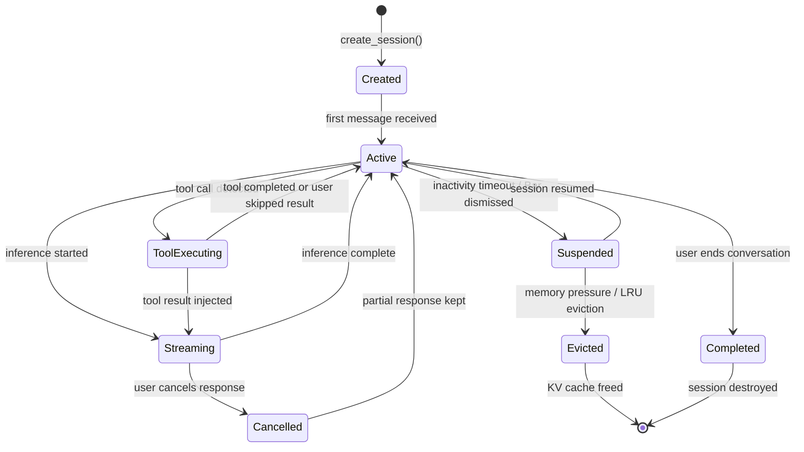

# AIOS Conversation Manager — Sessions & Persistence

Part of: [conversation-manager.md](../conversation-manager.md) — Conversation Manager
**Related:** [context-windows.md](./context-windows.md) — Context assembly and compression, [streaming.md](./streaming.md) — Token delivery, [security.md](./security.md) — Capability enforcement and audit

-----

## 3. Conversation Sessions

A conversation session is the runtime representation of an active conversation. It ties a persistent conversation record to an inference session, manages turn-by-turn interaction, and coordinates the Context Assembler, Tool Dispatcher, and Stream Multiplexer.

**Key distinction:** A *session* is in-memory and transient — it exists while the conversation is actively generating or waiting for input. A *conversation* is persistent — it lives in Space Storage and survives reboots. One conversation can have many sessions over its lifetime. Opening a conversation creates a new session. Closing the Conversation Bar suspends the session but does not end the conversation.

### 3.1 Session Lifecycle



**State definitions:**

| State | Entry Condition | Resources Held | Exit Condition |
|---|---|---|---|
| **Created** | `create_session()` called | Session struct allocated, no KV cache | First message arrives |
| **Active** | Message received or inference complete | KV cache warm (if previously used) | New message, timeout, or completion |
| **Streaming** | Inference engine generating tokens | KV cache locked, token callback active | Inference completes or is cancelled |
| **ToolExecuting** | Tool call marker detected in output | KV cache paused, tool IPC in-flight | Tool result received or timeout |
| **Suspended** | Inactivity timeout (configurable, default 5 min) | KV cache may be compressed to disk | User resumes or memory pressure evicts |
| **Evicted** | Memory pressure triggers LRU eviction | KV cache freed, conversation persisted | Session must be recreated to resume |
| **Completed** | User explicitly ends conversation | All resources released | Session destroyed |
| **Cancelled** | User cancels mid-stream | Inference aborted, partial response kept | Returns to Active |

### 3.2 Session Pool and Limits

The Session Manager maintains a bounded pool of active sessions. Pool size is constrained by:

1. **KV cache memory** — each active session consumes KV cache proportional to its context length and model size. The total KV cache pool is configured in `AirsConfig.max_model_memory`.
2. **Per-agent limits** — each agent can hold at most `max_sessions_per_agent` concurrent sessions (default: 4). The Conversation Bar counts as one session.
3. **System-wide limit** — `AirsConfig.max_concurrent_sessions` bounds total sessions (default: 16).

**Eviction policy:** When a new session request exceeds pool capacity, the Session Manager evicts sessions using a priority-weighted LRU strategy:

```rust
pub enum SessionPriority {
    /// User is actively waiting for a response
    Interactive,
    /// System service using conversation (e.g., Task Manager)
    System,
    /// Background agent conversation
    Background,
    /// Suspended session (idle, no user waiting)
    Suspended,
}
```

Eviction order: Suspended → Background → System → Interactive. Within the same priority, oldest-last-active is evicted first. Interactive sessions are never evicted while streaming.

**Session recovery after eviction:** When a user resumes a conversation whose session was evicted, the Session Manager creates a new session and replays the conversation history from Space Storage. The Context Assembler rebuilds the prompt, and the Inference Engine warms a new KV cache. This is perceptible (1-5 seconds depending on history length) but preserves the conversation seamlessly.

### 3.3 Session Routing and Model Selection

When a session is created, the Session Manager selects a model:

1. **Explicit model request** — if `SessionConfig.model` is set, use that model. Agents can request specific models for specialized tasks (e.g., a code-focused model for code conversations).

2. **Conversation continuation** — if resuming an existing conversation, use the same model that was previously active (`ConversationMetadata.models_used.last()`). This avoids the cost of re-tokenization.

3. **Model profile matching** — the Model Registry ([model-registry.md §4.3](../airs/model-registry.md)) maintains profiles mapping task types to recommended models. The Session Manager queries the profile for the conversation's inferred task type.

4. **Default model** — `AirsConfig.default_model` from the AIRS configuration.

**Model switching mid-conversation:** A conversation can switch models between turns (not mid-stream). When this happens:

- The Compression Engine re-tokenizes the conversation history with the new model's tokenizer
- If the new model's context window is smaller, additional compression may be triggered
- The Persistence Engine records the model switch in `ConversationMetadata.models_used`
- The old InferenceSession's KV cache is released; a new one is allocated

Model switching is expensive (re-tokenization + KV cache rebuild) and should be rare. Typical triggers: user explicitly requests a different model, or the system upgrades to a better model between sessions.

### 3.4 Session IPC Interface

The Conversation Manager exposes its session API via IPC channels. All operations require capability tokens ([security.md §14.2](./security.md)).

```rust
/// IPC operations for the Conversation Manager
pub enum ConversationOp {
    /// Create a new conversation and session
    CreateConversation {
        config: SessionConfig,
    },
    /// Resume an existing conversation (creates new session)
    ResumeConversation {
        conversation_id: ConversationId,
    },
    /// Send a message to the active session
    SendMessage {
        session_id: SessionId,
        content: String,
    },
    /// Cancel the current streaming response
    CancelStream {
        session_id: SessionId,
    },
    /// Suspend the session (dismiss Bar, switch away)
    SuspendSession {
        session_id: SessionId,
    },
    /// End the conversation
    EndConversation {
        conversation_id: ConversationId,
    },
    /// Fork the conversation at a specific message
    ForkConversation {
        conversation_id: ConversationId,
        fork_at: MessageId,
    },
    /// Search conversations
    SearchConversations {
        query: String,
        limit: u32,
    },
    /// Subscribe to token stream for a session
    SubscribeStream {
        session_id: SessionId,
        callback_channel: ChannelId,
    },
}
```

-----

## 4. Conversation Persistence

Every conversation is a first-class object in Space Storage. Conversations are not ephemeral chat logs — they are structured, searchable, versioned records with provenance tracking and capability-gated access.

### 4.1 Storage as Space Objects

Conversations are stored in dedicated spaces:

| Space Path | Purpose | Access |
|---|---|---|
| `user/conversations/` | User-initiated conversations (Conversation Bar) | User capabilities |
| `system/conversations/` | System service conversations (Task Manager, etc.) | System capabilities |
| `agent/<agent-id>/conversations/` | Agent-specific conversations | Agent capabilities |

Each conversation is a single space object containing the serialized conversation record. The object schema:

```rust
/// On-disk conversation format
pub struct StoredConversation {
    /// Conversation header
    header: ConversationHeader,
    /// Full message history (never truncated)
    messages: Vec<StoredMessage>,
    /// Compression snapshots (summaries of message ranges)
    compressions: Vec<CompressionSnapshot>,
    /// Fork metadata
    forks: Vec<ForkRecord>,
}

pub struct ConversationHeader {
    id: ConversationId,
    metadata: ConversationMetadata,
    /// Space where this conversation lives
    space: SpaceId,
    /// Schema version for forward compatibility
    schema_version: u32,
}

/// A snapshot of a compression event
pub struct CompressionSnapshot {
    /// Messages that were compressed
    source_messages: Vec<MessageId>,
    /// The generated summary
    summary: String,
    /// Token count of the summary vs. the originals
    original_tokens: u32,
    compressed_tokens: u32,
    /// Compression algorithm used
    algorithm: CompressionAlgorithm,
    /// When the compression occurred
    timestamp: Timestamp,
}

/// Record of a conversation fork
pub struct ForkRecord {
    /// The forked conversation
    child: ConversationId,
    /// Message where the fork occurred
    fork_point: MessageId,
    /// When the fork was created
    timestamp: Timestamp,
}
```

**Write strategy:** The Persistence Engine writes after every completed turn (user message + assistant response pair). This ensures that no conversation data is lost on crash. For long streaming responses, intermediate checkpoints are written every 30 seconds.

**Storage efficiency:** Conversations are stored as compact binary objects using the same block engine as other space objects ([spaces/block-engine.md §4](../../storage/spaces/block-engine.md)). CRC-32C integrity checks and optional AES-256-GCM encryption apply to conversation data just as they do to any other space content.

### 4.2 Search and Retrieval

Conversations are indexed by the Space Indexer ([intelligence-services.md §5.1](../airs/intelligence-services.md)) for both full-text and semantic search:

**Full-text search** — always available, even without AIRS. Searches conversation message content, titles, and metadata. Uses the same inverted index and BM25 ranking as space object search.

**Semantic search** — available when AIRS is running. The Space Indexer generates embeddings for conversation messages and indexes them in the HNSW index. Users can search by meaning: "find my conversation about scheduler design" matches conversations that discussed scheduling even if they never used the exact word "scheduler."

**Search API:**

```rust
pub struct ConversationSearchQuery {
    /// Natural language query or keywords
    query: String,
    /// Filter by space (user, system, agent)
    space_filter: Option<SpaceId>,
    /// Filter by time range
    time_range: Option<(Timestamp, Timestamp)>,
    /// Filter by model used
    model_filter: Option<ModelId>,
    /// Filter by participant agent
    agent_filter: Option<AgentId>,
    /// Maximum results to return
    limit: u32,
}

pub struct ConversationSearchResult {
    conversation_id: ConversationId,
    metadata: ConversationMetadata,
    /// Best matching message excerpt
    excerpt: String,
    /// Relevance score (0.0 - 1.0)
    relevance: f32,
}
```

### 4.3 Conversation Branching and Forking

Conversations can be forked at any point in their history. Forking creates a new conversation that shares history up to the fork point but diverges afterward.

**Use case:** "Go back to where we discussed the scheduler and try a different approach." The user selects a message in the conversation history, taps "Fork here," and a new conversation opens with the history up to that point. The original conversation is unchanged.

**Fork mechanics:**

1. User requests fork at message M in conversation C
2. Persistence Engine creates a new conversation C' with:
   - `metadata.parent = C`
   - `metadata.fork_point = M`
   - Messages up to and including M are *referenced* from C (not copied)
   - New messages in C' are independent
3. The Session Manager creates a new session for C'
4. The Context Assembler rebuilds the prompt from C' history (messages 1..M)

**Copy-on-write:** Forked conversations do not duplicate message data. They reference the parent conversation's messages up to the fork point. Only new messages after the fork are stored in the child conversation. This is space-efficient and preserves provenance — the fork relationship is explicit.

**Fork tree:** A conversation can be forked multiple times, creating a tree. Each fork is an independent conversation with its own session, but they share ancestry. The user can navigate the fork tree to explore different conversation branches.

### 4.4 Retention and Cleanup

Conversation retention is governed by space quotas and user preferences:

**Default retention policy:**

- **Recent conversations** (last 30 days) — kept in full, immediately accessible
- **Older conversations** — metadata and summaries retained; full message history compressed and archived
- **Archived conversations** — stored in cold storage tier; retrievable but not instantly searchable
- **Deleted conversations** — permanently removed on user request (hard delete, not soft delete)

**Automatic cleanup triggers:**

- Space quota exceeded → oldest archived conversations are deleted first
- User-initiated bulk delete → "delete all conversations older than 6 months"
- Agent uninstallation → agent's system conversations are deleted; user conversations involving the agent are retained (they belong to the user, not the agent)

**Privacy guarantees:**

- Conversation deletion is permanent — no recovery after delete
- Deleted conversations are scrubbed from all indexes (full-text and semantic)
- Compression snapshots are deleted with their source conversations
- Fork children survive parent deletion (they contain references, not the actual data — orphaned references are resolved to stored copies during the delete process)
