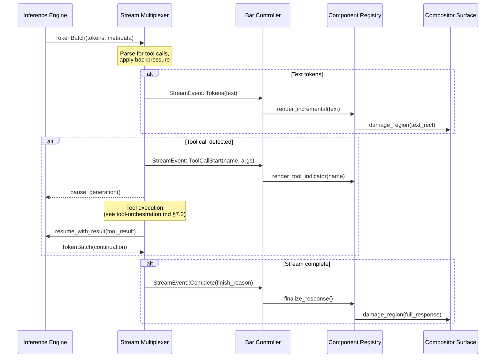

# AIOS Conversation Manager — Streaming

Part of: [conversation-manager.md](../conversation-manager.md) — Conversation Manager
**Related:** [sessions.md](./sessions.md) — Session lifecycle and KV cache, [tool-orchestration.md](./tool-orchestration.md) — Mid-stream tool detection, [conversation-bar.md](./conversation-bar.md) — Token rendering in UI, [security.md](./security.md) — Stream integrity

-----

## 12. Streaming Token Delivery

Streaming is the mechanism by which the model's output reaches the user in real time. Tokens are delivered one at a time (or in small batches) as the Inference Engine generates them, rather than waiting for the entire response to complete. This is not a performance optimization — it is a fundamental interaction design choice. Streaming makes the AI feel responsive and conversational, even when the model takes seconds to generate a full response.

**Design principle:** Streaming is the only output mode. There is no "batch response" path. Every model response, whether destined for the Conversation Bar, an agent, or a system service, flows through the same streaming pipeline. This eliminates an entire class of bugs where batch and streaming paths diverge.

### 12.1 Streaming Architecture

The streaming pipeline has four stages: generation, multiplexing, delivery, and rendering.



**Stage 1 — Generation.** The Inference Engine ([inference.md §3](../airs/inference.md)) generates tokens using the active model. Tokens are emitted in batches (typically 1-8 tokens per batch, depending on model and hardware). Each batch includes metadata: token IDs, decoded text, and generation statistics (tokens/second, KV cache utilization).

**Stage 2 — Multiplexing.** The Stream Multiplexer receives token batches from the Inference Engine and routes them to subscribers. It performs three critical functions:

- **Tool call detection** — scans the token stream for structured tool call markers (see §12.4)
- **Backpressure management** — monitors subscriber consumption rates and applies backpressure to the Inference Engine if subscribers fall behind (see §12.2)
- **Fan-out** — delivers tokens to multiple subscribers (the Conversation Bar, the Persistence Engine for storage, and any IPC subscribers)

**Stage 3 — Delivery.** Stream events are delivered to subscribers via typed callbacks:

```rust
/// Events emitted by the Stream Multiplexer
pub enum StreamEvent {
    /// New tokens generated
    Tokens {
        text: String,
        token_count: u32,
        /// Cumulative tokens generated so far in this response
        total_tokens: u32,
    },
    /// Tool call detected in the stream
    ToolCallStart {
        tool_name: String,
        arguments_json: String,
    },
    /// Tool execution completed, generation resuming
    ToolCallComplete {
        tool_name: String,
        result_type: ContentType,
    },
    /// Generation complete
    Complete {
        finish_reason: FinishReason,
        total_tokens: u32,
        generation_time_ms: u64,
    },
    /// Generation cancelled by user
    Cancelled {
        partial_tokens: u32,
    },
    /// Error during generation
    Error {
        message: String,
        recoverable: bool,
    },
}

pub enum FinishReason {
    /// Model reached natural end of response
    Stop,
    /// Response hit max_response_tokens limit
    Length,
    /// Tool call requires execution before continuing
    ToolCall,
    /// Content safety filter triggered
    ContentFilter,
}

/// Subscriber callback for stream events
pub trait StreamSubscriber: Send {
    fn on_event(&mut self, event: StreamEvent);
    /// How many tokens this subscriber can buffer
    fn buffer_capacity(&self) -> u32;
    /// How many tokens are currently buffered (unconsumed)
    fn buffered_count(&self) -> u32;
}
```

**Stage 4 — Rendering.** The Bar Controller receives stream events and renders them incrementally in the Conversation Bar. Text tokens are appended to the current response block. Tool call events trigger visual indicators. Completion events finalize the response layout and enable interaction buttons.

### 12.2 Backpressure and Flow Control

The Inference Engine generates tokens faster than the UI can render them (especially on high-end hardware with small models). Without flow control, token buffers grow unboundedly, consuming memory and introducing latency between generation and display.

**Backpressure mechanism:**

```rust
pub struct BackpressureConfig {
    /// Per-subscriber buffer capacity (tokens)
    subscriber_buffer: u32,
    /// High-water mark: pause generation when buffer reaches this fraction
    high_water_mark: f32,
    /// Low-water mark: resume generation when buffer drops below this fraction
    low_water_mark: f32,
    /// Maximum time to wait for subscriber consumption before dropping tokens
    drop_timeout_ms: u32,
}
```

**Default configuration:**

| Parameter | Value | Rationale |
|---|---|---|
| `subscriber_buffer` | 256 tokens | ~1 second of output at typical generation speed |
| `high_water_mark` | 0.75 (192 tokens) | Pause early to avoid overflow |
| `low_water_mark` | 0.25 (64 tokens) | Resume with headroom |
| `drop_timeout_ms` | 5000 | 5 seconds before concluding subscriber is stuck |

**Flow control states:**

1. **Flowing** — Inference Engine generates freely; subscribers consume tokens as they arrive
2. **Pressured** — a subscriber's buffer exceeds `high_water_mark`; the Multiplexer signals the Inference Engine to pause after the current batch
3. **Resumed** — all subscriber buffers drop below `low_water_mark`; the Multiplexer signals the Inference Engine to continue
4. **Dropping** — a subscriber has been above `high_water_mark` for longer than `drop_timeout_ms`; the Multiplexer unsubscribes it and continues generation for remaining subscribers

**Inference Engine pause mechanism:** The Inference Engine checks a pause flag between token batches. When paused, it stops generating but keeps the KV cache warm. This is a cooperative pause — the Engine finishes the current batch before checking the flag. Typical pause latency is <10ms.

**Per-subscriber independence:** Backpressure is per-subscriber. A slow Conversation Bar does not block the Persistence Engine from recording tokens. The Multiplexer tracks each subscriber's buffer independently.

### 12.3 Cancellation and Partial Responses

Users can cancel a streaming response at any time by pressing Escape or tapping the cancel button. Cancellation is immediate — the user should not wait for the current sentence to complete.

**Cancellation pipeline:**

1. User presses Escape → Bar Controller sends `CancelStream` to Session Manager
2. Session Manager sets the session state to `Cancelled`
3. Stream Multiplexer sends `StreamEvent::Cancelled` to all subscribers
4. Inference Engine aborts generation (drops the current decode loop, but preserves KV cache)
5. Persistence Engine stores the partial response with a `cancelled: true` flag
6. Bar Controller displays the partial response with a visual indicator (faded last line, "Response cancelled" label)

**Partial response handling:**

- The partial response is kept in the conversation history. It is not deleted.
- The model sees the partial response in the next turn's context (it was part of the conversation).
- The user can ask the model to continue from where it left off, or take a different direction.
- If the partial response ends mid-tool-call (tool call markers detected but arguments incomplete), the tool call is discarded and the partial text before the tool call is kept.

**Cancellation during tool execution:** If the user cancels while a tool is executing (state: `ToolExecuting`), the tool execution is not aborted (it may have side effects). Instead:

1. The tool result is received but not injected into the prompt
2. The model does not continue generation
3. The tool result is shown to the user in the Conversation Bar with a "Cancelled after tool execution" label
4. The next user message starts a fresh generation turn

### 12.4 Mid-Stream Tool Call Detection

The model embeds tool calls as structured JSON in its token output. The Stream Multiplexer must detect these tool calls incrementally — it cannot wait for the entire response to parse.

**Tool call format:**

```text
Here is what I found in your notes about IPC:

<tool_call>
{"name": "search_spaces", "arguments": {"query": "IPC design", "limit": 5}}
</tool_call>

Based on the search results...
```

**Incremental parsing strategy:**

The Stream Multiplexer maintains a state machine that tracks whether the current token stream is inside a tool call block:

```rust
pub enum ToolParseState {
    /// Normal text output — pass through to subscribers
    Text,
    /// Detected opening marker, accumulating tag
    OpeningTag {
        accumulated: String,
    },
    /// Inside tool call body, accumulating JSON
    InsideToolCall {
        json_buffer: String,
        /// Nesting depth for JSON objects (handles nested braces)
        brace_depth: u32,
    },
    /// Detected closing marker, validating
    ClosingTag {
        accumulated: String,
    },
}
```

**Parsing rules:**

1. **Opening detection** — when the token stream contains `<tool_call>`, the parser transitions from `Text` to `InsideToolCall`. Partial matches (`<tool` at the end of a batch) are buffered in `OpeningTag` until the next batch confirms or denies the match.

2. **JSON accumulation** — inside a tool call, tokens are accumulated into `json_buffer` rather than delivered to subscribers. The parser tracks brace depth to handle nested JSON objects.

3. **Closing detection** — when `</tool_call>` is detected, the parser validates the accumulated JSON against the tool schema, then emits a `ToolCallStart` event to subscribers.

4. **Error recovery** — if the accumulated JSON is malformed (the model generated invalid JSON), the parser emits the raw text as `StreamEvent::Tokens` and returns to `Text` state. The malformed tool call is logged but does not crash the stream.

**Latency impact:** Tool call detection adds <1ms of latency per token batch (string scanning). For partial matches at batch boundaries, tokens are buffered for at most one additional batch (typically <50ms). This latency is imperceptible to the user.

**Parallel tool calls:** The model may emit multiple tool calls in a single response. The parser handles this by returning to `Text` state after each `</tool_call>` and continuing to scan for additional tool calls.

### 12.5 Stream Persistence

Every token delivered through the streaming pipeline is persisted by the Persistence Engine. This ensures that no conversation data is lost, even if the system crashes mid-stream.

**Persistence strategy:**

- **Incremental writes** — the Persistence Engine accumulates tokens into a buffer and writes to Space Storage every 30 seconds or when the buffer reaches 4096 tokens, whichever comes first
- **Completion write** — when the stream completes (or is cancelled), the full response is written as a `StoredMessage` with accurate `token_count`
- **Crash recovery** — if the system crashes mid-stream, the incremental writes ensure that most of the response is recoverable. The response is marked as `incomplete` and the user sees a notification on next session resume

**Token counting during streaming:** Token counts are tracked by the Stream Multiplexer as tokens flow through. The final `StoredMessage.token_count` is exact — it comes from the Inference Engine's output, not from re-tokenizing the text.

-----

## 13. AI-Native Streaming Intelligence

The following streaming improvements leverage AIRS intelligence services to enhance the streaming experience beyond simple token delivery.

### 13.1 Predictive Context Prefetch

**Classification:** AIRS-dependent (requires semantic understanding of conversation trajectory).

Instead of waiting for the user to send a message before assembling context, the Context Assembler can predict what context will be needed based on the conversation trajectory.

**Mechanism:**

1. While the user is typing (keystrokes arrive at the Bar Controller), the Context Engine analyzes the partial input for topic signals
2. The Space Indexer begins pre-fetching likely relevant space objects based on the predicted topic
3. When the user sends the message, the Context Assembler uses pre-fetched results instead of performing a fresh retrieval query
4. If the prediction was wrong, the assembler falls back to normal retrieval (pre-fetched results are discarded)

**Prediction sources:**

| Signal | Weight | Example |
|---|---|---|
| Current conversation topic | 0.4 | Conversation about IPC → pre-fetch IPC-related objects |
| User's typing pattern | 0.2 | Typing "scheduler" → pre-fetch scheduler notes |
| Recent tool results | 0.2 | Just searched for files → pre-fetch related objects |
| Time-of-day patterns | 0.1 | Morning routine → pre-fetch calendar and tasks |
| Active context mode | 0.1 | Focus mode → pre-fetch work-related objects |

**Latency benefit:** Typical retrieval takes 50-200ms. Predictive prefetch eliminates this latency entirely when predictions are correct (expected hit rate: 60-70% for routine conversations).

**Privacy constraint:** Predictive prefetch only operates on the user's own space objects. It does not fetch content from other users or external sources. Prefetch queries are not logged to the audit trail (they are speculative, not user-initiated).

### 13.2 Adaptive Token Delivery Rate

**Classification:** AIRS-dependent (requires content-type classification).

Not all tokens should be delivered at the same rate. Code blocks benefit from appearing all at once (the user wants to read complete lines), while conversational text benefits from word-by-word streaming (it feels more natural).

**Content-aware delivery:**

| Content Type | Delivery Strategy | Rationale |
|---|---|---|
| Conversational text | Word-by-word (1-3 tokens/batch) | Natural reading pace, feels responsive |
| Code blocks | Line-by-line (buffer until newline) | Users read code by line, not by character |
| Markdown headings | Instant (buffer until end of heading) | Headings are structural; partial headings are confusing |
| Lists | Item-by-item (buffer until list item complete) | Partial list items are confusing |
| Tool call results | Instant (render complete result) | Results are atomic; partial results are misleading |
| Thinking/reasoning | Paragraph-by-paragraph | Users skim reasoning; word-by-word is too slow |

**Content type detection:** The Stream Multiplexer uses a lightweight state machine that tracks markdown context (inside code block, inside heading, inside list). When AIRS is available, a more sophisticated classifier identifies content type from the token sequence, enabling better buffering decisions.

**Fallback (no AIRS):** Without AIRS, the Stream Multiplexer delivers tokens as they arrive (no content-aware batching). The user experience is still good — this optimization is a refinement, not a requirement.

### 13.3 Conversation Quality Metrics

**Classification:** AIRS-dependent (requires semantic evaluation).

The Conversation Manager tracks quality metrics for every conversation turn. These metrics inform compression decisions, model selection, and user experience improvements.

**Per-turn metrics:**

```rust
pub struct TurnQualityMetrics {
    /// Was the user's question answered? (semantic match score)
    answer_relevance: f32,
    /// Did the model use tools appropriately? (tool invocation accuracy)
    tool_appropriateness: f32,
    /// Was the response concise? (information density)
    conciseness: f32,
    /// Did the response follow up on prior context? (context utilization)
    context_utilization: f32,
    /// Generation speed (tokens per second)
    generation_speed: f32,
    /// Time to first token (milliseconds)
    time_to_first_token: u32,
    /// Total response time (milliseconds)
    total_response_time: u32,
}
```

**Metric collection:**

- `answer_relevance` — computed by embedding the question and response and measuring cosine similarity. Low scores trigger a follow-up suggestion: "Did that answer your question?"
- `tool_appropriateness` — tracks whether the model called tools when it should have (missed opportunity) or called tools when it shouldn't have (unnecessary invocation)
- `conciseness` — ratio of information-bearing tokens to total tokens. High-quality responses have high information density.
- `context_utilization` — measures how much of the injected context the model actually referenced in its response. Low utilization suggests the retrieval pipeline is injecting irrelevant context.
- `generation_speed`, `time_to_first_token`, `total_response_time` — performance metrics tracked per turn

**Metric consumers:**

- **Compression Engine** — uses `context_utilization` to decide which context objects to keep vs. compress. Low-utilization objects are compressed more aggressively.
- **Model Registry** — aggregates `answer_relevance` across turns to evaluate model quality. Persistent low scores trigger a model quality alert.
- **Inspector** — displays per-conversation quality trends. Users can see if their conversations are getting better or worse over time.

### 13.4 Streaming-Aware Compression

**Classification:** AIRS-dependent (requires content analysis during streaming).

Standard compression (§6) operates on completed messages. Streaming-aware compression can begin during token generation, reducing the latency of subsequent turns.

**Mechanism:**

1. As the model generates tokens, the Compression Engine analyzes the growing response for key information
2. Important sentences (entities, decisions, action items) are flagged in real time
3. When compression is triggered on the next turn, the pre-analyzed response can be compressed immediately without a full re-read
4. For very long responses (>2000 tokens), streaming compression begins compressing the early portion while the model is still generating the later portion

**Benefit:** Reduces compression latency by 30-50% for long responses, keeping the next turn's context assembly fast.

### 13.5 Speculative KV Cache Warming

**Classification:** Kernel-internal (statistical, no AIRS dependency).

The KV cache is the most expensive resource to rebuild. When a user resumes a suspended session, the Inference Engine must re-process the entire conversation history to warm the KV cache, adding 1-5 seconds of latency.

**Speculative warming:**

1. The Session Manager tracks user activity patterns (when they typically resume conversations)
2. Before the user explicitly resumes, the Inference Engine speculatively warms the KV cache for the most likely session
3. If the prediction is correct, session resume is instant (KV cache already warm)
4. If wrong, the speculatively warmed cache is evicted with no user-visible impact

**Prediction model:** A simple decision tree trained on session resume patterns:

- Time since last interaction
- Time of day
- Number of pending tool results
- Whether the session was dismissed or timed out

**Resource constraint:** Speculative warming only occurs when the system has idle compute and memory. It never competes with active sessions for KV cache space.

### 13.6 Voice-Aware Streaming

**Classification:** AIRS-dependent (requires speech synthesis integration).

When the user is consuming responses via voice output (accessibility mode or voice-first interaction), the streaming pipeline adapts:

- **Sentence buffering** — tokens are buffered until a complete sentence is formed, then delivered to the speech synthesizer. Partial sentences produce unnatural speech.
- **Prosody hints** — the Stream Multiplexer annotates sentence boundaries with prosody information (question mark → rising intonation, exclamation → emphasis, list items → consistent pace)
- **Interruption handling** — if the user speaks while the model is streaming, the stream is paused (not cancelled). The user's speech is transcribed and queued as the next message. When the model finishes the current response, it processes the user's interruption.
- **Speed matching** — generation speed is throttled to match speech synthesis speed. There is no benefit to generating tokens faster than they can be spoken. This saves compute and reduces power consumption.

-----

## Future Directions: Advanced Streaming

### Structured Streaming Protocol

Replace the current text-based tool call markers (`<tool_call>`) with a structured binary protocol that separates content channels:

- **Text channel** — UTF-8 text for the response body
- **Control channel** — binary-encoded tool calls, metadata updates, and quality signals
- **Media channel** — inline images, audio clips, or other non-text content

This eliminates the need for incremental text parsing of tool calls and enables richer content types in streaming responses.

Classification: **Infrastructure improvement** (no AIRS dependency).

### Multi-Model Streaming

Allow a single response to be generated by multiple models in sequence:

- A fast, small model generates the initial response quickly (low time-to-first-token)
- A larger, more capable model reviews and revises the response in a second pass
- The user sees the fast response immediately, with refinements streamed as corrections

This provides the responsiveness of a small model with the quality of a large model.

Classification: **AIRS-dependent** (requires model coordination and quality comparison).

### Collaborative Streaming

Multiple agents contribute to a single streaming response:

- Agent A generates the main text while Agent B searches for supporting evidence
- Evidence is injected into the stream as footnotes or inline references
- The user sees a coherent response with real-time fact-checking

Classification: **AIRS-dependent** (requires multi-agent coordination).
