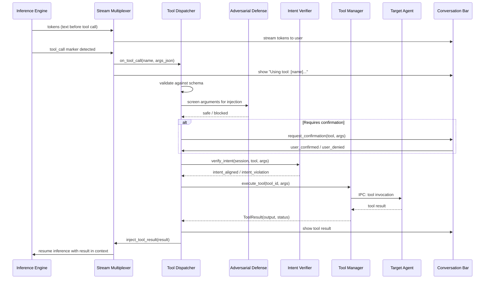

# AIOS Conversation Manager — Tool Orchestration

Part of: [conversation-manager.md](../conversation-manager.md) — Conversation Manager
**Related:** [sessions.md](./sessions.md) — Session lifecycle, [streaming.md](./streaming.md) — Token delivery and mid-stream tool detection, [security.md](./security.md) — Capability enforcement for tools

-----

## 7. Tool Use Within Conversations

Tool use is the mechanism by which conversations interact with the operating system. When the model generates a tool call, the Conversation Manager intercepts it, validates it, routes it to the appropriate agent via the Tool Manager, and injects the result back into the conversation. Tool use transforms the Conversation Bar from a text interface into a system command interface.

**Principle:** Tools are transparent. The user always sees what tool was called, what arguments were passed, and what result was returned. There are no hidden tool calls. This is a trust-building mechanism — the user understands what the system is doing on their behalf.

### 7.1 Tool Discovery and Registration

The Tool Dispatcher discovers available tools from the Tool Manager ([intelligence-services.md §5.7](../airs/intelligence-services.md)). At session creation time, the Tool Dispatcher queries the Tool Manager for all tools the session's agent has capability tokens to invoke.

```rust
/// Tool schema for prompt injection
pub struct ConversationTool {
    id: ToolId,
    name: String,
    description: String,
    parameters: ToolParameterSchema,
    /// Whether this tool requires user confirmation before execution
    requires_confirmation: bool,
    /// Estimated execution time category
    latency_class: ToolLatencyClass,
}

pub enum ToolLatencyClass {
    /// < 100ms — space queries, status checks
    Instant,
    /// 100ms - 5s — agent operations, system control
    Fast,
    /// 5s - 60s — complex computations, file operations
    Slow,
    /// > 60s — long-running tasks (spawned as background task)
    Background,
}
```

**Tool schema injection:** Available tools are formatted as capability declarations in the system prompt. The Context Assembler allocates a fixed token budget for tool schemas (configurable, default: 1024 tokens — see [context-windows.md §5.1](./context-windows.md)). If the total tool schema exceeds this budget, tools are prioritized by:

1. **Recently used** — tools the user has invoked in this conversation
2. **Contextually relevant** — tools matching the conversation topic (inferred by the Context Engine)
3. **Alphabetical** — deterministic fallback ordering

Tools excluded from the prompt are not available for that turn. The model cannot call tools it cannot see.

### 7.2 Tool Invocation Flow

When the model generates a tool call during token streaming:



**Step-by-step flow:**

1. **Detection** — the Stream Multiplexer detects a tool call marker in the model's output. Tool calls use a structured JSON format embedded in the token stream. See [streaming.md §12.4](./streaming.md) for incremental parsing details.

2. **Schema validation** — the Tool Dispatcher validates the tool call against the registered schema. Malformed calls (wrong parameter types, missing required fields) are rejected and the model is informed of the error.

3. **Adversarial screening** — the Adversarial Defense service screens the tool arguments for injection attempts. If the arguments contain patterns that could be adversarial (e.g., a "filename" parameter containing shell commands), the call is blocked.

4. **Confirmation gate** — if the tool is marked `requires_confirmation`, the user is prompted in the Conversation Bar. The user sees the tool name, arguments, and a description of what the tool will do. They can confirm or deny.

5. **Intent verification** — the Intent Verifier checks that the tool call aligns with the conversation's declared purpose. An agent that declared intent "research" should not be calling `delete_object`.

6. **Execution** — the Tool Manager routes the call to the agent that registered the tool. Execution happens via IPC with a timeout (configurable, default: 30 seconds for Fast tools, 300 seconds for Slow tools).

7. **Result injection** — the tool result is formatted as a Tool-role message and injected into the conversation context. The Inference Engine resumes generation with the updated context.

8. **Display** — the Conversation Bar displays the tool result as a structured output component (see [conversation-bar.md §10](./conversation-bar.md)).

**Error handling:**

| Error | Behavior |
|---|---|
| Schema validation failure | Inject error message as Tool result; model can retry |
| Adversarial screening blocked | Inject "blocked for safety" message; log to audit |
| User denied confirmation | Inject "user declined" message; model can suggest alternative |
| Intent verification failed | Inject "action not permitted" message; log violation |
| Tool execution timeout | Inject "tool timed out" message; offer retry option |
| Tool execution error | Inject error description; model can adapt approach |
| Tool agent crashed | Inject "tool unavailable" message; suggest alternative |

### 7.3 Multi-Step Tool Chains

The model can invoke multiple tools across multiple turns to accomplish complex tasks. The Conversation Manager supports four patterns:

**Sequential chains** — tool A result feeds into tool B call. The model sees tool A's result and decides to call tool B with information from it.

```text
User: "Summarize the IPC design notes and email them to Alex"
Turn 1: Model calls search_spaces(query: "IPC design notes") → returns 3 objects
Turn 2: Model calls read_object(object_id: obj_1) → returns full content
Turn 3: Model generates summary
Turn 4: Model calls flow_send(content: summary, destination: "alex/inbox") → confirms delivery
```

*Note: Tool call examples use shorthand notation. Actual wire format is `{"name": "<tool>", "arguments": {…}}` as described in [streaming.md §12.4](./streaming.md).*

**Parallel invocations** — the model requests multiple independent tools simultaneously. The Tool Dispatcher detects multiple tool calls in the same response and executes them concurrently.

```text
User: "What's the weather and what's on my schedule today?"
Turn 1: Model calls [get_weather(), get_schedule(today)] → both execute in parallel
Turn 2: Model synthesizes both results into a single response
```

**Iterative refinement** — the model calls the same tool with adjusted parameters based on previous results.

```text
User: "Find my notes about transformers"
Turn 1: Model calls search_spaces("transformers") → too many results
Turn 2: Model calls search_spaces("transformer architecture attention mechanism") → refined results
Turn 3: Model presents refined results to user
```

**Agentic loops** — the model autonomously chains multiple tool calls to accomplish a goal. The user initiates the task and the model plans and executes multiple steps.

```text
User: "Organize my research notes into categories"
Turn 1: Model calls list_space(space: "research/") → sees all objects
Turn 2: Model calls read_object(object_id: obj_1) → determines category
Turn 3: Model calls create_space(parent: "research/", name: "ml-papers") → creates category
Turn 4: Model calls move_object(object_id: obj_1, destination: "research/ml-papers/") → moves object
... (continues for each object)
```

**Chain depth limit:** The maximum number of tool calls per user message is configurable (default: 10). This prevents infinite loops where the model keeps calling tools without producing a response. When the limit is reached, the model is forced to generate a text response summarizing progress and asking the user how to proceed.

**Cost tracking:** Each tool call's token cost (for the result injection) is tracked in the session's token budget. Long tool chains can consume significant context window space, triggering compression of earlier messages.

### 7.4 Tool Result Rendering

Tool results are not raw text. The Tool Dispatcher tags results with content types that the Conversation Bar renders as structured visual components:

```rust
/// Typed tool result for structured rendering
pub enum ToolResultContent {
    /// Plain text response
    Text(String),
    /// List of space objects with metadata
    ObjectList(Vec<ObjectSummary>),
    /// Structured data table
    Table {
        headers: Vec<String>,
        rows: Vec<Vec<String>>,
    },
    /// Code with language annotation
    Code {
        language: String,
        content: String,
    },
    /// Confirmation of an action taken
    ActionConfirmation {
        action: String,
        details: String,
        undo_available: bool,
    },
    /// Error with suggested fix
    Error {
        message: String,
        suggestion: Option<String>,
    },
    /// Progress indicator for long-running tools
    Progress {
        percent: u8,
        status: String,
    },
}
```

`ToolResultContent` covers the common return types from built-in tools. The Conversation Bar's `ContentType` registry ([conversation-bar.md §10.1](./conversation-bar.md)) extends this with additional UI-specific types (`TaskCard`, `AgentStatus`, `Chart`, etc.) that are rendered by the ComponentRegistry but not returned directly from tool execution. Tool results are mapped to the appropriate `ContentType` at the rendering layer.

-----

## 8. Built-in Conversation Tools

The Conversation Manager registers a set of built-in tools that are available in every conversation session (subject to capability checks). These tools provide direct access to OS functionality without requiring a separate agent.

### 8.1 Space Operations

Tools for interacting with Space Storage:

| Tool | Parameters | Description | Capability Required |
|---|---|---|---|
| `search_spaces` | `query: String, filters: SearchFilters` | Semantic + full-text search across spaces | `SpaceRead` |
| `read_object` | `object_id: ObjectId` | Read full object content | `SpaceRead` |
| `create_object` | `space: SpaceId, name: String, content: String` | Create new space object | `SpaceWrite` |
| `move_object` | `object_id: ObjectId, destination: SpaceId` | Move object between spaces | `SpaceWrite` |
| `delete_object` | `object_id: ObjectId` | Delete an object (requires confirmation) | `SpaceDelete` |
| `list_space` | `space: SpaceId, filters: ListFilters` | List objects in a space | `SpaceRead` |
| `show_provenance` | `object_id: ObjectId` | Show object's provenance chain | `SpaceRead` |
| `create_space` | `parent: SpaceId, name: String` | Create a new space | `SpaceCreate` |

**Search filters:**

```rust
pub struct SearchFilters {
    /// Restrict to specific space
    space: Option<SpaceId>,
    /// Restrict to content type
    content_type: Option<ContentType>,
    /// Time range filter
    created_after: Option<Timestamp>,
    created_before: Option<Timestamp>,
    /// Tag filter
    tags: Option<Vec<String>>,
    /// Maximum results
    limit: u32,
}
```

### 8.2 System Control

Tools for controlling OS behavior:

| Tool | Parameters | Description | Capability Required |
|---|---|---|---|
| `set_context_override` | `mode: ContextMode, duration: Duration` | Override context (e.g., "heads down for 2 hours") | `ContextOverride` |
| `get_context` | — | Get current context state | `ContextRead` |
| `audio_control` | `action: AudioAction` | Play/pause/volume/next/prev | `AudioControl` |
| `get_system_status` | — | CPU, memory, battery, network summary | `SystemRead` |
| `task_create` | `description: String, priority: TaskPriority` | Create a task via Task Manager | `TaskCreate` |
| `task_list` | `filter: TaskFilter` | List active tasks | `TaskRead` |
| `task_complete` | `task_id: TaskId` | Mark a task complete | `TaskWrite` |
| `agent_status` | `agent_id: Option<AgentId>` | Query agent state (all or specific) | `AgentRead` |
| `agent_invoke` | `agent_id: AgentId, message: String` | Send message to an agent | `AgentInvoke` |
| `set_preference` | `key: String, value: String` | Set a user preference | `PreferenceWrite` |

**Confirmation-required tools:** `delete_object`, `set_context_override` (for durations > 1 hour), `agent_invoke` (for agents the user hasn't interacted with before).

### 8.3 Flow Integration

Tools for interacting with the Flow data exchange system ([flow.md](../../storage/flow.md)):

| Tool | Parameters | Description | Capability Required |
|---|---|---|---|
| `flow_send` | `content: FlowContent, destination: FlowTarget` | Send content via Flow | `FlowWrite` |
| `flow_history` | `query: String, limit: u32` | Search Flow transfer history | `FlowRead` |
| `flow_receive` | `filter: FlowFilter` | Check for pending Flow deliveries | `FlowRead` |
| `flow_transform` | `content: FlowContent, target_type: ContentType` | Transform content between formats | `FlowWrite` |

**Flow integration pattern:** When the user says "send this to Alex's shared space," the model calls `flow_send` with the current conversation context or tool result as content. Flow handles the transfer, provenance tracking, and capability verification.

**Drag-and-drop from conversation:** Tool results displayed in the Conversation Bar can be dragged to the Flow Tray. This creates a Flow entry with the conversation as the source and full provenance tracking.
