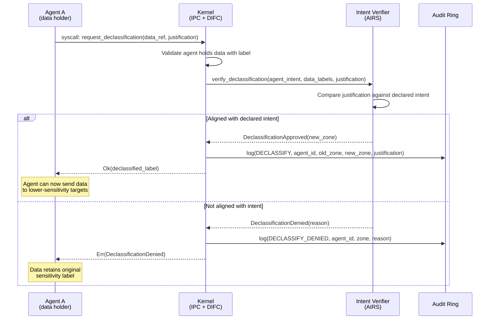

# AIOS Intent Verifier — Information Flow Verification

Part of: [intent-verifier.md](../intent-verifier.md) — Intent Verifier Architecture
**Related:** [pipeline.md](./pipeline.md) — Verification Pipeline, [behavioral.md](./behavioral.md) — Behavioral Integration, [IPC](../../kernel/ipc.md) — IPC Architecture

---

## §5 Information Flow Verification

AIOS defines five security zones (Core, Personal, Collaborative, Untrusted, Ephemeral) and enforces access to spaces via capabilities. Currently, IPC messages carry sender and receiver agent IDs but not data provenance labels. This means that if Agent A reads from a Personal-zone space and sends the data via IPC to Agent B (which holds a Network capability), the kernel cannot detect that Personal data is about to be exfiltrated through the network.

Capability enforcement answers "is this agent allowed to perform this action?" at the point of each individual action. It does not answer "should data that originated from space X reach output channel Y?" across a chain of actions spanning multiple agents. The gap is transitive: each hop in a multi-agent pipeline is individually authorized, yet the end-to-end flow violates the user's security expectations.

This section introduces IPC Taint Labels based on Decentralized Information Flow Control (DIFC) to close that gap. The design draws on research from Flume (SOSP 2007), HiStar (OSDI 2006), CamFlow (SoCC 2017), and TaintDroid (OSDI 2010), adapted to AIOS's capability-based architecture and no\_std kernel environment.

---

### §5.1 IPC Taint Labels (DIFC)

Every IPC message carries a `LabelSet` that records the security provenance of the data it contains. Labels propagate automatically through reads, writes, and IPC transfers. The kernel enforces flow constraints at IPC delivery time without requiring application cooperation.

#### Core Data Structures

```rust
/// An IPC message annotated with security provenance labels.
pub struct LabeledMessage {
    /// Original IPC message (272 bytes, inline payload).
    raw: RawMessage,
    /// Security labels inherited from data sources.
    labels: LabelSet,
}

/// Compact security label set attached to data flows.
///
/// Fits in 40 bytes: zone(1) + source_count(1) + sources(4*16=64)
/// + declassified(1) + integrity(1) = 68 bytes total.
/// Designed for inline storage alongside RawMessage without
/// requiring heap allocation.
pub struct LabelSet {
    /// Security zone of data origin (highest sensitivity encountered).
    zone: SecurityZone,
    /// Spaces the data originated from (compact, max 4).
    /// Tracks provenance for audit trail reconstruction.
    source_spaces: [SpaceId; 4],
    /// Number of valid entries in source_spaces (0..=4).
    source_count: u8,
    /// Whether data has passed through an approved declassification gate.
    declassified: bool,
    /// Integrity level: 1 = untrusted external input, 5 = kernel-verified.
    /// Data from Untrusted zone starts at 1; kernel-generated data starts at 5.
    integrity: u8,
}

/// Security zones as defined in shared/src/storage.rs.
/// Ordered by sensitivity for lattice comparison.
///
/// The sensitivity ordering is:
///   Core (highest) > Personal > Collaborative > Ephemeral > Untrusted (lowest)
pub enum SecurityZone {
    Core,          // Kernel data, system configuration
    Personal,      // User's private data (emails, photos, credentials)
    Collaborative, // Data shared between agents with explicit grants
    Untrusted,     // External/unverified data
    Ephemeral,     // Temporary data with automatic expiry
}
```

The `SecurityZone` enum matches the existing definition in `shared/src/storage.rs` (`Core = 0`, `Personal = 1`, `Collaborative = 2`, `Untrusted = 3`, `Ephemeral = 4`). The sensitivity ordering for DIFC purposes differs from the discriminant ordering: Core and Personal are high-sensitivity; Collaborative and Ephemeral are medium; Untrusted is low.

```rust
impl SecurityZone {
    /// Returns the sensitivity level for lattice comparison.
    /// Higher values indicate more sensitive data.
    pub fn sensitivity(&self) -> u8 {
        match self {
            SecurityZone::Core => 5,
            SecurityZone::Personal => 4,
            SecurityZone::Collaborative => 3,
            SecurityZone::Ephemeral => 2,
            SecurityZone::Untrusted => 1,
        }
    }
}
```

#### Label Propagation Rules

Labels flow through the system according to five rules:

1. **Acquisition on read.** When an agent reads from a space, its process-level label set acquires the space's zone label. If the agent already carries a label, the result is the join (maximum sensitivity) of the existing label and the new one.

2. **Inheritance on IPC send.** When an agent sends an IPC message, the message inherits the agent's accumulated labels. The sender cannot strip or downgrade labels.

3. **Lattice ordering.** Data flows freely from lower sensitivity to equal or higher sensitivity (upward in the lattice). A Collaborative-zone message can be delivered to an agent that only outputs to Personal-zone spaces.

4. **Downward flow requires declassification.** Flowing data from a higher-sensitivity zone to a lower-sensitivity output (Personal data reaching a Network-capable agent) requires explicit declassification approval.

5. **Merge on multi-source.** When an agent reads from multiple spaces, its label is the join of all source labels. Reading from both a Personal space and a Collaborative space produces a Personal-level label.

#### Kernel Enforcement at IPC Delivery

The kernel checks label constraints synchronously at IPC send time, before the message enters the receiver's channel ring buffer.

```rust
/// Called by the kernel at IPC send time, after capability checks pass.
/// This is an additional check layered on top of existing ChannelAccess
/// capability enforcement (cap/mod.rs).
fn check_ipc_flow(
    sender: &AgentState,
    receiver: &AgentState,
    message: &LabeledMessage,
) -> FlowResult {
    let msg_sensitivity = message.labels.zone.sensitivity();
    let recv_max_output = receiver.max_output_sensitivity();

    // If the data is more sensitive than what the receiver can safely output,
    // check whether the receiver has external output capabilities.
    if msg_sensitivity > recv_max_output {
        if receiver.has_external_output() && !message.labels.declassified {
            return FlowResult::Blocked {
                reason: FlowBlockReason::SensitiveDataToExternalOutput,
                msg_zone: message.labels.zone,
                receiver_output: receiver.max_output_zone(),
            };
        }
    }

    // Integrity check: low-integrity data cannot influence high-integrity outputs
    // without an explicit integrity upgrade (endorsement).
    if message.labels.integrity < receiver.min_input_integrity() {
        return FlowResult::Blocked {
            reason: FlowBlockReason::InsufficientIntegrity,
            msg_zone: message.labels.zone,
            receiver_output: receiver.max_output_zone(),
        };
    }

    FlowResult::Allowed
}

pub enum FlowResult {
    Allowed,
    Blocked {
        reason: FlowBlockReason,
        msg_zone: SecurityZone,
        receiver_output: SecurityZone,
    },
}

pub enum FlowBlockReason {
    /// Data from a sensitive zone would reach an agent with network/external output.
    SensitiveDataToExternalOutput,
    /// Data integrity level is below the receiver's minimum requirement.
    InsufficientIntegrity,
}
```

The `has_external_output()` method checks whether the receiver holds any capability that could send data outside the device: `Capability::Network(...)`, `Capability::Bluetooth(...)`, `Capability::Clipboard(CrossDevice)`, or similar output-capable capabilities.

#### Declassification Protocol

Declassification is the controlled process of lowering a label's sensitivity level. It requires explicit approval and creates a non-suppressible audit record.



Key constraints on declassification:

- **Non-suppressible audit.** Every declassification request, whether approved or denied, is recorded in the audit ring. The audit record includes the agent ID, original zone, requested zone, justification text, and timestamp.

- **Intent alignment.** The Intent Verifier checks whether the declassification makes sense given the agent's declared task. An email summarizer requesting declassification to send a summary to the user's clipboard is reasonable. The same agent requesting declassification to send raw email bodies to an external API is not.

- **Scope limitation.** Declassification applies to a specific data reference, not to the agent's entire label set. The agent's accumulated labels remain unchanged; only the specific message or object being declassified receives the `declassified = true` flag.

- **AIRS fallback.** When AIRS is unavailable, the kernel falls back to conservative rules: declassification of Core or Personal data is denied; declassification of Collaborative data to Ephemeral or Untrusted is permitted only if the agent's manifest explicitly lists it as an allowed transform.

---

### §5.2 Data Flow Graph Construction

The kernel maintains provenance records across two existing subsystems. The Version Store's Merkle DAG (spaces/versioning.md) records every object write with content hashes and parent pointers. The audit ring (service/mod.rs) records IPC events with sender, receiver, channel, and timestamp. IPC taint labels add a third data source: label-annotated edge records that capture what security zones flowed between which agents.

Together, these three sources enable construction of a data flow graph that answers queries like "show all data flows from space email/ to any network endpoint in the last hour."

```rust
/// Runtime data flow graph, constructed on-demand from provenance records.
/// Not maintained continuously — built lazily when queried by the Inspector
/// (applications/inspector.md) or by the Intent Verifier for flow analysis.
pub struct DataFlowGraph {
    /// Nodes representing agents, spaces, and network endpoints.
    nodes: Vec<DataFlowNode>,
    /// Directed edges representing data transfers with label metadata.
    edges: Vec<DataFlowEdge>,
}

/// A node in the data flow graph.
pub enum DataFlowNode {
    /// An agent that processed data.
    Agent(AgentId),
    /// A storage space that held data.
    Space(SpaceId),
    /// A network endpoint that received or sent data.
    Network(NetworkEndpoint),
}

/// A directed edge recording a data transfer between two nodes.
pub struct DataFlowEdge {
    /// Where the data came from.
    source: DataFlowNode,
    /// Where the data went.
    sink: DataFlowNode,
    /// Security labels carried by the data at transfer time.
    labels: LabelSet,
    /// When the transfer occurred.
    timestamp: Timestamp,
    /// Approximate volume of data transferred (bytes).
    bytes: u64,
}
```

The graph is built lazily for two reasons. First, continuous maintenance would impose per-IPC overhead for graph updates on top of the label check overhead. Second, most flow queries are retrospective (triggered by a security alert or user inspection), not real-time.

Graph construction proceeds by scanning the audit ring for IPC events within the query's time window, joining each event with its stored `LabelSet` to produce edges. Space read/write events from the provenance chain produce agent-to-space and space-to-agent edges. The resulting directed graph supports standard reachability queries: "can data from node X reach node Y through any path?"

---

### §5.3 Cross-Agent Data Exfiltration Detection

The primary threat that taint labels address is cross-agent data exfiltration: a scenario where individually-authorized actions combine to leak sensitive data through an intermediary agent.

#### Canonical Attack Scenario

```text
Setup:
  Agent A (email reader):
    Capabilities: ReadSpace("email/"), WriteSpace("shared/notes/")
    Declared intent: "Summarize unread emails"

  Agent B (web research assistant):
    Capabilities: ReadSpace("shared/notes/"), Network("*.example.com")
    Declared intent: "Research topics from notes"

Attack sequence:

  Step 1: Agent A reads sensitive email from "email/inbox"
    Capability check: PASS (A holds ReadSpace("email/"))
    Label effect: A acquires {zone: Personal, sources: ["email/inbox"], integrity: 4}

  Step 2: Agent A writes summary to "shared/notes/research"
    Capability check: PASS (A holds WriteSpace("shared/notes/"))
    Label effect: Object in shared/notes inherits label
                  {zone: Personal, sources: ["email/inbox"], integrity: 4}

  Step 3: Agent B reads from "shared/notes/research"
    Capability check: PASS (B holds ReadSpace("shared/notes/"))
    Label effect: B acquires {zone: Personal, sources: ["email/inbox"], integrity: 4}

  Step 4: Agent B attempts to send data to network
    Capability check: PASS (B holds Network("*.example.com"))
    DIFC label check: BLOCKED
      Reason: Message carries Personal-zone label (sensitivity 4)
              Receiver output zone is Untrusted (sensitivity 1)
              Agent B has Network capability (external output)
              Label is not declassified
      Action: IPC blocked, audit record created, agent B notified
```

**Without taint labels**, each individual action in steps 1--4 passes capability enforcement. Agent A legitimately reads email and writes to shared notes. Agent B legitimately reads shared notes and sends data to the network. The exfiltration succeeds because the kernel has no mechanism to track that data flowing from email/ through shared/notes to the network carries Personal-zone provenance.

**With taint labels**, the kernel tracks the data's origin through every hop. When Agent B's outbound network message carries a Personal-zone label and the label has not been declassified, the flow check blocks delivery. The two-agent laundering chain fails.

#### Label Merging

When an agent reads from multiple spaces, its label becomes the join of all source labels:

```rust
impl LabelSet {
    /// Merge another label into this one, producing the join (least upper bound).
    pub fn join(&mut self, other: &LabelSet) {
        // Zone: take the more sensitive of the two
        if other.zone.sensitivity() > self.zone.sensitivity() {
            self.zone = other.zone;
        }
        // Sources: union (up to capacity)
        for i in 0..other.source_count as usize {
            if self.source_count < 4 {
                let already_present = (0..self.source_count as usize)
                    .any(|j| self.source_spaces[j] == other.source_spaces[i]);
                if !already_present {
                    self.source_spaces[self.source_count as usize] = other.source_spaces[i];
                    self.source_count += 1;
                }
            }
        }
        // Integrity: take the minimum (most conservative)
        self.integrity = self.integrity.min(other.integrity);
        // Declassified: AND (both must be declassified for result to be)
        self.declassified = self.declassified && other.declassified;
    }
}
```

An agent that reads from both `email/inbox` (Personal) and `public/news` (Untrusted, integrity 1) carries labels `{zone: Personal, integrity: 1}`. The zone is elevated to the most sensitive source, while integrity drops to the least trusted source. This prevents an agent from laundering high-sensitivity data by mixing it with low-sensitivity data, and prevents low-integrity data from being treated as trustworthy by mixing it with high-integrity data.

#### Label Decay

Labels can decay (reduce sensitivity) after approved transforms. This is distinct from declassification: decay is configured in the agent's manifest and applies automatically when specific transform conditions are met.

- **Summarization decay.** An agent manifest can declare that its summarization transform reduces sensitivity by one level (e.g., Personal to Collaborative). The rationale is that a summary contains less sensitive information than the original. Decay is only permitted when the Intent Verifier confirms the output is structurally a summary (shorter than input, no verbatim quoted passages above a threshold).

- **Aggregation decay.** Statistical aggregates over sensitive data (counts, averages, distributions) may decay to a lower sensitivity level. The Intent Verifier checks that the output cannot be used to reconstruct individual records (k-anonymity threshold check).

- **No decay for Core.** Core-zone labels never decay automatically. Declassification of Core data always requires explicit approval.

#### Performance

Label checks add minimal overhead to the IPC hot path:

- **Per-message cost:** approximately 0.002 ms (two integer comparisons for zone sensitivity and integrity, one boolean check for declassification, one bitfield check for external output capability). This is negligible compared to the existing IPC round-trip latency.

- **Memory cost:** 68 bytes per `LabelSet`, stored inline alongside the 272-byte `RawMessage`. For the system-wide channel table of 128 channels with 16-slot ring buffers, worst-case additional memory is 128 * 16 * 68 = 139,264 bytes (136 KiB).

- **Graph construction cost:** Lazy, amortized over query frequency. Scanning 256 audit ring entries for flow graph construction takes approximately 0.1 ms. This cost is borne only when the Inspector or Intent Verifier requests a flow analysis, not on every IPC operation.

---

### Cross-References

| Topic | Document | Relevant Sections |
|---|---|---|
| IPC message format and channel table | [ipc.md](../../kernel/ipc.md) | RawMessage, CHANNEL\_TABLE, ring buffer |
| Capability enforcement | [capabilities.md](../../security/model/capabilities.md) | ChannelAccess, capability checking |
| Security zones and SpaceId | [spaces.md](../../storage/spaces.md) | SecurityZone enum, Space data model |
| Version Store provenance | [versioning.md](../../storage/spaces/versioning.md) | Merkle DAG, version history |
| Audit ring | [ipc.md](../../kernel/ipc.md) | Audit events, ring buffer format |
| Intent Verifier pipeline | [pipeline.md](./pipeline.md) | Verification flow, async/sync modes |
| Adversarial resistance | [security.md](./security.md) | Injection defense, capability flow graph |
| Inspector dashboard | [inspector.md](../../applications/inspector.md) | Flow visualization, security alerts |
