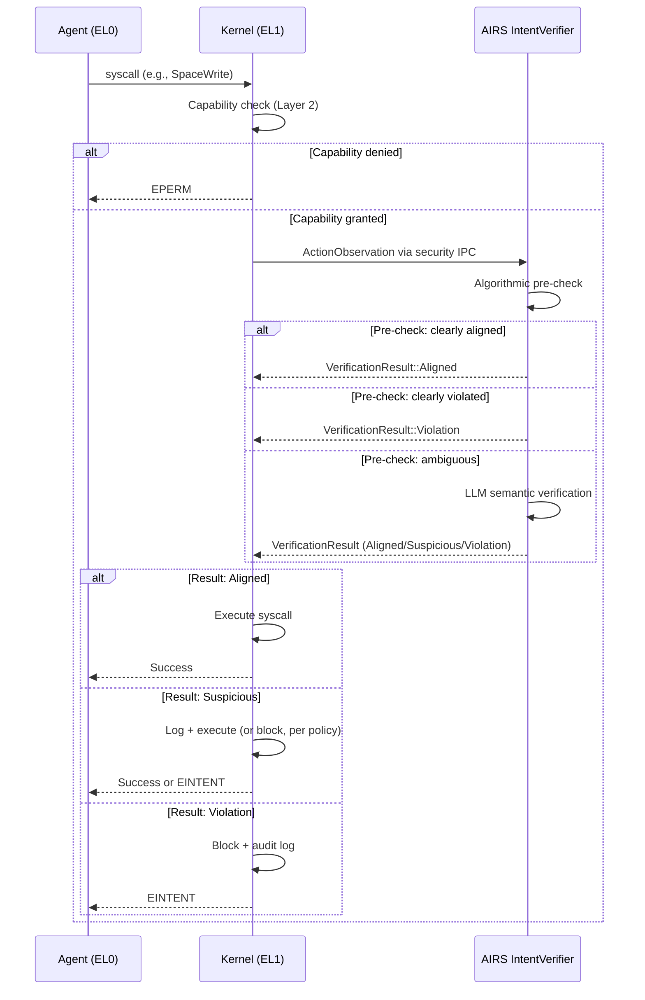

# AIOS Intent Verifier — Pipeline and Performance

Part of: [intent-verifier.md](../intent-verifier.md) — Intent Verifier Architecture
**Related:** [specification.md](./specification.md) — Intent Specification, [security.md](./security.md) — Adversarial Resistance, [behavioral.md](./behavioral.md) — Behavioral Integration

-----

## §2 Architecture

### §2.1 Component Placement

The IntentVerifier runs inside the AIRS system service, which executes in privileged userspace (EL0 with elevated capabilities). It does not run inside the kernel. The kernel communicates with the IntentVerifier through a dedicated security IPC channel — separate from the resource orchestration channel that handles prefetch directives, pool tuning, and compression scheduling.

This placement reflects a fundamental design constraint: LLM inference requires a heap allocator, floating-point context, and model weights in memory — none of which belong in the kernel's address space. The kernel remains lean and deterministic; the IntentVerifier's semantic reasoning happens in userspace where a panic cannot crash the system.

```rust
pub struct IntentVerifier {
    /// AIRS inference model for semantic verification
    model: ModelHandle,
    /// Active task intents, keyed by TaskId
    active_tasks: HashMap<TaskId, DeclaredIntent>,
    /// Verification result cache (LRU, keyed by ActionSignature)
    cache: LruCache<ActionSignature, VerificationResult>,
    /// Policy configuration
    policy: IntentPolicy,
    /// Structured intent pre-checker (algorithmic, no LLM)
    pre_checker: StructuredIntentChecker,
}
```

The `IntentVerifier` is one of several intelligence services within AIRS (alongside the Space Indexer, Context Engine, Attention Manager, Behavioral Monitor, and others — see [intelligence-services.md](../airs/intelligence-services.md) §5). Each service runs behind a `SubsystemRunner` panic boundary so that a failure in the Intent Verifier does not take down the Space Indexer or vice versa.

Key relationships:

- **ModelHandle** references a verification-specific model loaded through the AIRS model registry ([model-registry.md](../airs/model-registry.md) §4). This is typically a small, fast model optimized for binary classification (aligned/misaligned) with explanation generation, not a general-purpose chat model.
- **DeclaredIntent** is registered by agents at task start via the `IntentDeclare` syscall. It contains both a free-text description and an optional `StructuredIntent` with machine-checkable fields (see [specification.md](./specification.md) §3).
- **StructuredIntentChecker** performs algorithmic pre-filtering without invoking the LLM. It evaluates purpose matching, temporal formulas, data flow specs, and resource bounds using only the structured fields of the declared intent.
- **IntentPolicy** holds per-agent and per-trust-level configuration: which actions require synchronous verification, cache TTLs, fallback behavior, and the always-verify list.

### §2.2 Action Observation Flow

Every agent action that passes through the kernel's syscall dispatch layer generates an `ActionObservation` for the IntentVerifier. The kernel does not verify intent itself — it forwards the observation to AIRS and enforces the result.



The flow enforces a strict ordering: Layer 2 (capability check) runs first because it is O(1) and kernel-local. Only capability-permitted actions reach the IntentVerifier. This avoids wasting AIRS inference cycles on actions that would be blocked by capabilities regardless.

For asynchronous verification mode, the kernel executes the syscall immediately and sends the observation to AIRS in the background. If AIRS later returns a `Violation`, the kernel revokes the agent's relevant capabilities and logs the incident — the action has already occurred, but the agent is prevented from repeating it.

### §2.3 Security Path Isolation

AIRS handles two fundamentally different workloads: security verification and resource optimization. These must never interfere with each other.

```rust
pub enum AirsInternalPath {
    /// Intent verification, behavioral analysis, injection detection.
    /// Highest priority. Never delayed by resource operations.
    /// Dedicated IPC channel from kernel.
    Security,
    /// Pool directives, prefetch, compression scheduling.
    /// Lower priority. Yields to security. Droppable under load.
    /// Falls back to kernel static heuristics if unavailable.
    Resource,
}
```

The separation is enforced at multiple levels:

- **IPC channels.** The kernel maintains two distinct IPC channels to AIRS: one for security observations (`AirsInternalPath::Security`) and one for resource hints (`AirsInternalPath::Resource`). The security channel has a higher scheduler priority for the receiving thread within AIRS.
- **Thread pools.** Within AIRS, security verification runs on dedicated threads that are never shared with resource optimization tasks. A prefetch storm does not starve intent verification of CPU time.
- **Shared state prohibition.** The security path and resource path share no mutable state. A resource decision (e.g., "prefetch this space object") never influences an intent verification verdict, and vice versa. The only shared state is read-only: the model registry and the agent manifest store.
- **SLA enforcement.** The security path has a hard <10ms SLA for synchronous verification responses. If the security path cannot meet this SLA (e.g., model loading delay, extreme queue depth), it returns the fallback policy result rather than blocking indefinitely. The kernel monitors this SLA via `AirsDirectiveMonitor` and logs violations.

### §2.4 Crash Containment

The IntentVerifier runs behind a `SubsystemRunner` panic boundary (see [security.md](../airs/security.md) §10.1.1). If the IntentVerifier panics, AIRS does not crash. The crash containment strategy has three tiers:

**Tier 1 — Subsystem restart.** A single panic triggers an automatic restart of the IntentVerifier subsystem. Active verification requests in flight receive the agent's configured fallback result. The restart process re-loads the verification model and rebuilds the cache (empty). Typical restart latency: <500ms.

**Tier 2 — Subsystem disable.** Three panics within 60 seconds trigger automatic disabling of the IntentVerifier. AIRS continues running (Space Indexer, Context Engine, etc. are unaffected). All verification requests receive the fallback policy result until an administrator re-enables the subsystem or AIRS is restarted.

**Tier 3 — AIRS process crash.** If the entire AIRS process crashes (not just the IntentVerifier subsystem), the kernel detects this via the `AirsDirectiveMonitor` health check. The kernel then:

1. Applies the configured fallback policy for every active agent.
2. Logs the AIRS crash as a security event in the audit ring.
3. Attempts to restart AIRS via the service manager.
4. Continues operating with Layers 2-8 active (capabilities, resource limits, audit, etc.).

Fallback policies are configured per agent trust level:

```rust
pub enum IntentFallbackPolicy {
    /// Rely on Layers 2-8; do not block actions that pass capability checks.
    /// Appropriate for high-trust system agents.
    Skip,
    /// Block all actions except those on an explicit allowlist.
    /// Appropriate for untrusted or newly-installed agents.
    BlockAll,
    /// Allow read operations; block all writes, deletes, and network sends.
    /// Appropriate for moderate-trust agents.
    ReadOnly,
}
```

The kernel never depends on AIRS for its own correctness. AIRS unavailability degrades security (Layer 1 is offline) but does not compromise system stability. This is a deliberate architectural choice: the kernel is the trust anchor, not AIRS.

---

## §4 Verification Pipeline

The verification pipeline processes each `ActionObservation` through up to three stages: algorithmic pre-check, LLM semantic verification, and (for high-risk actions) multi-round adversarial self-testing. Most actions complete at the first stage.

### §4.1 Action Observation

The kernel constructs an `ActionObservation` at syscall dispatch time, capturing the acting agent, the action type, the target resource, and a timestamp. This is the input to the entire verification pipeline.

```rust
pub struct ActionObservation {
    agent: AgentId,
    action: Action,
    target: ActionTarget,
    timestamp: Timestamp,
}

pub enum Action {
    SpaceRead,
    SpaceWrite,
    SpaceDelete,
    NetworkSend,
    NetworkReceive,
    InferenceRequest,
    ProcessSpawn,
    CapabilityDelegate,
    CapabilityUse,
}

pub enum ActionTarget {
    Space(SpaceId),
    Network(NetworkEndpoint),
    Process(ProcessId),
    Capability(CapabilityHandle),
}
```

The `Action` enum covers the nine action classes that the IntentVerifier evaluates. Not every syscall generates an observation — only those that interact with security-relevant resources. Low-level operations (memory allocation, thread scheduling, timer reads) are not observed because they have no semantic relationship to agent intent.

The `ActionTarget` identifies the specific resource being acted upon. For space operations, this is the `SpaceId` of the target space. For network operations, this includes the destination endpoint (address + port + protocol). For process operations, this is the target process. For capability operations, this is the capability handle being delegated or exercised.

The kernel constructs the observation before executing the action (for synchronous mode) or concurrently with execution (for asynchronous mode). The observation is sent to AIRS via the security IPC channel as a fixed-size message — no heap allocation is required on the kernel side.

### §4.2 Algorithmic Pre-Check

The algorithmic pre-check is the fast path. It evaluates the action against the agent's `StructuredIntent` fields using purely deterministic logic — no LLM inference, no model weights, no floating-point arithmetic. This stage handles approximately 80% of all verifications.

The pre-check evaluates four conditions in order:

```rust
impl StructuredIntentChecker {
    /// Returns PreCheckResult:
    ///   Aligned    — all checks pass, no LLM needed
    ///   Violation  — at least one check clearly fails
    ///   Ambiguous  — checks are inconclusive, escalate to LLM
    pub fn pre_check(
        &self,
        observation: &ActionObservation,
        intent: &StructuredIntent,
    ) -> PreCheckResult {
        // 1. Purpose match
        let purpose = self.check_purpose(&observation.action, &intent.purpose);
        if purpose == CheckOutcome::ClearViolation {
            return PreCheckResult::Violation("Action type not permitted by declared purpose");
        }

        // 2. Temporal formula evaluation
        let temporal = self.check_temporal(&observation, &intent.temporal_spec);
        if temporal == CheckOutcome::ClearViolation {
            return PreCheckResult::Violation("Action violates temporal constraints");
        }

        // 3. Data flow validation
        let flow = self.check_data_flow(&observation, &intent.data_flow_specs);
        if flow == CheckOutcome::ClearViolation {
            return PreCheckResult::Violation("Data flow violates declared spec");
        }

        // 4. Resource bound check
        let resource = self.check_resource_bounds(&observation, &intent.resource_bounds);
        if resource == CheckOutcome::ClearViolation {
            return PreCheckResult::Violation("Action exceeds resource bounds");
        }

        // All checks passed clearly
        if [purpose, temporal, flow, resource].iter().all(|c| *c == CheckOutcome::ClearPass) {
            return PreCheckResult::Aligned;
        }

        // At least one check was ambiguous
        PreCheckResult::Ambiguous
    }
}
```

Each check is a simple comparison against the structured fields:

1. **Purpose match.** Does the `Action` type fall within the set of actions permitted by the declared `IntentPurpose`? An agent that declared only `IntentPurpose::InformationRetrieval` purposes is permitted `SpaceRead` and `InferenceRequest` but not `SpaceDelete` or `NetworkSend`. This is a set membership test — O(1).

2. **Temporal formula evaluation.** Does the action satisfy the agent's `TemporalSpec`? Temporal specs express ordering and frequency constraints: "read before write", "at most 10 network sends per minute", "no deletes until after user confirmation". The evaluator maintains a small per-agent event log and evaluates the formula against the observed action sequence. This is a finite-state check — O(log n) in the event log size.

3. **Data flow validation.** Does the source-to-sink path match the agent's declared `DataFlowSpec`? An agent that declared "read from `email/inbox`, write to `user/summaries`" should not be writing to `system/credentials`. The checker validates that the target space matches at least one declared sink. For cross-agent data flows, this check integrates with the taint label system (see [information-flow.md](./information-flow.md) §5).

4. **Resource bound check.** Is the agent within its declared `ResourceBounds`? This checks cumulative resource usage: total bytes written, total network bytes sent, total inference tokens consumed. The bounds are declared at task start and enforced cumulatively across the task lifetime.

When all four checks return `ClearPass`, the action is `Aligned` without LLM involvement. When any check returns `ClearViolation`, the action is a `Violation` without LLM involvement. When any check returns `Ambiguous` (and none return `ClearViolation`), the action is escalated to the LLM for semantic verification.

Ambiguity arises when the structured intent fields are insufficiently specific. An agent with no declared `IntentPurpose` variants and no `DataFlowSpec` produces ambiguous results for most actions because the pre-checker has nothing concrete to compare against. This is by design: agents that provide richer structured intents benefit from faster, cheaper verification.

### §4.3 LLM Semantic Verification

When the algorithmic pre-check returns `Ambiguous`, the IntentVerifier invokes the AIRS inference engine for semantic comparison. This stage uses a purpose-built prompt template that presents the declared intent, the observed action, and a sliding window of recent action history.

The prompt template:

```text
[SYSTEM]
You are a security verification system for AIOS. Your task is to determine
whether an observed agent action is consistent with the agent's declared task
intent. You must respond with one of three verdicts: ALIGNED, SUSPICIOUS, or
VIOLATION.

Rules:
- ALIGNED: The action is clearly consistent with the declared intent.
- SUSPICIOUS: The action could be consistent but raises concerns. Include a
  confidence score (0.0-1.0) and a brief explanation.
- VIOLATION: The action is clearly inconsistent with the declared intent.
  Include a brief explanation.

You must be conservative: when in doubt between ALIGNED and SUSPICIOUS,
choose SUSPICIOUS. When in doubt between SUSPICIOUS and VIOLATION, choose
SUSPICIOUS with a low confidence score.

Do not consider whether the action is permitted by capabilities. Capability
enforcement is handled separately. Focus only on whether the action aligns
with the stated purpose.

[DECLARED INTENT]
Agent: {agent_name} (trust level: {trust_level})
Task description: {intent_description}
Purpose: {intent_purpose}
Allowed spaces: {allowed_spaces}
Allowed network targets: {allowed_network_targets}

[RECENT HISTORY]
{last_N_actions_with_timestamps}

[OBSERVED ACTION]
Action: {action_type}
Target: {target_description}
Timestamp: {timestamp}

[VERDICT]
```

The model produces a structured response that is parsed into a `VerificationResult`. The parsing is strict: if the model output does not conform to the expected format (verdict + optional confidence + optional explanation), the result defaults to `Suspicious` with a confidence of 0.5 and the explanation "Model output could not be parsed".

The history window contains the most recent N actions (configurable, default 20) for the same agent. This context is essential for detecting gradual drift — an agent that slowly escalates from reads to writes to deletes, where each individual step might appear reasonable in isolation. The history window enables the model to identify patterns that the algorithmic pre-check cannot.

Confidence scoring follows a calibrated scale:

- **0.9-1.0:** High confidence the action is suspicious or violating. Recommended for immediate blocking.
- **0.7-0.9:** Moderate confidence. Recommended for logging + user notification.
- **0.5-0.7:** Low confidence. Recommended for logging only.
- **Below 0.5:** The model is uncertain. Treated as `Aligned` with a log entry.

The IntentVerifier does not blindly trust the model's verdict. If the model returns `Aligned` but the algorithmic pre-check had a `ClearViolation` on any dimension, the pre-check result takes precedence. The LLM is consulted for ambiguous cases, not to override deterministic checks.

### §4.4 Verification Modes

The IntentVerifier supports two verification modes, selected per action based on the action's risk profile and the agent's trust level:

```rust
pub enum VerificationMode {
    /// Block action until AIRS confirms alignment.
    /// Used for destructive or high-risk actions.
    Synchronous,
    /// Allow action, verify in background, revoke if misaligned.
    /// Used for non-destructive or low-risk actions.
    Asynchronous,
}
```

**Synchronous verification** blocks the agent's syscall until the IntentVerifier returns a result. The kernel holds the agent thread in a blocked state and does not execute the syscall until it receives `Aligned` or applies the timeout fallback. This mode is used for:

- Destructive actions: `SpaceDelete`, `SpaceWrite` (overwrite mode)
- Network sends exceeding 1 KiB payload
- Credential or secret use: `CapabilityDelegate` for sensitive capabilities
- Cross-space writes: writing to a space not listed in the agent's primary workspace
- First occurrence of any action type for a newly started task (cold cache)

**Asynchronous verification** allows the action to proceed immediately. The observation is queued for background verification. If the IntentVerifier later returns `Violation`:

1. The kernel revokes the agent's capability for the violated action type.
2. The violation is logged in the audit ring with the original action details.
3. The behavioral monitor is notified to adjust the agent's baseline.
4. If configured, the user is notified via the attention manager.

Asynchronous mode is used for:

- Read operations: `SpaceRead`, `NetworkReceive`
- Non-destructive local operations: `InferenceRequest`, `ProcessSpawn` (sandboxed)
- Actions with a valid cache hit (result already known from a previous identical action)
- Actions from high-trust system agents operating within their declared scope

The mode selection is determined by the `IntentPolicy` for each agent. Administrators can override the default mode for specific action types via the agent manifest or runtime policy. The always-verify list — a set of action patterns that bypass caching and always require fresh verification — is also configurable per agent.

### §4.5 Verification Result Caching

LLM verification is expensive relative to algorithmic pre-checks. The IntentVerifier caches LLM results to avoid re-verifying identical actions.

```rust
pub enum VerificationResult {
    Aligned,
    Suspicious { confidence: f32, explanation: String },
    Violation { explanation: String },
}

/// Cache key: action type + hash of target resource
pub struct ActionSignature {
    action: Action,
    target_hash: u64,
}
```

The cache is an LRU (Least Recently Used) map keyed by `ActionSignature`. The signature combines the action type with a hash of the target resource identifier. Two `SpaceRead` actions to the same `SpaceId` share a cache key; a `SpaceRead` and a `SpaceWrite` to the same space do not.

Cache invalidation occurs under three conditions:

- **Intent change.** When an agent registers a new `DeclaredIntent` (task change or intent update), the entire cache for that agent is cleared. A new intent means previous verification results may no longer be valid.
- **Behavioral alert.** When the behavioral monitor (Layer 3) raises an alert for an agent, the cache for that agent is cleared. A behavioral anomaly may indicate that previously-aligned actions are now part of a malicious pattern.
- **TTL expiration.** Each cache entry has a time-to-live (default: 300 seconds). Expired entries are evicted on next access. The TTL prevents stale results from persisting indefinitely.

Cache bypass occurs for:

- Actions on the always-verify list (configured per agent).
- The first occurrence of each action type within a task (cold cache priming).
- Actions following a `Suspicious` result for the same agent within the last 60 seconds (heightened scrutiny window).

The cache stores 1024 entries per agent using LRU eviction. At capacity, the least-recently-used entry is evicted to make room for new results. Cache hit rates are discussed in §10.3.

### §4.6 Multi-Round Adversarial Self-Testing

For high-risk actions, the IntentVerifier performs a three-round adversarial self-test that challenges its own initial verdict. This adds approximately 20ms of additional latency but provides stronger assurance against sophisticated evasion attempts.

The three rounds are:

**Round 1 — Alignment query.** The standard LLM verification prompt from §4.3. The model produces an initial verdict with confidence and explanation.

```text
[ROUND 1 PROMPT]
Does action {action} by agent {agent} align with declared intent {intent}?
Respond: ALIGNED / SUSPICIOUS / VIOLATION with confidence and explanation.
```

**Round 2 — Adversarial interpretation.** The model is asked to consider the worst-case interpretation of the action, assuming the agent is malicious.

```text
[ROUND 2 PROMPT]
Assume the agent performing action {action} is malicious and trying to
exploit its capabilities. Given its declared intent {intent}, what is the
worst-case interpretation of this action? What damage could result?

Consider:
- Data exfiltration via permitted network targets
- Gradual privilege escalation via capability delegation
- State corruption via seemingly-benign writes
- Denial of service via resource exhaustion
```

**Round 3 — Final decision.** The model receives both the Round 1 verdict and the Round 2 risk analysis, and makes a final determination.

```text
[ROUND 3 PROMPT]
Round 1 verdict: {round1_verdict} (confidence: {confidence})
Round 2 risk analysis: {round2_analysis}

Given both the initial alignment assessment and the adversarial risk
analysis, provide your final verdict. If the risk analysis revealed
plausible attack scenarios that the initial verdict missed, upgrade
the severity. Otherwise, confirm the initial verdict.
```

Multi-round adversarial self-testing is triggered only for actions that meet specific risk criteria:

- **Bulk deletions:** `SpaceDelete` targeting more than 10 objects in a single operation.
- **Large data transfers:** `NetworkSend` with payload exceeding 100 KiB.
- **Credential operations:** `CapabilityDelegate` for capabilities with trust level `High` or above.
- **Cross-zone writes:** `SpaceWrite` targeting a space in a different `SecurityZone` than the agent's primary workspace.

The multi-round process uses the same model as single-round verification but with separate prompt templates. Each round's output is appended to the context for subsequent rounds, creating an internal chain of reasoning. If any round produces a `Violation` verdict, the final result is `Violation` regardless of other rounds.

---

## §10 Performance Model

The Intent Verifier is on the critical path for synchronous verification. Its performance directly affects perceived system responsiveness. The design optimizes for the common case (algorithmic pre-check, <0.01ms) while keeping the worst case (multi-round adversarial, <30ms) within acceptable bounds.

### §10.1 Latency Budget

| Verification Stage | Latency | When Used | Frequency |
|---|---|---|---|
| Algorithmic pre-check | <0.01ms | Every action | ~80% of actions complete here |
| Cache lookup | <0.001ms | After first check per action type | ~12% of remaining actions hit cache |
| LLM semantic verification | <10ms | Ambiguous cases, cache miss | ~8% of all actions |
| Multi-round adversarial | <30ms | High-risk actions only | <1% of all actions |
| **Total (fast path)** | **<0.01ms** | **Algorithmic pre-check pass** | **~80% of actions** |
| **Total (cached path)** | **<0.02ms** | **Pre-check ambiguous, cache hit** | **~12% of actions** |
| **Total (LLM path)** | **<10ms** | **Pre-check ambiguous, cache miss** | **~7% of actions** |
| **Total (adversarial path)** | **<30ms** | **High-risk action, multi-round** | **<1% of actions** |

These latency targets assume a verification-optimized model (small, fast, purpose-built) running on the local inference engine. The <10ms target for LLM verification is achievable with a quantized model (Q4_K_M or Q8_0) on hardware with a Neural Processing Unit. On CPU-only hardware, the LLM path may increase to 50-100ms, in which case more actions should be routed to asynchronous verification to avoid blocking agent syscalls.

The latency budget accounts for IPC round-trip overhead between the kernel and AIRS. The kernel-to-AIRS security IPC channel uses direct switch optimization (see [ipc.md](../../kernel/ipc.md) §9.3) to minimize scheduling delay. The IPC round-trip overhead is <0.05ms under normal load.

### §10.2 Throughput Under Load

The verification pipeline is designed to sustain high throughput without degrading security guarantees.

**Security path isolation** ensures that verification throughput is independent of AIRS resource optimization load. A burst of prefetch directives, compression jobs, or embedding generation tasks does not slow down intent verification. The security path has dedicated threads and a dedicated IPC channel (§2.3).

**Rate limiting** prevents a single agent from flooding the verification pipeline:

- Maximum 100 intent verifications per minute per agent.
- Excess verification requests receive `VerificationResult::Violation` with explanation "Rate limit exceeded".
- Rate limiting is enforced at the kernel side before sending observations to AIRS, avoiding unnecessary IPC traffic.
- System agents (trust level `System`) are exempt from rate limiting.

**Back-pressure handling** adapts to queue depth:

- **Normal (<50 queued):** Both synchronous and asynchronous modes operate normally.
- **Elevated (50-100 queued):** Non-destructive actions that would normally be synchronous are downgraded to asynchronous verification. Destructive actions remain synchronous.
- **Critical (>100 queued):** All actions except those on the always-verify list receive the fallback policy result without verification. An audit event is logged indicating verification was skipped due to back-pressure.

**Kernel-side timeout** prevents indefinite blocking:

- The kernel sets a 10ms deadline for synchronous verification responses.
- If AIRS does not respond within 10ms, the kernel applies the agent's fallback policy.
- The timeout is enforced by the kernel's timer subsystem, not by AIRS. A hung AIRS thread cannot hold a kernel-side syscall indefinitely.
- Timeout events are logged and contribute to the `AirsDirectiveMonitor` health assessment.

### §10.3 Cache Hit Rates

The verification pipeline achieves its performance targets largely through the algorithmic pre-check, which avoids LLM invocation entirely for the majority of actions.

**Algorithmic pre-check (no cache needed):**

- Approximately 80% of actions are resolved by the structured intent pre-checker.
- Agents that provide detailed `StructuredIntent` specifications (purpose, temporal spec, data flow spec, resource bounds) see pre-check resolution rates of 90-95%.
- Agents with minimal structured intents (no declared purpose categories, no data flow specs) see pre-check resolution rates of 40-60%, forcing more actions to the LLM path.

**LRU result cache:**

- Among the ~20% of actions that reach the LLM path, approximately 60% are cache hits.
- Cache hit rate improves with agent stability: agents that perform repetitive operations (batch processing, scheduled tasks) approach 80-90% cache hit rates.
- Cache hit rate degrades after intent changes, behavioral alerts, or TTL expiration.
- Cache size: 1024 entries per agent (LRU eviction). This is sufficient for agents with up to ~500 distinct action patterns within a 5-minute TTL window.

**Combined resolution rates:**

| Resolution Path | Percentage | Latency |
|---|---|---|
| Algorithmic pre-check: Aligned | ~75% | <0.01ms |
| Algorithmic pre-check: Violation | ~5% | <0.01ms |
| LRU cache hit | ~12% | <0.02ms |
| LLM verification (cache miss) | ~7% | <10ms |
| Multi-round adversarial | <1% | <30ms |
| **Weighted average** | **100%** | **<0.8ms** |

The weighted average latency of <0.8ms means that intent verification adds negligible overhead to most agent operations. The 7% of actions that require LLM verification experience a noticeable but bounded delay. For latency-sensitive workloads, agents should invest in detailed structured intent specifications to maximize algorithmic pre-check resolution.

**Cache sizing rationale:** 1024 entries per agent balances memory consumption against hit rate. Each cache entry is approximately 128 bytes (8-byte key + 120-byte result with explanation string). Total cache memory per agent: ~128 KiB. For a system with 32 active agents, total cache memory: ~4 MiB — a negligible fraction of the AIRS process's memory budget. Increasing cache size beyond 1024 entries yields diminishing returns because the TTL (300 seconds) naturally limits the useful cache horizon.
