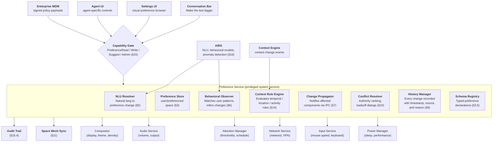

# AIOS Preference System

## Deep Technical Architecture

**Parent document:** [architecture.md](../project/architecture.md)
**Related:** [airs.md](./airs.md) — Behavioral inference and NLU, [context-engine.md](./context-engine.md) — Context-driven preference adaptation, [experience.md](../experience/experience.md) — Conversation Bar configuration, [spaces.md](../storage/spaces.md) — Preference storage and sync, [agents.md](../applications/agents.md) — Agent preference scoping, [model.md](../security/model.md) — Capability-based access control, [multi-device.md](../platform/multi-device.md) — Cross-device preference sync, [subsystem-framework.md](../platform/subsystem-framework.md) — Universal capability gate and audit patterns

**Note:** The Preference System is a privileged system service. Its capability gate, audit logging, and enterprise policy integration follow the universal patterns defined in the security model document.

-----

## Document Map

This document was split for navigability. Each sub-document preserves the original section numbers for cross-reference stability.

| Document | Sections | Content |
|---|---|---|
| **This file** | §1, §2, §19, §20 | Overview, architecture, implementation order, design principles |
| [data-model.md](./preferences/data-model.md) | §3 | Preference types, values, sources (including Enterprise and Context-driven), metadata, schema registry |
| [resolution.md](./preferences/resolution.md) | §4, §5, §10 | 7-tier source precedence, NLU pipeline, conflict detection and resolution |
| [inference.md](./preferences/inference.md) | §6, §7, §8 | Behavioral observer pipeline, change propagation via IPC, agent preferences and SDK |
| [history.md](./preferences/history.md) | §9, §11, §12, §13 | Explainability and undo, cross-device sync, preference categories and defaults, Settings UI |
| [temporal.md](./preferences/temporal.md) | §14 | Context-driven rules: time-of-day, location, activity, device-presence triggers |
| [security.md](./preferences/security.md) | §15 | Capability-gated access, trust levels, enterprise policy signing, rate limiting, audit trail, privacy |
| [intelligence.md](./preferences/intelligence.md) | §16, §17 | AIRS-dependent intelligence (contextual bandits, NLU, anomaly detection) and kernel-internal ML (pattern detection, confidence scoring) |
| [testing.md](./preferences/testing.md) | §18 | Unit, integration, property-based, fuzz, and QEMU validation tests |

-----

## 1. Overview

Settings panels are broken. Every operating system ships a Settings application with hundreds of options organized by developer logic, not user need. Want to change the font size? Settings → Display → Font Size → Advanced → Scaling Factor. Want to stop notifications at night? Settings → Notifications → Do Not Disturb → Schedule → Custom. Want to change the mouse speed? Settings → Input → Mouse → Pointer Speed → (which of the three sliders?).

Users don't find settings. They search the web for "how to make text bigger on [OS name]" and follow a tutorial. The settings panel is a failure of design — it forces the user to learn the developer's mental model of the system instead of meeting the user where they are.

Config files are worse. `.bashrc`, `.vimrc`, `~/.config/appname/settings.json`, `/etc/sysctl.conf`, environment variables, registry keys, plist files, dconf databases. Every application invents its own configuration format, stored in its own location, with its own syntax. There is no discoverability, no history, no explanation of what each setting does or why it's set to its current value.

AIOS replaces all of this with the **Preference System** — a unified, conversational, behavioral, evolving configuration layer.

**How it works:**

- "Make the text bigger" → Preference Service increases font scale → compositor re-renders. Done.
- "I don't like the blue accent color" → theme accent changes. Done.
- "Stop notifications at night" → attention suppression schedule created. Done.
- "When I'm at work, set volume to 30%" → context rule created with geofence. Done.
- User always reduces brightness after 8pm → AIRS proposes auto-dim context rule. User approves once.
- Agent suggests a configuration change → user sees the proposal with explanation, accepts or rejects.
- Organization requires encrypted storage → enterprise policy locks the setting, user sees rationale.

No settings panel required. No config files to edit. No documentation to read. The computer adapts to the user, not the other way around.

-----

## 2. Architecture



-----

## 19. Implementation Order

Development plan phases (see [development-plan.md](../project/development-plan.md)):

```text
Phase 6:   Preference System (basic)
           ├── Preference data model (PreferenceId, PreferenceValue, PreferenceSource)
           ├── Schema registry and validation
           ├── Preference Store (get/set/persist in user/preferences/ space)
           ├── System defaults for display, audio, input, attention, privacy, power
           ├── Change propagation (IPC notification to components)
           ├── Capability gate (PreferenceRead, PreferenceSystemWrite, PreferenceAgentWrite)
           └── Audit logging (Changed, AccessDenied events)

Phase 13:  Conversational preferences
           ├── NLU resolver (Conversation Bar → preference changes)
           ├── Preference history (change records, explain(), undo)
           ├── Conflict resolution (source precedence, tradeoff dialogs)
           ├── Enterprise policy (EnterpriseLocked/Recommended, signature verification)
           └── Agent suggestion flow (suggest → approve/reject → apply)

Phase 18:  Behavioral intelligence
           ├── Behavioral observer (pattern detection, hypothesis generation)
           ├── Kernel-internal ML models (time-series, confidence scoring)
           ├── Behavioral proposals (AIRS-driven preference suggestions)
           ├── Agent preferences (manifest declaration, scoped storage)
           └── Rate limiting and anomaly detection

Phase 24:  Context and Settings UI
           ├── Context Rule Engine (time-of-day, location, activity, device-presence)
           ├── Conversational rule creation ("dark mode after sunset")
           ├── Settings UI (visual preference browser, enterprise indicators)
           ├── Cross-device sync (universal vs per-device, Space Mesh integration)
           └── Preference analytics (usage patterns, recommendation engine)

Phase 30:  Full NLU coverage
           ├── Multi-preference changes from single utterance
           ├── Ambiguous request handling with follow-up questions
           ├── Cross-preference dependency suggestions (AIRS §16.3)
           └── Contextual bandits for preference learning (§16.1)

Phase 34:  Accessibility preferences
           ├── Screen reader integration
           ├── High contrast mode
           ├── Reduced motion
           ├── Voice control preferences
           └── Adaptive input preferences
```

-----

## 20. Design Principles

1. **Conversation first, panels last.** The primary interface for preferences is natural language. "Make the text bigger" is always easier than Settings → Display → Font Size → Scale Factor. The Settings UI is a fallback for browsing, not the default.

2. **Every change has a reason.** No silent changes. Every preference change records who changed it, when, why, and what the previous value was. "Why is my screen dim?" always has an answer.

3. **User explicit wins.** When the user directly sets a preference, nothing below enterprise policy overrides it silently. System components can explain tradeoffs and suggest alternatives, but the user's explicit choice is respected.

4. **Observe, hypothesize, propose, confirm.** Behavioral inference follows a strict pipeline. The system observes patterns, forms hypotheses, waits for statistical confidence, proposes changes with explanation, and only applies them after user approval. No silent behavior modification.

5. **Preferences are data, not code.** Preferences are typed values stored in spaces with validated schemas, not hardcoded constants scattered across configuration files. They're queryable, syncable, versionable, and auditable.

6. **Agents suggest, users decide.** Agents can propose preference changes with rationale. Users see the proposal, the explanation, and the tradeoffs. The agent never makes the decision. Suggestions are rate-limited to prevent manipulation.

7. **Sync what makes sense.** Theme syncs everywhere. Brightness doesn't. Context rules sync their definitions but not their activation state. The system knows which preferences are universal, device-specific, or context-dependent.

8. **No settings archaeology.** If a user can't find a setting within 10 seconds, the system has failed. Natural language search, category browsing, and "why is X set to Y?" queries ensure every preference is discoverable.

9. **Least privilege for preference access.** Agents receive attenuated capability tokens scoped to only the preferences they declared in their manifest. No agent gets blanket read access to all preferences.

10. **Context adapts, user overrides.** Context rules automatically adjust preferences based on time, location, activity, and device presence. The user can always override any context-driven change, and the override takes precedence until explicitly removed.

11. **Statistical baseline, semantic enhancement.** Kernel-internal ML provides basic pattern detection and confidence scoring with no AIRS dependency. AIRS adds semantic understanding, cross-preference analysis, and anomaly detection when available. The system degrades gracefully.

12. **Enterprise respects transparency.** Enterprise policies can lock preferences, but the user always sees *why* a setting is locked and *who* locked it. No invisible organizational control.

-----

## Cross-Reference Index

| Section | Sub-document | Topic |
|---|---|---|
| §3.1 | [data-model.md](./preferences/data-model.md) | Preference struct and PreferenceValue enum |
| §3.2 | [data-model.md](./preferences/data-model.md) | PreferenceMetadata and scope |
| §3.3 | [data-model.md](./preferences/data-model.md) | PreferenceChange records |
| §3.4 | [data-model.md](./preferences/data-model.md) | ContextRule model |
| §3.5 | [data-model.md](./preferences/data-model.md) | Schema registry |
| §4.1 | [resolution.md](./preferences/resolution.md) | Authority ranking (7-tier) |
| §4.2 | [resolution.md](./preferences/resolution.md) | Precedence resolution logic |
| §4.3 | [resolution.md](./preferences/resolution.md) | Source conflict examples |
| §4.4 | [resolution.md](./preferences/resolution.md) | Enterprise policy interaction |
| §5.1 | [resolution.md](./preferences/resolution.md) | NLU resolution pipeline |
| §5.2 | [resolution.md](./preferences/resolution.md) | Conversational examples |
| §6.1 | [inference.md](./preferences/inference.md) | Behavioral observation loop |
| §6.2 | [inference.md](./preferences/inference.md) | Inference pipeline |
| §6.3 | [inference.md](./preferences/inference.md) | Observable patterns table |
| §7.1 | [inference.md](./preferences/inference.md) | Change notification via IPC |
| §7.2 | [inference.md](./preferences/inference.md) | Component subscription |
| §8.1 | [inference.md](./preferences/inference.md) | Agent-scoped preferences |
| §8.2 | [inference.md](./preferences/inference.md) | Agent manifest declaration |
| §8.3 | [inference.md](./preferences/inference.md) | Agent reading system preferences |
| §9.1 | [history.md](./preferences/history.md) | Explainability (explain API) |
| §9.2 | [history.md](./preferences/history.md) | Undo |
| §10.1 | [resolution.md](./preferences/resolution.md) | Conflict detection |
| §10.2 | [resolution.md](./preferences/resolution.md) | Resolution strategy |
| §10.3 | [resolution.md](./preferences/resolution.md) | Conflict with context rules |
| §11.1 | [history.md](./preferences/history.md) | Sync strategy |
| §11.2 | [history.md](./preferences/history.md) | Cross-device conflict resolution |
| §12.1–12.6 | [history.md](./preferences/history.md) | Preference categories and defaults |
| §13 | [history.md](./preferences/history.md) | Settings UI |
| §14.1 | [temporal.md](./preferences/temporal.md) | Context Rule Engine |
| §14.2 | [temporal.md](./preferences/temporal.md) | Time-of-day scheduling |
| §14.3 | [temporal.md](./preferences/temporal.md) | Location-aware preferences |
| §14.4 | [temporal.md](./preferences/temporal.md) | Activity-aware preferences |
| §14.5 | [temporal.md](./preferences/temporal.md) | Device-presence triggers |
| §14.6 | [temporal.md](./preferences/temporal.md) | Rule composition and interaction |
| §14.7 | [temporal.md](./preferences/temporal.md) | Conversational rule creation |
| §15.1 | [security.md](./preferences/security.md) | Capability-gated access |
| §15.2 | [security.md](./preferences/security.md) | Capability attenuation |
| §15.3 | [security.md](./preferences/security.md) | Agent permission model |
| §15.4 | [security.md](./preferences/security.md) | Audit trail |
| §15.5 | [security.md](./preferences/security.md) | Enterprise policy security |
| §15.6 | [security.md](./preferences/security.md) | Agent suggestion rate-limiting |
| §15.7 | [security.md](./preferences/security.md) | Privacy protection |
| §16.1 | [intelligence.md](./preferences/intelligence.md) | Contextual bandits for preference learning |
| §16.2 | [intelligence.md](./preferences/intelligence.md) | Semantic NLU enhancement |
| §16.3 | [intelligence.md](./preferences/intelligence.md) | Cross-preference dependency analysis |
| §16.4 | [intelligence.md](./preferences/intelligence.md) | Preference anomaly detection |
| §16.5 | [intelligence.md](./preferences/intelligence.md) | Personalization profile learning |
| §17.1 | [intelligence.md](./preferences/intelligence.md) | Time-series pattern detection |
| §17.2 | [intelligence.md](./preferences/intelligence.md) | Confidence scoring |
| §17.3 | [intelligence.md](./preferences/intelligence.md) | Conflict prediction |
| §17.4 | [intelligence.md](./preferences/intelligence.md) | Feature importance |
| §17.5 | [intelligence.md](./preferences/intelligence.md) | Kernel-internal model budget |
| §18.1 | [testing.md](./preferences/testing.md) | Unit tests |
| §18.2 | [testing.md](./preferences/testing.md) | Integration tests |
| §18.3 | [testing.md](./preferences/testing.md) | Property-based tests |
| §18.4 | [testing.md](./preferences/testing.md) | Fuzz tests |
| §18.5 | [testing.md](./preferences/testing.md) | QEMU validation |
