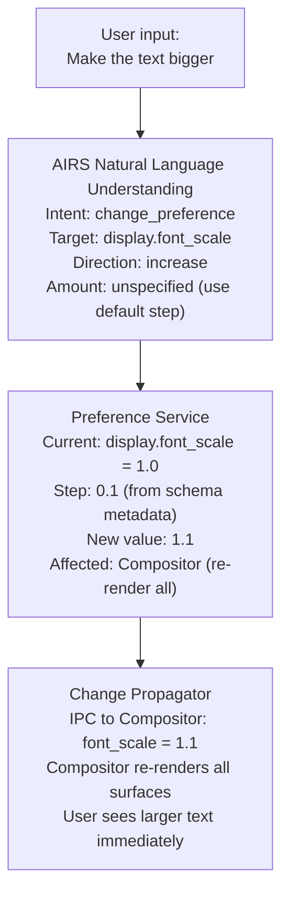

# AIOS Preference Resolution

Part of: [preferences.md](../preferences.md) — Preference System
**Related:** [data-model.md](./data-model.md) — PreferenceSource and PreferenceValue types, [security.md](./security.md) — Capability-gated access and enterprise policy, [temporal.md](./temporal.md) — Context-driven overrides, [inference.md](./inference.md) — Behavioral observer and agent suggestions

-----

## 4. Preference Sources and Precedence

### 4.1 Authority Ranking

Every preference value has a source that determines its authority. When multiple sources disagree, the higher-authority source wins. The full authority ranking, from highest to lowest:

```mermaid
flowchart TD
    subgraph Authority["Preference Authority Ranking (highest to lowest)"]
        EL["`**1. EnterpriseLocked**
        Set by organizational policy (MDM).
        User CANNOT override.
        Settings UI shows locked icon with rationale.`"]
        UE["`**2. UserExplicit**
        User directly stated this preference.
        Never overridden silently by anything below.
        System must explain and get approval to change.`"]
        ER["`**3. EnterpriseRecommended**
        Organizational recommendation.
        Sets default but user CAN override.
        Settings UI shows org badge with rationale.`"]
        CD["`**4. ContextDriven**
        Activated by environmental conditions (§14).
        Applied automatically when context matches.
        User can override at any time via Conversation Bar.`"]
        UBI["`**5. UserBehaviorInferred**
        AIRS observed a pattern, user approved inference.
        Overridable by explicit preference at any time.`"]
        AS["`**6. AgentSuggested**
        Agent proposed a change with rationale.
        Requires explicit user approval. Never applied silently.
        Can be rejected permanently.`"]
        SD["`**7. SystemDefault**
        Factory defaults. Applied when nothing else has been set.
        Overridden by any other source.`"]

        EL --> UE --> ER --> CD --> UBI --> AS --> SD
    end

    style EL fill:#d4c5f9,stroke:#7c3aed
    style UE fill:#d4edda,stroke:#28a745
    style ER fill:#e0d4f5,stroke:#9b59b6
    style CD fill:#d1ecf1,stroke:#17a2b8
    style UBI fill:#fff3cd,stroke:#ffc107
    style AS fill:#fde2e2,stroke:#dc3545
    style SD fill:#f0f0f0,stroke:#6c757d
```



### 4.2 Precedence Resolution

```rust
impl PreferenceService {
    pub fn resolve_value(&self, id: &PreferenceId) -> ResolvedPreference {
        let pref = self.store.get(id);

        // Check for active context-driven overrides (§14)
        if let Some(context_override) = self.context_engine.active_override(id) {
            // Context overrides apply unless a higher-authority source is set
            if !matches!(
                pref.source,
                PreferenceSource::EnterpriseLocked { .. }
                    | PreferenceSource::UserExplicit { .. }
                    | PreferenceSource::EnterpriseRecommended { .. }
            ) {
                return ResolvedPreference {
                    value: context_override.value.clone(),
                    source: PreferenceSource::ContextDriven {
                        rule: context_override.rule_id,
                        trigger: context_override.trigger_description.clone(),
                        timestamp: context_override.activated_at,
                    },
                    temporary: true,
                    expires: context_override.deactivates_at,
                };
            }
        }

        // Check for temporary overrides (e.g., "heads down for 2 hours")
        if let Some(temp_override) = self.temporary_overrides.get(id) {
            if temp_override.expires > SystemTime::now() {
                return ResolvedPreference {
                    value: temp_override.value.clone(),
                    source: PreferenceSource::UserExplicit {
                        method: ExplicitMethod::ConversationBar,
                        timestamp: temp_override.set_at,
                    },
                    temporary: true,
                    expires: Some(temp_override.expires),
                };
            }
        }

        // Return the current value with its source
        ResolvedPreference {
            value: pref.value.clone(),
            source: pref.source.clone(),
            temporary: false,
            expires: None,
        }
    }
}
```

### 4.3 Source Conflict Example

```text
Scenario: Battery is at 15%

1. User previously set: display.brightness = 100% (UserExplicit)
2. Power agent suggests: display.brightness = 30% (AgentSuggested)
3. Context rule "low battery": display.brightness = 40% (ContextDriven)

Resolution:
- UserExplicit wins — brightness stays at 100%
- BUT: Power agent's suggestion is presented to the user:
  "Battery at 15%. Power agent suggests reducing brightness to 30%.
   At 100%, battery will last ~20 minutes.
   At 30%, battery will last ~90 minutes.
   [Accept] [Keep 100%] [Set to 70%]"
- Context rule is suppressed because UserExplicit has higher authority.
  The user can see in Settings UI that a context rule *would* apply
  if they hadn't set an explicit preference.

The system respects the user's explicit choice but proactively
informs them of the tradeoff. The user decides.
```

### 4.4 Enterprise Policy Interaction

```text
Scenario: Organization requires encrypted storage

1. Enterprise policy (Locked): privacy.ai_data_local_only = true
2. User tries to set: privacy.ai_data_local_only = false

Resolution:
- EnterpriseLocked wins — setting stays at true
- Settings UI shows a lock icon with the org's rationale:
  "Your organization requires AI data to stay on this device.
   Contact your IT administrator for more information."
- The preference change is rejected and an audit event is logged.
```

```text
Scenario: Organization recommends dark mode

1. Enterprise policy (Recommended): display.theme = "dark"
2. User sets: display.theme = "light"

Resolution:
- UserExplicit wins — theme stays at light
- Settings UI shows an org badge: "Your organization recommends dark mode"
- User's choice is respected. No further prompting.
```

-----

## 5. Conversational Configuration

### 5.1 NLU Resolution Pipeline

When the user speaks a preference change via the Conversation Bar:



```rust
impl PreferenceService {
    pub async fn handle_natural_language(
        &mut self,
        input: &str,
    ) -> PreferenceChangeResult {
        // 1. AIRS interprets the natural language input
        let intent = self.airs.interpret_preference(input).await;

        match intent {
            PreferenceIntent::Change { target, direction, amount } => {
                let pref = self.store.get(&target);
                let new_value = self.compute_new_value(
                    &pref.value, direction, amount,
                );

                // 2. Apply the change
                self.set_preference(
                    &target,
                    new_value.clone(),
                    PreferenceSource::UserExplicit {
                        method: ExplicitMethod::ConversationBar,
                        timestamp: SystemTime::now(),
                    },
                    &format!("User said: \"{}\"", input),
                ).await;

                PreferenceChangeResult::Applied {
                    preference: target,
                    old_value: pref.value,
                    new_value,
                    description: format!("Text size increased to {:.0}%",
                        new_value.as_float().unwrap() * 100.0),
                }
            }
            PreferenceIntent::Query { target } => {
                let pref = self.store.get(&target);
                PreferenceChangeResult::Info {
                    preference: target,
                    value: pref.value.clone(),
                    source: pref.source.clone(),
                    description: pref.description.clone(),
                }
            }
            PreferenceIntent::CreateRule { conditions, overrides } => {
                // "When I'm at work, set volume to 30%"
                // NLU extracts context conditions and preference overrides
                // See §14.7 for conversational rule creation
                self.create_context_rule(conditions, overrides).await
            }
            PreferenceIntent::Ambiguous { candidates } => {
                PreferenceChangeResult::Clarification {
                    question: "Which setting did you mean?".into(),
                    options: candidates,
                }
            }
            PreferenceIntent::Unknown => {
                PreferenceChangeResult::NotUnderstood {
                    input: input.to_string(),
                }
            }
        }
    }

    fn compute_new_value(
        &self,
        current: &PreferenceValue,
        direction: ChangeDirection,
        amount: Option<f64>,
    ) -> PreferenceValue {
        match (current, direction) {
            (PreferenceValue::Float(v), ChangeDirection::Increase) => {
                let step = amount.unwrap_or(0.1);
                PreferenceValue::Float(v + step)
            }
            (PreferenceValue::Float(v), ChangeDirection::Decrease) => {
                let step = amount.unwrap_or(0.1);
                PreferenceValue::Float((v - step).max(0.0))
            }
            (PreferenceValue::Bool(_), ChangeDirection::Enable) => {
                PreferenceValue::Bool(true)
            }
            (PreferenceValue::Bool(_), ChangeDirection::Disable) => {
                PreferenceValue::Bool(false)
            }
            (PreferenceValue::Range { value, min, max, step }, dir) => {
                let delta = amount.unwrap_or(*step);
                let new = match dir {
                    ChangeDirection::Increase => (value + delta).min(*max),
                    ChangeDirection::Decrease => (value - delta).max(*min),
                    _ => *value,
                };
                PreferenceValue::Range { value: new, min: *min, max: *max, step: *step }
            }
            _ => current.clone(),
        }
    }
}
```

### 5.2 Conversational Examples

| User says | AIRS interprets | Preference change |
|---|---|---|
| "Make the text bigger" | display.font_scale, increase | 1.0 → 1.1 |
| "Dark mode" | display.theme, set to dark | light → dark |
| "I don't like the blue" | display.accent_color, change | #4A90D9 → (prompt for new color) |
| "Stop notifications at night" | attention.night_suppress, enable | false → true, 22:00-07:00 |
| "Turn off the click sounds" | audio.ui_sounds, disable | true → false |
| "Make the mouse faster" | input.mouse_speed, increase | 0.5 → 0.7 |
| "I'm heads down for 2 hours" | context.override, focus mode | 2h temporary override |
| "Why is my screen so dim?" | display.brightness, query | Returns: "Set to 30% by power agent because battery was at 15%" |
| "When I'm at work, set volume to 30%" | Create context rule (§14) | Location rule → audio.master_volume = 30 |
| "Dark mode after sunset" | Create temporal rule (§14) | SolarEvent rule → display.theme = dark |
| "Make it easier to read" | Multi-preference change (§16.2) | font_scale ↑, contrast ↑, reduce_motion on |

-----

## 10. Preference Conflicts

### 10.1 Conflict Detection

Conflicts arise when two sources disagree on the value for the same preference:

```rust
pub struct PreferenceConflict {
    pub preference: PreferenceId,
    pub current: ConflictSide,
    pub proposed: ConflictSide,
    pub tradeoff: String,
}

pub struct ConflictSide {
    pub value: PreferenceValue,
    pub source: PreferenceSource,
    pub rationale: String,
}
```

### 10.2 Resolution Strategy

The conflict resolver applies the authority ranking (§4.1) and, when the winner cannot be determined by authority alone, asks the user:

```rust
impl PreferenceService {
    pub fn resolve_conflict(&self, conflict: &PreferenceConflict) -> ConflictResolution {
        // EnterpriseLocked always wins — no user interaction needed
        if matches!(conflict.current.source, PreferenceSource::EnterpriseLocked { .. }) {
            return ConflictResolution::KeepCurrent {
                inform_user: true,
                message: "This setting is locked by your organization.".into(),
            };
        }

        // UserExplicit wins over everything below it
        if matches!(conflict.current.source, PreferenceSource::UserExplicit { .. }) {
            // Don't silently override. Instead, inform the user of the tradeoff.
            return ConflictResolution::KeepCurrent {
                inform_user: true,
                message: conflict.tradeoff.clone(),
            };
        }

        // EnterpriseRecommended wins over ContextDriven and below,
        // but the user can still override
        if matches!(conflict.current.source, PreferenceSource::EnterpriseRecommended { .. })
            && !matches!(
                conflict.proposed.source,
                PreferenceSource::EnterpriseLocked { .. }
                    | PreferenceSource::UserExplicit { .. }
            )
        {
            return ConflictResolution::KeepCurrent {
                inform_user: false,
                message: String::new(),
            };
        }

        // BehaviorInferred wins over AgentSuggested and SystemDefault
        if matches!(conflict.current.source, PreferenceSource::UserBehaviorInferred { .. })
            && matches!(conflict.proposed.source, PreferenceSource::AgentSuggested { .. })
        {
            return ConflictResolution::KeepCurrent {
                inform_user: false,
                message: String::new(),
            };
        }

        // For remaining cases — propose to user
        ConflictResolution::AskUser {
            question: format!(
                "{} wants to change {} from {} to {}. {}",
                conflict.proposed.source,
                conflict.preference,
                conflict.current.value,
                conflict.proposed.value,
                conflict.tradeoff,
            ),
            options: vec![
                ConflictOption::Accept(conflict.proposed.value.clone()),
                ConflictOption::Keep(conflict.current.value.clone()),
                ConflictOption::Custom,
            ],
        }
    }
}
```

### 10.3 Conflict with Context Rules

When a context rule (§14) conflicts with a higher-authority source, the context rule is suppressed but remains defined. The Settings UI shows:

- A dimmed context rule entry with an explanation: "This rule is overridden by your explicit setting of X"
- An option to "remove explicit override and let context rules manage this preference"

This ensures context rules are never silently discarded — they resume automatically if the user removes their explicit override.
