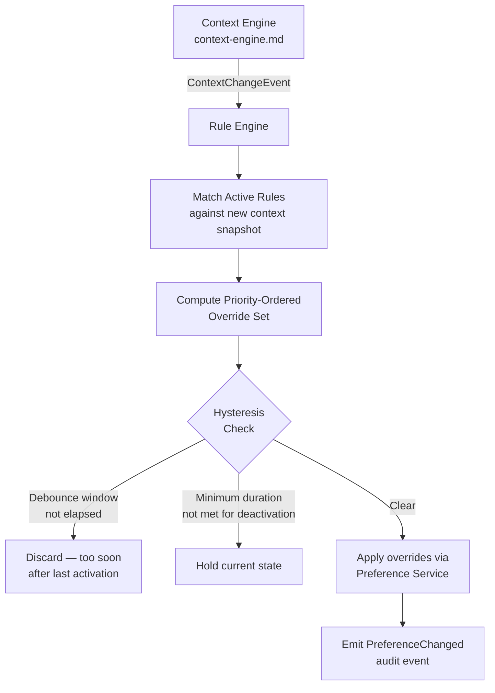

# AIOS Temporal and Contextual Preferences

Part of: [preferences.md](../preferences.md) — Preference System
**Related:** [data-model.md](./data-model.md) — ContextRule and ContextCondition types, [security.md](./security.md) — Capability-gated rule management, [intelligence.md](./intelligence.md) — AI-driven context pattern detection

-----

## 14. Temporal and Contextual Preferences

Context rules let users declare preferences that activate automatically when conditions are met: time of day, physical location, connected devices, detected activity, or power state. The `ContextRule`, `ContextCondition`, `ContextOverride`, and `ContextRuleSource` types that back this system are defined in [data-model.md §3.4](./data-model.md); this section describes how the engine evaluates them and the higher-level behaviors they enable.

-----

### 14.1 Context Rule Engine

The rule engine is the component that translates incoming context change events into active preference overrides. It sits between the Context Engine (which detects and publishes context signals) and the Preference Service (which holds the canonical preference state).

#### Evaluation Pipeline



Each step in the pipeline:

1. **Context snapshot** — The Context Engine emits a `ContextChangeEvent` whenever a tracked signal changes (time crossing a threshold, location fix update, device plug/unplug, activity classifier output). The Rule Engine receives the full context snapshot, not a diff.

2. **Rule matching** — For each enabled `ContextRule`, the engine evaluates all `conditions` in `Vec<ContextCondition>`. All conditions in a single rule must be satisfied simultaneously (AND semantics). Rules with `approved: false` are skipped.

3. **Priority resolution** — When multiple matching rules specify an override for the same `preference_id`, the rule with the highest `priority` field wins. If two rules share the same priority and conflict, the rule with the most recently activated timestamp wins. This deterministic tie-breaking prevents non-reproducible state.

4. **Override stacking** — Non-conflicting overrides from multiple active rules are merged. A `TimeOfDay` rule silencing notifications and a `DevicePresent` rule enlarging font scale can both be active simultaneously, applying their respective overrides independently.

5. **Hysteresis** — Two parameters prevent oscillation:
   - **Debounce window** (default 5 s): if the same rule toggled within the window, suppress the new activation. Prevents flicker when a location fix drifts across a geofence boundary.
   - **Minimum activation duration** (default 30 s): a rule that just activated cannot be deactivated until it has been continuously active for this duration. Prevents drive-by activations from transient sensor noise.

6. **Application** — Confirmed overrides are written to the Preference Service as `PreferenceSource::ContextDriven` entries. The Preference Service broadcasts `PreferenceChanged` events to subscribed components. See [data-model.md §3.1](./data-model.md) for the `PreferenceSource` variants.

7. **Audit** — Every rule activation and deactivation is written to the audit ring with the triggering `ContextRuleId`, the preference keys affected, and a timestamp. See [security.md §15.4](./security.md) for audit event structure.

Creating, modifying, or deleting context rules requires the `PreferenceRuleManage` capability as defined in [security.md §15.1](./security.md).

-----

### 14.2 Time-of-Day Scheduling

Time-of-day rules are the most common context rule variant. They map to `ContextCondition::TimeOfDay` and `ContextCondition::SolarEvent` (defined in [data-model.md §3.4](./data-model.md)).

#### Fixed Time Ranges

A fixed range specifies a start and end wall-clock time. The rule is active when the current local time falls within the interval. Overnight ranges (e.g., 20:00–07:00) are handled by the engine treating the interval as spanning midnight.

```rust
pub struct TemporalSchedule {
    /// Wall-clock activation time (local timezone)
    pub start: NaiveTime,
    /// Wall-clock deactivation time (local timezone)
    pub end: NaiveTime,
    /// Days of week this schedule is active (empty = all days)
    pub days: Vec<Weekday>,
    /// Optional solar anchor: override start/end with sunrise or sunset
    pub solar_anchor: Option<SolarAnchor>,
}

pub enum SolarAnchor {
    /// Replace `start` with computed sunrise time ± offset
    Sunrise { offset: Duration },
    /// Replace `start` with computed sunset time ± offset
    Sunset { offset: Duration },
}
```

#### Sunrise/Sunset Dynamic Schedules

Solar schedules use the user's current location and the Gregorian calendar to compute today's sunrise and sunset times. The computation runs on-device — no network request is made. Location access for solar calculation uses the coarse location tier (city-level) and is subject to the same on-device privacy constraints described in §14.3.

Example: "dark mode after sunset" creates a `ContextCondition::SolarEvent { event: SolarEvent::Sunset, offset: Duration::ZERO }` condition. The engine recomputes the activation timestamp each day at midnight.

#### Recurring Schedules

Weekday and weekend differentiation is expressed via the `days` field on `TemporalSchedule`. Common patterns:

```text
Weekday mornings: days=[Mon, Tue, Wed, Thu, Fri], start=07:00, end=09:00
Weekend wind-down: days=[Sat, Sun], start=22:00, end=08:00
Every day:        days=[] (empty = all days active)
```

-----

### 14.3 Location-Aware Preferences

Location rules activate when the device enters or dwells within a named geofence. They map to `ContextCondition::Location` (defined in [data-model.md §3.4](./data-model.md)).

#### Geofence Definition

```rust
pub struct Geofence {
    /// Display name ("Home", "Office", "Gym")
    pub name: String,
    /// Center of the geofence (WGS-84 decimal degrees)
    pub center: GeoPoint,
    /// Activation radius in meters
    pub radius_meters: f64,
    /// Minimum time inside fence before activating (prevents drive-by)
    pub dwell_seconds: u32,
    /// Minimum time outside fence before deactivating (prevents edge flicker)
    pub exit_hysteresis_seconds: u32,
}
```

Entry triggers fire after the dwell period expires — the device must remain inside the fence continuously for `dwell_seconds` before the rule activates. Exit triggers are similarly guarded by `exit_hysteresis_seconds`.

#### Privacy Constraints

Location data for preference rules is processed entirely on-device:

- Raw GPS coordinates are never written to a Space or transmitted over the network.
- Geofence definitions (name + center + radius) are stored in the local Preference Store only, encrypted at rest using the device key. They are excluded from cross-device sync.
- The rule engine receives location fixes from the Context Engine at city-level granularity (±1 km) for geofences with `radius_meters > 500`. Finer-grained fixes are used only for smaller radii.
- Location anonymization details are in [security.md §15.7](./security.md).

User control: the Preferences UI shows a map visualization of all active geofences. Individual fences can be disabled or deleted at any time. Disabling a geofence does not delete its associated `ContextRule` — it sets `approved: false` on the rule.

-----

### 14.4 Activity-Aware Preferences

Activity rules activate when the AIRS Context Engine classifies the user's current activity with sufficient confidence. They map to `ContextCondition::Activity` (defined in [data-model.md §3.4](./data-model.md)).

#### Activity Types and Preference Profiles

| Activity | Typical Preference Overrides |
|---|---|
| `Meeting` | Notifications silenced, volume lowered, screen dimmed |
| `FocusedWork` | Notification batching enabled, attention mode active |
| `Exercising` | Display brightness maximum, audio output to headphones |
| `Commuting` | Reading mode on, battery saver enabled |
| `Sleeping` | All non-alarm notifications suppressed, Night Shift active |

The mapping from activity to override set is user-configurable — the table above describes defaults, not fixed behavior.

#### Confidence Thresholds

Activity detection from the Context Engine carries a confidence score (0.0–1.0). The rule engine applies a per-activity minimum confidence threshold before activating an activity-based rule. Default thresholds:

```text
Meeting:      0.85  (false positives disruptive during non-meeting calls)
FocusedWork:  0.70  (less disruptive; user can easily override)
Exercising:   0.80  (GPS + accelerometer signal usually reliable)
Commuting:    0.75  (transit motion + time-of-day)
Sleeping:     0.90  (high threshold; wrong activation suppresses all alerts)
```

Users can adjust these thresholds per-activity from Settings. The Context Engine architecture and activity classification models are described in [context-engine.md](../context-engine.md).

-----

### 14.5 Device-Presence Triggers

Device-presence rules activate when a specific class of hardware is connected or disconnected. They map to `ContextCondition::DevicePresent` (defined in [data-model.md §3.4](./data-model.md)).

#### Common Device-Presence Patterns

| Device Class | Typical Preference Overrides |
|---|---|
| `ExternalMonitor` | Display layout to "desktop", font scale increased, sidebar expanded |
| `WiredHeadphones` | Volume restored to headphone level, spatial audio enabled |
| `BluetoothHeadset` | Audio output routed to headset, microphone source switched |
| `BluetoothSpeaker` | Audio output routed to speaker, stereo widening enabled |
| `PhysicalKeyboard` | On-screen keyboard hidden, keyboard shortcuts layer activated |
| `Stylus` | Palm rejection enabled, drawing tool affordances shown |

Device connection events originate from the USB and Bluetooth subsystems, processed through the device model described in `docs/kernel/device-model.md`. The Context Engine aggregates these events before forwarding them to the Rule Engine as `ContextChangeEvent::DevicePresent` or `ContextChangeEvent::DeviceRemoved`.

Device-presence rules activate immediately on connection (no dwell time) and deactivate immediately on disconnection, since hardware attach/detach events are discrete rather than continuous.

-----

### 14.6 Rule Composition and Interaction

#### AND Conditions Within a Rule

All `ContextCondition` entries in a single `ContextRule.conditions` vector must be simultaneously satisfied for the rule to activate. This enables compound rules:

```text
"Desktop focus mode" rule:
  conditions:
    - DevicePresent { device_class: ExternalMonitor }
    - TimeOfDay { start: 09:00, end: 18:00 }
    - DayOfWeek { days: [Mon, Tue, Wed, Thu, Fri] }
  overrides:
    - display.layout = "desktop"
    - notifications.batch_interval = 30min
    - attention.focus_mode = true
```

This rule is only active when an external monitor is connected during business hours on weekdays.

#### Override Stacking Across Rules

When multiple rules are simultaneously active and their overrides do not conflict, all overrides are applied. Example: a `TimeOfDay` rule sets `display.night_shift = true` and a `DevicePresent` rule sets `audio.output_device = "bluetooth_speaker"`. Both overrides are active at the same time — no conflict, both applied.

When overrides do conflict (two rules setting different values for `display.font_scale`), priority determines which wins. The losing rule's other, non-conflicting overrides are still applied.

#### User Override Precedence

The user always has final authority. A preference set via the Conversation Bar or Settings UI creates a `PreferenceSource::UserExplicit` entry. The rule engine treats `UserExplicit` source values as a veto: if a user has explicitly set a preference within the last `user_override_ttl` (default 4 hours), context rules do not override that preference. After the TTL expires, the rule engine resumes managing the preference.

This prevents the frustrating pattern of a user manually adjusting a preference only to have the system immediately revert it. The TTL is configurable per-preference and can be set to infinity ("never auto-revert").

-----

### 14.7 Conversational Rule Creation

Users create context rules by describing them in natural language via the Conversation Bar. The NLU pipeline described in [resolution.md §5](./resolution.md) parses the intent and constructs a `ContextRule` for user confirmation before saving.

#### Example Transformations

```text
"When I'm at work, set volume to 30%"
→ ContextRule {
    name: "At work",
    conditions: [Location { center: <current location>, radius_meters: 200, name: "work" }],
    overrides: [ContextOverride { preference_id: "audio.master_volume", value: Range(30)... }],
    source: ContextRuleSource::UserCreated,
  }
  + prompt: "I'll use your current location as 'work'. Does that look right? [Map view]"

"Dark mode after sunset"
→ ContextRule {
    name: "After sunset",
    conditions: [SolarEvent { event: SolarEvent::Sunset, offset: Duration::ZERO }],
    overrides: [ContextOverride { preference_id: "display.theme", value: Enum("dark") }],
    source: ContextRuleSource::UserCreated,
  }
  + prompt: "Dark mode will activate at sunset (~19:42 today). Enable?"

"Focus mode when in meetings"
→ ContextRule {
    name: "During meetings",
    conditions: [Activity { activity: ActivityType::Meeting }],
    overrides: [ContextOverride { preference_id: "attention.focus_mode", value: Bool(true) }],
    source: ContextRuleSource::UserCreated,
  }
  + prompt: "Focus mode will activate when I detect you're in a meeting. Enable?"
```

#### Confirmation and Approval

Every conversationally-created rule is presented to the user for explicit confirmation before `approved` is set to `true`. The UI shows:

- A plain-language summary of what the rule will do and when.
- A preview of the affected preferences and their new values.
- For location rules: a map view of the geofence.
- For solar rules: today's computed activation time.

Confirmed rules are stored with `source: ContextRuleSource::UserCreated`. AIRS-suggested rules (proactively offered based on detected patterns — see [intelligence.md](./intelligence.md)) use `ContextRuleSource::AirsSuggested` and require the same confirmation step before activation.

Enterprise-defined rules are delivered via the MDM policy channel with `source: ContextRuleSource::EnterprisePolicy`. They do not require per-user confirmation but are visible in the Settings UI and can be inspected (though not modified) by the user. Capability requirements for enterprise rule delivery are in [security.md §15.1](./security.md).
