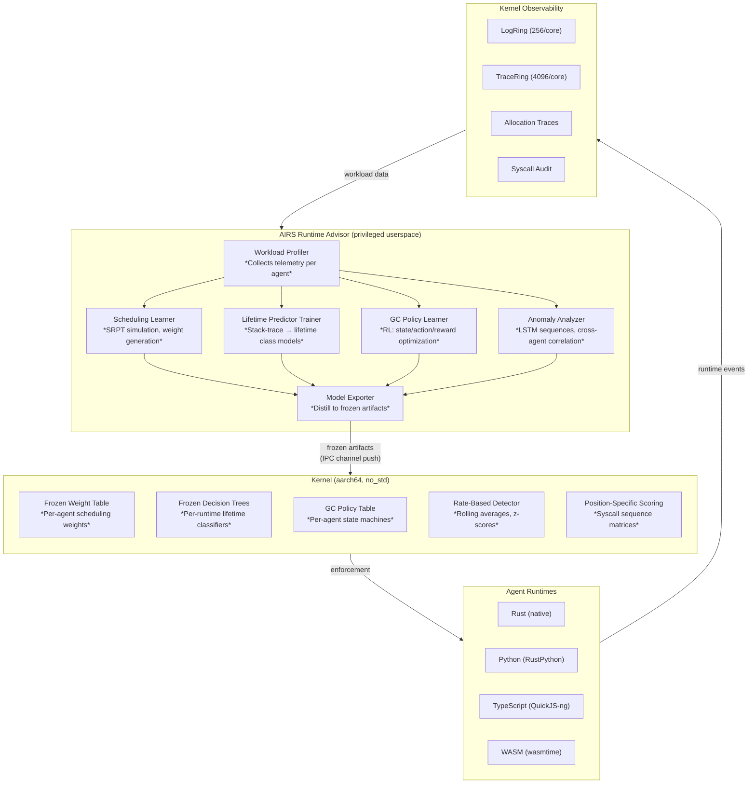
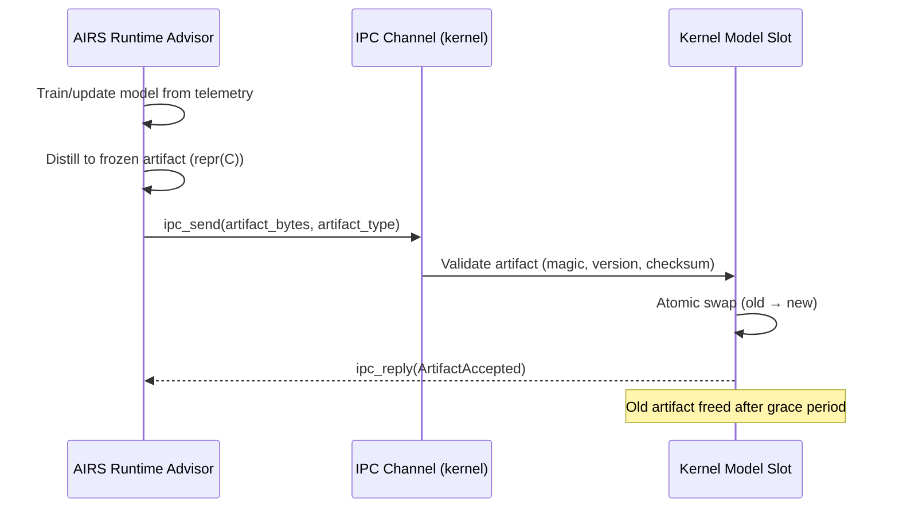

# AIOS Runtime Advisor

**Parent document:** [airs.md](./airs.md) — AI Runtime Service
**Related:** [language-ecosystem/ai.md](../project/language-ecosystem/ai.md) — Language ecosystem AI optimization, [scheduler.md](../kernel/scheduler.md) — Kernel scheduler, [memory/physical.md](../kernel/memory/physical.md) — Physical memory & slab allocator, [model.md](../security/model.md) — Security model

-----

## 1. Core Insight

Operating systems traditionally treat runtime optimization as static configuration — scheduling priorities fixed at launch, allocator strategies chosen at compile time, GC thresholds hardcoded. The administrator (or developer) must predict workload behavior in advance and encode it into configuration files. When workloads shift, the configuration is stale.

AIOS replaces static configuration with a **two-tier learned optimization architecture**. The AI Runtime Service (AIRS) continuously observes agent workload patterns across all four language runtimes (Rust, Python/RustPython, TypeScript/QuickJS-ng, WASM/wasmtime) and trains per-agent optimization models. These models are distilled into lightweight **frozen artifacts** — decision trees, weight tables, policy state machines — and pushed to the kernel for microsecond-latency execution. The kernel never depends on AIRS for correctness; frozen models provide sensible defaults that AIRS periodically refines.

This architecture is informed by a convergent trend in systems research: **ALPS** (USENIX ATC'24) decouples scheduling policy learning from kernel enforcement, **LLAMA** (Google ASPLOS'20) trains lifetime predictors offline and deploys them as allocation-site classifiers, **ghOSt** (Google SOSP'21) delegates scheduling decisions to userspace, and **sched_ext** (Linux 6.12+) loads scheduling policies as BPF programs. AIOS unifies these ideas under a single framework where AIRS is the learning frontend and the kernel is the enforcement backend.

**What makes AIOS unique:** Per-agent behavioral models. Where ALPS learns fleet-wide scheduling weights and LLAMA trains per-binary lifetime predictors, AIOS trains per-agent models that account for the agent's specific runtime, manifest capabilities, historical workload, and current context. An agent's scheduling weights, allocation hints, GC policy, and behavioral baseline form a coherent **runtime profile** that evolves with the agent.

-----

## 2. Architecture



### Two-Tier Model

| Tier | Location | Latency | AIRS Required? | Artifacts |
|---|---|---|---|---|
| **Kernel-internal ML** | Kernel address space (`no_std`) | Microseconds | Training: yes. Inference: no. | Frozen weight tables, decision trees, scoring matrices, policy state machines |
| **AIRS-dependent** | AIRS userspace service | Milliseconds–seconds | Always | LSTM models, RL policies, LLM analysis, cross-agent correlation |

The kernel always has valid defaults. AIRS-pushed artifacts are optimizations. If AIRS crashes, restarts, or is unavailable, the kernel continues with the last-pushed frozen models (or factory defaults if none were ever pushed).

### Frozen Artifact Update Protocol



All frozen artifacts use a common envelope:

```rust
/// Common header for all frozen artifacts pushed by AIRS.
/// repr(C) for stable ABI across AIRS/kernel boundary.
#[repr(C)]
pub struct FrozenArtifactHeader {
    /// Magic number identifying artifact type
    pub magic: u64,
    /// Artifact format version (monotonically increasing)
    pub version: u32,
    /// CRC-32C of payload bytes (after header)
    pub checksum: u32,
    /// Total size including header (bytes)
    pub total_size: u32,
    /// Agent or runtime type this artifact applies to
    pub target: ArtifactTarget,
    /// Timestamp when AIRS generated this artifact
    pub generated_at: u64,
}

#[repr(C)]
pub enum ArtifactTarget {
    /// Applies to a specific agent (by AgentId)
    Agent(u64),
    /// Applies to all agents of a runtime type
    RuntimeType(RuntimeType),
    /// Applies globally (all agents, all runtimes)
    Global,
}

#[repr(u8)]
pub enum RuntimeType {
    Rust = 0,
    Python = 1,
    TypeScript = 2,
    Wasm = 3,
}
```

-----

## Document Map

| Document | Sections | Content |
|---|---|---|
| **This file** | §1, §2, §11, §12 | Core insight, architecture, design principles, implementation order |
| [scheduling.md](./runtime-advisor/scheduling.md) | §3, §4 | Learned scheduling weights — AIRS learning frontend and kernel scheduler backend |
| [allocation.md](./runtime-advisor/allocation.md) | §5, §6 | Lifetime-aware allocation — AIRS lifetime prediction and kernel slab integration |
| [gc-scheduling.md](./runtime-advisor/gc-scheduling.md) | §7, §8 | GC scheduling optimization — AIRS RL-based policy learning and runtime GC hooks |
| [anomaly-detection.md](./runtime-advisor/anomaly-detection.md) | §9, §10 | Behavioral anomaly detection — three detection layers and response pipeline |

-----

## 11. Design Principles

1. **Kernel independence.** The kernel never blocks on AIRS. Frozen artifacts are pre-validated, pre-sized, and atomically swapped. If AIRS is unavailable, the kernel uses factory defaults or the last-pushed artifact.

2. **Per-agent granularity.** Each agent gets its own scheduling weights, lifetime predictor, GC policy, and behavioral baseline. Fleet-wide models are a fallback, not the primary path.

3. **Two-tier separation.** Training complexity lives in AIRS (userspace, with access to LLMs and RL frameworks). Inference complexity lives in the kernel (frozen tables, decision trees, fixed-size matrices). The kernel never runs gradient descent.

4. **Observable by design.** Every frozen artifact update is logged. Every anomaly detection decision is auditable. Every scheduling weight change is traceable to the telemetry that caused it.

5. **Defense in depth.** ML-based anomaly detection is always backed by hard capability enforcement. Adversarial evasion of ML models cannot bypass the capability system. ML is an optimization over the security baseline, not a replacement for it.

6. **Graceful degradation.** Without AIRS: factory defaults. With AIRS but no telemetry: conservative models. With full telemetry: per-agent optimized models. The system improves monotonically as more data becomes available.

7. **Stable ABI.** All frozen artifacts use `repr(C)` with versioned headers. AIRS and kernel can be updated independently as long as artifact format versions are compatible.

-----

## 12. Implementation Order

| Phase | Component | Dependency |
|---|---|---|
| Phase 13 | Rate-based anomaly detection (kernel-internal) | Observability (Phase 2), capability system (Phase 3) |
| Phase 13 | Automatic capability minimization (`aios agent audit`) | AIRS inference engine, agent manifest format |
| Phase 16 | Runtime Advisor CLI (`aios agent audit` runtime recommendations) | AIRS Stage 1 static analysis, language runtimes |
| Phase 21 | Learned scheduling weights | AIRS workload profiler, kernel scheduler telemetry |
| Phase 21 | Lifetime-aware allocation | AIRS allocation trace collection, slab allocator telemetry |
| Phase 21 | GC scheduling optimization | AIRS RL training, interpreter GC hooks |
| Phase 21 | LSTM sequence-based anomaly detection | AIRS inference engine, syscall audit traces |
| Phase 21 | Cross-agent semantic anomaly correlation | AIRS LLM inference, provenance graphs |

**Profiling infrastructure first.** Phases 2-3 build the telemetry foundation (LogRing, TraceRing, syscall audit). Phase 13 adds kernel-internal rate-based detection using that telemetry. Phase 21 adds the full AIRS learning loop that consumes telemetry and produces frozen artifacts.

-----

## Cross-Reference Index

| Section | Sub-File | External References |
|---|---|---|
| §1 | This file | [airs.md](./airs.md) §1-2, [language-ecosystem/ai.md](../project/language-ecosystem/ai.md) §13 |
| §2 | This file | [airs/intelligence-services.md](./airs/intelligence-services.md) §5.5, §5.9 |
| §3 | [scheduling.md](./runtime-advisor/scheduling.md) | [scheduler.md](../kernel/scheduler.md) §3, §5, §16 |
| §4 | [scheduling.md](./runtime-advisor/scheduling.md) | [scheduler.md](../kernel/scheduler.md) §3.1, §7 |
| §5 | [allocation.md](./runtime-advisor/allocation.md) | [memory/physical.md](../kernel/memory/physical.md) §4.1 |
| §6 | [allocation.md](./runtime-advisor/allocation.md) | [memory/physical.md](../kernel/memory/physical.md) §4.1-4.2 |
| §7 | [gc-scheduling.md](./runtime-advisor/gc-scheduling.md) | [language-ecosystem/runtimes.md](../project/language-ecosystem/runtimes.md) §3, §4 |
| §8 | [gc-scheduling.md](./runtime-advisor/gc-scheduling.md) | [language-ecosystem/integration.md](../project/language-ecosystem/integration.md) §8 |
| §9 | [anomaly-detection.md](./runtime-advisor/anomaly-detection.md) | [airs/intelligence-services.md](./airs/intelligence-services.md) §5.5, [model.md](../security/model.md) §1.2 |
| §10 | [anomaly-detection.md](./runtime-advisor/anomaly-detection.md) | [model.md](../security/model.md) §2, §6 |

-----

## References

### Foundational Systems

- [ALPS](https://www.usenix.org/conference/atc24/presentation/fu) — Adaptive Learning Priority Scheduler (USENIX ATC'24). Decoupled frontend/backend learned scheduling. 57.2% latency reduction.
- [ghOSt](https://dl.acm.org/doi/10.1145/3477132.3483542) — Delegating scheduling to userspace (Google, SOSP'21). Microsecond-scale policy decisions via shared memory.
- [sched_ext](https://lwn.net/Articles/922405/) — BPF extensible scheduler framework (Linux 6.12+). Meta/Google production deployment.
- [EEVDF](https://lwn.net/Articles/925371/) — Eligible Earliest Virtual Deadline First (Linux 6.6+). CFS replacement.
- [LLAMA](https://cacm.acm.org/research-highlights/combining-machine-learning-and-lifetime-based-resource-management-for-memory-allocation-and-beyond/) — Lifetime-aware memory allocation (Google, ASPLOS'20, CACM'24). 78% fragmentation reduction.
- [Learned GC](https://dl.acm.org/doi/10.1145/3394450.3397469) — RL for garbage collection scheduling (MAPL'20).
- [iGC](https://doi.org/10.1016/j.knosys.2025.113073) — Hierarchical RL garbage collection (Knowledge-Based Systems 2025). 37% response time reduction.

### Anomaly Detection

- [LIGHT-HIDS](https://arxiv.org/abs/2501.00000) — Compressed neural network for syscall anomaly detection (2025). 75x faster inference.
- [CAPTAIN](https://www.ndss-symposium.org/ndss-paper/captain/) — Streaming provenance graph processing (NDSS'25).
- [Tetragon](https://github.com/cilium/tetragon) — eBPF-based runtime enforcement (Cilium). <1% overhead.
- [MiniScope](https://arxiv.org/pdf/2512.11147) — Least privilege for tool-calling agents (2024).
- [Progent](https://arxiv.org/html/2504.11703v1) — Programmable privilege control for LLM agents (2025).

### Additional Research

- [MobiRL](https://doi.org/10.1145/3674700) — DDPG-based CPU/GPU frequency scheduling (ACM TACO'24). 42.8% power reduction.
- [OS-R1](https://arxiv.org/abs/2503.00000) — LLM agent + RL for kernel configuration tuning (2025).
- [TCMalloc Warehouse-Scale](https://dl.acm.org/doi/10.1145/3617232.3624853) — Fleet-wide allocation characterization (ASPLOS'24).
- [Jade](https://dl.acm.org/doi/10.1145/3627703.3629567) — Sub-millisecond concurrent GC (EuroSys'24).
