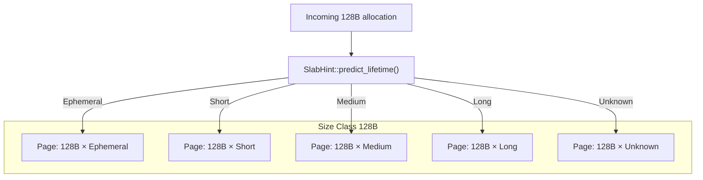
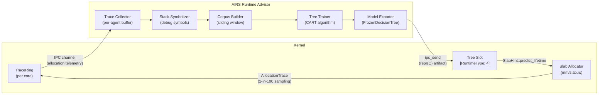

# AIOS Runtime Advisor: Lifetime-Aware Allocation

Part of: [runtime-advisor.md](../runtime-advisor.md) — AIRS Runtime Advisor
**Related:** [scheduling.md](./scheduling.md) — Learned scheduling, [gc-scheduling.md](./gc-scheduling.md) — GC scheduling, [anomaly-detection.md](./anomaly-detection.md) — Anomaly detection

-----

## 5. AIRS Lifetime Prediction Training

The core insight motivating lifetime-aware allocation is that most allocations in a given codebase fall into predictable lifetime classes. A request-processing buffer lives for milliseconds; an interpreter module object lives for minutes. When the allocator places these side-by-side on the same slab page, the short-lived buffer's death leaves a hole that fragments the page until the module object is eventually freed. The page cannot be reclaimed.

AIRS trains per-runtime lifetime predictors from observed allocation traces and exports them as frozen decision trees. The kernel slab allocator uses these trees to tag pages with a dominant lifetime class, grouping allocations that tend to die together. This reduces fragmentation and enables bulk reclamation of Ephemeral pages without scanning Long-lived pages.

### 5.1 Allocation Trace Collection

The kernel's TraceRing infrastructure collects allocation events into `AllocationTrace` records. Collection is sampling-based — 1-in-100 allocations are traced by default, configurable per-agent via the agent manifest. Sampling rate can be raised temporarily when AIRS detects high fragmentation pressure.

```rust
/// Allocation event record captured by kernel telemetry.
/// repr(C) for stable layout in TraceRing shared memory.
#[repr(C)]
pub struct AllocationTrace {
    /// Hash of source location (file:line), computed at compile time
    pub allocation_site: u64,
    /// Hash of top-4 stack frames at allocation point
    pub call_stack_hash: u64,
    /// Slab size class: 64, 128, 256, 512, or 4096
    pub size_class: u16,
    /// Language runtime executing this allocation
    pub runtime_type: RuntimeType,
    pub _padding: [u8; 5],
    /// CNTPCT_EL0 counter value at allocation
    pub alloc_timestamp: u64,
    /// CNTPCT_EL0 counter value at deallocation (0 if still live)
    pub free_timestamp: u64,
}
```

The observed lifetime of an allocation is `free_timestamp - alloc_timestamp`. Traces with `free_timestamp == 0` are still-live allocations; they are retained in the training corpus and updated when deallocation is observed.

Traces flow from the kernel TraceRing to AIRS via an IPC channel dedicated to allocation telemetry. AIRS buffers traces per-agent and per-runtime, building a training corpus over a sliding window of recent activity.

### 5.2 Stack Trace Symbolization

Raw `call_stack_hash` values identify call sites by hash but carry no semantic information. AIRS symbolizes them into function-name sequences using debug information from agent binaries. This symbolization is not available to the kernel — it requires access to agent debug symbols, which AIRS holds as part of its agent lifecycle management.

The symbolization approach is inspired by **LLAMA** (Google ASPLOS'20, CACM'24), which demonstrated that treating call stacks as "sentences" — sequences of function names — enables learned classifiers to generalize across allocation sites that share semantic patterns even when they differ in exact address. A stack ending in `json_parse → alloc_string` predicts Ephemeral lifetime regardless of which JSON parser version was compiled.

```text
Raw hash:       0xA3F9_21BC_4D78_0012
Symbolized:     ["json_parse", "alloc_string_value", "slab_alloc_64"]
Lookup basis:   Agent binary debug symbols (DWARF, held by AIRS)
```

Symbolized call stacks are stored in the per-agent training corpus alongside observed lifetimes. Function names are interned as 32-bit identifiers for storage efficiency.

### 5.3 Lifetime Predictor Training

AIRS trains one decision tree per runtime type — four trees in total covering Rust, Python, TypeScript, and WASM. Python allocations exhibit different lifetime distributions than WASM allocations even for the same logical operation, because interpreter state management and garbage collection interact differently with each runtime's allocation patterns.

Training uses the CART (Classification and Regression Trees) algorithm on the collected trace corpus. The choice of decision tree over a neural network is deliberate: decision trees can be serialized as fixed-size arrays of integer comparisons, making them suitable for export as frozen kernel artifacts. The kernel never runs gradient descent or backpropagation.

**Input features** (per allocation trace):

| Feature | Encoding | Notes |
|---|---|---|
| `runtime_type` | u8 (0–3) | Rust/Python/TypeScript/WASM |
| `allocation_site` | u64 hash | Hashed source location |
| `call_stack_hash` | u64 hash | Hashed top-4 frames |
| `size_class` | u16 | One of 64/128/256/512/4096 |
| `context_mode` | u8 | Agent context from Context Engine |

**Output:** `LifetimeClass` — Ephemeral / Short / Medium / Long (see §6.1).

**Training constraints:**

- Maximum tree depth: 8 levels (→ at most 255 internal nodes)
- Model size target: ≤ 1 KB per runtime type after serialization
- Retraining cadence: triggered when AIRS detects allocation fragmentation exceeds a threshold, or on a time-based schedule (default: every 30 minutes of agent activity)

The LLAMA deployment at Google achieved 78% fragmentation reduction using a similar lifetime classification approach. AIOS targets comparable gains on embedded and edge workloads where memory is more constrained.

### 5.4 Research Context

The lifetime prediction design draws on several converging research directions:

**LLAMA** (ASPLOS'20, CACM'24) — Google's production deployment of lifetime-aware allocation. Used LSTM models trained on symbolized stack traces; AIOS adapts the call-stack-as-sentence insight while replacing LSTM with decision trees for kernel-internal inference feasibility.

**TCMalloc Warehouse-Scale Study** (ASPLOS'24) — Fleet-wide allocation profiling at Google. Demonstrated 8.1% dTLB miss reduction through dynamic per-CPU cache sizing and topology-aware NUMA placement. Informs AIOS pool design for DMA-adjacent allocations.

**Linux `/proc/allocinfo`** (merged 2024) — Per-allocation-site profiling in Linux mainline. Provides an open-source reference for allocation telemetry infrastructure; AIOS TraceRing provides equivalent data via a kernel-native ring buffer rather than a procfs interface.

**SpeedMalloc** (2025) — Dedicated allocation core to reduce cache pollution from metadata operations. Relevant to AIOS DMA pool design, where allocation metadata must not pollute L1/L2 caches shared with device DMA paths.

-----

## 6. Kernel Slab Allocator Integration

The kernel slab allocator in `kernel/src/mm/slab.rs` maintains five size classes (64, 128, 256, 512, 4096 bytes), each backed by a pool of slab pages. Within a size class, pages are currently undifferentiated — a 128-byte Ephemeral allocation and a 128-byte Long allocation may land on the same page.

Lifetime-aware allocation extends the slab by adding a `LifetimeClass` tag to each slab page. The allocator uses the frozen decision tree to predict the lifetime of an incoming allocation, then steers it toward a page tagged with the matching class. Allocations of different lifetime classes are placed on separate pages, enabling bulk reclamation when all objects on an Ephemeral page are freed.

### 6.1 LifetimeClass Enum

```rust
/// Predicted object lifetime classification for slab placement.
/// Used to tag slab pages and steer allocations toward co-located objects.
#[repr(u8)]
pub enum LifetimeClass {
    /// < 10 ms — IPC message buffers, temporary strings, request-scoped values
    Ephemeral = 0,
    /// 10 ms – 1 s — request processing state, query result buffers
    Short = 1,
    /// 1 s – 60 s — cached data structures, interpreter frame objects
    Medium = 2,
    /// > 60 s — agent heap objects, loaded modules, persistent caches
    Long = 3,
    /// No prediction available — use standard slab behavior
    Unknown = 255,
}
```

Boundaries between classes are approximate and tunable. The thresholds above reflect typical embedded/edge workload distributions; AIRS may adjust them per-agent based on observed lifetime histograms.

### 6.2 Frozen Decision Tree Format

Each frozen decision tree is a flat array of `DecisionNode` records prefixed by the standard `FrozenArtifactHeader` (defined in `runtime-advisor.md` §2). The tree is walked from node 0; at each node, the feature at `feature_index` is compared to `threshold` and execution follows `left_child` (feature < threshold) or `right_child` (feature ≥ threshold). A node is a leaf when both children equal `0xFFFF`.

```rust
pub const DECISION_TREE_MAGIC: u64 = 0x4149_4F53_4C44_5400; // "AIOSLDT\0"
pub const MAX_TREE_NODES: usize = 255; // depth ≤ 8 → max 255 internal nodes

/// Frozen lifetime decision tree exported from AIRS to kernel.
/// Total size: FrozenArtifactHeader (32B) + 8B metadata + 255×16B nodes = ~4120B
#[repr(C)]
pub struct FrozenDecisionTree {
    pub header: FrozenArtifactHeader,
    /// Number of valid nodes in the `nodes` array
    pub node_count: u16,
    pub _padding: [u8; 6],
    pub nodes: [DecisionNode; MAX_TREE_NODES],
}

/// Single node in a frozen decision tree (16 bytes, no padding holes).
/// Leaf nodes have left_child == right_child == 0xFFFF.
/// Fields ordered for natural alignment: u64 first, then u16s, then u8s.
#[repr(C)]
pub struct DecisionNode {
    /// Split threshold; interpretation depends on feature type
    pub threshold: u64,
    /// Index of left child (feature < threshold), or 0xFFFF for leaf
    pub left_child: u16,
    /// Index of right child (feature ≥ threshold), or 0xFFFF for leaf
    pub right_child: u16,
    /// Index into the feature vector (see §5.3 feature table)
    pub feature_index: u8,
    /// Predicted LifetimeClass; valid only when this is a leaf node
    pub leaf_class: LifetimeClass,
    pub _padding: [u8; 2],
}
```

Tree inference is O(depth) = O(8) — at most 8 comparisons from root to leaf. At kernel slab allocation speeds (nanosecond-scale), this is acceptable overhead.

One `FrozenDecisionTree` exists per `RuntimeType`. The kernel maintains four tree slots indexed by `RuntimeType`:

```text
slot[0] = Rust tree     (~4120B)
slot[1] = Python tree   (~4120B)
slot[2] = TypeScript tree (~4120B)
slot[3] = WASM tree     (~4120B)
Total:                  ~16.5KB for all four runtime trees
```

### 6.3 Slab Hint API

The slab allocator queries lifetime predictions through a `SlabHint` trait. This indirection allows the slab to function correctly when no frozen tree has been pushed (returning `LifetimeClass::Unknown`) and allows unit testing with stub implementations.

```rust
/// Trait for querying lifetime predictions from frozen decision trees.
/// Implemented by the kernel model slot that holds the current tree.
pub trait SlabHint {
    /// Predict the lifetime class for an allocation.
    ///
    /// Returns `LifetimeClass::Unknown` if no tree is available for
    /// `runtime_type`, or if the tree has not yet been populated by AIRS.
    fn predict_lifetime(
        &self,
        allocation_site: u64,
        call_stack_hash: u64,
        size_class: u16,
        runtime_type: RuntimeType,
    ) -> LifetimeClass;
}
```

The production implementation walks the frozen decision tree for the given `runtime_type`, extracts the feature vector from its arguments, and follows the decision path to a leaf. The `Unknown` return value for missing trees is not an error — it is the designed cold-start behavior.

### 6.4 Per-Page Lifetime Co-location

Slab pages are tagged with a `LifetimeClass` at the time they are allocated from the buddy allocator. The tagging strategy:

1. On allocation, call `SlabHint::predict_lifetime` with the site hash and runtime type.
2. Locate a free slot on an existing slab page tagged with the predicted `LifetimeClass`.
3. If no such page has a free slot, allocate a new page from the frame allocator and tag it with the predicted class.
4. Place the object on the selected page.

The existing five size classes (64, 128, 256, 512, 4096 bytes) are orthogonal to lifetime classes. A 128-byte Ephemeral allocation goes to a 128-byte slab page tagged Ephemeral; a 128-byte Long allocation goes to a 128-byte slab page tagged Long. This produces a 5 × 4 grid of page populations within the slab.



**Reclamation benefit:** When all objects on an Ephemeral page are freed, the page is immediately eligible for return to the buddy allocator. The kernel reclamation path checks whether a slab page is entirely free before returning it; with co-location, Ephemeral pages reach this state much more often than mixed pages would. Long pages are never polluted by short-lived allocations and are not reclamation candidates during normal operation.

### 6.5 Fallback Behavior

Lifetime-aware allocation is always an optimization over the standard slab path. Correctness never depends on prediction accuracy:

| Condition | Behavior | Consequence |
|---|---|---|
| No frozen tree pushed by AIRS | All predictions return `Unknown` | Standard slab behavior; no lifetime tagging |
| AIRS unavailable or crashed | Last-pushed tree remains in slot | Predictions continue with potentially stale model |
| Stale tree (workload shifted) | Predictions may be wrong class | Increased fragmentation; no correctness impact |
| Invalid tree (bad checksum) | Rejected on push; old tree retained | No regression from pre-push state |
| Prediction wrong for one object | Object placed on wrong-class page | That page's reclamation delayed; no semantic error |

The last point is worth emphasizing: a misprediction places an allocation on a page with a different lifetime class. The object will be freed correctly; the only consequence is that the page may not be reclaimed as promptly as it would be with correct co-location. Memory safety is never at risk.

-----

## Training-to-Slab Data Flow



The kernel side of this loop runs entirely without blocking on AIRS. The TraceRing drains to AIRS asynchronously; the tree slot holds the last-pushed artifact and is read-only during inference. AIRS participates in the loop only during training and export — never during the hot allocation path.

-----

## Cross-References

| Section | External Document | Relevant Content |
|---|---|---|
| §5.1 Trace collection | [kernel/observability.md](../../kernel/observability.md) | TraceRing layout and drain semantics |
| §5.1 Trace collection | [memory/physical.md](../../kernel/memory/physical.md) §4.1 | Slab allocator structure |
| §5.2 Symbolization | [intelligence/airs/lifecycle-and-data.md](../airs/lifecycle-and-data.md) §6 | Agent lifecycle and binary access |
| §6.2 Artifact header | [runtime-advisor.md](../runtime-advisor.md) §2 | `FrozenArtifactHeader`, `ArtifactTarget`, `RuntimeType` |
| §6.3 SlabHint | [memory/physical.md](../../kernel/memory/physical.md) §4.1–§4.2 | SlabCache and magazine layer |
| §6.4 Co-location | [memory/reclamation.md](../../kernel/memory/reclamation.md) §8 | Memory pressure and reclamation triggers |
| §6.5 Fallback | [runtime-advisor.md](../runtime-advisor.md) §11 | Kernel independence design principle |
