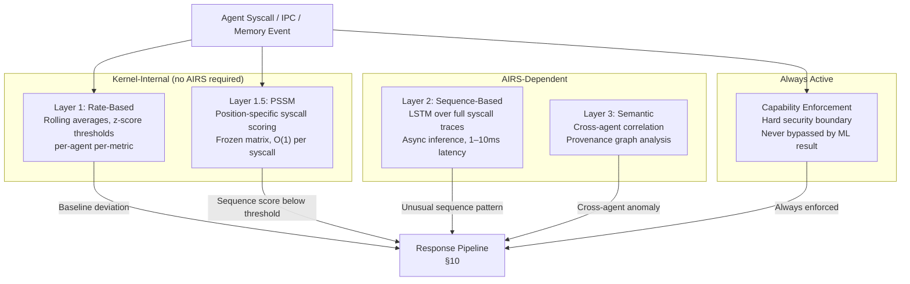
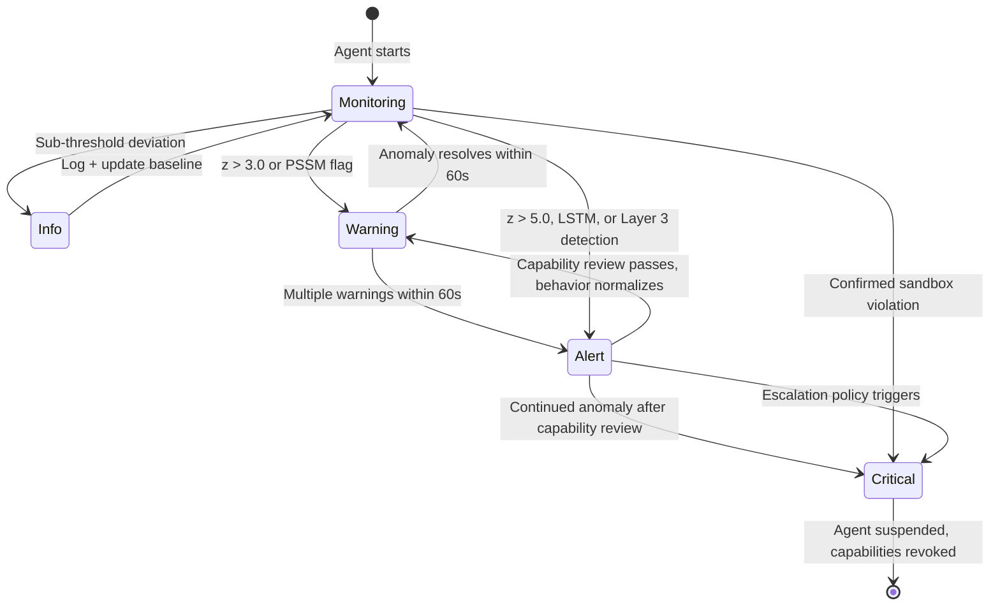

# AIOS Runtime Advisor: Behavioral Anomaly Detection

Part of: [runtime-advisor.md](../runtime-advisor.md) — AIRS Runtime Advisor
**Related:** [scheduling.md](./scheduling.md) — Learned scheduling, [allocation.md](./allocation.md) — Lifetime-aware allocation, [gc-scheduling.md](./gc-scheduling.md) — GC scheduling

-----

## 9. Detection Layers

### 9.1 Overview — Three Detection Layers

The behavioral anomaly detection system operates as a layered pipeline. Each layer catches a different class of attack, ordered from cheap-and-fast to expensive-and-thorough. The layers are cumulative: a signal from any layer triggers the response pipeline independently, and agreement between layers increases confidence.



The capability system is always active and independent of the detection layers. ML detection provides faster alerting and catches pre-escalation patterns; capability enforcement provides the hard security guarantee that cannot be evaded regardless of ML evasion.

Each layer targets a different sophistication level:

| Layer | Catches | AIRS required | Latency |
|---|---|---|---|
| 1 — Rate-based | Volume attacks, resource exhaustion, sudden spikes | No | <1 µs |
| 1.5 — PSSM | Unusual syscall orderings at low volume | No (frozen artifact) | <1 µs |
| 2 — Sequence-based | Sophisticated attacks within rate limits | Yes | 1–10 ms |
| 3 — Semantic | Cross-agent coordination, capability escalation patterns | Yes | 10–100 ms |

### 9.2 Layer 1: Rate-Based Detection (Kernel-Internal)

Layer 1 maintains a `BehavioralBaseline` per agent, updated with every syscall, IPC message, and memory allocation event. The kernel tracks rolling averages and standard deviations using fixed-point arithmetic — no floating-point, no dynamic allocation, no AIRS dependency.

```rust
/// Per-agent behavioral baseline maintained by the kernel.
/// Updated on every observable event; stored in the agent's kernel control block.
/// repr(C) for stable layout across kernel versions.
#[repr(C)]
pub struct BehavioralBaseline {
    /// Agent identifier
    pub agent_id: u64,
    /// Runtime executing this agent
    pub runtime_type: RuntimeType,
    /// Exponential moving average of syscall rate (syscalls/sec)
    /// Fixed-point: value / 256 = actual rate
    pub syscall_rate_avg: u32,
    /// Standard deviation of syscall rate (fixed-point, same scale)
    pub syscall_rate_stddev: u16,
    /// Exponential moving average of memory growth rate (bytes/sec)
    /// Signed: negative values indicate deallocation trend
    pub memory_growth_avg: i32,
    /// Exponential moving average of IPC call rate (calls/sec, fixed-point)
    pub ipc_rate_avg: u32,
    /// Exponential moving average of CPU utilization (0–100, integer percent)
    pub cpu_usage_avg: u8,
    /// Padding to 32-byte alignment
    pub _padding: [u8; 6],
}
```

Detection uses z-score thresholds applied independently to each metric. The kernel computes `z = (observed - avg) / stddev` using 16-bit fixed-point division. Two threshold levels govern the response:

- **z > 3.0** (flag): record anomaly event, increment per-agent anomaly counter
- **z > 5.0** (immediate alert): emit `AnomalyEvent` to the response pipeline without waiting for multi-signal confirmation

Normal operating ranges vary by runtime type. These ranges inform the baseline initialization for newly spawned agents before sufficient history is collected:

| Signal | Python (normal) | TypeScript (normal) | WASM (normal) | Rust native (normal) | Anomaly indicator |
|---|---|---|---|---|---|
| Syscall rate | 50–200/s | 100–500/s | 10–50/s | 20–200/s | >10× baseline |
| Memory growth | Gradual ramp | Stable after init | Bounded by manifest | Stable | Sudden spike |
| IPC pattern | Burst on query | Event-driven | Batch I/O | Varies | Unexpected burst |
| CPU utilization | Low (I/O-bound) | Low (I/O-bound) | Moderate (compute) | Varies by task | Sustained 100% |

The baseline warm-up period is 30 seconds of observed behavior. During warm-up, only the z > 5.0 threshold fires; the z > 3.0 threshold activates after warm-up completes to prevent false positives on initial ramp-up.

### 9.3 Layer 1.5: Position-Specific Scoring Matrices (Kernel-Internal)

Layer 1.5 applies a position-specific scoring matrix (PSSM) to a sliding window of recent syscalls. This approach, informed by 2025 research on lightweight syscall anomaly detection, provides sequence awareness at O(1) cost per syscall — no AIRS inference required at runtime.

The kernel maintains a sliding window of the last `SEQUENCE_LENGTH` syscall classes per agent. On each syscall, it looks up the position-specific score for the syscall's class at the current window position, adds it to a running sum, and compares the window sum against a threshold. The matrix is a frozen artifact pushed by AIRS; the kernel has no role in training it.

```rust
/// Number of coarse-grained syscall categories.
/// Syscalls are grouped into classes: IPC, memory, capability, storage,
/// timing, debug, process, notification — 32 classes total.
pub const NUM_SYSCALL_CLASSES: usize = 32;

/// Sliding window length for sequence scoring.
pub const SEQUENCE_LENGTH: usize = 8;

/// Position-specific scoring matrix for syscall sequence anomaly detection.
/// Trained by AIRS from normal agent traces; pushed as a frozen artifact.
/// One matrix per runtime type (Rust, Python, TypeScript, WASM).
#[repr(C)]
pub struct SyscallScoringMatrix {
    /// Standard frozen artifact header (version, runtime_type, push_timestamp)
    pub header: FrozenArtifactHeader,
    /// scores[position][syscall_class] = log-likelihood score
    /// Positive values: expected at this position
    /// Negative values: unexpected at this position
    /// Range: i8 (-128 to +127), scaled to fit
    pub scores: [[i8; NUM_SYSCALL_CLASSES]; SEQUENCE_LENGTH],
    /// Anomaly threshold: window sum below this value triggers Layer 1.5 detection
    /// Calibrated during training to achieve <1% false positive rate on normal traces
    pub threshold: i16,
    /// Padding to 8-byte alignment
    pub _padding: [u8; 6],
}
// Static size assertion: header(32B) + scores(256B) + threshold(2B) + padding(6B) = 296B
```

Per-syscall evaluation is a single array lookup and an addition to the running sum. When the sliding window advances past `SEQUENCE_LENGTH`, the oldest position's contribution is subtracted. The entire operation fits in the L1 cache for any realistic window size.

**Fallback without a pushed matrix:** if AIRS has not yet pushed a matrix for a given runtime type, Layer 1.5 is inactive for agents of that type. Layer 1 (rate-based) and the capability system remain active.

### 9.4 Layer 2: Sequence-Based Detection (AIRS-Dependent)

Layer 2 applies an LSTM model to full syscall sequences. Unlike the PSSM, which scores short windows using a fixed matrix, the LSTM maintains hidden state across the agent's session and can detect attacks that spread their anomalous behavior over hundreds of syscalls to stay within any fixed-window scoring approach.

AIRS collects syscall traces via the kernel audit ring. Every agent's syscall events are drained by AIRS periodically (every 100ms), batched into sequence tensors, and fed to the LSTM. The model produces a per-sequence anomaly score; scores above a trained threshold generate `AnomalyEvent` records with `detection_layer = 3` (LSTM sequence layer).

> **Detection layer numbering:** 1 = rate-based (kernel), 2 = PSSM scoring (kernel), 3 = LSTM sequence (AIRS), 4 = semantic cross-agent (AIRS). Layers 1–2 are kernel-internal; layers 3–4 require AIRS.

The input representation for each syscall in the sequence is:

```text
[syscall_class: u8, arg_category_bitmap: u16, timestamp_delta_ms: u16]
```

This three-field tuple captures what was called, what category of arguments (e.g., memory address, file path, capability handle), and how quickly after the preceding syscall. The timestamp delta is particularly informative: attacks often produce timing patterns that differ from normal operation even when the syscall types are plausible.

LSTM inference latency is 1–10ms per sequence window. Detection is asynchronous — results arrive after the fact and inform the response pipeline, which applies enforcement actions to the running agent if the score exceeds the alert threshold. The latency is acceptable because Layer 1 and Layer 1.5 handle immediate in-path detection.

### 9.5 Layer 3: Semantic Detection (AIRS-Dependent)

Layer 3 performs cross-agent correlation using a streaming provenance graph. Each agent is a node; edges represent IPC channels, shared memory mappings, and capability delegation relationships. AIRS processes the audit event stream and maintains this graph incrementally — no full graph rebuild on each event.

Anomaly indicators at the semantic layer include:

- **Unexpected edges**: an agent establishes an IPC channel or shared memory mapping with a service not listed in its manifest
- **Capability escalation paths**: a sequence of capability attenuations or delegations that together would grant a capability the agent's manifest does not permit
- **Coordination patterns**: two or more agents producing correlated anomalous behavior within a short time window, suggesting coordinated exploitation rather than independent bugs

AIRS uses its inference engine to reason about whether an observed graph pattern is benign or malicious. This is the most expensive layer and produces results on the order of 10–100ms. Layer 3 detections start at `AnomalySeverity::Alert` minimum — if the semantic layer flags something, it represents a finding the cheaper layers missed, which implies sophistication.

### 9.6 Adversarial Robustness

Research published in 2025 demonstrates that LSTM-based syscall anomaly detection systems are vulnerable to adversarial evasion: an attacker with knowledge of the model can craft syscall sequences that score as benign while still achieving malicious goals. This is a fundamental limitation of learned detection systems.

AIOS addresses this directly: **the capability system is always enforced, regardless of ML detection results**. An attacker who successfully evades all four ML layers still cannot escalate privileges beyond the capabilities granted by their manifest. The capability system is not a detection mechanism — it is a prevention mechanism with formal semantics that cannot be "fooled" by crafted inputs.

The practical security model is therefore:

1. **Capabilities** prevent privilege escalation — hard boundary, always active
2. **Rate-based + PSSM** catch the majority of attacks quickly — in-kernel, no ML required
3. **LSTM** catches sophisticated low-volume attacks — defense in depth
4. **Semantic layer** catches coordinated multi-agent attacks — highest sophistication

Evading layer N does not bypass layers 1 through N-1. Evading all ML layers does not bypass capability enforcement. This defense-in-depth structure means the ML layers improve detection speed and provide early warning; they are not load-bearing for the security guarantee.

### 9.7 Research Context

The anomaly detection design draws from several research threads:

**LIGHT-HIDS** (2025): A compressed neural network for host-based intrusion detection achieving 75× faster inference than prior state-of-the-art through structured pruning and quantization. This work informs the LSTM model size and compression targets for Layer 2 — the model must fit within AIRS's model memory budget and produce results within the 10ms latency target.

**Position-Specific Scoring Matrices for syscall detection** (2025): The PSSM approach demonstrated that fixed-size arrays with position-specific log-likelihood scores can achieve competitive detection accuracy at O(1) evaluation cost. The `no_std` compatibility of this approach (pure integer arithmetic, no dynamic allocation) makes it a direct candidate for kernel-internal Layer 1.5 deployment, which is the architecture described in §9.3.

**CAPTAIN** (NDSS 2025): A streaming provenance graph processing system that requires no buffering of the full audit log — it maintains an incremental graph representation and detects anomalies as new events arrive. The streaming-first design directly informs Layer 3's architecture: AIRS processes audit events incrementally rather than replaying full logs.

**Tetragon** (Cilium project): An eBPF-based runtime enforcement system achieving syscall filtering at under 1% overhead. This is the efficiency model for AIOS kernel-internal enforcement — the per-syscall cost of Layer 1 and Layer 1.5 must be comparable.

**KAIROS** (IEEE S&P 2024): Temporal graph networks for advanced persistent threat detection in provenance graphs. The temporal graph approach (edges have timestamps, queries are time-windowed) informs how AIRS maintains the semantic provenance graph in Layer 3.

**Adversarial robustness literature** (2025): Multiple independent works demonstrate that syscall-based ML detection systems can be evaded with carefully crafted syscall sequences. This body of work is the direct motivation for the architectural decision described in §9.6 — ML is never the sole security mechanism.

-----

## 10. Response Pipeline

### 10.1 Anomaly Classification

Every detection event is classified before entering the response pipeline. The classification determines which enforcement actions apply and how quickly escalation occurs.

```rust
/// Severity level assigned to each detected anomaly.
/// Determines the enforcement action applied by the response pipeline.
#[repr(u8)]
pub enum AnomalySeverity {
    /// Informational observation — logged, no enforcement action.
    /// Used for sub-threshold deviations and baseline update events.
    Info = 0,
    /// Warning — rate limit applied; flagged in Inspector dashboard.
    /// Used for z-score 3.0–5.0 deviations and single-layer PSSM hits.
    Warning = 1,
    /// Alert — capability review triggered; security service notified.
    /// Used for z-score > 5.0, LSTM detection, or Layer 3 hits.
    Alert = 2,
    /// Critical — immediate agent suspension; capability revocation.
    /// Used for confirmed sandbox violations or confirmed capability escalation.
    Critical = 3,
}

/// Type of anomaly detected.
#[repr(u8)]
pub enum AnomalyType {
    /// Syscall rate exceeded z-score threshold
    SyscallRateSpike = 0,
    /// Memory growth rate exceeded z-score threshold
    MemoryGrowthAnomaly = 1,
    /// PSSM or LSTM scored syscall sequence below threshold
    UnusualSyscallSequence = 2,
    /// Capability delegation or attenuation pattern suggests escalation attempt
    CapabilityEscalationAttempt = 3,
    /// Agent communicated with a service not in its manifest
    UnauthorizedCommunication = 4,
    /// Agent attempted an operation blocked by capability enforcement
    SandboxViolation = 5,
    /// Agent consumed resources beyond its quota
    ResourceExhaustion = 6,
}

/// A single anomaly detection event emitted by any detection layer.
/// Written to the kernel audit ring and drained by AIRS for analysis.
#[repr(C)]
pub struct AnomalyEvent {
    /// Kernel tick timestamp of detection
    pub timestamp: u64,
    /// Agent that triggered the detection
    pub agent_id: u64,
    /// Detection layer: 1=rate-based, 2=PSSM, 3=LSTM, 4=semantic
    pub detection_layer: u8,
    /// Assigned severity level
    pub severity: AnomalySeverity,
    /// Anomaly classification
    pub anomaly_type: AnomalyType,
    /// Confidence estimate from the detecting layer (0–100 percent)
    /// Layer 1/1.5: derived from z-score magnitude
    /// Layer 2: LSTM output probability converted to percent
    /// Layer 3: rule-based confidence from graph pattern
    pub confidence: u8,
    /// Layer-specific detail payload (interpretation varies by detection_layer)
    pub details: [u8; 48],
}
// Size: 8 + 8 + 1 + 1 + 1 + 1 + 48 = 68 bytes, padded to 72 bytes
```

### 10.2 Enforcement Actions

Each severity level maps to a specific set of enforcement actions. These actions are implemented entirely within the kernel; none require AIRS to be available.



**Info:** Log the `AnomalyEvent` to the audit ring. Update the agent's `BehavioralBaseline` statistics. No enforcement action.

**Warning:** Apply a syscall rate limit — throttle the agent's syscall rate to 2× its 24-hour rolling average, enforced via per-agent rate limiting in the syscall dispatch path. Flag the agent in the Inspector dashboard for human review. The rate limit remains active until the anomaly clears (behavior returns within z < 2.0 for 60 consecutive seconds).

**Alert:** Trigger a capability review: revalidate the agent's active capability table against its manifest. Any capability not explicitly granted by the manifest is revoked. Send an `AnomalyEvent` notification to the registered security service (if any) via IPC. Increase monitoring granularity: switch from 60-second telemetry aggregation windows to 5-second windows for this agent.

**Critical:** Immediately suspend all agent threads (freeze in `ThreadState::Blocked`, non-resumable without explicit operator action). Revoke all capabilities from the agent's capability table via cascade revocation. Preserve the agent's full state — memory pages, thread register state, capability table snapshot — in a forensic space for post-incident analysis. Emit a `SandboxViolation` audit event.

### 10.3 Escalation Logic

Detection events from multiple layers within a short window are correlated before the severity assignment is finalized. The escalation rules are:

- **Multiple Warning events within 60s:** escalate to Alert. The reasoning: a single Warning may be a benign transient; repeated Warnings within a minute suggest persistent anomalous behavior.
- **Alert + continued anomaly after capability review:** escalate to Critical. If an agent's behavior does not normalize after its capabilities are reviewed and excess capabilities revoked, the agent is compromised.
- **Layer 1 + Layer 1.5 agreement:** if both rate-based and PSSM fire within the same 10-second window, the combined confidence is treated as equivalent to a single detection at the next severity level. This reduces response latency for cases where both lightweight layers agree.
- **Layer 2 or Layer 3 detection:** minimum severity is Alert, regardless of whether Layer 1 or 1.5 also fired. The LSTM and semantic layers detect sophisticated attacks; their detections warrant immediate capability review.
- **`SandboxViolation` anomaly type:** always Critical, immediately, regardless of prior history. A capability enforcement violation is a hard security event.

### 10.4 Audit Trail

Every `AnomalyEvent` is written to the kernel audit ring (256-entry ring buffer, timestamp + pid + event payload). The audit ring is the canonical record of security events; AIRS drains it for long-term analysis and model retraining, but the ring exists independently of AIRS.

For Critical events, the kernel additionally writes a forensic snapshot to a dedicated forensic space. The snapshot includes:

- Full `TrapFrame` of each suspended thread (272 bytes per thread)
- Agent's capability table at the time of suspension (256 entries × capability size)
- Last 256 `AnomalyEvent` records for the agent (from the audit ring)
- Current `BehavioralBaseline` values
- Last 1000 syscall events from the agent's trace ring (from the `TraceRing`)

The forensic space is write-once from the kernel's perspective; the security service and human operators can read it but not modify it. This preserves evidence integrity.

AIRS uses the audit stream for three purposes:
1. **Detection feedback:** confirmed True Positives update LSTM training data; confirmed False Positives are used for threshold calibration
2. **Baseline refinement:** long-term audit data is used to retrain the PSSM frozen artifacts as agent behavior evolves
3. **Cross-agent pattern analysis:** the semantic Layer 3 model is trained from historical audit data showing which cross-agent communication patterns preceded confirmed attacks

Cross-reference: [model.md](../../security/model.md) §6 for security event handling and §7 for the kernel audit architecture. Cross-reference: [airs/intelligence-services.md](../airs/intelligence-services.md) §5.5 for the `BehavioralMonitor` service that consumes these events in AIRS.

### 10.5 Fallback Behavior

The response pipeline degrades gracefully when AIRS is unavailable.

| Condition | Active layers | Enforcement |
|---|---|---|
| No AIRS, no frozen matrices | Layer 1 (rate-based) only | Rate limits, suspension, capability revocation all functional |
| No AIRS, frozen matrices present | Layer 1 + Layer 1.5 (PSSM) | Same enforcement; better sequence detection |
| AIRS available | All four layers | Full detection pipeline active |
| AIRS crashed during operation | Layer 1 + Layer 1.5 | Kernel continues enforcing last-known state; no LSTM/semantic until AIRS restarts |

Enforcement actions — rate limiting, thread suspension, capability revocation — are implemented entirely in the kernel. They do not invoke AIRS and do not require AIRS to be responding. The only AIRS dependency in the response pipeline is the push of new PSSM frozen matrices and LSTM inference results; if those are unavailable, the kernel falls back to the layers it can evaluate independently.

This fallback property is the reason the two-tier architecture exists: AIRS provides intelligence, the kernel provides enforcement. An AIRS crash or compromise cannot disable security enforcement.
